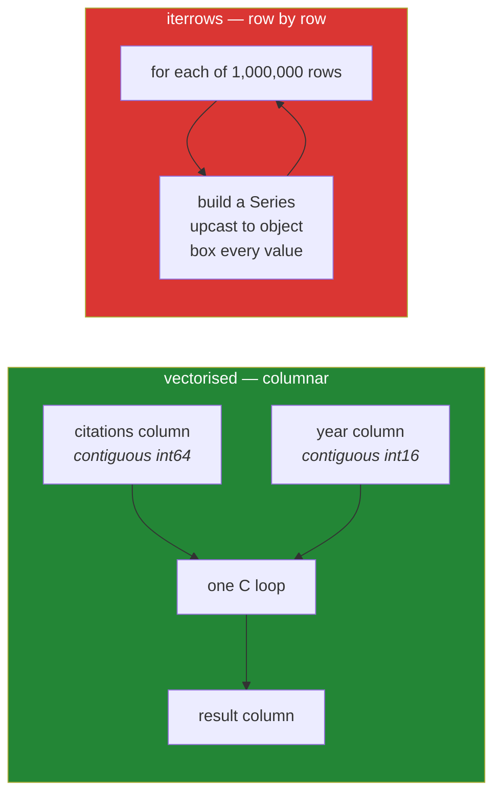

# Day 29 — Iteration vs vectorisation, sorting and ranking

**Phase 4 · Module 4** · IDs: **PD-05** (iteration), **PD-06** (sorting, ranking)

> **Yesterday:** the index, and the alignment it performs on every operation.
> **Today:** why `iterrows` is the slowest correct thing in pandas, what to write instead, and the
> ranking functions that turn "top 3 per group" from a loop into one line.
> **Tomorrow:** missing data.

```bash
./m start 29 && ./m scaffold 29
```

**Time:** 90 minutes. **Request budget:** 0 model calls.

---

## §1 The story

Every pandas beginner writes this:

```python
for index, row in df.iterrows():
    df.loc[index, "score"] = row["citations"] / row["year"]
```

It is correct. On a million rows it takes minutes. The vectorised version takes milliseconds, and the
reason is not "loops are slow" — it is what `iterrows` has to *do* on every iteration:

1. Pull one row out of columnar storage, which is scattered across memory by design.
2. Build a **new Series object** for it, with its own index.
3. Because a row spans columns of different dtypes, upcast everything to `object` — so your `int64`
   becomes a boxed Python int, and any dtype guarantee you established on Day 27 is gone inside the
   loop.



A dataframe is **columns**. Reaching across them one row at a time fights the storage layout.

So there is a ladder, and you climb down it only as far as you must:

| Rung | What | Speed |
|---|---|---|
| 1 | A vectorised expression: `df["a"] / df["b"]` | fastest |
| 2 | `np.where` / `np.select` for conditionals | fast |
| 3 | `.map` on a Series with a dict | fine |
| 4 | `.apply(axis=0)` on one column | slowish |
| 5 | `.apply(axis=1)` across columns | slow — it is a loop wearing a hat |
| 6 | `itertuples()` | slow, but far better than `iterrows` |
| 7 | `iterrows()` | slowest correct thing in pandas |

**Rung 5 is the one people think is vectorised.** `df.apply(func, axis=1)` calls your Python function
once per row. It is `iterrows` with nicer syntax.

The second half is **sorting and ranking**, and one idea worth having early: `rank(method=...)` has
five tie policies, and picking the wrong one silently changes your answer. Day 31's "top 3 papers per
field" is built on this.

---

## §2 Setup — run this

```bash
mkdir -p days/day-29/lab
touch days/day-29/lab/vectorise.py
```

`src/setu/frames.py` grows today. No new packages.

---

## §3 PD-05 — the ladder, measured

`days/day-29/lab/vectorise.py`:

```python
"""PD-05 / PD-06: climb down the ladder only as far as you must."""

from __future__ import annotations

import time

import numpy as np
import pandas as pd


def make_frame(n: int = 200_000) -> pd.DataFrame:
    rng = np.random.default_rng(0)
    return pd.DataFrame(
        {
            "citations": rng.integers(0, 100_000, n),
            "year": rng.integers(2000, 2025, n),
            "venue": rng.choice(["neurips", "icml", "acl", "iclr"], n),
        }
    )


def timed(label: str, fn) -> tuple[float, object]:
    start = time.perf_counter()
    result = fn()
    elapsed = time.perf_counter() - start
    print(f"  {label:<28} {elapsed:>7.3f}s")
    return elapsed, result


def the_ladder() -> None:
    df = make_frame()
    print(f"\ncitations / year over {len(df):,} rows")

    def vectorised():
        return df["citations"] / df["year"]

    def with_numpy():
        return pd.Series(df["citations"].to_numpy() / df["year"].to_numpy(), index=df.index)

    def apply_axis1():
        return df.apply(lambda r: r["citations"] / r["year"], axis=1)

    def with_itertuples():
        return pd.Series([r.citations / r.year for r in df.itertuples()], index=df.index)

    def with_iterrows():
        return pd.Series([r["citations"] / r["year"] for _, r in df.iterrows()], index=df.index)

    fast, expected = timed("vectorised", vectorised)
    timed("numpy arrays", with_numpy)
    t_apply, a = timed("apply(axis=1)", apply_axis1)
    t_tuples, b = timed("itertuples", with_itertuples)
    t_rows, c = timed("iterrows", with_iterrows)

    print(f"\n  apply(axis=1) is {t_apply / fast:>6,.0f}x slower")
    print(f"  itertuples    is {t_tuples / fast:>6,.0f}x slower")
    print(f"  iterrows      is {t_rows / fast:>6,.0f}x slower")
    print(f"\n  all identical: {all(np.allclose(expected, x) for x in (a, b, c))}")


def iterrows_also_destroys_dtypes() -> None:
    df = pd.DataFrame({"n": pd.array([1, 2], dtype="int16"), "s": ["a", "b"]})
    print(f"\n{df.dtypes.to_dict()=}")
    _, row = next(df.iterrows())
    print(f"{row.dtype=}   <- object: every value boxed")
    print(f"{type(row['n']).__name__=}   <- your int16 is gone")

    first = next(df.itertuples())
    print(f"\n{type(first.n).__name__=}   <- itertuples preserves the dtype")
    print("  ^ if you MUST loop, itertuples. Never iterrows.")


def conditionals_without_apply() -> None:
    df = make_frame(10)

    df["tier"] = np.where(df["citations"] > 50_000, "high", "low")
    print(f"\n{df['tier'].tolist()[:5]=}   <- np.where: two branches")

    conditions = [df["citations"] > 75_000, df["citations"] > 25_000]
    choices = ["high", "medium"]
    df["tier3"] = np.select(conditions, choices, default="low")
    print(f"{df['tier3'].tolist()[:5]=}   <- np.select: many branches, first match wins")

    lookup = {"neurips": "ML", "icml": "ML", "acl": "NLP", "iclr": "ML"}
    df["field"] = df["venue"].map(lookup)
    print(f"{df['field'].tolist()[:5]=}   <- .map with a dict")
    print(f"{df['venue'].map({'acl': 'NLP'}).isna().sum()=}   <- unmapped values become NaN")

    df["bucket"] = pd.cut(df["citations"], bins=[0, 25_000, 75_000, np.inf],
                          labels=["low", "mid", "high"])
    print(f"{df['bucket'].dtype=}   <- pd.cut returns a CATEGORICAL (Day 34)")


def when_apply_is_acceptable() -> None:
    print("\n  apply(axis=1) is defensible when ALL of these hold:")
    for reason in (
        "the frame is small (say under 10k rows)",
        "the logic genuinely spans columns and has no vectorised form",
        "you have measured it and it is not the bottleneck",
        "the alternative would be unreadable",
    ):
        print(f"    - {reason}")
    print("  Otherwise: np.select, .map, or a merge (Day 32).")
```

**Line by line:**

- `timed(...)` — returns both the duration and the result, so the last line can assert all five
  approaches agree. **Always check that the fast version gives the same answer**; a fast wrong answer
  is worse than a slow right one.
- `df["citations"] / df["year"]` — one expression. Pandas dispatches to NumPy, which runs one C loop
  over two contiguous columns.
- `with_numpy` using `.to_numpy()` — drops the index and works on raw arrays. Marginally faster than
  the pandas expression because it skips alignment. Only reach for it when profiling says so.
- `df.apply(lambda r: ..., axis=1)` — **calls your lambda once per row.** Typically 100–1000× slower
  than the vectorised form. Run it and read your own number.
- `itertuples()` — yields **namedtuples**, which are far cheaper to construct than Series and
  **preserve dtypes**. If you genuinely must loop, this is the one.
- `iterrows()` — yields `(index, Series)` pairs. Slowest, and it destroys your dtypes.
- `iterrows_also_destroys_dtypes` — this is the argument people miss. A row spans columns of different
  types, so the Series holding it must be `object`, so your `int16` becomes a boxed Python `int`.
  Every dtype decision from Day 27 evaporates inside the loop.
- `np.where(cond, a, b)` — two branches, vectorised (Day 23).
- `np.select(conditions, choices, default=...)` — many branches, **first match wins**, so order your
  conditions from most to least specific. This replaces the vast majority of `apply(axis=1)` uses.
- `.map(dict)` — element-wise lookup on a Series. Unmapped values become NaN, which is either what you
  want or a silent data loss — **check `.isna().sum()` after every `.map`.**
- `pd.cut` — binning. Returns a **categorical** dtype (Day 34), and note that its intervals are
  right-inclusive by default, unlike `.between` from Day 28. The inconsistency is real; read the docs.

---

## §4 PD-06 — sorting and ranking

Add to the same file:

```python
def sorting() -> None:
    df = pd.DataFrame(
        {"title": ["zebra", "alpha", "new", "beta"], "year": [2018, 2018, 2020, 2018],
         "citations": [10, 30, 5, 30]},
        index=["p1", "p2", "p3", "p4"],
    )

    print(f"\n{df.sort_values('citations', ascending=False).index.tolist()=}")
    print(f"{df.sort_values(['year', 'title'], ascending=[False, True]).index.tolist()=}")
    print("  ^ multi-key with per-key direction. Day 15's Paper.__lt__, in pandas.")

    print(f"\n{df.sort_values('citations', kind='stable').index.tolist()=}")
    print("  ^ kind='stable' when tie order is part of your contract (Day 23)")

    print(f"\n{df.sort_index().index.tolist()=}")
    print(f"{df.nlargest(2, 'citations').index.tolist()=}   <- top-k without a full sort")
    print(f"{df.nsmallest(2, 'citations').index.tolist()=}")
    print("  ^ nlargest is pandas' argpartition (Day 23): O(n) for a small k")

    with_nan = pd.Series([3.0, np.nan, 1.0])
    print(f"\n{with_nan.sort_values().tolist()=}          <- NaN LAST by default")
    print(f"{with_nan.sort_values(na_position='first').tolist()=}")


def ranking_and_ties() -> None:
    s = pd.Series([10, 20, 20, 30], index=["a", "b", "c", "d"])
    print(f"\nvalues: {s.tolist()}")
    for method in ("average", "min", "max", "first", "dense"):
        print(f"  rank(method={method!r:<9}) -> {s.rank(method=method).tolist()}")

    print("\n  average : the default; ties share the mean rank (2.5, 2.5)")
    print("  min     : competition ranking - 1, 2, 2, 4")
    print("  max     : 1, 3, 3, 4")
    print("  first   : ties broken by ORDER OF APPEARANCE - 1, 2, 3, 4")
    print("  dense   : no gaps after a tie - 1, 2, 2, 3")
    print("\n  Choosing wrong silently changes your answer. Decide, then write it down.")

    print(f"\n{s.rank(ascending=False, method='min').tolist()=}   <- rank 1 = largest")
    print(f"{s.rank(pct=True).round(2).tolist()=}                <- percentile rank")


def top_k_per_group() -> None:
    df = pd.DataFrame(
        {
            "venue": ["acl", "acl", "acl", "icml", "icml"],
            "title": ["a", "b", "c", "d", "e"],
            "citations": [10, 30, 20, 5, 50],
        }
    )
    ranked = df.assign(r=df.groupby("venue")["citations"].rank(method="first", ascending=False))
    top = ranked.loc[ranked["r"] <= 2].sort_values(["venue", "r"])
    print(f"\n{top[['venue', 'title', 'citations']].to_dict('records')=}")
    print("  ^ top 2 per venue, no loop. Day 31 explains the groupby half.")


if __name__ == "__main__":
    the_ladder()
    iterrows_also_destroys_dtypes()
    conditionals_without_apply()
    when_apply_is_acceptable()
    sorting()
    ranking_and_ties()
    top_k_per_group()
```

**Line by line:**

- `sort_values(['year', 'title'], ascending=[False, True])` — multi-key with a **direction per key**.
  This is Day 15's `Paper.__lt__` and Day 23's `lexsort`, third spelling. (Note pandas takes keys in
  primary-first order, unlike `np.lexsort` — one fewer thing to get backwards.)
- `kind='stable'` — same reasoning as Day 23. The default is not stable, so tied rows can come back in
  a different order between runs.
- `nlargest(2, 'citations')` — **pandas' `argpartition`.** It does not fully sort; for a small `k` on
  a large frame it is dramatically faster than `sort_values(...).head(k)`.
- `sort_values()` puts NaN **last** by default, in both directions. That is a deliberate choice and
  the opposite of what Day 23's negation trick does in NumPy — worth noticing, because it means the
  pandas default is the *safe* one here.
- The five `rank` methods — **run this and read the five lines of output.** They are all defensible and
  they give different answers:
  - `average` (default) shares the mean rank among ties — good for statistics, produces `2.5`.
  - `min` is competition ranking — two silver medals, no bronze.
  - `first` breaks ties by position — the only one that guarantees distinct integer ranks, which is
    why `top_k_per_group` uses it.
  - `dense` leaves no gaps — good for "how many distinct levels above me".
- `rank(pct=True)` — percentile rank in `[0, 1]`. Day 82's feature engineering uses this to make a
  feature scale-free.
- `top_k_per_group` — `groupby(...).rank(...)` then filter. This is the standard idiom and it is one
  line; the alternative people write is a loop over groups with a `sort_values().head(2)` inside,
  which is rungs 6–7 of the ladder in disguise.

---

## §5 Build brief

Extend `src/setu/frames.py`:

```python
def add_derived(frame, name: str, expression) -> pd.DataFrame:
    """TODO(me): return a NEW frame with a derived column added.

    - `expression` is a callable taking the frame and returning a Series
    - raise DataError if `name` already exists (silently overwriting a column is
      how a pipeline loses data)
    - raise DataError if the returned Series' index does not match the frame's
    - never mutate the input (ADR-001)
    """
    raise NotImplementedError


def bucketise(series, *, edges: list[float], labels: list[str]) -> pd.Series:
    """TODO(me): bin a numeric Series with np.select (NOT apply, NOT a loop).

    - len(labels) must be len(edges) + 1; raise DataError otherwise
    - edges must be strictly increasing; raise DataError otherwise
    - NaN input gives NaN output, never a bucket
    - return a categorical with the labels in the given ORDER (ordered=True)
    """
    raise NotImplementedError


def top_n_per_group(frame, *, group: str, value: str, n: int, ascending: bool = False):
    """TODO(me): the n highest-`value` rows within each `group`.

    - use groupby().rank(method='first') - deterministic, no gaps, no loop
    - preserve the original index
    - ties broken by position, so the result is reproducible run to run
    - raise DataError if n < 1 or if either column is missing
    """
    raise NotImplementedError


def rank_column(frame, column: str, *, method: str = "min", ascending: bool = False) -> pd.Series:
    """TODO(me): rank a column, validating `method` against the five legal values.

    Raise DataError naming all five if an unknown method is passed - a typo'd
    method name must not fall back to the default.
    """
    raise NotImplementedError
```

- `add_derived` refusing to overwrite is a small rule with a large payoff: in a forty-step pipeline,
  a column silently replaced three steps before you read it is genuinely hard to find.
- `bucketise` forbidding `apply` is the day's discipline made mechanical. `np.select` is the tool.
- `rank_column` validating the method name matters because `Series.rank(method="firts")` raises a
  `ValueError` from deep inside pandas with an unhelpful message — catching it at your boundary with
  the five options listed is kinder to future-you.

---

## §6 The eval that must be able to fail

Add to `tests/test_frames.py`:

```python
from setu.frames import add_derived, bucketise, rank_column, top_n_per_group


def test_add_derived_returns_a_new_frame(papers):
    out = add_derived(papers, "decade", lambda f: f["year"] // 10 * 10)
    assert "decade" in out.columns
    assert "decade" not in papers.columns, "the input frame was mutated"


def test_add_derived_refuses_to_overwrite(papers):
    with pytest.raises(DataError):
        add_derived(papers, "year", lambda f: f["year"] + 1)


def test_add_derived_rejects_a_misaligned_result(papers):
    foreign = pd.Series([1, 2, 3], index=["x", "y", "z"])
    with pytest.raises(DataError):
        add_derived(papers, "z", lambda f: foreign)


def test_bucketise_assigns_the_right_buckets():
    s = pd.Series([5.0, 50.0, 500.0])
    out = bucketise(s, edges=[10.0, 100.0], labels=["low", "mid", "high"])
    assert out.tolist() == ["low", "mid", "high"]


def test_bucketise_keeps_nan_as_nan():
    out = bucketise(pd.Series([5.0, np.nan]), edges=[10.0], labels=["low", "high"])
    assert pd.isna(out.iloc[1]), "NaN was assigned a bucket"


def test_bucketise_result_is_ordered_categorical():
    out = bucketise(pd.Series([5.0, 50.0]), edges=[10.0], labels=["low", "high"])
    assert out.dtype.ordered is True
    assert list(out.dtype.categories) == ["low", "high"]


@pytest.mark.parametrize(
    ("edges", "labels"),
    [([10.0], ["a", "b", "c"]), ([10.0, 5.0], ["a", "b", "c"]), ([], ["a"])],
)
def test_bucketise_rejects_bad_specs(edges, labels):
    with pytest.raises(DataError):
        bucketise(pd.Series([1.0]), edges=edges, labels=labels)


def test_bucketise_is_vectorised():
    """200k rows must be fast; apply would not be."""
    import time

    s = pd.Series(np.random.default_rng(0).random(200_000) * 1000)
    start = time.perf_counter()
    bucketise(s, edges=[100.0, 500.0], labels=["a", "b", "c"])
    assert time.perf_counter() - start < 1.0, "are you using .apply?"


def test_top_n_per_group():
    frame = pd.DataFrame(
        {"g": ["a", "a", "a", "b", "b"], "v": [1, 3, 2, 5, 4]},
        index=["r0", "r1", "r2", "r3", "r4"],
    )
    out = top_n_per_group(frame, group="g", value="v", n=2)
    assert set(out.index) == {"r1", "r2", "r3", "r4"}


def test_top_n_per_group_preserves_the_index():
    frame = pd.DataFrame({"g": ["a", "a"], "v": [1, 2]}, index=["p9", "p8"])
    out = top_n_per_group(frame, group="g", value="v", n=1)
    assert out.index.tolist() == ["p8"]


def test_top_n_per_group_is_deterministic_with_ties():
    frame = pd.DataFrame({"g": ["a"] * 4, "v": [5, 5, 5, 5]})
    first = top_n_per_group(frame, group="g", value="v", n=2)
    second = top_n_per_group(frame, group="g", value="v", n=2)
    assert first.index.tolist() == second.index.tolist(), "tie order changed between runs"
    assert len(first) == 2, "a tie returned more than n rows - use method='first'"


def test_top_n_per_group_handles_a_small_group():
    frame = pd.DataFrame({"g": ["a", "b"], "v": [1, 2]})
    assert len(top_n_per_group(frame, group="g", value="v", n=5)) == 2


def test_rank_column_rejects_an_unknown_method(papers):
    with pytest.raises(DataError) as info:
        rank_column(papers, "year", method="firts")
    assert "first" in str(info.value) and "dense" in str(info.value)


@pytest.mark.parametrize(
    ("method", "expected"),
    [
        ("min", [1.0, 2.0, 2.0, 4.0]),
        ("dense", [1.0, 2.0, 2.0, 3.0]),
        ("first", [1.0, 2.0, 3.0, 4.0]),
    ],
)
def test_rank_methods_differ(method, expected):
    frame = pd.DataFrame({"v": [30, 20, 20, 10]})
    assert rank_column(frame, "v", method=method).tolist() == expected
```

**Line by line:**

- `test_add_derived_refuses_to_overwrite` — the small rule, asserted. Removing the check makes it
  silently replace `year`, which is exactly the pipeline bug it prevents.
- `test_bucketise_is_vectorised` — **a performance assertion**, fourth in the plan. 200 000 rows
  through `np.select` is milliseconds; through `.apply` it is seconds. The message names the likely
  cause.
- `test_top_n_per_group_is_deterministic_with_ties` — **the day's real assessment.** Four identical
  values, `n=2`. Two things must hold: exactly two rows come back (`method='min'` would return all
  four, since all rank 1), and the same two every time. This is precisely what `method='first'` is
  for, and no other tie policy satisfies both assertions.
- `test_rank_methods_differ` — three parametrised cases with hand-computed expectations, so the five
  policies from §4 are not just described but pinned.
- `test_bucketise_result_is_ordered_categorical` — `ordered=True` matters because it makes `<` and
  `>` comparisons work on the buckets, which Day 34 and Day 88's wine-quality case study both rely on.

```bash
uv run python -m pytest tests/test_frames.py -v
```

---

## §7 Request budget

| Resource | Spent today |
|---|---|
| LLM calls | **0** |

---

## §8 Traps

- **`iterrows`.** Slowest correct thing in pandas, and it destroys your dtypes.
- **Thinking `apply(axis=1)` is vectorised.** It is a loop with nicer syntax.
- **`np.select` with conditions in the wrong order.** First match wins; most specific first.
- **`.map` without checking for NaN afterwards.** Unmapped values vanish silently.
- **`sort_values(...).head(k)` for a small k.** Use `nlargest`.
- **Relying on the default `rank` method.** `average` produces fractional ranks; decide explicitly.
- **`method='min'` for top-n.** A four-way tie returns four rows when you asked for two.
- **Unstable sorts when tie order matters.** Pass `kind='stable'`.
- **Assuming `pd.cut` is left-inclusive.** It is right-inclusive by default, unlike `.between`.
- **Overwriting an existing column by accident.** Three steps later, nothing makes sense.

---

## §9 Verify before you code

Written **2026-08-21**:

- <https://pandas.pydata.org/docs/user_guide/basics.html#iteration> — including the official warning
  against modifying while iterating.
- <https://pandas.pydata.org/docs/reference/api/pandas.Series.rank.html> — the five `method` values.
- <https://pandas.pydata.org/docs/reference/api/pandas.DataFrame.nlargest.html> — the `keep` argument
  for ties.
- <https://pandas.pydata.org/docs/reference/api/pandas.cut.html> — confirm the `right=` default.

---

## §10 Say it in an interview

> "A dataframe is columns, so reaching across them one row at a time fights the storage layout —
> `iterrows` has to build a fresh Series per row and upcast everything to object, which throws away
> the dtypes you carefully set at read time. I measured it at a few hundred times slower than the
> vectorised expression on two hundred thousand rows. The thing people miss is that `apply(axis=1)` is
> in the same category; it's a loop with nicer syntax. Almost every use of it is really `np.select` or
> a `.map` or a merge. And for top-n-per-group I always rank with `method='first'`, because `min`
> returns four rows for a four-way tie when you asked for two — there's a test asserting exactly that,
> and that the tie order is stable between runs."

---

## §11 Done when

Tick [`CHECKLIST.md`](CHECKLIST.md), then `./m check && ./m done 29`.
