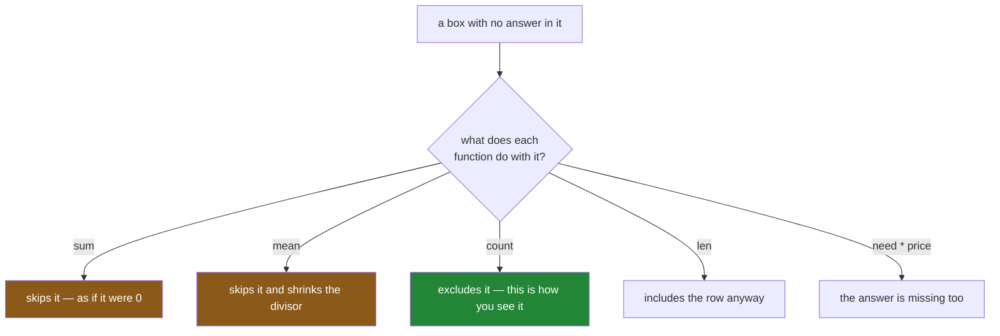

# 1.1 — The price nobody wrote down

## One-line answer

A blank in a table is **not a zero and not an empty box** — it is the absence of an answer, and every
sum, mean and comparison you run afterwards has to decide what to do about it, whether or not you
told it to.

---

## The story

The flat does the shop on a Saturday. Four things on the list: milk, bread, eggs, rice. Somebody
walks round, pays, and pins the receipt to the fridge so the money can be split on Sunday.

This Saturday the receipt came out of the pocket in two pieces. Three prices are readable. The line
with the eggs on it tore straight through the number.

So somebody types the list up anyway, and leaves that one box empty. Everything else is there: how
many eggs, which aisle they were in, who paid. Just not what they cost.

On Sunday somebody adds up the column to work out what each person owes, and the total comes out at
four pounds sixty. Nobody notices, because four pounds sixty is a completely believable number for a
Saturday shop. The eggs are simply not in it.

Then somebody else works out the average price of a thing on the list, and gets one pound
fifty-three. Also believable. Also computed from three numbers, not four.

Nobody typed a zero. Nobody typed anything at all. And yet the two answers behave differently: the
total quietly treated the missing egg price as nothing, and the average quietly treated it as not
there. Neither of those is wrong, exactly — but they are different decisions, and nobody made either
of them on purpose.

---

## The idea in plain language

A **table** is a grid of boxes: a row for each thing, a column for each fact about it. In pandas that
grid is a **DataFrame**, introduced on
[Day 26, 1.3](../../../day-26-frames-and-copy-on-write/parts/01-the-two-objects/1.3-a-table-of-columns.md).
Each column holds one kind of value all the way down — one **dtype**, the word pandas uses for the
kind of thing a column stores
([Day 26, 1.4](../../../day-26-frames-and-copy-on-write/parts/01-the-two-objects/1.4-one-dtype-per-column.md)).

Now: what goes in a box when nobody knows the answer?

It cannot be a number, because there is no number. It cannot be left literally empty either, because
a column is a block of memory with the same amount of room reserved for every row — there is no way
to store "nothing" in a slot that is eight bytes wide and expects a number in it. So the box has to
hold **a value that means "there is no value here"**. That value is called a **missing value**, and
its written form in pandas is a **blank**, printed as `NaN`, `<NA>` or `NaT` depending on the
column's dtype.

Three things it is *not*, and each mistake is one people actually make:

- **It is not a zero.** Zero is a real price: it means the thing was free. The missing egg price
  means nobody knows what the eggs cost. If you replace one with the other, you have not filled a
  gap — you have asserted something false.
- **It is not an empty piece of text.** `""` is a string of length zero. It is a real value that
  happens to have no characters in it. A name field containing `""` says somebody typed nothing; a
  name field that is missing says nobody was asked.
- **It is not "wrong data".** The row is perfectly good. Six eggs really were bought, from aisle
  seven, by whoever did the shop. One fact about that row is unknown; the rest of it is fine, and
  throwing the whole row away costs you every other fact on it.

The reason this matters immediately, rather than eventually, is that **pandas already has an opinion
about blanks and applies it without telling you.** Ask a column for its sum and it adds up the values
it has, ignoring the blanks. Ask for its mean and it divides by the count of values it has, not by
the number of rows. Ask how long the column is and you get every row, blanks included. Three
functions, three different treatments of the same blank, none of them announced.

That is the whole subject of today. Not "how do I get rid of blanks" — that comes later — but
**what a blank is, what everything downstream silently does with it, and who gets to decide.**

---

## Why Setu needs it

- **[1.2](1.2-nan-the-number-not-equal-to-itself.md)** shows why you cannot find the blank by asking
  `price == blank`. That is the first thing everybody tries, and it returns nothing at all.
- **[2.1](../02-finding-it/2.1-isna-and-notna.md)** is the tool that does find it, and it exists
  precisely because comparison does not work.
- **[4.1](../04-dropping/4.1-dropna-and-the-rows-that-left.md)** and
  **[5.1](../05-filling/5.1-fillna-is-a-claim.md)** are the two things you can do about a blank, and
  both are choices you must be able to defend.
- **[6.1](../06-the-leak/6.1-the-median-that-saw-the-test-set.md)** is where a careless fill becomes
  a correctness bug rather than a style problem — the day's real subject.
- **Day 76** builds the feature pipeline that has to handle blanks on data it has never seen, and
  **Day 91** puts the imputer inside a pipeline object so that it cannot be run out of order. Both
  depend on today's distinction between "there is no value" and "the value is zero".

---

## The mechanism

Here is the list as it went into the computer, with the torn line left empty:

```python
import pandas as pd

shop = pd.DataFrame(
    {
        "item": pd.Series(["milk", "bread", "eggs", "rice"], dtype="str"),
        "need": [2, 1, 6, 1],
        "price": [1.15, 1.40, None, 2.05],
        "aisle": pd.Series(["07", "03", "07", "11"], dtype="str"),
    }
).set_index("item")

print(shop)
print()
print(shop.dtypes)
```

**Line by line:**

- `pd.DataFrame({...})` builds the table from a dictionary of columns — one key per column, exactly
  as on [Day 26, 1.3](../../../day-26-frames-and-copy-on-write/parts/01-the-two-objects/1.3-a-table-of-columns.md).
- `pd.Series([...], dtype="str")` states the dtype for the two text columns rather than letting
  pandas infer it. Inference would give the same answer here, but writing it down means the column's
  type is a decision in the file rather than a guess made at run time (Principle 4).
- `"price": [1.15, 1.40, None, 2.05]` — **`None` is Python's own word for "nothing there"**, and it
  is what a person naturally types for the torn line. What pandas stores instead is the subject of
  [1.3](1.3-none-is-not-what-gets-stored.md).
- `"aisle"` is `"07"` rather than `7`, because an aisle number is a label and not a quantity. Day 27
  covers what happens when a leading zero meets a numeric column
  ([Day 27, 1.3](../../../day-27-reading-and-writing/parts/01-the-csv/1.3-when-the-guess-is-wrong.md)).
- `.set_index("item")` makes the item name the row label, so the four rows can be referred to by name
  ([Day 26, 1.2](../../../day-26-frames-and-copy-on-write/parts/01-the-two-objects/1.2-the-index-is-not-a-row-number.md)).
- `shop.dtypes` prints the kind of each column. The `price` column's dtype is the first clue about
  what happened to the `None`.

```text
       need  price aisle
item
milk      2   1.15    07
bread     1   1.40    03
eggs      6    NaN    07
rice      1   2.05    11

need       int64
price    float64
aisle        str
dtype: object
```

The empty box prints as `NaN`. Nothing was typed there and something is stored there anyway.

Now the three questions from the story, asked of that column:

```python
print("sum   :", shop["price"].sum())
print("mean  :", shop["price"].mean())
print("count :", shop["price"].count())
print("len   :", len(shop))
print("is it zero? :", shop.loc["eggs", "price"] == 0)
```

**Line by line:**

- `shop["price"].sum()` — adds the column up. **It skips the blank**, so the total is the sum of
  three numbers. It does not raise, it does not warn, and it does not tell you that it skipped
  anything.
- `.mean()` — the average. It skips the blank **and** divides by three rather than four, which is
  the honest choice and also a different choice from the one `sum` made.
- `.count()` — pandas' name for "how many values are actually here". It is the one function on this
  list whose job is to be blank-aware, and it is the quickest way to notice a blank exists.
- `len(shop)` — how many rows the frame has, blanks included. **`count()` and `len()` disagreeing is
  the definition of a missing value**, and that gap is the whole diagnosis.
- `shop.loc["eggs", "price"] == 0` — asked directly, so there is no doubt: the blank is not a zero.
  `.loc` is label-based lookup from
  [Day 28, 1.2](../../../day-28-selection-and-alignment/parts/01-label-and-position/1.2-loc-by-label.md).

```text
sum   : 4.6
mean  : 1.5333333333333332
count : 3
len   : 4
is it zero? : False
```

**Read those five lines together.** `4.6` is the sum of `1.15 + 1.40 + 2.05` — the eggs contributed
nothing, as if they were free. `1.53` is `4.6 / 3` — the eggs were not counted at all. Same column,
same blank, two different treatments. And `count` says 3 while `len` says 4, which is the only line
of the five that makes the blank visible.

The blank also spreads. Multiply the two columns together to get a line total for each item:

```python
print(shop["need"] * shop["price"])
```

**Line by line:**

- `shop["need"] * shop["price"]` multiplies the two columns elementwise, row by row, as on
  [Day 29, 2.1](../../../day-29-iteration-and-order/parts/02-vectorised/2.1-one-operation-every-row.md).
- Six eggs times *nothing* is **still nothing**. Arithmetic on a missing value gives a missing value,
  which is the correct answer: if you do not know the unit price, you do not know the line total
  either.
- Note which rows survive. The blank did not spoil the other three; it travelled down its own row
  only.

```text
item
milk     2.30
bread    1.40
eggs      NaN
rice      2.05
dtype: float64
```

Here is the shape of the whole thing:



**Only the green box tells you anything.** The two orange ones give a plausible number computed from
a decision nobody made.

---

## When it breaks

**The total that quietly lost a line:**

```text
$ uv run python -c "
import pandas as pd
shop = pd.DataFrame({'price': [1.15, 1.40, None, 2.05]}, index=['milk', 'bread', 'eggs', 'rice'])
print('total    :', shop['price'].sum())
print('rows     :', len(shop))
print('values   :', shop['price'].count())
print('per head :', shop['price'].sum() / 4)
"
```

```text
total    : 4.6
rows     : 4
values   : 3
per head : 1.15
```

**What it means.** The flat splits `4.60` four ways and each person pays `1.15`. The eggs are not in
that total, so everybody is underpaying by a quarter of whatever the eggs cost, and the arithmetic on
the screen is flawless. **Nothing raised.** This is the failure mode of missing data in general: not
a crash, a plausible answer.

The line that catches it is the third one. `rows` is 4 and `values` is 3, and that one-line
difference is the entire signal.

**The sum of a column that is nothing but blanks:**

```text
$ uv run python -c "
import pandas as pd
print('sum  :', pd.Series([None, None], dtype='float64').sum())
print('mean :', pd.Series([None, None], dtype='float64').mean())
"
```

```text
sum  : 0.0
mean : nan
```

**What it means.** A column with no data in it at all sums to **zero** — a real number, printed
without a warning, ready to be put in a report. The mean at least comes back blank, because there is
nothing to divide by.

This is the single most dangerous default on the page, and it is worth knowing why it is the default:
`sum` is defined as adding up what is there, and adding up nothing gives zero. That is
mathematically respectable and practically lethal, because a column that failed to load looks exactly
like a column of genuine zeroes. If a total ever matters, check `count()` before you print it.

**Asking whether the value is missing, the obvious way:**

```text
$ uv run python -c "
import pandas as pd
shop = pd.DataFrame({'price': [1.15, 1.40, None, 2.05]}, index=['milk', 'bread', 'eggs', 'rice'])
print(shop[shop['price'] == None])
print('rows found:', len(shop[shop['price'] == None]))
"
```

```text
Empty DataFrame
Columns: [price]
Index: []
rows found: 0
```

**What it means.** There is visibly a blank in that column, and asking for the rows where the price
equals nothing returns **no rows at all**. No error, no warning, an empty answer to a question with
an obvious answer.

That behaviour has a specific cause and it is the subject of the next part
([1.2](1.2-nan-the-number-not-equal-to-itself.md)). For now the practical rule is: **you never find a
blank by comparing to one.**

---

## In production

**What a professional writes instead of the teaching version.** They do not compute a total and hope.
They assert the shape of the data before trusting a number out of it:

```python
import pandas as pd


def total_spend(shop: pd.DataFrame) -> float:
    """The bill for this shop. Refuses to answer if any price is unknown."""
    unknown = shop["price"].isna()
    if unknown.any():
        raise ValueError(
            f"{int(unknown.sum())} of {len(shop)} prices are missing: "
            f"{shop.index[unknown].tolist()}"
        )
    return float((shop["need"] * shop["price"]).sum())
```

**Line by line:**

- `shop["price"].isna()` — the blank-finding tool from
  [2.1](../02-finding-it/2.1-isna-and-notna.md). It is used here rather than a comparison because a
  comparison finds nothing.
- `if unknown.any():` — **the function refuses rather than guessing.** A bill is exactly the kind of
  number where a silently smaller answer is worse than no answer.
- The message carries **both** the count and the row labels, because "3 of 400 prices are missing"
  and "which ones" are two different questions and a person debugging at night wants both.
- `float(...)` on the return, so the caller gets a plain Python number rather than a NumPy scalar
  that prints as `np.float64(4.6)` — a small courtesy that stops the type leaking into logs.
- Note what it does **not** do: it does not fill anything in. Deciding what a missing price means is
  the caller's business ([3.1](../03-why-it-is-missing/3.1-three-reasons-a-line-is-blank.md)), and a
  function that quietly substitutes a value has made that decision for everyone.

**What changes at scale.** On four rows a blank is visible in the printout. On four million it is
not, and the printed frame shows you the first five rows and the last five. Real tables carry blanks
in places nobody has looked, so the professional habit is to make blank-counting part of loading:
every table that enters a system gets a one-line profile — rows in, values per column, blanks per
column — logged next to it. That profile costs one pass over the data and is the difference between
noticing a broken upstream feed on the day it breaks and noticing it in a quarterly review.

**The failure that only shows with real data.** A column arrives full for months and then a supplier
changes a form field, and from one Tuesday onward it is ninety per cent blank. Every downstream sum
keeps working. Every average keeps looking sane, because the mean of the ten per cent that survived
is close to the old mean. The only number that moved was `count`, and nobody was watching it. This
is why blank counts belong in monitoring alongside row counts, and why the useful alert is *"the
share of blanks in this column changed"* rather than *"this column has blanks"*.

**The review comment a senior engineer leaves.** *"`df['price'].sum()` — what happens when a price is
missing? Right now it is treated as zero and the bill comes out low. Either assert `notna().all()`
before summing or state the fill and why. Do not let the default decide."*

**The interview question.** *"What does `sum()` do with missing values in pandas?"* It skips them,
which means it behaves as if they were zero; `mean()` skips them and also shrinks the divisor, so the
two functions treat the same blank differently. The follow-up is the one that matters: *"what does an
all-blank column sum to?"* Zero — a real, confident-looking number that is indistinguishable from a
column of genuine zeroes, which is why `count()` next to `len()` is the check worth running before
you trust any aggregate.

---

## Check yourself

```bash
uv run python -c "
import pandas as pd
shop = pd.DataFrame(
    {'need': [2, 1, 6, 1], 'price': [1.15, 1.40, None, 2.05]},
    index=pd.Index(['milk', 'bread', 'eggs', 'rice'], name='item'),
)
print('rows        :', len(shop))
print('prices known:', shop['price'].count())
print('sum         :', shop['price'].sum())
print('mean        :', shop['price'].mean())
print('sum / rows  :', shop['price'].sum() / len(shop))
print('line totals :', (shop['need'] * shop['price']).tolist())
"
```

Two of those numbers are averages of the same column and they are not the same. Say which two, and
say which one you would put in a report and why.

**Answer out loud, without scrolling up:**

> A price is missing from one row. Say what `sum` does with it, what `mean` does with it, and what
> `len` does with it — three different answers to the same blank. Then say the two-value check that
> makes the blank visible in one glance.

---

**Next:** [1.2 — `NaN`, the number that is not equal to itself](1.2-nan-the-number-not-equal-to-itself.md).
