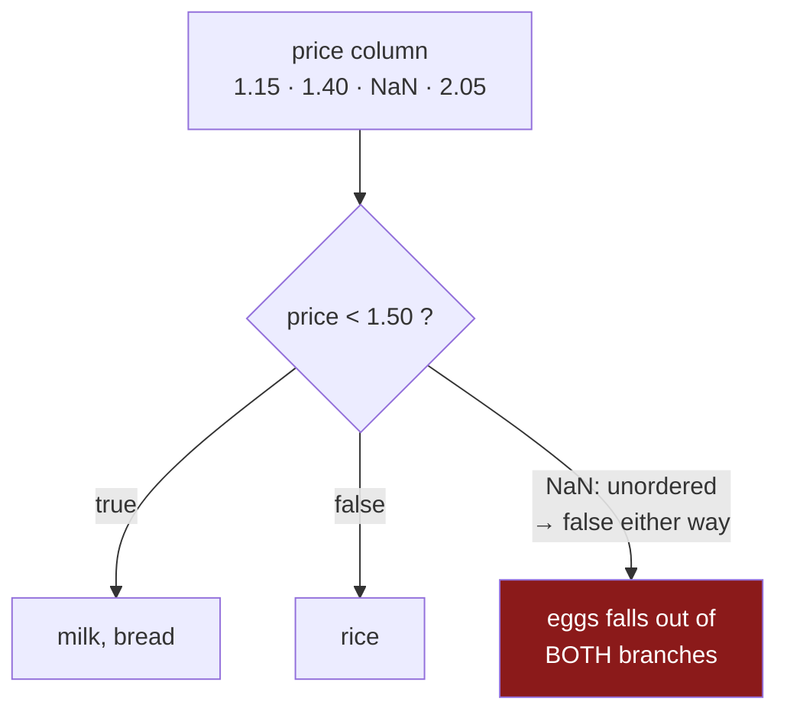

# 1.2 — `NaN`, the number that is not equal to itself

## One-line answer

The blank in a number column is a value called `NaN`, and its defining rule is that **every
comparison involving it is false — including comparing it with itself** — which is exactly why
`price == NaN` finds no rows and why you need a different tool to look for blanks.

---

## The story

Back to the torn receipt. Somebody wants the line with the missing egg price, so they do the obvious
thing and ask the spreadsheet for the row where the price box is empty.

It gives them nothing. Not an error — an empty answer, as though every price on the list were filled
in.

They can see the gap. It is right there on the screen. They try asking for the rows where the price
is not empty, expecting the other three, and get all four back instead.

At this point most people assume they have typed something wrong, and try again with different
brackets. The brackets were fine. The rule is that the empty box will not admit to being anything, so
asking "is this box the empty thing?" gets the answer no, and asking "is this box not the empty
thing?" gets the answer yes. Both of them, about a box that is visibly empty.

---

## The idea in plain language

A column of prices is stored as a block of **floating-point numbers** — the computer's way of holding
values with a decimal point, met on
[Day 20, 2.3](../../../day-20-arrays-and-dtypes/parts/02-dtypes/2.3-floats-nan-and-precision.md).
Every slot in that block is the same size, and every slot has to hold a floating-point number. There
is nowhere to put "nothing".

So the people who designed floating-point numbers reserved some of the possible bit patterns for a
value that means **"this is not a number"**. Its name is `NaN`, short for exactly that phrase. It
lives in the same block as the real numbers, takes the same amount of room, and can be added,
multiplied and averaged like any other float. What makes it useful is the one rule attached to it.

**The rule: every comparison with `NaN` is false.** `NaN < 5` is false. `NaN > 5` is false.
`NaN == 5` is false. And — the part that surprises everybody — **`NaN == NaN` is false too.** The
value is not equal to itself.

That rule is not a pandas decision or a Python decision. It is written into the *IEEE Standard for
Floating-Point Arithmetic* (IEEE 754-2019, DOI 10.1109/IEEESTD.2019.8766229), the document that
defines how a computer stores and compares fractions. The standard says a comparison where either
side is `NaN` is **unordered**, and an unordered comparison answers false — so `==`, `<` and `>` all
come back false, and `!=` comes back true.

Why would anybody want that? Because `NaN` is the answer to arithmetic that has no answer — zero
divided by zero, the square root of a negative number, infinity minus infinity. Two of those results
are not "the same value" in any meaningful sense, so saying they are equal would be a lie. The
standard chose "unordered" over "equal", and the price of that choice is the behaviour in the story.

The practical consequence for a table is direct and worth memorising:

- **`price == NaN` is false on every row, including the blank one.** So a mask built that way selects
  nothing.
- **`price != NaN` is true on every row, including the blank one.** So the negation selects
  everything.
- Any filter you write with `==` or `!=` **silently ignores the blanks**, which means the rows you
  most need to look at are the rows your filter cannot see.

There is a second surprise hiding behind the first. `NaN` is not *one* value that everything shares —
but Python's `np.nan` is one particular object, so `np.nan is np.nan` is true even though
`np.nan == np.nan` is false. **`is` asks "the same object?" and `==` asks "the same value?"**, and
`NaN` is the one case in ordinary work where those two questions give opposite answers. Relying on
`is` to find blanks works by accident on a value you typed yourself and fails on a value that came
out of a file, so it is not a technique — it is a trap that looks like one.

The tool that does work is `isna`, and it is the subject of
[2.1](../02-finding-it/2.1-isna-and-notna.md). It exists as a separate function precisely because the
comparison operators cannot be made to do this job without breaking the standard.

---

## Why Setu needs it

- **[2.1](../02-finding-it/2.1-isna-and-notna.md)** is the fix. It only makes sense once you know why
  the obvious approach fails.
- **[2.3](../02-finding-it/2.3-the-blank-that-was-not-blank.md)** is the mirror image: a file where
  somebody wrote `-1` for "unknown", which *does* compare equal and therefore hides in every
  calculation.
- **[Day 29, 4.3](../../../day-29-iteration-and-order/parts/04-sorting/4.3-na-position-and-the-rows-that-went-to-the-end.md)**
  showed blanks sorting to the end regardless of direction. That is the same rule seen from the sort's
  side: a value that compares false against everything has no place in an order.
- **[Day 23, 2.5](../../../day-23-ufuncs-and-statistics/parts/02-statistics/2.5-the-nan-family.md)**
  met the NumPy functions that skip blanks. Today is the pandas layer above them.
- **Day 76** builds features by comparing columns to thresholds. Every one of those comparisons
  quietly excludes the blank rows, and if nobody has said what should happen to them, they end up in
  whichever branch the code happens to fall through to.

---

## The mechanism

The rule itself, in four lines:

```python
import numpy as np

print("np.nan == np.nan :", np.nan == np.nan)
print("np.nan != np.nan :", np.nan != np.nan)
print("np.nan is np.nan :", np.nan is np.nan)
print("np.nan is a float:", isinstance(np.nan, float))
```

**Line by line:**

- `np.nan` is NumPy's name for the floating-point `NaN` value. It is a plain Python `float` object;
  the last line proves it, and that is why it can sit in a `float64` column without any special
  handling.
- `np.nan == np.nan` is **false** — the IEEE 754 rule, applied to a value compared with itself.
- `np.nan != np.nan` is **true**, and it is the only expression on the page that returns true. This
  is occasionally used as a hand-rolled blank test, and it works for floats and fails for every other
  kind of blank ([1.4](1.4-pd-na-and-the-answer-unknown.md), [1.5](1.5-one-dtype-one-kind-of-blank.md)).
- `np.nan is np.nan` is **true**, because `is` compares object identity rather than value, and both
  sides name the same object. **This is a fact about Python, not about `NaN`**, and it does not
  survive contact with a value read from a file.

```text
np.nan == np.nan : False
np.nan != np.nan : True
np.nan is np.nan : True
np.nan is a float: True
```

Now the same rule inside the shopping list:

```python
import numpy as np
import pandas as pd

shop = pd.DataFrame(
    {
        "item": pd.Series(["milk", "bread", "eggs", "rice"], dtype="str"),
        "need": [2, 1, 6, 1],
        "price": [1.15, 1.40, None, 2.05],
    }
).set_index("item")

print(shop["price"] == np.nan)
print()
print("rows where price == nan :", len(shop[shop["price"] == np.nan]))
print("rows where price != nan :", len(shop[shop["price"] != np.nan]))
print("rows where price < 1.50 :", len(shop[shop["price"] < 1.50]))
print("rows where price >= 1.50:", len(shop[shop["price"] >= 1.50]))
```

**Line by line:**

- `shop["price"] == np.nan` compares every row against `NaN` and produces a column of `True`/`False`
  — a **mask**, the object introduced on
  [Day 28, 2.1](../../../day-28-selection-and-alignment/parts/02-masks/2.1-a-comparison-makes-a-column.md).
  Every entry is `False`, including the row that is blank.
- `shop[mask]` keeps the rows where the mask is true
  ([Day 28, 2.2](../../../day-28-selection-and-alignment/parts/02-masks/2.2-selecting-with-a-mask.md)),
  so an all-false mask selects nothing.
- `!= np.nan` is true everywhere, so it selects all four rows — **including the blank one**, which is
  the opposite of what somebody writing that filter intends.
- The last two lines are the important pair. `< 1.50` gives two rows and `>= 1.50` gives one. **Two
  plus one is three, and the frame has four rows.** The blank fell out of both branches of a
  supposedly exhaustive split, and neither branch reported it.

```text
item
milk     False
bread    False
eggs     False
rice     False
Name: price, dtype: bool

rows where price == nan : 0
rows where price != nan : 4
rows where price < 1.50 : 2
rows where price >= 1.50: 1
```

**That two-plus-one-is-not-four line is the whole part.** A condition and its opposite should account
for every row. With a blank in the column, they do not, and no error is raised at any point.

The shape of it:



**The red box is not an error path.** It is what happens on the ordinary path, every time, without a
message.

---

## When it breaks

**The negation that put the blank in the wrong bucket:**

```text
$ uv run python -c "
import pandas as pd
shop = pd.DataFrame({'price': [1.15, 1.40, None, 2.05]}, index=['milk', 'bread', 'eggs', 'rice'])
cheap = shop[shop['price'] < 1.50]
dear = shop[~(shop['price'] < 1.50)]
print('cheap    :', cheap.index.tolist())
print('not cheap:', dear.index.tolist())
print('together :', len(cheap) + len(dear), 'of', len(shop))
"
```

```text
cheap    : ['milk', 'bread']
not cheap: ['eggs', 'rice']
together : 4 of 4
```

**What it means.** This one adds up, and that is what makes it worse than the version that did not.

`~` is "not", applied to the mask rather than to the price. The mask says `False` for eggs — because
`NaN < 1.50` is false — so `~` turns that into `True`, and eggs lands in `dear`. **Every row is
accounted for, and one of them has been given a label the data does not support.** The eggs are now
officially not cheap, on the basis of a price nobody knows.

Compare it with the pair in the mechanism above, written as `< 1.50` and `>= 1.50`: those lose the
row entirely, which at least shows up as a count that does not add up. Writing the second branch as
`~first` fixes the count and buries the problem, so the safest-looking of the two forms is the one
with no symptom at all.

The rule that survives both: **a blank must get its own branch**, written down, with a name. `isna`
([2.1](../02-finding-it/2.1-isna-and-notna.md)) is how you write it.

**The equality test that fails on two identical columns:**

```text
$ uv run python -c "
import pandas as pd
a = pd.Series([1.15, None, 2.05])
b = pd.Series([1.15, None, 2.05])
print('elementwise ==:', (a == b).tolist())
print('all equal?    :', bool((a == b).all()))
print('a.equals(b)   :', a.equals(b))
"
```

```text
elementwise ==: [True, False, True]
all equal?    : False
a.equals(b)   : True
```

**What it means.** Two identical columns, and comparing them elementwise says the middle row differs
— because `NaN == NaN` is false. A test written as `assert (a == b).all()` **fails on two columns
that are the same**, and the failure message points at a row where nothing is wrong.

The fix is `a.equals(b)`, which is pandas' own value comparison and treats two blanks in the same
position as matching. `pd.testing.assert_series_equal(a, b)` does the same and prints a far better
message when it fails; it is what [7.2](../07-the-module/7.2-the-test-that-can-go-red.md) uses.

**The comparison that quietly halves a filter:**

```text
$ uv run python -c "
import numpy as np
import pandas as pd
rng = np.random.default_rng(30)
n = 1000
col = pd.Series(rng.normal(2.0, 0.5, n))
col[rng.random(n) < 0.4] = np.nan
print('rows        :', len(col))
print('above 2.0   :', int((col > 2.0).sum()))
print('at or below :', int((col <= 2.0).sum()))
print('accounted   :', int((col > 2.0).sum() + (col <= 2.0).sum()))
"
```

```text
rows        : 1000
above 2.0   : 306
at or below : 298
accounted   : 604
```

**What it means.** A thousand rows, split by a threshold into two groups that between them account
for **six hundred and four**. Three hundred and ninety-six rows are in neither group, and every
percentage computed from those two counts is computed over a population nobody defined.

At four rows the discrepancy is obvious. At a thousand it is a number nobody adds up. The habit that
catches it is to assert the split is exhaustive — `assert len(a) + len(b) == len(df)` — right where
the split is made.

---

## In production

**What a professional writes instead of the teaching version.** They never let a comparison decide
what happens to a blank. The blank gets its own branch, named:

```python
import pandas as pd


def price_band(shop: pd.DataFrame, threshold: float = 1.50) -> pd.Series:
    """Label every row cheap / dear / unknown. Every row gets exactly one label."""
    known = shop["price"].notna()
    band = pd.Series("unknown", index=shop.index, dtype="str", name="band")
    band[known & (shop["price"] < threshold)] = "cheap"
    band[known & (shop["price"] >= threshold)] = "dear"
    assert band.value_counts().sum() == len(shop), "every row must land in exactly one band"
    return band
```

**Line by line:**

- `known = shop["price"].notna()` — the blank test, computed once and named, so the two conditions
  below cannot drift apart.
- `pd.Series("unknown", ...)` — **the default is `unknown`, not `cheap`.** Starting from the safe
  label means a row only becomes `cheap` or `dear` if something positively said so; starting from
  `cheap` would mean a blank silently becomes a cheap item.
- `dtype="str"` because it is a text column, and stating it keeps the dtype out of inference
  ([Day 26, 2.2](../../../day-26-frames-and-copy-on-write/parts/02-the-str-dtype/2.2-str-the-dtype-pandas-3-infers.md)).
- `known & (…)` on both branches — the `&` is bitwise "and" across the two masks, and the brackets are
  required because `&` binds more tightly than `<`
  ([Day 28, 2.3](../../../day-28-selection-and-alignment/parts/02-masks/2.3-and-or-not-and-the-brackets.md)).
- `band[mask] = value` writes through a mask on a Series, which is a single-step assignment and
  therefore safe under Copy-on-Write
  ([Day 26, 4.3](../../../day-26-frames-and-copy-on-write/parts/04-chained-assignment/4.3-loc-the-single-step.md)).
- The `assert` is the exhaustiveness check from the third failure above, written where the split is
  made rather than discovered later in a report.

**What changes at scale.** Nothing about the rule changes, but the visibility does. On a wide table
with sixty columns, a filter chain of five conditions can drop rows at every step, and the row count
at the end is the only evidence. The professional habit is to log the row count after each filter
stage — a single integer per step — so that a stage which suddenly drops forty per cent of the rows
shows up as a number that moved rather than as a report that looks slightly low.

There is also a genuine performance point. `notna()` is a cheap pass over a bitmask; a Python-level
loop testing `x != x` per row is thousands of times slower for the same answer
([Day 29, 3.2](../../../day-29-iteration-and-order/parts/03-the-measurement/3.2-the-four-ways-timed.md)).
Whenever somebody writes a blank test by hand, the vectorised one already exists and is faster.

**The failure that only shows with real data.** A fraud rule flagged transactions where
`amount > limit`. The `limit` column came from a lookup that occasionally returned nothing for a new
merchant. Those rows compared false, so they were never flagged, so they never appeared in the
review queue, so nobody ever saw them — a filter that fails open rather than closed. The bug had no
error, no log line and no alert. It was found when somebody added `assert flagged + not_flagged ==
total` to the job.

**The review comment a senior engineer leaves.** *"This mask and its negation do not partition the
frame — the `NaN` rows fall out of both. Either handle them explicitly or assert the two counts sum
to `len(df)`. As written, a row with a missing amount is silently treated as compliant."*

**The interview question.** *"Why is `NaN == NaN` false?"* Because IEEE 754 defines a comparison
involving `NaN` as unordered, and an unordered comparison answers false — `NaN` is the result of
arithmetic that has no answer, and two such results are not meaningfully the same value. Then the
part that shows you have used it: *"so what does that do to a filter?"* It makes a condition and its
negation non-exhaustive, so rows with blanks vanish from both branches. The fix is `isna`/`notna` and
an explicit third branch, and the check is that the branch counts add up to the row count.

---

## Check yourself

```bash
uv run python -c "
import numpy as np
import pandas as pd
shop = pd.DataFrame({'price': [1.15, 1.40, None, 2.05]}, index=['milk', 'bread', 'eggs', 'rice'])
print('== nan  :', shop.index[shop['price'] == np.nan].tolist())
print('!= nan  :', shop.index[shop['price'] != np.nan].tolist())
print('< 1.50  :', shop.index[shop['price'] < 1.50].tolist())
print('>= 1.50 :', shop.index[shop['price'] >= 1.50].tolist())
print('isna    :', shop.index[shop['price'].isna()].tolist())
print('branches add up? :', int((shop['price'] < 1.50).sum() + (shop['price'] >= 1.50).sum()) == len(shop))
"
```

Five ways of asking about the same column and only one of them finds the eggs. Say which, and say
what the last line printed and why.

**Answer out loud, without scrolling up:**

> State the IEEE 754 rule for comparing anything with `NaN`, in one sentence. Then say what that rule
> does to `df[df.price < 1.5]` and `df[df.price >= 1.5]` taken together, and give the one-line
> assertion that catches it.

---

**Next:** [1.3 — `None` is not what gets stored](1.3-none-is-not-what-gets-stored.md).
