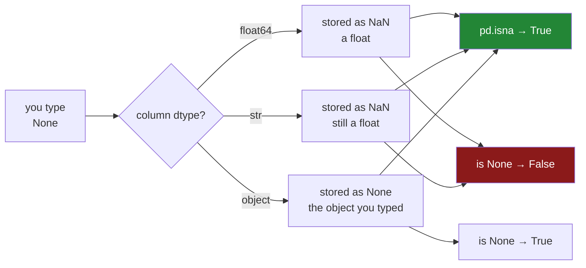

# 1.3 — `None` is not what gets stored

## One-line answer

The word you type for a blank and the value pandas stores are two different things: **`None` goes in
and `NaN` comes out** of a number column, `NaN` comes out of a text column too, and only an `object`
column keeps the `None` you actually wrote — which is why a test written against `None` passes on one
column and fails on the next.

---

## The story

Somebody is typing up the torn receipt. Three prices they can read, one they cannot. For the one they
cannot, they type the word Python uses for nothing: `None`. It reads exactly right — there is no
price, so put nothing.

They print the list back to check, and the eggs row does not say `None`. It says `NaN`.

Nothing went wrong. Nobody typed `NaN`. The word was replaced somewhere between typing it and reading
it back.

Then, a week later, somebody writes a small check that says "the eggs price should be `None`", runs
it, and it fails. They stare at the screen, where the frame is visibly blank in that box, and the
test insists it is not `None`. They change the test to compare against `NaN` instead, and it fails
again — for the reason in [1.2](1.2-nan-the-number-not-equal-to-itself.md). Two hours later they have
a working test and a strong feeling that they still do not understand what is in that box.

---

## The idea in plain language

There are two separate ideas here that look like one, and untangling them is the whole part.

**The first idea: `None` is Python's word for nothing.** It is a real object with a type of its own,
and it is what a Python function returns when it returns nothing. It is not a number. You cannot add
one to it. It has nothing to do with floating-point arithmetic.

**The second idea: `NaN` is the *float's* word for nothing.** It lives inside a block of
floating-point numbers, occupies the same eight bytes as any other float, and follows the IEEE 754
comparison rule from [1.2](1.2-nan-the-number-not-equal-to-itself.md).

A pandas column holds one dtype all the way down
([Day 26, 1.4](../../../day-26-frames-and-copy-on-write/parts/01-the-two-objects/1.4-one-dtype-per-column.md)).
If that dtype is `float64`, then the column is a block of floats and **there is no slot in it capable
of holding a Python `None`.** So when you build a column of numbers and put a `None` in the middle,
pandas does the only thing it can: it converts your `None` into the float that means the same thing,
and stores `NaN`.

That conversion is a **one-way door**. Once it has happened, the `None` you typed is gone. Reading the
value back gives you a float, printing it gives you `NaN`, and asking whether it *is* `None` gives
you `False`. Nothing kept a record of what you wrote.

The reason this catches people out is that the conversion depends entirely on the column's dtype, and
the dtype is usually inferred rather than stated:

- Put `None` in a list of numbers and you get a `float64` column with `NaN` in it.
- Put `None` in a list of text and, in pandas 3, you get the `str` dtype with `NaN` in it too
  ([Day 26, 2.2](../../../day-26-frames-and-copy-on-write/parts/02-the-str-dtype/2.2-str-the-dtype-pandas-3-infers.md)).
- Force the column to `object` — the old catch-all dtype that holds arbitrary Python objects
  ([Day 26, 2.1](../../../day-26-frames-and-copy-on-write/parts/02-the-str-dtype/2.1-text-used-to-be-object.md))
  — and the `None` survives untouched, because an `object` column stores pointers to real Python
  objects and `None` is one.

So the same word, typed the same way, ends up as three different things depending on a dtype you may
never have chosen. That is why the check `value is None` is not a blank test: it is a test that
happens to work on `object` columns and silently fails everywhere else.

The tool that works on all of them is `pd.isna`, and the reason it exists is exactly this: **there
are several markers for "nothing", and application code should not have to know which one a
particular column uses.** `pd.isna` says yes to `None`, to `NaN`, to `pd.NA`
([1.4](1.4-pd-na-and-the-answer-unknown.md)) and to `NaT`
([1.5](1.5-one-dtype-one-kind-of-blank.md)) alike.

---

## Why Setu needs it

- **[1.5](1.5-one-dtype-one-kind-of-blank.md)** completes the table this part starts: which marker
  every dtype uses, and why there is more than one.
- **[2.1](../02-finding-it/2.1-isna-and-notna.md)** is `isna`, the one test that works across all of
  them, and this part is the reason it has to.
- **[7.2](../07-the-module/7.2-the-test-that-can-go-red.md)** writes assertions about blanks, and a
  test that compares against `None` is a test that passes for the wrong reason.
- **[Day 27, 1.6](../../../day-27-reading-and-writing/parts/01-the-csv/1.6-na-values-and-the-blank.md)**
  is the same question at the file boundary: an empty field in a CSV becomes a blank on the way in,
  and which blank depends on the column's dtype.
- **Day 76** builds features from columns whose dtypes are decided by a loader, so a blank test that
  only works on `object` columns will pass in a notebook and fail in the pipeline.

---

## The mechanism

The same `None`, into three different columns:

```python
import pandas as pd

number = pd.Series([1.15, 1.40, None, 2.05])
text = pd.Series(["milk", "bread", None, "rice"])
anything = pd.Series([1.15, 1.40, None, 2.05], dtype="object")

for name, column in [("number", number), ("text", text), ("object", anything)]:
    blank = column.iloc[2]
    print(f"{name:7} dtype={str(column.dtype):8} stored={blank!r:20} is None={blank is None}")
```

**Line by line:**

- `pd.Series([...])` with no `dtype=` lets pandas infer. That inference is the thing being
  demonstrated, so it is deliberately not overridden here — in real code you would state it
  (Principle 4).
- `dtype="object"` on the third one forces the catch-all dtype, which stores a pointer to a real
  Python object per row rather than a block of numbers.
- `.iloc[2]` fetches the third row **by position**, so the lookup does not depend on labels
  ([Day 28, 1.3](../../../day-28-selection-and-alignment/parts/01-label-and-position/1.3-iloc-by-position.md)).
- `{blank!r}` uses `repr` rather than `str`, because `str(nan)` and `str(None)` both print something
  short and readable and `repr` shows you what the object actually is. **On a question about
  identity, always print the `repr`.**
- `blank is None` is the identity test — "is this the same object as `None`?" — and it is the line
  the whole part turns on.

```text
number  dtype=float64  stored=np.float64(nan)      is None=False
text    dtype=str      stored=nan                  is None=False
object  dtype=object   stored=None                 is None=True
```

**Three columns, one word typed, two different stored values and two different answers to `is None`.**
The `float64` column converted; the `str` column converted; the `object` column did not.

Note the middle row carefully. The text column is the pandas 3 `str` dtype, and its blank prints as
`nan` — a text column whose missing marker is a *float*. That is not a mistake; it is the default
flavour of `str`, and [1.4](1.4-pd-na-and-the-answer-unknown.md) shows the other one.

Now the same thing happening on a write rather than on a build:

```python
import pandas as pd

shop = pd.DataFrame(
    {
        "item": pd.Series(["milk", "bread", "eggs", "rice"], dtype="str"),
        "price": [1.15, 1.40, 0.32, 2.05],
        "aisle": pd.Series(["07", "03", "07", "11"], dtype="str"),
    }
).set_index("item")

shop.loc["eggs", "price"] = None
shop.loc["rice", "aisle"] = None

print(shop)
print()
print("price blank :", repr(shop.loc["eggs", "price"]))
print("aisle blank :", repr(shop.loc["rice", "aisle"]))
print("either is None?", shop.loc["eggs", "price"] is None, shop.loc["rice", "aisle"] is None)
print("pd.isna sees both?", pd.isna(shop.loc["eggs", "price"]), pd.isna(shop.loc["rice", "aisle"]))
```

**Line by line:**

- `shop.loc["eggs", "price"] = None` writes into one cell by label, in a single step — the form that
  is safe under Copy-on-Write
  ([Day 26, 4.3](../../../day-26-frames-and-copy-on-write/parts/04-chained-assignment/4.3-loc-the-single-step.md)).
  **The column already exists and already has a dtype**, so the write must convert.
- The second write targets a `str` column, which converts too, and to the same marker.
- `repr(...)` on both, so the printed value is the object rather than its friendly form.
- `is None` on both — **`False` twice**, on two cells that were assigned `None` a moment earlier.
- `pd.isna(...)` on both — `True` twice. This is the line that shows why `pd.isna` exists rather than
  a comparison: it is the only test that gave the answer a person would expect for both columns.

```text
       price aisle
item
milk    1.15    07
bread   1.40    03
eggs     NaN    07
rice    2.05   NaN
either is None? False False
pd.isna sees both? True True
```

The conversion, drawn:



**One test is green on every path.** That is the whole argument for `pd.isna`.

---

## When it breaks

**The guard that only fires on the dtype it was written against:**

```text
$ uv run python -c "
import pandas as pd
kept = pd.Series(['milk', 'bread', None, 'rice'], dtype='object')
tidy = pd.Series(['milk', 'bread', None, 'rice'], dtype='str')
print('object column, is None :', kept.iloc[2] is None)
print('str column, is None    :', tidy.iloc[2] is None)
print('object column, pd.isna :', pd.isna(kept.iloc[2]))
print('str column, pd.isna    :', pd.isna(tidy.iloc[2]))
print('object repr:', repr(kept.iloc[2]), ' str repr:', repr(tidy.iloc[2]))
"
```

```text
object column, is None : True
str column, is None    : False
object column, pd.isna : True
str column, pd.isna    : True
object repr: None  str repr: nan
```

**What it means.** Two Series built from the identical list, with one word of difference in how they
were constructed, and `is None` gives opposite answers about the same row. `pd.isna` gives the same
answer for both, which is the answer a person would expect.

**Nothing raises.** A guard written as `if value is None: continue` runs correctly against the
`object` column a developer built by hand in a notebook, and silently stops running the day the same
column arrives as `str` from a loader. The symptom is not an exception; it is a branch that used to
execute and now does not.

The last line is the debugging move worth keeping: when a blank test disagrees with your eyes, print
`repr(value)` before changing the test. `None` and `nan` print differently under `repr` and look
almost identical under `print`, which is why guessing at a second comparison is how the two hours in
the story get spent.

**A CSV round trip that changed the answer:**

```text
$ uv run python -c "
import io
import pandas as pd
shop = pd.DataFrame(
    {
        'item': pd.Series(['milk', 'bread', 'eggs', 'rice'], dtype='str'),
        'price': [1.15, 1.40, None, 2.05],
        'aisle': pd.Series(['07', '03', '07', None], dtype='str'),
    }
).set_index('item')
buf = io.StringIO()
shop.to_csv(buf)
print(buf.getvalue())
back = pd.read_csv(io.StringIO(buf.getvalue()), index_col='item')
print(back)
print(back.dtypes)
"
```

```text
item,price,aisle
milk,1.15,07
bread,1.4,03
eggs,,07
rice,2.05,

       price  aisle
item
milk    1.15    7.0
bread   1.40    3.0
eggs     NaN    7.0
rice    2.05    NaN
price    float64
aisle    float64
dtype: object
```

**What it means.** Two separate things went wrong on the way out and back.

The blank was written as **nothing at all** — the field between two commas is empty — and read back
as a blank, which is correct and is why `eggs` still has no price.

But the `aisle` column arrived as `float64` and `"07"` came back as `7.0`. The leading zero is gone
and the dtype is wrong. The cause is that a text column with a blank in it, written to CSV, is
indistinguishable from a column of numbers with a gap; the reader guesses numbers, because that is
what the characters look like
([Day 27, 1.2](../../../day-27-reading-and-writing/parts/01-the-csv/1.2-read-csv-and-what-it-guessed.md)).
The fix is `dtype=` at read time
([Day 27, 1.4](../../../day-27-reading-and-writing/parts/01-the-csv/1.4-dtype-at-read-time.md)), or
Parquet, which carries the dtype with the data
([Day 27, 3.2](../../../day-27-reading-and-writing/parts/03-parquet/3.2-the-round-trip-that-keeps-dtypes.md)).

**The `None` that a reader invented:**

```text
$ uv run python -c "
import io
import pandas as pd
raw = 'item,price\nmilk,1.15\nNA,1.40\neggs,\n'
print(pd.read_csv(io.StringIO(raw)))
print()
print(pd.read_csv(io.StringIO(raw), keep_default_na=False))
"
```

```text
   item  price
0  milk   1.15
1   NaN   1.40
2  eggs    NaN

   item price
0  milk  1.15
1    NA  1.40
2  eggs
```

**What it means.** The first frame has **two** blanks and the file only meant one. `read_csv` treats
a long list of strings as missing by default, and `NA` is on it — so a genuine two-letter item name
became a blank on the way in.

`keep_default_na=False` turns that list off, and then the empty field on the eggs row stops being a
blank as well: the price column becomes text and holds an empty string. **Neither default is right
for every file**, which is why `na_values=` and `keep_default_na=` are arguments you state rather
than inherit
([Day 27, 1.6](../../../day-27-reading-and-writing/parts/01-the-csv/1.6-na-values-and-the-blank.md)).

---

## In production

**What a professional writes instead of the teaching version.** They never compare against a blank
marker by name. One helper, used everywhere:

```python
import pandas as pd


def blank_count(frame: pd.DataFrame) -> pd.Series:
    """Blanks per column, whatever marker each column uses."""
    return frame.isna().sum()


def assert_no_blanks(frame: pd.DataFrame, columns: list[str]) -> None:
    """Refuse a frame whose required columns are not fully populated."""
    counts = frame[columns].isna().sum()
    bad = counts[counts > 0]
    if not bad.empty:
        raise ValueError(f"required columns have blanks:\n{bad.to_string()}")
```

**Line by line:**

- `frame.isna()` rather than any comparison — it is dtype-aware, so the same call works on a
  `float64` column, a `str` column, a nullable integer column and a datetime column
  ([1.5](1.5-one-dtype-one-kind-of-blank.md)).
- `.sum()` on a boolean frame counts the `True` values per column, because `True` adds as one.
- `frame[columns]` first, so the assertion is about the columns the caller declared essential rather
  than about every column in the table — most tables have columns that are legitimately sparse.
- `counts[counts > 0]` keeps only the offending columns, so the message names the problem instead of
  printing sixty zeros.
- `.to_string()` on the message so a multi-column failure reads as a small table rather than as one
  long line.
- Note there is **no `is None` anywhere**, and no `!= value` either. That is the point.

**What changes at scale.** The `object` dtype is the one to watch. A column that stays `object`
because it holds real `None` values is storing a pointer per row rather than a value per row, which
costs several times the memory of a `str` column and makes every operation on it a Python-level loop
rather than a compiled one
([Day 26, 2.3](../../../day-26-frames-and-copy-on-write/parts/02-the-str-dtype/2.3-the-storage-behind-it.md)).
On a few thousand rows nobody notices. On tens of millions, an `object` column is often the single
largest thing in memory, and converting it to `str` is the cheapest performance win available.

The second thing that changes is the file boundary. Every hop through CSV is a chance for a blank to
change identity: a `None` becomes an empty field becomes a `NaN`, and a `str` column becomes a
`float64` column on the way back. Systems that survive this either state dtypes at read time or use a
format that carries them.

**The failure that only shows with real data.** A daily job compared a `region` column against a list
of valid codes and raised on anything unknown. Blanks compared unequal to every code, so they raised
— which was correct, and the team added a guard: `if region is None: continue`. It worked in testing,
where the frame was built by hand from a list of dicts and the column came out as `object`. In
production the same column arrived from Parquet as `str`, the guard never matched, and the job
started failing every night on rows it had been designed to skip. One line, two dtypes, two
behaviours.

**The review comment a senior engineer leaves.** *"`if value is None` only catches blanks in `object`
columns. This column is `str` in the loader, so its blank is `NaN` and this branch never runs. Use
`pd.isna(value)` — or better, `df['col'].isna()` and stay vectorised."*

**The interview question.** *"You put `None` into a DataFrame column and read it back. What do you
get?"* It depends on the dtype: `float64` and `str` both convert it to `NaN`, and only an `object`
column keeps the `None` you wrote — because the first two are blocks of fixed-width values with no
room for a Python object. The follow-up is *"so how do you test for a blank?"* — `pd.isna`, or the
vectorised `.isna()`, never `is None` and never `== np.nan`, because the first works on one dtype and
the second works on none.

---

## Check yourself

```bash
uv run python -c "
import pandas as pd
for label, kw in [('inferred', {}), ('object', {'dtype': 'object'}), ('str', {'dtype': 'str'})]:
    s = pd.Series(['milk', 'bread', None, 'rice'], **kw)
    v = s.iloc[2]
    print(f'{label:9} dtype={str(s.dtype):8} repr={v!r:8} is None={str(v is None):<6} pd.isna={pd.isna(v)}')
"
```

Three columns built from the same list. Two of them disagree with the third about what is in row two,
and one column of the printout is identical for all three. Say which column that is, and say which of
the three dtypes you would get back from `pd.read_parquet`.

**Answer out loud, without scrolling up:**

> You type `None` into a numeric column and print the frame back. Say what is stored there now and
> why it could not have been `None`. Then say which single function answers "is this blank?"
> correctly for a `float64` column, a `str` column and an `object` column alike.

---

**Next:** [1.4 — `pd.NA`, and the answer that is "unknown"](1.4-pd-na-and-the-answer-unknown.md).
