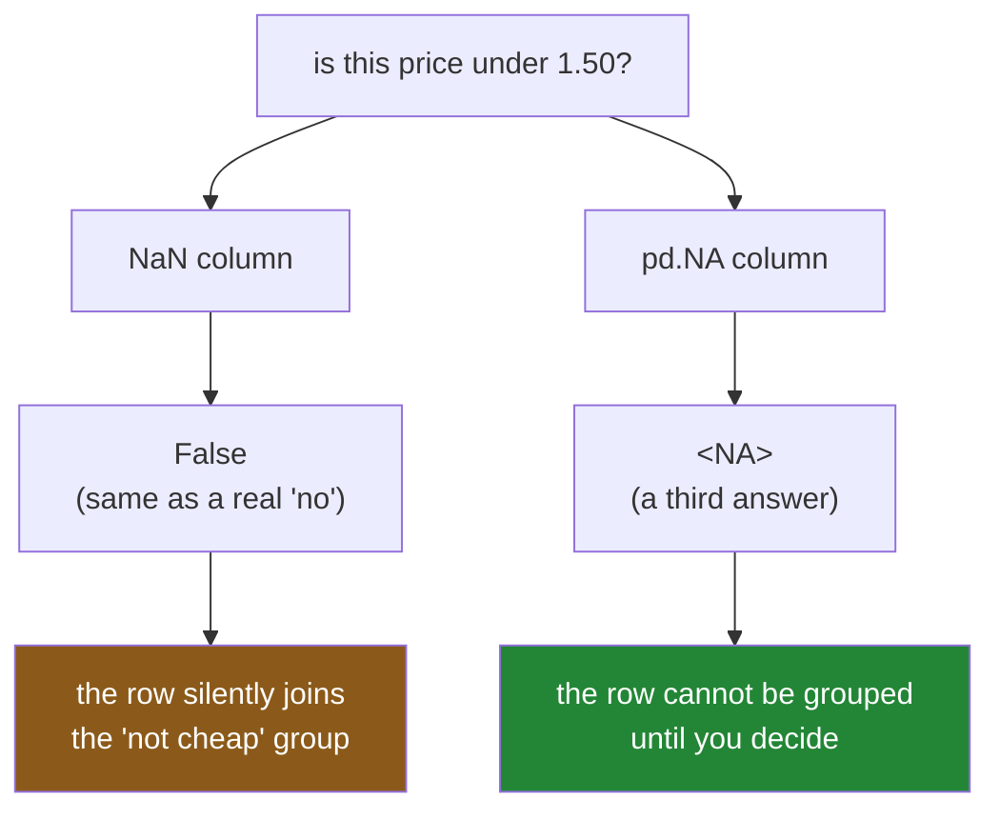

# 1.4 — `pd.NA`, and the answer that is "unknown"

## One-line answer

`pd.NA` is pandas' own missing marker, and where `NaN` makes every comparison **false**, `pd.NA`
makes every comparison **unknown** — a third answer that spreads through your logic instead of
collapsing to "no", which is safer and which will raise the moment you ask it a yes-or-no question.

---

## The story

The flat's shopping list is on the fridge with one price torn off. Somebody asks a question about it:
which items cost less than one pound fifty?

Milk at one fifteen: yes. Bread at one forty: yes. Rice at two oh five: no. Eggs: nobody knows.

Now, what do you write next to the eggs? There are two honest things a person could say, and both get
said in real kitchens.

One is "no". The eggs are not on the list of things known to be cheap, so leave them off it. That is
how a checklist works: if it is not ticked, it is not ticked.

The other is "I do not know, ask whoever did the shop". Not a no. Not a yes. A third thing, which
stays a third thing until somebody finds the other half of the receipt.

The difference only shows up later. Somebody takes the list of cheap items and says "so everything
else is expensive" — and the eggs, which nobody knows the price of, have quietly been called
expensive by a chain of reasoning that started with an honest "not ticked".

---

## The idea in plain language

[1.2](1.2-nan-the-number-not-equal-to-itself.md) established the rule for `NaN`: every comparison
involving it comes back **false**. That is the checklist behaviour. A blank is not less than 1.50, and
it is also not greater than or equal to 1.50, and both of those "not"s read as `False`.

`pd.NA` is a different marker with a different rule. **Every comparison involving `pd.NA` comes back
`pd.NA`.** Ask whether an unknown price is under one fifty and the answer is: unknown. Ask whether it
equals another unknown price and the answer is, again, unknown — because two things you know nothing
about might be the same or might not.

That system has a name: **three-valued logic**. Instead of two possible answers, true and false, there
are three: true, false, and unknown. The unknown does not collapse into false; it propagates. It is
the rule SQL uses for `NULL`, which is why a `WHERE` clause in SQL skips rows whose value is `NULL`
rather than treating them as not-matching, and it is what Day 42's SQL days will meet again.

The two combining rules are worth writing out, because they are the part people find surprising and
they are not arbitrary:

- **`pd.NA | True` is `True`.** "Unknown or definitely-yes" is yes, whatever the unknown turns out to
  be. The unknown cannot change the answer, so it does not need to be resolved.
- **`pd.NA & False` is `False`.** "Unknown and definitely-no" is no, for the same reason.
- **`pd.NA | False` is `pd.NA`**, and **`pd.NA & True` is `pd.NA`**, because in those cases the
  unknown *does* decide the answer.

So the unknown propagates only when it matters. That is exactly what a careful person does in the
kitchen: they answer where they can and say "I do not know" where they cannot.

The cost of that honesty is that **you cannot make a decision out of an unknown.** A Python `if`
needs a yes or a no; there is no branch for "unknown". So asking `pd.NA` to behave as a condition
raises `TypeError: boolean value of NA is ambiguous` — a genuinely useful error, because it fires at
the exact line where a decision was about to be made on no information.

Where does `pd.NA` actually turn up? In the dtypes pandas built to hold it:

- **Nullable integer dtypes** — `Int64` with a capital I, as opposed to NumPy's `int64`. A NumPy
  integer block has no bit pattern spare for a blank, which is why a `NaN` forces an integer column to
  become floats
  ([Day 28, 4.3](../../../day-28-selection-and-alignment/parts/04-alignment/4.3-the-nan-that-changed-the-dtype.md)).
  `Int64` keeps a separate mask alongside the numbers, so it can hold whole numbers **and** blanks at
  once, and its blank is `pd.NA`.
- **The nullable boolean dtype** — `boolean`, as opposed to NumPy's `bool`. Same trick, and it is the
  dtype a comparison against a `pd.NA` column produces.
- **The `string` dtype in its `NA` flavour.** Day 26 covered this pair: `str` is the dtype pandas 3
  infers for text and its blank is `NaN`, while `pd.StringDtype(na_value=pd.NA)` is the same storage
  with `pd.NA` as the blank
  ([Day 26, 2.5](../../../day-26-frames-and-copy-on-write/parts/02-the-str-dtype/2.5-the-missing-value-in-a-text-column.md)).

The practical summary: **`NaN` answers "no" to questions it cannot answer, and `pd.NA` refuses to
answer them.** Neither is right for every job. What is always wrong is not knowing which one your
column uses.

---

## Why Setu needs it

- **[1.5](1.5-one-dtype-one-kind-of-blank.md)** puts every dtype and its marker in one table, and this
  part is the entry for the `pd.NA` half of it.
- **[2.1](../02-finding-it/2.1-isna-and-notna.md)** is `isna`, which returns a plain `bool` column
  whatever marker the input used — so a mask built from `isna` is always safe to index with, and a
  mask built from `==` on an `NA` column is not.
- **[5.2](../05-filling/5.2-a-different-fill-for-each-column.md)** fills whole-number columns, and
  `Int64` is what lets a count column stay whole after a fill.
- **[Day 26, 2.5](../../../day-26-frames-and-copy-on-write/parts/02-the-str-dtype/2.5-the-missing-value-in-a-text-column.md)**
  introduced the two text flavours. This part is the general rule behind that specific case.
- **Day 42** meets SQL's `NULL`, which follows exactly these three-valued rules, and the reason
  `WHERE price < 1.50` in SQL skips rows with a `NULL` price is the reason on this page.

---

## The mechanism

The three-valued rules, stated by the library:

```python
import pandas as pd

print("pd.NA          :", repr(pd.NA))
print("pd.NA == 1     :", repr(pd.NA == 1))
print("pd.NA == pd.NA :", repr(pd.NA == pd.NA))
print("pd.NA | True   :", repr(pd.NA | True))
print("pd.NA & False  :", repr(pd.NA & False))
```

**Line by line:**

- `pd.NA` is a singleton object, like `None` — there is one of it, and it prints as `<NA>`.
- `pd.NA == 1` is `<NA>`, not `False`. **Compare this with
  [1.2](1.2-nan-the-number-not-equal-to-itself.md)'s `np.nan == 1`, which is `False`.** Same question,
  different marker, different kind of answer.
- `pd.NA == pd.NA` is `<NA>` as well. Two unknowns might be equal; nobody can say.
- `pd.NA | True` short-circuits to `True`, because "or" with a certain yes is a yes.
- `pd.NA & False` short-circuits to `False`, for the mirror-image reason. **These two lines are why
  three-valued logic is usable at all** — without them every expression touching a blank would end
  up unknown.

```text
pd.NA          : <NA>
pd.NA == 1     : <NA>
pd.NA == pd.NA : <NA>
pd.NA | True   : True
pd.NA & False  : False
```

Now the shopping list question from the story, asked of both flavours of text column:

```python
import pandas as pd

nan_flavour = pd.Series(["milk", "bread", None, "rice"], dtype="str")
na_flavour = pd.Series(["milk", "bread", None, "rice"], dtype=pd.StringDtype(na_value=pd.NA))

print("str dtype     :", repr(nan_flavour.dtype))
print(nan_flavour != "milk")
print()
print("string dtype  :", repr(na_flavour.dtype))
print(na_flavour != "milk")
```

**Line by line:**

- Both Series hold the same four values built from the same list. The only difference is the dtype.
- `dtype="str"` is what pandas 3 infers for text
  ([Day 26, 2.2](../../../day-26-frames-and-copy-on-write/parts/02-the-str-dtype/2.2-str-the-dtype-pandas-3-infers.md)),
  and its blank is `NaN`.
- `pd.StringDtype(na_value=pd.NA)` asks for the same storage with `pd.NA` as the blank. It is written
  out in full rather than as the shorthand `"string"`, because the shorthand hides the one thing that
  differs between the two lines.
- `!= "milk"` is the question "is this not milk?", asked of every row. **Read the third row of each
  result.** The `NaN` column says `True` — a blank is not milk, so it counts as not-milk. The `NA`
  column says `<NA>` — nobody knows whether the blank is milk, so nobody knows whether it is not.
- The result dtypes differ too: `bool` for the first, `bool[pyarrow]` for the second, because a
  boolean column that can hold "unknown" needs somewhere to record it.

```text
str dtype     : <StringDtype(na_value=nan)>
0    False
1     True
2     True
3     True
dtype: bool

string dtype  : <StringDtype(na_value=<NA>)>
0    False
1     True
2     <NA>
3     True
dtype: bool[pyarrow]
```

And the dtype that keeps whole numbers whole:

```python
import pandas as pd

plain = pd.Series([2, 1, None, 1])
nullable = pd.Series([2, 1, None, 1], dtype="Int64")

print("inferred :", plain.dtype, plain.tolist())
print("nullable :", nullable.dtype, nullable.tolist())
print("sum      :", plain.sum(), nullable.sum())
print("filled   :", plain.fillna(0).dtype, "vs", nullable.fillna(0).dtype)
```

**Line by line:**

- `pd.Series([2, 1, None, 1])` infers `float64`, because a NumPy integer block cannot hold a blank —
  the whole column becomes floats to make room for one `NaN`
  ([Day 28, 4.3](../../../day-28-selection-and-alignment/parts/04-alignment/4.3-the-nan-that-changed-the-dtype.md)).
  The counts `2` and `1` are now `2.0` and `1.0`.
- `dtype="Int64"` — **capital I** — asks for the nullable integer dtype, which stores the numbers as
  integers and the blanks in a separate mask. The counts stay whole.
- `.sum()` gives the same total both ways, so nothing is broken by the float version; what is lost is
  the type, and with it the promise that the column contains whole numbers.
- `.fillna(0)` on the plain column produces `float64` and on the nullable one produces `Int64`. **A
  count column that has been through a fill is a float forever unless the dtype was nullable to start
  with**, which is the practical reason to reach for `Int64`.

```text
inferred : float64 [2.0, 1.0, nan, 1.0]
nullable : Int64 [2, 1, <NA>, 1]
sum      : 4.0 4
filled   : float64 vs Int64
```

Two rules side by side:



**The green path is the one that makes you decide.** That is the whole argument for `pd.NA`, and also
the reason it is more annoying to work with.

---

## When it breaks

**The yes-or-no question that has no answer:**

```text
$ uv run python -c "
import pandas as pd
price = pd.NA
if price:
    print('truthy')
"
```

```text
TypeError: boolean value of NA is ambiguous
```

**What it means.** Python's `if` needs one of two branches and `pd.NA` is neither. Rather than
guessing, pandas refuses.

**This error is a feature.** The equivalent code on a `NaN` column takes the false branch without
comment, so the bug ships. Here it stops at the line where the decision would have been made on no
information. The fix is to say what should happen: `if pd.isna(price): ...` for the blank case, and
the real condition after that.

**The comparison that no longer produces a plain mask:**

```text
$ uv run python -c "
import pandas as pd
items = pd.Series(['milk', 'bread', None, 'rice'], dtype=pd.StringDtype(na_value=pd.NA))
mask = items != 'milk'
print('mask dtype:', mask.dtype)
print('mask      :', mask.tolist())
print('selected  :', items[mask].tolist())
print('rows in   :', len(items), ' rows out:', len(items[mask]))
"
```

```text
mask dtype: bool[pyarrow]
mask      : [False, True, <NA>, True]
selected  : ['bread', 'rice']
rows in   : 4  rows out: 2
```

**What it means.** The mask has three distinct values in it and the selection has two rows. The
unknown row was **dropped** — not kept, not raised on, dropped.

That is the defensible behaviour: pandas will not put a row in the "not milk" group when it does not
know whether the row is milk. But it is silent, and *"everything that is not milk"* has quietly
become *"everything known not to be milk"*. If the difference matters — and in a report about who is
not doing the shop, it does — the blank needs its own branch and its own row in the output.

**The old error, worth recognising because so much code was written against it:**

```text
$ uv run python -c "
import pandas as pd
items = pd.Series(['milk', 'bread', None, 'rice'], dtype=pd.StringDtype(na_value=pd.NA))
frame = pd.DataFrame({'item': items, 'need': [2, 1, 6, 1]})
print(frame[frame['item'] != 'milk'])
print()
print(frame[(frame['item'] != 'milk').fillna(True)])
"
```

```text
   item  need
1  bread     1
3   rice     1

    item  need
1  bread     1
2   <NA>     6
3   rice     1
```

**What it means.** The second selection has the row the first one dropped, because `.fillna(True)` on
the mask said out loud what to do with the unknown: treat it as a match.

`.fillna(False)` would say the opposite. **Neither is a default; both are decisions**, and writing
one of them down is the entire point of the `NA` dtype. The first frame is what you get when nobody
decides.

---

## In production

**What a professional writes instead of the teaching version.** They pick a marker deliberately, at
the boundary where data enters, and they write down why:

```python
import pandas as pd

# Counts stay whole through a fill, so Int64 rather than int64.
# Text stays on the inferred `str` dtype: its NaN blank keeps masks plain `bool`,
# which is what every downstream filter in this codebase expects.
SCHEMA: dict[str, str] = {
    "item": "str",
    "aisle": "str",
    "need": "Int64",
    "price": "float64",
}


def conform(frame: pd.DataFrame) -> pd.DataFrame:
    """Cast an incoming frame to the declared schema, refusing unknown columns."""
    extra = set(frame.columns) - set(SCHEMA)
    if extra:
        raise ValueError(f"unexpected columns: {sorted(extra)}")
    missing = set(SCHEMA) - set(frame.columns)
    if missing:
        raise ValueError(f"missing columns: {sorted(missing)}")
    return frame.astype(SCHEMA)
```

**Line by line:**

- `SCHEMA` is a module-level constant, so the dtype of every column is written in one place and can be
  read without running anything (Principle 4). This is the same habit as Day 26's schema assertion
  ([Day 26, 5.2](../../../day-26-frames-and-copy-on-write/parts/05-the-module/5.2-asserting-the-schema.md)).
- The comment above it is not decoration. **Choosing `str` over `string` is a decision with
  consequences for every mask in the codebase**, and a reader who does not know that will change it.
- `"need": "Int64"` — capital I, so a count survives a fill as a count.
- `"price": "float64"` — a price is genuinely a measurement, so `NaN` is the right blank and there is
  nothing to gain from the nullable float dtype here.
- The two `set` differences run **before** the cast, so a mismatch is reported as a list of column
  names rather than as a cast error deep inside pandas.
- `frame.astype(SCHEMA)` takes the whole dictionary at once, which is both faster than casting column
  by column and impossible to get half-done.

**What changes at scale.** Two things, pulling in opposite directions.

The nullable dtypes carry a **separate mask array** alongside the values, so an `Int64` column costs
roughly one extra byte per row over `int64`. That is small, but on a very wide table it is real, and
it is not the reason to avoid them.

The reason people do avoid them is compatibility. A great deal of code — including parts of the
scientific stack that pandas hands data to — expects a plain NumPy array and a plain `bool` mask.
Passing a `boolean` mask or an `Int64` column into an older library is where a conversion happens
that you did not write, and conversions are where blanks change identity. The professional position
is to use nullable dtypes where the "unknown" semantics genuinely earn their keep — usually integer
identifiers and counts — and to convert deliberately at the boundary rather than hoping.

**The failure that only shows with real data.** A team switched their text columns to the `NA`
flavour to get honest comparisons. Every filter in the codebase quietly started dropping rows with
blanks instead of keeping them, because a `<NA>` in a mask excludes the row. Their record counts fell
by about two per cent, spread across dozens of reports, and every individual report still looked
plausible. It was found by a total that no longer matched a source system, three weeks later. The fix
was one line per filter — `.fillna(False)` or `.fillna(True)`, stated — but the lesson was that a
dtype change is a behaviour change everywhere the dtype is compared.

**The review comment a senior engineer leaves.** *"This column is `string` with `pd.NA`, so
`df[df.col != x]` silently drops the blanks rather than keeping them. Say which you want:
`(df.col != x).fillna(True)` keeps them, `.fillna(False)` drops them explicitly. Right now the
behaviour is inherited rather than chosen."*

**The interview question.** *"What is the difference between `np.nan` and `pd.NA`?"* `NaN` is the
IEEE 754 float value, so every comparison with it is false and a blank silently joins whichever
branch "false" leads to. `pd.NA` is pandas' own marker with three-valued logic, so a comparison
returns "unknown" and propagates — the same rule SQL uses for `NULL`. The follow-up that separates
readers from users: *"what happens when you index with a mask that contains `pd.NA`?"* Those rows are
excluded, silently, so a filter and its negation no longer partition the frame — and the fix is to
`fillna` the mask itself with the answer you actually want.

---

## Check yourself

```bash
uv run python -c "
import pandas as pd
for label, dtype in [('str', 'str'), ('string', pd.StringDtype(na_value=pd.NA))]:
    s = pd.Series(['milk', 'bread', None, 'rice'], dtype=dtype)
    mask = s != 'milk'
    print(f'{label:7} mask={mask.tolist()} kept={s[mask].tolist()}')
print('NA or True :', repr(pd.NA | True))
print('NA and True:', repr(pd.NA & True))
"
```

Two dtypes, one question, two different sets of rows kept. Say how many rows each one kept and which
row is responsible for the difference. Then say why the last two lines print different things.

**Answer out loud, without scrolling up:**

> Give the rule for comparing anything with `NaN`, and the rule for comparing anything with `pd.NA`,
> in one sentence each. Then say what `if pd.NA:` does and why that error is better than the
> alternative.

---

**Next:** [1.5 — One column, one dtype, one kind of blank](1.5-one-dtype-one-kind-of-blank.md).
