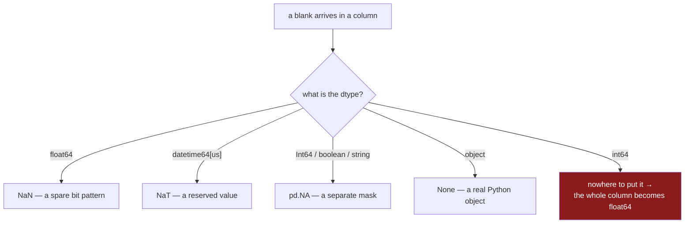

# 1.5 — One column, one dtype, one kind of blank

## One-line answer

Each dtype has exactly one way of writing "nothing" — `NaN` for floats and inferred text, `pd.NA` for
the nullable dtypes, `NaT` for dates, `None` only in `object` columns, and **nothing at all for a
plain `int64`** — so the marker in front of you was chosen by the column's dtype, not by you.

---

## The story

The flat starts keeping the shopping list every week, in one file, so somebody can see what things
cost over time. Four columns: the date of the shop, who went, how many of each thing, and the price.

Different weeks have different holes. One week the receipt tore, so a price is blank. Another week
nobody wrote the date on the sheet. A third week somebody put a dash where the count should have been
because they could not remember whether it was two loaves or three.

Somebody prints the file to see how bad it is, and the blanks do not look the same. One prints as
`NaN`. One prints as `NaT`. One prints as `<NA>`. And the count column, which definitely has a gap in
it, has quietly turned every number into a decimal — two loaves is now `2.0`.

Nobody typed any of those symbols and nobody asked for the decimal points. They arrived because of
what kind of thing each column holds.

---

## The idea in plain language

A pandas column stores every value the same way, in one block, with a single **dtype** saying what
kind of thing that block holds
([Day 26, 1.4](../../../day-26-frames-and-copy-on-write/parts/01-the-two-objects/1.4-one-dtype-per-column.md)).
The blank has to fit in that block too. So each dtype either has a spare pattern that can mean
"nothing", or it has a separate list of which rows are blank, or it has no way to say it at all.

That gives four situations, and the whole table below falls out of them.

**Floats have a spare pattern.** IEEE 754 reserved some bit patterns for `NaN`
([1.2](1.2-nan-the-number-not-equal-to-itself.md)), so a `float64` column can hold a blank without any
extra machinery. This is why a blank is free in a float column and why pandas has historically pushed
everything through floats.

**Dates have a spare pattern too.** A datetime is stored as a whole number of microseconds since a
fixed moment, and one particular value is reserved to mean "no time". Its name is `NaT` — "not a
time" — and it follows the `NaN` rule: `NaT == NaT` is false. In pandas 3 a datetime column defaults
to **microsecond** resolution, printed as `datetime64[us]`, where earlier pandas defaulted to
nanoseconds.

**The nullable dtypes keep a separate mask.** `Int64`, `boolean` and the `NA` flavour of `string`
store the values in one array and a list of which rows are blank in another
([1.4](1.4-pd-na-and-the-answer-unknown.md)). That extra array is what lets a whole-number column stay
whole while still having gaps, and the marker it uses is `pd.NA`.

**A plain NumPy `int64` has neither.** Every one of the 18 446 744 073 709 551 616 bit patterns in
eight bytes is already a number. There is no spare, and there is no mask. So a NumPy integer column
**cannot hold a blank at all** — and the moment one appears, pandas widens the column to `float64`,
which turns `2` into `2.0` for every row
([Day 28, 4.3](../../../day-28-selection-and-alignment/parts/04-alignment/4.3-the-nan-that-changed-the-dtype.md)).
That is the decimal points in the story.

One more entry, for completeness and because you will meet it in old code: the `object` dtype stores a
pointer to a real Python object per row, so it can hold literally anything, including `None`. It is
also the slowest and largest option, and in pandas 3 text no longer lands there by default. The
consequence is the one Day 26 warned about: **`df.dtypes == "object"` no longer finds your text
columns**, because they are `str` now
([Day 26, 2.4](../../../day-26-frames-and-copy-on-write/parts/02-the-str-dtype/2.4-dtypes-equals-object-finds-nothing.md)).
Any code that selects text columns that way selects nothing at all, silently.

The reason to hold all of this in one place is practical. **You do not choose the marker; the dtype
does.** So the only reliable way to work with blanks is a function that does not care which marker it
is looking at — `isna` — and the only reliable way to keep the marker you want is to state the dtype
rather than let it be inferred.

---

## Why Setu needs it

- **[2.1](../02-finding-it/2.1-isna-and-notna.md)** is `isna`, the one test that spans this whole
  table. This part is why it has to span it.
- **[5.2](../05-filling/5.2-a-different-fill-for-each-column.md)** fills different columns with
  different values, and the dtype decides both what a legal fill is and what dtype comes out the other
  side.
- **[7.1](../07-the-module/7.1-the-missing-module.md)** builds a report over a whole frame, so it has
  to handle every one of these dtypes in the same loop.
- **[Day 27, 3.2](../../../day-27-reading-and-writing/parts/03-parquet/3.2-the-round-trip-that-keeps-dtypes.md)**
  is the format that carries dtypes across a file boundary, which is the only way the choices on this
  page survive being saved and loaded.
- **Day 76** and **Day 91** build pipelines whose stages hand frames to each other. A dtype that
  changes silently mid-pipeline is how a whole-number identifier column becomes a float and stops
  joining.

---

## The mechanism

Every dtype, and the blank it uses:

```python
import pandas as pd

samples = [
    ("float64", pd.Series([1.0, None])),
    ("Int64", pd.Series([1, None], dtype="Int64")),
    ("int64", pd.Series([1, 2], dtype="int64")),
    ("str", pd.Series(["a", None], dtype="str")),
    ("string", pd.Series(["a", None], dtype=pd.StringDtype(na_value=pd.NA))),
    ("object", pd.Series(["a", None], dtype="object")),
    ("datetime", pd.Series(pd.to_datetime(["2026-09-01", None]))),
    ("boolean", pd.Series([True, None], dtype="boolean")),
]

for name, column in samples:
    last = column.iloc[-1]
    print(f"{name:9} dtype={str(column.dtype):16} blank={last!r:20} isna={column.isna().iloc[-1]}")
```

**Line by line:**

- Each Series is two rows: one real value and one blank. The `int64` row is the exception — it has two
  real values, because it cannot have a blank, and building it with one would change its dtype.
- `pd.to_datetime([...])` parses the text into a datetime column
  ([Day 27, 1.5](../../../day-27-reading-and-writing/parts/01-the-csv/1.5-parse-dates-and-the-date-that-stayed-text.md)).
  The `None` becomes the datetime blank on the way through.
- `column.iloc[-1]` takes the last row by position, which is the blank one everywhere except `int64`.
- `{last!r}` prints the `repr`, because `str(nan)` and `str(pd.NA)` are both short and misleadingly
  similar ([1.3](1.3-none-is-not-what-gets-stored.md)).
- `column.isna().iloc[-1]` is the same question asked through pandas' own test. **That column of the
  output is the point of the table**: one function, one answer, across eight different storage
  schemes.

```text
float64   dtype=float64          blank=np.float64(nan)      isna=True
Int64     dtype=Int64            blank=<NA>                 isna=True
int64     dtype=int64            blank=np.int64(2)          isna=False
str       dtype=str              blank=nan                  isna=True
string    dtype=string           blank=<NA>                 isna=True
object    dtype=object           blank=None                 isna=True
datetime  dtype=datetime64[us]   blank=NaT                  isna=True
boolean   dtype=boolean          blank=<NA>                 isna=True
```

**Four different markers in the `blank` column and one answer in the `isna` column.** The `int64` row
is the honest one: there is no blank there because there could not be.

Now the date column on its own, because `NaT` has one behaviour worth seeing:

```python
import pandas as pd

when = pd.Series(pd.to_datetime(["2026-09-01", "2026-09-02", None, "2026-09-04"]))

print(when)
print()
print("dtype      :", when.dtype)
print("blank      :", repr(when.iloc[2]))
print("NaT == NaT :", pd.NaT == pd.NaT)
print("NaT != NaT :", pd.NaT != pd.NaT)
print("gap in days:", (when.iloc[3] - when.iloc[1]).days)
```

**Line by line:**

- The printed dtype is `datetime64[us]` — **microseconds**, which is the pandas 3 default. Code that
  hard-codes `datetime64[ns]` in a dtype check will not match.
- `repr(when.iloc[2])` shows `NaT`, and it is its own type rather than a float or a `pd.NA`.
- `pd.NaT == pd.NaT` is **false**, exactly like `NaN`. So `NaT` follows the two-valued rule, not the
  three-valued one — a date column's blank silently loses comparisons rather than propagating
  unknowns.
- The subtraction of two real dates gives a duration, and `.days` reads the whole days out of it.
  Subtracting a `NaT` from anything gives `NaT`, the same way arithmetic on `NaN` gives `NaN`.

```text
0   2026-09-01
1   2026-09-02
2          NaT
3   2026-09-04
dtype: datetime64[us]

dtype      : datetime64[us]
blank      : NaT
NaT == NaT : False
NaT != NaT : True
gap in days: 2
```

And the pandas 3 change that breaks the most old code:

```python
import pandas as pd

shop = pd.DataFrame(
    {
        "item": pd.Series(["milk", "bread", "eggs", "rice"], dtype="str"),
        "need": [2, 1, 6, 1],
        "price": [1.15, 1.40, None, 2.05],
        "aisle": pd.Series(["07", "03", "07", "11"], dtype="str"),
    }
).set_index("item")

print(shop.dtypes)
print()
print("object columns :", shop.columns[shop.dtypes == "object"].tolist())
print("str columns    :", shop.columns[shop.dtypes == "str"].tolist())
print("by selector    :", shop.select_dtypes("str").columns.tolist())
print("numeric        :", shop.select_dtypes("number").columns.tolist())
```

**Line by line:**

- `shop.dtypes` is a Series whose index is the column names and whose values are dtypes.
- `shop.dtypes == "object"` is the pandas-2-era way of finding text columns, and it returns **an empty
  list**. Not an error, not a warning — an empty list, which then flows into a loop that does nothing.
- `shop.dtypes == "str"` finds it, and works only if you know pandas 3 is what you are on.
- `select_dtypes("str")` is the version that does not depend on you spelling the dtype right, and it is
  what to write in code that has to keep working
  ([Day 26, 2.4](../../../day-26-frames-and-copy-on-write/parts/02-the-str-dtype/2.4-dtypes-equals-object-finds-nothing.md)).
- `select_dtypes("number")` picks every numeric column at once, which is exactly the selector an
  imputer wants — the median only means something for numbers
  ([5.2](../05-filling/5.2-a-different-fill-for-each-column.md)).

```text
need       int64
price    float64
aisle        str
dtype: object

object columns : []
str columns    : ['aisle']
by selector    : ['aisle']
numeric        : ['need', 'price']
```

The decision the dtype makes for you:



**The red box is the only one that changes the values you already had.**

---

## When it breaks

**The count column that became decimals:**

```text
$ uv run python -c "
import pandas as pd
need = pd.Series([2, 1, 6, 1], dtype='int64')
print('before :', need.dtype, need.tolist())
need.loc[2] = None
print('after  :', need.dtype, need.tolist())
"
```

```text
before : int64 [2, 1, 6, 1]
after  : float64 [2.0, 1.0, nan, 1.0]
```

**What it means.** One blank was written into one row, and **every other row changed type**. Six eggs
is now `6.0`.

This is not cosmetic. A float cannot represent every whole number exactly above about nine
quadrillion, so an identifier column that goes through this conversion can come back with a different
number in it ([Day 20, 2.3](../../../day-20-arrays-and-dtypes/parts/02-dtypes/2.3-floats-nan-and-precision.md)).
It also breaks joins: a float `12345.0` and an integer `12345` do not match as keys. The fix is to
declare the column `Int64` before anything can widen it.

**Casting back, and being refused:**

```text
$ uv run python -c "
import pandas as pd
widened = pd.Series([2.0, 1.0, None, 1.0])
print('to Int64 :', widened.astype('Int64').tolist())
widened.astype('int64')
" 2>&1 | tail -3
```

```text
to Int64 : [2, 1, <NA>, 1]
pandas.errors.IntCastingNaNError: Cannot convert non-finite values (NA or inf) to integer.Replace or remove non-finite values or cast to an integer typethat supports these values (e.g. 'Int64')
```

**What it means.** `Int64` accepts the blank and gives you whole numbers back. Plain `int64` refuses,
and the error names the fix in its own text — including the missing spaces, which is what the message
really looks like.

This error is a good one to meet early, because the wrong reaction is to `fillna(0)` first and then
cast. That produces a clean `int64` column in which every unknown count is now a confident zero
([5.1](../05-filling/5.1-fillna-is-a-claim.md)).

**The loop that quietly did nothing:**

```text
$ uv run python -c "
import pandas as pd
shop = pd.DataFrame(
    {
        'item': pd.Series(['milk', 'bread'], dtype='str'),
        'price': [1.15, None],
    }
)
for column in shop.columns[shop.dtypes == 'object']:
    shop[column] = shop[column].fillna('unknown')
print(shop)
print('text columns found:', list(shop.columns[shop.dtypes == 'object']))
"
```

```text
    item  price
0   milk   1.15
1  bread    NaN
text columns found: []
```

**What it means.** A cleaning loop over "all the text columns" that iterates over nothing. No error,
no warning, and the frame comes out exactly as it went in.

This is the single most common pandas-2-to-3 migration bug, and it is invisible in a code review
because the loop body is correct. The fix is `select_dtypes` — which asks pandas what a text column
is rather than hard-coding the answer.

**`np.isnan` on the wrong dtype:**

```text
$ uv run python -c "
import numpy as np
import pandas as pd
print('Int64 :', np.isnan(pd.Series([1, None], dtype='Int64')).tolist())
np.isnan(pd.Series(['a', None], dtype='str'))
" 2>&1 | tail -2
```

```text
Int64 : [False, <NA>]
TypeError: ufunc 'isnan' not supported for the input types, and the inputs could not be safely coerced to any supported types according to the casting rule ''safe''
```

**What it means.** Two different wrong answers from the same function.

On the `Int64` column it does not raise — it returns `<NA>` for the blank row, which is a mask you
cannot index with ([1.4](1.4-pd-na-and-the-answer-unknown.md)). Asking "is this missing?" and getting
"unknown" is technically consistent and practically useless.

On the `str` column it raises, because `isnan` is a floating-point function and text is not floats.
`np.isnan` works on exactly one of the eight dtypes in the table above. `pd.isna` works on all of
them, and that is the entire reason to prefer it.

---

## In production

**What a professional writes instead of the teaching version.** They never ask a column what dtype it
is by comparing to a string. They ask pandas:

```python
import pandas as pd


def blank_profile(frame: pd.DataFrame) -> pd.DataFrame:
    """One row per column: how many blanks, what share, which dtype, which marker."""
    blanks = frame.isna().sum()
    return pd.DataFrame(
        {
            "blanks": blanks,
            "share": (blanks / len(frame)).round(4) if len(frame) else 0.0,
            "dtype": frame.dtypes.astype("str"),
            "can_hold_blanks": ~frame.dtypes.astype("str").isin(["int64", "int32", "bool"]),
        }
    )
```

**Line by line:**

- `frame.isna()` is dtype-blind by design, so one call covers every column in the table above.
- `.sum()` on the boolean frame counts blanks per column, because `True` adds as one.
- `if len(frame) else 0.0` guards the division, because an empty frame otherwise produces `NaN` for
  every share — a report about blanks that is itself full of blanks
  ([7.2](../07-the-module/7.2-the-test-that-can-go-red.md) tests exactly this).
- `frame.dtypes.astype("str")` converts the dtype objects into text so they can be compared and
  printed. Comparing dtype objects directly works sometimes and is exactly the fragility this part is
  about.
- `can_hold_blanks` is the useful column and the one nobody writes. **A `0` in `blanks` means
  something different for an `int64` column than for a `float64` one**: the float column genuinely has
  no gaps, and the integer column *could not have shown you one*. A count of zero on a dtype that
  cannot represent a blank is not evidence of clean data.

**What changes at scale.** The dtype choice becomes a memory choice. On ten million rows, an `object`
text column can be several times the size of the same data as `str`, because every row stores a
pointer to a separate Python string object
([Day 26, 2.3](../../../day-26-frames-and-copy-on-write/parts/02-the-str-dtype/2.3-the-storage-behind-it.md)).
A `float64` column that only ever holds whole numbers wastes nothing in space but loses exactness
above the float's integer range, which matters for identifiers and not for prices.

The other thing that changes is what crosses a boundary. Parquet stores dtypes, so the choices on this
page survive a save and a load
([Day 27, 3.2](../../../day-27-reading-and-writing/parts/03-parquet/3.2-the-round-trip-that-keeps-dtypes.md)).
CSV does not, so every column is re-guessed on the way in, and a text column with a blank in it is
particularly likely to come back as a float
([1.3](1.3-none-is-not-what-gets-stored.md)). A system that cares about dtypes either avoids CSV
between its own stages or states `dtype=` on every read.

**The failure that only shows with real data.** A join between two tables started returning far fewer
rows than expected, intermittently, on some days and not others. The key was an account number stored
as `int64` on both sides. On the days it failed, one source had a single blank in a different column
of the same read, which had caused pandas to widen the *key* column to `float64` for that batch — and
`12345.0` does not match `12345`. Nothing raised; the join simply matched less. The fix was to declare
the key `Int64` in the schema, and the check was an assertion on the join's output row count.

**The review comment a senior engineer leaves.** *"`df.dtypes == 'object'` finds no text columns on
pandas 3 — this loop is a no-op. Use `select_dtypes('str')`. And declare `need` as `Int64` in the
schema so it does not widen to float the first time a blank appears in the file."*

**The interview question.** *"Why does an integer column turn into floats when a value goes missing?"*
Because a NumPy `int64` block has no spare bit pattern for a blank and no separate mask, so the only
way to represent one is to widen the column to `float64`, where `NaN` already exists. The follow-up:
*"how do you avoid it?"* — the nullable `Int64` dtype, which keeps the integers and stores the blanks
in a mask beside them, at the cost of about one byte per row and some compatibility with libraries
that expect plain NumPy arrays.

---

## Check yourself

```bash
uv run python -c "
import pandas as pd
for label, s in [
    ('float64', pd.Series([1.0, None])),
    ('Int64', pd.Series([1, None], dtype='Int64')),
    ('str', pd.Series(['a', None], dtype='str')),
    ('datetime', pd.Series(pd.to_datetime(['2026-09-01', None]))),
]:
    print(f'{label:9} {str(s.dtype):16} blank={s.iloc[-1]!r:18} isna={s.isna().iloc[-1]}')
need = pd.Series([2, 1, 6, 1])
print('int64 before:', need.dtype)
need.loc[2] = None
print('int64 after :', need.dtype, need.tolist())
"
```

Four dtypes print four different blanks and one identical answer. Say which column of the output is
identical, and say what happened to the counts on the last line and why it could not have been
avoided without changing the dtype first.

**Answer out loud, without scrolling up:**

> Name the marker each of these uses for a blank: `float64`, `Int64`, `datetime64[us]`, `object`.
> Then say what a plain `int64` column does when a blank arrives, and why `df.dtypes == 'object'`
> now finds nothing.

---

**Next:** [2.1 — `isna` and `notna`, the column of yes and no](../02-finding-it/2.1-isna-and-notna.md).
