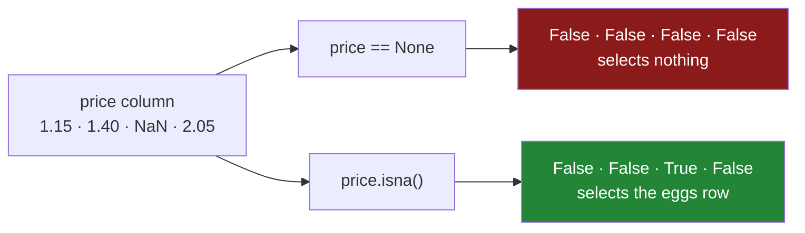

# 2.1 — `isna` and `notna` — the only way to see a blank

## One-line answer

`isna()` turns every box in a column into `True` or `False` depending on whether the box is blank,
and it is the only reliable way to find a blank, because comparing a blank to anything — including to
another blank — comes back `False`.

---

## The story

The receipt is still torn. Somebody wants to know which line lost its price, because if it is the
eggs then it is a small problem, and if it is the rice then it is a bigger one.

The obvious thing to type is a question: *show me the line where the price is nothing.* So they type
it, and the computer shows them nothing at all. Not an error. Not a complaint. An empty answer to a
question whose answer is sitting on the screen two lines above.

They try again, spelling "nothing" a different way. Empty again.

This is the point at which most people decide the computer is broken, and it is not. The question
asked whether each price *equals* the blank, and the rule for a blank — the one from
[1.2](../01-what-missing-means/1.2-nan-the-number-not-equal-to-itself.md) — is that it does not equal
anything, blanks included. Every row answered "no", honestly, and the honest answer was useless.

What they need is a different question. Not *does this box equal nothing?* but *is this box blank?*
Those sound like the same question in English. They are not the same question to a computer, and
pandas has a separate function for the second one because the first one cannot work.

---

## The idea in plain language

A **mask** is a column of `True` and `False` with one entry per row, and it is how you point at a set
of rows in pandas. Day 28 introduced it: a comparison like `price > 2` produces a mask, and putting
that mask in square brackets keeps the rows where it says `True`
([Day 28, 2.2](../../../day-28-selection-and-alignment/parts/02-masks/2.2-selecting-with-a-mask.md)).

`isna()` is a mask-maker. Call it on a column and you get back a mask of the same length: `True` in
every position that holds a blank, `False` everywhere else. Call it on a whole table and you get back
a table of the same shape, every box replaced by `True` or `False`.

`notna()` is its exact opposite, box for box. Anywhere `isna()` says `True`, `notna()` says `False`.
Nothing is ever `True` in both, and nothing is ever `False` in both, because "blank" and "not blank"
between them cover every box that can exist.

The reason these exist as functions rather than as comparisons is the rule from
[1.2](../01-what-missing-means/1.2-nan-the-number-not-equal-to-itself.md). `NaN == NaN` is `False`.
So `price == NaN` gives a mask of all `False`, which selects no rows, which is why the obvious
question came back empty. `isna()` does not compare anything. It inspects each box and reports what
kind of thing is in it, and that is a question with an answer even when equality has none.

Three more things worth knowing before you use them:

- **`isnull` is the same function under a different name.** pandas carries both spellings and they
  are aliases — the same code behind two doors. `isna` is the one to write, because `notna` is the
  natural opposite and `notnull` reads worse. Nothing else distinguishes them.
- **`pd.isna(x)` also works on a single value**, not only on a column. That is the version you reach
  for inside a function when you have one value in your hand rather than a column.
- **`isna()` never raises and never skips.** It answers for every row, including rows where the value
  is a blank of a different kind — a `NaT` in a date column, a `<NA>` in a text column. That is the
  point of [1.5](../01-what-missing-means/1.5-one-dtype-one-kind-of-blank.md): several spellings of
  blank, one function that recognises all of them.

---

## Why Setu needs it

- **[2.2](2.2-counting-the-blanks.md)** turns this mask into the one-line profile you run on every
  table that enters a system: how many blanks, in which columns.
- **[4.1](../04-dropping/4.1-dropna-and-the-rows-that-left.md)** and
  **[5.1](../05-filling/5.1-fillna-is-a-claim.md)** are both built on top of this mask. `dropna` is
  a nicer name for keeping the rows where `notna()` holds; `fillna` writes into the positions
  `isna()` marks.
- **[6.1](../06-the-leak/6.1-the-median-that-saw-the-test-set.md)** needs to count blanks in the
  training half and the test half separately, which is `isna()` applied twice.
- **Day 76** builds the feature pipeline, and every guard in it — *refuse to score a row whose
  required feature is missing* — is an `isna().any()` inside a conditional.
- **Day 91** puts an imputer inside a scikit-learn pipeline. The imputer's internals are this mask,
  and you will read that source.

---

## The mechanism

The same four-line shop as [1.1](../01-what-missing-means/1.1-the-price-nobody-wrote-down.md), with
the egg price still torn off:

```python
import pandas as pd

shop = pd.DataFrame(
    {
        "item": pd.Series(["milk", "bread", "eggs", "rice"], dtype="str"),
        "need": [2, 1, 6, 1],
        "price": [1.15, 1.40, None, 2.05],
        "aisle": pd.Series(["07", "03", "07", "11"], dtype="str"),
    }
).set_index("item")

print(shop["price"].isna())
```

**Line by line:**

- `shop["price"]` picks one column out of the table and hands back a Series — a column with labels,
  from [Day 26, 1.1](../../../day-26-frames-and-copy-on-write/parts/01-the-two-objects/1.1-a-column-with-labels.md).
- `.isna()` is called **on the column, not on the table**, so the answer is one column of `True` and
  `False` rather than a whole grid. Both spellings are useful and they answer different questions;
  the table version is three blocks down.
- There are no arguments. `isna()` takes none, because there is nothing to configure: a box is blank
  or it is not.
- The result keeps the index. `eggs` is still labelled `eggs`, and that is what makes the next step —
  using the mask to select rows — line up correctly.

```text
item
milk     False
bread    False
eggs      True
rice     False
Name: price, dtype: bool
```

`dtype: bool` on the last line is the confirmation that this is a mask and not a column of prices.
`Name: price` is carried through from the column it was made from, which is a small kindness when you
print several masks in a row and need to tell them apart.

`notna()` is the same thing, inverted:

```python
print(shop["price"].notna())
```

**Line by line:**

- `.notna()` — one call, not `not shop["price"].isna()`. Python's `not` operates on a single
  true-or-false value, and a mask is a whole column of them, so `not` on a mask raises. The real
  error text is in **When it breaks** below.
- If you already have the mask in a variable, `~mask` inverts it — the tilde from
  [Day 28, 2.3](../../../day-28-selection-and-alignment/parts/02-masks/2.3-and-or-not-and-the-brackets.md).
  `notna()` and `~isna()` give identical answers; use whichever reads better in the sentence you are
  writing.

```text
item
milk      True
bread     True
eggs     False
rice      True
Name: price, dtype: bool
```

Called on the whole table, `isna()` answers box by box:

```python
print(shop.isna())
```

**Line by line:**

- `shop.isna()` — no column picked, so the answer has the same shape as the table: four rows, three
  columns, every box replaced by `True` or `False`.
- The `item` index and the column names are preserved, so the grid reads the same way the original
  does. That is what makes the next step possible: this grid can be summed, filtered and indexed like
  any other frame.
- The `need` and `aisle` columns are entirely `False`. Nothing is missing from them, and the grid
  says so explicitly rather than leaving them out.

```text
        need  price  aisle
item
milk   False  False  False
bread  False  False  False
eggs   False   True  False
rice   False  False  False
```

And the thing the story actually wanted — *which line lost its price* — is the mask used as a
selector:

```python
print(shop[shop["price"].isna()])
```

**Line by line:**

- The inner `shop["price"].isna()` builds the mask; the outer `shop[...]` keeps the rows where the
  mask is `True`, exactly as on
  [Day 28, 2.2](../../../day-28-selection-and-alignment/parts/02-masks/2.2-selecting-with-a-mask.md).
- The result is a **whole row**, not only the blank box. That matters: the answer to "which line lost
  its price" is "the eggs, six of them, aisle seven", and the surrounding facts are how you go and
  look the price up.
- Read it back in English: *the rows of shop where the price of shop is blank.* Compare that to the
  version that failed, *the rows of shop where the price of shop equals nothing*, and the difference
  between the two sentences is exactly the difference between the two results.

```text
      need  price aisle
item
eggs     6    NaN    07
```

Here is the whole mechanism as a picture:



Both arrows start from the same column, and both return a mask with no error. Only one of them
returns a mask that is true anywhere.

---

## When it breaks

**Using a mask where Python wants one true-or-false value:**

```text
$ uv run python -c "
import pandas as pd
shop = pd.DataFrame({'price': [1.15, 1.40, None, 2.05]}, index=['milk', 'bread', 'eggs', 'rice'])
if shop['price'].isna():
    print('there is a blank')
"
```

```text
Traceback (most recent call last):
  File "<string>", line 4, in <module>
  File "...\pandas\core\generic.py", line 1501, in __bool__
    raise ValueError(
ValueError: The truth value of a Series is ambiguous. Use a.empty, a.bool(), a.item(), a.any() or a.all().
```

**What it means.** `if` needs one answer, yes or no. `isna()` handed it four answers. pandas refuses
to guess which one you meant, and it is right to refuse: for a column that is `[True, False]`, "is
this true?" has two defensible readings, and picking one silently would eventually corrupt somebody's
report.

**The smallest fix** is to say which reading you want:

- `if shop["price"].isna().any():` — *is at least one price blank?* This is the guard you want almost
  every time.
- `if shop["price"].isna().all():` — *is every price blank?* This is the check for a column that
  failed to load at all.

`.any()` and `.all()` collapse a mask to a single value, which is the thing `if` was asking for.

**Using Python's `not` on a mask:**

```text
$ uv run python -c "
import pandas as pd
print(not pd.Series([1.15, None, 2.05]).isna())
"
```

```text
ValueError: The truth value of a Series is ambiguous. Use a.empty, a.bool(), a.item(), a.any() or a.all().
```

**What it means.** The same error from the same cause, and it is worth meeting twice because it looks
different at the call site. `not` is Python asking for one true-or-false value, exactly as `if` does.
The fix is `~mask` or `.notna()`, both of which invert box by box instead of collapsing.

**The one that does not raise, and is therefore worse:**

```text
$ uv run python -c "
import pandas as pd
shop = pd.DataFrame({'price': [1.15, 1.40, None, 2.05]}, index=['milk', 'bread', 'eggs', 'rice'])
print('rows found by ==  :', len(shop[shop['price'] == None]))
print('rows found by isna:', len(shop[shop['price'].isna()]))
"
```

```text
rows found by ==  : 0
rows found by isna: 1
```

**What it means.** No traceback, no warning, two different answers to the same question. The first
line is the bug you will actually ship, because it looks like working code and returns a plausible
empty result. A filter that silently matches nothing is indistinguishable from a filter that
correctly found nothing, and the only defence is knowing that `== None` on a column never matches.

---

## In production

**What a professional writes instead of the teaching version.** They rarely write a bare
`df[df["col"].isna()]` in application code. They write a named check that says what the blank means
for this system, and they raise or log rather than filtering silently:

```python
import pandas as pd


def require_columns_complete(frame: pd.DataFrame, columns: list[str]) -> None:
    """Raise unless every named column is complete. Names the offending rows."""
    missing = frame[columns].isna()
    if not missing.to_numpy().any():
        return
    per_column = missing.sum()
    offenders = frame.index[missing.any(axis=1)].tolist()
    raise ValueError(
        f"missing values in required columns: "
        f"{per_column[per_column > 0].to_dict()}; rows: {offenders[:20]}"
    )
```

**Line by line:**

- `frame[columns]` narrows to the columns that are actually required, because most tables carry
  optional columns and a blank in one of those is not an error.
- `missing.to_numpy().any()` collapses the whole grid to one value. `.any()` on a frame gives one
  answer **per column**, not one answer overall, so a bare `if missing.any():` would raise the
  ambiguity error above. Dropping to NumPy first is the shortest correct form.
- `if not ...: return` — the happy path leaves first, and the error handling is not indented. In a
  function that runs on every load, the cheap path should be the short one.
- `missing.sum()` counts `True` as one and `False` as zero, giving blanks per column. That is the
  subject of [2.2](2.2-counting-the-blanks.md), and it is the single most useful number here.
- `missing.any(axis=1)` asks the question per row rather than per column — *is anything missing on
  this row?* — which is what turns counts into row labels a person can go and look at.
- `offenders[:20]` truncates. On a table with four hundred thousand bad rows, an error message
  carrying all of them is not an error message; it is a denial of service on your own log.

**What changes at scale.** `isna()` on a float column is nearly free. It is one pass looking for the
bit pattern that means `NaN`, and NumPy does it in vectorised code. On a column of the nullable
dtypes from [1.4](../01-what-missing-means/1.4-pd-na-and-the-answer-unknown.md) it is cheaper still,
because those columns store a separate mask alongside the values and `isna()` hands that mask back.
The expensive case is an `object` column, where pandas has to look at every element individually to
find out what kind of thing it is. If a blank check ever shows up in a profile, the column's dtype is
the first thing to look at.

**The failure mode that only appears with real data.** A column arrives as text from a spreadsheet
export, and the empty cells come through as the two-character string `"NA"` rather than as blanks.
`isna()` reports zero missing values, truthfully, because `"NA"` is a perfectly good string. Every
count is clean and every fill does nothing, and the column is nine per cent garbage. That is not a
bug in `isna()`. It is a blank that was never turned into a blank, and finding those is
[2.3](2.3-the-blank-that-was-not-blank.md).

**The review comment a senior engineer leaves.** *"`df[df['price'] == None]` will never match. Use
`.isna()`. And this returned an empty frame in the test, which is why the test passed — please assert
on the count, not on emptiness."*

**The interview question.** *"How do you find missing values in a DataFrame, and why can't you just
compare to `NaN`?"* You use `isna()` or `notna()`, because `NaN` is defined to compare unequal to
everything including itself, so `==` produces an all-`False` mask and selects nothing without
erroring. The follow-up worth having an answer to: *"what does `isna()` cost?"* One vectorised pass
for float and nullable columns, an element-by-element type check for `object` columns — which is one
more reason not to have `object` columns.

---

## Check yourself

```bash
uv run python -c "
import pandas as pd
shop = pd.DataFrame(
    {'need': [2, 1, 6, 1], 'price': [1.15, 1.40, None, 2.05]},
    index=pd.Index(['milk', 'bread', 'eggs', 'rice'], name='item'),
)
m = shop['price'].isna()
print('mask        :', m.tolist())
print('inverted    :', (~m).tolist())
print('notna       :', shop['price'].notna().tolist())
print('any blank?  :', m.any())
print('all blank?  :', m.all())
print('blank rows  :', shop.index[m].tolist())
print('by equality :', shop.index[shop['price'] == None].tolist())
"
```

The last two lines ask the same question and give different answers. Say which one is lying, and what
it is lying about.

**Answer out loud, without scrolling up:**

> `isna()` gives back a column of `True` and `False`. Say what `if that_column:` does and why, and
> then say the two methods that turn it into something `if` will accept — and what each of them
> means in English.

---

**Next:** [2.2 — Counting the blanks](2.2-counting-the-blanks.md).
