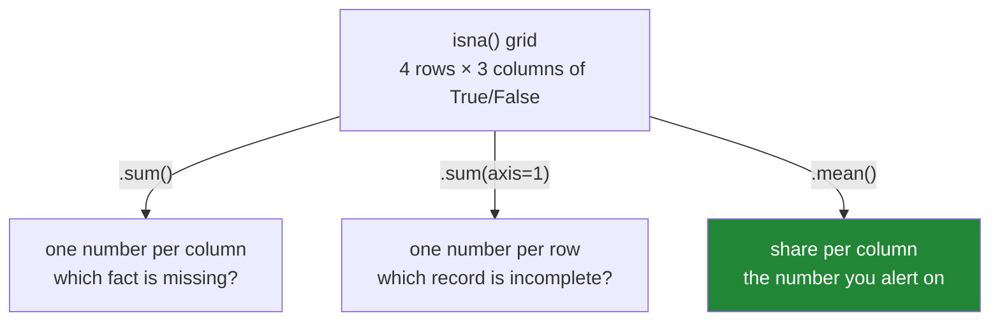

# 2.2 — Counting the blanks — the profile you run on every table

## One-line answer

`df.isna().sum()` gives the number of blanks in every column in one line, and `df.isna().mean()`
gives the share, which is the number you actually watch, because a count of 400 means nothing until
you know whether the table has 500 rows or five million.

---

## The story

The flat's receipt problem happened once and was easy to see, because there were four lines and one
of them was visibly empty.

The same flat keeps a spreadsheet of every shop for the year. It is now about nine hundred rows long
and nobody has read it end to end since March. Somebody wants to know what the year's food bill was.

They cannot look at nine hundred rows and spot the empty boxes. Scrolling finds two or three and
proves nothing about the rest. Printing the sheet shows the first few rows and the last few, and the
middle — which is where a phone got a new spreadsheet app in July and the price column started
arriving empty — is not on the screen at all.

What they need is not a way to look at the rows. It is one line at the top that says: *this column
has nine hundred rows and eight hundred and forty-one prices in it.* That sentence takes a second to
read, is true about the whole sheet rather than the part that fits on a screen, and it is the entire
difference between finding the July problem now and finding it next year.

---

## The idea in plain language

A **mask** is the column of `True` and `False` that
[2.1](2.1-isna-and-notna.md) produces — `True` wherever a box is blank. The useful trick is that in
Python and in pandas, `True` counts as one and `False` counts as zero whenever you add them up.

So **summing a mask counts the `True`s**. `shop.isna().sum()` adds up each column of the mask and
gives one number per column: how many blanks that column has. Nothing clever is happening; adding
booleans is defined to work exactly this way.

**Averaging a mask gives the share.** The mean of a column of ones and zeros is the fraction that are
ones, so `shop.isna().mean()` gives the proportion of each column that is blank — `0.25` for a column
that is a quarter empty. This is almost always the number you want to look at, for the reason in the
story: a raw count of 400 tells you nothing until you know the size of the table, and by the time
somebody tells you the size you have done the division in your head anyway.

Two directions matter, and they answer different questions:

- **Per column** (`.sum()` with no arguments) — *which fact is missing?* This finds a broken feed, a
  renamed spreadsheet field, an optional form question that nobody fills in.
- **Per row** (`.sum(axis=1)`) — *which record is incomplete?* This finds the individual customer
  whose form was abandoned halfway. `axis=1` means "go across the row", the same axis argument that
  appears on every pandas method that could go either way.

The word for the whole activity is **profiling**: looking at a table's shape and completeness before
looking at its contents. A profile is not analysis. It is the check you run before you are allowed to
believe any analysis, and it costs one pass over the data.

pandas also ships `df.info()`, which prints a profile-shaped summary — column names, non-null counts,
dtypes — in one call. It is excellent for reading with your eyes and useless for anything else,
because it prints rather than returning a value. You cannot assert on it, log it as structured data,
or compare today's to yesterday's. That distinction is the whole of this part's production section.

---

## Why Setu needs it

- **[3.1](../03-why-it-is-missing/3.1-three-reasons-a-line-is-blank.md)** asks *why* a column is
  blank, and the first evidence is always the share: one blank in nine hundred and ninety per cent
  blank are different diagnoses with different fixes.
- **[4.2](../04-dropping/4.2-how-thresh-and-subset.md)** drops rows by how many blanks they carry,
  which is the per-row count from this part used as a filter.
- **[6.1](../06-the-leak/6.1-the-median-that-saw-the-test-set.md)** compares the blank share in the
  training half against the test half. If they differ a lot, the split is not random and the model's
  score is fiction.
- **Day 45** builds the `audit()` function that the whole of Phase 4 gates on — a one-call report on
  any table — and the blanks-per-column table is its first section.
- **Day 76** runs this profile on every batch that reaches the feature pipeline, and alerts when a
  column's blank share moves. That alert is the production form of this one line.

---

## The mechanism

The four-line shop from [1.1](../01-what-missing-means/1.1-the-price-nobody-wrote-down.md):

```python
import pandas as pd

shop = pd.DataFrame(
    {
        "item": pd.Series(["milk", "bread", "eggs", "rice"], dtype="str"),
        "need": [2, 1, 6, 1],
        "price": [1.15, 1.40, None, 2.05],
        "aisle": pd.Series(["07", "03", "07", "11"], dtype="str"),
    }
).set_index("item")

print(shop.isna().sum())
```

**Line by line:**

- `shop.isna()` builds the grid of `True`/`False` from [2.1](2.1-isna-and-notna.md) — same shape as
  the table, one answer per box.
- `.sum()` with no arguments adds **down each column**. That is the pandas default and it is worth
  saying out loud, because half the confusion about `axis` comes from not knowing which way the
  no-argument version goes.
- The answer is one number per column, labelled by column name. It is a Series, so it can be indexed,
  compared, filtered and written to a log — unlike anything `info()` prints.

```text
need     0
price    1
aisle    0
dtype: int64
```

One blank, in `price`. On four rows that was already visible; the value of the line is that it says
the same thing about four million rows in the same amount of screen.

Now the share, which is the version that survives contact with a real table:

```python
print(shop.isna().mean())
```

**Line by line:**

- `.mean()` on a mask is the count of `True` divided by the number of rows, because the mean of a
  column of ones and zeros is the fraction that are ones. No separate division by `len(shop)` is
  needed, and writing one is how people introduce an off-by-one.
- The result is a float per column: `0.25` is "a quarter of this column is blank".
- This is the number to put in a dashboard, an alert threshold or a test. A count changes when the
  table grows even though nothing has gone wrong; a share does not.

```text
need     0.00
price    0.25
aisle    0.00
dtype: float64
```

The other direction — per row — answers a different question:

```python
print(shop.isna().sum(axis=1))
```

**Line by line:**

- `axis=1` means **go across the row**, adding the boxes left to right, instead of down the column.
  The mnemonic that actually sticks: `axis=0` is the direction the index runs, `axis=1` is the
  direction the columns run, and `sum(axis=1)` collapses the columns away.
- The answer is one number per row, labelled by the row's index — `eggs` has one blank, every other
  row has none.
- This is what you filter on when the rule is *"drop any row missing more than two of its five
  fields"*, which is [4.2](../04-dropping/4.2-how-thresh-and-subset.md).

```text
item
milk     0
bread    0
eggs     1
rice     0
dtype: int64
```

Put the useful numbers side by side and you have a profile:

```python
profile = pd.DataFrame(
    {
        "rows": len(shop),
        "values": shop.notna().sum(),
        "blanks": shop.isna().sum(),
        "share": shop.isna().mean().round(3),
        "dtype": shop.dtypes.astype("str"),
    }
)
print(profile)
```

**Line by line:**

- Building a `DataFrame` from a dictionary of Series lines them all up on their shared index — the
  column names — which is the alignment behaviour from
  [Day 28, 4.2](../../../day-28-selection-and-alignment/parts/04-alignment/4.2-alignment-is-automatic.md).
  Every one of these Series is indexed by column name, so the rows of the profile are the columns of
  the table.
- `"rows": len(shop)` is a plain integer, not a Series. pandas broadcasts a single value down the
  whole column, which is why every row reads `4`. Keeping it in the table means a person reading a
  logged profile does not have to go and find the row count somewhere else.
- `shop.notna().sum()` and `shop.isna().sum()` are both included on purpose. They are redundant
  arithmetically and not redundant to read: `values` is the number you compare to `rows`, and the gap
  is the blank.
- `.round(3)` keeps the share readable. A blank share printed to sixteen decimal places is noise in a
  log and makes two profiles differ when nothing changed.
- `shop.dtypes.astype("str")` puts the column's type in the profile, because a blank count is not
  interpretable without it — [1.5](../01-what-missing-means/1.5-one-dtype-one-kind-of-blank.md)
  showed that what counts as blank depends on the dtype.

```text
       rows  values  blanks  share    dtype
need      4       4       0   0.00    int64
price     4       3       1   0.25  float64
aisle     4       4       0   0.00      str
```

For comparison, here is what pandas gives you for free:

```python
shop.info()
```

**Line by line:**

- `.info()` prints and returns `None`. There is no value to capture, which is the reason it does not
  replace the profile above.
- `Non-Null Count` is the same number as the `values` column of the profile, and it is the column
  most people read `info()` for.
- `memory usage` is a useful extra that the hand-built profile does not carry; Day 34 comes back to
  it when the `category` dtype makes that number move.

```text
<class 'pandas.DataFrame'>
Index: 4 entries, milk to rice
Data columns (total 3 columns):
 #   Column  Non-Null Count  Dtype
---  ------  --------------  -----
 0   need    4 non-null      int64
 1   price   3 non-null      float64
 2   aisle   4 non-null      str
dtypes: float64(1), int64(1), str(1)
memory usage: 153.0 bytes
```

The two directions, in a picture:



---

## When it breaks

**Reading the count without the row count:**

```text
$ uv run python -c "
import pandas as pd
import numpy as np
rng = np.random.default_rng(0)
small = pd.DataFrame({'price': rng.choice([1.0, np.nan], size=500, p=[0.2, 0.8])})
big   = pd.DataFrame({'price': rng.choice([1.0, np.nan], size=500_000, p=[0.999, 0.001])})
print('small blanks:', int(small['price'].isna().sum()), 'of', len(small))
print('big   blanks:', int(big['price'].isna().sum()),   'of', len(big))
"
```

```text
small blanks: 404 of 500
big   blanks: 516 of 500000
```

**What it means.** Two counts, 404 and 516, and the larger one is the healthy column. The first table
is eighty per cent empty and unusable; the second is one part in a thousand and fine. A count sorted
descending would put them in exactly the wrong order. **This is why the share is the number you
watch**, and why `.mean()` belongs next to `.sum()` in every profile you write.

**Summing the frame instead of the mask:**

```text
$ uv run python -c "
import pandas as pd
shop = pd.DataFrame({'need': [2, 1, 6, 1], 'price': [1.15, 1.40, None, 2.05]})
print(shop.sum())
"
```

```text
need     10.0
price     4.6
dtype: float64
```

**What it means.** No error, and no mention of blanks anywhere. `shop.sum()` adds the *values*;
`shop.isna().sum()` adds the *blank flags*. They differ by four characters and answer unrelated
questions, and the wrong one returns a confident, plausible number — which is the same failure shape
as the torn receipt in [1.1](../01-what-missing-means/1.1-the-price-nobody-wrote-down.md). If a
number labelled "missing" is in the thousands and your table has hundreds of rows, this is what
happened.

**Asking `info()` for a value:**

```text
$ uv run python -c "
import pandas as pd
shop = pd.DataFrame({'price': [1.15, 1.40, None, 2.05]})
report = shop.info()
print('captured:', report)
print('blanks   :', report['price'])
"
```

```text
<class 'pandas.DataFrame'>
RangeIndex: 4 entries, 0 to 3
Data columns (total 1 columns):
 #   Column  Non-Null Count  Dtype
---  ------  --------------  -----
 0   price   3 non-null      float64
dtypes: float64(1)
memory usage: 164.0 bytes
captured: None
Traceback (most recent call last):
  File "<string>", line 6, in <module>
TypeError: 'NoneType' object is not subscriptable
```

**What it means.** The summary appeared on the screen, so it looks like `info()` produced something.
It did not; it printed as a side effect and returned `None`. The smallest fix is to stop trying:
`info()` is for a human at a prompt, and `isna().sum()` is for code. The two are not
interchangeable, and the traceback above is the moment most people find that out.

---

## In production

**What a professional writes instead of the teaching version.** The profile is not typed at a prompt.
It is a function that every table passes through on the way in, and it returns data rather than
printing it, so that it can be logged, compared and asserted on:

```python
import pandas as pd


def profile(frame: pd.DataFrame) -> pd.DataFrame:
    """One row per column: how complete it is, and what type it holds."""
    return pd.DataFrame(
        {
            "rows": len(frame),
            "values": frame.notna().sum(),
            "blanks": frame.isna().sum(),
            "share_blank": frame.isna().mean().round(4),
            "dtype": frame.dtypes.astype("str"),
        }
    )


def assert_within(frame: pd.DataFrame, limits: dict[str, float]) -> None:
    """Raise if any named column is blanker than its agreed limit."""
    share = frame.isna().mean()
    breached = {
        column: (round(float(share[column]), 4), limit)
        for column, limit in limits.items()
        if share[column] > limit
    }
    if breached:
        raise ValueError(f"blank share above limit (observed, limit): {breached}")
```

**Line by line:**

- `profile` returns a `DataFrame` and prints nothing. That single decision is what lets you write
  `profile(today).equals(profile(yesterday))`, log the frame as JSON, or store it next to the data as
  a record of what arrived.
- `share_blank` is rounded to four places rather than three, because an alert threshold of one in a
  thousand is a normal thing to want and three places cannot express it.
- `assert_within` takes a **dictionary of limits, one per column**, rather than a single global
  threshold. Columns genuinely differ: a customer's middle name may legitimately be ninety per cent
  blank, and a transaction amount may never be blank at all. One global number would either permit
  the second or forbid the first.
- The comparison is `>` and not `>=`, so a limit of `0.0` means "never blank" and reads correctly.
- The error carries **both the observed value and the limit**, because "0.31 exceeded 0.05" is
  actionable at three in the morning and "column price failed validation" is not.

**What changes at scale.** `isna().sum()` is two passes over the data: one to build the mask, one to
add it up. On a wide table — a thousand columns — that mask is a full copy of the frame as booleans,
one byte per box, and on a large table that allocation is real. Two habits follow. First, profile the
columns you care about rather than all of them, unless profiling is the whole job. Second, on
columnar formats such as Parquet, the file's own metadata already carries a null count per column per
row group, so the count can often be read without reading the data at all — which is why data
platforms can show you completeness for a table they have not scanned.

**The failure mode that only appears with real data.** The share is stable for months and then a
column goes from two per cent blank to thirty per cent overnight, because an upstream form made a
field optional. Nothing errors. Every model still scores, every dashboard still renders, and the
predictions quietly get worse, because the imputer is now inventing thirty per cent of that feature
instead of two. The alert that catches it is not *"this column has blanks"* — it always had blanks —
but *"this column's blank share moved more than it has ever moved before"*. Profiles are only useful
if yesterday's is kept.

**The review comment a senior engineer leaves.** *"This logs `df.isna().sum()`. Log the share too —
a count of 12 000 is meaningless without the row count, and the alert you will eventually want is on
the share. Also please store the profile, not print it; we cannot diff a log line."*

**The interview question.** *"How would you check the quality of a table you have just been given?"*
The expected first move is a profile: rows, values per column, blank share per column, dtype per
column, and only then a look at the values. The follow-up is *"why the share and not the count?"* —
because the count moves when the table grows and the share does not, so only the share can be
compared to yesterday's or turned into a threshold.

---

## Check yourself

```bash
uv run python -c "
import pandas as pd
shop = pd.DataFrame(
    {
        'need':  [2, 1, 6, 1],
        'price': [1.15, 1.40, None, 2.05],
        'note':  [None, None, 'torn receipt', None],
    },
    index=pd.Index(['milk', 'bread', 'eggs', 'rice'], name='item'),
)
print('blanks per column:'); print(shop.isna().sum())
print('share per column :'); print(shop.isna().mean())
print('blanks per row   :'); print(shop.isna().sum(axis=1))
print('any blank at all :', shop.isna().to_numpy().any())
print('complete rows    :', int(shop.notna().all(axis=1).sum()), 'of', len(shop))
"
```

The `note` column is seventy-five per cent blank and there is nothing wrong with it. Say why, and say
what that means for setting one blank-share threshold across a whole table.

**Answer out loud, without scrolling up:**

> Say what `df.isna().sum()` counts and in which direction it adds. Then say what changes when you
> write `.mean()` instead of `.sum()`, and give the one reason that makes the mean the number worth
> putting in an alert.

---

**Next:** [2.3 — The blank that was not blank](2.3-the-blank-that-was-not-blank.md).
