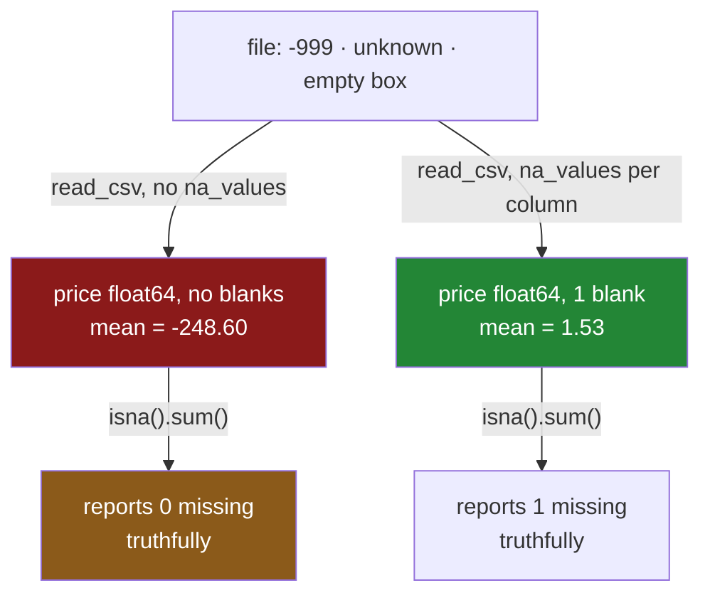

# 2.3 — The blank that was not blank

## One-line answer

A missing value that arrives written down — as `-999`, as the word `unknown`, as a single dash — is
not blank to pandas, so `isna()` reports zero missing values while the average is wrong by hundreds,
and turning those written-down blanks back into real blanks is a step you have to do on purpose.

---

## The story

The flat has moved on from the torn receipt. There is a shared spreadsheet now, one row per thing
bought, and everybody types into it on their phone.

The form has a box for who paid. When somebody genuinely does not remember, they type `unknown`,
because leaving a box empty on a phone keyboard feels like a mistake and typing a word feels like an
answer.

The price box is worse. One week the till receipt was unreadable, and rather than leave the box
empty, somebody put `-999` in it. They did not invent that out of nowhere — the previous flat
spreadsheet had a note at the top saying *put -999 if you do not know*, and the note was there
because an old version of the sheet refused to save empty boxes.

Months later somebody asks what the average price of a thing is. The answer comes back as **minus two
hundred and forty-eight pounds sixty.**

That number is so obviously wrong that it gets noticed, and this is the only lucky part of the story.
Had the sentinel been `0` instead of `-999`, the average would have come back at one pound twelve,
which is not obviously wrong at all, and nobody would ever have looked.

Before any of that, somebody had already run the completeness check from
[2.2](2.2-counting-the-blanks.md). It said the price column had **no missing values.** It was telling
the truth. `-999` is a number; the box was not empty; there was nothing for it to report.

---

## The idea in plain language

A **sentinel value** is a real, storable value that a system agrees to treat as meaning "no value
here". `-999` for an unknown price, `9999` for an unknown year, `unknown` for an unknown name, `-1`
for an unknown count.

Sentinels exist for good historical reasons. Older file formats and older databases often had no way
to say "empty" in a numeric column — every slot had to hold a number — so a number was chosen that
could not occur naturally and everyone agreed to read it as absence. Fixed-width government data
files, scientific instrument exports and old survey formats are all full of them, and they will
outlive everyone reading this.

The problem is that **the agreement lives in a document, not in the data.** Nothing in the file says
`-999` is special. pandas reads it as a price of minus nine hundred and ninety-nine pounds, because
that is what it is, and every function downstream cooperates perfectly: the mean includes it, the
minimum reports it, the sort puts it first, the chart's axis stretches to fit it, and `isna()` says
nothing is missing because nothing is missing.

There are three families of these, and they fail differently:

- **Numeric sentinels** — `-999`, `-1`, `0`, `9999`. These are the dangerous ones, because they
  survive every numeric operation and change every summary statistic. A negative sentinel at least
  produces an absurd average. A sentinel of `0` produces a plausible one, and that is worse.
- **Text sentinels** — `unknown`, `N/A`, `none`, `--`, `TBD`, `.`. These are usually harmless to
  arithmetic, because you cannot average text, but they silently become a category. A count of who
  paid will report `unknown` as a person.
- **Whitespace** — `" "`, a single space, or an empty string `""`. These look empty on a screen and
  are not empty in memory, which makes them the hardest to see and the easiest to fix once seen.

pandas already knows about some of these. When `read_csv` reads a file it converts a fixed list of
strings to blanks automatically, including `NA`, `N/A`, `null`, `NaN`, `None` and the empty string.
That default list is why the previous parts' examples "just worked", and it is also why people are
surprised the first time a sentinel gets through: the ones pandas knows are handled invisibly, so the
existence of the whole category is easy to miss until an unknown spelling arrives.

The fix has to be deliberate, and it comes in two shapes. Either you tell the reader about your
sentinels at the moment you read the file — `na_values=` — or you convert them after the fact with
`replace` or `to_numeric`. Reading is better, and the mechanism below shows why.

---

## Why Setu needs it

- **[2.2](2.2-counting-the-blanks.md)** produces a completeness profile, and this part is the reason
  that profile can be a clean sheet of zeros on a table that is a third garbage. A profile you cannot
  trust is worse than no profile.
- **[3.1](../03-why-it-is-missing/3.1-three-reasons-a-line-is-blank.md)** asks why values are
  missing, and a sentinel is a very strong clue: somebody had a reason and wrote it down.
- **[5.1](../05-filling/5.1-fillna-is-a-claim.md)** fills blanks. It cannot fill a `-999`, because a
  `-999` is not blank, so a pipeline with an unconverted sentinel in it imputes nothing and looks
  like it worked.
- **Day 34** builds `describe()` into a data-quality report, and the check that catches most
  sentinels is exactly the one in that report: look at the minimum and the maximum of every numeric
  column before you look at anything else.
- **Day 45** is the Phase 4 gate — a clean, typed dataset with an `audit()` function. Sentinel
  detection is one of `audit()`'s jobs, because a column of the right dtype with the wrong values in
  it passes every type check there is.

---

## The mechanism

Here is the shared spreadsheet as a small CSV, with both sentinels in it and one genuinely empty box:

```python
import io

import pandas as pd

csv = (
    "item,need,price,paid_by\n"
    "milk,2,1.15,ana\n"
    "bread,1,1.40,unknown\n"
    "eggs,6,-999,ana\n"
    "rice,1,2.05,\n"
)

raw = pd.read_csv(io.StringIO(csv))
print(raw)
print()
print(raw.dtypes)
```

**Line by line:**

- `io.StringIO(csv)` hands `read_csv` a string as if it were a file, so the example is reproducible
  without leaving a file on disk. Everything after this line behaves exactly as it would on a real
  path — the same parser, the same defaults, the same surprises
  ([Day 27, 1.2](../../../day-27-reading-and-writing/parts/01-the-csv/1.2-read-csv-and-what-it-guessed.md)).
- The `bread` row has `unknown` in `paid_by`. Somebody typed a word.
- The `eggs` row has `-999` in `price`. Somebody followed an instruction from an old spreadsheet.
- The `rice` row ends with a comma and nothing after it. That box is **genuinely empty**, and it is
  the only one of the three that pandas will treat as missing.
- No `na_values=` argument yet, on purpose. This is the reading everybody does the first time.

```text
    item  need   price  paid_by
0   milk     2    1.15      ana
1  bread     1    1.40  unknown
2   eggs     6 -999.00      ana
3   rice     1    2.05      NaN

item           str
need         int64
price      float64
paid_by        str
dtype: object
```

Look at what the dtypes say. `price` is `float64` — a perfectly good numeric column. Nothing failed
to parse, nothing fell back to text, and there is no warning anywhere. The `-999` is simply a price
now.

Now run the completeness check from [2.2](2.2-counting-the-blanks.md) on it:

```python
print(raw.isna().sum())
print()
print("price min :", raw["price"].min())
print("price mean:", raw["price"].mean())
```

**Line by line:**

- `raw.isna().sum()` is the same profile line from [2.2](2.2-counting-the-blanks.md). It finds the
  one genuinely empty box in `paid_by` and nothing else, which is correct and useless.
- `.min()` is printed next to the mean deliberately. **The minimum is the cheapest sentinel detector
  there is**: a price cannot be negative, so a negative minimum is a fact about the data that no
  amount of type checking would have caught.
- `.mean()` is what somebody actually asked for, and it is the number that goes in the answer.

```text
item       0
need       0
price      0
paid_by    1
dtype: int64

price min : -999.0
price mean: -248.60000000000002
```

**Zero missing prices, and an average price of minus two hundred and forty-eight pounds.** Those two
lines are the whole part. The completeness check and the arithmetic disagree completely, and only the
arithmetic is telling you something is wrong.

The text sentinel is quieter:

```python
print(raw["paid_by"].value_counts(dropna=False))
```

**Line by line:**

- `.value_counts()` counts how many times each distinct value appears. It is the single most useful
  first look at a text column, because a sentinel that is a word will show up in it by name.
- `dropna=False` tells it to count the blanks too, as their own row. **The default is `dropna=True`,
  which hides them**, and hiding them is exactly wrong when the question is "what is in this column".
- Read the result as a list of the distinct things this column contains. `ana` is a person.
  `unknown` is not a person, and it is sitting in the list as though it were one.

```text
paid_by
ana        2
unknown    1
NaN        1
Name: count, dtype: int64
```

Now the fix, applied where it belongs — at the moment of reading:

```python
clean = pd.read_csv(
    io.StringIO(csv),
    na_values={"price": ["-999"], "paid_by": ["unknown"]},
)
print(clean)
print()
print(clean.isna().sum())
print("price mean:", clean["price"].mean())
```

**Line by line:**

- `na_values=` tells the parser which written-down values mean "missing". It is applied **while
  parsing**, before the column's dtype is decided, which is why `price` still comes out as a clean
  `float64` rather than an `object` column that has to be converted afterwards.
- The argument is a **dictionary, one entry per column**, not a flat list. That is the form worth
  learning: `na_values=["-999"]` applies to every column, and a `-999` that means "unknown price" in
  one column may be a legitimate temperature or a legitimate account balance in another. Naming the
  column is how you avoid destroying real data elsewhere.
- The values are written as strings — `"-999"`, not `-999` — because `na_values` is matched against
  the raw text of the file before conversion to a number.
- pandas' built-in list still applies on top of this. The empty box on the `rice` row is still read
  as blank; `na_values` adds to the defaults rather than replacing them.

```text
    item  need  price paid_by
0   milk     2   1.15     ana
1  bread     1   1.40     NaN
2   eggs     6    NaN     ana
3   rice     1   2.05     NaN

item       0
need       0
price      1
paid_by    2
dtype: int64
price mean: 1.5333333333333332
```

One missing price, two missing payers, and an average of one pound fifty-three — the same average as
the torn receipt in [1.1](../01-what-missing-means/1.1-the-price-nobody-wrote-down.md), because it is
the same three known prices.

If the data is already in memory and re-reading is not an option, `to_numeric` is the after-the-fact
version for numeric columns:

```python
print(pd.to_numeric(raw["price"], errors="coerce"))
```

**Line by line:**

- `pd.to_numeric` converts a column to a number.
- `errors="coerce"` says **anything that cannot be converted becomes blank**, rather than raising.
  That is the switch that makes it a cleaning tool.
- Note what it does *not* fix here. `-999` converts perfectly well to a number, so it survives. This
  is the right tool for text that should have been numeric — `"1.15"`, `"n/a"`, `"twelve"` — and the
  wrong tool for a numeric sentinel, which needs `replace` or `na_values`.
- Read the output carefully before trusting it: the `-999` is still there.

```text
0      1.15
1      1.40
2       NaN
3   -999.00
Name: price, dtype: float64
```

The two paths, drawn:



---

## When it breaks

**The completeness check that passes on garbage:**

```text
$ uv run python -c "
import io, pandas as pd
csv = 'item,price\nmilk,1.15\nbread,1.40\neggs,-999\nrice,2.05\n'
df = pd.read_csv(io.StringIO(csv))
print('missing values :', int(df['price'].isna().sum()))
print('dtype          :', df['price'].dtype)
print('mean           :', df['price'].mean())
print('min            :', df['price'].min())
"
```

```text
missing values : 0
dtype          : float64
mean           : -248.60000000000002
min            : -999.0
```

**What it means.** Two green lights and two red ones, from the same column. The missing-value count
and the dtype both say the column is fine; the mean and the minimum both say it is not. **There is no
error here and there never will be**, because nothing invalid has happened — a number was read as a
number. The only defence is to look at the range of every numeric column at load time, which is why
Day 34 puts `describe()` in the audit.

**The `replace` that silently does nothing:**

```text
$ uv run python -c "
import io, pandas as pd
csv = 'item,price\nmilk,1.15\neggs,-999\n'
df = pd.read_csv(io.StringIO(csv))
fixed = df.replace({'price': {'-999': None}})
print(fixed['price'].tolist())
print('blanks:', int(fixed['price'].isna().sum()))
"
```

```text
[1.15, -999.0]
blanks: 0
```

**What it means.** The replacement was written as the string `'-999'` and the column holds the number
`-999.0`. A string never equals a number in pandas, so nothing matched, and `replace` does not
complain about a value it did not find — it has no way to know you expected it to. The smallest fix
is to drop the quotes: `df.replace({"price": {-999: None}})`. This is the most common way a sentinel
cleanup silently fails, and it is worth asserting on the count afterwards rather than trusting the
call.

**The sentinel that is a legitimate value in the next column:**

```text
$ uv run python -c "
import io, pandas as pd
csv = 'item,price,freezer_temp\nmilk,1.15,-18\neggs,-999,-18\n'
df = pd.read_csv(io.StringIO(csv), na_values=[-999, -18])
print(df)
"
```

```text
   item  price  freezer_temp
0  milk   1.15           NaN
1  eggs    NaN           NaN
```

**What it means.** A flat `na_values` list applies to every column. The freezer really is at minus
eighteen degrees, and both readings have just been erased as missing. No error, and the column is now
empty. The fix is the dictionary form — `na_values={"price": [-999]}` — which names the column the
rule belongs to. **Sentinels are per column, always**, because their meaning is per column.

---

## In production

**What a professional writes instead of the teaching version.** They do not hunt for sentinels by
eye. They write down what each column is allowed to contain, and let the load fail when it does not:

```python
import pandas as pd

SENTINELS: dict[str, list[object]] = {
    "price": [-999, -1],
    "paid_by": ["unknown", "UNKNOWN", "--", "."],
}

RANGES: dict[str, tuple[float, float]] = {
    "price": (0.0, 1000.0),
    "need": (1, 500),
}


def load_shop(path: str) -> pd.DataFrame:
    """Read the shop file, convert known sentinels, and refuse anything out of range."""
    frame = pd.read_csv(path, na_values=SENTINELS)
    for column, (low, high) in RANGES.items():
        values = frame[column].dropna()
        outside = values[(values < low) | (values > high)]
        if not outside.empty:
            raise ValueError(
                f"{column}: {len(outside)} values outside [{low}, {high}]; "
                f"smallest {outside.min()}, largest {outside.max()} — "
                f"probably an unregistered sentinel"
            )
    return frame
```

**Line by line:**

- `SENTINELS` is a module-level constant, not an argument. The list of things this source writes for
  "missing" is a fact about the source, it grows over time as new spellings appear, and it belongs
  somewhere a person can read it without opening the loader.
- Several spellings per column — `unknown`, `UNKNOWN`, `--`, `.` — because a form filled in by people
  will eventually contain all of them, and each one is discovered the same way: something looked
  wrong and somebody went and looked.
- `RANGES` is the **second line of defence**, and it is the one that matters. `na_values` only
  catches sentinels you already know about. A range check catches the one nobody has met yet, on the
  day it first arrives, which is the only day it is cheap to fix.
- `frame[column].dropna()` before comparing, because a comparison against a blank gives `False` and
  would quietly exclude the blanks from the check — correct here, but only because it is deliberate.
- The error message says **"probably an unregistered sentinel"**. Error text is documentation that
  arrives at the worst moment; naming the likely cause saves the reader the twenty minutes it took
  you to work it out the first time.
- The function returns the frame and nothing else. It does not fill, drop or transform — those are
  decisions for [4.1](../04-dropping/4.1-dropna-and-the-rows-that-left.md) and
  [5.1](../05-filling/5.1-fillna-is-a-claim.md), and a loader that quietly makes them is a loader
  nobody can reason about.

**What changes at scale.** Three things. First, `na_values` is applied during parsing, so it is
effectively free; a `replace` pass afterwards is a second full scan of the column and, on a wide
table, a second full copy. Always fix it at read time when you can. Second, sentinels are not stable
over time — a source that used `-999` for a decade will start emitting `-9999` the week somebody
changes an export template, so the range check earns its keep long after the sentinel list has
stopped changing. Third, in a column-store format such as Parquet, missing is stored properly as a
per-value flag rather than as an in-band value, so **the single most valuable thing you can do for
the next team is convert sentinels once, at the boundary, and never write them again**. A sentinel
that reaches your warehouse will be there for years.

**The failure mode that only appears with real data.** The sentinel is `0`. A price of zero, a
duration of zero, a count of zero — all of them are legitimate values, so no range check will fire
and no minimum will look strange. The only signal is the shape of the distribution: a histogram with
a spike at exactly zero and nothing between zero and the next real value. This is the case where you
have to go and ask the people who produce the data, and it is why "what does an empty field mean in
your system?" is a question worth asking on day one of any integration.

**The review comment a senior engineer leaves.** *"`isna().sum()` is zero here, but the min is -999.
Please add `-999` to `na_values` at read time rather than filtering it downstream — otherwise every
new consumer of this table has to know the convention, and one of them will not."*

**The interview question.** *"You are handed a CSV and told it has no missing values. What do you
check?"* The answer they want is that "no missing values" is a claim about blank boxes, not about
information, and sentinels break it: check the min and max of every numeric column, run
`value_counts` on every text column, and look for spikes at suspicious round numbers. The follow-up
is *"where do you fix it?"* — at read time with `na_values`, per column, so that no downstream
consumer has to know the convention.

---

## Check yourself

```bash
uv run python -c "
import io, pandas as pd
csv = 'item,need,price,paid_by\nmilk,2,1.15,ana\nbread,1,1.40,unknown\neggs,6,-999,ana\nrice,1,2.05,\n'
raw = pd.read_csv(io.StringIO(csv))
clean = pd.read_csv(io.StringIO(csv), na_values={'price': ['-999'], 'paid_by': ['unknown']})
print('raw   blanks:', raw.isna().sum().sum(), ' mean:', round(raw['price'].mean(), 2))
print('clean blanks:', clean.isna().sum().sum(), ' mean:', round(clean['price'].mean(), 2))
print('raw payers  :', sorted(raw['paid_by'].dropna().unique()))
print('clean payers:', sorted(clean['paid_by'].dropna().unique()))
"
```

Both readings used the same file and the same parser. Say which line of the four you would have
caught the problem with, if you had only ever printed one of them.

**Answer out loud, without scrolling up:**

> A column of prices contains `-999` meaning "unknown". Say what `isna().sum()` reports for that
> column and why it is right to report it. Then say the two places you can fix it, and the one reason
> fixing it at read time is better than fixing it afterwards.

---

**Next:** [3.1 — Three reasons a line is blank](../03-why-it-is-missing/3.1-three-reasons-a-line-is-blank.md).
