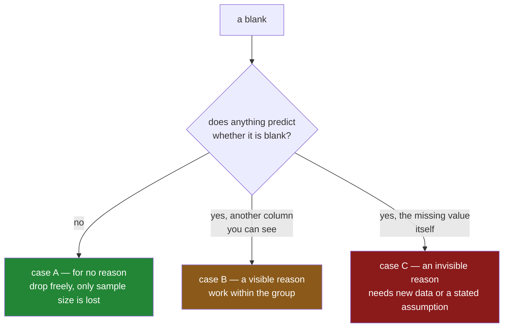

# 3.1 — Three reasons a line is blank

## One-line answer

Whether it is safe to drop or fill a blank depends entirely on **why** the value is missing, and
there are three cases: the blank happened for no reason, the blank depends on something you can see,
or the blank depends on the value that is missing — and only the third one cannot be fixed by
arithmetic.

---

## The story

Three Saturdays, three different reasons the price box ended up empty.

**The first Saturday**, the receipt tore in a pocket. The tear went through one line, and it could
have gone through any of them. Which line lost its price had nothing to do with what was on it.

**The second Saturday**, whoever did the shop got the frozen things last and paid at the kiosk near
the freezers, which prints a receipt on the thin paper that fades. Those lines were unreadable by
Sunday. The lines from the main till were fine. So the blanks are all frozen things — but you can
still *see* which things were frozen, because the aisle is written in the sheet.

**The third Saturday** is the awkward one. Somebody bought something they would rather not itemise,
and left the price out on purpose. The blanks are the expensive lines, and there is nothing else in
the sheet that says so.

Now: the flat wants the average price of a thing bought this year, and there are blanks from all
three Saturdays in the sheet.

If every blank were like the first Saturday, throwing the blank lines away costs nothing but sample
size. If they are like the second, throwing them away skews the average low, because it throws away
mostly frozen food and frozen food is dearer — but you can fix it, because the aisle is right there
in the sheet. If they are like the third, the average is wrong and **nothing in the sheet can tell
you by how much**, because the only thing that predicts the blank is the number that is gone.

Same blank on the screen, three times. Three completely different situations, and the sheet looks
identical in all three.

---

## The idea in plain language

The three cases have standard names. The names are ugly and the ideas are simple, so learn the ideas
first.

**Missing for no reason at all.** The blank landed where it landed and nothing about the row made it
more likely. The torn receipt. A sensor that drops one reading in a hundred at random. A form page
that occasionally fails to submit. The technical name is **MCAR**, short for *missing completely at
random*. The consequence is the good one: the rows you kept are a fair sample of all the rows, so
every average you compute on them is right. You have less data than you wanted and nothing else is
wrong.

**Missing for a reason you can see.** Whether a value is blank depends on some *other* column, and
that column is in your table. The fading receipts from the freezer kiosk: the blank depends on the
aisle, and the aisle is written down. The technical name is **MAR**, short for *missing at random* —
a genuinely terrible name, because the whole point is that it is *not* random. Read it as "missing at
random **once you know the other columns**". The consequence: the overall average is wrong, and it is
**fixable**, because you can work within each group of the visible column and the blanks inside a
group really are random.

**Missing for a reason you cannot see.** Whether a value is blank depends on the value itself, or on
something not in your table at all. The line that was left out because it was expensive. A salary
survey where the highest earners decline to answer. A sensor that fails when the reading goes above
its range. The technical name is **MNAR**, short for *missing not at random*. The consequence is the
bad one: **no amount of arithmetic on this table can recover the right answer.** The information that
would let you correct the bias is exactly the information that is missing. Fixing it needs new data —
go and read the till roll, ask the person, calibrate the sensor — or an assumption you state out loud
and defend.

Two things to hold onto:

- **These are claims about how the data came to be, not properties you can compute.** You cannot run
  a function on a table and be told which case you are in. You can gather evidence — comparing the
  rows that are blank against the rows that are not is genuinely informative — but the last step is
  always going and finding out how the data was collected. That is a conversation, not a query.
- **The three cases decide what you are allowed to do next.** Dropping rows is safe under the first
  case and biased under the other two. Filling with an overall average is safe under the first,
  crude under the second, wrong under the third. This is why the question comes before the technique,
  and why [4.1](../04-dropping/4.1-dropna-and-the-rows-that-left.md) and
  [5.1](../05-filling/5.1-fillna-is-a-claim.md) both send you back here.

---

## Why Setu needs it

- **[4.1](../04-dropping/4.1-dropna-and-the-rows-that-left.md)** drops the rows with blanks in them.
  Whether that is a free operation or a silent bias is decided entirely by which of these three cases
  you are in.
- **[5.2](../05-filling/5.2-a-different-fill-for-each-column.md)** fills within groups — the freezer
  prices from the freezer prices — and that technique is the direct answer to the second case.
- **[3.2](3.2-the-blank-that-is-itself-a-signal.md)** shows what to do when you suspect the third
  case: keep the fact that the value was missing, as its own column, so a model can use it.
- **Day 76** builds the feature pipeline, where every imputation choice has to be written down and
  justified, and the justification is always an argument about which of these three cases holds.
- **Day 118** is model evaluation, where a training set whose blanks are of the third kind produces a
  model that scores beautifully offline and fails in the world, because the offline test set has the
  same bias baked into it.

---

## The mechanism

The best way to see the difference is to start from data where you know the truth, then hide values
in three different ways and see which averages survive.

```python
import numpy as np
import pandas as pd

rng = np.random.default_rng(30)
n = 2000

aisle = rng.choice(["freezer", "shelf"], size=n, p=[0.3, 0.7])
price = np.where(
    aisle == "freezer",
    rng.normal(6.0, 1.0, n),
    rng.normal(2.0, 0.5, n),
).round(2)

truth = pd.DataFrame({"aisle": aisle, "price": price})
print("true mean overall :", round(truth["price"].mean(), 3))
print("true mean by aisle:", truth.groupby("aisle")["price"].mean().round(3).to_dict())
```

**Line by line:**

- `np.random.default_rng(30)` is the seeded generator from
  [Day 20, 4.1](../../../day-20-arrays-and-dtypes/parts/04-random/4.1-default-rng-the-generator.md).
  The seed is written down so that every number in this part reproduces exactly, which is
  Principle 4 — a lesson whose output you cannot reproduce is a lesson you cannot check.
- `rng.choice([...], p=[0.3, 0.7])` makes about thirty per cent of the shop frozen. The exact split
  does not matter; what matters is that there are two visible groups.
- `np.where(condition, a, b)` picks elementwise: a frozen item's price is drawn around £6.00, a shelf
  item's around £2.00. **Frozen food is dearer, and that is the entire point** — if the two groups
  had the same average, hiding one group would not bias anything and there would be nothing to see.
- `truth` holds the real prices, with nothing missing. This is the thing you never have in real life
  and the reason a simulation is the only honest way to teach this.
- Both the overall mean and the per-group means are printed, because the rest of the part is about
  which of them survives each kind of blank.

```text
true mean overall : 3.15
true mean by aisle: {'freezer': 6.082, 'shelf': 1.988}
```

**Case one — the torn receipt. Blanks land anywhere:**

```python
a = truth.copy()
a.loc[rng.random(n) < 0.25, "price"] = np.nan
print("A random blanks :", round(a["price"].mean(), 3), "| blanks", int(a["price"].isna().sum()))
```

**Line by line:**

- `truth.copy()` before writing, because every case starts from the same complete data. Copy-on-write
  makes the copy cheap and explicit
  ([Day 26, 3.1](../../../day-26-frames-and-copy-on-write/parts/03-copy-on-write/3.1-every-result-behaves-like-a-copy.md)).
- `rng.random(n) < 0.25` is a mask that is `True` about a quarter of the time, **with no reference to
  any column**. That is what "for no reason at all" means, written as code: the blank does not look
  at the price and does not look at the aisle.
- `.loc[mask, "price"] = np.nan` writes the blank in one step, which is the assignment form from
  [Day 28, 3.1](../../../day-28-selection-and-alignment/parts/03-writing/3.1-assigning-through-loc.md).
  A two-step version would be chained assignment and would write nothing
  ([Day 26, 4.1](../../../day-26-frames-and-copy-on-write/parts/04-chained-assignment/4.1-the-write-that-vanished.md)).

```text
A random blanks : mean 3.166 | blanks 500
```

The true mean is `3.15` and the mean of what survived is `3.166`. A quarter of the data is gone and
the answer barely moved. **This is the case where dropping the blanks costs you nothing but sample
size.**

**Case two — the fading kiosk receipts. Blanks depend on the aisle, and the aisle is visible:**

```python
b = truth.copy()
b.loc[(aisle == "freezer") & (rng.random(n) < 0.8), "price"] = np.nan
print("B freezer blanks:", round(b["price"].mean(), 3), "| blanks", int(b["price"].isna().sum()))
print("  by aisle      :", b.groupby("aisle")["price"].mean().round(3).to_dict())
```

**Line by line:**

- `(aisle == "freezer") & (rng.random(n) < 0.8)` — blank about eighty per cent of the frozen lines
  and none of the shelf lines. The `&` and the brackets are from
  [Day 28, 2.3](../../../day-28-selection-and-alignment/parts/02-masks/2.3-and-or-not-and-the-brackets.md);
  without the brackets Python's precedence rules turn this into something else entirely.
- **The mask looks at `aisle`, never at `price`.** That is the definition of the second case written
  as code, and it is the only difference from case one.
- The second print is the important one. It asks for the mean *within each aisle*, which is
  tomorrow's subject ([Day 31](../../../day-31-groupby/parts/02-aggregating/2.1-one-number-for-each-group.md))
  and is used here as a diagnostic.

```text
B freezer blanks: mean 2.317 | blanks 439
  by aisle      : {'freezer': 5.975, 'shelf': 1.988}
```

Read those two lines together, because they are the heart of the part. The overall mean collapsed
from `3.15` to `2.317` — **wrong by twenty-six per cent, with no error anywhere.** But the per-aisle
means are still almost exactly right: `5.975` against a true `6.082`, and `1.988` against a true
`1.988`.

The information needed to fix the answer is in the table. Work within each aisle and the bias
disappears; average across aisles without thinking and it does not. That is what "missing at random,
once you know the other columns" means, and it is why the group-wise fill in
[5.2](../05-filling/5.2-a-different-fill-for-each-column.md) exists.

**Case three — the line left out on purpose. Blanks depend on the price itself:**

```python
c = truth.copy()
c.loc[c["price"] > 6.0, "price"] = np.nan
print("C dear blanks   :", round(c["price"].mean(), 3), "| blanks", int(c["price"].isna().sum()))
print("  by aisle      :", c.groupby("aisle")["price"].mean().round(3).to_dict())
```

**Line by line:**

- `c["price"] > 6.0` — the mask is built **from the column that is about to be erased**. Nothing else
  is consulted. This is the third case in one line.
- After the write, the rows where the mask was `True` are blank, so the condition that produced them
  can never be checked again. **The evidence deletes itself**, which is precisely why this case
  cannot be undone from the table.
- The per-aisle means are printed again, to show that the trick which rescued case two does not
  rescue this one.

```text
C dear blanks   : mean 2.493 | blanks 305
  by aisle      : {'freezer': 5.245, 'shelf': 1.988}
```

The overall mean is wrong, as in case two. But look at the freezer mean: `5.245` against a true
`6.082`. **Grouping by aisle did not save it.** Every dear frozen item was removed, so the freezer
group that remains is itself biased, and there is no third column to group by that would fix it —
the only thing that predicts the blank is the missing number.

Side by side:

| Case | Blank depends on | Overall mean | Per-aisle mean | Recoverable from this table? |
|---|---|---|---|---|
| A — torn receipt | nothing | `3.166` vs `3.15` ✅ | correct | nothing to recover |
| B — fading kiosk | `aisle`, which you can see | `2.317` vs `3.15` ❌ | correct ✅ | **yes** — work within the group |
| C — left out on purpose | `price`, which is gone | `2.493` vs `3.15` ❌ | wrong ❌ | **no** — needs new data |



---

## When it breaks

**The evidence that says the blanks are not random, in one line:**

```text
$ uv run python -c "
import numpy as np, pandas as pd
rng = np.random.default_rng(30)
n = 2000
aisle = rng.choice(['freezer', 'shelf'], size=n, p=[0.3, 0.7])
price = np.where(aisle == 'freezer', rng.normal(6.0, 1.0, n), rng.normal(2.0, 0.5, n)).round(2)
df = pd.DataFrame({'aisle': aisle, 'price': price})
df.loc[(aisle == 'freezer') & (rng.random(n) < 0.8), 'price'] = np.nan
print(df.assign(blank=df['price'].isna()).groupby('aisle')['blank'].mean().round(3))
"
```

```text
aisle
freezer    0.794
shelf      0.000
Name: blank, dtype: float64
```

**What it means.** Seventy-nine per cent of frozen lines are blank and none of the shelf lines are.
This is not an error — nothing raised — but it is the strongest evidence you will get that you are
not in case A. **The blank rate differing by group is the diagnostic**, and it takes one line:
compare `isna()` against every other column you have. If the blank rate is flat across all of them,
case A is plausible. If it is not, you have found the visible reason and you know which column to
group by.

**The check that looks fine and proves nothing:**

```text
$ uv run python -c "
import numpy as np, pandas as pd
rng = np.random.default_rng(30)
n = 2000
aisle = rng.choice(['freezer', 'shelf'], size=n, p=[0.3, 0.7])
price = np.where(aisle == 'freezer', rng.normal(6.0, 1.0, n), rng.normal(2.0, 0.5, n)).round(2)
df = pd.DataFrame({'aisle': aisle, 'price': price})
df.loc[df['price'] > 6.0, 'price'] = np.nan
print(df.assign(blank=df['price'].isna()).groupby('aisle')['blank'].mean().round(3))
print('mean of what is left:', round(df['price'].mean(), 3), 'true was 3.15')
"
```

```text
aisle
freezer    0.537
shelf      0.000
Name: blank, dtype: float64
mean of what is left: 2.493 true was 3.15
```

**What it means.** The diagnostic fires — the blank rate is uneven across aisle — so you would
correctly conclude "not case A" and go and group by aisle. And the answer would still be wrong, as
the table above showed, because the real cause was the price and aisle is only correlated with it.
**A diagnostic can tell you that blanks are not random. It cannot tell you that they are.** No test
distinguishes case B from case C, because the distinguishing information is the part you do not have.
This is the single most important limitation on this page.

**The failure you do not see at all:**

```text
$ uv run python -c "
import numpy as np, pandas as pd
rng = np.random.default_rng(30)
n = 2000
price = np.round(rng.normal(3.15, 1.5, n), 2)
df = pd.DataFrame({'price': price})
df.loc[df['price'] > 4.5, 'price'] = np.nan
clean = df.dropna()
print('rows kept :', len(clean), 'of', n)
print('mean      :', round(clean['price'].mean(), 3))
print('std       :', round(clean['price'].std(), 3))
"
```

```text
rows kept : 1625 of 2000
mean      : 2.699
std       : 1.173
```

**What it means.** A clean run, a plausible mean, a plausible spread, eighty-one per cent of the rows
kept, and every number is wrong: the true mean was `3.15` and the true spread was `1.5`. The
`dropna()` looked like data hygiene and was actually a decision to exclude every expensive item.
There is **no error text for this failure**, which is why the section you are reading exists at all.
The only defence is asking why the values are missing before deciding what to do with them.

---

## In production

**What a professional writes instead of the teaching version.** They do not classify the missingness
in their head and move on. They write the diagnostic down as a function, run it at load time, and put
the conclusion in a comment next to the imputation, so the next person can see the reasoning:

```python
import pandas as pd


def blank_rate_by(frame: pd.DataFrame, column: str, by: list[str]) -> pd.DataFrame:
    """For each other column, how the blank rate of `column` varies across its values."""
    blank = frame[column].isna()
    rows = []
    for other in by:
        rate = blank.groupby(frame[other], observed=True).mean()
        rows.append(
            {
                "compared_with": other,
                "lowest_rate": round(float(rate.min()), 4),
                "highest_rate": round(float(rate.max()), 4),
                "spread": round(float(rate.max() - rate.min()), 4),
                "worst_group": str(rate.idxmax()),
            }
        )
    return pd.DataFrame(rows).sort_values("spread", ascending=False)
```

**Line by line:**

- `blank.groupby(frame[other], observed=True).mean()` groups the blank flag by another column's
  values and averages it, giving the blank rate per group. Grouping by an external Series rather than
  by a column name is the form that lets this work on a mask that is not part of the frame
  ([Day 31, 4.1](../../../day-31-groupby/parts/04-the-keys/4.1-the-key-became-the-index.md)).
- `observed=True` matters once any grouping column is a `category`, which Day 34 introduces. Without
  it, pandas produces a row for every category that *could* appear, including ones with no rows, and
  the report fills with meaningless zeros.
- `spread` — the gap between the highest and lowest blank rate — is the number that ranks the
  columns. A spread near zero means that column tells you nothing about the blanks. A large spread
  means you have found the visible reason.
- `sort_values("spread", ascending=False)` puts the most informative comparison first, because
  reports get read from the top and this one is meant to be actionable in one glance
  ([Day 29, 4.1](../../../day-29-iteration-and-order/parts/04-sorting/4.1-sort-values-the-order-you-asked-for.md)).
- `worst_group` names the group with the most blanks, because "spread 0.73" sends you looking and
  "spread 0.73, worst group freezer" sends you to the right place.
- Notice what the function does **not** return: a verdict. There is no `is_mcar` boolean, because
  there cannot be one. It returns evidence, and a person decides.

**What changes at scale.** The diagnostic is a group-by per candidate column, so its cost is linear
in the number of columns you compare against. On a table with a thousand columns you do not run it
against all of them; you run it against the handful that could plausibly explain the blank — the
source system, the date, the region, the device — and you run it on a sample. The bigger production
change is that **missingness drifts**. A column that was case A last quarter becomes case B this
quarter because one region's feed broke, and the imputation you justified six months ago is now
introducing bias. This is why the blank-rate-by-group report belongs in the monitoring job next to
the profile from [2.2](../02-finding-it/2.2-counting-the-blanks.md), not only in the notebook where
the model was built.

**The failure mode that only appears with real data.** The third case usually arrives disguised as
the second. Income is missing more often for one region, so somebody imputes the regional median and
declares the problem solved. What was actually happening is that high earners everywhere decline to
answer, and the region only looked like the cause because it is correlated with income. The regional
fill fixes some of the bias, hides the rest, and produces a model that under-predicts at the top end
in every region. The tell is that the residuals are skewed in the same direction in every group, and
the only real fix is a source of truth outside the survey.

**The review comment a senior engineer leaves.** *"You fill `price` with the global median. Why is
that safe? The blank rate is 79% for freezer rows and 0% elsewhere, so the global median is mostly
made of shelf prices and you are pushing every frozen row down. Either fill within aisle or say in
the docstring why the bias is acceptable."*

**The interview question.** *"When is it safe to drop rows with missing values?"* Only when the
blanks are unrelated to anything that matters — when the rows you keep are a fair sample of the rows
you had. The follow-up that separates people who have done this from people who have read about it:
*"how would you check?"* You cannot check it directly, but you can look for evidence against it —
compare the blank rate across every other column you have, and if it moves, dropping is biased. And
you should say plainly that a flat blank rate is not proof, because the cause may be the missing
value itself, which no column can reveal.

---

## Check yourself

```bash
uv run python -c "
import numpy as np, pandas as pd
rng = np.random.default_rng(30)
n = 2000
aisle = rng.choice(['freezer', 'shelf'], size=n, p=[0.3, 0.7])
price = np.where(aisle == 'freezer', rng.normal(6.0, 1.0, n), rng.normal(2.0, 0.5, n)).round(2)
truth = pd.DataFrame({'aisle': aisle, 'price': price})
print('truth        :', round(truth['price'].mean(), 3))
for name, mask in [
    ('A random  ', rng.random(n) < 0.25),
    ('B freezer ', (aisle == 'freezer') & (rng.random(n) < 0.8)),
    ('C dear    ', truth['price'] > 6.0),
]:
    d = truth.copy()
    d.loc[mask, 'price'] = np.nan
    print(name, 'overall', round(d['price'].mean(), 3),
          '| by aisle', d.groupby('aisle')['price'].mean().round(3).to_dict())
"
```

Two of those three rows have a wrong overall mean. Only one of them has a wrong per-aisle mean as
well. Say which, and say what that difference tells you about whether the damage can be undone.

**Answer out loud, without scrolling up:**

> Name the three reasons a value can be missing, in ordinary words rather than by their initials. For
> each one, say whether dropping the blank rows biases your answer, and say which of the three cannot
> be fixed with any amount of arithmetic on the table you have.

---

**Next:** [3.2 — The blank that is itself a signal](3.2-the-blank-that-is-itself-a-signal.md).
