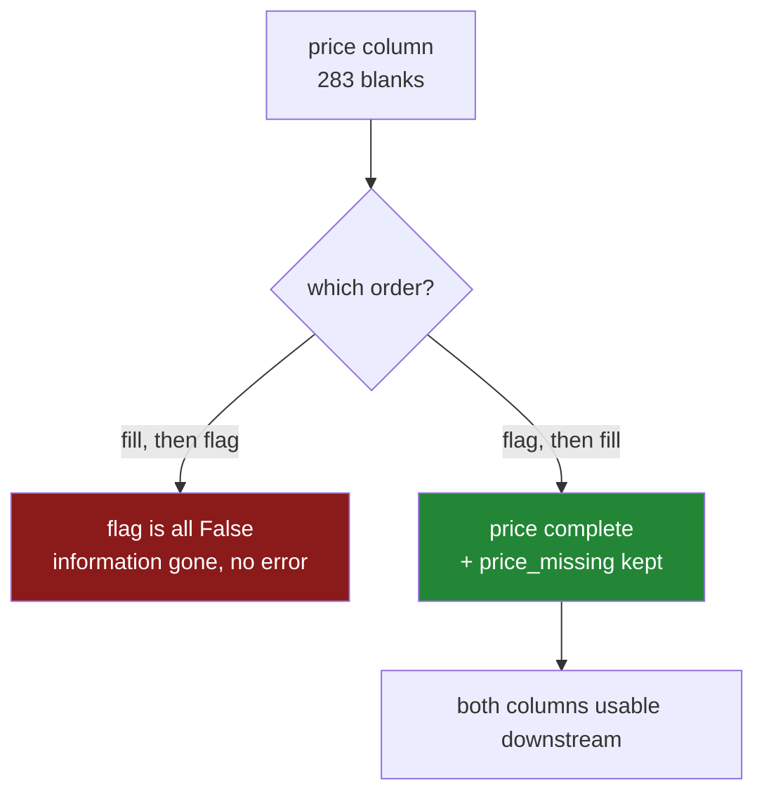

# 3.2 — The blank that is itself a signal

## One-line answer

When a value is missing for a reason, the fact that it is missing is information, so you record it as
its own true-or-false column **before** you fill the blank — otherwise the fill destroys the only
evidence that the row was ever different.

---

## The story

The flat's sheet has a habit nobody planned.

When somebody does the big weekly shop at the supermarket, they come home with a long till receipt
and type everything in, prices and all. When somebody nips to the corner shop at eleven at night
because there is no milk, they do not keep the receipt. They type in what they bought and leave the
price blank.

So the blank prices are not scattered evenly. They are almost all the late corner-shop trips, and the
corner shop is dearer than the supermarket. Somebody who has lived in the flat for a year knows this
without being told: *if the price box is empty, it was probably a late one, and it probably cost more
than it should have.*

Now somebody decides to tidy the sheet. They fill every empty price box with the middle price from
the rest of the sheet, so that the totals add up. The sheet looks complete for the first time in a
year.

And the thing the flatmate knew is gone. There is no longer any way to tell a corner-shop line from a
supermarket line, because the only thing that distinguished them was the empty box, and the empty
boxes are full now. The sheet got tidier and it got less informative, and nothing on the screen shows
that the trade happened.

---

## The idea in plain language

A **missingness indicator** is an extra column holding `True` or `False`, one per row, saying whether
some other column was blank before you filled it. It is the flag from
[2.1](../02-finding-it/2.1-isna-and-notna.md) — `df["price"].isna()` — kept as a column instead of
being thrown away after use.

The reason to keep it is the whole of [3.1](3.1-three-reasons-a-line-is-blank.md) turned around. If
a value is missing for a reason — the second or third case — then whether it is missing carries
information about the row. Filling the blank makes that row look like every other row, which is
exactly what filling is for and exactly the problem. **You cannot both erase the blank and keep what
the blank told you, unless you write it down first.**

There is a common shape to this in real systems: the fact that a field is empty is often a better
predictor than any value you could put in it. A customer who did not enter an income. A patient whose
test was never ordered — because nobody thought it was necessary. A form question left blank because
the answer was awkward. In every case the blank is a record of a decision somebody made, and
decisions are informative.

Three things to be clear about, because this idea is easy to over-apply:

- **The indicator is not a substitute for filling.** You still have to put something in the numeric
  column, because most downstream tools cannot take a blank. The indicator is an *addition*: fill the
  value, keep the flag, and let whatever comes next use both.
- **It is not free.** Every indicator is another column. On a table with two hundred columns, adding
  an indicator for all of them doubles the width for very little gain, because most of those columns
  are missing for no reason at all and their flags are pure noise. The rule is: add the indicator
  where you have evidence that the blank is not random, which is the report from
  [3.1](3.1-three-reasons-a-line-is-blank.md).
- **It is only honest if the blank means the same thing at prediction time.** If prices are missing
  in your training data because of corner-shop trips, but missing in production because a new supplier
  feed times out, the flag now means something different and the model is reading it as though it
  meant the old thing. This is the trap in the production section below and it is the reason this
  part is `production` level.

---

## Why Setu needs it

- **[5.1](../05-filling/5.1-fillna-is-a-claim.md)** fills blanks, and the order matters: the flag has
  to be computed **before** the fill, because after the fill there is nothing left to compute it from.
  That ordering constraint is this part's practical output.
- **[6.3](../06-the-leak/6.3-the-imputer-you-write-yourself.md)** builds a small object that learns
  its fill values once and applies them anywhere, with the flag built in — which is the shape
  scikit-learn's imputer has, and its `add_indicator` switch exists for exactly this reason.
- **Day 76** is feature engineering, where "is this field blank" is one of the cheapest useful
  features you can build, and where the decision to include it is made per column with evidence.
- **Day 118** is evaluation. A model that leans on a missingness flag is fragile in a specific way —
  it breaks when the reason for the blank changes — and that fragility has to be tested for, not
  assumed away.

---

## The mechanism

A year of the flat's sheet, simulated so that the truth is known. Some trips are late corner-shop
trips; those are dearer, and those are the ones whose receipts get lost.

```python
import numpy as np
import pandas as pd

rng = np.random.default_rng(32)
n = 1200

late = rng.random(n) < 0.25
price = np.where(late, rng.normal(4.5, 0.8, n), rng.normal(2.0, 0.5, n)).round(2)
receipt_kept = np.where(late, rng.random(n) < 0.2, rng.random(n) < 0.95)

sheet = pd.DataFrame(
    {
        "price": np.where(receipt_kept, price, np.nan),
        "spend_next_week": (price * 3 + rng.normal(0, 1, n)).round(2),
    }
)

print("rows:", n, " blanks:", int(sheet["price"].isna().sum()))
```

**Line by line:**

- `late` is the hidden truth — about a quarter of the trips are late corner-shop trips. **This column
  is never put in the sheet**, because in real life you do not have it; that is the whole situation
  being modelled.
- `price` is dearer when `late` is true: about £4.50 against about £2.00.
- `receipt_kept` is where the two cases separate. A late trip keeps its receipt twenty per cent of
  the time; a supermarket trip keeps it ninety-five per cent of the time. So **the blank is caused by
  the same hidden thing that causes the high price**, which is the third case from
  [3.1](3.1-three-reasons-a-line-is-blank.md) arriving through a side door.
- `np.where(receipt_kept, price, np.nan)` writes the price where the receipt survived and a blank
  where it did not. This is the only price column anybody actually sees.
- `spend_next_week` is a stand-in for anything you might later want to predict, built to depend on
  the true price. It gives the part something to measure against; without a downstream question,
  "this column is informative" has no meaning.

```text
rows: 1200  blanks: 283
```

Now the question that decides whether the flag is worth keeping: **do the blank rows differ from the
rest?**

```python
known = sheet["price"].notna()
print("next-week spend, price known  :", round(sheet.loc[known, "spend_next_week"].mean(), 3))
print("next-week spend, price missing:", round(sheet.loc[~known, "spend_next_week"].mean(), 3))
```

**Line by line:**

- `known` is the mask from [2.1](../02-finding-it/2.1-isna-and-notna.md), stored in a variable
  because it is used twice and because naming it makes both lines read as English.
- `sheet.loc[known, "spend_next_week"]` selects rows by mask and a column by name in one call, which
  is the comma form from
  [Day 28, 1.4](../../../day-28-selection-and-alignment/parts/01-label-and-position/1.4-rows-and-columns-at-once.md).
- `~known` inverts the mask — the tilde from
  [Day 28, 2.3](../../../day-28-selection-and-alignment/parts/02-masks/2.3-and-or-not-and-the-brackets.md),
  not Python's `not`, which would raise on a whole column.
- **The comparison is against another column, not against the blank column itself.** That is the
  only way to ask the question honestly: you cannot compare the missing prices to the known prices,
  because the missing ones are missing.

```text
next-week spend, price known  : 6.473
next-week spend, price missing: 12.49
```

Twice as much. The rows with a blank price are a genuinely different kind of row, and nothing about
that fact is stored in the price column — it is stored in the *emptiness* of the price column.

Now do the tidying, in the order that keeps the information:

```python
tidy = sheet.copy()
tidy["price_missing"] = tidy["price"].isna()
tidy["price"] = tidy["price"].fillna(tidy["price"].median())

print(tidy.groupby("price_missing")["spend_next_week"].mean().round(3).to_dict())
```

**Line by line:**

- `tidy["price_missing"] = tidy["price"].isna()` comes **first**. Reverse these two lines and the
  flag is computed after the fill, at which point `isna()` finds nothing and the column is entirely
  `False`. That is the single most common way this technique is got wrong, and it fails silently.
- `.fillna(...)` replaces the blanks; the median is used rather than the mean because it is not
  dragged around by a few extreme values. What to fill with is [5.1](../05-filling/5.1-fillna-is-a-claim.md)'s
  subject, and the choice does not matter to this part — any fill destroys the same information.
- `tidy["price"] = ...` writes back to the same column. Copy-on-write means the original `sheet` is
  untouched
  ([Day 26, 3.1](../../../day-26-frames-and-copy-on-write/parts/03-copy-on-write/3.1-every-result-behaves-like-a-copy.md)),
  which is what makes the comparison below possible.
- The `groupby` line asks the same question as before, but now using the saved flag rather than the
  blanks. If the numbers match, the information survived the fill.

```text
{False: 6.473, True: 12.49}
```

Identical to the numbers before the fill. **The price column is now complete and the distinction is
still there**, because it was written down before it was erased.

Finally, how much is the flag actually worth compared with the filled value?

```python
print(
    "flag vs next-week spend  :",
    round(tidy["price_missing"].astype("float64").corr(tidy["spend_next_week"]), 3),
)
print(
    "price vs next-week spend :",
    round(tidy["price"].corr(tidy["spend_next_week"]), 3),
)
```

**Line by line:**

- `.corr()` measures how strongly two columns move together, on a scale from −1 to 1. Zero means
  knowing one tells you nothing about the other; it is a crude summary and it is enough here.
- `.astype("float64")` on the flag, because correlation needs numbers and the flag is `True`/`False`.
  `True` becomes `1.0` and `False` becomes `0.0`, which is the same convention that made summing a
  mask work in [2.2](../02-finding-it/2.2-counting-the-blanks.md).
- The two lines are printed together on purpose. The comparison is the result, not either number by
  itself.

```text
flag vs next-week spend  : 0.677
price vs next-week spend : 0.5
```

**The flag is more informative than the column it came from.** After filling, the price column is
part real data and part invented median, and the invention has washed out some of the signal. The
flag is not diluted at all: it is a perfect record of a real distinction. Throwing it away, which is
what tidying the sheet normally does, throws away the better of the two columns.



---

## When it breaks

**The flag computed one line too late:**

```text
$ uv run python -c "
import numpy as np, pandas as pd
s = pd.DataFrame({'price': [1.15, np.nan, 2.05, np.nan]})
s['price'] = s['price'].fillna(s['price'].median())
s['price_missing'] = s['price'].isna()
print(s)
print('flags set:', int(s['price_missing'].sum()))
"
```

```text
   price  price_missing
0   1.15          False
1   1.60          False
2   2.05          False
3   1.60          False
flags set: 0
```

**What it means.** Two lines in the wrong order. No error, no warning, and a column of `False` that
looks like a legitimate result — a sheet with no missing prices, which is precisely what the fill on
the line above just made true. Every model trained on this table will find the flag useless, because
it is, and nobody will ever know a useful feature was destroyed. The fix is to move one line up. The
defence is a test that asserts the flag's sum equals the blank count measured before the fill.

**Adding an indicator for a column where the blanks mean nothing:**

```text
$ uv run python -c "
import numpy as np, pandas as pd
rng = np.random.default_rng(7)
n = 2000
target = rng.normal(10, 2, n)
noise = rng.normal(0, 1, n)
noise[rng.random(n) < 0.3] = np.nan
df = pd.DataFrame({'noise': noise, 'target': target})
df['noise_missing'] = df['noise'].isna()
print('blank share :', round(float(df['noise_missing'].mean()), 3))
print('flag corr   :', round(df['noise_missing'].astype('float64').corr(df['target']), 4))
"
```

```text
blank share : 0.321
flag corr   : 0.0228
```

**What it means.** Thirty-two per cent of that column is blank and the flag is worth nothing —
a correlation of about two per cent, which is indistinguishable from zero on two thousand rows.
The blanks here are the first case from [3.1](3.1-three-reasons-a-line-is-blank.md): they landed at
random, so the flag is a coin flip. Adding it costs a column, adds a chance for a model to overfit
noise, and gains nothing. **The indicator is a judgement, not a default**, and "we add indicators for
every column" is a decision to fill your table with coin flips.

**The flag whose meaning changed between training and production:**

```text
$ uv run python -c "
import numpy as np, pandas as pd
rng = np.random.default_rng(11)
train = pd.DataFrame({'price': np.where(rng.random(1000) < 0.25, np.nan, rng.normal(2, .5, 1000))})
live  = pd.DataFrame({'price': np.where(rng.random(1000) < 0.92, np.nan, rng.normal(2, .5, 1000))})
print('train blank share:', round(float(train['price'].isna().mean()), 3))
print('live  blank share:', round(float(live['price'].isna().mean()), 3))
"
```

```text
train blank share: 0.261
live  blank share: 0.921
```

**What it means.** No error again — both frames are valid. But the flag the model learned meant "this
was a late corner-shop trip, about a quarter of rows"; the flag it now receives means "the supplier
feed is down, ninety-two per cent of rows". The model applies the old meaning to the new signal and
predicts with total confidence. **This is the specific fragility that missingness indicators buy**,
and it is why the blank share of every flagged column belongs in monitoring, with an alert on the
share moving — the same alert argued for in [2.2](../02-finding-it/2.2-counting-the-blanks.md).

---

## In production

**What a professional writes instead of the teaching version.** They do not sprinkle `isna()`
assignments through a notebook. They write one function that takes the columns worth flagging as an
argument, guarantees the order, and returns the new column names so the caller can record them:

```python
import pandas as pd


def add_missing_indicators(
    frame: pd.DataFrame,
    columns: list[str],
    suffix: str = "_missing",
) -> tuple[pd.DataFrame, list[str]]:
    """Add one boolean column per named column, recording where it was blank.

    Must be called before any imputation. Returns the frame and the new names.
    """
    out = frame.copy()
    added: list[str] = []
    for column in columns:
        name = f"{column}{suffix}"
        if name in out.columns:
            raise ValueError(f"{name} already exists — indicators added twice?")
        out[name] = out[column].isna()
        added.append(name)
    return out, added
```

**Line by line:**

- `columns: list[str]` is required, with no default of "all columns". Making the caller name them
  forces the judgement from [3.1](3.1-three-reasons-a-line-is-blank.md) to be made and written down
  somewhere a reviewer can see it.
- `frame.copy()` so the function does not modify its argument. A cleaning step that mutates the
  frame it was given makes the order of calls in a notebook load-bearing, which is how notebooks stop
  being reproducible.
- The `if name in out.columns: raise` guard catches the specific accident of running the cell twice.
  Without it the second run computes indicators from an already-imputed frame and silently overwrites
  the good flags with a column of `False` — the failure from the first transcript above, arriving by
  a different route.
- `out[column].isna()` gives a plain `bool` column. It is deliberately not converted to `0`/`1` here:
  a boolean column is a third the size of a float one, it prints readably, and whatever consumes it
  can cast at the last moment.
- The function **returns the added names**. The caller needs them for the feature list, the model
  card and the monitoring config, and re-deriving them by string concatenation somewhere else is how
  the suffix ends up spelled two ways.
- It does not fill anything. Filling is a separate step with a separate decision, and keeping them
  apart is what lets the pipeline in [6.3](../06-the-leak/6.3-the-imputer-you-write-yourself.md) put them
  in the right order deliberately rather than by luck.

**What changes at scale.** Two costs and one habit. The cost in width is real: on a wide table,
indicators for everything can double the column count, and for tree-based models that means a
meaningfully slower fit for mostly-noise features. The cost in memory is smaller than people expect —
a boolean column is one byte per row against eight for a float — so the argument against blanket
indicators is signal, not storage. The habit is that in a mature system the indicator is not added at
model time at all; it is added at the boundary where the data is ingested, alongside the sentinel
conversion from [2.3](../02-finding-it/2.3-the-blank-that-was-not-blank.md), so that every consumer
of the table sees the same flags and nobody has to reconstruct them after a fill has already happened
upstream.

**The failure mode that only appears with real data.** The indicator turns out to be a leak. In a
medical dataset, a test result is missing because the test was never ordered, and it was never
ordered because the patient was obviously fine — so "result missing" predicts "healthy" almost
perfectly. The model scores brilliantly and has learned the hospital's triage process rather than
anything about the disease. Deployed at a site with different ordering habits, it fails completely.
The check is to ask, for every flag that turns out to be strongly predictive, *what process produced
this blank, and will that process be the same where the model runs?* A flag that is too good is a
warning, not a win.

**The review comment a senior engineer leaves.** *"`price_missing` is computed after `fillna` on line
41, so it is all `False` and the feature does nothing. Move it above, and please add an assertion
that its sum matches the pre-fill blank count — this failed silently for two releases last year."*

**The interview question.** *"You have a column that is thirty per cent missing. Do you drop it, fill
it, or something else?"* The answer they are listening for is "it depends on why it is missing", and
the follow-up they want is the indicator: fill the column so downstream tools can use it, and add a
boolean column recording where the blanks were, so that the information in the missingness is not
destroyed by the fill. The question after that — the one that finds out whether you have shipped this
— is *"what breaks about that flag in production?"* Its meaning changes when the cause of the
missingness changes, so the blank rate has to be monitored and the model retrained when it moves.

---

## Check yourself

```bash
uv run python -c "
import numpy as np, pandas as pd
rng = np.random.default_rng(32)
n = 1200
late = rng.random(n) < 0.25
price = np.where(late, rng.normal(4.5, 0.8, n), rng.normal(2.0, 0.5, n)).round(2)
kept = np.where(late, rng.random(n) < 0.2, rng.random(n) < 0.95)
sheet = pd.DataFrame({
    'price': np.where(kept, price, np.nan),
    'spend_next_week': (price * 3 + rng.normal(0, 1, n)).round(2),
})
right = sheet.copy()
right['flag'] = right['price'].isna()
right['price'] = right['price'].fillna(right['price'].median())
wrong = sheet.copy()
wrong['price'] = wrong['price'].fillna(wrong['price'].median())
wrong['flag'] = wrong['price'].isna()
print('flags kept, right order:', int(right['flag'].sum()))
print('flags kept, wrong order:', int(wrong['flag'].sum()))
print('right order, flag corr :', round(right['flag'].astype('float64').corr(right['spend_next_week']), 3))
print('wrong order, flag corr :', round(wrong['flag'].astype('float64').corr(wrong['spend_next_week']), 3))
"
```

The two versions differ by the order of two lines and neither of them errors. Say what the last
number is, and why it is that rather than a number close to zero.

**Answer out loud, without scrolling up:**

> Say what a missingness indicator is, in one sentence, without using the word "indicator". Then say
> which must happen first — computing it or filling the blank — and describe exactly what the column
> contains if you get that order wrong.

---

**Next:** [4.1 — `dropna`, and the rows that left](../04-dropping/4.1-dropna-and-the-rows-that-left.md).
