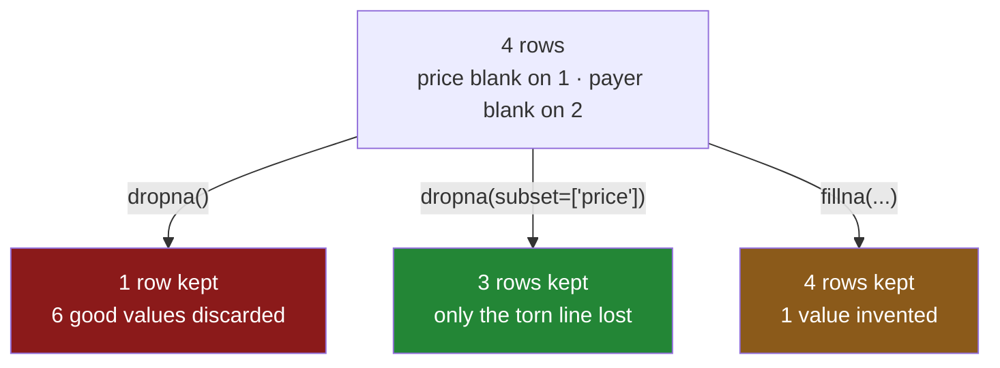

# 4.1 — `dropna`, and the rows that left

## One-line answer

`dropna()` removes every row that has a blank **anywhere in it**, which on a table with several
partly-empty columns can throw away most of your data while looking like a one-word tidy-up.

---

## The story

The flat's sheet has grown a second problem. As well as the price box, there is now a box for who
paid, and people fill in one or the other depending on how tired they are.

Four lines this week. The milk line is complete. The bread line has a price but nobody said who paid.
The eggs line has a payer but the price was torn off. The rice line has a price and no payer.

Every one of those lines is useful. Three of them have a price, which is what you need for the total.
Two of them have a payer, which is what you need to work out who owes what.

Somebody decides to clean the sheet before doing the sums, and deletes every line that has anything
missing.

One line survives. The milk.

The total is now one pound fifteen. The four-line shop that cost about six pounds is recorded as a
shop for milk, and the deletion looked like housekeeping the whole way through. Nothing was
overwritten, nothing was miscalculated, and every number that remains is completely accurate about a
week that did not happen.

---

## The idea in plain language

`dropna()` is the method that removes rows containing missing values. Called with no arguments it
follows one rule: **if a row has a blank in any column at all, the whole row goes.**

That rule is worth saying twice, because the mental picture most people have is different. People
imagine `dropna()` removing the *blanks*. It does not — it removes the *rows the blanks are in*, and
with them every good value on those rows. A row with nine useful facts and one blank is deleted as
completely as a row that is entirely empty.

The consequence gets worse as a table gets wider, and the arithmetic is worth doing once. Suppose
every column is independently blank five per cent of the time — a completeness most people would
call excellent. A row survives only if every column is present. With one column, ninety-five per
cent of rows survive. With ten columns, about sixty per cent. With twenty, about thirty-six per cent.
**Nothing has gone wrong with any individual column, and you have lost two rows in three.**

Two other facts about the call itself, both of which catch people:

- **It returns a new frame and changes nothing.** `df.dropna()` on its own line does nothing at all
  to `df`. You have to assign the result: `df = df.dropna()`. This follows from copy-on-write, which
  Day 26 covered
  ([Day 26, 3.1](../../../day-26-frames-and-copy-on-write/parts/03-copy-on-write/3.1-every-result-behaves-like-a-copy.md)),
  and it is the most common way a cleaning step silently does nothing.
- **The index comes along unchanged.** Drop the second row and the remaining labels are still the
  originals, with a gap where the dropped row was. That is usually what you want — the labels
  identify real things — but it surprises anyone expecting the rows to be renumbered, and it means
  that a positional lookup after a drop points somewhere different than before.

The real question, though, is not how the method behaves. It is whether you are allowed to use it,
and that is [3.1](../03-why-it-is-missing/3.1-three-reasons-a-line-is-blank.md): dropping is safe
only when the rows you lose are a fair sample of the rows you had. If the blanks arrived for a
reason, `dropna()` is not cleaning, it is selecting — and the thing it is selecting on is invisible
in the result.

---

## Why Setu needs it

- **[4.2](4.2-how-thresh-and-subset.md)** is the same method with the arguments that make it usable:
  drop on *these* columns only, or drop a row only if it is *mostly* empty.
- **[4.3](4.3-dropping-the-column-instead.md)** is the other direction — sometimes the right move is
  to lose one bad column rather than half your rows.
- **[5.1](../05-filling/5.1-fillna-is-a-claim.md)** is the alternative: keep the row and put
  something in the box. Every real pipeline uses both, per column, on purpose.
- **[6.1](../06-the-leak/6.1-the-median-that-saw-the-test-set.md)** shows what happens when you drop
  rows after splitting into training and test sets — the two halves end up with different sizes and
  different biases, and the comparison between them stops meaning anything.
- **Day 76** and **Day 91** build the feature pipeline and put the imputer inside it. Whether a
  column is dropped or filled is a per-column decision recorded there, and it starts here.

---

## The mechanism

The four-line week, with two columns that each have blanks in different rows:

```python
import pandas as pd

shop = pd.DataFrame(
    {
        "item": pd.Series(["milk", "bread", "eggs", "rice"], dtype="str"),
        "need": [2, 1, 6, 1],
        "price": [1.15, 1.40, None, 2.05],
        "paid_by": pd.Series(["ana", None, "ana", None], dtype="str"),
    }
).set_index("item")

print(shop)
```

**Line by line:**

- `price` is blank on `eggs` only — the torn receipt from
  [1.1](../01-what-missing-means/1.1-the-price-nobody-wrote-down.md).
- `paid_by` is blank on `bread` and `rice`, which are different rows. **That is the whole design of
  the example**: two columns whose blanks do not line up, which is what real tables look like.
- `dtype="str"` on the text columns states the type rather than letting it be inferred
  ([Day 26, 2.2](../../../day-26-frames-and-copy-on-write/parts/02-the-str-dtype/2.2-str-the-dtype-pandas-3-infers.md)).
  The blank inside a `str` column prints as `NaN` here, which
  [1.5](../01-what-missing-means/1.5-one-dtype-one-kind-of-blank.md) explains.
- Counted up: three rows have a price, two have a payer, and **one row has both**.

```text
       need  price paid_by
item
milk      2   1.15     ana
bread     1   1.40     NaN
eggs      6    NaN     ana
rice      1   2.05     NaN
```

Now the one-word tidy-up:

```python
print(shop.dropna())
```

**Line by line:**

- No arguments, so the default rule applies: a row goes if it has a blank in **any** column.
- `milk` is the only row with nothing missing anywhere, so `milk` is the only row that survives.
- Nothing is printed about what left. There is no count, no warning and no return value carrying the
  discarded rows. **The information about what was dropped exists only in the difference between two
  numbers you have to think to compare.**

```text
      need  price paid_by
item
milk     2   1.15     ana
```

Three rows deleted, and look at what went with them. The `bread` price of `1.40` was fine. The `rice`
price of `2.05` was fine. The `eggs` payer was known. Six perfectly good values were thrown out to
get rid of three blanks, because the unit of deletion is the row.

The index tells you what happened, if you look:

```python
kept = shop.dropna(subset=["price"])
print(kept)
print("kept:", kept.index.tolist(), "of", shop.index.tolist())
```

**Line by line:**

- `subset=["price"]` restricts the rule to one column: *drop a row only if its price is blank*. This
  is [4.2](4.2-how-thresh-and-subset.md)'s subject, used here to show the index behaviour on a
  result with more than one row in it.
- The result keeps the original labels — `milk`, `bread`, `rice` — with `eggs` simply absent. There
  is no renumbering, so a label that identified a real thing still identifies it.
- Printing the two index lists side by side is the cheapest possible audit of a drop, and it is worth
  the habit: the second list minus the first is exactly what you lost.

```text
       need  price paid_by
item
milk      2   1.15     ana
bread     1   1.40     NaN
rice      1   2.05     NaN
kept: ['milk', 'bread', 'rice'] of ['milk', 'bread', 'eggs', 'rice']
```

Now the arithmetic that makes this dangerous on a real table. Twenty columns, each five per cent
blank, ten thousand rows:

```python
import numpy as np

rng = np.random.default_rng(41)
n, k = 10_000, 20

data = rng.normal(size=(n, k))
data[rng.random((n, k)) < 0.05] = np.nan
wide = pd.DataFrame(data, columns=[f"c{i:02d}" for i in range(k)])

print("blank share per column:", round(float(wide.isna().mean().mean()), 4))
print("rows in               :", len(wide))
print("rows after dropna     :", len(wide.dropna()))
print("share kept            :", round(len(wide.dropna()) / len(wide), 4))
print("0.95 ** 20            :", round(0.95**20, 4))
```

**Line by line:**

- `rng.normal(size=(n, k))` makes a ten-thousand by twenty block of numbers. The values are
  irrelevant; only the pattern of blanks matters.
- `data[rng.random((n, k)) < 0.05] = np.nan` blanks each box independently with probability one in
  twenty. **Independently is the key word** — real blanks often cluster, which makes the loss less
  severe, and real blanks sometimes cluster the other way, which makes it worse.
- `f"c{i:02d}"` names the columns `c00` … `c19`. Zero-padding keeps them in the right order when
  sorted as text, which matters the moment anything alphabetises them.
- `0.95**20` is printed next to the measured result as a check on the reasoning: the chance that all
  twenty of a row's values are present is 0.95 multiplied by itself twenty times. **If the measured
  number and the predicted number agree, the mechanism is understood rather than observed.**

```text
blank share per column: 0.0507
rows in               : 10000
rows after dropna     : 3510
share kept            : 0.351
0.95 ** 20            : 0.3585
```

**Ninety-five per cent complete, per column, and `dropna()` keeps thirty-five per cent of the rows.**
The measured figure and the predicted figure agree to within sampling noise, which means this is not
a quirk of this data — it is what the default rule does, always, on any wide table.



---

## When it breaks

**The drop that did nothing:**

```text
$ uv run python -c "
import pandas as pd
df = pd.DataFrame({'price': [1.15, None, 2.05]})
df.dropna()
print('rows after the call:', len(df))
print('blanks after the call:', int(df['price'].isna().sum()))
"
```

```text
rows after the call: 3
blanks after the call: 1
```

**What it means.** `dropna()` returned a new frame with two rows in it, and that frame was thrown
away because nothing caught it. `df` is untouched. **No error, no warning**, and a notebook cell that
reads like a cleaning step and is a no-op. Every pandas method that returns a frame behaves this way,
which is exactly the copy-on-write rule from
[Day 26, 3.1](../../../day-26-frames-and-copy-on-write/parts/03-copy-on-write/3.1-every-result-behaves-like-a-copy.md).
The fix is to assign: `df = df.dropna()`.

**The row count that nobody printed:**

```text
$ uv run python -c "
import numpy as np, pandas as pd
rng = np.random.default_rng(41)
n, k = 10_000, 20
data = rng.normal(size=(n, k))
data[rng.random((n, k)) < 0.05] = np.nan
wide = pd.DataFrame(data, columns=[f'c{i:02d}' for i in range(k)])
clean = wide.dropna()
print('mean of c00, before:', round(wide['c00'].mean(), 4))
print('mean of c00, after :', round(clean['c00'].mean(), 4))
print('rows before        :', len(wide))
print('rows after         :', len(clean))
"
```

```text
mean of c00, before: -0.0119
mean of c00, after : -0.0215
rows before        : 10000
rows after         : 3510
```

**What it means.** The two means agree, which is the trap. These blanks were generated at random —
the first case from [3.1](../03-why-it-is-missing/3.1-three-reasons-a-line-is-blank.md) — so
throwing away two-thirds of the rows cost precision and not correctness, and every summary statistic
still looks right. On real data, where blanks cluster by source, region or device, the same operation
moves the means and the printout looks exactly as reassuring as this one. **The number that tells you
something happened is the row count, and it is the number nobody prints.**

**The empty frame at the end of a pipeline:**

```text
$ uv run python -c "
import numpy as np, pandas as pd
df = pd.DataFrame({
    'a': [1.0, 2.0, np.nan, 4.0],
    'b': [np.nan, 2.0, 3.0, 4.0],
    'c': [1.0, np.nan, 3.0, np.nan],
})
clean = df.dropna()
print(clean)
print('rows:', len(clean))
print('mean of a:', clean['a'].mean())
"
```

```text
Empty DataFrame
Columns: [a, b, c]
Index: []
rows: 0
mean of a: nan
```

**What it means.** Three columns, each missing one or two values, no row complete. `dropna()` returns
a frame with the right columns and no rows, and **it does not raise** — an empty frame is a valid
frame. The mean of an empty column is `nan`, which then propagates through everything downstream
until something eventually complains about a completely different line, a long way from the cause.
This is why a guard on the row count belongs immediately after any drop, and why the production
version below refuses rather than returning nothing.

---

## In production

**What a professional writes instead of the teaching version.** They never call bare `dropna()` on a
whole frame in a pipeline. They name the columns that are genuinely required, state how much loss is
acceptable, and fail loudly when the loss exceeds it:

```python
import logging

import pandas as pd

log = logging.getLogger(__name__)


def drop_incomplete(
    frame: pd.DataFrame,
    required: list[str],
    max_loss: float = 0.02,
) -> pd.DataFrame:
    """Drop rows missing a required field. Refuse if that loses too much of the table."""
    before = len(frame)
    if before == 0:
        raise ValueError("cannot drop from an empty frame")

    kept = frame.dropna(subset=required)
    lost = before - len(kept)
    share = lost / before

    if share > max_loss:
        by_column = frame[required].isna().sum().sort_values(ascending=False)
        raise ValueError(
            f"dropping rows missing {required} would lose {lost}/{before} "
            f"({share:.1%} > {max_loss:.1%}); blanks per column: {by_column.to_dict()}"
        )

    log.info("dropped %d of %d rows (%.2f%%) missing %s", lost, before, share * 100, required)
    return kept
```

**Line by line:**

- `required: list[str]` has no default. The caller must say which fields a row cannot do without,
  which forces someone to think about it once rather than accepting the default rule for ever.
- `if before == 0: raise` — dividing by zero to compute the loss share would give a confusing
  traceback several lines later. An empty input is a real thing that happens on the day a feed
  breaks, and it deserves its own message.
- `max_loss: float = 0.02` is a **share, not a count**, for the reason argued in
  [2.2](../02-finding-it/2.2-counting-the-blanks.md): a count threshold has to be retuned every time
  the table grows.
- The error message carries the count, the total, the share, the limit **and** the blanks per column
  sorted worst-first. That last part is what turns "this failed" into "this failed because `paid_by`
  is empty on 4 000 rows", which is the difference between a five-minute fix and an hour.
- `log.info(...)` on the success path. **A drop that stays under the limit is still a drop**, and if
  it is never recorded then nobody can answer "when did we start losing two per cent of rows?" six
  months later.
- The `%d`/`%s` style rather than an f-string in the log call: the formatting only happens if the
  message is actually emitted, which matters when this runs per batch in a hot loop.
- What it does not do: it does not fill, and it does not drop columns. Those are
  [5.1](../05-filling/5.1-fillna-is-a-claim.md) and [4.3](4.3-dropping-the-column-instead.md), and a
  function that quietly does all three is a function nobody can review.

**What changes at scale.** `dropna` builds the full boolean grid, reduces it per row, then takes a
copy of the surviving rows — so on a large frame it costs a temporary the size of the table plus the
size of the result. On data too large for memory, the same operation in Polars or DuckDB (Day 35) is
expressed as a filter and executed without ever building the intermediate mask, which is one of the
concrete reasons those tools exist. The more important production change is organisational: a drop
that happens deep inside a transformation is invisible in the output, so mature pipelines record row
counts at every stage and treat an unexplained drop between two stages as an incident. **You cannot
debug a row that is not there.**

**The failure mode that only appears with real data.** Blanks in real tables are correlated, not
independent, and the correlation usually follows the source: one region's feed, one device's
firmware, one partner's export. So `dropna()` does not remove a random third of the rows — it removes
that region, that device, that partner, entirely. The model trains without them, scores well on a
test set that also excludes them, and fails the day it meets them in production. The check is the
report from [3.1](../03-why-it-is-missing/3.1-three-reasons-a-line-is-blank.md), run on the dropped
rows specifically: if the rows you dropped differ from the rows you kept on any column you can see,
the drop was a selection.

**The review comment a senior engineer leaves.** *"Bare `dropna()` on a 40-column frame will delete
most of the table the first time any optional column goes blank. Please pass `subset=` with the
fields that are actually required, and log the before/after row counts — right now this stage is
invisible in the logs."*

**The interview question.** *"What does `dropna()` do, and when would you not use it?"* It removes
every row that has a missing value in any column, which means it discards good values to remove
blanks and gets much more aggressive as a table gets wider. The follow-up is the one that matters:
*"twenty columns, each five per cent missing — how much of the table survives?"* About thirty-six per
cent, because a row survives only if all twenty values are present, and 0.95 to the twentieth power
is 0.36. Anyone who has been surprised by this once remembers the number.

---

## Check yourself

```bash
uv run python -c "
import pandas as pd
shop = pd.DataFrame(
    {
        'item':    pd.Series(['milk', 'bread', 'eggs', 'rice'], dtype='str'),
        'need':    [2, 1, 6, 1],
        'price':   [1.15, 1.40, None, 2.05],
        'paid_by': pd.Series(['ana', None, 'ana', None], dtype='str'),
    }
).set_index('item')
print('rows in                :', len(shop))
print('rows after dropna()    :', len(shop.dropna()))
print('rows after subset price:', len(shop.dropna(subset=['price'])))
print('good values discarded  :', int(shop.notna().sum().sum() - shop.dropna().notna().sum().sum()))
shop.dropna()
print('rows in shop, still    :', len(shop))
"
```

The last line runs `dropna()` and then reports four rows. Say why, in one sentence, and say what one
character you would add to make it do what it looks like it does.

**Answer out loud, without scrolling up:**

> Say what unit `dropna()` deletes — not what it removes, what it *deletes*. Then say roughly what
> fraction of a table survives it when there are twenty columns and each one is blank five per cent
> of the time, and say where that fraction comes from.

---

**Next:** [4.2 — `how`, `thresh` and `subset`](4.2-how-thresh-and-subset.md).
