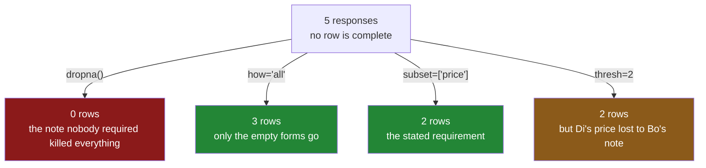

# 4.2 — `how`, `thresh` and `subset` — dropping on purpose

## One-line answer

`subset=` says which columns the rule is allowed to look at, `how="all"` drops a row only when it is
entirely empty, and `thresh=n` keeps a row that has at least `n` real values — and `subset` is the
one you will use nearly every time.

---

## The story

The flat has a form now, because the sheet was getting untidy. Five people filled it in this week.

Ana filled in the price and who paid. Bo filled in who paid and left a note saying the receipt was
torn. Cy opened the form and did not fill in anything. Di put in a price and nothing else. Ed, like
Cy, filled in nothing at all.

Somebody wants to work out the week's spending, and the rule that matters is simple: **a line is
useful if it has a price on it.** The note is optional and always has been. Who paid is nice to have.

The tidy-up from [4.1](4.1-dropna-and-the-rows-that-left.md) — delete every line with anything
missing — leaves nothing at all, because nobody filled in all three boxes. Even Ana, who did the most
work, left the note blank, and the note was never required.

What is needed is a rule that says which boxes matter. *Delete the lines with no price.* That keeps
Ana and Di, loses Bo, Cy and Ed, and it is a defensible thing to have done because somebody said out
loud what the form was for.

There is a second, softer rule worth having as well: *delete the lines where somebody opened the form
and typed nothing*. That is Cy and Ed, and removing them is uncontroversial in a way that removing Bo
is not — Bo told you something, even if it was not the thing you wanted.

---

## The idea in plain language

`dropna()` has three arguments that change what "a row with blanks" means. They are not
interchangeable and each answers a different question.

**`subset=` — which columns the rule looks at.** `dropna(subset=["price"])` deletes a row when
`price` is blank, and it does not care what any other column contains. This is the argument that
turns `dropna` from a blunt instrument into a statement of requirements: *these fields are required,
everything else is optional.* It is the one you should reach for by default, because it forces you to
write down which fields matter, and that list is a genuinely useful piece of documentation.

**`how=` — whether one blank is enough.** The default is `how="any"`: a row goes if **any** of the
columns under consideration is blank. The alternative is `how="all"`: a row goes only if **every**
column under consideration is blank. `how="all"` is the "somebody opened the form and typed nothing"
rule, and it is close to the only completely safe drop there is, because a row with nothing in it
carries no information to lose.

**`thresh=n` — how many real values a row must have to survive.** `thresh=2` keeps a row that has at
least two values that are not blank, however they are spread. This is the graded version, and it is
useful when the columns are interchangeable — twenty sensor readings where any twelve will do, ten
survey questions where a mostly-complete response is still worth having. It is much less useful when
the columns mean different things, because "at least two of price, payer and note" treats a note as a
substitute for a price, and it is not one.

Three things about how they combine:

- **`subset` combines with the other two.** `dropna(subset=["price", "paid_by"], how="all")` means
  *drop a row only if both the price and the payer are blank*, and ignores the note entirely.
- **`how` and `thresh` do not combine.** Passing both raises, because they are two ways of saying the
  same kind of thing and pandas will not guess which one wins. The real error text is below.
- **`thresh` counts values that are present, not blanks that are absent.** `thresh=2` is "keep rows
  with two or more real values", not "drop rows with two or more blanks". Getting that backwards
  gives a result that is wrong in a way that looks plausible on a small table, and the fix is to
  print `df.notna().sum(axis=1)` next to it once and read the two together.

---

## Why Setu needs it

- **[4.1](4.1-dropna-and-the-rows-that-left.md)** showed why the default rule is dangerous on a wide
  table. `subset=` is the answer to that danger, and it is the reason bare `dropna()` should almost
  never appear in code you keep.
- **[4.3](4.3-dropping-the-column-instead.md)** applies the same arguments in the other direction,
  and the `thresh` idea reappears there as "drop a column unless it has at least this many values".
- **[6.1](../06-the-leak/6.1-the-median-that-saw-the-test-set.md)** needs the drop to be identical on
  the training half and the test half. A `subset=` list is a written-down rule that can be applied
  twice; "delete the empty-looking rows" is not.
- **Day 45** is the Phase 4 gate, where the deliverable is a clean, typed dataset. Part of what makes
  it defensible is a list of required columns that a reviewer can read, which is exactly a `subset=`
  argument lifted into a constant.
- **Day 76** runs this per batch in the feature pipeline, where the required-field list is part of
  the contract between the pipeline and whatever produces its input.

---

## The mechanism

The five form responses, with the note column that was never required:

```python
import pandas as pd

survey = pd.DataFrame(
    {
        "who": pd.Series(["ana", "bo", "cy", "di", "ed"], dtype="str"),
        "price": [1.15, None, None, 2.05, None],
        "paid_by": pd.Series(["ana", "bo", None, None, None], dtype="str"),
        "note": pd.Series([None, "torn", None, None, None], dtype="str"),
    }
).set_index("who")

print(survey)
print()
print("real values per row:")
print(survey.notna().sum(axis=1))
```

**Line by line:**

- Five rows, three columns, and **no row is complete** — even Ana's has a blank note. That is what
  makes bare `dropna()` useless here and is deliberately the common case.
- `cy` and `ed` are entirely blank: somebody opened the form and typed nothing.
- `survey.notna().sum(axis=1)` counts the real values on each row, which is the per-row count from
  [2.2](../02-finding-it/2.2-counting-the-blanks.md) with `notna` instead of `isna`. **Print this
  before using `thresh`**, every time — it is the column `thresh` compares against, and seeing it
  removes all the guesswork about which direction the threshold points.

```text
     price paid_by  note
who
ana   1.15     ana   NaN
bo     NaN      bo  torn
cy     NaN     NaN   NaN
di    2.05     NaN   NaN
ed     NaN     NaN   NaN

real values per row:
who
ana    2
bo     2
cy     0
di     1
ed     0
dtype: int64
```

**`subset=` — say which column matters:**

```python
print(survey.dropna(subset=["price"]))
```

**Line by line:**

- `subset=["price"]` restricts the rule to the price column. `paid_by` and `note` are not consulted
  at all, so Ana survives despite her blank note and Di survives despite having nothing but a price.
- The argument is a **list**, even for one column. `subset="price"` also works, and the list form is
  the one to write, because the day a second required field appears you add it inside the brackets
  rather than restructuring the call.
- Read the result as the requirement it encodes: *a response counts if it has a price.* That is a
  sentence somebody can agree or disagree with, which is more than can be said for `dropna()`.

```text
     price paid_by  note
who
ana   1.15     ana   NaN
di    2.05     NaN   NaN
```

**`how="all"` — drop only the completely empty rows:**

```python
print(survey.dropna(how="all"))
```

**Line by line:**

- `how="all"` changes the rule from "any blank" to "all blank". A row survives if it has **anything
  at all** in it.
- `cy` and `ed` go, because they are entirely empty. Everybody else stays, including Bo, whose only
  contributions are a payer and a note.
- This is the safest drop there is, and it is worth running early: an entirely blank row carries no
  information, so removing it cannot bias anything. It is often the right first line of any cleaning
  step, before any of the harder decisions.

```text
     price paid_by  note
who
ana   1.15     ana   NaN
bo     NaN      bo  torn
di    2.05     NaN   NaN
```

**`thresh=n` — keep rows with at least `n` real values:**

```python
for n in (1, 2, 3):
    print(f"thresh={n} keeps:", survey.dropna(thresh=n).index.tolist())
```

**Line by line:**

- `thresh=1` keeps every row with at least one value: Ana, Bo and Di. **That is identical to
  `how="all"`**, which is worth noticing — `how="all"` is the special case `thresh=1`, spelled in a
  way a reader understands without arithmetic.
- `thresh=2` keeps Ana and Bo, the two rows with two values each. Di is dropped despite having the
  price, which is the whole problem with `thresh` on columns that mean different things: it counted
  Bo's note as worth the same as Di's price.
- `thresh=3` keeps nobody, because no row is complete.
- The loop prints `.index.tolist()` rather than the frames, because the question here is *which rows
  survive*, and three printed frames is more to read than three lists of names.

```text
thresh=1 keeps: ['ana', 'bo', 'di']
thresh=2 keeps: ['ana', 'bo']
thresh=3 keeps: []
```

**Combining `subset` with `how`:**

```python
print(survey.dropna(subset=["price", "paid_by"], how="all"))
```

**Line by line:**

- The rule now reads: *drop a row only if the price **and** the payer are both blank.* The note is
  outside the subset, so it cannot save a row and cannot condemn one.
- Ana, Bo and Di survive. Cy and Ed go.
- This is the shape most real requirements take — "we need at least one way to identify this
  transaction" — and it is why `subset` and `how` are separate arguments rather than one setting.

```text
     price paid_by  note
who
ana   1.15     ana   NaN
bo     NaN      bo  torn
di    2.05     NaN   NaN
```



---

## When it breaks

**Passing `how` and `thresh` together:**

```text
$ uv run python -c "
import pandas as pd
df = pd.DataFrame({'a': [1.0, None], 'b': [None, None]})
print(df.dropna(how='any', thresh=2))
"
```

```text
Traceback (most recent call last):
  File "<string>", line 3, in <module>
TypeError: You cannot set both the how and thresh arguments at the same time.
```

**What it means.** The two arguments are two ways of expressing the same kind of rule, and pandas
refuses to pick one. This is a good error: it arrives immediately, says exactly what is wrong, and
the fix is to delete whichever argument you meant less. `how` is the one to keep when the rule is
"any" or "all"; `thresh` is the one to keep when the rule is a count.

**A typo in the subset list:**

```text
$ uv run python -c "
import pandas as pd
df = pd.DataFrame({'price': [1.0, None], 'paid_by': ['ana', None]})
print(df.dropna(subset=['prise']))
"
```

```text
Traceback (most recent call last):
  File "<string>", line 3, in <module>
KeyError: ['prise']
```

**What it means.** A misspelled column name raises rather than being quietly ignored, which is the
behaviour you want and is not universal across pandas — several methods silently accept names that
do not exist. Here the failure is loud and immediate. **This is an argument for `subset=` over
hand-rolled masks**: `df[df["prise"].notna()]` fails the same way, but a mask built up over several
lines can lose a column silently, and `subset` cannot.

**`thresh` read backwards:**

```text
$ uv run python -c "
import pandas as pd
df = pd.DataFrame({
    'a': [1.0, 1.0, None, None],
    'b': [1.0, None, None, None],
    'c': [1.0, 1.0, 1.0, None],
})
print('real values per row:', df.notna().sum(axis=1).tolist())
print('thresh=2 keeps rows:', df.dropna(thresh=2).index.tolist())
print('thresh=1 keeps rows:', df.dropna(thresh=1).index.tolist())
"
```

```text
real values per row: [3, 2, 1, 0]
thresh=2 keeps rows: [0, 1]
thresh=1 keeps rows: [0, 1, 2]
```

**What it means.** No error at all — this is the failure that ships. If you read `thresh=2` as "drop
rows with two or more blanks", you would expect rows 2 and 3 to go and rows 0 and 1 to stay, which is
what happened here **by coincidence**, because with three columns "at least two present" and "fewer
than two missing" describe the same set. Change the number of columns and the two readings diverge,
and by then the code is in production. Print `notna().sum(axis=1)` next to the call and the ambiguity
disappears: `thresh` is compared against that list, greater-than-or-equal.

---

## In production

**What a professional writes instead of the teaching version.** The required-field list is a
constant, not an argument typed at a call site, and the drop is done in two named stages so that the
logs distinguish "empty rows" from "rows missing something required":

```python
import logging

import pandas as pd

log = logging.getLogger(__name__)

REQUIRED: list[str] = ["price", "bought_on"]


def clean_rows(frame: pd.DataFrame) -> pd.DataFrame:
    """Drop empty rows, then rows missing a required field. Log both counts separately."""
    start = len(frame)

    non_empty = frame.dropna(how="all")
    empty_dropped = start - len(non_empty)

    missing = [column for column in REQUIRED if column not in non_empty.columns]
    if missing:
        raise KeyError(f"required columns absent from the frame: {missing}")

    kept = non_empty.dropna(subset=REQUIRED)
    incomplete_dropped = len(non_empty) - len(kept)

    log.info(
        "rows %d -> %d (empty: %d, missing %s: %d)",
        start,
        len(kept),
        empty_dropped,
        REQUIRED,
        incomplete_dropped,
    )
    return kept
```

**Line by line:**

- `REQUIRED` is a module constant. It is the contract between this pipeline and whatever produces its
  input, and a reviewer should be able to find it without reading the function.
- The two drops are **separate calls with separate counts**, even though one call could do both. The
  distinction matters operationally: a jump in empty rows means a broken writer upstream, and a jump
  in incomplete rows means a changed schema. One combined number cannot tell you which.
- `how="all"` runs **first**, because an empty row is not evidence of a missing required field — it
  is evidence of nothing at all, and counting it in the second number would inflate the alarming
  metric with a harmless cause.
- The `missing` check exists because `dropna(subset=...)` raises `KeyError` on an absent column, and
  a bare `KeyError: ['bought_on']` from inside pandas is much harder to place in a stack of
  transformations than one that says "required columns absent from the frame".
- The log line records **both** counts and the required list itself, so that a change to `REQUIRED`
  shows up in the logs on the day it happens rather than being inferred later from a step change in
  row counts.
- No `thresh` anywhere. It is the right tool for interchangeable columns and these are not
  interchangeable; using it here would let a present `bought_on` compensate for an absent `price`.

**What changes at scale.** `subset=` is cheaper than the default, because the mask is built only over
the named columns rather than the whole frame — on a table with two hundred columns and three
required ones, that is a sixty-fold difference in the size of the temporary. `thresh` is the
expensive one: it needs the full grid and a row-wise sum, so it costs the same as bare `dropna()`
regardless of how few columns matter. The organisational change is that in a mature pipeline this
list stops living in the code at all and moves into a schema definition — a contract file that both
the producer and the consumer validate against — so that "price is required" is a fact both sides
agree on rather than a line in one team's cleaning script.

**The failure mode that only appears with real data.** A column is added upstream, nobody updates
`REQUIRED`, and rows missing the new field flow through untouched for a month. Then somebody notices
and adds it to the list, and the next run drops eleven per cent of the input — correctly, according
to the new rule, and catastrophically according to every dashboard. The lesson is that changing a
required-field list is a data change, not a code change, and it deserves the same care: measure the
loss on a sample before merging, and expect the row-count alert to fire.

**The review comment a senior engineer leaves.** *"`dropna(thresh=3)` — three of what? These columns
are not interchangeable, so a present `note` is being counted as equivalent to a present `price`.
Please use `subset=` with the fields we actually require, and put the list somewhere the producing
team can see it."*

**The interview question.** *"How do you drop rows with missing values without throwing away the
whole table?"* The expected answer names `subset=` and explains why: the default rule considers every
column, including optional ones, so you state which fields are required and drop on those. A good
follow-up is *"what is `how='all'` for?"* — dropping rows that are entirely empty, which is the one
drop that cannot bias anything, and is worth doing first and logging separately.

---

## Check yourself

```bash
uv run python -c "
import pandas as pd
survey = pd.DataFrame(
    {
        'who':     pd.Series(['ana', 'bo', 'cy', 'di', 'ed'], dtype='str'),
        'price':   [1.15, None, None, 2.05, None],
        'paid_by': pd.Series(['ana', 'bo', None, None, None], dtype='str'),
        'note':    pd.Series([None, 'torn', None, None, None], dtype='str'),
    }
).set_index('who')
print('values per row :', survey.notna().sum(axis=1).to_dict())
print('bare dropna    :', survey.dropna().index.tolist())
print(\"how='all'      :\", survey.dropna(how='all').index.tolist())
print('thresh=1       :', survey.dropna(thresh=1).index.tolist())
print(\"subset=price   :\", survey.dropna(subset=['price']).index.tolist())
print('thresh=2       :', survey.dropna(thresh=2).index.tolist())
"
```

Two of those five calls return exactly the same rows. Say which two, and say whether that will still
be true if a fourth column is added to the form.

**Answer out loud, without scrolling up:**

> Say what `subset=` does to the rule `dropna` applies, in one sentence. Then say what `thresh=2`
> compares against — name the exact quantity, not "the blanks" — and say why `thresh` is a poor fit
> for a table whose columns mean different things.

---

**Next:** [4.3 — Dropping the column instead](4.3-dropping-the-column-instead.md).
