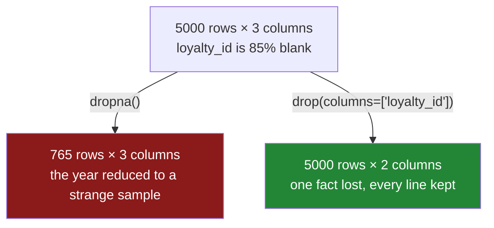

# 4.3 — Dropping the column instead

## One-line answer

When one column is mostly blank, dropping that column costs you one fact about every row, while
dropping the rows costs you every fact about most rows — and `dropna(axis="columns")` does the first,
though a plain `drop(columns=[...])` is usually the honest way to write it.

---

## The story

The shop's till has a loyalty card reader, and the flat's sheet has a column for the card number.

Almost nobody uses the card. Somebody signed up two years ago, the card lives in a drawer, and it
gets scanned about one time in seven. So the card column is empty on the great majority of lines and
has a number on the rest.

Every other column is complete. Every line has a price, and every line has a quantity.

Now somebody wants to clean the sheet, and there are two ways to make it complete.

The first is to delete every line without a card number. The sheet is complete afterwards, and it now
describes about one week in seven — a small, strange sample of the year's shopping, chosen by
whichever trips somebody happened to have the card for.

The second is to delete the card column. The sheet is complete afterwards, and it still has every
line in it. What has been lost is one fact — which trips used the card — and that fact was mostly
absent anyway.

Both are described as "cleaning the sheet". They are not close to being the same operation, and the
choice between them is not a matter of taste: one of them keeps the year and the other keeps one week
in seven.

---

## The idea in plain language

A table has two directions, and a blank sits at the crossing point of one row and one column.
Removing that blank means removing one of the two, and which one you remove decides what you lose.

**Dropping the row** loses every other value on that row. If the table has twenty columns, you throw
away nineteen good values to remove one blank, and you do it once per row that has a blank. That is
[4.1](4.1-dropna-and-the-rows-that-left.md), and the cost grows with the number of rows affected.

**Dropping the column** loses one fact about every row, including the rows where that fact was
present. The cost is fixed — one column — and it does not grow no matter how many rows there are.

The rule that follows is simple enough to hold in your head: **the more blank a column is, the more
attractive it is to drop the column rather than the rows.** A column that is one per cent blank
costs almost nothing to fix by dropping rows. A column that is eighty-five per cent blank cannot be
fixed by dropping rows at all — you would keep fifteen per cent of the table to preserve a column
that is mostly absent.

Two things this part is careful about, because both are places people go wrong.

**pandas can do it, but you probably should not ask it to.** `dropna(axis="columns")` drops every
column that has any blank in it, which on a real table means dropping most of the table. There is a
`thresh` for this direction too — keep a column only if it has at least *n* values — and it is
occasionally the right tool for an exploratory pass over a table you have never seen. But in code you
keep, `drop(columns=["loyalty_id"])` is better in every way: it names the column, so a reader knows
what was lost; it fails loudly if the column is not there; and it does not change behaviour when next
week's data happens to have one blank in a different column.

**A dropped column is a decision, and it is invisible afterwards.** A row that was dropped leaves a
hole in the index if anyone thinks to look. A column that was dropped leaves nothing. The next person
does not know the loyalty column ever existed, cannot know whether it was useless or merely
unfashionable, and will not think to ask for it back. This is why the drop belongs somewhere
documented — a named constant, a schema, a comment saying *dropped 2026-09, 85% blank* — rather than
inside a chain of method calls.

---

## Why Setu needs it

- **[4.1](4.1-dropna-and-the-rows-that-left.md)** and **[4.2](4.2-how-thresh-and-subset.md)** cover
  the row direction. This part is the other half of the same decision, and the two are always
  considered together.
- **[3.2](../03-why-it-is-missing/3.2-the-blank-that-is-itself-a-signal.md)** is the argument against
  dropping a column too eagerly: even a column that is mostly blank carries a usable flag, and
  sometimes the flag is the valuable part.
- **[5.1](../05-filling/5.1-fillna-is-a-claim.md)** is the third option — keep the column, keep the
  rows, invent the values — and knowing when it is dishonest depends on this part's arithmetic.
- **Day 45** is the Phase 4 gate, whose deliverable is a clean dataset. Which columns were dropped
  and why is part of what makes it reviewable rather than merely clean.
- **Day 76** is feature engineering, where a mostly-blank column is a standing decision: drop it,
  keep it and impute, or keep only its missingness flag. That decision is revisited whenever the
  blank share moves.

---

## The mechanism

Five thousand shopping lines. Price and quantity are always present; the loyalty card number is
present about one time in seven.

```python
import numpy as np
import pandas as pd

rng = np.random.default_rng(43)
n = 5000

sheet = pd.DataFrame(
    {
        "price": rng.normal(2, 0.5, n).round(2),
        "need": rng.integers(1, 5, n),
        "loyalty_id": np.where(
            rng.random(n) < 0.85,
            np.nan,
            rng.integers(1000, 9999, n).astype("float64"),
        ),
    }
)

print(sheet.isna().mean().round(3))
```

**Line by line:**

- `rng.integers(1, 5, n)` gives quantities from one to four. The upper bound is exclusive, which is
  the NumPy convention from
  [Day 20, 4.1](../../../day-20-arrays-and-dtypes/parts/04-random/4.1-default-rng-the-generator.md).
- `np.where(rng.random(n) < 0.85, np.nan, ...)` puts a blank in about eighty-five per cent of the
  card numbers.
- `.astype("float64")` on the integer card numbers, because a blank cannot live in an `int64` column
  — the column would have to become float anyway the moment a `NaN` arrives, and doing it explicitly
  is the difference between a decision and a surprise
  ([1.5](../01-what-missing-means/1.5-one-dtype-one-kind-of-blank.md) covers why, and
  [1.4](../01-what-missing-means/1.4-pd-na-and-the-answer-unknown.md) covers the nullable integer
  dtype that avoids it).
- `.isna().mean()` is the blank share from [2.2](../02-finding-it/2.2-counting-the-blanks.md). It is
  printed first because it is the number the whole decision rests on.

```text
price         0.000
need          0.000
loyalty_id    0.847
dtype: float64
```

Now the two ways to make the table complete, measured against each other:

```python
by_rows = sheet.dropna()
by_columns = sheet.dropna(axis="columns")

print("drop rows   :", by_rows.shape, "->", list(by_rows.columns))
print("drop columns:", by_columns.shape, "->", list(by_columns.columns))
```

**Line by line:**

- `axis="columns"` switches the direction. The default is `axis="index"`, meaning "drop rows", which
  is why [4.1](4.1-dropna-and-the-rows-that-left.md) never had to mention it. The word forms
  (`"index"`, `"columns"`) are worth preferring over `0` and `1`, because a reader can tell what
  `axis="columns"` does and cannot tell what `axis=1` does without looking it up.
- `.shape` gives `(rows, columns)`, so the two results can be compared in one glance.
- Both operations produce a table with no blanks in it. **That is the trap: "complete" is true of
  both, and it is the only thing they have in common.**

```text
drop rows   : (765, 3) -> ['price', 'need', 'loyalty_id']
drop columns: (5000, 2) -> ['price', 'need']
```

Read those two lines against each other. Dropping rows kept **765 of 5000** — fifteen per cent of the
year — in exchange for a card number nobody uses. Dropping the column kept **every line** and lost
one fact. On this table there is no argument: the second is right and the first is a mistake that
happens to compile.

`thresh` works in this direction too, and is how an exploratory pass filters columns by
completeness:

```python
print(
    "keep columns with >= 4000 values:", sheet.dropna(axis="columns", thresh=4000).columns.tolist()
)
print(
    "keep columns with >=  700 values:", sheet.dropna(axis="columns", thresh=700).columns.tolist()
)
```

**Line by line:**

- `thresh` counts real values, exactly as in [4.2](4.2-how-thresh-and-subset.md) — but now down each
  column rather than across each row.
- `thresh=4000` on 5000 rows means "at least eighty per cent complete", which drops the card column.
- `thresh=700` means "at least fourteen per cent complete", which keeps it. The card column has about
  765 values, so the threshold sits either side of it and the two lines show the switch.
- Writing the threshold as a raw count is the weakness of this argument: it has to be recomputed
  every time the table's length changes. In code you keep, compare `isna().mean()` against a share
  instead — the production section does exactly that.

```text
keep columns with >= 4000 values: ['price', 'need']
keep columns with >=  700 values: ['price', 'need', 'loyalty_id']
```

And here is the version to actually write:

```python
print(sheet.drop(columns=["loyalty_id"]).columns.tolist())
```

**Line by line:**

- `drop(columns=[...])` names the column. Somebody reading this line six months later knows what was
  removed without running anything.
- It raises `KeyError` if the column is not there, which is what you want: a cleaning step that
  silently does nothing because a column was renamed upstream is a bug that hides for months.
- It is **not conditional on the data**. `dropna(axis="columns")` drops whatever happens to have a
  blank in this batch, so the same code can produce a different set of columns on Tuesday than on
  Monday, and everything downstream that expected a fixed schema breaks in a confusing way.

```text
['price', 'need']
```



---

## When it breaks

**`axis="columns"` on a table where no column is complete:**

```text
$ uv run python -c "
import numpy as np, pandas as pd
df = pd.DataFrame({'a': [1.0, np.nan], 'b': [np.nan, 2.0]})
out = df.dropna(axis='columns')
print(out)
print('shape:', out.shape)
"
```

```text
Empty DataFrame
Columns: []
Index: []
shape: (2, 0)
```

**What it means.** Every column had a blank somewhere, so every column went. The result still has two
rows — the index is intact — and no columns at all, which is a valid frame that will confuse
everything downstream. **No error is raised**, and the failure surfaces later as a `KeyError` on a
column name in some unrelated function. On real data, where almost every column has at least one
blank, this is what bare `dropna(axis="columns")` usually does, and it is the main reason to prefer
naming the columns you mean.

**The schema that changed between two runs:**

```text
$ uv run python -c "
import numpy as np, pandas as pd
monday  = pd.DataFrame({'price': [1.0, 2.0], 'need': [1, 2], 'note': ['a', 'b']})
tuesday = pd.DataFrame({'price': [1.0, 2.0], 'need': [1, 2], 'note': ['a', None]})
print('monday :', monday.dropna(axis='columns').columns.tolist())
print('tuesday:', tuesday.dropna(axis='columns').columns.tolist())
"
```

```text
monday : ['price', 'need', 'note']
tuesday: ['price', 'need']
```

**What it means.** Same code, same columns going in, **different columns coming out** — because one
value in one row of Tuesday's batch was blank. Nothing raised on either day. Everything downstream
that expects a `note` column works on Monday and fails on Tuesday, with an error that points at the
consumer rather than at this line. A cleaning step whose output schema depends on the contents of the
batch is not a cleaning step; it is a source of intermittent failures a long way from their cause,
and the fix is `drop(columns=[...])` with a fixed list.

**Dropping the column that was the whole point:**

```text
$ uv run python -c "
import numpy as np, pandas as pd
rng = np.random.default_rng(43)
n = 5000
df = pd.DataFrame({
    'price': rng.normal(2, .5, n).round(2),
    'churned': np.where(rng.random(n) < 0.9, np.nan, 1.0),
})
print('blank share :', df.isna().mean().round(3).to_dict())
print('after drop  :', df.dropna(axis='columns').columns.tolist())
"
```

```text
blank share : {'price': 0.0, 'churned': 0.9}
after drop  : ['price']
```

**What it means.** The ninety-per-cent-blank column here is the label — the thing you were trying to
predict — and in this kind of table a blank usually means "no, this did not happen" rather than "we
do not know". An automatic completeness rule cannot tell those apart, deletes the target, and leaves
a tidy table of features with nothing to learn from. **Blankness is not a measure of usefulness.**
That is why the threshold rule is a shortlist, not a decision, and why every candidate for deletion
gets looked at by a person once.

---

## In production

**What a professional writes instead of the teaching version.** They separate *finding* the
mostly-blank columns from *removing* them. The finder runs on every batch and reports; the remover
takes an explicit list that a person wrote:

```python
import logging

import pandas as pd

log = logging.getLogger(__name__)

DROPPED: dict[str, str] = {
    "loyalty_id": "85% blank since the card scheme ended, 2026-09",
}


def suggest_sparse_columns(frame: pd.DataFrame, min_complete: float = 0.5) -> pd.Series:
    """Columns whose completeness is below the bar, worst first. A shortlist, not a decision."""
    complete = frame.notna().mean()
    return complete[complete < min_complete].sort_values()


def drop_known_sparse(frame: pd.DataFrame) -> pd.DataFrame:
    """Remove the columns we have decided to remove, by name, with the reason on record."""
    present = [column for column in DROPPED if column in frame.columns]
    unexpected = [column for column in DROPPED if column not in frame.columns]
    if unexpected:
        log.warning("columns already absent, remove from DROPPED: %s", unexpected)
    for column in present:
        log.info("dropping %s — %s", column, DROPPED[column])
    return frame.drop(columns=present)
```

**Line by line:**

- `DROPPED` maps a column name to **the reason it was dropped and when**. A bare list of names is
  half the information; six months later the only question anybody asks is "why is this gone?", and a
  list cannot answer it.
- `suggest_sparse_columns` returns a **shortlist**, and the docstring says so. It reports, it does
  not act, because of the failure above where the target column was the sparse one.
- `min_complete` is a share rather than a count, so it does not need retuning when the table grows —
  the same argument as in [2.2](../02-finding-it/2.2-counting-the-blanks.md).
- `.sort_values()` ascending puts the emptiest column first, which is the order a person wants to
  read the shortlist in.
- The `unexpected` branch **warns rather than raising**. A column that is already gone is not an
  error worth stopping a pipeline for, but it is stale configuration, and a warning is how the list
  gets tidied instead of growing for ever.
- `frame.drop(columns=present)` rather than `dropna(axis="columns")`. Fixed list, fixed output
  schema, same columns on Tuesday as on Monday.
- Every drop is logged **with its reason**, so the reason appears in the run log and not only in the
  source file.

**What changes at scale.** Dropping a column is close to free in pandas — the frame keeps its columns
separately, so removing one is bookkeeping rather than copying, whereas dropping rows copies every
column that survives. On columnar storage the asymmetry is bigger still: a dropped column is simply
never read, so a query over a table with the sparse column removed is genuinely faster, and one over
a table with the rows removed is not. The organisational point is larger than the performance one. A
dropped column is a schema change, and every consumer of that table inherits it. In a mature system
the deletion is announced, versioned and deprecated over a release rather than done inside somebody's
cleaning function, because the team that was quietly using the loyalty column finds out when their
job fails.

**The failure mode that only appears with real data.** A column is mostly blank *now* because it was
added three months ago and only new records have it. Completeness across the whole table is twelve
per cent; completeness among rows from the last month is a hundred. An automatic rule sees twelve and
deletes the newest and most useful column in the table. The check is to compute completeness by time
period rather than over the whole table — a column whose blank share is falling is arriving, not
dying, and it should be kept.

**The review comment a senior engineer leaves.** *"`dropna(axis='columns')` here means our output
schema depends on which columns happen to have a null in today's batch. Please drop by name, with the
list in a constant, and add a note saying why each one goes."*

**The interview question.** *"A column in your dataset is eighty per cent missing. What do you do?"*
The answer starts by refusing the false choice: dropping the rows would cost eighty per cent of the
table to save one column, so that is off the table immediately. Then the real options — drop the
column, keep it and impute, or keep only a boolean flag saying whether it was present — and the
choice depends on whether the blank means "unknown" or "no". The follow-up that separates experience
from theory: *"what would make you keep it?"* If the blank rate is falling over time the column is
newly arrived rather than dead, and if the missingness itself predicts the target then the flag is
worth more than the values.

---

## Check yourself

```bash
uv run python -c "
import numpy as np, pandas as pd
rng = np.random.default_rng(43)
n = 5000
sheet = pd.DataFrame({
    'price': rng.normal(2, .5, n).round(2),
    'need': rng.integers(1, 5, n),
    'loyalty_id': np.where(rng.random(n) < 0.85, np.nan, rng.integers(1000, 9999, n).astype('float64')),
})
print('completeness   :', sheet.notna().mean().round(3).to_dict())
print('drop rows      :', sheet.dropna().shape)
print('drop columns   :', sheet.dropna(axis='columns').shape)
print('drop by name   :', sheet.drop(columns=['loyalty_id']).shape)
print('values kept, rows   :', int(sheet.dropna().notna().sum().sum()))
print('values kept, columns:', int(sheet.drop(columns=['loyalty_id']).notna().sum().sum()))
"
```

The last two numbers count how many real values survive each choice. Say what the ratio between them
is, roughly, and say which single number in the first line predicts it.

**Answer out loud, without scrolling up:**

> A blank sits where one row meets one column, and you can remove either. Say what each choice costs,
> in terms of what is lost per blank removed. Then say why `drop(columns=['x'])` is preferred over
> `dropna(axis='columns')` in code you intend to run twice.

---

**Next:** [5.1 — `fillna` is a claim](../05-filling/5.1-fillna-is-a-claim.md).
