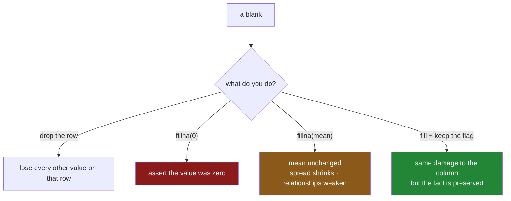

# 5.1 — `fillna` is a claim

## One-line answer

`fillna(value)` writes a value of your choosing into every blank, which keeps the row and the column
at the cost of asserting something you do not know — and the value you pick changes the mean, shrinks
the spread and weakens every relationship the column had.

---

## The story

Sunday morning, and somebody has to split the shop.

Three prices are readable and the eggs are torn off. Dropping the eggs line has already been tried
and it made the shop cost four pounds sixty, which is wrong, and it lost the fact that six eggs were
bought at all.

So somebody says: put something sensible in the box. What is sensible?

**Nothing.** Put in zero. Now the sheet says the eggs were free, and the total is exactly as wrong as
it was before, except it now looks deliberate.

**The middle price.** The other three lines are £1.15, £1.40 and £2.05, so the middle one is £1.40.
Put in £1.40. It is a defensible guess and it is also, obviously, a guess. Eggs are not bread.

**What eggs cost.** Somebody remembers eggs being about two pounds. That is better than either of the
above, and it is not in the sheet at all — it came from a person's memory of the shop, which is a
different kind of evidence.

Whatever gets typed in, the same thing happens: the box stops being empty and starts looking exactly
like every other box on the sheet. Next Sunday, nobody reading the sheet will be able to tell that
one of those four prices was made up. The sheet no longer distinguishes between what was on the
receipt and what somebody guessed on a Sunday morning, and there is nowhere on the sheet where that
distinction could be written.

---

## The idea in plain language

**Imputation** is the word for filling a missing value with a substitute. `fillna` is how pandas does
it: `column.fillna(value)` returns a copy of the column with every blank replaced by `value`.

The mechanics are trivial. The decision is not, and it is worth being precise about what the decision
is. **Filling a blank is asserting a value.** The row afterwards makes exactly the same claim as a row
whose value was measured, and nothing downstream can tell the two apart. That is the whole point —
you fill so that the row can be used — and it is the whole danger.

Three consequences follow, and all three are arithmetic rather than opinion.

- **The mean moves, unless you fill with the mean.** Fill with zero and the average falls. Fill with
  the maximum and it rises. If you want the mean to stay where it was, you have to fill with the
  mean, which is why filling with the mean is so common — not because it is right, but because it is
  the only constant that leaves one statistic untouched.
- **The spread always shrinks.** Every filled value is identical, so every filled value sits exactly
  at the fill point with no variation at all. A column that was forty per cent blank and is filled
  with its own mean has forty per cent of its values piled on a single point, and its standard
  deviation drops sharply. The measured version below shows a fall from 3.00 to 2.33.
- **Relationships weaken.** If the column was related to something else, the filled rows have no
  relationship to anything — they are all the same number regardless of what the other column says.
  The correlation measured below falls from 0.99 to 0.77 purely because of the fill.

None of this means "do not fill". Most tools cannot accept a blank, so filling is usually necessary,
and the alternative — dropping — has its own costs, measured in
[4.1](../04-dropping/4.1-dropna-and-the-rows-that-left.md). What it means is that the fill is a
decision with a stated reason, not housekeeping. The three questions worth answering out loud before
filling anything:

1. **What does the blank mean?** If it means "zero", fill with zero and you have recorded a fact. If
   it means "unknown", filling with zero records a falsehood. A blank in a "number of returns" column
   usually means none; a blank in a "temperature" column never means zero degrees.
2. **Which of the three cases from [3.1](../03-why-it-is-missing/3.1-three-reasons-a-line-is-blank.md)
   are you in?** A single global fill is only defensible in the first. In the second, fill within the
   group ([5.2](5.2-a-different-fill-for-each-column.md)).
3. **Have you kept the flag?** The fill destroys the record that the value was ever missing, unless
   you wrote it down first — which is [3.2](../03-why-it-is-missing/3.2-the-blank-that-is-itself-a-signal.md).

One more thing about `fillna` itself, before the mechanism: **mean or median?** The mean is pulled
around by extreme values, so on a column with a long tail — prices, incomes, durations — one enormous
value drags the fill upward and every imputed row inherits the distortion. The median does not move
when a far-away value gets further away. Unless you have a specific reason, the median is the safer
default for a skewed column and the mean is fine for a symmetric one.

---

## Why Setu needs it

- **[5.2](5.2-a-different-fill-for-each-column.md)** is the version that respects the column: a
  different fill per column, and a fill computed within groups.
- **[5.3](5.3-ffill-bfill-and-the-order-you-depend-on.md)** and
  **[5.4](5.4-interpolate-and-the-line-between-two-points.md)** are the fills that use the row's
  neighbours rather than a constant, which is the right answer for anything measured over time.
- **[6.1](../06-the-leak/6.1-the-median-that-saw-the-test-set.md)** is where this becomes a
  correctness bug rather than a modelling choice: computing the fill value from the whole dataset
  leaks the test set into the training set, and it is the single most common leak there is.
- **Day 91** puts the imputer inside a scikit-learn pipeline, where `SimpleImputer(strategy="median")`
  is exactly this operation with the leak made structurally impossible.
- **Day 118** is evaluation, where a model trained on heavily imputed features scores well and
  behaves badly, because the imputed rows taught it that a large fraction of the world sits at
  precisely one value.

---

## The mechanism

The four-line shop, and three different claims about the missing egg price:

```python
import pandas as pd

shop = pd.DataFrame(
    {
        "item": pd.Series(["milk", "bread", "eggs", "rice"], dtype="str"),
        "need": [2, 1, 6, 1],
        "price": [1.15, 1.40, None, 2.05],
        "paid_by": pd.Series(["ana", None, "ana", None], dtype="str"),
    }
).set_index("item")

print("fill with 0     :", shop["price"].fillna(0).tolist())
print("fill with mean  :", shop["price"].fillna(shop["price"].mean()).round(3).tolist())
print("fill with median:", shop["price"].fillna(shop["price"].median()).tolist())
```

**Line by line:**

- `.fillna(0)` writes zero. Read what that claims: **the eggs were free.** It is not a neutral
  placeholder, it is the strongest possible statement about the price, and it is almost certainly
  false.
- `.fillna(shop["price"].mean())` writes `1.533…`, the average of the three known prices. Note that
  the mean is computed **on the same column being filled**, and that it skips the blank while
  computing — the `sum`/`count` behaviour from
  [1.1](../01-what-missing-means/1.1-the-price-nobody-wrote-down.md).
- `.fillna(shop["price"].median())` writes `1.40`, the middle of the three. On four values the two
  are close; on a skewed column they are not, and the median is the one that does not chase a
  far-away value.
- Every one of these returns a **new column** and leaves `shop` untouched, for the copy-on-write
  reason in
  [Day 26, 3.1](../../../day-26-frames-and-copy-on-write/parts/03-copy-on-write/3.1-every-result-behaves-like-a-copy.md).
  That is why three fills can be printed from one frame without interfering.

```text
fill with 0     : [1.15, 1.4, 0.0, 2.05]
fill with mean  : [1.15, 1.4, 1.533, 2.05]
fill with median: [1.15, 1.4, 1.4, 2.05]
```

Three different sheets, all of them complete, none of them distinguishable afterwards from a sheet
where somebody read the number off a receipt.

Now what the fill does to the numbers you would report:

```python
price = shop["price"]
print("mean, blank skipped :", round(price.mean(), 4), " std:", round(price.std(), 4))
print(
    "mean, filled with 0 :",
    round(price.fillna(0).mean(), 4),
    " std:",
    round(price.fillna(0).std(), 4),
)
print(
    "mean, filled w/ mean:",
    round(price.fillna(price.mean()).mean(), 4),
    " std:",
    round(price.fillna(price.mean()).std(), 4),
)
```

**Line by line:**

- The first line is the honest baseline: pandas skipping the blank, which is what it does by default
  everywhere.
- Filling with zero drags the mean down, because a zero is now one of four values instead of a blank
  that was ignored.
- Filling with the mean leaves the mean exactly where it was — that is the arithmetic property that
  makes it popular — **and still shrinks the standard deviation**, from `0.4646` to `0.3793`, because
  the new value sits precisely at the centre and contributes no spread at all.
- `std()` here uses pandas' default of dividing by `n − 1`, the sample standard deviation from
  [Day 23, 2.3](../../../day-23-ufuncs-and-statistics/parts/02-statistics/2.3-std-var-and-ddof.md).
  The exact convention does not change the direction of the effect.

```text
mean, blank skipped : 1.5333  std: 0.4646
mean, filled with 0 : 1.15    std: 0.8554
mean, filled w/ mean: 1.5333  std: 0.3793
```

On four rows this is a curiosity. On a real column it is not. Twenty thousand values, forty per cent
of them hidden, filled with the mean:

```python
import numpy as np

rng = np.random.default_rng(51)
n = 20_000

truth = pd.Series(rng.normal(10, 3, n))
partner = truth * 2 + rng.normal(0, 1, n)

seen = truth.copy()
seen[rng.random(n) < 0.4] = np.nan
filled = seen.fillna(seen.mean())

print("true   mean/std:", round(truth.mean(), 3), round(truth.std(), 3))
print("seen   mean/std:", round(seen.mean(), 3), round(seen.std(), 3))
print("filled mean/std:", round(filled.mean(), 3), round(filled.std(), 3))
print("corr with partner — truth:", round(truth.corr(partner), 3))
print("corr with partner — seen :", round(seen.corr(partner), 3))
print("corr with partner — fill :", round(filled.corr(partner), 3))
```

**Line by line:**

- `truth` is the complete column, which you never have in real life. `partner` is another column that
  genuinely depends on it, standing in for anything a model might later use alongside it.
- `seen[rng.random(n) < 0.4] = np.nan` hides forty per cent **at random**, which is the *best* case
  from [3.1](../03-why-it-is-missing/3.1-three-reasons-a-line-is-blank.md). Everything below is
  therefore an understatement of what happens on real data.
- `seen.corr(partner)` skips the blanks and compares only the rows where both values are present,
  which is why the "seen" correlation is still right.
- `filled.corr(partner)` compares all twenty thousand rows, eight thousand of which now hold the same
  number regardless of what `partner` says. **Those rows contribute pure noise to the relationship.**

```text
true   mean/std: 10.006 2.993
seen   mean/std: 9.98 3.003
filled mean/std: 9.98 2.327
corr with partner — truth: 0.987
corr with partner — seen : 0.987
corr with partner — fill : 0.768
```

Read the last three lines. The true relationship is `0.987`. The relationship among the rows that
still have data is `0.987` — nothing has been lost by the values being missing. The relationship
after filling is `0.768`, and **the fill is the only thing that changed.** The mean is untouched and
the spread is down by more than a fifth, which is exactly the shape of the damage: filling does not move the
centre, it removes the variation, and variation is what a relationship is made of.



---

## When it breaks

**Filling a whole frame with one value:**

```text
$ uv run python -c "
import pandas as pd
shop = pd.DataFrame(
    {
        'item': pd.Series(['milk', 'bread', 'eggs', 'rice'], dtype='str'),
        'need': [2, 1, 6, 1],
        'price': [1.15, 1.40, None, 2.05],
        'paid_by': pd.Series(['ana', None, 'ana', None], dtype='str'),
    }
).set_index('item')
print(shop.fillna(0))
print()
print(shop.fillna(0).dtypes)
"
```

```text
       need  price paid_by
item
milk      2   1.15     ana
bread     1   1.40       0
eggs      6   0.00     ana
rice      1   2.05       0
```

```text
need         int64
price      float64
paid_by     object
dtype: object
```

**What it means.** `fillna(0)` applied to the frame filled *every* column, including the text column
holding who paid — which now records that two of the shops were paid for by somebody called `0`. No
error and no warning, and look at the dtypes: `paid_by` was `str` going in and is `object` coming
out, because a column holding both strings and the integer zero has no single type left to be. That
dtype change is what bites three files later, when something calls `.str.upper()` on it. The habit
that prevents all of this is never calling `fillna` on a whole frame with a single value; pass a
dictionary instead, which is [5.2](5.2-a-different-fill-for-each-column.md).

**The fill that was thrown away:**

```text
$ uv run python -c "
import pandas as pd
df = pd.DataFrame({'price': [1.15, None, 2.05]})
df['price'].fillna(0)
print('blanks left:', int(df['price'].isna().sum()))
"
```

```text
blanks left: 1
```

**What it means.** The same copy-on-write shape as the drop in
[4.1](../04-dropping/4.1-dropna-and-the-rows-that-left.md). `fillna` returned a filled column and
nothing caught it, so nothing changed. The fix is `df["price"] = df["price"].fillna(0)`. Writing it
as `df["price"].fillna(0, inplace=True)` is worse, not better: `inplace` on a column selected out of
a frame is exactly the chained-assignment shape that Day 26 spent a section on
([Day 26, 4.1](../../../day-26-frames-and-copy-on-write/parts/04-chained-assignment/4.1-the-write-that-vanished.md)).

**The fill value computed from a column that is entirely blank:**

```text
$ uv run python -c "
import pandas as pd
s = pd.Series([None, None, None], dtype='float64')
print('mean of an empty column:', s.mean())
print('after fillna(mean)     :', s.fillna(s.mean()).tolist())
print('blanks remaining       :', int(s.fillna(s.mean()).isna().sum()))
"
```

```text
mean of an empty column: nan
after fillna(mean)     : [nan, nan, nan]
blanks remaining       : 3
```

**What it means.** The mean of nothing is blank, and filling blanks with a blank fills nothing. The
call succeeds, the column is unchanged, and every downstream check that looks for "did the imputation
run" sees a function that returned without error. This is what a column that failed to load looks
like after cleaning, which is why the production version below asserts that no blanks remain rather
than assuming the fill worked.

---

## In production

**What a professional writes instead of the teaching version.** The fill value is computed once,
stored, and applied — never recomputed on whatever data happens to be in front of the code. That
separation is the entire subject of [6.1](../06-the-leak/6.1-the-median-that-saw-the-test-set.md),
and it is what turns a notebook line into something that can run on tomorrow's batch:

```python
import logging

import pandas as pd

log = logging.getLogger(__name__)


def learn_fill_values(frame: pd.DataFrame, columns: list[str]) -> dict[str, float]:
    """Compute the fill value for each column, once, from the training data only."""
    values: dict[str, float] = {}
    for column in columns:
        known = frame[column].dropna()
        if known.empty:
            raise ValueError(f"{column} is entirely blank — cannot learn a fill value")
        values[column] = float(known.median())
    return values


def apply_fill_values(frame: pd.DataFrame, values: dict[str, float]) -> pd.DataFrame:
    """Apply stored fill values. Records where each blank was, and refuses to leave any behind."""
    out = frame.copy()
    for column, value in values.items():
        blanks = int(out[column].isna().sum())
        if blanks:
            out[f"{column}_was_missing"] = out[column].isna()
            out[column] = out[column].fillna(value)
            log.info("filled %d blanks in %s with %r", blanks, column, value)
    remaining = out[list(values)].isna().sum()
    if remaining.any():
        raise ValueError(f"blanks remain after imputation: {remaining[remaining > 0].to_dict()}")
    return out
```

**Line by line:**

- The two functions are separate on purpose. `learn_fill_values` sees the training data; `apply_fill_values`
  runs on anything. **A single `fillna(df.median())` conflates them**, and that conflation is the
  leak in [6.1](../06-the-leak/6.1-the-median-that-saw-the-test-set.md).
- `known.empty` is checked before taking a median, so an entirely blank column fails at the point it
  can be understood rather than producing the silent no-op in the last transcript above.
- `float(known.median())` returns a plain Python float, so the stored values serialise to JSON
  cleanly. A `np.float64` in a config file is a small annoyance that surfaces at the worst moment.
- The median rather than the mean, for the skew reason argued above. Where a column is known to be
  symmetric the mean is fine, and the choice belongs in a comment next to the column.
- `out[f"{column}_was_missing"] = out[column].isna()` is computed **before** the fill on the very
  next line, which is the ordering rule from
  [3.2](../03-why-it-is-missing/3.2-the-blank-that-is-itself-a-signal.md). Keeping the two lines
  adjacent is what stops somebody separating them later.
- The flag column is only added when there is something to record, so a batch with no blanks does not
  grow an all-`False` column and change its own schema.
- The final `remaining` check turns "the fill ran" into "the fill worked". It costs one pass and it
  is the difference between an imputation you can rely on and one you hope about.

**What changes at scale.** `fillna` with a scalar is a single vectorised pass and is not the
bottleneck; computing the fill value is, if it is recomputed per batch — a median needs a sort or a
selection algorithm over the whole column. Storing the learned values and reusing them turns that
into a dictionary lookup, which is a real saving in a streaming system and, much more importantly,
makes today's batch produce the same fill as yesterday's. That stability matters more than the speed:
a fill value that drifts batch by batch means the same input row scores differently depending on what
else arrived alongside it, which is a property nobody wants to explain to an auditor.

**The failure mode that only appears with real data.** A model is trained on data that is two per
cent blank in a key feature, so the mean fill is harmless. Six months later a feed degrades and the
same feature arrives thirty per cent blank. The imputation runs without error, the model runs without
error, and thirty per cent of predictions are now made from a single constant. Accuracy falls a
little, not enough to trip any alarm, and the cause is invisible in the model's own metrics. The
alert that catches it is the blank-share monitor from
[2.2](../02-finding-it/2.2-counting-the-blanks.md) — the imputation itself will never complain.

**The review comment a senior engineer leaves.** *"`df.fillna(df.mean())` — three problems. It fills
the ID column, it recomputes the mean on whatever frame it is handed, and it leaves no trace that a
value was imputed. Learn the values once from train, store them, apply them, and add the missingness
flags."*

**The interview question.** *"You fill a column's missing values with its mean. What have you changed
about the data?"* The mean is unchanged by construction, the standard deviation falls because every
imputed row sits exactly at the centre, and any correlation with another column weakens because those
rows carry the same value regardless of what the other column says. The follow-up: *"so why do it at
all?"* Because most estimators cannot accept a blank and dropping the rows costs more, but the
honest version keeps the missingness flag so the information is not destroyed, and computes the fill
value from the training data only.

---

## Check yourself

```bash
uv run python -c "
import numpy as np, pandas as pd
rng = np.random.default_rng(51)
n = 20_000
truth = pd.Series(rng.normal(10, 3, n))
partner = truth * 2 + rng.normal(0, 1, n)
seen = truth.copy()
seen[rng.random(n) < 0.4] = np.nan
for name, filled in [
    ('mean  ', seen.fillna(seen.mean())),
    ('median', seen.fillna(seen.median())),
    ('zero  ', seen.fillna(0)),
]:
    print(name, 'mean', round(filled.mean(), 3),
          '| std', round(filled.std(), 3),
          '| corr', round(filled.corr(partner), 3))
print('none  ', 'mean', round(seen.mean(), 3), '| std', round(seen.std(), 3), '| corr', round(seen.corr(partner), 3))
"
```

One of those four rows has a standard deviation *larger* than the unfilled column. Say which, say why,
and say whether a larger spread makes it a better fill.

**Answer out loud, without scrolling up:**

> Say what claim you are making about a row when you fill its blank — the claim, not the mechanism.
> Then name the three things a mean fill does to the column's statistics, and say which of the three
> is the one that damages a model.

---

**Next:** [5.2 — A different fill for each column](5.2-a-different-fill-for-each-column.md).
