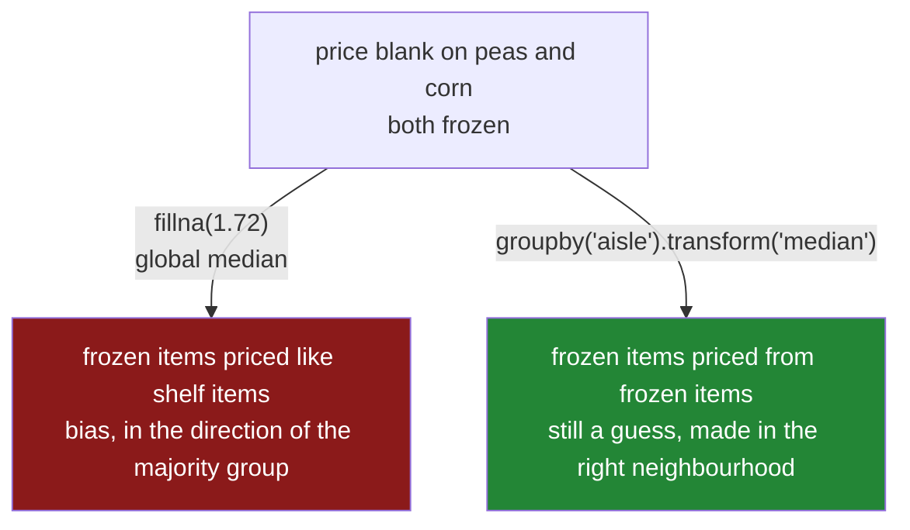

# 5.2 — A different fill for each column

## One-line answer

Pass `fillna` a dictionary and each column gets its own value — and when the blanks depend on
something you can see, the right value is not one number for the whole column but one number per
group, which is `groupby(...).transform("median")`.

---

## The story

The flat's sheet has grown. Six lines this week, and three different columns with holes in them, and
the holes mean three completely different things.

The **price** is missing on the peas and the sweetcorn, because the frozen-aisle receipts fade. It is
unknown, and it is certainly not zero — frozen things are the dearest things in the shop.

The **payer** is missing on three lines, because nobody remembered to type it. It is also unknown,
but "unknown" is a perfectly good thing to write in that box: it is a name field, and *unknown* is a
sensible category to have.

The **returns** column — how many of a thing got taken back — is missing on three lines too, and it
means something different again. Nobody typed a number because nothing was returned. The blank means
zero, and writing zero there records a fact rather than a guess.

One tidy-up, three different right answers. And the first instinct — fill the whole sheet with one
value — gets two of the three wrong no matter which value is chosen.

There is a second problem underneath, and it is the one that matters. Even if you get the price
column its own fill, filling it with the middle price of the whole sheet puts £1.72 next to the peas.
The frozen things on this sheet cost £6.20. The middle price of the whole sheet is mostly made of
shelf prices, because most lines are shelf lines, so **every frozen blank gets a shelf price**, and
the sheet now says frozen food is cheap.

The aisle is written in the sheet. The information needed to do better is right there.

---

## The idea in plain language

Two ideas, and the second is the important one.

**A dictionary makes the fill per column.** `frame.fillna({"price": 1.72, "paid_by": "unknown"})`
fills each named column with its own value and leaves every other column alone. The `fillna(0)`
disaster from [5.1](5.1-fillna-is-a-claim.md) — a zero written into a text column — cannot happen,
because you cannot accidentally fill a column you did not name. **Filling by dictionary should be
your default**, and the dictionary itself is a useful artefact: it is a written record of what every
blank was assumed to mean.

**A group-wise fill makes the fill per group.** This is the direct answer to the second case in
[3.1](../03-why-it-is-missing/3.1-three-reasons-a-line-is-blank.md), where the blank depends on a
column you can see. If frozen prices go missing more often *and* frozen prices are higher, then the
overall median is dominated by the shelf items and is the wrong number to write into a frozen row.
The right number is the median of the frozen prices.

The pandas idiom for that is `groupby("aisle")["price"].transform("median")`. It is worth unpacking
now even though `groupby` is tomorrow's subject
([Day 31](../../../day-31-groupby/parts/01-the-split/1.1-four-lines-three-aisles.md)):

- `groupby("aisle")` splits the rows into a pile per aisle.
- `["price"]` picks the price column within each pile.
- `.median()` would give **one number per group** — a short answer, two rows long.
- `.transform("median")` gives **one number per original row** — the median of that row's own group,
  repeated down the column, aligned with the frame it came from.

That difference is the whole reason `transform` exists. `fillna` needs a value for every row, so it
needs the long form, and `transform` is the verb that turns a per-group answer back into a
per-row one.

One caution before the mechanism. A group-wise fill is better than a global one **when the grouping
column genuinely explains the value**. Grouping by something irrelevant just makes the fill noisier —
each group has fewer rows, so each group's median is estimated less precisely, and a group with one
row gets filled with that row's own value, which is not an estimate at all. And a group with **no**
values leaves the blank exactly where it was, because the median of nothing is a blank. That last case
is not an error and it is the one that catches people, so the mechanism prints it.

---

## Why Setu needs it

- **[5.1](5.1-fillna-is-a-claim.md)** established that a fill is a claim. This part is how you make a
  claim that is defensible per column and per group rather than one blanket assertion.
- **[3.1](../03-why-it-is-missing/3.1-three-reasons-a-line-is-blank.md)** showed that when blanks
  depend on a visible column, working within that column's groups removes the bias. This is that
  argument implemented.
- **[6.1](../06-the-leak/6.1-the-median-that-saw-the-test-set.md)** takes the dictionary built here
  and shows why it must be built from the training data only. A group-wise fill has the same
  problem, one group at a time.
- **Day 31** is `groupby` in full — `transform` versus `agg`, the shapes they return, what happens to
  the keys. The idiom used here is the reason that day exists in the order it does.
- **Day 91** wires this into a scikit-learn pipeline, where per-column fills are the normal case and
  a `ColumnTransformer` is how you say "median for these, most-frequent for those".

---

## The mechanism

Six lines, three columns with holes, three different meanings:

```python
import pandas as pd

shop = pd.DataFrame(
    {
        "item": pd.Series(["milk", "bread", "peas", "fish", "rice", "corn"], dtype="str"),
        "aisle": pd.Series(
            ["shelf", "shelf", "freezer", "freezer", "shelf", "freezer"], dtype="str"
        ),
        "need": [2, 1, 1, 1, 1, 2],
        "price": [1.15, 1.40, None, 6.20, 2.05, None],
        "paid_by": pd.Series(["ana", None, "ana", None, "bo", None], dtype="str"),
        "returns": [0.0, None, None, 1.0, 0.0, None],
    }
).set_index("item")

print(shop)
```

**Line by line:**

- `aisle` is the visible column that will turn out to explain the price. It is complete, which is
  what makes it usable as a grouping key.
- `price` is blank on `peas` and `corn`, both frozen. The one frozen price that survived is `6.20`,
  which is four times the shelf prices. **That contrast is the whole example.**
- `paid_by` is blank three times, and `unknown` is a legitimate value for it.
- `returns` is blank three times, and a blank there means nothing was returned — so `0.0` is a fact,
  not a guess. Three columns, three meanings, one table.

```text
         aisle  need  price paid_by  returns
item
milk     shelf     2   1.15     ana      0.0
bread    shelf     1   1.40     NaN      NaN
peas   freezer     1    NaN     ana      NaN
fish   freezer     1   6.20     NaN      1.0
rice     shelf     1   2.05      bo      0.0
corn   freezer     2    NaN     NaN      NaN
```

**The dictionary fill — one value per column:**

```python
plan = {
    "price": shop["price"].median(),
    "paid_by": "unknown",
    "returns": 0.0,
}
print(plan)
print(shop.fillna(plan))
```

**Line by line:**

- `plan` is built as a named variable rather than written inline. **It is the artefact worth
  keeping**: a reviewer can read it and disagree with one entry without reading any pandas.
- `shop["price"].median()` is `1.725`, the middle of the four known prices. Note this is already
  suspicious — three of those four prices are shelf prices.
- `"paid_by": "unknown"` is a string in a text column. The dictionary form is what makes that safe;
  `shop.fillna("unknown")` would write the word into the price column too.
- `"returns": 0.0` records the fact that nothing was returned. This is the one fill on the page that
  is not a guess.
- `need` and `aisle` are **not in the dictionary** and are left completely alone, which is the
  property that makes this form safe by default.

```text
{'price': np.float64(1.7249999999999999), 'paid_by': 'unknown', 'returns': 0.0}
         aisle  need  price  paid_by  returns
item
milk     shelf     2  1.150      ana      0.0
bread    shelf     1  1.400  unknown      0.0
peas   freezer     1  1.725      ana      0.0
fish   freezer     1  6.200  unknown      1.0
rice     shelf     1  2.050       bo      0.0
corn   freezer     2  1.725  unknown      0.0
```

Every column got the right *kind* of fill. And look at the peas: **£1.725**, sitting next to a frozen
fish at £6.20. The dictionary fixed the column problem and not the group problem.

**The group medians, to see the size of the error:**

```python
print(shop.groupby("aisle")["price"].median())
```

**Line by line:**

- `groupby("aisle")` splits the six rows into two piles by the value of `aisle`.
- `["price"]` narrows to the price column inside each pile.
- `.median()` returns **one row per group** — two rows here, indexed by aisle. This is the short shape,
  and it is not what `fillna` can use.

```text
aisle
freezer    6.2
shelf      1.4
Name: price, dtype: float64
```

`6.20` against `1.40`. The global median of `1.725` is closer to the shelf number than to the
freezer number, because four of the six rows are shelf rows. Writing it into a frozen row understates
that price by more than four pounds.

**The group-wise fill:**

```python
grouped = shop.copy()
grouped["price"] = grouped["price"].fillna(grouped.groupby("aisle")["price"].transform("median"))
print(grouped[["aisle", "price"]])
```

**Line by line:**

- `.transform("median")` returns **one value per original row** — the median of that row's own aisle,
  repeated. That is the long shape, six rows, aligned to `grouped`'s index, which is what makes it
  usable as a fill.
- `fillna(a_series)` fills each blank with the value **at the same index label** in the series it is
  given, rather than with one constant. Alignment does the matching, which is the behaviour from
  [Day 28, 4.2](../../../day-28-selection-and-alignment/parts/04-alignment/4.2-alignment-is-automatic.md).
  The peas row is filled from the peas row of the transform result.
- `grouped.copy()` first, and assignment back into `grouped["price"]`, so the write actually lands —
  the lesson from
  [Day 26, 4.1](../../../day-26-frames-and-copy-on-write/parts/04-chained-assignment/4.1-the-write-that-vanished.md).
- Only `price` is filled here. The dictionary handles the other two columns and this handles the one
  that needs a group; in real code both run, in that order.

```text
         aisle  price
item
milk     shelf   1.15
bread    shelf   1.40
peas   freezer   6.20
fish   freezer   6.20
rice     shelf   2.05
corn   freezer   6.20
```

The peas and the sweetcorn are now £6.20 rather than £1.72. That is still a guess — it is the only
frozen price on the sheet — but it is a guess made from frozen things, and it is nearly five pounds
closer to the truth than the global one.



---

## When it breaks

**A group with no values at all:**

```text
$ uv run python -c "
import pandas as pd
df = pd.DataFrame({
    'aisle': pd.Series(['shelf', 'shelf', 'bakery', 'bakery'], dtype='str'),
    'price': [1.15, 2.05, None, None],
})
df['filled'] = df['price'].fillna(df.groupby('aisle')['price'].transform('median'))
print(df)
print('blanks left:', int(df['filled'].isna().sum()))
"
```

```text
    aisle  price  filled
0   shelf   1.15    1.15
1   shelf   2.05    2.05
2  bakery    NaN     NaN
3  bakery    NaN     NaN
blanks left: 2
```

**What it means.** The bakery group has no prices at all, so its median is blank, so the fill fills
blanks with blanks and the rows are untouched. **No error and no warning** — the operation succeeded
and did nothing. This is the standard shape of a group-wise fill on real data, where some category
always turns out to be entirely empty, and it is why a group-wise fill is always followed by a global
fallback and an assertion that nothing is left.

**A misspelled column in the dictionary:**

```text
$ uv run python -c "
import pandas as pd
df = pd.DataFrame({'price': [1.15, None], 'paid_by': pd.Series(['ana', None], dtype='str')})
out = df.fillna({'prise': 0.0, 'paid_by': 'unknown'})
print(out)
print('blanks left:', int(out.isna().sum().sum()))
"
```

```text
   price  paid_by
0   1.15      ana
1    NaN  unknown
blanks left: 1
```

**What it means.** `fillna` with a dictionary **ignores keys that are not columns**. The typo did not
raise, the payer got filled, the price did not, and the result looks like a successful fill. This is
the opposite of `dropna(subset=[...])`, which raises `KeyError` on a bad name
([4.2](../04-dropping/4.2-how-thresh-and-subset.md)) — two methods, two conventions, one of which
will bite you. Check the keys against `frame.columns` yourself, which the production version does.

**A group of one row filling itself:**

```text
$ uv run python -c "
import pandas as pd
df = pd.DataFrame({
    'aisle': pd.Series(['shelf', 'shelf', 'deli', 'deli'], dtype='str'),
    'price': [1.15, 2.05, 9.99, None],
})
df['filled'] = df['price'].fillna(df.groupby('aisle')['price'].transform('median'))
print(df)
"
```

```text
    aisle  price  filled
0   shelf   1.15    1.15
1   shelf   2.05    2.05
2    deli   9.99    9.99
3    deli    NaN    9.99
```

**What it means.** The deli group has exactly one known price, so the "median of the group" is that
single value, copied into the blank. Arithmetically it is correct; statistically it is not an
estimate of anything, it is one observation asserted twice. On real data with hundreds of small
categories this produces a column full of duplicated singletons that looks perfectly healthy. The
guard is a **minimum group size**: below it, fall back to the global value, and the production
version below does exactly that.

---

## In production

**What a professional writes instead of the teaching version.** The fill plan is data, not code, and
the group-wise fill has a minimum group size and a global fallback:

```python
import logging

import pandas as pd

log = logging.getLogger(__name__)


def fill_by_group(
    frame: pd.DataFrame,
    column: str,
    by: str,
    min_group: int = 30,
) -> pd.Series:
    """Fill `column` from its own group's median, falling back to the global median."""
    group = frame.groupby(by, observed=True)[column]
    sizes = group.transform("count")
    group_median = group.transform("median")

    usable = group_median.notna() & (sizes >= min_group)
    global_median = frame[column].median()
    if pd.isna(global_median):
        raise ValueError(f"{column} is entirely blank — no fill value exists")

    filled = frame[column].fillna(group_median.where(usable))
    from_group = int(frame[column].isna().sum() - filled.isna().sum())
    filled = filled.fillna(global_median)

    log.info(
        "%s: filled %d from group medians, %d from the global median %.4f",
        column,
        from_group,
        int(frame[column].isna().sum()) - from_group,
        global_median,
    )
    return filled
```

**Line by line:**

- `observed=True` on the `groupby`. Once the grouping column is a `category` — which Day 34
  introduces, and which is the natural dtype for an aisle — the default produces a row for every
  category that could exist, including ones with no rows in this batch, and the report fills with
  meaningless blanks.
- `group.transform("count")` gives each row the number of **non-blank** values in its group.
  `count` excludes blanks, which is exactly the number that matters here: a group of five hundred
  rows with three prices is a group of three for this purpose.
- `min_group: int = 30` is a floor, not a law. The right number depends on how variable the column
  is; the point is that there is one, and that it is visible in the signature rather than implied.
- `group_median.where(usable)` blanks out the group medians that fail either test, so those rows fall
  through to the global fill on the next line rather than being filled from a group of one. `where`
  keeps values where the condition holds and blanks the rest
  ([Day 28, 3.3](../../../day-28-selection-and-alignment/parts/03-writing/3.3-where-mask-and-the-write-that-was-not.md)).
- The global median is computed **and checked** before it is needed, so an entirely blank column
  fails with a sentence rather than silently leaving blanks behind — the failure from
  [5.1](5.1-fillna-is-a-claim.md).
- The two fills happen in two steps with a count taken between them, because **the split between
  "filled from its own group" and "filled from the global fallback" is the number worth watching.**
  If it moves, the group structure of the incoming data has changed.
- The function returns a Series and does not write into the frame. The caller assigns it, which keeps
  the write visible at the call site.

**What changes at scale.** `transform` is a group-by plus a broadcast back to the original length, so
it costs a sort or a hash of the key column plus one pass — noticeably more than a scalar `fillna`,
and worth doing once rather than per column in a loop over a hundred columns. The bigger production
concern is that **group medians have to be learned once and stored**, exactly like the scalar fill
values in [5.1](5.1-fillna-is-a-claim.md). A group median recomputed on each incoming batch means the
same row gets a different fill depending on which other rows arrived with it, which is unreproducible
and impossible to explain when somebody asks why a decision changed. In practice the stored artefact
is a small table — one row per group, one column per filled field — versioned alongside the model,
plus a global fallback row for groups that were never seen during training.

**The failure mode that only appears with real data.** A new category appears in production that did
not exist in training — a new store, a new device model, a new country. Its group has no learned
median, so every row of it falls through to the global fallback, and the global fallback was computed
from the old categories. The fill is not wrong so much as uninformed, and the failure is invisible
because the fallback path is the same code path as always. The monitor that catches it is a count of
rows filled from the fallback, which is precisely what the log line above emits.

**The review comment a senior engineer leaves.** *"This fills `price` with the global median, but the
blank rate is 80% for frozen and 0% for shelf, and frozen prices are four times higher. Fill within
aisle. And please handle the aisles with no data at all — right now they come out of this function
still blank and the next stage will fail on them."*

**The interview question.** *"You have a numeric column with missing values and a categorical column
that predicts them. How do you impute?"* Fill within the group — the median of the row's own category
rather than of the whole column — because the global median is dominated by the largest category and
imports its level into every other one. The follow-up is the one that finds out whether you have
shipped it: *"what do you do about a category with no data, or only one row?"* Fall back to the global
value below a minimum group size, log how many rows took each path, and store the learned medians
rather than recomputing them per batch.

---

## Check yourself

```bash
uv run python -c "
import pandas as pd
shop = pd.DataFrame(
    {
        'item':  pd.Series(['milk', 'bread', 'peas', 'fish', 'rice', 'corn'], dtype='str'),
        'aisle': pd.Series(['shelf', 'shelf', 'freezer', 'freezer', 'shelf', 'freezer'], dtype='str'),
        'price': [1.15, 1.40, None, 6.20, 2.05, None],
    }
).set_index('item')
glob = shop['price'].fillna(shop['price'].median())
grp  = shop['price'].fillna(shop.groupby('aisle')['price'].transform('median'))
out = shop.assign(global_fill=glob.round(3), group_fill=grp.round(3))
print(out)
print()
print('mean after global fill:', round(glob.mean(), 4))
print('mean after group  fill:', round(grp.mean(), 4))
print('freezer mean, global  :', round(glob[shop['aisle'] == 'freezer'].mean(), 4))
print('freezer mean, group   :', round(grp[shop['aisle'] == 'freezer'].mean(), 4))
"
```

The last two numbers differ by several pounds on three rows. Say which of the two you would defend to
somebody asking what frozen food costs, and say what evidence in the table supports you.

**Answer out loud, without scrolling up:**

> Say what `fillna` does differently when you hand it a dictionary instead of a single value. Then
> say why `transform("median")` is used for a group-wise fill rather than plain `median()` — name the
> difference in the shape of what each returns.

---

**Next:** [5.3 — `ffill`, `bfill`, and the order you depend on](5.3-ffill-bfill-and-the-order-you-depend-on.md).
