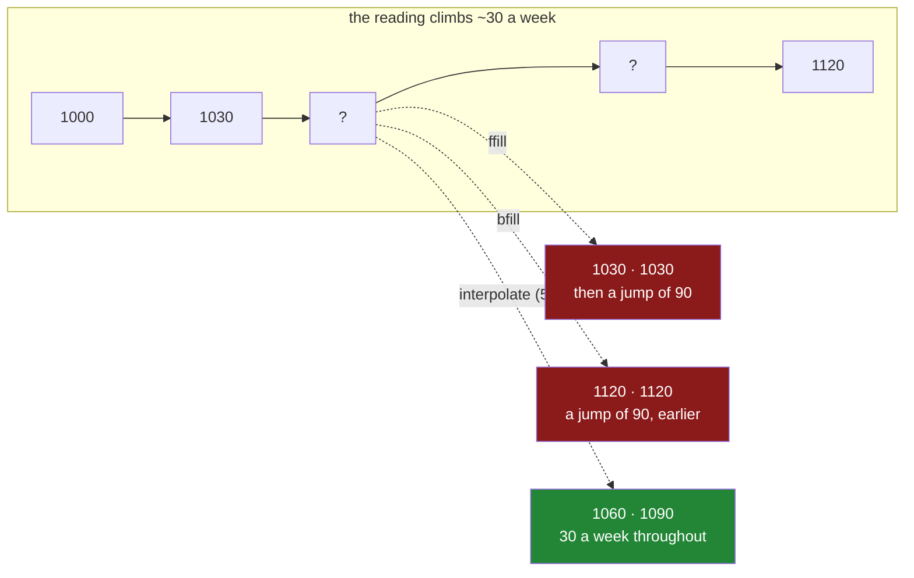

# 5.3 — `ffill`, `bfill`, and the order you depend on

## One-line answer

`ffill()` copies the last known value forward into the blanks after it and `bfill()` copies the next
known value backward — which is exactly right for something that only changes when it is measured,
and quietly wrong for anything that keeps changing between measurements.

---

## The story

There is a note on the kitchen wall with the electricity meter reading on it. Somebody is supposed to
write the number down every Sunday, so the flat can see how much it is using.

Some Sundays nobody does. People go away, people forget, and the note has gaps.

Eight Sundays this quarter. The first two got written down: 1000 and 1030. The next two are blank.
Then 1120, then 1150, then a blank, then 1210.

Somebody wants to fill the gaps so the note reads properly, and the obvious thing to do is write in
the last number they had. The two blank Sundays become 1030, because 1030 was the last thing anybody
read off the meter.

The note is now complete, and it says something that never happened. It says the flat used no
electricity for two weeks and then used ninety units in one week. Nobody was away. The freezer ran
the whole time. The meter climbed steadily at about thirty units a week, as it always does, and
copying the old number forward has moved three weeks of usage into one.

If somebody had instead copied the *next* known number backward, the note would say the flat used
ninety units in the first of the three weeks and nothing in the two after — the same lie, pointing
the other way.

Neither is a lie about the meter reading. Both are lies about the weekly usage, which is the number
anybody actually looks at.

---

## The idea in plain language

**`ffill`** is short for *forward fill*. It walks down the column in order and, whenever it meets a
blank, writes in the last value it saw. A run of blanks all get the same value — the one before the
run. It is also spelled `fillna(method="ffill")` in older code, and `ffill()` is the current name.

**`bfill`** is *backward fill*, the same thing from the other end: each blank takes the next value
that appears below it.

Both of them differ from everything in [5.1](5.1-fillna-is-a-claim.md) and
[5.2](5.2-a-different-fill-for-each-column.md) in one important way. A constant fill or a group fill
looks at the *column*; these look at the row's **neighbours**. That makes them powerful and it makes
them dangerous, because a neighbour is only meaningful if the rows are in a meaningful order.

Three things follow, and each is the source of a real bug.

**The order is part of the answer.** `ffill` on rows sorted by date means "carry the last reading
forward in time", which is a sentence. `ffill` on rows in the order they happened to arrive from a
database means "carry forward whatever row the query planner returned before this one", which is not.
**Sort first, deliberately, and never rely on the order a file arrived in**
([Day 29, 4.1](../../../day-29-iteration-and-order/parts/04-sorting/4.1-sort-values-the-order-you-asked-for.md)).

**The right question is what the value does between measurements.** A forward fill asserts *this
value did not change until somebody measured it again.* For a status — a subscription tier, a device
setting, a shop's opening hours — that is exactly true, and forward fill is the correct and honest
answer. For a quantity that accumulates or drifts — a meter reading, a temperature, a price — it is
false, and the falsehood shows up not in the value but in the *differences* between values, which is
usually the number you care about.

**A leading blank cannot be forward filled.** There is nothing before it. `ffill` leaves it alone,
silently, and a column that looks filled still has blanks at the top. `bfill` has the same problem at
the bottom. The two together — `ffill().bfill()` — leave nothing behind, and that combination is
worth understanding before you write it, because filling the first row from the future is a strong
claim in a time series.

There is also a `limit=` argument on both: `ffill(limit=1)` fills at most one blank in a row of them.
It is the practical answer to "carrying yesterday's reading forward one day is reasonable, carrying it
forward six months is not".

---

## Why Setu needs it

- **[5.4](5.4-interpolate-and-the-line-between-two-points.md)** is the fix for the meter: draw a
  straight line between the two known readings instead of a step. The two parts are a pair.
- **[5.1](5.1-fillna-is-a-claim.md)** established that a fill is a claim; this part's claim is *"it
  did not change"*, which is the most specific one on the day.
- **[6.1](../06-the-leak/6.1-the-median-that-saw-the-test-set.md)** is where forward fill becomes a
  leak in a way a constant fill does not: `bfill` fills a row from a row that comes *later*, and if
  "later" means later in time, you have put the future into the past.
- **Day 33** is the `.dt` accessor and resampling, where forward fill is the standard way to turn an
  irregular series into a regular one, and where the sorting requirement becomes structural rather
  than advisory.
- **Day 154** builds the time-series features for the capstone, where a leak of exactly this shape —
  a value filled from the future — is the failure that makes an offline score meaningless.

---

## The mechanism

Eight Sundays of meter readings, with three gaps:

```python
import pandas as pd

weeks = pd.date_range("2026-01-04", periods=8, freq="7D")
meter = pd.Series(
    [1000.0, 1030.0, None, None, 1120.0, 1150.0, None, 1210.0],
    index=weeks,
    name="meter",
)
print(meter)
```

**Line by line:**

- `pd.date_range(..., periods=8, freq="7D")` builds eight dates, seven days apart. Day 33 covers
  dates properly; here the index only needs to be **in order and evenly spaced**, so that "the value
  before this one" means "last Sunday".
- The gaps are deliberate: a run of two blanks in the middle and a single blank near the end, so that
  the difference between filling one and filling several is visible.
- Real readings, not random ones. The meter climbs by roughly thirty a week throughout, which is what
  makes the fill's error measurable rather than a matter of opinion.

```text
2026-01-04    1000.0
2026-01-11    1030.0
2026-01-18       NaN
2026-01-25       NaN
2026-02-01    1120.0
2026-02-08    1150.0
2026-02-15       NaN
2026-02-22    1210.0
Freq: 7D, Name: meter, dtype: float64
```

**Forward fill — carry the last reading down:**

```python
print(meter.ffill())
```

**Line by line:**

- `.ffill()` walks from the top. The two blanks in January both become `1030.0`, the last value seen
  before them; the blank in February becomes `1150.0`.
- **A run of blanks all get the same value.** This is the step, and it is what makes the fill wrong
  for a climbing meter: three weeks of the note now claim an unchanged reading.
- Nothing is reported. There is no count of how many values were filled and no mark on the filled
  ones, which is why the flag from
  [3.2](../03-why-it-is-missing/3.2-the-blank-that-is-itself-a-signal.md) matters just as much here.

```text
2026-01-04    1000.0
2026-01-11    1030.0
2026-01-18    1030.0
2026-01-25    1030.0
2026-02-01    1120.0
2026-02-08    1150.0
2026-02-15    1150.0
2026-02-22    1210.0
Freq: 7D, Name: meter, dtype: float64
```

**Backward fill — take the next reading:**

```python
print(meter.bfill())
```

**Line by line:**

- `.bfill()` walks from the bottom. The January blanks both become `1120.0`, the next value that
  appears; the February blank becomes `1210.0`.
- Every filled value here comes from **a row that is later in time**. On a time series that is a
  claim about the past made from the future, and it is the shape of leak that
  [6.1](../06-the-leak/6.1-the-median-that-saw-the-test-set.md) is about.
- `bfill` is the right tool when the value is a property of something that is only recorded once at
  the end — a final status, a closing balance — and it is almost never right on a series of
  measurements.

```text
2026-01-04    1000.0
2026-01-11    1030.0
2026-01-18    1120.0
2026-01-25    1120.0
2026-02-01    1120.0
2026-02-08    1150.0
2026-02-15    1210.0
2026-02-22    1210.0
Freq: 7D, Name: meter, dtype: float64
```

**Now the number the flat actually cares about — how much was used each week:**

```python
print(meter.ffill().diff())
```

**Line by line:**

- `.diff()` subtracts each value from the one before it, which turns a running meter reading into a
  weekly usage. The first row is blank because there is nothing before it, which is correct.
- Read the result and the damage is unmistakable: `0.0`, `0.0`, then `90.0`. **The flat used nothing
  for a fortnight and then three weeks' worth in seven days**, according to a note that was filled in
  to look tidy.
- The values in the filled column were plausible. It is the differences that are absurd, and
  differences are what a step function destroys. This is the general rule: **a forward fill is safe
  for the level and unsafe for the change.**

```text
2026-01-04     NaN
2026-01-11    30.0
2026-01-18     0.0
2026-01-25     0.0
2026-02-01    90.0
2026-02-08    30.0
2026-02-15     0.0
2026-02-22    60.0
Freq: 7D, Name: meter, dtype: float64
```

**`limit=` — how far a value may be carried:**

```python
print(meter.ffill(limit=1))
```

**Line by line:**

- `limit=1` fills at most one blank in each consecutive run. The first January blank gets `1030.0`
  and the second stays blank; the lone February blank is filled as normal.
- This is the honest middle position: *one missed Sunday can be covered by last Sunday's number, two
  cannot.* It leaves blanks behind on purpose, so whatever comes next has to deal with them rather
  than being handed a fabricated series.
- Choosing the limit is a domain question, not a technical one. It is how long you believe the value
  stays roughly true, and it belongs in a comment next to the number.

```text
2026-01-04    1000.0
2026-01-11    1030.0
2026-01-18    1030.0
2026-01-25       NaN
2026-02-01    1120.0
2026-02-08    1150.0
2026-02-15    1150.0
2026-02-22    1210.0
Freq: 7D, Name: meter, dtype: float64
```



---

## When it breaks

**The leading blank that forward fill cannot reach:**

```text
$ uv run python -c "
import pandas as pd
s = pd.Series([None, 2.0, 3.0])
filled = s.ffill()
print('values :', filled.tolist())
print('blanks :', int(filled.isna().sum()))
print('bfill  :', s.bfill().tolist())
"
```

```text
values : [nan, 2.0, 3.0]
blanks : 1
bfill  : [2.0, 2.0, 3.0]
```

**What it means.** There is nothing before the first row, so forward fill has nothing to carry, and
it leaves the blank exactly where it was. **No error, no warning.** A pipeline that does
`df = df.ffill()` and moves on will carry that blank into whatever comes next. The usual fix is
`df.ffill().bfill()`, which fills the head from the first known value — a decision worth making
consciously, because on a time series it means inventing history.

**Filling in the wrong order:**

```text
$ uv run python -c "
import pandas as pd
u = pd.Series(
    [1000.0, None, 1120.0],
    index=pd.to_datetime(['2026-01-04', '2026-02-01', '2026-01-18']),
)
print('as it arrived:'); print(u.ffill())
print()
print('sorted first:'); print(u.sort_index().ffill())
"
```

```text
as it arrived:
2026-01-04    1000.0
2026-02-01    1000.0
2026-01-18    1120.0
dtype: float64

sorted first:
2026-01-04    1000.0
2026-01-18    1120.0
2026-02-01    1120.0
dtype: float64
```

**What it means.** The same three rows, the same method, two different answers, and neither raises.
In the unsorted version February was filled from January and the reading from the eighteenth — which
happens to sit last in the frame — was never used at all. **`ffill` fills in row order, not in date
order**, and it has no way to know that the index is a date and that dates have a meaning. The fix is
one line, `sort_index()`, and it belongs immediately before every directional fill.

**Filling across a boundary that should not be crossed:**

```text
$ uv run python -c "
import pandas as pd
r = pd.DataFrame({
    'flat':  pd.Series(['a', 'b', 'a', 'b'], dtype='str'),
    'meter': [1000.0, 5000.0, None, None],
})
print(r.assign(plain=r['meter'].ffill(), per_flat=r.groupby('flat')['meter'].ffill()))
"
```

```text
  flat   meter   plain  per_flat
0    a  1000.0  1000.0    1000.0
1    b  5000.0  5000.0    5000.0
2    a     NaN  5000.0    1000.0
3    b     NaN  5000.0    5000.0
```

**What it means.** Row 2 is flat A, and the plain forward fill gave it `5000.0` — flat B's meter
reading, because that was simply the row above. **`ffill` has no concept of a group**; it copies from
whatever is physically before it. Nothing raised, and on a table sorted by flat rather than by date
the two columns would have agreed exactly, which is what makes this survive review. Any join, any
merge, any `sort_values("date")` produces the interleaving above. A directional fill on a table with
more than one entity in it must be grouped, every time.

---

## In production

**What a professional writes instead of the teaching version.** The sort, the group and the limit are
all explicit, and the function refuses to guess any of them:

```python
import logging

import pandas as pd

log = logging.getLogger(__name__)


def carry_forward(
    frame: pd.DataFrame,
    column: str,
    by: list[str],
    order: str,
    limit: int,
) -> pd.Series:
    """Forward-fill `column` within each entity, in `order`, for at most `limit` steps."""
    if frame[order].isna().any():
        raise ValueError(f"cannot order by {order}: it has missing values")

    ordered = frame.sort_values([*by, order], kind="stable")
    filled = ordered.groupby(by, observed=True)[column].ffill(limit=limit)

    before = int(frame[column].isna().sum())
    after = int(filled.isna().sum())
    log.info(
        "%s: %d blanks -> %d after forward fill within %s, limit %d",
        column,
        before,
        after,
        by,
        limit,
    )
    return filled.reindex(frame.index)
```

**Line by line:**

- Every argument that changes the answer is **required**. There is no default `by`, no default
  `order` and no default `limit`, because a wrong value for any of them produces a plausible column
  and a silently wrong one.
- The blank check on the ordering column comes first. A blank date sorts to the end regardless of
  when it happened, so it would be filled from a row it has no relationship with — and the failure
  would look like a data problem rather than a sorting one.
- `sort_values([*by, order])` sorts by entity first and then by time within each entity. Sorting by
  time alone is not enough: the fill still walks the rows in order, so the entities have to be
  contiguous for the group to be cheap.
- `kind="stable"` keeps rows with identical keys in their original relative order, so two readings
  with the same timestamp do not swap between runs. Determinism is worth the small cost
  ([Day 29, 4.4](../../../day-29-iteration-and-order/parts/04-sorting/4.4-sort-index-and-the-cost-of-order.md)).
- `groupby(by).ffill()` fills **within** each entity, so one flat's meter never leaks into another's.
  This is the single most important line in the function.
- `limit=limit` is passed through rather than left at "unlimited", so a device that stopped reporting
  in March does not have its March reading carried through December.
- `.reindex(frame.index)` puts the result back in the caller's original row order, so the returned
  Series can be assigned straight into the untouched frame. Returning a differently ordered Series
  and letting alignment sort it out works, but it is the kind of implicit behaviour that is hard to
  see in review.
- The log records blanks before and after. A forward fill that leaves a lot behind means either large
  gaps or a `limit` that is too tight, and both are worth knowing about before somebody else finds
  them.

**What changes at scale.** `ffill` itself is a single pass and is cheap. The sort in front of it is
not: sorting is the expensive part of this operation, and doing it once for a batch rather than once
per column is the difference that matters. The grouped version is more expensive again, because it
sorts and then fills per group; on a table with millions of entities the practical approach is to
keep the data sorted by `(entity, time)` at rest — in the Parquet file, in the table's clustering
key — so the sort is free at read time. The deeper production change is that a forward fill is
**stateful across batches**: the first row of today's batch needs the last known value from
yesterday's, which does not exist inside today's data. Getting that wrong reintroduces the
leading-blank problem once per batch, on the boundary, where nobody is looking.

**The failure mode that only appears with real data.** A sensor goes offline for six weeks. The
forward fill, with no limit, carries its last reading through all six weeks, and every downstream
statistic treats those as measurements. The column's variance falls, the sensor looks unusually
stable, and an anomaly detector concludes it is the healthiest device in the fleet — because a
flat line is the least anomalous thing there is. The defences are a `limit`, and the missingness flag
from [3.2](../03-why-it-is-missing/3.2-the-blank-that-is-itself-a-signal.md) so that "this value was
carried" is a fact the model can see.

**The review comment a senior engineer leaves.** *"`df.ffill()` here runs across the whole frame, so
after the merge on line 30 — which reorders rows — it will fill one customer's values from another's.
Group by `customer_id`, sort by `event_at` first, and set a limit; carrying a value forward
indefinitely is how the sensor outage got hidden last quarter."*

**The interview question.** *"When would you use a forward fill instead of filling with the mean?"*
When the value is a state that persists between observations — a status, a setting, a price that
holds until it changes — because the claim "it stayed the same" is true. The follow-up is the one
worth being ready for: *"what breaks?"* Two things. It needs a defined order, so an unsorted frame
gives a meaningless answer with no error; and on a quantity that accumulates it flattens the
differences and then concentrates them into one enormous step, which is invisible in the levels and
obvious in the diffs.

---

## Check yourself

```bash
uv run python -c "
import pandas as pd
weeks = pd.date_range('2026-01-04', periods=8, freq='7D')
meter = pd.Series([1000.0, 1030.0, None, None, 1120.0, 1150.0, None, 1210.0], index=weeks)
print('weekly use, ffill       :', meter.ffill().diff().tolist())
print('weekly use, bfill       :', meter.bfill().diff().tolist())
print('weekly use, interpolate :', meter.interpolate().diff().tolist())
print('blanks after ffill      :', int(meter.ffill().isna().sum()))
print('blanks after ffill lim 1:', int(meter.ffill(limit=1).isna().sum()))
"
```

Three ways of filling the same three gaps, three different stories about the flat's electricity. Say
which of the three you would put on the kitchen wall, and what you would have to believe about a
meter for the other two to be right.

**Answer out loud, without scrolling up:**

> Say the claim a forward fill makes about a value, in one sentence. Then name the two things that
> must be true of the rows before `ffill` means anything at all — one about their order and one about
> what else is in the table.

---

**Next:** [5.4 — `interpolate`, and the line between two points](5.4-interpolate-and-the-line-between-two-points.md).
