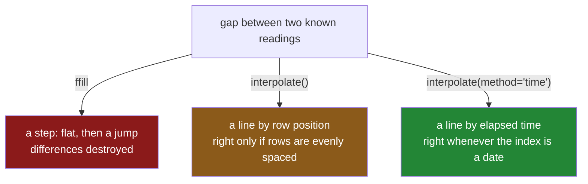

# 5.4 — `interpolate`, and the line between two points

## One-line answer

`interpolate()` fills a gap by drawing a straight line between the known value before it and the
known value after it — which is the right answer for something that changes smoothly, and which by
default counts *rows* rather than *time*, so an unevenly spaced index gives you a confidently wrong
answer with no warning.

---

## The story

Back to the note on the kitchen wall, with the meter readings and the three gaps.

Forward filling made the note say the flat used nothing for a fortnight and then ninety units in a
week. Anybody who lives there knows that is not what happened. The freezer ran, the lights were on,
and nothing unusual occurred in the first week of February.

So somebody looks at the two numbers either side of the gap. On the eleventh of January the meter
read 1030. On the first of February it read 1120. Ninety units over three weeks, and nothing in the
flat changed in between.

Thirty a week. Write 1060 on the eighteenth and 1090 on the twenty-fifth.

That is not a measurement. Nobody read the meter on those Sundays and nobody ever will. But it is the
best available guess, it is a guess anybody would make, and — the important part — the weekly usage
that comes out of it is thirty, thirty, thirty, which is what the flat actually did.

The trap arrives the week somebody goes away for a month. The meter reads 1000 on the fourth of
January and 1400 on the first of March, and there are two missed Sundays in between, on the eleventh
and the eighteenth. Splitting the difference "evenly across the missing rows" puts a third of the
climb on each step — which spreads six weeks of electricity across two of them, because the gap
between the eighteenth of January and the first of March is not one week. It is six.

The rows are evenly spaced. The dates are not. Nothing on the note says which one the arithmetic
used.

---

## The idea in plain language

**Interpolation** is estimating a value between two known values. `interpolate()` is pandas' method
for it, and by default it does the simplest possible version: a straight line from the last known
value to the next known one, with the blanks in between placed evenly along it.

Compare the three fills you now know, on the same gap:

| Method | The claim it makes | Right when |
|---|---|---|
| `fillna(median)` | *this value is typical of the column* | the blanks are unrelated to anything |
| `ffill` | *this value did not change* | the thing only changes when it is measured |
| `interpolate` | *this value moved steadily from one measurement to the next* | the thing changes smoothly and you have measurements on both sides |

The last row carries the two conditions that make interpolation legitimate. **Smoothly** rules out
anything that jumps: a subscription tier, a device's firmware version, a category. **On both sides**
is the structural one — interpolation needs a value after the gap as well as before it, so it cannot
fill the end of a series at all, and filling the beginning means extending a line backwards from
data that came later.

That second condition has a consequence people miss: **interpolation uses the future.** The value it
writes into the eighteenth of January is computed partly from a reading taken on the first of
February. In a report about last quarter, that is fine and correct. In features for a model that will
run on Tuesday using only what is known by Tuesday, it is a leak — the row for the eighteenth now
contains information nobody had on the eighteenth. That is the subject of
[6.1](../06-the-leak/6.1-the-median-that-saw-the-test-set.md), and interpolation is one of the
easiest ways to introduce it without noticing.

Then there is the default that catches nearly everybody. `interpolate()` with no arguments uses
`method="linear"`, and **linear means "evenly spaced by row position", not "by the index"**. If your
index is a date and the rows are one week apart, the two are the same thing and everything is fine.
If a row is missing entirely, or the readings are irregular, the row-position version spreads the
change evenly across rows regardless of how much time each row covers. The fix is
`method="time"`, which uses the actual gaps in the index — and it is one word, and it is not the
default, and nothing warns you.

---

## Why Setu needs it

- **[5.3](5.3-ffill-bfill-and-the-order-you-depend-on.md)** is the other half of this pair. The step
  and the line are the two ways to fill a gap from neighbours, and choosing between them is choosing
  what you believe the value did in between.
- **[6.1](../06-the-leak/6.1-the-median-that-saw-the-test-set.md)** is where "uses the future"
  becomes a correctness bug. Interpolation is the most defensible-looking way to commit it.
- **Day 33** covers `.dt` and resampling, where an irregular series is put on a regular grid and then
  filled — and where `method="time"` stops being an optimisation and becomes the only correct choice.
- **Day 154** builds the capstone's time-series features. Every gap-filling decision there is one of
  these three, chosen per column and written down.
- **Day 118** is evaluation, where a model that scores beautifully on interpolated history and badly
  in production is usually a model whose training data was smoothed with information from after the
  fact.

---

## The mechanism

The meter note again, with its three gaps:

```python
import pandas as pd

weeks = pd.date_range("2026-01-04", periods=8, freq="7D")
meter = pd.Series(
    [1000.0, 1030.0, None, None, 1120.0, 1150.0, None, 1210.0],
    index=weeks,
    name="meter",
)
print(meter.interpolate())
```

**Line by line:**

- `.interpolate()` with no arguments is `method="linear"`. It finds each run of blanks, takes the
  known value on each side, and spaces the fill evenly between them.
- The January gap runs from `1030.0` to `1120.0` across three steps, so each step is thirty: `1060.0`
  and `1090.0`.
- The February gap runs from `1150.0` to `1210.0` across two steps, giving `1180.0`.
- Every row here is exactly one week from its neighbours, so "evenly by row" and "evenly by time"
  agree. **That coincidence is what hides the default's behaviour**, and the irregular example below
  removes it.

```text
2026-01-04    1000.0
2026-01-11    1030.0
2026-01-18    1060.0
2026-01-25    1090.0
2026-02-01    1120.0
2026-02-08    1150.0
2026-02-15    1180.0
2026-02-22    1210.0
Freq: 7D, Name: meter, dtype: float64
```

Now the number that made the forward fill absurd:

```python
print(meter.interpolate().diff())
```

**Line by line:**

- `.diff()` is the same weekly-usage calculation as in
  [5.3](5.3-ffill-bfill-and-the-order-you-depend-on.md), applied to the interpolated column.
- Thirty every week, all the way down. Compare it with the forward-filled version's `0.0, 0.0, 90.0`.
- **The levels differ a little between the two fills; the differences differ enormously.** If what
  you report is a change, a rate or a growth, the fill you choose is the whole answer.

```text
2026-01-04     NaN
2026-01-11    30.0
2026-01-18    30.0
2026-01-25    30.0
2026-02-01    30.0
2026-02-08    30.0
2026-02-15    30.0
2026-02-22    30.0
Freq: 7D, Name: meter, dtype: float64
```

**Now the month away, where the rows are even and the dates are not:**

```python
idx = pd.to_datetime(["2026-01-04", "2026-01-11", "2026-01-18", "2026-03-01"])
away = pd.Series([1000.0, None, None, 1400.0], index=idx)

print("default (by row position):")
print(away.interpolate())
print()
print("method='time' (by the index):")
print(away.interpolate(method="time"))
```

**Line by line:**

- The index has four dates. The first three are a week apart; the fourth is six weeks after the
  third. `pd.to_datetime` turns the strings into real timestamps, which is what makes `method="time"`
  possible at all — on a plain integer index it has nothing to measure.
- `.interpolate()` spreads the four-hundred-unit climb across **three equal row steps**, giving about
  133 per step. It has not looked at the index; it counted rows.
- `.interpolate(method="time")` spreads it across the **actual elapsed time**. The eleventh of January
  is one week into an eight-week gap, so it gets an eighth of the climb: `1050.0`. The eighteenth is
  two weeks in and gets `1100.0`.
- Read the two eleventh-of-January values against each other: `1133.33` against `1050.0`. Both are
  produced silently, by nearly the same line, and only one of them describes a meter.

```text
default (by row position):
2026-01-04    1000.000000
2026-01-11    1133.333333
2026-01-18    1266.666667
2026-03-01    1400.000000
dtype: float64

method='time' (by the index):
2026-01-04    1000.0
2026-01-11    1050.0
2026-01-18    1100.0
2026-03-01    1400.0
dtype: float64
```

**The ends, which interpolation cannot reach on its own:**

```python
print("trailing blank:", pd.Series([1.0, 2.0, None]).interpolate().tolist())
print("leading blank :", pd.Series([None, 2.0, 4.0]).interpolate().tolist())
print("both ends     :", pd.Series([None, 2.0, 4.0]).interpolate(limit_direction="both").tolist())
```

**Line by line:**

- The **trailing** blank comes out as `2.0`. There is no value after it, so there is no line to draw,
  and pandas falls back to carrying the last value forward. **This is a forward fill wearing an
  interpolation's name**, and it is not announced anywhere in the output.
- The **leading** blank stays blank. There is nothing before it to draw from, and unlike the trailing
  case pandas does not extend backwards by default.
- `limit_direction="both"` fills the leading blank too, by carrying the first known value backwards.
  That is a decision — asserting a value for a time before your first measurement — and it should be
  made on purpose, not to make a column look complete.
- The asymmetry between the first two lines is the surprising part, and it is worth checking on your
  own data rather than remembering: print the head and the tail after any interpolation.

```text
trailing blank: [1.0, 2.0, 2.0]
leading blank : [nan, 2.0, 4.0]
both ends     : [2.0, 2.0, 4.0]
```



---

## When it breaks

**Interpolating a text column:**

```text
$ uv run python -c "
import pandas as pd
tier = pd.Series(['basic', None, 'premium'], dtype='str')
print(tier.interpolate())
"
```

```text
Traceback (most recent call last):
  File "<string>", line 3, in <module>
TypeError: Cannot interpolate with str dtype
```

**What it means.** There is no value halfway between `basic` and `premium`, and pandas says so
rather than inventing one. This is a good error and it is worth pausing on, because it makes the
boundary explicit: **interpolation is only meaningful for a quantity that has an in-between.** A
subscription tier does not, so the right fill there is `ffill` — the tier was `basic` until somebody
changed it.

**Filling the far end of a series without noticing:**

```text
$ uv run python -c "
import pandas as pd
s = pd.Series([10.0, 20.0, 30.0, None, None, None])
print('interpolated:', s.interpolate().tolist())
print('blanks left :', int(s.interpolate().isna().sum()))
"
```

```text
interpolated: [10.0, 20.0, 30.0, 30.0, 30.0, 30.0]
blanks left : 0
```

**What it means.** The series was climbing by ten and then stopped being measured. Interpolation had
nothing on the far side of the gap to draw a line to, so it carried `30.0` forward three times — and
reported no blanks remaining, so every completeness check passes. **A trailing gap silently becomes a
forward fill**, with all of the forward fill's problems and none of its honesty about what it did. If
the end of a series matters, use `limit_area="inside"` so that trailing blanks stay blank and
something downstream has to decide about them.

**The default that ignored the calendar:**

```text
$ uv run python -c "
import pandas as pd
idx = pd.to_datetime(['2026-01-04', '2026-01-11', '2026-01-18', '2026-03-01'])
away = pd.Series([1000.0, None, None, 1400.0], index=idx)
print('by row :', away.interpolate().round(1).tolist())
print('by time:', away.interpolate(method='time').round(1).tolist())
print('weekly use, by row :', away.interpolate().diff().round(1).tolist())
print('weekly use, by time:', away.interpolate(method='time').diff().round(1).tolist())
"
```

```text
by row : [1000.0, 1133.3, 1266.7, 1400.0]
by time: [1000.0, 1050.0, 1100.0, 1400.0]
weekly use, by row : [nan, 133.3, 133.3, 133.3]
weekly use, by time: [nan, 50.0, 50.0, 300.0]
```

**What it means.** The row-position version reports a steady 133 units a week for the whole period,
including the six-week stretch where the flat was empty and it counts as one step. The time-aware
version reports 50, 50 and then 300 — a big number for a six-week interval, which is the honest
shape. **No error, no warning, and the index was a proper `DatetimeIndex` the whole time**; pandas
simply does not use it unless you ask. On any table where rows can go missing entirely, the default is
the wrong one.

---

## In production

**What a professional writes instead of the teaching version.** The method, the direction and the
maximum gap are all named, the fill is done per entity, and the rows that were filled are recorded:

```python
import logging

import pandas as pd

log = logging.getLogger(__name__)


def interpolate_within(
    frame: pd.DataFrame,
    column: str,
    by: list[str],
    order: str,
    max_gap: int,
) -> pd.DataFrame:
    """Interpolate `column` in time, within each entity, across gaps of at most `max_gap` rows."""
    if not isinstance(
        frame[order].dtype, pd.DatetimeTZDtype
    ) and not pd.api.types.is_datetime64_any_dtype(frame[order]):
        raise TypeError(f"{order} must be a datetime column for method='time'")

    ordered = frame.sort_values([*by, order], kind="stable").copy()
    ordered[f"{column}_was_missing"] = ordered[column].isna()

    ordered[column] = (
        ordered.set_index(order)
        .groupby(by, observed=True)[column]
        .transform(
            lambda block: block.interpolate(
                method="time",
                limit=max_gap,
                limit_area="inside",
            )
        )
        .to_numpy()
    )

    filled = int(ordered[f"{column}_was_missing"].sum() - ordered[column].isna().sum())
    log.info(
        "%s: interpolated %d rows within %s, gaps up to %d, %d blanks remain",
        column,
        filled,
        by,
        max_gap,
        int(ordered[column].isna().sum()),
    )
    return ordered.reindex(frame.index)
```

**Line by line:**

- The dtype check comes first and raises. `method="time"` on a non-datetime index fails deep inside
  pandas with a message about the index, several frames away from the call, and a sentence here saves
  that hunt.
- The missingness flag is written **before** the interpolation, which is the ordering rule from
  [3.2](../03-why-it-is-missing/3.2-the-blank-that-is-itself-a-signal.md). An interpolated value that
  is indistinguishable from a measured one is exactly the thing that makes a model overconfident
  about a period when the sensor was off.
- `sort_values([*by, order])` — interpolation, like `ffill`, walks rows in order, so the entity has
  to be contiguous and the time has to be ascending
  ([5.3](5.3-ffill-bfill-and-the-order-you-depend-on.md)).
- `.set_index(order)` before grouping, because `method="time"` reads the **index**, not a column.
  This is the detail that most often turns a correct-looking call into a row-position interpolation.
- `limit=max_gap` refuses to draw a line across a gap longer than you are willing to defend. A
  three-day outage can be interpolated; a three-month one is fabrication.
- `limit_area="inside"` keeps the ends blank, so the trailing-gap-becomes-a-forward-fill failure
  above cannot happen quietly. What to do about the ends is then somebody's explicit decision.
- The log reports how many rows were filled **and how many blanks remain**, because with `limit` and
  `limit_area` set, some always do, and a downstream stage that assumed completeness needs to know.
- `.reindex(frame.index)` restores the caller's row order, so this function can be dropped into a
  chain without silently reordering the table for everything after it.

**What changes at scale.** Interpolation itself is a pass over each contiguous run of blanks and is
cheap; the sort in front of it and the per-group `transform` are what cost. The `lambda` inside
`transform` is a Python call per group, so on a table with a million entities this becomes genuinely
slow, and the usual production shape is either to sort the data once at rest by `(entity, time)` and
process it in blocks, or to push the whole operation into a tool with native window functions —
DuckDB or Polars on Day 35, or the warehouse itself. The correctness point matters more than the
speed one: interpolation reads values from after the gap, so in any pipeline that produces features
for a model it must be confined to backfilling historical tables and kept out of anything that
generates a row for a moment in time.

**The failure mode that only appears with real data.** A sensor drops out for a fortnight and comes
back at a very different level, because it was recalibrated while it was off. The interpolation draws
a smooth ramp across the fortnight, and the ramp is entirely fictional — the value did not drift, it
jumped, once, on the day of the recalibration. Every anomaly detector downstream now sees two weeks
of perfectly well-behaved data instead of one large step, which is the opposite of what happened. The
defences are the `limit`, so a long gap is never bridged, and the missingness flag, so the fabricated
region is visible to anything that wants to ignore it.

**The review comment a senior engineer leaves.** *"`df.interpolate()` on a DatetimeIndex with missing
days will space the fill by row, not by date — please pass `method='time'`. Also add a `limit`; we
have devices that go offline for months and right now we are drawing a straight line through the
whole outage and calling it data."*

**The interview question.** *"When would you interpolate a missing value rather than forward filling
it?"* When the quantity changes continuously between measurements — a temperature, a meter reading, a
price — so that a straight line between two observations is a better description than a step. The
follow-up that finds out whether you have used it in anger: *"what are the two things that go wrong?"*
First, the default is linear by row position rather than by time, so an irregular index gives a wrong
answer silently. Second, it fills from values that come after the gap, so using it to build features
for a forward-looking model leaks the future into the past.

---

## Check yourself

```bash
uv run python -c "
import pandas as pd
idx = pd.to_datetime(['2026-01-04', '2026-01-11', '2026-01-18', '2026-03-01'])
away = pd.Series([1000.0, None, None, 1400.0], index=idx)
print('ffill        :', away.ffill().tolist())
print('interpolate  :', away.interpolate().round(1).tolist())
print('by time      :', away.interpolate(method='time').tolist())
print()
tail = pd.Series([10.0, 20.0, 30.0, None, None])
print('tail, plain  :', tail.interpolate().tolist())
print('tail, inside :', tail.interpolate(limit_area='inside').tolist())
"
```

The last two lines fill the same series and disagree about the end. Say what the plain version
actually did to those last two rows, and say why calling it interpolation is generous.

**Answer out loud, without scrolling up:**

> Say the claim `interpolate` makes about a value, and contrast it in one sentence with the claim
> `ffill` makes. Then say what `method="linear"` measures the spacing in, and name the situation where
> that is not what you want.

---

**Next:** [6.1 — The median that saw the test set](../06-the-leak/6.1-the-median-that-saw-the-test-set.md).
