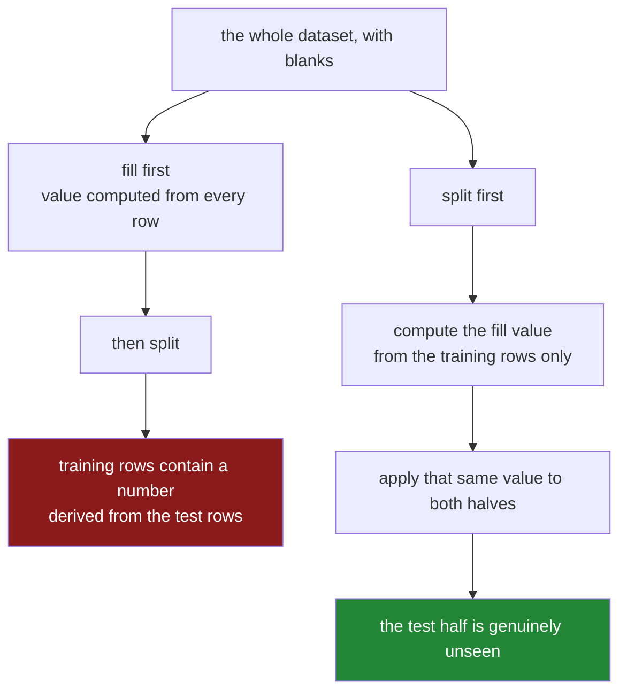

# 6.1 — The median that saw the test set

## One-line answer

If you compute a fill value from the whole dataset and then split it into a part you learn from and a
part you test on, every filled row in the learning half contains information from the testing half —
which is why the split comes before the fill, always.

---

## The story

Somebody in the flat is trying to work out whether they can guess what a shop will cost before
walking in.

The honest way to test that is to hide some of the year from yourself. Take the first six months,
look at them as much as you like, come up with a rule. Then take the last six months — which you have
not looked at — and see whether the rule works.

The sheet has holes in it, as always. So before doing anything else they tidy it: fill every blank
price with the middle price from the sheet.

Then they split the year in half and start work.

The problem is what "the middle price from the sheet" means. Prices went up over the year. The middle
price of the whole sheet is pulled upward by the second half — the half that was supposed to be
hidden. So every blank in the first six months has now been filled with a number that could only be
worked out by looking at the second six months.

The person doing this has not cheated on purpose. They have not looked at a single line of the second
half. But the number they wrote into the first half was computed from it, and their test is no longer
a test of anything: they are checking a rule against data that already helped write the rule.

The tell is small and completely convincing when you see it. Change one price in the hidden half —
one line, one number — and the values written into the *visible* half change too. Information moved
in the direction it was never supposed to move.

---

## The idea in plain language

Two terms first, because everything here depends on them.

A **train/test split** is the practice of holding some rows back. You build your rule — a model, a
threshold, a formula — using the **training** rows only, and then you measure how well it does on the
**test** rows, which the rule has never seen. The measurement is only meaningful if the test rows
really are new to the rule.

**Leakage** is the general name for information reaching the model that it will not have when it runs
for real. The consequence is always the same shape: the offline score is too good, and the real
performance is worse, and the gap is discovered in production.

Imputation is the most common source of leakage in existence, and the reason is mundane. A fill value
— a mean, a median, a most-common category — is **computed from data**. If it is computed from all
the data, it summarises the test rows too, and then it is written into the training rows. The
training data now carries a small piece of the test data inside it.

The rule that follows is short, and it is the practical output of this whole day:

> **Split first. Compute the fill value from the training rows only. Apply that same value to both
> halves.**

Three things people say against this, all of which are wrong in an instructive way:

- *"It is only one number, it can barely matter."* On a large, well-behaved dataset the effect is
  indeed small. That is exactly what makes it dangerous: it is small enough to survive review and
  large enough to make a model look better than it is, and it is never small when the halves differ —
  which they do whenever the split is by time, by region or by customer.
- *"I will fill after splitting, but compute the median on each half separately."* Worse, not better.
  The test half must be treated exactly as production data will be treated, and in production there
  is no batch to compute a median from — there is one row arriving. Computing a separate median for
  the test set means testing a procedure you cannot run.
- *"The scaler and the encoder are fine, it is only imputation that has this problem."* No. Every step
  that learns anything from the data has it: the mean and standard deviation a scaler uses, the
  category list an encoder builds, the columns a feature selector keeps. This is Principle 8 —
  **the split comes before the scaler, the imputer, the encoder and the selector** — and imputation
  is simply where you meet it first.

There is a fourth case worth naming because it hides so well. When the split is by date, filling
with a value computed from the whole series leaks the future into the past, and so does
`bfill` ([5.3](../05-filling/5.3-ffill-bfill-and-the-order-you-depend-on.md)) and so does
`interpolate` ([5.4](../05-filling/5.4-interpolate-and-the-line-between-two-points.md)), because both
of them read values that come later. A time-based model built on an interpolated history is testing
itself against a version of the past that already knew what happened next.

---

## Why Setu needs it

- **[6.2](6.2-fit-on-train-transform-on-both.md)** is the discipline that prevents this: two
  operations, `fit` and `transform`, and only `fit` is allowed to see the training data.
- **[6.3](6.3-the-imputer-you-write-yourself.md)** builds the small object that makes the discipline
  structural rather than remembered — you write it yourself, before meeting the library version.
- **[5.1](../05-filling/5.1-fillna-is-a-claim.md)** and
  **[5.2](../05-filling/5.2-a-different-fill-for-each-column.md)** produced the fill values. This
  part is about **when** they are allowed to be computed.
- **Day 91** puts the imputer inside a scikit-learn `Pipeline`, where cross-validation refits the
  imputer on each fold automatically and this class of mistake becomes hard to make.
- **Day 118** is evaluation, where the symptom shows up: a validation score that does not survive
  contact with new data, and a search for the cause that ends here more often than anywhere else.

---

## The mechanism

Eight rows, small enough to check by eye. The first four are the training half and the last four are
held back, and the two halves genuinely differ — prices rose.

```python
import pandas as pd

sheet = pd.DataFrame(
    {
        "price": [1.0, None, 2.0, 3.0, 10.0, 11.0, None, 12.0],
        "half": ["train"] * 4 + ["test"] * 4,
    }
)

train = sheet[sheet["half"] == "train"]

print(sheet)
print()
print("mean of train only :", round(train["price"].mean(), 4))
print("mean of everything :", round(sheet["price"].mean(), 4))
```

**Line by line:**

- `price` has one blank in each half, at rows 1 and 6. Those are the rows a fill will write into.
- `half` labels the split. In real work the split is made by a function and the labels are two frames;
  keeping them in one column here means both means can be printed from the same table.
- The training prices are 1, 2 and 3. The test prices are 10, 11 and 12. **The halves are different,
  deliberately** — which is what a time-based split looks like when anything is trending.
- `train["price"].mean()` is `2.0`. `sheet["price"].mean()` is `6.5`. The second number is more than
  three times the first, and the only reason is that it has seen the test rows.

```text
   price   half
0    1.0  train
1    NaN  train
2    2.0  train
3    3.0  train
4   10.0   test
5   11.0   test
6    NaN   test
7   12.0   test

mean of train only : 2.0
mean of everything : 6.5
```

Now the demonstration. **Change one value in the test half and watch what happens to the number that
gets written into a training row.**

```python
changed = sheet.copy()
changed.loc[7, "price"] = 1000.0

print("row 7 is a TEST row. Changing it from 12.0 to 1000.0:")
print(
    "  fill value from the whole sheet:",
    round(sheet["price"].mean(), 4),
    "->",
    round(changed["price"].mean(), 4),
)
print(
    "  fill value from train only     :",
    round(train["price"].mean(), 4),
    "->",
    round(changed[changed["half"] == "train"]["price"].mean(), 4),
)
```

**Line by line:**

- `changed.loc[7, "price"] = 1000.0` edits **one row in the held-back half** and nothing else. Row 7
  is data the model is not supposed to know anything about.
- `changed["price"].mean()` is the whole-sheet fill value. It moves from `6.5` to `171.17` — because
  it is computed from every row, including row 7.
- `changed[changed["half"] == "train"]["price"].mean()` is the train-only fill value. It does not
  move at all, because row 7 is not in the training half.
- **Row 1 is a training row.** Under the first policy, the number written into it depends on row 7.
  Under the second, it does not. That is leakage, stated as a fact about the code rather than as a
  warning.

```text
row 7 is a TEST row. Changing it from 12.0 to 1000.0:
  fill value from the whole sheet: 6.5 -> 171.1667
  fill value from train only     : 2.0 -> 2.0
```

The mean is used here because it moves visibly. A median would barely have shifted on this example,
and that is not a defence — **it is the reason the median version of this bug survives for years.**
A robust statistic leaks less per row and still leaks, and "less" is not "not".

The two orderings, drawn:



Here is the correct order written out, so the shape is on the page:

```python
train = sheet[sheet["half"] == "train"].copy()
test = sheet[sheet["half"] == "test"].copy()

fill_value = train["price"].median()

train["price"] = train["price"].fillna(fill_value)
test["price"] = test["price"].fillna(fill_value)

print("learned fill value:", fill_value)
print("train prices:", train["price"].tolist())
print("test  prices:", test["price"].tolist())
```

**Line by line:**

- The split happens **first**, on two lines, before anything is computed from anything.
- `.copy()` on both, so that writing into them cannot touch the original sheet. Copy-on-write means
  the write would be safe anyway
  ([Day 26, 3.1](../../../day-26-frames-and-copy-on-write/parts/03-copy-on-write/3.1-every-result-behaves-like-a-copy.md)),
  and the explicit copy says out loud that these are now two separate datasets.
- `fill_value` is computed from `train` and **stored in a variable**. That variable is the whole
  discipline: a value that exists on its own can be applied twice, saved to a file, and inspected in
  a review.
- The **same** `fill_value` goes into both halves. The test half is filled with the training half's
  number, which is exactly what will happen in production when a row arrives on its own.
- The median rather than the mean, for the skew reason in
  [5.1](../05-filling/5.1-fillna-is-a-claim.md) — and, on this data, so you can see that the test
  rows get `2.0`, a training-half number, sitting oddly next to prices of 10 and 12. **That oddness
  is correct.** It is what your model will face in the real world.

```text
learned fill value: 2.0
train prices: [1.0, 2.0, 2.0, 3.0]
test  prices: [10.0, 11.0, 2.0, 12.0]
```

---

## When it breaks

**The leak that no error will ever tell you about:**

```text
$ uv run python -c "
import numpy as np, pandas as pd
rng = np.random.default_rng(61)
n = 4000
day = np.arange(n)
price = (2.0 + day * 0.002 + rng.normal(0, 0.3, n)).round(3)
sheet = pd.DataFrame({'price': price})
sheet.loc[rng.random(n) < 0.3, 'price'] = np.nan
train, test = sheet.iloc[: n // 2], sheet.iloc[n // 2 :]
print('train median :', round(train['price'].median(), 4))
print('test  median :', round(test['price'].median(), 4))
print('whole median :', round(sheet['price'].median(), 4))
"
```

```text
train median : 4.034
test  median : 8.086
whole median : 5.934
```

**What it means.** Prices doubled over the period, so the two halves have very different medians and
the whole-data median sits between them. Filling the training half with `5.934` writes a number into
it that is a quarter higher than anything the training period would justify — and the size of that
error is set entirely by how much the test period differs. **Nothing raises. Nothing warns.** The
only way this is ever caught is by looking at the order of operations, which is why it is a rule
rather than a check.

**The split that came second, in a chain that reads perfectly:**

```text
$ uv run python -c "
import numpy as np, pandas as pd
rng = np.random.default_rng(61)
df = pd.DataFrame({'x': rng.normal(0, 1, 10)})
df.loc[[2, 7], 'x'] = np.nan
clean = df.fillna(df.mean())
train, test = clean.iloc[:5], clean.iloc[5:]
print('filled value used in the training half:', round(float(clean.loc[2, 'x']), 4))
print('mean of the test half alone           :', round(float(df.iloc[5:][\"x\"].mean()), 4))
print('mean of everything                    :', round(float(df[\"x\"].mean()), 4))
"
```

```text
filled value used in the training half: -0.1027
mean of the test half alone           : 0.9277
mean of everything                    : -0.1027
```

**What it means.** Row 2 is in the training half, and the number sitting in it is the mean of all ten
rows — which is partly the mean of the five rows in the test half. Three lines of clean, readable
code, in the order almost everybody writes them the first time: load, clean, split. **Reversing the
last two lines is the entire fix**, and there is nothing in the output of the wrong version that
looks wrong.

**The fill that cannot run in production:**

```text
$ uv run python -c "
import pandas as pd
train = pd.DataFrame({'price': [1.0, None, 2.0, 3.0]})
one_row = pd.DataFrame({'price': [None]})
print('median of a single incoming row:', one_row['price'].median())
print('after filling with its own median:', one_row['price'].fillna(one_row['price'].median()).tolist())
print('after filling with the stored value:', one_row['price'].fillna(train['price'].median()).tolist())
"
```

```text
median of a single incoming row: nan
after filling with its own median: [nan]
after filling with the stored value: [2.0]
```

**What it means.** In production a row arrives on its own. There is no batch to compute a median from,
so `fillna(df.median())` — the line everybody writes in a notebook — degrades to filling a blank with
a blank, silently. **This is the practical argument that settles the whole debate:** the training
code and the serving code must do the same thing, and only the stored-value version can. If your
imputation cannot run on one row, it is not an imputation, it is a batch summary.

---

## In production

**What a professional writes instead of the teaching version.** The split is a function with a
recorded rule, the fill values are learned once and returned as data, and the artefact is saved
alongside the model:

```python
import json
from pathlib import Path

import pandas as pd


def split_by_time(frame: pd.DataFrame, on: str, cutoff: str) -> tuple[pd.DataFrame, pd.DataFrame]:
    """Everything before `cutoff` trains; everything from `cutoff` onward is held back."""
    when = pd.to_datetime(frame[on])
    boundary = pd.Timestamp(cutoff)
    before, after = frame[when < boundary], frame[when >= boundary]
    if before.empty or after.empty:
        raise ValueError(f"cutoff {cutoff} leaves one side empty: {len(before)} / {len(after)}")
    return before.copy(), after.copy()


def learn_imputation(train: pd.DataFrame, columns: list[str]) -> dict[str, float]:
    """Medians learned from the training rows only. This is the artefact to save."""
    values = {}
    for column in columns:
        known = train[column].dropna()
        if known.empty:
            raise ValueError(f"{column} is entirely blank in the training data")
        values[column] = float(known.median())
    return values


def save_imputation(values: dict[str, float], path: Path) -> None:
    """Write the learned values next to the model, so serving uses exactly these."""
    path.write_text(json.dumps(values, indent=2, sort_keys=True), encoding="utf-8")
```

**Line by line:**

- `split_by_time` takes an explicit `cutoff` rather than a fraction. A time-based split is the one
  that most resembles reality — you always predict forward — and a date is reviewable in a way that
  "the last twenty per cent" is not.
- `when < boundary` and `when >= boundary` are deliberately complementary, so no row can be in both
  halves and none can be in neither. Getting that wrong is how a row ends up in training and test at
  once, which is the same leak in its purest form.
- The `before.empty or after.empty` check catches a cutoff outside the data's range, which otherwise
  produces an empty test set and a perfect score.
- `learn_imputation` takes **`train`**, not `frame`. The parameter name is doing real work: a reader
  reviewing the call site sees `learn_imputation(train, ...)` and can check it in one glance.
- It returns a plain dictionary of Python floats — data, not a fitted object — so it serialises,
  diffs and gets read by a human in a code review.
- `save_imputation` writes it next to the model. **The values must travel with the model**, because
  a model and the imputation it was trained with are one artefact; serving with a different fill
  value than training used is its own bug, and a common one.
- `sort_keys=True` so that two runs producing the same values produce byte-identical files, which is
  what makes them diffable in version control.

**What changes at scale.** The mechanics do not get harder; the discipline does. Real pipelines have
five or six learned steps — impute, scale, encode, select, bin — and every one of them must see the
training rows only. Remembering that by hand across five steps and ten columns fails eventually,
which is the entire reason `Pipeline` objects exist and why Day 91 spends a day on them. The other
scale problem is **cross-validation**: splitting five ways and imputing once before the loop leaks in
all five folds at once, and it is the single most common mistake in published analysis code. The fix
is that the imputer must be *inside* the thing being cross-validated, refitted on each fold, which is
free if the pipeline is an object and impossible if it is a line in a notebook.

**The failure mode that only appears with real data.** The leak is invisible when you test it, because
your test data is drawn from the same period as your training data and the two medians agree. It
becomes visible when the model meets a period, a region or a customer segment that differs — which is
the only situation anybody ever cares about. So the symptom is not "the model scores badly in
testing"; it is "the model scored 0.91 in testing and 0.74 in production, and nobody can find
anything wrong with the code". Leakage does not degrade gracefully. It works until the world moves.

**The review comment a senior engineer leaves.** *"Line 22 fills before line 26 splits, so the
training rows contain the test set's median. Move the split above the fill, compute the median from
`train` only, and save it to the artefacts directory — serving needs the same number."*

**The interview question.** *"Why do you split your data before imputing rather than after?"* Because
a fill value is computed from data, so computing it over the whole dataset writes a summary of the
test rows into the training rows, and the test score is then measuring something the model has partly
already seen. The follow-up that separates the memorised answer from the understood one: *"how would
you demonstrate it?"* Change one value in the held-back half and show that the number written into a
training row moves. And the follow-up after that — *"does it apply to anything besides imputation?"* —
is where you name scalers, encoders and feature selectors, because every step that learns a parameter
from data has exactly the same problem.

---

## Check yourself

```bash
uv run python -c "
import pandas as pd
sheet = pd.DataFrame({
    'price': [1.0, None, 2.0, 3.0, 10.0, 11.0, None, 12.0],
    'half': ['train'] * 4 + ['test'] * 4,
})
train = sheet[sheet['half'] == 'train']
changed = sheet.copy()
changed.loc[7, 'price'] = 1000.0
print('whole-sheet fill :', round(sheet['price'].mean(), 4), '->', round(changed['price'].mean(), 4))
print('train-only fill  :', round(train['price'].mean(), 4), '->',
      round(changed[changed['half'] == 'train']['price'].mean(), 4))
print()
value = train['price'].median()
print('learned from train:', value)
print('train filled      :', sheet[sheet['half'] == 'train']['price'].fillna(value).tolist())
print('test  filled      :', sheet[sheet['half'] == 'test']['price'].fillna(value).tolist())
"
```

The filled test row gets `2.0` while its neighbours are `10.0` and `12.0`, which looks wrong. Say why
it is right anyway, and what you would be measuring if you had filled it with `11.0` instead.

**Answer out loud, without scrolling up:**

> State the rule about splitting and filling in one sentence, in the right order. Then describe the
> one-line experiment that proves a fill is leaking, without using the word "leak".

---

**Next:** [6.2 — Fit on train, transform on both](6.2-fit-on-train-transform-on-both.md).
