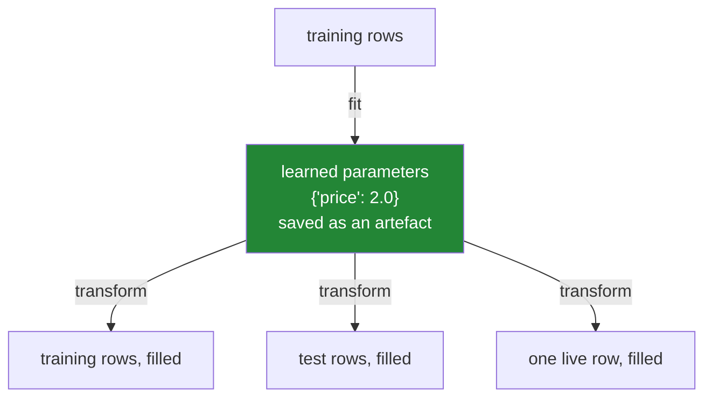

# 6.2 — Fit on train, transform on both

## One-line answer

Split every cleaning step into two operations — **learn** the parameter from the training rows, and
**apply** it to any rows at all — because the leak in [6.1](6.1-the-median-that-saw-the-test-set.md)
is what happens when one line of code does both at once.

---

## The story

The flat still wants a rule for guessing what a shop will cost, and they now know that filling the
blanks before hiding half the year was a mistake.

So somebody writes the rule down properly, on a card:

> **If a price is missing, write in £1.40.** That was the middle price of everything up to the end of
> June.

Two things about that card are worth noticing, and they are the whole of this part.

First, the number was worked out **once**, from the six months they were allowed to look at, and then
it stopped changing. It is not "the middle price of whatever you are holding". It is £1.40, forever,
until somebody deliberately writes a new card.

Second, the card can be used **anywhere**. On the second half of the year. On next January. On a
single line that somebody texts from the shop. None of those needs a pile of data to work from,
because the working-out already happened and the answer is on the card.

The version they had before was not a card. It was an instruction — *fill in the middle price of
whatever is in front of you* — and an instruction like that gives a different answer every time it is
followed. That is why it leaked, and it is also why it could never have been used on a single line in
a text message.

---

## The idea in plain language

Every cleaning step that learns something from data has two halves, and giving them names makes the
distinction impossible to lose:

- **`fit`** — look at the training rows and work out the parameter. For a median imputer, the
  parameter is one number per column. It is written down and kept.
- **`transform`** — take the stored parameter and apply it to a frame. Any frame. It does not measure
  anything, it does not learn anything, and it gives the same answer on Tuesday as it did on Monday.

The names come from scikit-learn, which you meet properly on Day 91, and they are worth adopting now
because they name a distinction that exists whether or not you use that library.

Three rules follow, and they are the whole discipline:

1. **`fit` sees the training rows and nothing else.** Not the test rows, not the validation fold, not
   next month's data.
2. **`transform` is applied to everything** — the training rows, the test rows, and every row that
   ever arrives afterwards. All of them get the same treatment, because that is what makes the test
   an honest rehearsal of production.
3. **`fit` happens once; `transform` happens many times.** If you find yourself refitting on the data
   you are about to score, you have written the instruction rather than the card.

The reason this matters more than it looks is that **the stored parameter is a deliverable**. It
travels with the model. It goes in version control or in an artefact store, it can be printed and
reviewed, and it can be compared against last month's. A pipeline whose fill values only exist as the
temporary result of `df.median()` inside a function has nothing to hand to the person asking *"what
value did we use in March?"*.

There is one more consequence, and it is the one that decides arguments. **`transform` must work on
one row.** In production, rows arrive singly or in small batches, and a step that needs a large sample
to compute its own parameter simply cannot run there — as
[6.1](6.1-the-median-that-saw-the-test-set.md) demonstrated, filling one blank row with its own median
fills a blank with a blank. If a cleaning step cannot run on a single row, it is not a cleaning step;
it is a batch summary, and it will have to be rewritten before anything ships.

---

## Why Setu needs it

- **[6.1](6.1-the-median-that-saw-the-test-set.md)** showed the leak. This is the shape of code that
  makes it structurally difficult, rather than something you have to remember at three in the
  afternoon.
- **[6.3](6.3-the-imputer-you-write-yourself.md)** turns these two functions into one small object
  that carries its own learned values, which is the form the rest of the curriculum uses.
- **[3.2](../03-why-it-is-missing/3.2-the-blank-that-is-itself-a-signal.md)** requires the
  missingness flag to be written before the fill. `transform` is where that ordering gets fixed once,
  instead of being retyped at every call site.
- **Day 91** is `Pipeline` and `ColumnTransformer`, which are these two methods applied to a whole
  chain of steps. Everything there follows from this page.
- **Day 118** is cross-validation, where `fit` runs once per fold and the whole benefit of this
  separation is that it is possible to do that at all.

---

## The mechanism

The two halves from [6.1](6.1-the-median-that-saw-the-test-set.md), written as two functions:

```python
import pandas as pd

train = pd.DataFrame({"price": [1.0, None, 2.0, 3.0]})
test = pd.DataFrame({"price": [10.0, 11.0, None, 12.0]})


def fit_median(frame: pd.DataFrame, columns: list[str]) -> dict[str, float]:
    """Learn one fill value per column. Sees the training rows only."""
    learned: dict[str, float] = {}
    for column in columns:
        known = frame[column].dropna()
        if known.empty:
            raise ValueError(f"{column} is entirely blank in the fitting data")
        learned[column] = float(known.median())
    return learned


def transform_median(frame: pd.DataFrame, learned: dict[str, float]) -> pd.DataFrame:
    """Apply stored fill values. Learns nothing; works on any number of rows."""
    out = frame.copy()
    for column, value in learned.items():
        out[f"{column}_was_missing"] = out[column].isna()
        out[column] = out[column].fillna(value)
    return out


learned = fit_median(train, ["price"])
print("learned:", learned)
```

**Line by line:**

- `fit_median` takes a frame and returns **a dictionary, not a frame**. That return type is the whole
  design: what comes out is the parameter, and it can be printed, saved, compared and reviewed.
- `known = frame[column].dropna()` before the median, so an entirely blank column is caught here
  rather than producing a `NaN` fill value that silently fills nothing —
  the failure from [5.1](../05-filling/5.1-fillna-is-a-claim.md).
- `float(...)` so the stored value is a plain Python number and serialises to JSON without a custom
  encoder.
- `transform_median` takes the learned dictionary as an **argument**. It has no way to compute a
  median even if it wanted to, which is the point: the function cannot leak because it cannot measure.
- The flag is written on the line **before** the fill, inside `transform`, so that ordering is decided
  once in one place rather than at every call site
  ([3.2](../03-why-it-is-missing/3.2-the-blank-that-is-itself-a-signal.md)).
- `out = frame.copy()` so neither function modifies its argument. A cleaning step that mutates makes
  the order of cells in a notebook load-bearing.

```text
learned: {'price': 2.0}
```

Now apply the same learned value to both halves:

```python
print(transform_median(train, learned))
print()
print(transform_median(test, learned))
```

**Line by line:**

- The **same `learned` dictionary** goes into both calls. Nothing is recomputed, so nothing about the
  test rows can influence the training rows.
- The test half's blank is filled with `2.0`, a number that came from the training half. Next to
  prices of 10, 11 and 12 that looks wrong, and it is right: it is exactly what production will do
  when a blank arrives during a period the model was not trained on.
- The `price_was_missing` column appears in both, so the two frames have the same columns — which
  matters, because a model trained on one set of columns cannot score a frame with a different set.

```text
   price  price_was_missing
0    1.0              False
1    2.0               True
2    2.0              False
3    3.0              False

   price  price_was_missing
0   10.0              False
1   11.0              False
2    2.0               True
3   12.0              False
```

And the test that the whole design exists for — **one row, on its own:**

```python
print(transform_median(pd.DataFrame({"price": [None]}), learned))
```

**Line by line:**

- One row, one blank, no batch to compute anything from. This is what a live request looks like.
- It works, and it produces `2.0` and a flag, because the number was worked out in advance.
- Compare this with `frame.fillna(frame.median())`, which on this input fills a blank with a blank and
  reports success. **This single line is the argument that settles the design**, and it is worth
  running against any cleaning step before you trust it.

```text
   price  price_was_missing
0    2.0               True
```



Notice what the picture does not contain: an arrow from the test rows back to the parameters. That
missing arrow is the entire subject of section 6.

---

## When it breaks

**`transform` called before anything was learned:**

```text
$ uv run python -c "
import pandas as pd
def transform_median(frame, learned):
    out = frame.copy()
    for column, value in learned.items():
        out[column] = out[column].fillna(value)
    return out
print(transform_median(pd.DataFrame({'price': [1.0, None]}), {}))
"
```

```text
   price
0    1.0
1    NaN
```

**What it means.** An empty dictionary of learned values is a perfectly valid argument, so the loop
runs zero times, nothing is filled, and the function returns successfully. **No error.** This is what
happens when a fit step is skipped, or when its result is assigned to a variable nobody passed on.
The version in [6.3](6.3-the-imputer-you-write-yourself.md) fixes it by making "not yet fitted" a
distinguishable state that raises, rather than an empty dictionary that looks like a successful fit
with nothing to do.

**Fitting on the test data by accident:**

```text
$ uv run python -c "
import pandas as pd
train = pd.DataFrame({'price': [1.0, None, 2.0, 3.0]})
test  = pd.DataFrame({'price': [10.0, 11.0, None, 12.0]})
train_value = float(train['price'].dropna().median())
test_value  = float(test['price'].dropna().median())
print('learned from train:', train_value)
print('learned from test :', test_value)
print('test filled with the train value:', test['price'].fillna(train_value).tolist())
print('test filled with its own value  :', test['price'].fillna(test_value).tolist())
"
```

```text
learned from train: 2.0
learned from test : 11.0
test filled with the train value: [10.0, 11.0, 2.0, 12.0]
test filled with its own value  : [10.0, 11.0, 11.0, 12.0]
```

**What it means.** The second version fills the test blank with `11.0`, which is much closer to its
neighbours and looks obviously better. It is not better — it is a different procedure from the one
that will run in production, so any score measured on it is measuring something that will never
happen. The trap here is aesthetic: **the leaking version produces a more sensible-looking table**,
and "this looks more reasonable" is the reasoning that puts it into the code.

**A `transform` that quietly changes the columns it produces:**

```text
$ uv run python -c "
import pandas as pd
def transform(frame, learned):
    out = frame.copy()
    for column, value in learned.items():
        if out[column].isna().any():
            out[f'{column}_was_missing'] = out[column].isna()
        out[column] = out[column].fillna(value)
    return out
learned = {'price': 2.0}
print('with a blank   :', list(transform(pd.DataFrame({'price': [1.0, None]}), learned).columns))
print('without a blank:', list(transform(pd.DataFrame({'price': [1.0, 2.0]}), learned).columns))
"
```

```text
with a blank   : ['price', 'price_was_missing']
without a blank: ['price']
```

**What it means.** The `if ... .isna().any():` looks like a sensible optimisation — do not add a
column of all `False` for nothing — and it makes the output schema depend on the contents of the
batch. A model trained on two columns is then handed one column, and the failure appears wherever the
model is called, with a message about a feature-count mismatch and no clue about the cause.
**`transform` must produce the same columns every time**, which is why the version in the mechanism
above adds the flag unconditionally.

---

## In production

**What a professional writes instead of the teaching version.** The learned parameters are saved,
versioned and checked on load, because the model and its parameters are one artefact and a mismatch
between them is silent:

```python
import json
from pathlib import Path

import pandas as pd

SCHEMA_VERSION = 2


def save_fitted(learned: dict[str, float], path: Path) -> None:
    """Persist the learned values with a version stamp, so a stale file is detectable."""
    payload = {"schema_version": SCHEMA_VERSION, "medians": learned}
    path.write_text(json.dumps(payload, indent=2, sort_keys=True), encoding="utf-8")


def load_fitted(path: Path, expect_columns: list[str]) -> dict[str, float]:
    """Load learned values, refusing anything stale or incomplete."""
    payload = json.loads(path.read_text(encoding="utf-8"))
    if payload.get("schema_version") != SCHEMA_VERSION:
        raise ValueError(
            f"{path} was written by schema {payload.get('schema_version')}, "
            f"this code expects {SCHEMA_VERSION}"
        )
    learned = {name: float(value) for name, value in payload["medians"].items()}
    missing = sorted(set(expect_columns) - set(learned))
    if missing:
        raise ValueError(f"{path} has no fill value for {missing}")
    return learned


def transform(frame: pd.DataFrame, learned: dict[str, float]) -> pd.DataFrame:
    """Apply learned fill values. Same columns out, every time, whatever comes in."""
    missing_columns = sorted(set(learned) - set(frame.columns))
    if missing_columns:
        raise KeyError(f"frame is missing columns this transform fills: {missing_columns}")
    out = frame.copy()
    for column, value in learned.items():
        out[f"{column}_was_missing"] = out[column].isna()
        out[column] = out[column].fillna(value)
    return out
```

**Line by line:**

- `SCHEMA_VERSION` exists so that a change to what gets stored — adding group medians, adding a
  strategy name — fails loudly against an old file instead of being read as though nothing had
  changed. A stale artefact is the quietest bug in machine learning.
- `payload.get("schema_version")` with `.get` rather than `[...]`, so a file written before versions
  existed produces the clear message above rather than a `KeyError` from inside the loader.
- `expect_columns` is passed **in**, so loading is checked against what this run actually needs. A
  file with fill values for four columns is not usable by code that fills five, and finding that out
  at load time beats finding it out when the fifth column comes through unfilled.
- The `set` differences are `sorted(...)`, so the error message is stable between runs and two
  identical failures produce identical text — which matters when you are grepping logs.
- `transform` checks its input columns and raises, because a missing column would otherwise mean that
  column silently keeps its blanks.
- The flag is added **unconditionally**, for the schema-stability reason in the last failure above.
- `transform` still takes `learned` as an argument rather than reading the file itself. Loading is
  I/O and belongs at the edge; a transform that reads a file cannot be tested without one.

**What changes at scale.** The mechanics stay trivial and the operational surface grows. In a real
system the learned values are stored in the model registry alongside the weights, tagged with the
training run that produced them, and the serving process loads them at start-up rather than per
request. Two properties become essential. **Reproducibility**: the same input row must produce the
same output row regardless of what else is in the batch, which is exactly what `transform` guarantees
and a recompute-per-batch step cannot. **Skew detection**: because the fill values are fixed, you can
monitor how often they are used, and a jump in that rate is the earliest warning that the incoming
data has drifted away from what the model was trained on. Neither is available if the parameter only
exists inside a function call.

**The failure mode that only appears with real data.** The training pipeline and the serving code
drift apart. Training fills blanks with the stored median; serving, written six months later by
somebody else, fills with zero, because zero seemed harmless and nobody knew the artefact existed.
Nothing errors, and the model receives a value it never saw during training for every blank row.
This is called **training/serving skew**, and the defence is that the two paths must call the *same*
`transform` function from the *same* module — not two functions that agree today.

**The review comment a senior engineer leaves.** *"This computes the median inside `transform`, so
every batch gets a different fill and a single-row request gets nothing. Split it: a `fit` that
returns the values and a `transform` that takes them. And save the values with the model — right now
there is no way to reproduce a prediction from last week."*

**The interview question.** *"What is the difference between `fit` and `transform`, and why are they
separate?"* `fit` learns parameters from the training data; `transform` applies stored parameters to
any data. They are separate so that the test set and production data get exactly the same treatment
as each other, so that the parameters can be saved and reviewed, and so that the step can run on a
single row. The follow-up worth having ready: *"what goes wrong if you use `fit_transform` on your
test set?"* You have refitted on data the model is supposed to be evaluated against, so the
evaluation no longer measures what will happen in production — and, more practically, you have built
a step that cannot run on one row at serving time.

---

## Check yourself

```bash
uv run python -c "
import pandas as pd

def fit_median(frame, columns):
    return {c: float(frame[c].dropna().median()) for c in columns}

def transform_median(frame, learned):
    out = frame.copy()
    for column, value in learned.items():
        out[f'{column}_was_missing'] = out[column].isna()
        out[column] = out[column].fillna(value)
    return out

train = pd.DataFrame({'price': [1.0, None, 2.0, 3.0]})
test  = pd.DataFrame({'price': [10.0, 11.0, None, 12.0]})
learned = fit_median(train, ['price'])
print('learned      :', learned)
print('train columns:', list(transform_median(train, learned).columns))
print('test  columns:', list(transform_median(test, learned).columns))
print('test  prices :', transform_median(test, learned)['price'].tolist())
print('one row      :', transform_median(pd.DataFrame({'price': [None]}), learned).to_dict('records'))
print('re-fit on test would give:', fit_median(test, ['price']))
"
```

The last line shows what a leaking version would have learned. Say how much the filled test value
would move, and say why the more sensible-looking number is the wrong one to use.

**Answer out loud, without scrolling up:**

> Say what `fit` is allowed to look at and what `transform` is allowed to look at. Then give the
> one-line test that tells you whether a cleaning step is written correctly — the one involving a
> single row.

---

**Next:** [6.3 — The imputer you write yourself](6.3-the-imputer-you-write-yourself.md).
