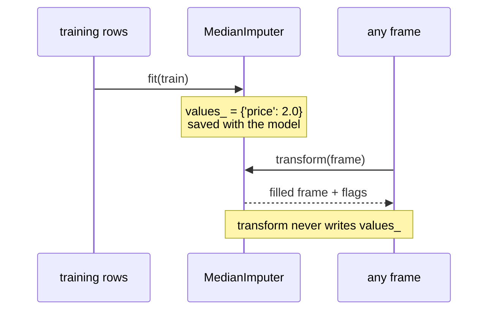

# 6.3 — The imputer you write yourself

## One-line answer

Put the learned values and the two operations that use them into one small object, and the discipline
from [6.2](6.2-fit-on-train-transform-on-both.md) stops being something you remember and becomes
something the code cannot get wrong — which is exactly the shape of the library imputer you meet on
Day 91.

---

## The story

The card with **£1.40** on it works, and it keeps getting lost.

Somebody writes the number into a message. Somebody else copies it into a spreadsheet. A third person
writes a slightly different number on a second card, because they redid the working in August, and
now there are two cards and nobody knows which one the last set of guesses used.

Then somebody moves flat and takes the card with them, and the sheet is still full of prices that were
filled in from it — with no record anywhere of what the number was.

The fix is not a better card. It is keeping the number and the instructions for using it **in the same
place**: an envelope with the number inside and *"write this into any blank price box"* on the front.
You cannot hand somebody the instructions without the number, you cannot use the number without the
instructions, and if the envelope is empty then it is obviously empty rather than quietly giving
everybody a different answer.

---

## The idea in plain language

A **class** is Python's way of keeping data and the functions that use it together. Day 19 introduced
them ([Day 19, 2.1](../../../day-19-typing-dataclasses-and-concurrency/parts/02-dataclasses/2.1-what-dataclass-writes.md));
here they earn their place, because the problem is precisely that a number and two functions have to
travel together.

The object has three parts, and each one solves a problem from the last two pages:

- **Configuration**, given when you create it — which columns to fill, whether to add the missingness
  flag. This is what you *decided*, and it is fixed before any data is seen.
- **Learned state**, filled in by `fit` — the fill value per column. This is what was *measured*, and
  it comes only from the training rows.
- **Two methods** — `fit` measures and stores; `transform` applies and measures nothing.

There is a small naming convention worth adopting, taken from scikit-learn: **attributes learned from
data end with an underscore**. `self.columns` is configuration you supplied; `self.values_` is
something the object worked out. Reading a class, the trailing underscore tells you instantly which
attributes exist before `fit` and which do not, and that distinction is otherwise invisible.

The reason to write this yourself, today, rather than importing one, is Principle 2 — from scratch
before library. On Day 91 you will write `SimpleImputer(strategy="median", add_indicator=True)` inside
a `Pipeline`, and every argument in that line will be one you have already made a decision about:

| what you write today | what Day 91 calls it |
|---|---|
| `self.values_` | `imputer.statistics_` |
| `add_indicator=True` | `SimpleImputer(add_indicator=True)` |
| `RuntimeError("transform called before fit")` | `NotFittedError` |
| passing the same object to two frames | `Pipeline` doing it for you, per fold |

The object also gives you somewhere to put the checks. "Not yet fitted" becomes a state that can be
detected and refused, rather than an empty dictionary that behaves like a successful fit with nothing
to do — the failure from [6.2](6.2-fit-on-train-transform-on-both.md).

---

## Why Setu needs it

- **[6.2](6.2-fit-on-train-transform-on-both.md)** established the two operations. This binds them to
  the values they need, so they cannot be separated by accident.
- **[7.1](../07-the-module/7.1-the-missing-module.md)** puts this class into `src/setu/missing.py`
  alongside the day's other functions, which is where it becomes usable rather than illustrative.
- **[3.2](../03-why-it-is-missing/3.2-the-blank-that-is-itself-a-signal.md)** required the flag before
  the fill. Inside `transform` that ordering is written once and cannot be got wrong at a call site.
- **Day 91** is `SimpleImputer` and `Pipeline`. You will read that source and recognise it, because
  you will have written the same thing.
- **Day 235** puts the whole pipeline behind CI, where the artefact this object produces is what the
  deployment test loads and checks.

---

## The mechanism

The whole class, in one piece:

```python
from __future__ import annotations

import pandas as pd


class MedianImputer:
    """Fill blanks with medians learned from one frame and applied to any frame."""

    def __init__(self, columns: list[str], add_indicator: bool = True) -> None:
        self.columns = list(columns)
        self.add_indicator = add_indicator
        self.values_: dict[str, float] | None = None

    def fit(self, frame: pd.DataFrame) -> MedianImputer:
        """Learn one median per column, from these rows only."""
        values: dict[str, float] = {}
        for column in self.columns:
            known = frame[column].dropna()
            if known.empty:
                raise ValueError(f"{column} is entirely blank in the fitting data")
            values[column] = float(known.median())
        self.values_ = values
        return self

    def transform(self, frame: pd.DataFrame) -> pd.DataFrame:
        """Apply the learned medians. Measures nothing; works on one row."""
        if self.values_ is None:
            raise RuntimeError("transform called before fit")
        out = frame.copy()
        for column, value in self.values_.items():
            if self.add_indicator:
                out[f"{column}_was_missing"] = out[column].isna()
            out[column] = out[column].fillna(value)
        return out
```

**Line by line:**

- `from __future__ import annotations` lets `fit` declare a return type of `MedianImputer` — the class
  being defined — without quoting it. Without that import the name does not exist yet at the moment
  the annotation is evaluated
  ([Day 19, 1.2](../../../day-19-typing-dataclasses-and-concurrency/parts/01-type-hints/1.2-the-vocabulary.md)).
- `self.columns = list(columns)` **copies** the caller's list. If it were stored directly, a caller
  appending to their own list later would silently change what this object fills — one of the oldest
  aliasing bugs there is.
- `add_indicator: bool = True` defaults to **on**, because the argument in
  [3.2](../03-why-it-is-missing/3.2-the-blank-that-is-itself-a-signal.md) was that the flag is
  usually worth its column and always worth it when you are not sure.
- `self.values_: dict[str, float] | None = None` — the trailing underscore marks it as learned, and
  `None` is the honest "nothing has been learned yet". An empty dictionary would be a lie: it would
  mean "fitted, with nothing to do".
- `known.empty` is checked per column, so an entirely blank column fails at `fit` with a sentence
  naming it, rather than storing a `NaN` that fills nothing at `transform` time — the
  [5.1](../05-filling/5.1-fillna-is-a-claim.md) failure, caught early.
- `float(known.median())` stores a plain Python number, so `self.values_` can be written to JSON
  without a custom encoder.
- `return self` at the end of `fit`, which is what makes `MedianImputer([...]).fit(train)` a single
  expression. It is a convention rather than a necessity, and it is the convention scikit-learn uses.
- `if self.values_ is None: raise RuntimeError` — `RuntimeError` rather than `ValueError`, because
  nothing is wrong with the *value* passed in; the object is in the wrong *state*. Day 91's library
  raises `NotFittedError`, which is this idea with a name of its own.
- `out = frame.copy()` so `transform` never modifies its argument, which is what lets you call it on
  the training frame and the test frame from the same cell without them interfering.
- The flag is written **before** the fill on the next line, and unconditionally when `add_indicator`
  is on, so the output columns are the same for every frame — the schema-stability failure from
  [6.2](6.2-fit-on-train-transform-on-both.md).

Now use it exactly as [6.1](6.1-the-median-that-saw-the-test-set.md) says to:

```python
train = pd.DataFrame({"price": [1.0, None, 2.0, 3.0]})
test = pd.DataFrame({"price": [10.0, 11.0, None, 12.0]})

imputer = MedianImputer(["price"]).fit(train)
print("learned:", imputer.values_)
print()
print(imputer.transform(train))
print()
print(imputer.transform(test))
```

**Line by line:**

- `MedianImputer(["price"]).fit(train)` reads as one sentence: *make an imputer for the price column
  and fit it on the training rows.* `fit` returning `self` is what allows that.
- `imputer.values_` is printable, and it is the thing to save next to the model. **A learned parameter
  you cannot look at is a learned parameter you cannot review.**
- The same object is used for both frames. There is no second `fit` call and no opportunity for one,
  because the value lives inside the object and `transform` cannot change it.

```text
learned: {'price': 2.0}

   price  price_was_missing
0    1.0              False
1    2.0               True
2    2.0              False
3    3.0              False

   price  price_was_missing
0   10.0              False
1   11.0              False
2    2.0               True
3   12.0              False
```

And the single-row test from [6.2](6.2-fit-on-train-transform-on-both.md), which any serving-safe
step has to pass:

```python
print(imputer.transform(pd.DataFrame({"price": [None]})))
```

**Line by line:**

- One row, no batch, no statistics to compute. It works because the number was learned earlier and is
  sitting in the object.
- The flag comes out too, so a live request produces exactly the columns the model was trained on.

```text
   price  price_was_missing
0    2.0               True
```



---

## When it breaks

**Transforming before fitting:**

```text
$ uv run python -c "
import pandas as pd
class MedianImputer:
    def __init__(self, columns): self.columns = list(columns); self.values_ = None
    def fit(self, frame):
        self.values_ = {c: float(frame[c].dropna().median()) for c in self.columns}
        return self
    def transform(self, frame):
        if self.values_ is None:
            raise RuntimeError('transform called before fit')
        out = frame.copy()
        for c, v in self.values_.items():
            out[c] = out[c].fillna(v)
        return out
MedianImputer(['price']).transform(pd.DataFrame({'price': [1.0, None]}))
"
```

```text
Traceback (most recent call last):
  File "<string>", line 16, in <module>
  File "<string>", line 10, in transform
RuntimeError: transform called before fit
```

**What it means.** The object refused. Compare that with the loose-function version in
[6.2](6.2-fit-on-train-transform-on-both.md), where an empty dictionary produced an unfilled frame and
no complaint at all. **The class turned a silent no-op into a loud failure**, and it did so with three
lines. That is the whole argument for the object: the state that "nothing has been learned" is now
representable and therefore checkable.

**Fitting on a column with nothing in it:**

```text
$ uv run python -c "
import pandas as pd
class MedianImputer:
    def __init__(self, columns): self.columns = list(columns); self.values_ = None
    def fit(self, frame):
        values = {}
        for c in self.columns:
            known = frame[c].dropna()
            if known.empty:
                raise ValueError(f'{c} is entirely blank in the fitting data')
            values[c] = float(known.median())
        self.values_ = values
        return self
MedianImputer(['price']).fit(pd.DataFrame({'price': [None, None]}))
"
```

```text
Traceback (most recent call last):
  File "<string>", line 14, in <module>
  File "<string>", line 9, in fit
ValueError: price is entirely blank in the fitting data
```

**What it means.** Without that check the median would be `NaN`, `fit` would succeed, `transform`
would fill blanks with a blank, and every completeness check downstream would report the column as
still empty with no explanation of why the imputer had not worked. The error arrives at the moment
the cause exists — during training, where a person is watching — rather than three stages later.

**A column that is missing from the frame at transform time:**

```text
$ uv run python -c "
import pandas as pd
class MedianImputer:
    def __init__(self, columns): self.columns = list(columns); self.values_ = None
    def fit(self, frame):
        self.values_ = {c: float(frame[c].dropna().median()) for c in self.columns}
        return self
    def transform(self, frame):
        out = frame.copy()
        for c, v in self.values_.items():
            out[f'{c}_was_missing'] = out[c].isna()
            out[c] = out[c].fillna(v)
        return out
imp = MedianImputer(['price']).fit(pd.DataFrame({'price': [1.0, None, 3.0]}))
imp.transform(pd.DataFrame({'cost': [1.0, None]}))
"
```

```text
Traceback (most recent call last):
  File "<string>", line 15, in <module>
  File "<string>", line 10, in transform
  File "...\pandas\core\frame.py", line 4107, in __getitem__
    indexer = self.columns.get_loc(key)
  File "...\pandas\core\indexes\base.py", line 3819, in get_loc
    raise KeyError(key) from err
KeyError: 'price'
```

**What it means.** A bare `KeyError: 'price'` from inside pandas, in a traceback that goes through
three files, for a situation with a one-sentence explanation: the frame being transformed does not
have the column this imputer was fitted for — usually because a rename happened upstream. It fails,
which is right. It fails *unhelpfully*, which is worth fixing, and the version in
[7.1](../07-the-module/7.1-the-missing-module.md) checks the columns first and says so in English.

---

## In production

**What a professional writes instead of the teaching version.** The object gains three things: a way
to save and load itself, a record of what it was fitted on, and a `fit_transform` that is honest about
being a convenience:

```python
from __future__ import annotations

import json
from pathlib import Path

import pandas as pd


class MedianImputer:
    """Median imputation with learned values that can be saved, loaded and reviewed."""

    def __init__(self, columns: list[str], add_indicator: bool = True) -> None:
        self.columns = list(columns)
        self.add_indicator = add_indicator
        self.values_: dict[str, float] | None = None
        self.fitted_on_rows_: int | None = None

    def fit(self, frame: pd.DataFrame) -> MedianImputer:
        absent = sorted(set(self.columns) - set(frame.columns))
        if absent:
            raise KeyError(f"cannot fit: frame has no columns {absent}")
        values: dict[str, float] = {}
        for column in self.columns:
            known = frame[column].dropna()
            if known.empty:
                raise ValueError(f"{column} is entirely blank in the fitting data")
            values[column] = float(known.median())
        self.values_ = values
        self.fitted_on_rows_ = len(frame)
        return self

    def transform(self, frame: pd.DataFrame) -> pd.DataFrame:
        if self.values_ is None:
            raise RuntimeError("transform called before fit")
        absent = sorted(set(self.values_) - set(frame.columns))
        if absent:
            raise KeyError(f"cannot transform: frame has no columns {absent}")
        out = frame.copy()
        for column, value in self.values_.items():
            if self.add_indicator:
                out[f"{column}_was_missing"] = out[column].isna()
            out[column] = out[column].fillna(value)
        return out

    def fit_transform(self, frame: pd.DataFrame) -> pd.DataFrame:
        """Convenience for the training frame only. Never call this on test data."""
        return self.fit(frame).transform(frame)

    def save(self, path: Path) -> None:
        if self.values_ is None:
            raise RuntimeError("nothing to save: not fitted")
        path.write_text(
            json.dumps(
                {
                    "columns": self.columns,
                    "add_indicator": self.add_indicator,
                    "values": self.values_,
                    "fitted_on_rows": self.fitted_on_rows_,
                },
                indent=2,
                sort_keys=True,
            ),
            encoding="utf-8",
        )

    @classmethod
    def load(cls, path: Path) -> MedianImputer:
        payload = json.loads(path.read_text(encoding="utf-8"))
        imputer = cls(payload["columns"], add_indicator=payload["add_indicator"])
        imputer.values_ = {name: float(v) for name, v in payload["values"].items()}
        imputer.fitted_on_rows_ = payload["fitted_on_rows"]
        return imputer
```

**Line by line:**

- The column check now happens in **both** methods, so the unhelpful `KeyError` from the last
  transcript becomes a sentence naming what is absent. `sorted(...)` keeps the message stable between
  runs.
- `fitted_on_rows_` records how much data the medians came from. It costs nothing and answers the
  question that comes up in every review of a stored artefact — *is this number based on four
  hundred rows or four million?*
- `fit_transform` exists because it is what everybody expects to find, and its docstring says the one
  thing that matters about it: **it is for the training frame only.** Calling it on test data is the
  leak from [6.1](6.1-the-median-that-saw-the-test-set.md) in a single method call, which is exactly
  why the method is dangerous enough to need a warning attached.
- `save` refuses when unfitted, because a file containing `"values": null` would load without
  complaint and fail much later.
- `load` is a `@classmethod`, so it is called as `MedianImputer.load(path)` — you do not need an
  instance in order to make one. It reconstructs configuration through `__init__` and then sets the
  learned attributes directly, which is the standard shape and keeps validation of the configuration
  in one place.
- The saved payload carries `add_indicator`. If it did not, an imputer loaded with the default would
  produce a different set of columns than the one that trained the model — the training/serving skew
  from [6.2](6.2-fit-on-train-transform-on-both.md), reintroduced by an omission.

**What changes at scale.** The object stays small; what grows is the number of them. A real pipeline
has an imputer, a scaler, an encoder and a selector, each with learned state, each needing to be
fitted on train and applied everywhere, and each needing to be saved and loaded in step with the
others. Wiring four of those by hand works and does not survive a fifth, which is precisely what
`Pipeline` is for on Day 91: one object holding the chain, with one `fit` and one `transform`, so
that cross-validation can refit the entire chain per fold without anybody remembering to. The other
production change is that these objects get **versioned with the model**, because an imputer and the
model trained on its output are one artefact, and loading a mismatched pair produces predictions that
are wrong in a way no test will catch.

**The failure mode that only appears with real data.** The object is fitted once, saved, and then used
for two years while the world moves. The median price learned in 2026 is applied to 2028 data, where
prices have doubled, so every imputed row is pushed toward a level that no longer exists. Nothing
errors — that is the point of a stored parameter — and the model degrades slowly enough that no alarm
fires. The defences are recording `fitted_on_rows_` and the fit date in the artefact, alerting when
the gap between the learned value and the incoming data's own median grows, and refitting on a
schedule rather than when somebody notices.

**The review comment a senior engineer leaves.** *"`fit_transform` is called on both `train` and
`test` here, which refits on the test set. Fit once on train, then transform both. And please save
the imputer — right now the medians only exist in the memory of the training job."*

**The interview question.** *"Why is an imputer an object with `fit` and `transform` rather than a
function?"* Because the learned values have to outlive the training call: they are applied to the test
set, saved with the model, and used on single rows at serving time. Bundling them with the two
operations makes it impossible to apply the transform without the values, and makes "not yet fitted" a
state that can raise instead of silently doing nothing. The follow-up: *"what is wrong with
`fit_transform` on the test set?"* It refits, which both invalidates the evaluation and builds a step
that cannot run on one row.

---

## Check yourself

```bash
uv run python -c "
from __future__ import annotations
import pandas as pd

class MedianImputer:
    def __init__(self, columns, add_indicator=True):
        self.columns = list(columns); self.add_indicator = add_indicator; self.values_ = None
    def fit(self, frame):
        values = {}
        for c in self.columns:
            known = frame[c].dropna()
            if known.empty:
                raise ValueError(f'{c} is entirely blank in the fitting data')
            values[c] = float(known.median())
        self.values_ = values
        return self
    def transform(self, frame):
        if self.values_ is None:
            raise RuntimeError('transform called before fit')
        out = frame.copy()
        for c, v in self.values_.items():
            if self.add_indicator:
                out[f'{c}_was_missing'] = out[c].isna()
            out[c] = out[c].fillna(v)
        return out

train = pd.DataFrame({'price': [1.0, None, 2.0, 3.0]})
test  = pd.DataFrame({'price': [10.0, 11.0, None, 12.0]})
imp = MedianImputer(['price']).fit(train)
print('learned :', imp.values_)
print('train   :', imp.transform(train)['price'].tolist())
print('test    :', imp.transform(test)['price'].tolist())
print('one row :', imp.transform(pd.DataFrame({'price': [None]})).to_dict('records'))
try:
    MedianImputer(['price']).transform(train)
except Exception as e:
    print('unfitted:', type(e).__name__ + ': ' + str(e))
"
```

Fit the same object a second time on `test` and print `values_` again. Say what changed, and say which
of the printed lines above would now be reporting something dishonest.

**Answer out loud, without scrolling up:**

> Name the three things this object holds, and say which of them exists before `fit` runs and which
> does not. Then say what the trailing underscore on `values_` is telling a reader.

---

**Next:** [7.1 — `src/setu/missing.py`, the day's module](../07-the-module/7.1-the-missing-module.md).
