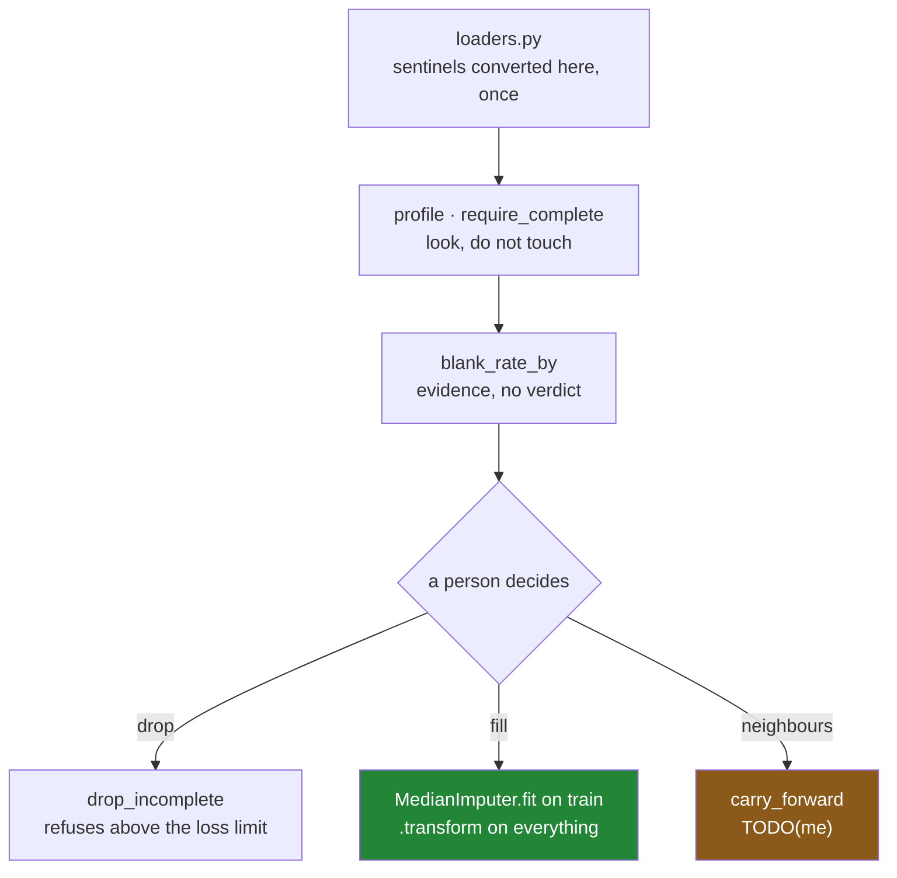

# 7.1 — `src/setu/missing.py`: the day's module

## One-line answer

The day's module keeps two promises — **a blank is never filled from data the model will not have**,
and **no fill happens without a record of where it happened** — and where a promise cannot be kept by
the code it is kept by a check that refuses.

---

## The story

By the end of the day the flat has a set of habits. Look at the blanks before doing anything with
them. Ask why they are blank. Never work out a fill from a part of the sheet you were supposed to be
hiding. Write down which boxes you guessed.

Habits are private. The next person to open this code has not had the day, and the code does not
announce which of its lines are load-bearing.

A `.copy()` looks like caution somebody could tidy away. Computing the median inside the function
that fills looks tidier than passing it in from outside. Adding a flag column for a batch with no
blanks looks like waste. All three edits pass review, all three keep the tests green, and every one
of them undoes an afternoon.

So the habits go into one file, with the reasons attached, and where the code cannot enforce a rule a
check refuses instead.

---

## The idea in plain language

`src/setu/missing.py` holds the day's operations. Each one carries a decision the day argued for:

| the function | the rule it keeps | how it keeps it |
|---|---|---|
| `profile` | a count is meaningless without a share | returns both, plus the dtype ([2.2](../02-finding-it/2.2-counting-the-blanks.md)) |
| `require_complete` | required fields fail loudly | raises, naming the columns and rows ([2.1](../02-finding-it/2.1-isna-and-notna.md)) |
| `blank_rate_by` | evidence, never a verdict | returns a table; no `is_random` boolean ([3.1](../03-why-it-is-missing/3.1-three-reasons-a-line-is-blank.md)) |
| `drop_incomplete` | a drop is visible | refuses above a loss share, logs below it ([4.1](../04-dropping/4.1-dropna-and-the-rows-that-left.md)) |
| `MedianImputer` | the fill never sees the test set | `fit` and `transform` are separate ([6.3](../06-the-leak/6.3-the-imputer-you-write-yourself.md)) |
| `fill_by_group` | the majority group does not set everyone's level | group median, global fallback ([5.2](../05-filling/5.2-a-different-fill-for-each-column.md)) |
| `carry_forward` | a neighbour needs an order and a boundary | **not yet** — it ignores both; yours to fix ([5.3](../05-filling/5.3-ffill-bfill-and-the-order-you-depend-on.md)) |

Two of those are worth calling out.

**`blank_rate_by` deliberately returns no conclusion.** It would be easy to have it return `True` when
the blank rate is flat across every other column, and that boolean would be a lie:
[3.1](../03-why-it-is-missing/3.1-three-reasons-a-line-is-blank.md) showed that a flat rate is
consistent with blanks caused by the missing value itself, which no column can reveal. A function that
returns evidence forces a person to decide. A function that returns a verdict lets nobody decide.

**`carry_forward` is deliberately wrong.** As written in this module it calls `ffill` on the frame it
is given, without sorting and without grouping — which is the exact bug from
[5.3](../05-filling/5.3-ffill-bfill-and-the-order-you-depend-on.md), where one flat's meter reading
fills another flat's blank. It is left that way on purpose, *When it breaks* measures the damage, and
the build brief asks you to fix it.

The module builds on the days before it rather than repeating them. It imports `SelectionError` from
Day 28's `select.py` rather than inventing a fourth exception meaning *"this frame is not what I
expected"*, and it assumes the frame arrived through Day 27's loader
([Day 27, 5.1](../../../day-27-reading-and-writing/parts/05-the-module/5.1-the-loaders-module.md)),
so it never re-checks dtypes and never re-runs the sentinel conversion from
[2.3](../02-finding-it/2.3-the-blank-that-was-not-blank.md) — that belongs at the boundary, in the
loader, once.

---

## Why Setu needs it

- **[7.2](7.2-the-test-that-can-go-red.md)** tests every promise on this page, and finds that one of
  the tests, as first written, could not fail.
- **Sections 2 and 3** argued for looking before touching; **4, 5 and 6** argued for how to touch.
  This is where all of it stops being advice.
- **Day 26's `frames.py`** owns what a shopping list *is*, **Day 27's `loaders.py`** how it *arrives*,
  **Day 28's `select.py`** how it is *selected from*, **Day 29's `order.py`** how it is *ordered*.
  This owns what happens where it is *incomplete*.
- **Day 31** groups the same frame, and every blank question here returns with a group attached —
  which is why `fill_by_group` is already written in this shape.
- **Day 45** is the Phase 4 gate, whose `audit()` deliverable is `profile` plus the checks that
  surround it.
- **Day 91** replaces `MedianImputer` with `SimpleImputer` inside a `Pipeline`, and you will be able
  to read that class because you wrote this one.

---

## The mechanism

The head of the file, and the two functions that only look:

```python
"""Find, explain and fill the blanks in the flat's shopping data — without leaking the test set."""

from __future__ import annotations

import logging

import pandas as pd

from setu.select import SelectionError

log = logging.getLogger(__name__)

REQUIRED: list[str] = ["need", "price"]
MAX_DROP_SHARE: float = 0.02


class ImputationError(ValueError):
    """A fill could not be learned, or could not be applied as promised."""


def profile(frame: pd.DataFrame) -> pd.DataFrame:
    """One row per column: how complete it is, and what type it holds."""
    return pd.DataFrame(
        {
            "rows": len(frame),
            "values": frame.notna().sum(),
            "blanks": frame.isna().sum(),
            "share_blank": frame.isna().mean().round(4),
            "dtype": frame.dtypes.astype("str"),
        }
    )


def require_complete(frame: pd.DataFrame, columns: list[str] | None = None) -> None:
    """Raise unless every required column is complete. Names the offending rows."""
    wanted = REQUIRED if columns is None else columns
    absent = sorted(set(wanted) - set(frame.columns))
    if absent:
        raise SelectionError(f"frame has no columns {absent}; has {list(frame.columns)}")
    missing = frame[wanted].isna()
    if not missing.to_numpy().any():
        return
    per_column = missing.sum()
    offenders = frame.index[missing.any(axis=1)].tolist()
    raise ImputationError(
        f"missing values in required columns: {per_column[per_column > 0].to_dict()}; "
        f"first rows: {offenders[:20]}"
    )
```

**Line by line:**

- `REQUIRED` and `MAX_DROP_SHARE` are module constants, so the two policy decisions on this page —
  *which fields a row cannot do without*, *how much loss is acceptable* — are readable without opening
  a function ([4.2](../04-dropping/4.2-how-thresh-and-subset.md)).
- `SelectionError` is **imported**, not redefined. Day 28 already has a class meaning "this frame is
  not what was promised", and a second one meaning the same thing makes `except` clauses miss errors
  ([Day 18, 2.2](../../../day-18-exceptions/parts/02-the-hierarchy/2.2-which-built-in-to-raise.md)).
- `ImputationError` is genuinely different: the frame is fine and the **filling** did not do what it
  said.
- `profile` returns a frame and prints nothing, which is what lets it be logged, diffed against
  yesterday's and asserted on — the whole argument of
  [2.2](../02-finding-it/2.2-counting-the-blanks.md), and the reason `.info()` cannot stand in for it.
- `share_blank` is rounded to four places, so an alert threshold of one in a thousand is expressible
  and two identical profiles compare equal.
- `columns: list[str] | None = None` with `REQUIRED` as the fallback, rather than
  `columns: list[str] = REQUIRED`. A mutable default is shared between every call, and a caller who
  appends to it changes the default for the whole process
  ([Day 19, 2.2](../../../day-19-typing-dataclasses-and-concurrency/parts/02-dataclasses/2.2-default-factory.md)).
- `missing.to_numpy().any()` collapses the grid to one answer. `.any()` on a frame gives one answer
  per column, so the bare version would raise the ambiguity error from
  [2.1](../02-finding-it/2.1-isna-and-notna.md).
- `offenders[:20]` truncates. An error message carrying four hundred thousand row labels is a denial
  of service on your own log.

The one that decides, and the one that leaks if you get it wrong:

```python
def drop_incomplete(
    frame: pd.DataFrame,
    required: list[str] | None = None,
    max_loss: float = MAX_DROP_SHARE,
) -> pd.DataFrame:
    """Drop rows missing a required field. Refuse if that costs too much of the table."""
    wanted = REQUIRED if required is None else required
    before = len(frame)
    if before == 0:
        raise SelectionError("cannot drop from an empty frame")

    non_empty = frame.dropna(how="all")
    kept = non_empty.dropna(subset=wanted)
    lost = before - len(kept)
    share = lost / before

    if share > max_loss:
        by_column = frame[wanted].isna().sum().sort_values(ascending=False)
        raise ImputationError(
            f"dropping rows missing {wanted} would lose {lost}/{before} "
            f"({share:.1%} > {max_loss:.1%}); blanks per column: {by_column.to_dict()}"
        )

    log.info(
        "dropped %d of %d rows (%.2f%%): %d empty, %d missing %s",
        lost,
        before,
        share * 100,
        before - len(non_empty),
        len(non_empty) - len(kept),
        wanted,
    )
    return kept
```

**Line by line:**

- `dropna(how="all")` runs **before** the required-field drop, and its count is logged separately. A
  jump in empty rows means a broken writer upstream; a jump in incomplete rows means a changed
  schema. One combined number cannot tell you which
  ([4.2](../04-dropping/4.2-how-thresh-and-subset.md)).
- `max_loss` is a **share**, so it survives the table growing, and `share > max_loss` uses a strict
  comparison so that a limit of `0.0` reads as "never lose a row".
- The refusal carries the count, the total, the share, the limit and the blanks per column sorted
  worst-first — the difference between "this failed" and "this failed because `price` is empty on
  4 000 rows".
- `log.info` on the success path, because **a drop under the limit is still a drop**, and without a
  record nobody can answer "when did we start losing two per cent?".
- `%d`/`%s` formatting rather than an f-string in the log call, so the string is only built if the
  message is actually emitted.

And the deliberately unfinished one:

```python
def carry_forward(frame: pd.DataFrame, column: str) -> pd.Series:
    """Carry the last known value forward.

    TODO(me): this is wrong in two ways that 5.3 named.
      1. It does not sort, so it fills in whatever row order the frame arrived in.
      2. It does not group, so one entity's values fill another entity's blanks.
      3. It has no limit, so a value is carried for ever across an outage.
    Give it `by`, `order` and `limit` parameters and make all three required.
    """
    return frame[column].ffill()
```

**Line by line:**

- `frame[column].ffill()` is the whole body, and it is the line most people write. It is correct only
  when the frame happens to be sorted and happens to contain one entity — which is true of every
  example in a tutorial and of almost no real table.
- The docstring names the three failures rather than saying "improve this", so the task is
  checkable: the fixed version has three parameters and none of them has a default.
- Leaving it broken is deliberate. The test in [7.2](7.2-the-test-that-can-go-red.md) that catches it
  is one you write, and a test that fails on the day you write it is the only kind you can trust.



---

## When it breaks

**The unfinished `carry_forward`, measured:**

```text
$ uv run python -c "
import pandas as pd
r = pd.DataFrame({
    'flat':  pd.Series(['a', 'b', 'a', 'b'], dtype='str'),
    'meter': [1000.0, 5000.0, None, None],
})
print(r.assign(carried=r['meter'].ffill(), correct=r.groupby('flat')['meter'].ffill()))
"
```

```text
  flat   meter  carried  correct
0    a  1000.0   1000.0   1000.0
1    b  5000.0   5000.0   5000.0
2    a     NaN   5000.0   1000.0
3    b     NaN   5000.0   5000.0
```

**What it means.** Row 2 is flat A and the module's version gave it `5000.0`, flat B's reading, because
that was the row physically above it. **No error.** The `correct` column shows the four extra
characters that fix it. This is the failure the build brief asks you to close, and the point of
printing both columns side by side is that the wrong one is not obviously wrong on its own.

**A required column that is not in the frame:**

```text
$ uv run python -c "
import pandas as pd
class SelectionError(ValueError): pass
def require_complete(frame, wanted):
    absent = sorted(set(wanted) - set(frame.columns))
    if absent:
        raise SelectionError(f'frame has no columns {absent}; has {list(frame.columns)}')
require_complete(pd.DataFrame({'cost': [1.0]}), ['need', 'price'])
"
```

```text
Traceback (most recent call last):
  File "<string>", line 8, in <module>
  File "<string>", line 6, in require_complete
SelectionError: frame has no columns ['need', 'price']; has ['cost']
```

**What it means.** Without the check, `frame[wanted]` raises a bare `KeyError: "['need', 'price'] not
in index"` from inside pandas, which is true and does not say what the frame *does* have. Printing
both sides of the mismatch is the difference between a rename you spot immediately and twenty minutes
of adding print statements.

**The drop that refuses:**

```text
$ uv run python -c "
import pandas as pd
class ImputationError(ValueError): pass
def drop_incomplete(frame, wanted, max_loss=0.02):
    before = len(frame)
    kept = frame.dropna(how='all').dropna(subset=wanted)
    lost = before - len(kept); share = lost / before
    if share > max_loss:
        by_column = frame[wanted].isna().sum().sort_values(ascending=False)
        raise ImputationError(
            f'dropping rows missing {wanted} would lose {lost}/{before} '
            f'({share:.1%} > {max_loss:.1%}); blanks per column: {by_column.to_dict()}'
        )
    return kept
df = pd.DataFrame({'need': [1, 2, 3, 4], 'price': [1.0, None, None, 4.0]})
drop_incomplete(df, ['need', 'price'])
"
```

```text
Traceback (most recent call last):
  File "<string>", line 16, in <module>
  File "<string>", line 10, in drop_incomplete
ImputationError: dropping rows missing ['need', 'price'] would lose 2/4 (50.0% > 2.0%); blanks per column: {'price': 2, 'need': 0}
```

**What it means.** The function refused to silently halve the table, and the message says which column
caused it. Compare that with `df.dropna(subset=["need", "price"])`, which returns two rows and no
comment. **Refusing is the feature**, and the number `0.02` is a policy decision that belongs in a
constant somebody can argue with.

---

## In production

**What a professional changes about a module like this.** Three things, none of them about pandas.

**The policy leaves the code.** `REQUIRED` and `MAX_DROP_SHARE` start as constants and end up in a
schema file or a config object, because the people who know which fields are required are usually not
the people who edit this module. The functions keep their signatures; the values arrive from outside.
The intermediate step, and a good one, is to keep them as constants and have the test assert their
values, so a change to policy shows up as a deliberate test edit in a diff.

**The learned state gets versioned with the model.** `MedianImputer` grows `save` and `load`
([6.3](../06-the-leak/6.3-the-imputer-you-write-yourself.md)), and the file it writes goes into the
model registry beside the weights. The rule is that a model and the imputer it was trained with are
one artefact: loading them separately is how a serving process ends up filling with a value the model
never saw during training.

**Everything that logs, logs structurally.** `log.info("dropped %d of %d rows", ...)` is readable and
not queryable. In a system where somebody has to answer *"which stage started losing rows on the
fourteenth?"*, these become structured events — stage name, rows in, rows out, reason — emitted to
somewhere that can be grouped and graphed. The counts are already being computed; only the emission
changes.

**What changes at scale.** `profile` and `require_complete` are full passes over the frame, so on a
wide table they are worth running on the columns that matter rather than all of them. `drop_incomplete`
copies the surviving rows, so its peak memory is roughly the frame plus the result. The functions that
would actually hurt at scale are the ones that group, and the practical answer for anything past a
few million rows is Day 35's Polars or DuckDB, where the same operations are expressed as a query and
never build the intermediate masks. The design does not change; the executor does.

**The failure mode that only appears with real data.** A module like this is written when the data is
clean, tested on the clean data, and then meets a batch where every price is blank. `MedianImputer.fit`
raises, correctly, and the pipeline stops — at three in the morning, on a batch that will be retried
automatically, for ever. Refusing is right; refusing without a way to skip the batch, quarantine it and
carry on is an outage. The production shape is that these errors are caught one level up, the batch is
written somewhere for a person to look at, and the pipeline continues with the batches that are fine.

**The review comment a senior engineer leaves.** *"`carry_forward` calls `ffill` on the whole frame.
After the merge on line 30 the rows are interleaved by date, so this will fill one flat's meter from
another's. Group by the entity, sort by time first, and add a limit."*

**The interview question.** *"Walk me through how you would handle missing data in a new dataset."*
The order is the answer: profile it first, work out why the blanks are there before deciding what to
do, split before you learn any fill value, choose drop or fill per column with a stated reason, keep a
flag where the missingness is informative, and log the row counts at every step. The follow-up worth
being ready for: *"what would you put in a shared module rather than a notebook?"* The decisions —
which fields are required, how much loss is acceptable, which fill each column gets — because those
are the parts that have to be the same in training and in serving.

---

## Check yourself

```bash
uv run python -c "
import pandas as pd
def profile(frame):
    return pd.DataFrame({
        'rows': len(frame),
        'values': frame.notna().sum(),
        'blanks': frame.isna().sum(),
        'share_blank': frame.isna().mean().round(4),
        'dtype': frame.dtypes.astype('str'),
    })
shop = pd.DataFrame({
    'item':  pd.Series(['milk', 'bread', 'eggs', 'rice'], dtype='str'),
    'need':  [2, 1, 6, 1],
    'price': [1.15, 1.40, None, 2.05],
}).set_index('item')
print(profile(shop))
"
```

Then open `src/setu/missing.py` and read `carry_forward`'s docstring. Say which of its three listed
faults would show up first on the flat's own data, and which one would take a year to notice.

**Answer out loud, without scrolling up:**

> Name the two promises this module makes. Then say why `blank_rate_by` returns a table rather than a
> true-or-false answer, and what would be wrong with the true-or-false version.

---

**Next:** [7.2 — `tests/test_missing.py`, the test that can go red](7.2-the-test-that-can-go-red.md).
