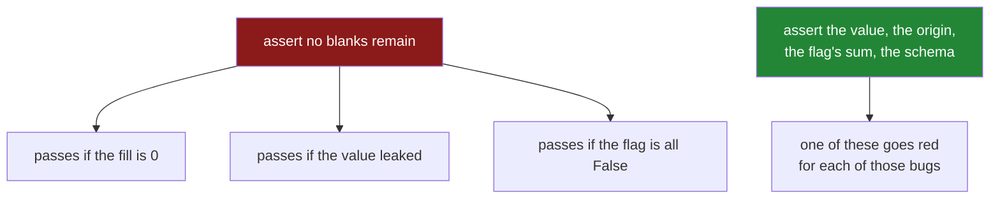

# 7.2 — `tests/test_missing.py`: the test that can go red

## One-line answer

A test for missing-data code has to assert on the thing that would still be true if the code were
wrong — the row count, the fill value's *origin*, the flag's sum — because almost every failure on
this day is a plausible number rather than an error, and a test that only checks "no blanks remain"
passes on all of them.

---

## The story

Somebody writes a test for the filling code. It says: fill the sheet, then check there are no blanks
left.

It passes. It passed the day it was written, it passes now, and it will pass for ever, because
`fillna` always removes blanks. It would pass if the fill value were zero. It would pass if the fill
value had been worked out from the half of the year that was supposed to be hidden. It would pass if
the flag saying which boxes were guessed had been computed after the guessing and was therefore all
`False`.

Every single mistake the day has been about survives that test.

The test is not badly written. It is checking the one thing that cannot go wrong. And nobody notices,
because a green test looks the same whether it is guarding something or not.

The way to find out is to break the code on purpose and see whether the test goes red. If it does not,
the test was decoration.

---

## The idea in plain language

Principle 7 says every lab ends with at least one test that **can go RED**. On this day that
requirement is unusually sharp, because of something sections 1 to 6 kept demonstrating: the failures
here do not raise. A wrong fill produces a number. A biased drop produces a table. A destroyed flag
produces a column. There is no exception to assert on, so the test has to assert on a *consequence*.

The trick is to ask, for each promise: **what would still be true if this were broken?** If the
answer is "the thing I am asserting", the assertion is worthless. Applied to the day's promises:

| the promise | the useless assertion | the assertion that can go red |
|---|---|---|
| the fill happened | `assert not out.isna().any()` | `assert out.loc[1, "price"] == 2.0` — the *value*, and where it came from |
| the fill did not leak | *(nothing — the leaking version also fills)* | fit on train, change a test row, assert `values_` did not move |
| the flag records the blanks | `assert "price_was_missing" in out` | `assert out["price_was_missing"].sum() == blanks_before` |
| the drop refused | `assert len(kept) < len(df)` | `pytest.raises(ImputationError)` with a share above the limit |
| `transform` works on one row | *(nobody tests this)* | transform a one-row frame and assert the value |
| the output schema is stable | — | transform two frames, assert `list(a.columns) == list(b.columns)` |

Two of those deserve a note.

**The leak test is the most valuable test on the page**, and it is the one people never write, because
there is no error to catch. It works exactly like the demonstration in
[6.1](../06-the-leak/6.1-the-median-that-saw-the-test-set.md): fit on the training rows, then change a
value in the held-back rows, then assert that the learned value has not moved. If somebody later
"simplifies" `fit` to take the whole frame, that assertion fails. Nothing else in the suite would.

**Testing a `TODO(me)` is legitimate and useful.** `carry_forward` in
[7.1](7.1-the-missing-module.md) is deliberately broken, so the test for it is written to describe
what it *should* do, and it fails today. A test that is red because the code is not finished yet is
not a broken test; it is a specification with a deadline. Mark it `xfail` with a reason if a red suite
would block other work, and remove the marker when you fix the function.

One more thing about fixtures. Every test on this page uses a small frame with the blanks in known
places. Build it in a `pytest` fixture rather than a module-level constant, because a module-level
frame is shared between tests and any test that writes into it changes what the next one sees —
which is a genuinely horrible bug to find, and free to avoid
([Day 18, 4.4](../../../day-18-exceptions/parts/04-in-anger/4.4-pytest-raises.md) covers `raises`;
fixtures came with the testing day before it).

---

## Why Setu needs it

- **[7.1](7.1-the-missing-module.md)** made the promises. This is where they are enforced by
  something other than the memory of whoever wrote them.
- **[6.1](../06-the-leak/6.1-the-median-that-saw-the-test-set.md)** described a bug with no error
  text. The leak test is the only mechanical defence against it that exists.
- **[3.2](../03-why-it-is-missing/3.2-the-blank-that-is-itself-a-signal.md)** warned that the flag
  goes silently all-`False` if the two lines are swapped. The flag-sum assertion is what notices.
- **Day 45** is the Phase 4 gate, which requires a green suite over the cleaned dataset — and a suite
  whose tests have each been seen to fail at least once.
- **Day 235** runs this in CI on every push, where a test that cannot fail costs the same to run as
  one that can and buys nothing.

---

## The mechanism

The fixture and the tests that assert on values rather than on emptiness:

```python
"""Tests for setu.missing — every assertion here has been watched to fail."""

from __future__ import annotations

import pandas as pd
import pytest

from setu.missing import ImputationError, MedianImputer, drop_incomplete, profile


@pytest.fixture
def shop() -> pd.DataFrame:
    """Four rows; price blank on eggs, payer blank on bread and rice."""
    return pd.DataFrame(
        {
            "item": pd.Series(["milk", "bread", "eggs", "rice"], dtype="str"),
            "need": [2, 1, 6, 1],
            "price": [1.15, 1.40, None, 2.05],
            "paid_by": pd.Series(["ana", None, "ana", None], dtype="str"),
        }
    ).set_index("item")


def test_profile_reports_the_share_not_only_the_count(shop: pd.DataFrame) -> None:
    report = profile(shop)
    assert report.loc["price", "blanks"] == 1
    assert report.loc["price", "share_blank"] == pytest.approx(0.25)
    assert report.loc["need", "share_blank"] == 0.0
    assert report.loc["price", "dtype"] == "float64"
```

**Line by line:**

- `@pytest.fixture` gives each test **its own fresh frame**. A module-level constant would be shared,
  and a test that assigns into it would change what every later test sees.
- The docstring on the fixture says where the blanks are, so a reader does not have to count columns
  to understand an assertion about `loc["price", "blanks"]`.
- `report.loc["price", "share_blank"]` asserts on the **share**, which is the number
  [2.2](../02-finding-it/2.2-counting-the-blanks.md) argued is the useful one. A test that only
  checked `blanks == 1` would pass on a `profile` that had forgotten to divide.
- `pytest.approx(0.25)` because `share_blank` is a float. A bare `== 0.25` happens to work here and
  stops working the moment the fixture has three rows instead of four
  ([Day 23, 1.6](../../../day-23-ufuncs-and-statistics/parts/01-ufuncs/1.6-isclose-and-allclose.md)).
- The dtype assertion is not padding. `profile` casting dtypes to `str` is what makes the report
  loggable as JSON, and a change to that would break a downstream consumer silently.

The test that catches the leak:

```python
def test_fit_does_not_see_rows_it_was_not_given() -> None:
    train = pd.DataFrame({"price": [1.0, None, 2.0, 3.0]})
    test = pd.DataFrame({"price": [10.0, 11.0, None, 12.0]})

    imputer = MedianImputer(["price"]).fit(train)
    learned_before = dict(imputer.values_)

    test.loc[3, "price"] = 1000.0
    imputer_again = MedianImputer(["price"]).fit(train)

    assert imputer_again.values_ == learned_before
    assert imputer.transform(test).loc[2, "price"] == learned_before["price"]
```

**Line by line:**

- `dict(imputer.values_)` **copies** the learned values. Holding a reference would mean comparing the
  dictionary to itself, and the assertion would pass no matter what — the second-most common way a
  test becomes decoration.
- `test.loc[3, "price"] = 1000.0` changes a row the imputer must never have seen. This is the
  demonstration from [6.1](../06-the-leak/6.1-the-median-that-saw-the-test-set.md) turned into an
  assertion.
- Refitting on `train` and comparing to `learned_before` is what fails if somebody changes `fit` to
  take the whole dataset. **That is the entire purpose of this test**, and no other test in the file
  would notice.
- The second assertion checks the *applied* value, not just the stored one: the blank in the test
  frame is filled with the training median, which is what production will do.
- There is no `pytest.raises` here, because the bug being guarded against does not raise. A test for a
  silent failure has to assert on a value.

The test that catches the swapped lines:

```python
def test_indicator_counts_the_blanks_that_were_there_before_the_fill(shop: pd.DataFrame) -> None:
    blanks_before = int(shop["price"].isna().sum())
    assert blanks_before == 1

    out = MedianImputer(["price"]).fit(shop).transform(shop)

    assert out["price_was_missing"].sum() == blanks_before
    assert out.loc["eggs", "price_was_missing"]
    assert not out["price"].isna().any()
```

**Line by line:**

- `blanks_before` is measured **before** the transform and asserted to be `1`, so a change to the
  fixture cannot quietly make the real assertion vacuous by dropping the blank altogether.
- `out["price_was_missing"].sum() == blanks_before` is the assertion that goes red if the flag is
  computed after the fill — the failure from
  [3.2](../03-why-it-is-missing/3.2-the-blank-that-is-itself-a-signal.md). A swapped pair of lines
  gives a sum of zero here and no error anywhere else.
- `out.loc["eggs", "price_was_missing"]` checks it is flagged on the **right row**, not merely that
  the right number of rows is flagged.
- `assert not out["price"].isna().any()` is the weak assertion, kept last and kept deliberately: it
  is worth having, and on its own it is worth nothing.

The refusal, and the one-row check:

```python
def test_drop_refuses_when_the_loss_is_too_large() -> None:
    frame = pd.DataFrame({"need": [1, 2, 3, 4], "price": [1.0, None, None, 4.0]})
    with pytest.raises(ImputationError, match=r"50\.0% > 2\.0%"):
        drop_incomplete(frame, ["need", "price"])


def test_transform_works_on_a_single_row() -> None:
    train = pd.DataFrame({"price": [1.0, None, 2.0, 3.0]})
    imputer = MedianImputer(["price"]).fit(train)

    one = imputer.transform(pd.DataFrame({"price": [None]}))

    assert one.loc[0, "price"] == 2.0
    assert bool(one.loc[0, "price_was_missing"]) is True
    assert list(one.columns) == list(imputer.transform(train).columns)
```

**Line by line:**

- `pytest.raises(..., match=...)` checks the **message**, not only the type
  ([Day 18, 4.4](../../../day-18-exceptions/parts/04-in-anger/4.4-pytest-raises.md)). Without
  `match`, any `ImputationError` from anywhere in the function satisfies the test, including one
  raised for an entirely different reason.
- The `match` pattern escapes the dots, because it is a regular expression and an unescaped `.`
  matches any character. It is a small thing that turns a precise test into a loose one.
- `test_transform_works_on_a_single_row` is the test almost nobody writes and the one that catches a
  step that cannot be served ([6.2](../06-the-leak/6.2-fit-on-train-transform-on-both.md)).
- The last assertion compares the **column lists** of a one-row frame and the training frame. That is
  the schema-stability check from [6.2](../06-the-leak/6.2-fit-on-train-transform-on-both.md), and it
  fails the moment somebody makes the flag conditional on there being a blank.

And the one that is red on purpose:

```python
@pytest.mark.xfail(reason="carry_forward has no by/order/limit yet — TODO(me) in 7.1", strict=True)
def test_carry_forward_does_not_cross_entities() -> None:
    from setu.missing import carry_forward

    readings = pd.DataFrame(
        {
            "flat": pd.Series(["a", "b", "a", "b"], dtype="str"),
            "meter": [1000.0, 5000.0, None, None],
        }
    )
    carried = carry_forward(readings, "meter", by=["flat"], order="flat", limit=1)
    assert carried.tolist() == [1000.0, 5000.0, 1000.0, 5000.0]
```

**Line by line:**

- `xfail` with a **reason** that names the TODO, so the marker is a pointer to work rather than a
  shrug.
- `strict=True` is the important argument: with it, the test **fails if it unexpectedly passes**. That
  is what makes the marker self-removing — the day you fix `carry_forward`, the suite tells you to
  delete the marker, rather than quietly staying green with a lie attached.
- The call passes `by`, `order` and `limit`, which the current `carry_forward` does not accept. It
  fails today with a `TypeError`, which is correct: the signature is part of what is being specified.
- The expected list is the answer from
  [5.3](../05-filling/5.3-ffill-bfill-and-the-order-you-depend-on.md) — each flat's blank filled from
  its own previous reading, never from the other flat's.



---

## When it breaks

**Watching the leak test go red, which is the point of writing it:**

```text
$ uv run pytest tests/test_missing.py::test_fit_does_not_see_rows_it_was_not_given -q
```

Break it first — change `MedianImputer.fit` to compute the median over `pd.concat([frame, test])`, or
simply call `fit` on the whole dataset in the test — and run it again. If the test still passes, it is
not testing what its name says. **Every assertion in this file should be watched to fail once**, on
the day it is written, before it is trusted. That is the check the build brief asks for, and it takes
about a minute per test.

**The assertion that compares a dictionary to itself:**

```text
$ uv run python -c "
values = {'price': 2.0}
kept = values
values['price'] = 99.0
print('kept  :', kept)
print('equal?:', kept == values)
"
```

```text
kept  : {'price': 99.0}
equal?: True
```

**What it means.** `kept = values` binds a second name to the same dictionary, so changing one changes
both and the comparison is always `True`. A test written that way passes whatever the code does. The
fix is `dict(values)` — or `copy.deepcopy` for anything nested — and the general rule is that a test
which stores a "before" value must store a **copy** of it.

**The `match` that matches too much:**

```text
$ uv run python -c "
import re
message = 'dropping rows missing [\'need\', \'price\'] would lose 2/4 (50.0% > 2.0%)'
print('unescaped:', bool(re.search('50.0% > 2.0%', message)))
print('escaped  :', bool(re.search(r'50\.0% > 2\.0%', message)))
print('unescaped also matches:', bool(re.search('50.0% > 2.0%', '5000% > 2X0%')))
"
```

```text
unescaped: True
escaped  : True
unescaped also matches: True
```

**What it means.** The unescaped pattern matches the message it was meant for **and** a nonsense one,
because `.` matches any character. In a `pytest.raises(match=...)` that means the test would accept an
error message that had drifted into something wrong. Escaping the dots costs two characters and makes
the assertion mean what it appears to mean.

---

## In production

**What a professional adds to a test file like this.** Three things.

**A property test for the invariants that hold on every input.** For imputation there are two worth
having: *after `transform`, the columns named in `values_` have no blanks*, and *`transform` never
changes a value that was not blank*. The second is the more valuable and the one people forget — an
imputer that also quietly rounded, clipped or re-typed a column would pass every example-based test in
this file. Hypothesis generates frames with blanks in random places and checks both, and it finds the
edge cases nobody thinks of: the empty frame, the all-blank column, the single row.

**A test that the artefact round-trips.** Save the fitted imputer, load it, transform the same frame
with both, and assert the results are identical. That is the only mechanical defence against the
training/serving skew described in
[6.2](../06-the-leak/6.2-fit-on-train-transform-on-both.md), and it catches the specific accident of
adding a new field to `__init__` and forgetting to put it in `save`.

**A test with a real fixture file, not a hand-built frame.** Everything above uses frames built in
Python, which are clean by construction. A small CSV committed under `tests/fixtures/` — with a
sentinel in it, a whitespace-only cell, a leading-zero code and a blank line — exercises the path the
data actually takes, including the loader, and it is where the failures from
[2.3](../02-finding-it/2.3-the-blank-that-was-not-blank.md) get caught.

**What changes at scale.** These tests run in milliseconds and should stay that way; the temptation to
test the imputer on a hundred thousand rows should be resisted, because a slow suite is a suite people
stop running. The scale question that does matter is coverage of *shapes* rather than of size: an
empty frame, a single row, a column of one distinct value, a column that is entirely blank, a frame
with duplicate index labels. Each of those has produced a real bug in the code on this day, and each
costs one small test.

**The failure mode that only appears with real data.** The suite is green and the pipeline is wrong,
because the tests all use the same four-row fixture and that fixture never had the property that
breaks things — two entities interleaved, or a group with no values, or a category that appears only
in production. The defence is not more assertions on the same fixture; it is more fixtures, each
built to have exactly one awkward property, named after the property.

**The review comment a senior engineer leaves.** *"`test_fill_removes_blanks` cannot fail — `fillna`
always removes blanks. Assert the actual value and where it came from. And please add the test that
changes a row in the held-back half and checks the learned median does not move; that is the bug we
actually had."*

**The interview question.** *"How do you test data-cleaning code?"* The answer that lands is about
what can go wrong silently: cleaning failures usually produce plausible values rather than errors, so
the assertions have to be on values, counts and origins rather than on the absence of an exception.
Then the specifics: assert the fill value and that it came from the training rows, assert the
missingness flag's sum against the pre-fill blank count, assert that `transform` works on a single row
and produces the same columns every time. The follow-up: *"how do you know a test is worth having?"*
Break the code on purpose and watch it go red. If it stays green, delete it.

---

## Check yourself

```bash
uv run pytest tests/test_missing.py -q
```

Then break one thing on purpose — swap the two lines inside `MedianImputer.transform` so the flag is
computed after the fill — and run it again. Say which test goes red, and say which of the others stay
green even though the code is now wrong.

**Answer out loud, without scrolling up:**

> Say why `assert not out.isna().any()` is a weak test for an imputer, and name two bugs it would
> pass. Then describe, in two sentences, the test that catches a fill value computed from the test
> set.

---

**Back to the hub:** [`LESSON.md`](../../LESSON.md).
