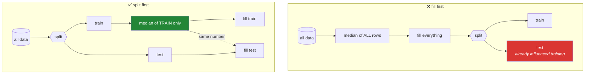

# Day 30 — Missing data

**Phase 4 · Module 4** · ID: **PD-07** (missing data: `NA`, `fillna`, `dropna`, `interpolate`)
· 🔁 revisited as **FE-01** on Day 76

> **Yesterday:** the vectorisation ladder and ranking.
> **Today:** the values that aren't there. Two things: the mechanics (three different missing markers,
> and the operations that treat them differently), and one rule that will matter for the next 210
> days — **you may look at missing data now, but you may not fill it here.**
> **Tomorrow:** `groupby`.

```bash
./m start 30 && ./m scaffold 30
```

**Time:** 100 minutes. **Request budget:** 0 model calls.

---

## §1 The story

Fill a column's missing values with its median. It is the most reasonable thing in the world, it
takes one line, and if you do it before splitting your data it invalidates every number you will
later report.

Here is why. The median is computed from **every** row — including the rows that will become your
test set. Those rows have now influenced the values your model trains on. The model has, in a small
and completely invisible way, seen the test data. Your test score is optimistic and you have no way
to tell by how much.



So the rule this project follows from today:

> **`src/setu/` may measure missingness. It may not impute.** Imputation happens inside a
> scikit-learn `Pipeline`, fitted on training data only. Day 83 builds that pipeline; Day 76 covers
> the strategies properly.

That is not pedantry deferred — it is the reason today has a build brief full of *measurement*
functions and not a single `fillna`.

**The second half is mechanics**, and pandas 3.0 makes them worth stating carefully, because there
are three different missing markers:

| Marker | Where it appears | Type |
|---|---|---|
| `np.nan` | float columns (NumPy-backed) | float |
| `None` | object columns | Python object |
| `pd.NA` | nullable dtypes (`Int64`, `boolean`, and the new `str`) | pandas singleton |

They mostly behave alike under `isna()`, which is what you should always use. Where they differ is in
**three-valued logic**: `pd.NA` propagates through comparisons rather than evaluating to `False`, so
`pd.NA > 1` is `pd.NA`, not `False`. That is more correct and it will surprise you once.

---

## §2 Setup — run this

```bash
mkdir -p days/day-30/lab
touch days/day-30/lab/missing.py
```

`src/setu/frames.py` grows today. No new packages.

---

## §3 PD-07 — mechanics

`days/day-30/lab/missing.py`:

```python
"""PD-07: detecting, counting, and reasoning about missing values. NOT filling them."""

from __future__ import annotations

import numpy as np
import pandas as pd


def frame() -> pd.DataFrame:
    return pd.DataFrame(
        {
            "title": ["Attention", None, "GPT-3", "T5", "Llama"],
            "year": pd.array([2017, 2018, None, 2019, 2023], dtype="Int64"),
            "citations": [98000.0, np.nan, 41000.0, np.nan, 30000.0],
            "venue": ["neurips", "naacl", "", "jmlr", None],
        },
        index=["p1", "p2", "p3", "p4", "p5"],
    )


def three_markers() -> None:
    df = frame()
    print(f"\n{df.dtypes.to_dict()=}")
    print(f"{df.loc['p2', 'title'] is None=}")
    print(f"{df.loc['p2', 'citations']=}   <- np.nan, a float")
    print(f"{df.loc['p3', 'year']=}        <- pd.NA, from the nullable Int64")

    print(f"\n{df.isna().sum().to_dict()=}   <- isna() catches ALL of them")
    print(f"{df.loc['p3', 'venue']=!r}   <- an EMPTY STRING is not missing")
    print("  ^ '' is data. It only becomes NaN if you listed it in na_values (Day 27).")


def three_valued_logic() -> None:
    numpy_backed = pd.Series([1.0, np.nan, 3.0])
    nullable = pd.Series([1, pd.NA, 3], dtype="Int64")

    print(f"\n{(numpy_backed > 2).tolist()=}   <- NaN comparison -> False")
    print(f"{(nullable > 2).tolist()=}        <- pd.NA propagates: <NA>, not False")
    print(f"{(nullable > 2).dtype=}           <- a NULLABLE boolean")

    print(f"\n{numpy_backed[numpy_backed > 2].tolist()=}")
    try:
        nullable[nullable > 2]
    except ValueError as exc:
        print(f"  masking with a nullable boolean containing <NA>: {exc}")
    print(f"  fix: {nullable[(nullable > 2).fillna(False)].tolist()=}")
    print("  ^ you must SAY what missing means in a filter. That is the point of NA.")


def counting_missingness() -> None:
    df = frame()
    print(f"\n{df.isna().sum().to_dict()=}                <- per column")
    print(f"{(df.isna().mean() * 100).round(1).to_dict()=}   <- as a percentage")
    print(f"{df.isna().sum().sum()=}                     <- total cells")
    print(f"{df.isna().any(axis=1).sum()=}               <- rows with ANY missing")
    print(f"{df.isna().all(axis=1).sum()=}               <- rows entirely missing")
    print(f"{df.notna().all(axis=1).sum()=}              <- complete rows")

    print(f"\n{df.isna().sum(axis=1).to_dict()=}   <- per row: is missingness concentrated?")


def missingness_can_be_a_signal() -> None:
    df = frame()
    both = df["citations"].isna() & df["title"].isna()
    print(f"\n{both.sum()=}   <- rows missing BOTH")
    print(f"{df.isna().corr().round(2).to_dict()=}")
    print("  ^ correlated missingness means it is NOT random. That is MAR or MNAR")
    print("    (Day 76). A 'was_missing' indicator column is often a real feature.")


def operations_disagree_about_na() -> None:
    s = pd.Series([1.0, np.nan, 3.0])
    print(f"\n{s.sum()=}     <- skipna=True by default")
    print(f"{s.sum(skipna=False)=}")
    print(f"{s.mean()=}    <- mean of the PRESENT values (2.0, not 1.33)")
    print(f"{s.count()=}   <- non-missing count; len() would be 3")
    print(f"{len(s)=}")

    print(f"\n{s.cumsum().tolist()=}   <- NaN passes through, sum continues")
    print(f"{s.value_counts().to_dict()=}          <- drops NaN by default")
    print(f"{s.value_counts(dropna=False).to_dict()=}")

    grouped = pd.DataFrame({"g": ["a", None, "a"], "v": [1, 2, 3]})
    print(f"\n{grouped.groupby('g')['v'].sum().to_dict()=}   <- NULL GROUPS ARE DROPPED")
    print(f"{grouped.groupby('g', dropna=False)['v'].sum().to_dict()=}")
    print("  ^ Day 31's most expensive default. Rows silently vanish from a groupby.")


def dropping_is_a_decision_too() -> None:
    df = frame()
    print(f"\n{len(df)=}")
    print(f"{len(df.dropna())=}            <- any missing anywhere: 1 row survives")
    print(f"{len(df.dropna(subset=['year']))=}   <- only where `year` is missing")
    print(f"{len(df.dropna(thresh=3))=}    <- keep rows with >= 3 non-missing values")
    print(f"{df.dropna(axis=1).columns.tolist()=}   <- drop COLUMNS instead")

    print("\n  dropna() is not neutral. It is a modelling decision with a")
    print("  sample-size cost, and it belongs in the pipeline, not here.")


def what_this_module_will_NOT_do() -> None:
    print("\n  Notice what is absent from today: fillna, interpolate, ffill, bfill.")
    print("  They exist. You will use them - inside a Pipeline, on Day 83,")
    print("  fitted on TRAIN ONLY. Filling here would leak (Principle 8).")
    print("\n  Legitimate exceptions, both narrow:")
    print("    - time series: ffill within a group is often a DOMAIN rule, not a statistic")
    print("    - a constant sentinel with no fitted parameter (e.g. 'unknown' for a category)")
    print("  Both still go in the pipeline so they are applied identically to test data.")


if __name__ == "__main__":
    three_markers()
    three_valued_logic()
    counting_missingness()
    missingness_can_be_a_signal()
    operations_disagree_about_na()
    dropping_is_a_decision_too()
    what_this_module_will_NOT_do()
```

**Line by line:**

- The three markers — `None` in an object/str column, `np.nan` in a float column, `pd.NA` in a
  nullable `Int64`. **`isna()` catches all three**, which is why you never test for missingness any
  other way.
- `df.loc['p3', 'venue']` is `''` — **an empty string is not missing.** It is a zero-length value. It
  becomes NaN only if you listed `""` in `na_values` at read time (Day 27). Deciding which it should
  be is a data question, not a code question.
- `(nullable > 2)` gives `<NA>` where the value is missing — **three-valued logic**. "Is an unknown
  number greater than 2?" is genuinely unknown, not false. This is more correct than NumPy's silent
  `False`.
- Masking with a nullable boolean containing `<NA>` **raises**. Pandas refuses to guess whether an
  unknown should be included. The fix — `.fillna(False)` on the *mask* — makes you state the policy.
  (Note that this is filling a **mask**, not filling data; it is not the thing §1 forbids.)
- `df.isna().mean() * 100` — the percentage missing per column, in one expression. `isna()` gives
  booleans, and the mean of booleans is the proportion (Day 4's `bool` is an `int`, sixth appearance).
- `df.isna().corr()` — **correlation between missingness patterns.** If two columns tend to be missing
  together, the missingness is not random, and that structure is itself information. Day 76 names the
  mechanisms; today you can already see them.
- `s.mean()` on `[1, nan, 3]` gives **2.0, not 1.33** — pandas skips missing values by default. That
  default is usually right and occasionally very wrong; `skipna=False` when you want NaN to propagate.
- `s.count()` is the non-missing count; `len(s)` is the row count. Reporting the wrong one is a
  classic quiet error in a data summary.
- `groupby('g')` **drops null groups by default.** This is Day 31's most expensive default: rows with
  a missing group key silently vanish, so your group totals do not sum to your dataframe total.
  `dropna=False` keeps them. Check this on every groupby over a column that can be missing.
- `dropna(thresh=3)` — keep rows with at least three non-missing values. Along with `subset=` it makes
  dropping a targeted decision rather than a blunt one. But it is **still a decision**: it changes your
  sample and can change it non-randomly, which is a bias, not just a smaller n.

---

## §4 Build brief

Extend `src/setu/frames.py`:

```python
def missingness_report(frame) -> pd.DataFrame:
    """TODO(me): one row per column: n_missing, pct_missing, dtype, n_unique.

    - sorted by pct_missing descending, then column name
    - include columns with zero missing (their absence is information too)
    - pct rounded to 2 decimals
    - the result must be JSON-serialisable via .to_dict('records')
    Day 84's audit(df) calls this. Day 90's EDA report prints it.
    """
    raise NotImplementedError


def missingness_pattern(frame, *, top: int = 10) -> pd.DataFrame:
    """TODO(me): the most common combinations of which columns are missing together.

    - one row per distinct pattern, with a count and a percentage
    - columns listed as a sorted tuple of names, so patterns are comparable
    - most frequent first
    This is what tells you missingness is MAR/MNAR rather than random (Day 76).
    """
    raise NotImplementedError


def complete_case_cost(frame, *, subset: list[str] | None = None) -> dict:
    """TODO(me): what dropna() would cost you.

    Return {'n_before', 'n_after', 'n_dropped', 'pct_dropped'}.
    Do NOT drop anything - only measure. Raise DataError for a missing subset column.
    """
    raise NotImplementedError


def add_missing_indicators(frame, columns: list[str]) -> pd.DataFrame:
    """TODO(me): add a boolean `<col>_was_missing` column for each named column.

    - returns a NEW frame; never mutates
    - raise DataError if an indicator name already exists, or a column is missing
    - this is the ONE missing-data transform allowed outside a pipeline, because it
      is stateless: it fits no parameter from the data, so it cannot leak
    """
    raise NotImplementedError


def assert_no_missing(frame, columns: list[str]) -> None:
    """TODO(me): raise DataError if any named column has missing values.

    Message must name every offending column WITH its count, not just the first.
    Use this at pipeline boundaries to fail loudly instead of propagating NaN.
    """
    raise NotImplementedError
```

- Every function here **measures**. None of them fills. That constraint is the lesson.
- `add_missing_indicators` is the deliberate exception, and the docstring says exactly why it is safe:
  it fits **no parameter** from the data, so there is nothing to leak. Compare with a median, which is
  a parameter estimated from rows you may not be allowed to see.
- `complete_case_cost` exists so "let's just drop the nulls" becomes a number in a decision record
  rather than a shrug.

---

## §5 The eval that must be able to fail

Add to `tests/test_frames.py`:

```python
from setu.frames import (
    add_missing_indicators,
    assert_no_missing,
    complete_case_cost,
    missingness_pattern,
    missingness_report,
)


@pytest.fixture
def gappy() -> pd.DataFrame:
    return pd.DataFrame(
        {
            "a": [1.0, np.nan, 3.0, np.nan],
            "b": ["x", None, "z", None],
            "c": [1, 2, 3, 4],
        }
    )


def test_report_counts_every_marker_type():
    frame = pd.DataFrame(
        {
            "f": [1.0, np.nan],
            "o": ["x", None],
            "i": pd.array([1, None], dtype="Int64"),
        }
    )
    report = missingness_report(frame).set_index("column")
    assert report.loc["f", "n_missing"] == 1
    assert report.loc["o", "n_missing"] == 1
    assert report.loc["i", "n_missing"] == 1, "pd.NA was not counted"


def test_report_includes_complete_columns(gappy):
    assert "c" in missingness_report(gappy)["column"].tolist()


def test_report_is_sorted_by_missingness(gappy):
    pcts = missingness_report(gappy)["pct_missing"].tolist()
    assert pcts == sorted(pcts, reverse=True)


def test_report_is_json_serialisable(gappy):
    import json

    json.dumps(missingness_report(gappy).to_dict("records"))


def test_report_does_not_mutate(gappy):
    before = gappy.copy()
    missingness_report(gappy)
    assert gappy.equals(before)


def test_pattern_finds_correlated_missingness(gappy):
    patterns = missingness_pattern(gappy)
    top = patterns.iloc[0]
    assert top["count"] == 2, "the a+b together pattern should be most common"
    assert set(top["columns"]) == {"a", "b"}


def test_pattern_includes_the_complete_case(gappy):
    patterns = missingness_pattern(gappy)
    assert any(len(row["columns"]) == 0 for _, row in patterns.iterrows())


def test_complete_case_cost_measures_without_dropping(gappy):
    before = gappy.copy()
    cost = complete_case_cost(gappy)
    assert cost["n_before"] == 4 and cost["n_after"] == 2 and cost["n_dropped"] == 2
    assert cost["pct_dropped"] == pytest.approx(50.0)
    assert gappy.equals(before), "the frame was modified"


def test_complete_case_cost_with_a_subset(gappy):
    assert complete_case_cost(gappy, subset=["c"])["n_dropped"] == 0


def test_complete_case_cost_rejects_a_missing_column(gappy):
    with pytest.raises(DataError):
        complete_case_cost(gappy, subset=["nope"])


def test_indicators_are_added_without_mutating(gappy):
    out = add_missing_indicators(gappy, ["a"])
    assert out["a_was_missing"].tolist() == [False, True, False, True]
    assert "a_was_missing" not in gappy.columns


def test_indicators_do_not_fill_anything(gappy):
    out = add_missing_indicators(gappy, ["a"])
    assert out["a"].isna().sum() == 2, "the source column was imputed - that is not this function's job"


def test_indicators_reject_a_name_collision(gappy):
    frame = gappy.assign(a_was_missing=1)
    with pytest.raises(DataError):
        add_missing_indicators(frame, ["a"])


def test_assert_no_missing_passes_on_clean_columns(gappy):
    assert_no_missing(gappy, ["c"])  # must not raise


def test_assert_no_missing_names_every_offender_with_counts(gappy):
    with pytest.raises(DataError) as info:
        assert_no_missing(gappy, ["a", "b", "c"])
    message = str(info.value)
    assert "a" in message and "b" in message and "2" in message


def test_no_imputation_anywhere_in_src():
    """Principle 8, enforced: src/setu/ may measure missingness, never fill it."""
    from pathlib import Path

    offenders = [
        f"{p.name}:{i}"
        for p in Path("src/setu").rglob("*.py")
        for i, line in enumerate(p.read_text(encoding="utf-8").splitlines(), 1)
        if any(call in line for call in (".fillna(", ".interpolate(", ".ffill(", ".bfill("))
        and "noqa" not in line
        and "fillna(False)" not in line  # masking a boolean is not imputing data
    ]
    assert not offenders, f"imputation found outside a pipeline: {offenders}"
```

**Line by line:**

- `test_report_counts_every_marker_type` — all three markers in one frame. An implementation using
  `== np.nan` (Day 20's trap) or checking only for `None` fails on at least one, and the message names
  which.
- `test_pattern_finds_correlated_missingness` — the fixture is built so `a` and `b` are missing in the
  *same two rows*. That is the MAR signal, and a correct implementation surfaces it as the most common
  pattern.
- `test_pattern_includes_the_complete_case` — the "nothing missing" pattern is a legitimate row.
  Omitting it makes the percentages fail to sum to 100.
- `test_complete_case_cost_measures_without_dropping` — four assertions, the last being that the frame
  is unchanged. **Measure, do not act.**
- `test_indicators_do_not_fill_anything` — a subtle one. Adding an indicator is not imputing; if the
  source column comes back with fewer NaNs, the function did something it was not asked to do.
- `test_assert_no_missing_names_every_offender_with_counts` — Day 27's every-problem-at-once rule,
  third appearance, now with counts in the message.
- `test_no_imputation_anywhere_in_src` — **the day's real assessment**, and a repo-wide guard in the
  family of Days 17, 18, 20 and 26. It encodes §1's rule mechanically, with two documented escapes: a
  `# noqa` for a deliberate exception, and `fillna(False)` on a boolean mask, which is policy on a
  filter rather than imputation of data. **Naming the exceptions in the test is what makes them
  decisions instead of leaks.**

```bash
uv run python -m pytest tests/test_frames.py -v
```

---

## §6 Request budget

| Resource | Spent today |
|---|---|
| LLM calls | **0** |

---

## §7 Traps

- **Imputing before splitting.** Test rows influence training values. Invisible, and it inflates your score.
- **`== np.nan`.** Always `False` (Day 20). Use `isna()`.
- **Treating `""` as missing.** It is a value unless you said otherwise at read time.
- **Assuming `groupby` keeps null groups.** It drops them. `dropna=False`.
- **`len()` when you meant `.count()`.** One counts rows, the other non-missing values.
- **Masking with a nullable boolean containing `<NA>`.** Raises. Decide with `.fillna(False)`.
- **`dropna()` as a neutral cleanup.** It changes your sample, often non-randomly.
- **Ignoring correlated missingness.** It is structure, and often a usable feature.
- **`ffill` across group boundaries.** One group's last value leaks into the next group's first row.
- **Forgetting that a float column with NaN cannot be `int64`.** Day 27's lesson, still true.

---

## §8 Verify before you code

Written **2026-08-21**:

- <https://pandas.pydata.org/docs/user_guide/missing_data.html> — the three markers and the
  three-valued logic rules.
- <https://pandas.pydata.org/docs/user_guide/integer_na.html> — `pd.NA` in nullable dtypes.
- <https://pandas.pydata.org/docs/reference/api/pandas.DataFrame.groupby.html> — confirm the `dropna`
  default is still `True`.
- <https://scikit-learn.org/stable/modules/impute.html> — read this now so Day 83 is not a surprise.

---

## §9 Say it in an interview

> "The rule I hold to is that measuring missingness and imputing it happen in different places. My
> dataframe helpers report missingness — counts, percentages, which columns are missing together —
> but they never fill, because a median computed before the split has been influenced by the test
> rows, and your reported score is quietly optimistic with no way to tell by how much. Imputation goes
> in the pipeline, fitted on train only. There's a test that greps the package for `fillna` and
> friends and fails the build, with two documented escapes. The one transform I do allow outside a
> pipeline is a was-missing indicator, because it fits no parameter from the data, so there's nothing
> to leak — and correlated missingness is often a real signal rather than noise."

---

## §10 Done when

Tick [`CHECKLIST.md`](CHECKLIST.md), then `./m check && ./m done 30`.
