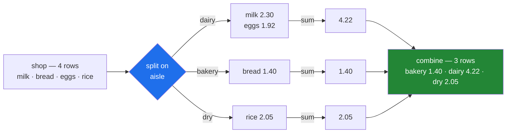

# 1.1 — Four lines, three aisles

## One-line answer

A group-by answers one shape of question — *for each distinct value in this column, what is the answer
for the rows that carry it?* — by **splitting** the rows into piles, **applying** the same calculation
to each pile, and **combining** the answers into one small result.

---

## The story

The flat's shopping list has four lines on it. Milk, bread, eggs, rice. Somebody wrote next to each
one how many were needed and what each cost, and somebody else worked out what each line came to:
milk two thirty, bread one forty, eggs one ninety-two, rice two oh five. Seven sixty-seven altogether.

Then the person who does the ordering asks a different question. *How much of that was chilled stuff?*

Nobody has an answer, because nobody wrote it down that way. So they do the only thing you can do with
a piece of paper. They read down the list with a finger, and they make piles. Milk — that is the
chilled shelf, put it in the chilled pile. Bread — that is the bread shelf, new pile. Eggs — chilled
again, same pile as the milk. Rice — that is the dry shelf, third pile.

Now there are three piles on the table, and the finger has finished. The next bit is easy. Add up the
chilled pile: two thirty and one ninety-two, four twenty-two. Add up the bread pile: one forty. Add up
the dry pile: two oh five.

And then the last bit, which nobody thinks of as a step because it is so obvious: write those three
answers down as three lines. Chilled four twenty-two. Bread one forty. Dry two oh five.

Four lines went in. Three came out. Nothing was lost — four twenty-two plus one forty plus two oh five
is seven sixty-seven, the same total as before — but the answer is now organised by the thing that was
asked about, instead of by the thing that was bought.

That is the whole move. Every time you have ever asked "how much per something", you have made piles
with your finger.

---

## The idea in plain language

Three steps, and they always come in the same order.

**Split.** You pick a column and every row goes into the pile named by its value in that column. The
column you pick is the **key**. Rows with the same key end up in the same pile; rows with different
keys end up in different piles. A pile is called a **group**, and there are exactly as many groups as
there are distinct values in the key column — no more, and none for values that never appear.

**Apply.** You run the same calculation on every group, separately. The calculation does not know
about the other groups and cannot see them. It gets one pile and returns an answer for that pile.

**Combine.** The answers are stacked back into one object, one row per group, labelled with the key
that produced it.

When the calculation turns a whole pile into a single number — a total, an average, a count — it is
called an **aggregation**, and the result has one row per group. That is the case this part is about,
and it is the case people mean when they say "group by". Section 3 covers the other case, where the
calculation gives an answer back for every original row rather than one per pile.

Three things are worth saying now, because they are the three things beginners get wrong.

**The key column is not required to be sorted, tidy or complete.** Rows can be in any order. The piles
are made by value, not by position, so a shuffled list makes the same piles as a sorted one.

**A group is a set of rows, not a value.** The chilled pile is *two rows of the shopping list*, with
all their columns still attached — the item name, the count, the price. It is not "the number 4.22".
The number only appears at the apply step.

**Nothing gets lost and nothing gets counted twice** — as long as every row has a key. Each row goes
into exactly one pile. That is worth holding on to, because [4.3](../04-the-keys/4.3-dropna-and-the-rows-that-vanished.md)
is entirely about the case where a row has no key at all, and pandas quietly leaves it on the floor.

The name for this pattern is **split-apply-combine**, and it long predates pandas. It was named and
argued for as a general strategy in *The Split-Apply-Combine Strategy for Data Analysis* (2011, DOI
10.18637/jss.v040.i01, <https://doi.org/10.18637/jss.v040.i01>), which pointed out that an enormous
number of data questions are the same three steps with a different middle. pandas' user guide page for
this feature is still titled after it.

---

## Why Setu needs it

- **[1.2](1.2-the-object-that-computed-nothing.md)** looks at what pandas hands back when you ask for
  the split and have not yet said what to apply. It is stranger than it looks.
- **[2.1](../02-aggregating/2.1-one-number-for-each-group.md)** is the apply step done properly, with
  the built-in aggregations.
- **[4.4](../04-the-keys/4.4-two-keys-and-the-multiindex.md)** splits on two columns at once, which is
  the same three steps with a pair as the key.
- **Day 29** asked you to write `spend_by_aisle` without a loop over aisles, using only masks, and
  said the idiomatic answer would arrive today
  ([Day 29, 2.1](../../../day-29-iteration-and-order/parts/02-vectorised/2.1-one-operation-every-row.md)).
  This is that answer.
- **Day 35** closes this phase with a joined, typed dataset and an `audit()` function. An audit is a
  pile of group-bys: rows per source, blanks per column, duplicates per key.
- **Day 76**'s feature engineering builds columns like "this customer's average order" — a group-by
  per customer, and the single most common way a model gets given an answer it should not have had.

---

## The mechanism

The list, with the aisle written next to each item, and each line's spend worked out the way
[Day 29, 2.1](../../../day-29-iteration-and-order/parts/02-vectorised/2.1-one-operation-every-row.md)
did it:

```python
import pandas as pd

shop = pd.DataFrame(
    {
        "item": ["milk", "bread", "eggs", "rice"],
        "aisle": ["dairy", "bakery", "dairy", "dry"],
        "need": [2, 1, 6, 1],
        "price": [1.15, 1.40, 0.32, 2.05],
    }
)
shop["spend"] = shop["need"] * shop["price"]
print(shop)
```

**Line by line:**

- `pd.DataFrame({...})` — a dictionary of columns, exactly as on
  [Day 26, 1.3](../../../day-26-frames-and-copy-on-write/parts/01-the-two-objects/1.3-a-table-of-columns.md).
  Four rows is deliberate: everything on this day is printable in full, so you can check every number
  by eye rather than trusting a summary.
- `"aisle"` is the new column, and it is the whole reason this day exists. It is the **key** — the
  column whose values decide which pile a row goes into. Two rows share a value (`dairy`), which is
  what makes it interesting; a key column where every value is unique makes one group per row and
  answers nothing.
- `shop["spend"] = shop["need"] * shop["price"]` — one vectorised expression, no loop
  ([Day 29, 2.1](../../../day-29-iteration-and-order/parts/02-vectorised/2.1-one-operation-every-row.md)).
  This is the column that gets added up per pile.
- The assignment is a plain single-bracket write on the frame itself, which is the form that works
  under Copy-on-Write
  ([Day 26, 4.3](../../../day-26-frames-and-copy-on-write/parts/04-chained-assignment/4.3-loc-the-single-step.md)).

```text
    item   aisle  need  price  spend
0   milk   dairy     2   1.15   2.30
1  bread  bakery     1   1.40   1.40
2   eggs   dairy     6   0.32   1.92
3   rice     dry     1   2.05   2.05
```

Now do it by hand, the way the finger did it, so that nothing about the library version is magic
(Principle 2). Three steps, three variables:

```python
piles: dict[str, list[float]] = {}
for row in shop.itertuples(index=False):
    piles.setdefault(row.aisle, []).append(row.spend)
print("split :", piles)

totals = {aisle: sum(values) for aisle, values in piles.items()}
print("apply :", totals)

combined = pd.Series(totals, name="spend").sort_index()
combined.index.name = "aisle"
print("combine:")
print(combined)
```

**Line by line:**

- `piles` is a dictionary from a key to a list of the values that carry it. **That dictionary is the
  split**, made concrete — you can print it and look at it, which is not true of what pandas returns
  in [1.2](1.2-the-object-that-computed-nothing.md).
- `itertuples(index=False)` is Day 29's fastest loop
  ([Day 29, 1.3](../../../day-29-iteration-and-order/parts/01-the-loop/1.3-itertuples-and-what-it-costs.md)),
  used here **once, on four rows, to show the mechanism** — not as a recommendation. The whole point
  of the day is that you stop writing this loop.
- `setdefault(row.aisle, [])` — get the list for this aisle, creating an empty one the first time the
  aisle is seen. This is the line that decides "same pile or new pile", and it is the only decision
  the split makes.
- `totals = {aisle: sum(values) ...}` — **the apply step, and notice what it does not do.** `sum` is
  handed one list at a time. It never sees the other aisles, and it cannot; that independence is what
  makes the pattern parallelisable and is why the library version can run in compiled code.
- `pd.Series(totals, name="spend")` — **the combine step.** A dictionary becomes a Series whose index
  is the keys ([Day 26, 1.1](../../../day-26-frames-and-copy-on-write/parts/01-the-two-objects/1.1-a-column-with-labels.md)).
  The three answers stop being three loose numbers and become one labelled object.
- `.sort_index()` and `combined.index.name = "aisle"` — two cosmetic touches that make the hand-built
  result identical to the library's. pandas sorts the group keys by default
  ([4.2](../04-the-keys/4.2-sort-and-the-order-of-the-groups.md)) and names the index after the key
  column ([4.1](../04-the-keys/4.1-the-key-became-the-index.md)). Doing both by hand is how you find
  out that they are choices rather than laws.

```text
split : {'dairy': [2.3, 1.92], 'bakery': [1.4], 'dry': [2.05]}
apply : {'dairy': 4.22, 'bakery': 1.4, 'dry': 2.05}
combine:
aisle
bakery    1.40
dairy     4.22
dry       2.05
Name: spend, dtype: float64
```

And the same three steps, written as one expression:

```python
print(shop.groupby("aisle")["spend"].sum())
print("equal to the hand-built one?", combined.equals(shop.groupby("aisle")["spend"].sum()))
```

**Line by line:**

- `shop.groupby("aisle")` is the **split**. It names the key column and nothing else; no calculation
  has been chosen yet.
- `["spend"]` narrows the piles to one column, so the calculation gets a list of numbers rather than a
  little table. Without it, `sum` is applied to every column at once, which does something surprising
  to the text ones — [2.1](../02-aggregating/2.1-one-number-for-each-group.md) shows exactly what.
- `.sum()` is the **apply**, and the **combine** happens on the way out. There is no separate step for
  it, which is why people who only ever see this line never learn that there were three.
- `combined.equals(...)` — `equals` compares values, dtypes and index, so a `True` here means the
  hand-built object and the library one are the same object in every respect, not merely the same
  numbers ([Day 28, 4.2](../../../day-28-selection-and-alignment/parts/04-alignment/4.2-alignment-is-automatic.md)).

```text
aisle
bakery    1.40
dairy     4.22
dry       2.05
Name: spend, dtype: float64
equal to the hand-built one? True
```

The three steps, drawn:



**The arrows never cross between the middle three boxes.** Each group is calculated on its own, which
is the property the whole pattern is built on.

---

## When it breaks

**A typo in the key column name:**

```text
$ uv run python -c "
import pandas as pd
shop = pd.DataFrame({'item': ['milk', 'bread'], 'aisle': ['dairy', 'bakery'], 'spend': [2.30, 1.40]})
print(shop.groupby('isle')['spend'].sum())
"
```

```text
KeyError: 'isle'
```

**What it means.** `groupby` looks the string up as a column name, finds nothing, and raises. This is
the friendly failure — it happens immediately, and the message names the thing that was wrong.

The smallest fix is to check the spelling against `shop.columns.tolist()`. The more useful habit is to
keep key names in a constant rather than as a string literal at each call site, which is what
[6.1](../06-the-module/6.1-the-grouping-module.md) does.

**Passing the values instead of the column name:**

```text
$ uv run python -c "
import pandas as pd
shop = pd.DataFrame(
    {'item': ['milk', 'bread', 'eggs', 'rice'],
     'aisle': ['dairy', 'bakery', 'dairy', 'dry'],
     'spend': [2.30, 1.40, 1.92, 2.05]}
)
print(shop.groupby(['dairy', 'bakery', 'dairy', 'dry'])['spend'].sum())
print()
print(shop.groupby(['a', 'b'])['spend'].sum())
"
```

```text
bakery    1.40
dairy     4.22
dry       2.05
Name: spend, dtype: float64

KeyError: 'a'
```

**What it means, and why it is worse than it looks.** The first call *worked*. A list of four values,
one per row, is a perfectly legal key — pandas will group by any sequence the same length as the
frame, not only by a column name. So passing the values by accident produces the right answer and
teaches you nothing.

The second call passes a list of the wrong length, and now pandas takes it as a **list of column
names** instead, and fails on the first one that does not exist. The same argument means two entirely
different things depending on its length.

The rule to carry: `groupby` takes either **names of columns** or **a key per row**, and it decides
which you meant by looking at the length. When both readings are possible, the column-name reading
wins. Write the column name and there is no ambiguity to get wrong.

**The empty pile that never existed:**

```text
$ uv run python -c "
import pandas as pd
shop = pd.DataFrame(
    {'aisle': ['dairy', 'bakery', 'dairy', 'dry'], 'spend': [2.30, 1.40, 1.92, 2.05]}
)
totals = shop.groupby('aisle')['spend'].sum()
print(totals)
print()
print(totals['frozen'])
"
```

```text
aisle
bakery    1.40
dairy     4.22
dry       2.05
Name: spend, dtype: float64
KeyError: 'frozen'
```

**What it means.** There is no `frozen` row because no shopping-list row said `frozen`. A group-by
produces a row for every key that **occurred**, never for a key you expected. A report that walks a
fixed list of aisles and reads each one out of this Series will raise the first time the flat does not
buy anything frozen.

The smallest fix is `totals.get("frozen", 0.0)`, but the honest fix is to decide, once, whether the
absent aisle should be a zero or an absence — and to say so with a reindex against the list of aisles
you know about ([Day 28, 5.1](../../../day-28-selection-and-alignment/parts/05-reindexing/5.1-reindex-say-the-index-you-want.md)),
or with the categorical key of [4.5](../04-the-keys/4.5-observed-and-the-aisle-nobody-visited.md).

---

## In production

**What a professional writes instead of the teaching version.** Not much changes about the expression
itself — the change is that the key and the measure stop being string literals scattered through the
code:

```python
import pandas as pd

AISLE: str = "aisle"
SPEND: str = "spend"


def spend_by_aisle(shop: pd.DataFrame) -> pd.Series:
    """Total spend per aisle, one row per aisle that occurs in `shop`."""
    missing = [name for name in (AISLE, SPEND) if name not in shop.columns]
    if missing:
        raise KeyError(f"cannot group without {missing}; have {list(shop.columns)}")
    return shop.groupby(AISLE)[SPEND].sum()
```

**Line by line:**

- `AISLE` and `SPEND` as module constants, so a column rename is one edit rather than a search. The
  `KeyError: 'isle'` above is the failure this prevents, and it prevents it everywhere at once.
- The explicit `missing` check raises a message that names **both** what was wanted and what was
  there. `KeyError: 'isle'` tells you the name was wrong; this tells you what the right names were,
  which is the difference between a two-second fix and a five-minute one
  ([Day 18, 3.3](../../../day-18-exceptions/parts/03-your-own/3.3-the-message-is-an-interface.md)).
- The return annotation is `pd.Series`, not `pd.DataFrame`. Aggregating one column gives a Series, and
  callers who expect a frame get a confusing failure two lines later
  ([4.1](../04-the-keys/4.1-the-key-became-the-index.md) is about exactly this).
- The docstring says **"one row per aisle that occurs"**, which is the promise the `KeyError: 'frozen'`
  failure above breaks for anyone who assumed otherwise.

**What changes at scale.** The hand-built loop and the library call give the same answer on four rows.
They stop being comparable well before a million.

The hand-built version builds a Python object for every row, appends to a Python list, and then calls
Python's `sum` once per group. The library version sorts or hashes the key column in compiled code and
adds up contiguous blocks of memory — the same argument Day 29 made about loops, applied to grouping
([Day 29, 1.1](../../../day-29-iteration-and-order/parts/01-the-loop/1.1-reading-the-list-one-line-at-a-time.md)).
[5.3](../05-filter-and-apply/5.3-what-apply-costs-measured.md) measures the gap, and the surprising
part of that measurement is *what* the gap depends on: not the number of rows, but the number of
groups.

**The failure that only appears with real data.** A monthly spend report grouped by a `category`
column that arrived from a form where people typed the category in. It ran for a year. The report was
always right and always incomplete, because `Dairy`, `dairy` and `dairy ` were three separate groups
and the eye reading the report skipped past the near-duplicates as if they were one line. Grouping is
exact string equality; it has no opinion about capitals or trailing spaces. **Normalising the key
column is part of grouping, not a nicety** — and the check that it worked is that `nunique()` on the
key is a number you can recognise.

**The review comment a senior engineer leaves.** *"This groups on a raw user-entered column. Before the
group-by, strip and case-fold the key and assert `nunique()` against the list of categories we expect —
otherwise a typo upstream becomes a silent extra row in the report and nobody will spot it."*

**The interview question.** *"Explain split-apply-combine."* The answer they want is the three steps and
what is true at each: the split partitions rows by key so that every row is in exactly one group, the
apply runs on each group independently with no visibility of the others, and the combine reassembles
one result labelled by the keys. Then the point that shows you have used it: **the number of output
rows is the number of keys that occurred, not the number you expected** — so a group that had no rows
is simply absent rather than zero, and any report that indexes into the result by a fixed list of
categories has to say what an absence means.

---

## Check yourself

```bash
uv run python -c "
import pandas as pd
shop = pd.DataFrame(
    {'item': ['milk', 'bread', 'eggs', 'rice'],
     'aisle': ['dairy', 'bakery', 'dairy', 'dry'],
     'need': [2, 1, 6, 1],
     'price': [1.15, 1.40, 0.32, 2.05]}
)
shop['spend'] = shop['need'] * shop['price']
totals = shop.groupby('aisle')['spend'].sum()
print(totals)
print('rows in    :', len(shop))
print('rows out   :', len(totals))
print('total in   :', round(shop['spend'].sum(), 2))
print('total out  :', round(totals.sum(), 2))
print('shuffled   :', shop.iloc[::-1].groupby('aisle')['spend'].sum().tolist())
"
```

Four rows go in and three come out, and the two totals agree. Then the last line reverses the input
and gets the same three numbers in the same order — say why reversing the rows could not have changed
the answer.

**Answer out loud, without scrolling up:**

> Name the three steps in order, and say what the apply step is *not allowed to see*. Then say how
> many rows the result has, and what it means when an aisle you expected is not one of them.

---

**Next:** [1.2 — The object that computed nothing](1.2-the-object-that-computed-nothing.md).
