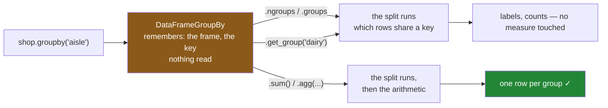

# 1.2 — The object that computed nothing

## One-line answer

`shop.groupby("aisle")` adds nothing up; it hands back a small object that remembers **which frame**
and **which key**, and the arithmetic waits until you say what to apply.

---

## The story

Back at the kitchen table with the shopping list and the three piles.

The person who made the piles gets as far as the last line — rice, dry shelf, third pile — and then
the doorbell goes, and they leave the room. Nothing has been added up. Nobody has written a single
total anywhere.

Somebody else walks in and finds the table like that. And here is the thing: the table is still
useful. They can see straight away that there are three piles. They can pick up the chilled pile and
see it has two slips in it, milk and eggs. They can ask "which pile is bread in" and get an answer by
looking.

None of that requires any adding up. The sorting has happened; the arithmetic has not. Those are two
different pieces of work, and the table is sitting in between them.

Then the first person comes back, and the second one says "I've moved a couple of things around, one
of the prices was wrong." The first person adds the piles up, and gets a different answer than they
would have got before the doorbell — because the piles were never a photograph of the list. They were
the list, arranged.

---

## The idea in plain language

When a piece of code does the work you asked for at the moment you ask, it is **eager**. When it
instead records what you asked for and waits until somebody actually needs the answer, it is **lazy**.

`groupby` is lazy. Calling it does not read your data, does not add anything up, and does not build
the piles. It builds a small object that remembers two things: the frame you called it on, and the key
you gave it. That object is a `DataFrameGroupBy` — or a `SeriesGroupBy` if you narrowed it down to one
column — and on its own it is not an answer to anything.

Two consequences follow, and they are the reason this part exists.

**Printing it shows you nothing useful.** There is no table to print, because no table has been made.
You get the object's default description — its type and where it happens to sit in memory. Everybody
meets this once, types the line expecting totals, and gets a line of gibberish back.

**It does not hold a copy of your data.** It holds a reference to the frame — a pointer to the same
frame, not a snapshot of it. Change the frame afterwards and the object sees the change, because there
is nothing else for it to see. This is the doorbell in the story: the piles were the list arranged, so
a change to the list is a change to the piles.

That second point deserves care, because it is the one place on this day where pandas 3's
Copy-on-Write rules do not save you. Copy-on-Write guarantees that every *result* behaves like a copy
([Day 26, 3.1](../../../day-26-frames-and-copy-on-write/parts/03-copy-on-write/3.1-every-result-behaves-like-a-copy.md)).
A `GroupBy` object is not a result. It is a **plan**, and a plan that has not run yet has nothing to
protect.

The object is not opaque, though. Three read-only views let you inspect the split without asking for
any arithmetic:

- **the number of groups** — how many distinct keys occurred;
- **the group map** — for each key, the row labels that fell into it;
- **one group by name** — the actual rows of a single pile, as an ordinary frame.

Asking for any of those does force the split to happen, because they are questions about the piles.
They still do no arithmetic on your measure column.

---

## Why Setu needs it

- **[1.3](1.3-what-iterating-gives-you.md)** walks the groups one at a time, which is the same
  inspection done exhaustively.
- **[2.1](../02-aggregating/2.1-one-number-for-each-group.md)** is the moment the plan finally runs.
  Everything before it is setup.
- **[5.2](../05-filter-and-apply/5.2-apply-the-escape-hatch.md)** hands each group to a function you
  wrote, which is only comprehensible once you know a group is a frame.
- **Day 30** treated missing values as a subject of their own. A `GroupBy` object that outlives a
  change to its frame is the same class of bug as a filled column read through a stale reference: the
  object you are holding is not what you think it is.
- **Day 143** builds a retrieval pipeline whose stages are lazy for exactly this reason — describe the
  work, run it once, at the end. `groupby` is the first lazy object in this curriculum, and the habit
  of asking "has this run yet?" starts here.

---

## The mechanism

Build the object and look at it:

```python
import pandas as pd

shop = pd.DataFrame(
    {
        "item": ["milk", "bread", "eggs", "rice"],
        "aisle": ["dairy", "bakery", "dairy", "dry"],
        "need": [2, 1, 6, 1],
        "price": [1.15, 1.40, 0.32, 2.05],
    }
)
shop["spend"] = shop["need"] * shop["price"]

g = shop.groupby("aisle")
print(g)
print("type      :", type(g).__name__)
print("ngroups   :", g.ngroups)
print("groups    :", dict(g.groups))
```

**Line by line:**

- `g = shop.groupby("aisle")` — **assign it to a name.** Doing that is the whole point of this part:
  the thing on the right of the equals sign is a value you can hold, not a step that happened.
- `print(g)` prints the object's default description, because `DataFrameGroupBy` has no table to show.
  This is not an error and not a warning; it is pandas telling you honestly that there is nothing yet.
- `type(g).__name__` — `DataFrameGroupBy`, because `shop` is a frame. Narrow to one column first and
  you get `SeriesGroupBy` instead; the two have almost the same methods and different return types.
- `g.ngroups` — how many piles. This is the cheapest useful question, and the first one worth asking
  about a key column you have not seen before. Three from four rows means one key repeated.
- `g.groups` — a mapping from each key to **the row labels in that group**, not to the rows
  themselves. Wrapping it in `dict()` is only to make it print on one line.

```text
<pandas.api.typing.DataFrameGroupBy object at 0x0000023EB26A97C0>
type      : DataFrameGroupBy
ngroups   : 3
groups    : {'bakery': RangeIndex(start=1, stop=2, step=1), 'dairy': RangeIndex(start=0, stop=4, step=2), 'dry': RangeIndex(start=3, stop=4, step=1)}
```

**Read the `dairy` entry again.** `RangeIndex(start=0, stop=4, step=2)` is the labels `0` and `2` —
milk and eggs, the first and third rows. pandas stored the two labels as a *range with a step of two*
rather than as a list, because that happens to be shorter. The group map is index objects, and index
objects compress themselves when they can
([Day 26, 1.2](../../../day-26-frames-and-copy-on-write/parts/01-the-two-objects/1.2-the-index-is-not-a-row-number.md)).

Pull one pile out as an ordinary frame, and read the labels as labels:

```python
print({key: labels.tolist() for key, labels in g.groups.items()})
print()
print(g.get_group("dairy"))
```

**Line by line:**

- `labels.tolist()` turns each index object into a plain Python list, which is what you actually wanted
  to see. Use this form whenever `g.groups` prints something that makes you squint.
- `g.get_group("dairy")` — **one group, as a frame.** Every column is there and the original row
  labels are kept, which is the concrete proof that a group is a set of rows rather than a number.
- The rows come back as `0` and `2`, not renumbered to `0` and `1`. Group membership never disturbs
  the index; that fact is what section 3 is built on.

```text
{'bakery': [1], 'dairy': [0, 2], 'dry': [3]}

   item  aisle  need  price  spend
0  milk  dairy     2   1.15   2.30
2  eggs  dairy     6   0.32   1.92
```

Now the part that shows laziness is real rather than a story. Half a million rows, and three
measurements:

```python
import time

import numpy as np
import pandas as pd

rng = np.random.default_rng(31)
n = 500_000
big = pd.DataFrame(
    {
        "aisle": pd.Series(rng.choice(["bakery", "dairy", "dry", "frozen"], n), dtype="str"),
        "spend": np.round(rng.uniform(0.2, 9.0, n), 2),
    }
)


def best(fn, reps):
    times = []
    for _ in range(reps):
        start = time.perf_counter()
        fn()
        times.append(time.perf_counter() - start)
    return min(times) * 1_000_000


print(f"building the object   {best(lambda: big.groupby('aisle'), 50):10.1f} us")
print(f"building + .ngroups   {best(lambda: big.groupby('aisle').ngroups, 5):10.1f} us")
print(f"building + .sum()     {best(lambda: big.groupby('aisle')['spend'].sum(), 5):10.1f} us")
```

**Line by line:**

- `np.random.default_rng(31)` — the day number as the seed, so this frame is the same on your machine
  as on the one these numbers came from (Principle 4).
- `dtype="str"` on the key column, because pandas 3 infers a PyArrow-backed `str` for text and stating
  it means the frame does not depend on inference
  ([Day 26, 2.2](../../../day-26-frames-and-copy-on-write/parts/02-the-str-dtype/2.2-str-the-dtype-pandas-3-infers.md)).
- `best` takes the **minimum** of several runs rather than the mean, for the reason
  [Day 29, 3.1](../../../day-29-iteration-and-order/parts/03-the-measurement/3.1-what-a-million-rows-is-for.md)
  gives: the minimum is the run least disturbed by everything else on the machine.
- `1_000_000` because the first of these three is far too fast for milliseconds to show anything.
- The first `lambda` builds the object and throws it away — that is the whole measurement.
- `50` repetitions for the first and `5` for the other two, because a measurement that finishes
  instantly needs more runs before its minimum means anything.

```text
building the object         68.8 us
building + .ngroups      20434.6 us
building + .sum()        24085.6 us
```

**The first number does not depend on the frame at all.** Half a million rows and it costs the same as
four would, because nothing was read. The jump between the first line and the second is where the
split actually happens — that is the cost of finding which rows share a key. The jump from the second
to the third is the arithmetic, and it is the smaller of the two.

Where the work happens:



**The orange box is the only thing `groupby` itself produces.** Everything else on the diagram is
triggered by the next call, not by that one.

---

## When it breaks

**The line that looks like it did nothing:**

```text
$ uv run python -c "
import pandas as pd
shop = pd.DataFrame({'aisle': ['dairy', 'bakery', 'dairy'], 'spend': [2.30, 1.40, 1.92]})
print(shop.groupby('aisle'))
"
```

```text
<pandas.api.typing.DataFrameGroupBy object at 0x000001F552BC2AB0>
```

**What it means.** Nothing is wrong. You asked for the plan and pandas printed the plan. The hex
number is the object's address in memory and it changes every run, which is why it looks alarming.

The smallest fix is to say what to apply: `.sum()`, `.size()`, `.mean()`. If you genuinely wanted to
look inside, `.ngroups` and `.groups` are the two questions worth asking.

**Asking for a pile that was never made:**

```text
$ uv run python -c "
import pandas as pd
shop = pd.DataFrame({'aisle': ['dairy', 'bakery', 'dairy'], 'spend': [2.30, 1.40, 1.92]})
print(shop.groupby('aisle').get_group('frozen'))
"
```

```text
KeyError: 'frozen'
```

**What it means.** `get_group` takes a key that occurred, and `frozen` did not. It is the same lesson
as [1.1](1.1-four-lines-three-aisles.md)'s missing row, met one step earlier.

The smallest fix is to check first: `"frozen" in g.groups`. The better habit is to stop reaching into
groups by name at all — if you find yourself calling `get_group` in a loop, you wanted an aggregation.

**The one that is genuinely dangerous — the object that went stale:**

```text
$ uv run python -c "
import pandas as pd
shop = pd.DataFrame(
    {'item': ['milk', 'bread', 'eggs', 'rice'],
     'aisle': ['dairy', 'bakery', 'dairy', 'dry'],
     'spend': [2.30, 1.40, 1.92, 2.05]}
)
g = shop.groupby('aisle')
print('before the change:', g['spend'].sum().to_dict())
shop.loc[0, 'spend'] = 99.0
print('after  the change:', g['spend'].sum().to_dict())
"
```

```text
before the change: {'bakery': 1.4, 'dairy': 4.22, 'dry': 2.05}
after  the change: {'bakery': 1.4, 'dairy': 100.92, 'dry': 2.05}
```

**What it means.** The same object, asked the same question twice, gave two different answers — and
neither call raised, warned, or hinted that anything had moved.

`g` never held your data. It held the frame, and `shop.loc[0, "spend"] = 99.0` changed the frame. This
is not a Copy-on-Write failure: Copy-on-Write is a promise about *results*
([Day 26, 3.1](../../../day-26-frames-and-copy-on-write/parts/03-copy-on-write/3.1-every-result-behaves-like-a-copy.md)),
and `g` is not a result. It is an unrun plan pointing at a live frame.

**The smallest fix is not to keep the object.** Write `shop.groupby("aisle")["spend"].sum()` as one
expression, so the plan is built and consumed in the same breath and there is no window in which the
frame can move underneath it. Hold a `GroupBy` in a variable only when you are about to ask it several
questions in a row and nothing writes to the frame in between — and when you do, put the two lines
next to each other so a future reader can see that they are next to each other.

---

## In production

**What a professional writes instead of the teaching version.** Short-lived, and never stored:

```python
import pandas as pd


def aisle_report(shop: pd.DataFrame) -> pd.DataFrame:
    """Total and line count per aisle. The GroupBy is built and consumed in one statement."""
    return shop.groupby("aisle").agg(total=("spend", "sum"), lines=("spend", "size"))


def aisle_report_twice(shop: pd.DataFrame) -> tuple[pd.DataFrame, pd.Series]:
    """Two questions, one split — safe because nothing writes to `shop` between them."""
    grouped = shop.groupby("aisle")
    return (
        grouped.agg(total=("spend", "sum"), lines=("spend", "size")),
        grouped["price"].max(),
    )
```

**Line by line:**

- The first function never names the `GroupBy`. There is no variable that can go stale, and there is
  no line at which a reader has to check whether the frame moved.
- The second names it deliberately, because two aggregations off one object do the split **once**
  instead of twice — the 20 ms in the measurement above, paid one time rather than two.
- The two uses are **adjacent**, with nothing between them. That adjacency is the invariant a reviewer
  actually checks; a `GroupBy` and its use separated by thirty lines is a bug waiting for someone to
  insert an assignment between them.
- The docstring on the second says *why* the object is being held. Without that sentence, the next
  person to touch the file will "tidy" it into two independent one-liners and silently double the
  cost, or leave it and insert a write into the middle.

**What changes at scale.** The measurement above says building the object costs about 69 microseconds
regardless of size, and the split costs about 20 milliseconds on half a million rows. So the arithmetic
that people think of as "the group-by" is the cheap part, and **the expensive part is finding out which
rows share a key**.

That has one direct consequence: if you need four different aggregations of the same grouping, build
the object once and ask it four things, or ask for all four in a single `agg` call
([2.4](../02-aggregating/2.4-named-aggregation.md)). Four separate `shop.groupby(...)` expressions do
the expensive half four times.

It has a second, less obvious one. The split cost depends on how many distinct keys there are, not
only on how many rows. A key column with two values and one with two hundred thousand behave very
differently on the same frame, which is what [4.2](../04-the-keys/4.2-sort-and-the-order-of-the-groups.md)
and [5.3](../05-filter-and-apply/5.3-what-apply-costs-measured.md) both end up measuring.

**The failure that only appears with real data.** A nightly job built a `GroupBy` at the top of a
function, then — forty lines further down, inside a branch that only ran when a certain file was
present — filled some blanks in the frame it had been built from. On most nights the branch did not
run and the totals were right. On the nights it did, the totals silently included the filled values,
and the report disagreed with the previous night's by a few per cent. It was diagnosed only when
somebody noticed the discrepancy always coincided with that file arriving. **The fix was to move the
`groupby` call to the line that used it.**

**The review comment a senior engineer leaves.** *"`g = df.groupby(key)` at the top of the function and
first used sixty lines later, with a `fillna` in between. `GroupBy` holds a reference, not a snapshot,
so this reads the filled frame. Either move the call down to its use or take the aggregate up front."*

**The interview question.** *"What does `df.groupby('x')` return?"* A `DataFrameGroupBy`, and the answer
that shows experience is what it does *not* do: no arithmetic, no copy of the data, no groups
materialised. It is a lazy object holding a reference to the frame and the key. Then the consequence:
because it is a reference, an aggregation computed from a `GroupBy` reflects the frame **as it is when
the aggregation runs**, not as it was when the object was made — so a write to the frame in between
changes the answer with nothing raised. And the practical follow-up: hold the object only to ask
several questions off one split, since the split is the expensive half.

---

## Check yourself

```bash
uv run python -c "
import pandas as pd
shop = pd.DataFrame(
    {'item': ['milk', 'bread', 'eggs', 'rice'],
     'aisle': ['dairy', 'bakery', 'dairy', 'dry'],
     'spend': [2.30, 1.40, 1.92, 2.05]}
)
g = shop.groupby('aisle')
print('the object :', g)
print('ngroups    :', g.ngroups)
print('groups     :', {k: v.tolist() for k, v in g.groups.items()})
print('one pile   :')
print(g.get_group('dairy'))
print('first sum  :', g['spend'].sum().to_dict())
shop.loc[2, 'spend'] = 0.0
print('second sum :', g['spend'].sum().to_dict())
"
```

Two identical calls to `g['spend'].sum()`, one line apart, printing different numbers. Say which line
between them is responsible, and say what `g` would have had to store for the two to agree.

**Answer out loud, without scrolling up:**

> `shop.groupby("aisle")` has just run. Say what has been read, what has been computed, and what the
> returned object is holding. Then say why holding that object in a variable for a long time is a
> risk, and what the one-line fix is.

---

**Next:** [1.3 — What iterating gives you](1.3-what-iterating-gives-you.md).
