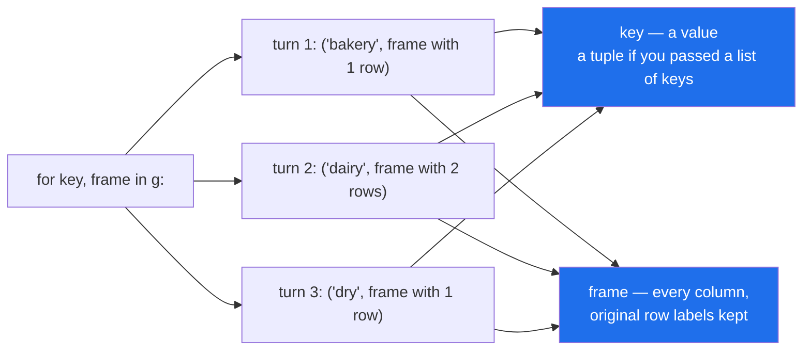

# 1.3 — What iterating gives you

## One-line answer

Looping over a `GroupBy` hands you **two things each turn** — the key and the group's rows as a frame
— which makes it the clearest way to *look* at a split and one of the slowest ways to *compute*
anything from one.

---

## The story

The piles are still on the kitchen table, and now somebody wants to check them.

The person who made them picks each pile up and passes it across, one at a time, saying its name as
they hand it over. "Chilled" — and here are two slips, milk and eggs. "Bread" — and here is one slip.
"Dry" — one slip.

Notice what arrives each time. Not just the slips. A **name and** the slips. If you only listen to the
words you know which shelves were involved and nothing about what was bought; if you only look at the
slips you have three little bundles and no idea which is which.

The person checking wants both, because the point of the exercise is to notice something odd — like a
slip that ended up on the wrong pile. That is a job for eyes, and eyes need the piles handed over one
at a time.

What they are not doing is adding up. If the question had been "what did each shelf come to", nobody
would go through this hand-over ceremony; they would put each pile on the scales, so to speak, and
write down three numbers. The hand-over is for looking, not for totting up.

---

## The idea in plain language

A `GroupBy` object can be looped over, and each turn of the loop produces a **pair**: the key of that
group, and the group's rows as an ordinary frame.

In Python a pair like that is a **tuple** — an ordered, fixed-length bundle of values
([Day 8, 1.3](../../../day-08-containers/parts/01-sequences/1.3-a-tuple-is-a-record.md)). The loop
does not hand you a frame with a name attached; it hands you a two-item bundle whose first item is the
name and whose second item is the frame. If you write the loop as though one thing arrives, you get
the bundle where you expected the frame, and everything you try to do to it fails in a confusing way.

Three details about the two halves are worth stating before you write a loop:

**The key is a value, not a frame.** For a single grouping column it is whatever was in that column —
a string here. It is not wrapped, not indexed, and not a Series.

**The frame is a real frame, with every column and the original row labels.** The rows are exactly the
rows of your original frame that carried that key, and their labels are unchanged. The key column is
still there too.

**Group by two columns and the key becomes a tuple of two values** — and, awkwardly, grouping by *one*
column written inside a list also gives you a one-item tuple rather than a bare value. That asymmetry
between `groupby("aisle")` and `groupby(["aisle"])` catches everybody once.

The honest summary of when to write this loop is short. Write it to **look**: to print each group
while you are working out why a total is wrong, to write one file per group, to check that the split
did what you expected. Do not write it to **compute**: everything you could add up inside the loop,
pandas can add up in compiled code without building a frame per group, and the gap grows with the
number of groups rather than with the number of rows.

That is the same argument Day 29 made about walking a frame row by row
([Day 29, 1.1](../../../day-29-iteration-and-order/parts/01-the-loop/1.1-reading-the-list-one-line-at-a-time.md)),
one level up: there, the expensive thing was building a row object per row; here, it is building a
frame object per group.

---

## Why Setu needs it

- **[1.2](1.2-the-object-that-computed-nothing.md)** showed the group map — labels only. This shows
  the rows, which is what you actually need when a total looks wrong.
- **[5.2](../05-filter-and-apply/5.2-apply-the-escape-hatch.md)** hands each group to a function you
  wrote. It is this loop with pandas driving it, and it is far easier to reason about once you have
  written the loop by hand.
- **[5.3](../05-filter-and-apply/5.3-what-apply-costs-measured.md)** measures what per-group Python
  costs, and explains why the answer depends on the group count.
- **Day 35** closes the phase with an `audit()` that reports per-source row counts. Writing it as a
  loop is the first draft everybody produces; knowing why it is the wrong final draft is the point.
- **Day 112** writes one evaluation record per prompt variant, and that genuinely is one file per
  group — the case where this loop is the right tool rather than a beginner's mistake.

---

## The mechanism

The loop, written correctly:

```python
import pandas as pd

shop = pd.DataFrame(
    {
        "item": ["milk", "bread", "eggs", "rice"],
        "aisle": ["dairy", "bakery", "dairy", "dry"],
        "need": [2, 1, 6, 1],
        "price": [1.15, 1.40, 0.32, 2.05],
    }
)
shop["spend"] = shop["need"] * shop["price"]

for key, frame in shop.groupby("aisle"):
    print(repr(key), type(frame).__name__, frame.shape)
    print(frame)
    print()
```

**Line by line:**

- `for key, frame in ...` — **two names on the left of `in`.** Python unpacks the two-item tuple into
  them. One name there and you get the tuple itself, which is the failure at the top of *When it
  breaks*.
- `repr(key)` rather than `key`, so the quotes show. Printing a bare string hides whether you have
  `dairy` or `'dairy'` or `('dairy',)`, and that distinction is exactly what this loop is for.
- `type(frame).__name__` — proof that the second item is a `DataFrame` and not a row, a Series or a
  list of values.
- `frame.shape` — the group's row count and the **full** column count. Five columns, not four: the key
  column is still in there.
- The groups arrive in sorted key order, because sorting the keys is what `groupby` does by default
  ([4.2](../04-the-keys/4.2-sort-and-the-order-of-the-groups.md)) — `bakery` before `dairy` before
  `dry`, not the order the items were written down.

```text
'bakery' DataFrame (1, 5)
    item   aisle  need  price  spend
1  bread  bakery     1    1.4    1.4

'dairy' DataFrame (2, 5)
   item  aisle  need  price  spend
0  milk  dairy     2   1.15   2.30
2  eggs  dairy     6   0.32   1.92

'dry' DataFrame (1, 5)
   item aisle  need  price  spend
3  rice   dry     1   2.05   2.05
```

**Look at the row labels: 1, then 0 and 2, then 3.** Every original label is present exactly once
across the three groups, and none was renumbered. That is the property section 3 turns into a feature.

Now the two shapes the key can take:

```python
weeks = pd.DataFrame(
    {
        "week": [1, 1, 1, 1, 2, 2, 2],
        "item": ["milk", "bread", "eggs", "rice", "milk", "bread", "eggs"],
        "aisle": ["dairy", "bakery", "dairy", "dry", "dairy", "bakery", "dairy"],
        "spend": [2.30, 1.40, 1.92, 2.05, 3.45, 2.80, 1.92],
    }
)
for key, frame in weeks.groupby(["week", "aisle"]):
    print(repr(key), "->", frame["spend"].tolist())
print()
for key, frame in shop.groupby(["aisle"]):
    print(repr(key), "->", len(frame))
```

**Line by line:**

- `weeks` is the shopping list over two weeks — the same four items, bought again, with rice skipped
  the second week. It is the smallest frame that makes a second key mean anything, and
  [4.4](../04-the-keys/4.4-two-keys-and-the-multiindex.md) uses it again.
- `groupby(["week", "aisle"])` — two key columns, so a group is one **combination** of week and aisle,
  and the key handed to the loop is a two-item tuple in the order you listed the columns.
- The second loop groups by one column **written inside a list**, and the key comes back as
  `('bakery',)` — a one-item tuple. `groupby("aisle")` and `groupby(["aisle"])` split the rows
  identically and hand you differently shaped keys.
- That asymmetry matters the moment your key comes from a variable: `keys = ["aisle"]` then
  `groupby(keys)` behaves like the second form, and a `key == "dairy"` comparison inside the loop is
  quietly always `False`.

```text
(1, 'bakery') -> [1.4]
(1, 'dairy') -> [2.3, 1.92]
(1, 'dry') -> [2.05]
(2, 'bakery') -> [2.8]
(2, 'dairy') -> [3.45, 1.92]

('bakery',) -> 1
('dairy',) -> 2
('dry',) -> 1
```

**Five combinations, not six.** Week 2 has no `dry` row because no rice was bought, and a group-by
produces the combinations that occurred rather than the full grid
([4.4](../04-the-keys/4.4-two-keys-and-the-multiindex.md)).

What each turn of the loop hands over:



**Both blue boxes arrive on every turn.** A loop written for one of them gets a tuple it did not
expect.

---

## When it breaks

**One name where two were needed:**

```text
$ uv run python -c "
import pandas as pd
shop = pd.DataFrame({'aisle': ['dairy', 'bakery', 'dairy'], 'spend': [2.30, 1.40, 1.92]})
for frame in shop.groupby('aisle'):
    print(frame.shape)
"
```

```text
AttributeError: 'tuple' object has no attribute 'shape'
```

**What it means.** `frame` is the whole pair, not the second half of it. The message is unusually
helpful, because it names the type you actually have.

The smallest fix is two names: `for key, frame in ...`. If you genuinely do not want the key, the
convention is `for _, frame in ...` — the underscore says "there is a second thing and I am ignoring
it", which is more honest than pretending there is only one.

**The comparison that is always false:**

```text
$ uv run python -c "
import pandas as pd
shop = pd.DataFrame({'aisle': ['dairy', 'bakery', 'dairy'], 'spend': [2.30, 1.40, 1.92]})
keys = ['aisle']
for key, frame in shop.groupby(keys):
    print(repr(key), 'is dairy?', key == 'dairy')
"
```

```text
('bakery',) is dairy? False
('dairy',) is dairy? False
```

**What it means.** Nothing raised. The second line should have said `True` and did not, because
`('dairy',)` is a one-item tuple and `'dairy'` is a string, and those are never equal.

This is worse than the `AttributeError`, because the loop runs to completion and produces a wrong
answer quietly. It shows up whenever the key list is built somewhere else — a config value, a function
argument, a constant at the top of the module.

The smallest fix is to compare against the same shape: `key == ("dairy",)`. The better fix is to stop
special-casing a key inside a loop at all; wanting one group by name is what `get_group` is for
([1.2](1.2-the-object-that-computed-nothing.md)), and wanting a subset of groups is what
[5.1](../05-filter-and-apply/5.1-filter-keeping-whole-groups.md) is for.

**The write that vanished:**

```text
$ uv run python -c "
import pandas as pd
shop = pd.DataFrame(
    {'item': ['milk', 'bread', 'eggs', 'rice'],
     'aisle': ['dairy', 'bakery', 'dairy', 'dry'],
     'spend': [2.30, 1.40, 1.92, 2.05]}
)
for key, frame in shop.groupby('aisle'):
    frame['spend'] = 0.0
print(shop)
"
```

```text
    item   aisle  spend
0   milk   dairy   2.30
1  bread  bakery   1.40
2   eggs   dairy   1.92
3   rice     dry   2.05
```

**What it means.** Four assignments ran. No exception, no warning, and the frame is untouched.

The frame the loop hands you behaves like a copy, because under Copy-on-Write every result does
([Day 26, 3.1](../../../day-26-frames-and-copy-on-write/parts/03-copy-on-write/3.1-every-result-behaves-like-a-copy.md)).
Writing to it changes an object that is thrown away at the end of the turn. This is the same trap
[Day 29, 1.4](../../../day-29-iteration-and-order/parts/01-the-loop/1.4-the-loop-that-changed-nothing.md)
described for `iterrows`, and it is just as silent.

**The smallest fix is to stop trying to write back through the loop.** A value computed per group and
written to every row of that group is what `transform` is for
([3.1](../03-transform/3.1-a-number-for-every-row.md)), and it is one line.

---

## In production

**What a professional writes instead of the teaching version.** The loop survives only where the
per-group work is genuinely not arithmetic — writing a file, sending a report, rendering a chart:

```python
from pathlib import Path

import pandas as pd


def write_one_file_per_aisle(shop: pd.DataFrame, out_dir: Path) -> list[Path]:
    """One CSV per aisle. The loop is here because the work is a side effect, not a number."""
    out_dir.mkdir(parents=True, exist_ok=True)
    written: list[Path] = []
    for aisle, frame in shop.groupby("aisle", sort=True):
        path = out_dir / f"{aisle}.csv"
        frame.to_csv(path, index=False)
        written.append(path)
    return written
```

**Line by line:**

- The loop is justified by `to_csv`, which is a side effect. There is no expression that writes one
  file per group, so no vectorised form exists to prefer.
- `sort=True` stated rather than inherited, so the files are written in a fixed order and two runs
  produce the same log ([Day 29, 4.2](../../../day-29-iteration-and-order/parts/04-sorting/4.2-the-tie-that-broke-the-report.md)).
- `f"{aisle}.csv"` — safe here because the aisle names are known. On user-entered keys this is a path
  built from untrusted text, and a key containing a slash writes somewhere you did not intend.
- `index=False`, because the row labels here are positions from the original frame and mean nothing to
  a reader of the file ([Day 27, 1.7](../../../day-27-reading-and-writing/parts/01-the-csv/1.7-to-csv-and-what-it-throws-away.md)).
- The function returns the paths it wrote, so a caller can assert on them. A function whose only effect
  is on disk and which returns `None` is untestable.

**What changes at scale.** The loop's cost is per group, and that is the number to watch:

```text
     6 groups   loop      31.2 ms   one expression    13.4 ms       2x
  6000 groups   loop     375.0 ms   one expression    18.4 ms      20x
```

Half a million rows in both lines, and only the number of distinct keys changed. The expression barely
moved — 13 ms to 18 ms — while the loop went up twelvefold. Every turn of the loop builds a frame
object, and a frame is an expensive thing to build a few thousand times.

**So a loop benchmarked on a key with six values tells you nothing about the same loop on a key with
six thousand.** That is the group-count version of
[Day 29, 3.1](../../../day-29-iteration-and-order/parts/03-the-measurement/3.1-what-a-million-rows-is-for.md)'s
warning about measuring on fixture-sized data, and it is the specific mistake that makes per-customer
and per-session loops feel fine in development.

**The failure that only appears with real data.** A reporting job looped over groups and wrote one
sheet per region. It had run for two years over about forty regions. Then a data source started
sending the region field with a store code appended, the group count went from forty to eleven
thousand, and the job that had always finished before breakfast was still going at lunchtime — and
had written eleven thousand files into a directory that other things had to list. **Nothing about the
loop was wrong. The number of groups changed, and the loop's cost was proportional to it.** The
lasting fix was an assertion on `ngroups` before the loop, so an upstream change fails loudly rather
than slowly.

**The review comment a senior engineer leaves.** *"This loops over groups to build a dict of totals and
then turns the dict back into a Series. That is `df.groupby(key)[measure].sum()`, and it is one line
that stays fast when the key column gets more values. Keep a group loop only where the body has a side
effect."*

**The interview question.** *"What does iterating a `GroupBy` yield?"* A `(key, frame)` tuple per group
— and the follow-up worth volunteering is that the key is a tuple when you passed a list of columns,
including a list of one, which is a real source of silent bugs when the key list comes from a variable.
Then the judgement they are actually testing: iterate to **inspect** or to perform a **side effect**,
never to aggregate, because the loop builds a frame per group and its cost scales with the number of
groups rather than the number of rows.

---

## Check yourself

```bash
uv run python -c "
import pandas as pd
shop = pd.DataFrame(
    {'item': ['milk', 'bread', 'eggs', 'rice'],
     'aisle': ['dairy', 'bakery', 'dairy', 'dry'],
     'spend': [2.30, 1.40, 1.92, 2.05]}
)
for key, frame in shop.groupby('aisle'):
    print(repr(key), frame.index.tolist(), frame.columns.tolist())
print()
for key, frame in shop.groupby(['aisle']):
    print(repr(key), 'equals the string?', key == 'dairy')
print()
print('len(g) :', len(shop.groupby('aisle')))
"
```

The first loop prints the labels of each group; check that every label from the original frame appears
exactly once across the three lines. The second loop prints `False` three times — say why, and say what
one character in the `groupby` call would change it.

**Answer out loud, without scrolling up:**

> Name the two things a turn of this loop hands you, and say what type each one is. Then give one
> reason to write the loop and one reason not to, and say which quantity the "not to" reason scales
> with.

---

**Next:** [2.1 — One number for each group](../02-aggregating/2.1-one-number-for-each-group.md).
