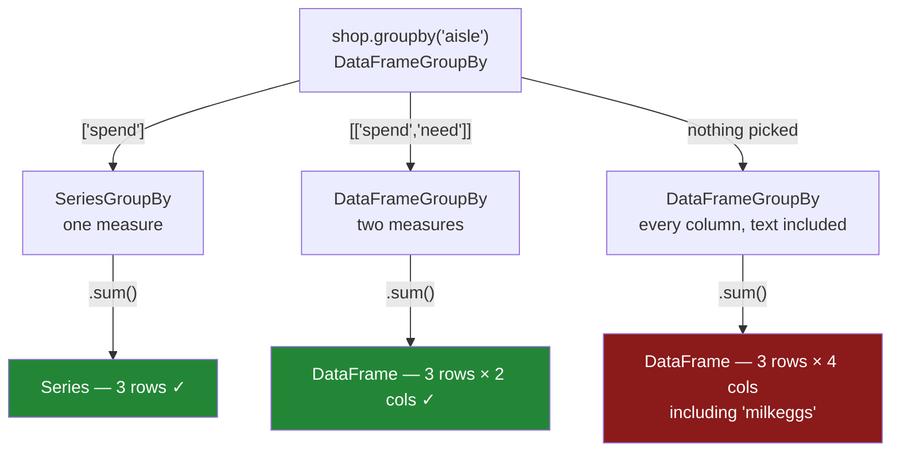

# 2.1 — One number for each group

## One-line answer

An **aggregation** turns each group into a single value — `sum`, `mean`, `max`, `min` — so the result
has exactly one row per group; pick the column you mean **before** you aggregate, or pandas will
aggregate every column, including the ones made of words.

---

## The story

Three piles on the kitchen table, and now somebody finally wants the numbers.

They put the chilled pile down and add its two slips up: two thirty and one ninety-two, four
twenty-two. Bread pile: one forty. Dry pile: two oh five. Three piles went on the table and three
numbers came off it, and the slips are not needed any more.

Then somebody else, being helpful, says "add up everything on the slips, not just the money".

And that is where it goes wrong in a way nobody expects. The money adds up fine. The counts add up
fine. But each slip also has the *name* of the thing written on it — milk, eggs — and if you insist on
adding those up too, you do not get an error and you do not get a blank. You get "milkeggs". It is not
a mistake anybody would make with a pen. It is exactly the mistake the computer makes, because gluing
two words together is what a plus sign means when both sides are words.

So the useful habit turns out to be a small one: say which column you want added up, before you ask
for the adding up.

---

## The idea in plain language

An **aggregation** is a calculation that takes many values and returns one. Adding them up, averaging
them, taking the largest — all aggregations. Taking their absolute values is not, because that gives
back as many values as it received.

Run an aggregation on a `GroupBy` and it runs once per group, independently, and the answers are
stacked into one result. Because each group yields exactly one value, **the result has one row per
group**, which is almost always far fewer rows than you started with. Four rows in, three rows out.

The names are the same ones a Series has: `sum`, `mean`, `min`, `max`, `median`, `std`, `first`,
`last`, `nunique`. You already know them; the only new thing is that they now run per pile.

Two things about the result are worth noticing on the first day, because both surprise people later.

**The keys become the labels.** The result is indexed by the group keys, and the index carries the
name of the key column. So `bakery`, `dairy` and `dry` stop being data and become labels
([Day 26, 1.2](../../../day-26-frames-and-copy-on-write/parts/01-the-two-objects/1.2-the-index-is-not-a-row-number.md)).
[4.1](../04-the-keys/4.1-the-key-became-the-index.md) is about what that does to the code downstream.

**What you get back depends on what you aggregated.** Narrow the group-by to one column first, with
`g["spend"]`, and the aggregation gives a **Series** — one number per group. Leave the whole frame in
and it gives a **DataFrame** — one number per group *per column*. Both are useful; confusing them is
how a function ends up returning something its caller cannot use.

And that second point is where the "milkeggs" problem lives. If you aggregate the whole frame, `sum`
is applied to every column, including the text ones — and `+` on two pieces of text joins them. pandas
does not consider this an error, because it is not one: it is what `+` means. The other aggregations
are less forgiving. `mean` on a text column raises, because there is no reading of "the average of
milk and eggs" that anybody could defend.

The keyword `numeric_only=True` exists to skip the text columns, and it is a worse fix than it looks.
It solves the symptom by silently dropping columns, so a column that should have been aggregated and
was accidentally stored as text disappears from the report instead of failing. **Naming the column you
want is the fix**; `numeric_only` is what you reach for when you genuinely want "every number in this
frame, whatever it is called".

---

## Why Setu needs it

- **[2.2](2.2-size-counts-rows-count-counts-values.md)** is the two aggregations that count, and the
  difference between them is an entire class of bug.
- **[2.4](2.4-named-aggregation.md)** is the form you should actually write in a module, and it is
  built out of exactly these function names.
- **[3.1](../03-transform/3.1-a-number-for-every-row.md)** is the same calculation with the opposite
  output shape, which is easiest to understand once this one is solid.
- **Day 29** left a `TODO(me)` asking for `spend_by_aisle` without a loop over aisles, and noted the
  idiomatic answer was a day away
  ([Day 29, 6.1](../../../day-29-iteration-and-order/parts/06-the-module/6.1-the-order-module.md)).
  This line is it.
- **Day 63** computes a per-class metric for a classifier — precision per label — which is an
  aggregation over groups of predictions, and gets its shape from exactly this rule.

---

## The mechanism

The four ways to reduce one pile to one number:

```python
import pandas as pd

shop = pd.DataFrame(
    {
        "item": ["milk", "bread", "eggs", "rice"],
        "aisle": ["dairy", "bakery", "dairy", "dry"],
        "need": [2, 1, 6, 1],
        "price": [1.15, 1.40, 0.32, 2.05],
    }
)
shop["spend"] = shop["need"] * shop["price"]

g = shop.groupby("aisle")
print(g["spend"].sum())
print()
print(g["spend"].mean())
print()
print(g["spend"].max())
```

**Line by line:**

- `g["spend"]` narrows the `DataFrameGroupBy` to a `SeriesGroupBy` — the same split, one column of
  measure. This is the habit the whole part is arguing for, and it costs four characters.
- `.sum()` — the total per aisle. `dairy` is `2.30 + 1.92 = 4.22`, which you can check against the
  printed frame.
- `.mean()` — `dairy` becomes `2.11`, the average of the two lines. **This is the average per line,
  not per item bought**; six eggs count as one line. Which of those two an aggregation gives you is
  decided by what a row means, and misreading it is how per-unit and per-order figures get mixed up.
- `.max()` — `dairy` becomes `2.30`, the larger of the two lines. `max` returns the value, not the row
  that carried it; for the row you want `idxmax` and then a `loc`
  ([Day 28, 1.2](../../../day-28-selection-and-alignment/parts/01-label-and-position/1.2-loc-by-label.md)).
- All three results are Series with three entries, indexed by aisle, and named `spend`. The name
  survives the aggregation, which is what makes them fit straight back into a frame later.

```text
aisle
bakery    1.40
dairy     4.22
dry       2.05
Name: spend, dtype: float64

aisle
bakery    1.40
dairy     2.11
dry       2.05
Name: spend, dtype: float64

aisle
bakery    1.40
dairy     2.30
dry       2.05
Name: spend, dtype: float64
```

The shapes, spelled out, because this is the thing to get right first:

```python
print("g['spend']         ->", type(g["spend"]).__name__)
print("g['spend'].sum()   ->", type(g["spend"].sum()).__name__)
print("index name         ->", g["spend"].sum().index.name)
print("series name        ->", g["spend"].sum().name)
print()
print(g[["spend", "need"]].sum())
```

**Line by line:**

- `g["spend"]` is a `SeriesGroupBy`; `g[["spend", "need"]]` — note the **double brackets** — is still a
  `DataFrameGroupBy`, narrowed to two columns. Single brackets mean one column and give a Series;
  double brackets mean a list of columns and give a frame, exactly as on an ordinary frame
  ([Day 26, 1.3](../../../day-26-frames-and-copy-on-write/parts/01-the-two-objects/1.3-a-table-of-columns.md)).
- `.index.name` is `aisle` — pandas carried the key column's name onto the index. That is what makes
  `reset_index()` able to put the column back with the right name
  ([4.1](../04-the-keys/4.1-the-key-became-the-index.md)).
- `.name` is `spend`, so the Series remembers which measure it is. A Series with no name is a Series
  that will need one before it can be joined onto anything.
- The two-column version aggregates both columns with the same function, and gives one row per group
  and one column per measure. Different functions per column is [2.3](2.3-agg-several-answers-at-once.md).

```text
g['spend']         -> SeriesGroupBy
g['spend'].sum()   -> Series
index name         -> aisle
series name        -> spend

        spend  need
aisle
bakery   1.40     1
dairy    4.22     8
dry      2.05     1
```

Now the mistake from the story, run for real — aggregating the whole frame:

```python
print(shop.groupby("aisle").sum())
```

**Line by line:**

- No column was picked, so `sum` is applied to **every** column that is not the key.
- `need` and `price` and `spend` add up as you would expect. Note that the `price` column adding up to
  `1.47` for dairy is arithmetic nobody wanted — the sum of two unit prices is not a meaningful
  number, and it is printed with the same confidence as the ones that are.
- `item` is text, and `+` on text joins it, so the two dairy items become **`milkeggs`**. No error, no
  warning, no `NaN`. A single string that looks almost like a word.
- This is the line a beginner writes, and the reason it is worth running once is that the output is so
  nearly plausible that in a wide frame you would scroll straight past it.

```text
            item  need  price  spend
aisle
bakery     bread     1   1.40   1.40
dairy   milkeggs     8   1.47   4.22
dry         rice     1   2.05   2.05
```

Where the two shapes come from:



**The red box is the default.** Picking the column is not an optimisation; it is how you avoid it.

---

## When it breaks

**The average of two words:**

```text
$ uv run python -c "
import pandas as pd
shop = pd.DataFrame(
    {'item': ['milk', 'bread', 'eggs', 'rice'],
     'aisle': ['dairy', 'bakery', 'dairy', 'dry'],
     'spend': [2.30, 1.40, 1.92, 2.05]}
)
print(shop.groupby('aisle').mean())
"
```

```text
TypeError: dtype 'str' does not support operation 'mean'
```

**What it means.** `mean` was asked to average the `item` column and refused, because there is no
answer. The message names the dtype rather than the column, which is mildly annoying and is why the
first thing to do is print `shop.dtypes`.

**This raising is the good case.** Compare it with `sum` on the same frame, which produced `milkeggs`
and no complaint. Whether an aggregation protects you depends entirely on whether the operation
happens to be defined for text, which is not a rule you can remember — so do not rely on it.

The smallest fix is `shop.groupby("aisle")["spend"].mean()`. The lazy fix is
`shop.groupby("aisle").mean(numeric_only=True)`, and the next failure shows why it is lazy.

**`numeric_only` hiding a real problem:**

```text
$ uv run python -c "
import pandas as pd
shop = pd.DataFrame(
    {'item': ['milk', 'bread', 'eggs', 'rice'],
     'aisle': ['dairy', 'bakery', 'dairy', 'dry'],
     'spend': ['2.30', '1.40', '1.92', '2.05']}
)
print(shop.dtypes.to_dict())
print(shop.groupby('aisle').mean(numeric_only=True))
"
```

```text
{'item': <StringDtype(na_value=nan)>, 'aisle': <StringDtype(na_value=nan)>, 'spend': <StringDtype(na_value=nan)>}
Empty DataFrame
Columns: []
Index: [bakery, dairy, dry]
```

**What it means.** The spend column arrived as text — from a CSV whose column had a stray space, or a
JSON field quoted by the sender ([Day 27, 1.3](../../../day-27-reading-and-writing/parts/01-the-csv/1.3-when-the-guess-is-wrong.md)).
`numeric_only=True` did exactly what it promised: it skipped every non-numeric column, and every
column was non-numeric.

**The result is an empty frame with the right index, and it did not raise.** A report built on this
prints three aisle names and no figures, which reads like "no spending" rather than "no numeric
columns". Without `numeric_only` it would have raised the `TypeError` above and named the problem
immediately.

The smallest fix is to fix the dtype at read time (`dtype={"spend": "float64"}`) rather than to
tolerate it here.

**The column that was never there:**

```text
$ uv run python -c "
import pandas as pd
shop = pd.DataFrame({'aisle': ['dairy', 'bakery'], 'spend': [2.30, 1.40]})
print(shop.groupby('aisle')['total'].sum())
"
```

```text
KeyError: 'Column not found: total'
```

**What it means.** The column selection is checked when you make it, not when the aggregation runs, so
this fails at the right place with a message that names the missing column. Compare it with the
`KeyError: 'isle'` of [1.1](../01-the-split/1.1-four-lines-three-aisles.md): one is a bad key, one is
a bad measure, and reading which of the two you have got is the fastest way to the fix.

---

## In production

**What a professional writes instead of the teaching version.** The measure and the key are named, and
the function says which shape it returns:

```python
import pandas as pd

AISLE: str = "aisle"
SPEND: str = "spend"


def total_spend_by_aisle(shop: pd.DataFrame) -> pd.Series:
    """Total spend per aisle, indexed by aisle. One row per aisle present in `shop`."""
    if SPEND not in shop.columns:
        raise KeyError(f"no {SPEND!r} column to total; have {list(shop.columns)}")
    if not pd.api.types.is_numeric_dtype(shop[SPEND]):
        raise TypeError(f"{SPEND!r} is {shop[SPEND].dtype}, not a number; fix it at read time")
    return shop.groupby(AISLE)[SPEND].sum()
```

**Line by line:**

- `[SPEND]` before `.sum()` — the whole argument of this part, written once so that no caller can
  forget it.
- `is_numeric_dtype` turns the `numeric_only` failure above into a loud one. It is three lines that
  convert a silently empty report into an exception naming the column and its dtype.
- The message ends with **"fix it at read time"**, because that is where the fix belongs
  ([Day 27, 1.4](../../../day-27-reading-and-writing/parts/01-the-csv/1.4-dtype-at-read-time.md)) and
  a message that says where to go is worth more than one that says what happened.
- The return type is `pd.Series` and the docstring says it is indexed by aisle. Callers that want a
  two-column frame have to say so, which is [4.1](../04-the-keys/4.1-the-key-became-the-index.md).
- No `numeric_only` anywhere. If a column is not a number, that is a fact about the data to fix, not a
  flag to pass.

**What changes at scale.** The aggregation itself stays cheap: `sum` on a grouped column is compiled
code walking contiguous memory, and it is not the part of a pipeline that gets slow.

Two things do change.

**Aggregating the whole frame stops being merely untidy and becomes expensive.** Every column is
touched, so a hundred-column frame does a hundred aggregations to produce the three you read. Picking
the measure is a real saving on wide data, not only a correctness habit.

**The output size is the number of groups, and that is not always small.** Grouping four rows by aisle
gives three; grouping ten million events by session id gives several million, and the "small summary"
mental model quietly stops holding. Before writing an aggregation into a job, know roughly what
`ngroups` will be — [1.2](../01-the-split/1.2-the-object-that-computed-nothing.md) shows the cheap way
to ask.

**The failure that only appears with real data.** A finance summary grouped transactions by account
and reported `mean`. It was correct for a year. Then a partner started sending amounts as strings with
thousands separators, the column became text on load, and the job — which passed `numeric_only=True`
because somebody had once hit a `TypeError` on a comment field — dropped the amount column and
reported an empty frame of accounts. **The dashboard showed zeros, not an error.** The change that
would have caught it was the dtype assertion above, three lines, added the day the `numeric_only` was.

**The review comment a senior engineer leaves.** *"`.groupby(key).sum()` with no column selected. This
aggregates every column including the text ones — string `+` concatenates, so you get glued-together
labels rather than an error — and it does the work for columns nobody reads. Select the measure
explicitly, and drop `numeric_only`; if a numeric column is arriving as text, assert on it."*

**The interview question.** *"What does `df.groupby('k').sum()` return, and what is the risk?"* A frame
with one row per key and one column per aggregated column. The risk is that it aggregates
*everything*: text columns get concatenated because `+` is defined for strings, so you get a plausible
looking value rather than a failure, and unrelated numeric columns get summed even when their sum is
meaningless — a column of unit prices, for instance. Then the follow-up that shows judgement: the fix
is to select the measure, not to pass `numeric_only=True`, because the flag hides the case where the
measure itself has arrived with the wrong dtype and leaves you with an empty result rather than an
error.

---

## Check yourself

```bash
uv run python -c "
import pandas as pd
shop = pd.DataFrame(
    {'item': ['milk', 'bread', 'eggs', 'rice'],
     'aisle': ['dairy', 'bakery', 'dairy', 'dry'],
     'need': [2, 1, 6, 1],
     'price': [1.15, 1.40, 0.32, 2.05]}
)
shop['spend'] = shop['need'] * shop['price']
g = shop.groupby('aisle')
print('sum  :', g['spend'].sum().to_dict())
print('mean :', g['spend'].mean().to_dict())
print('max  :', g['spend'].max().to_dict())
print('rows in :', len(shop), '| rows out :', len(g['spend'].sum()))
print()
print(g.sum())
"
```

The last block is the whole-frame aggregation. Find the two columns in it whose numbers are arithmetic
nobody asked for, and say what each of them would have to mean for the number to be useful.

**Answer out loud, without scrolling up:**

> Say how many rows an aggregation returns and what decides that number. Then say what
> `df.groupby('aisle').sum()` does to a column of item names, and why that is not an error.

---

**Next:** [2.2 — `size` counts rows, `count` counts values](2.2-size-counts-rows-count-counts-values.md).
