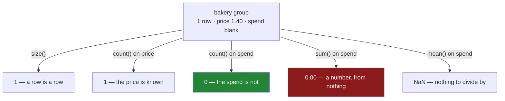

# 2.2 — `size` counts rows, `count` counts values

## One-line answer

`size()` tells you how many **rows** are in each group and `count()` tells you how many **values** are
in each column of each group — so a group with a blank in it gets two different numbers, and knowing
which one you asked for is the difference between "we bought one thing from the bakery" and "we know
what nothing from the bakery cost".

---

## The story

The receipt is torn again, and this week the tear went through the bread.

So the list has four lines on it. Milk and eggs from dairy, rice from the dry aisle, bread from the
bakery — and the bread line has no price on it, because the number is on the piece of the receipt
that stayed in the pocket.

Somebody wants to know how many things came from each aisle. One from the bakery. That is a fact
about the shop: bread was bought, it happened, the line exists.

Somebody else wants to know how much the bakery came to. And the honest answer is *nobody knows* —
there is one bakery line and no price on it.

Both of those questions look like counting. Both of them are asked with the word "how many". They
give different answers, and the sheet does not say which question a number on it was answering.

The pattern shows up the moment anybody computes an average. Bakery spend divided by bakery lines is
nothing divided by one. Bakery spend divided by bakery *prices we actually have* is nothing divided
by nothing. The first is a number. The second is a blank. Neither is wrong, and only one of them is
what somebody meant.

---

## The idea in plain language

Two methods, two different questions.

**`size()` counts rows.** It looks only at how many rows landed in each pile and never at what is in
them. A group of five rows has a size of five whether those rows are full of data or entirely empty.
The result is a single Series, one number per group, because "how many rows" has one answer per group
regardless of how many columns the frame has.

**`count()` counts values that are not blank.** It looks inside, column by column, so a group of five
rows where one price is missing has a price count of four. The result on a `DataFrameGroupBy` is a
whole **frame** — one row per group, one column per column of the original — because "how many
values" has a different answer for every column.

That difference in **shape** is the quickest way to remember which is which: `size()` gives you a
Series, `count()` gives you a frame. If you asked for one and got the other, you called the other one.

Everything about `count()` follows from Day 30. It is the blank-aware method — the one that disagrees
with `len` exactly when there is a blank
([Day 30, 1.1](../../../day-30-missing-data/parts/01-what-missing-means/1.1-the-price-nobody-wrote-down.md)).
`size()` is the `len` of this pair. And the gap between the two is the same diagnostic as it was
there: **`size()` minus `count()` is the number of blanks in that column of that group.**

Two more counting methods are worth knowing now, because people reach for the wrong one:

- **`nunique()`** counts *distinct* values per group, not all of them. Two rows both saying `dairy`
  count as one. This is the one you want for "how many different customers", and the one that gives a
  surprising answer for "how many orders".
- **`value_counts()`** on the key column itself gives the same numbers as `size()`, sorted by
  frequency rather than by key. It is quicker to type when all you want is the sizes of the groups
  and you have not built a `GroupBy` yet — and it sorts, which `size()` does not
  ([4.2](../04-the-keys/4.2-sort-and-the-order-of-the-groups.md)).

The one thing worth holding onto: **`size()` is the denominator for "per row" and `count()` is the
denominator for "per known value"**, and picking the wrong one produces an average that is
systematically too small or too large in exactly the way nobody notices.

---

## Why Setu needs it

- **[2.1](2.1-one-number-for-each-group.md)** gave you `sum` and `mean`, and `mean` is a division. The
  denominator it uses is `count`, not `size`, which is why a group with blanks in it has a mean that
  does not equal its sum over its row count.
- **[2.4](2.4-named-aggregation.md)** builds a report with both numbers side by side, which is the
  form a group summary should almost always take: how many rows, and how many of them you actually
  know something about.
- **[4.5](../04-the-keys/4.5-observed-and-the-aisle-nobody-visited.md)** is where a group with **zero**
  rows appears, and `size()` reporting `0` for it is how you notice.
- **Day 34** builds `describe()` into a data-quality report, and the count-versus-size gap per group
  is the per-group version of the profile from
  [Day 30, 2.2](../../../day-30-missing-data/parts/02-finding-it/2.2-counting-the-blanks.md).
- **Day 45** is the Phase 4 gate, where `audit()` reports per-group completeness — which is exactly
  this pair of numbers, for every group of every key that matters.

---

## The mechanism

The four-line shop, with the bread price torn off:

```python
import pandas as pd

shop = pd.DataFrame(
    {
        "item": ["milk", "bread", "eggs", "rice"],
        "aisle": ["dairy", "bakery", "dairy", "dry"],
        "need": [2, 1, 6, 1],
        "price": [1.15, 1.40, 0.32, 2.05],
    }
)
shop["spend"] = shop["need"] * shop["price"]
shop.loc[1, "spend"] = None

print(shop)
```

**Line by line:**

- The frame is the same one as [1.1](../01-the-split/1.1-four-lines-three-aisles.md), so nothing new
  has to be learned to read it.
- `shop.loc[1, "spend"] = None` blanks the bread line's spend, using the single-step `loc` write from
  [Day 28, 3.1](../../../day-28-selection-and-alignment/parts/03-writing/3.1-assigning-through-loc.md).
  A two-step write would land on a temporary and change nothing
  ([Day 26, 4.1](../../../day-26-frames-and-copy-on-write/parts/04-chained-assignment/4.1-the-write-that-vanished.md)).
- Only `spend` is blanked, not `price`. **That is the design of the example**: the bakery group has a
  row, has a price, and has no spend — so the three counting methods disagree with each other in a way
  you can read off the printout.

```text
    item   aisle  need  price  spend
0   milk   dairy     2   1.15   2.30
1  bread  bakery     1   1.40    NaN
2   eggs   dairy     6   0.32   1.92
3   rice     dry     1   2.05   2.05
```

**`size()` — how many rows:**

```python
g = shop.groupby("aisle")
print(g.size())
```

**Line by line:**

- `g.size()` takes no column, because the question does not involve one. Rows are rows.
- `bakery` is `1`. The bread line exists and is counted, blank or not. **This is the number that
  answers "how many things did we buy from the bakery".**
- The result is a **Series** with no name, indexed by aisle. One value per group, because there is one
  answer per group.

```text
aisle
bakery    1
dairy     2
dry       1
dtype: int64
```

**`count()` — how many values, per column:**

```python
print(g.count())
```

**Line by line:**

- `g.count()` also takes no column, but it answers **per column**, so the result is a frame: three
  rows for three aisles, four columns for the four non-key columns.
- The `spend` column reads `0` for `bakery`. There is a bakery row and there is no bakery spend, and
  this is the only method so far that says so.
- The `price` column reads `1` for `bakery`, because the price survived. **Two columns of the same
  group with different counts** is the thing to notice: completeness is a per-column property, not a
  per-row one.
- `item`, `need` and `price` all read the same as `size()`, because nothing is missing from them. That
  is the normal case, and it is why the difference is so easy to miss until it matters.

```text
        item  need  price  spend
aisle
bakery     1     1      1      0
dairy      2     2      2      2
dry        1     1      1      1
```

Narrowed to one column, it is a Series again and directly comparable with `size()`:

```python
print(g["spend"].count())
print()
print("size minus count:", (g.size() - g["spend"].count()).to_dict())
```

**Line by line:**

- `g["spend"].count()` narrows to a `SeriesGroupBy` first, which is the habit
  [2.1](2.1-one-number-for-each-group.md) argued for. Now both sides are Series and they subtract
  cleanly.
- The subtraction aligns on the index — both are indexed by aisle, so `bakery` lines up with `bakery`
  ([Day 28, 4.2](../../../day-28-selection-and-alignment/parts/04-alignment/4.2-alignment-is-automatic.md)).
- **The result is the number of blank spends per aisle**, which is the per-group version of the
  completeness profile from
  [Day 30, 2.2](../../../day-30-missing-data/parts/02-finding-it/2.2-counting-the-blanks.md). One line,
  and it is worth printing next to any group summary you intend to trust.

```text
aisle
bakery    0
dairy     2
dry       1
Name: spend, dtype: int64

size minus count: {'bakery': 1, 'dairy': 0, 'dry': 0}
```

**`nunique()` — how many *different* values:**

```python
print(g["item"].nunique())
```

**Line by line:**

- `nunique` counts distinct values, so two rows carrying the same item name would count once.
- Here every item is different, so it agrees with `size()` — which is exactly the trap. **A method
  that agrees with another on your test data is a method you have not tested.** Add a second `milk`
  line and the two diverge.
- Blanks are excluded by default, like `count`. A group of five rows with three blanks and two
  identical values has a `nunique` of one.

```text
aisle
bakery    1
dairy     2
dry       1
Name: item, dtype: int64
```



---

## When it breaks

**The sum of a group with nothing in it:**

```text
$ uv run python -c "
import pandas as pd
shop = pd.DataFrame({
    'aisle': ['dairy', 'bakery', 'dairy', 'dry'],
    'spend': [2.30, None, 1.92, 2.05],
})
g = shop.groupby('aisle')['spend']
print('sum  :'); print(g.sum())
print('mean :'); print(g.mean())
print('size :'); print(g.size())
print('count:'); print(g.count())
"
```

```text
sum  :
aisle
bakery    0.00
dairy     4.22
dry       2.05
Name: spend, dtype: float64
mean :
aisle
bakery     NaN
dairy     2.11
dry       2.05
Name: spend, dtype: float64
size :
aisle
bakery    1
dairy     2
dry       1
Name: spend, dtype: int64
count:
aisle
bakery    0
dairy     2
dry       1
Name: spend, dtype: int64
```

**What it means.** The bakery's total spend is `0.00` — a real number, printed without a warning,
ready to go into a report saying the flat spent nothing at the bakery. That is
[Day 30, 1.1](../../../day-30-missing-data/parts/01-what-missing-means/1.1-the-price-nobody-wrote-down.md)'s
all-blank sum, arriving one group at a time. The mean at least comes back blank. **`count` is the only
one of the four that tells you what happened**, and on a table with four hundred groups it is the only
one you would ever have looked at.

**Dividing by the wrong denominator:**

```text
$ uv run python -c "
import pandas as pd
shop = pd.DataFrame({
    'aisle': ['dairy', 'bakery', 'dairy', 'dry'],
    'spend': [2.30, None, 1.92, 2.05],
})
g = shop.groupby('aisle')['spend']
print('per known value:'); print((g.sum() / g.count()).round(3))
print('per row        :'); print((g.sum() / g.size()).round(3))
"
```

```text
per known value:
aisle
bakery     NaN
dairy     2.11
dry       2.05
Name: spend, dtype: float64
per row        :
aisle
bakery    0.00
dairy     2.11
dry       2.05
Name: spend, dtype: float64
```

**What it means.** Two averages of the same column, and they disagree on exactly the group that has a
blank. **Neither raises.** The first is what `mean()` computes and it is honest: it declines to
average nothing. The second quietly reports that the average bakery line cost zero pounds, which is
the sort of number that ends up on a slide. Which denominator you want is a real decision — *per line
we bought* against *per line we know the price of* — and the only way it gets made on purpose is if
you notice the two exist.

**Reading a frame where you expected a Series:**

```text
$ uv run python -c "
import pandas as pd
shop = pd.DataFrame({
    'aisle': ['dairy', 'bakery', 'dairy'],
    'need': [2, 1, 6],
    'spend': [2.30, None, 1.92],
})
counts = shop.groupby('aisle').count()
print(type(counts).__name__)
print(counts['spend'].to_dict())
counts['bakery']
"
```

```text
DataFrame
{'bakery': 0, 'dairy': 2}
Traceback (most recent call last):
  ...
KeyError: 'bakery'
```

**What it means.** `count()` on a `DataFrameGroupBy` returns a frame with one column per original
column, so `counts["bakery"]` — the thing people type when they are thinking of `size()` — raises a
`KeyError` about a column named `bakery`, which is confusing because `bakery` is right there in the
printout as a **row**. The fix is to know the shape: `size()` is a Series indexed by group, `count()`
is a frame indexed by group. When you want one number per group, narrow to a column first.

---

## In production

**What a professional writes instead of the teaching version.** They almost never report an
aggregate without its count next to it, because a mean over three rows and a mean over three million
are different claims that print identically:

```python
import pandas as pd


def grouped_summary(frame: pd.DataFrame, by: list[str], value: str) -> pd.DataFrame:
    """Per group: rows, known values, blanks, and the aggregate — in that order."""
    grouped = frame.groupby(by, observed=True, dropna=False)
    out = pd.DataFrame(
        {
            "rows": grouped.size(),
            "known": grouped[value].count(),
            "total": grouped[value].sum(min_count=1),
            "mean": grouped[value].mean(),
        }
    )
    out["blanks"] = out["rows"] - out["known"]
    out["share_known"] = (out["known"] / out["rows"]).round(4)
    return out[["rows", "known", "blanks", "share_known", "total", "mean"]]
```

**Line by line:**

- `observed=True` matters the moment the key is a `category` dtype, which Day 34 introduces. Without
  it, pandas emits a row for every category that *could* appear, and a report about twelve aisles
  fills up with four hundred empty ones ([4.5](../04-the-keys/4.5-observed-and-the-aisle-nobody-visited.md)).
- `dropna=False` keeps rows whose **key** is blank as their own group, rather than silently deleting
  them. That default is the subject of
  [4.3](../04-the-keys/4.3-dropna-and-the-rows-that-vanished.md), and defaulting it the other way is
  how rows disappear from a report with no trace.
- `min_count=1` on the sum is the fix for the `0.00` in the first transcript above. With it, a group
  with no known values sums to `NaN` instead of to zero — which is honest, and which stops a broken
  group looking like a group that genuinely spent nothing.
- `rows` and `known` are both in the output and `blanks` is their difference. Storing all three is
  redundant arithmetically and not redundant to read: a person scanning the report reads `blanks`, and
  a person querying it filters on `share_known`.
- `share_known` is rounded, for the same reason the blank share was in
  [Day 30, 2.2](../../../day-30-missing-data/parts/02-finding-it/2.2-counting-the-blanks.md): a
  sixteen-decimal number in a log makes two identical reports differ.
- The final `out[[...]]` fixes the **column order**, because a report is read by people and the
  order carries meaning: context first, then the numbers that depend on it.

**What changes at scale.** `size()` is the cheapest group-by there is — pandas only has to count how
many rows fall into each key, which it gets essentially for free while building the grouping. `count()`
has to inspect every value in every column, so on a wide frame it costs about as much as the grouping
plus a full scan; narrowing to the columns you care about is a real saving rather than a style
preference. The larger production point is about reporting: an aggregate published without its group
size is a number nobody can sanity-check, and the classic failure is a dashboard where one category's
average swings wildly every week because it has four rows in it. Publishing `rows` alongside every
aggregate, and suppressing or flagging groups below a minimum size, costs one column and prevents an
entire genre of wrong conclusion.

**The failure mode that only appears with real data.** A group's blank rate changes and nothing else
does. The `sum` stays plausible, the `mean` stays plausible, and `count` quietly falls because an
upstream feed started dropping a field for one region. Every dashboard keeps rendering. This is the
per-group version of the drift described in
[Day 30, 2.2](../../../day-30-missing-data/parts/02-finding-it/2.2-counting-the-blanks.md), and it is
harder to spot, because the group that broke is one row among hundreds. The monitor that catches it is
`share_known` per group, compared against last week's — not the aggregate itself.

**The review comment a senior engineer leaves.** *"This reports the mean per aisle with no group
size. Add `size()` — and use `sum(min_count=1)`, because right now an aisle where every price failed
to load reports a total of zero and looks like a real, thrifty aisle."*

**The interview question.** *"What is the difference between `size()` and `count()` on a group-by?"*
`size()` counts rows and returns one number per group; `count()` counts non-missing values and returns
one number per column per group, so the results have different shapes. The follow-up that separates
people who have used it: *"which one does `mean()` divide by?"* `count`, which is why a group's mean
does not equal its sum over its size when there are blanks — and why an all-blank group sums to zero
but averages to `NaN`.

---

## Check yourself

```bash
uv run python -c "
import pandas as pd
shop = pd.DataFrame({
    'item':  ['milk', 'bread', 'eggs', 'rice'],
    'aisle': ['dairy', 'bakery', 'dairy', 'dry'],
    'need':  [2, 1, 6, 1],
    'price': [1.15, 1.40, 0.32, 2.05],
})
shop['spend'] = shop['need'] * shop['price']
shop.loc[1, 'spend'] = None
g = shop.groupby('aisle')
print('size          :', g.size().to_dict())
print('count spend   :', g['spend'].count().to_dict())
print('count price   :', g['price'].count().to_dict())
print('sum spend     :', g['spend'].sum().to_dict())
print('sum min_count :', g['spend'].sum(min_count=1).to_dict())
print('mean spend    :', g['spend'].mean().round(3).to_dict())
"
```

Two of those six lines report something about the bakery that a person would call wrong. Say which
two, and say which single argument fixes one of them.

**Answer out loud, without scrolling up:**

> Say what `size()` counts and what `count()` counts, and say what shape each one hands back. Then say
> what the difference between them means for one group, and which of the two `mean()` divides by.

---

**Next:** [2.3 — `agg`: several answers at once](2.3-agg-several-answers-at-once.md).
