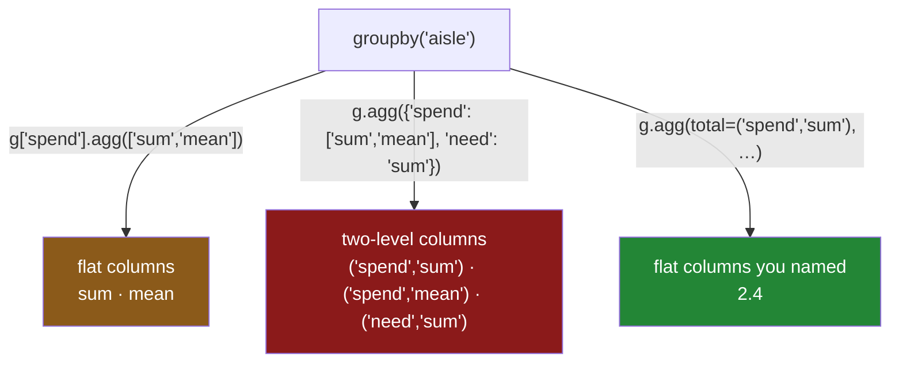

# 2.3 — `agg` — several answers at once

## One-line answer

`agg` takes a list of reductions and applies all of them to each group in one pass, so a summary that
would have been four separate group-bys becomes one call — and the price is that the result's columns
stop being simple names the moment you ask for more than one thing per column.

---

## The story

Somebody in the flat is writing the shopping up properly, because "we spent about forty quid" has
stopped being good enough for splitting the money.

They want, for each aisle: the total, the average line, the dearest line, and how many lines there
were. Four numbers, three aisles, twelve numbers in all.

The way they do it first is the way anybody would. Work out the totals for each aisle. Write those
down. Go back to the top, work out the averages for each aisle. Write those down. Go back to the top
again for the biggest line. Go back to the top a fourth time to count.

Four passes over the same list, three of them entirely avoidable, and — the part that actually bites —
four separate little tables that then have to be lined up next to each other by hand. Which is where
the mistake happens: the totals came out sorted one way and the averages another, and the bakery row
of one ends up next to the dairy row of the other.

The list is four lines long, so the mistake is caught. On a list of four thousand it would not be.

---

## The idea in plain language

An **aggregation** is a reduction: many values in, one value out
([2.1](2.1-one-number-for-each-group.md)). `agg` — short for *aggregate* — is the method that applies
**several** reductions in one go.

It takes three shapes of argument, and they answer three different questions:

- **A list**, on a `SeriesGroupBy`: `g["spend"].agg(["sum", "mean", "max"])`. One column of measure,
  several reductions. The result is a frame: one row per group, **one column per reduction**.
- **A dictionary**, on a `DataFrameGroupBy`: `g.agg({"spend": "sum", "need": "max"})`. Different
  reductions for different columns. The result is a frame with one column per entry.
- **A dictionary of lists**: `g.agg({"spend": ["sum", "mean"], "need": "sum"})`. Several reductions
  for some columns. This is where the column names get complicated, and it is why
  [2.4](2.4-named-aggregation.md) exists.

The reductions can be named as strings — `"sum"`, `"mean"`, `"max"`, `"min"`, `"count"`, `"size"`,
`"std"`, `"median"`, `"nunique"`, `"first"`, `"last"` — or passed as functions. **Prefer the
strings.** They are not merely shorter: pandas recognises them and runs a fast compiled path for each,
while an arbitrary function has to be called once per group in Python. The difference is measured in
[5.3](../05-filter-and-apply/5.3-what-apply-costs-measured.md), and it is large.

The thing to understand about the result is its **shape**, because it is where people get stuck.

With a list on one column, the answer is a plain frame: rows are groups, columns are the reductions
you asked for. Easy to read, easy to use.

With a dictionary of lists on several columns, the answer has **two levels of column heading** — the
original column on top, the reduction underneath. That is a `MultiIndex` on the columns, and it means
`result["spend"]` gives you a small frame rather than a column, and `result["sum"]` raises. You can
work with it, and mostly you do not want to: [2.4](2.4-named-aggregation.md) shows the form that
gives every output a flat name you chose.

One behaviour carries straight over from [2.2](2.2-size-counts-rows-count-counts-values.md) and is
worth repeating because `agg` makes it visible in one printout: **the reductions disagree about
blanks.** In the same row of the same result, `sum` will report `0.00` for a group with no values and
`mean` will report `NaN` and `count` will report `0`. Seeing all three side by side is genuinely the
best way to internalise it.

---

## Why Setu needs it

- **[2.2](2.2-size-counts-rows-count-counts-values.md)** argued that an aggregate should be published
  with its count. `agg` is how you get both in one call rather than by lining up two results.
- **[2.4](2.4-named-aggregation.md)** is the fix for the column names this part produces, and it is
  the form you should actually write.
- **[3.3](../03-transform/3.3-transform-and-agg-the-shape-rule.md)** contrasts this shape — one row
  per group — with `transform`'s, which is one row per original row. Knowing which you asked for is
  the day's central skill.
- **Day 34** builds a data-quality report, and `agg` with a fixed list of reductions per column is
  its engine.
- **Day 45** is the Phase 4 gate: `audit()` returns a per-group summary, and a summary assembled from
  four separate group-bys is four chances for the rows to be lined up wrongly.

---

## The mechanism

The four-line shop, with the bread spend still torn off, so the reductions disagree visibly:

```python
import pandas as pd

shop = pd.DataFrame(
    {
        "item": ["milk", "bread", "eggs", "rice"],
        "aisle": ["dairy", "bakery", "dairy", "dry"],
        "need": [2, 1, 6, 1],
        "price": [1.15, 1.40, 0.32, 2.05],
    }
)
shop["spend"] = shop["need"] * shop["price"]
shop.loc[1, "spend"] = None

g = shop.groupby("aisle")
print(g["spend"].agg(["sum", "mean", "max", "count"]))
```

**Line by line:**

- `g["spend"]` narrows to one column first, which is what makes the result a simple frame rather than
  a two-level one. **Narrow before you aggregate** is the habit from
  [2.1](2.1-one-number-for-each-group.md), and here it also decides the shape of the output.
- `.agg([...])` takes a **list of strings**. Each string names a reduction pandas already knows, so
  each runs in compiled code over the grouped data.
- The result's index is the aisle, as with every aggregation so far. Its **columns are the strings you
  passed**, in the order you passed them, which means the printout reads left to right in whatever
  order you thought made sense.
- Read the `bakery` row across: `0.00`, `NaN`, `NaN`, `0`. Four reductions, four different opinions
  about a group whose only value is missing
  ([2.2](2.2-size-counts-rows-count-counts-values.md)).

```text
         sum  mean   max  count
aisle
bakery  0.00   NaN   NaN      0
dairy   4.22  2.11  2.30      2
dry     2.05  2.05  2.05      1
```

**A dictionary — different reductions for different columns:**

```python
print(g.agg({"spend": ["sum", "mean"], "need": "sum"}))
```

**Line by line:**

- The keys are column names and the values say what to do with each. `spend` gets two reductions and
  `need` gets one, which is the normal situation: you rarely want the same summary of a money column
  and a quantity column.
- Columns not mentioned are **dropped from the result entirely**. `item` and `price` are gone. That is
  usually what you want and it is worth knowing, because a column vanishing from a report is otherwise
  a puzzling thing to debug.
- Look at the header. It has **two rows**: `spend` and `need` on top, the reduction names underneath.
  That is a `MultiIndex` on the columns, and it is the cost of asking for two reductions on one
  column.
- `need` sums to `8` for dairy — two plus six. Note that this is a total of *quantities*, and adding
  quantities of different things together is only meaningful because they happen to be counts here.
  Summing a column because it is numeric is one of the commonest ways a report ends up meaningless.

```text
       spend       need
         sum  mean  sum
aisle
bakery  0.00   NaN    1
dairy   4.22  2.11    8
dry     2.05  2.05    1
```

That two-level header is the thing to understand, so look at what it does to indexing:

```python
result = g.agg({"spend": ["sum", "mean"], "need": "sum"})
print("columns:", list(result.columns))
print()
print("result['spend'] is a frame:")
print(result["spend"])
print()
print("one number:", result[("spend", "sum")]["dairy"])
```

**Line by line:**

- `list(result.columns)` prints **tuples**, not strings. Every column is addressed by a pair: the
  original column and the reduction.
- `result["spend"]` selects the whole top level, so it gives back a **frame** with two columns. If you
  expected a Series, this is where the surprise lands.
- `result[("spend", "sum")]` is how you get one column: a tuple, both levels named. It works, and it
  is ugly, and it is the reason [2.4](2.4-named-aggregation.md) exists.
- Saving to CSV makes it worse: a two-level header writes as two header rows, and reading it back
  needs `header=[0, 1]` or the file loads with nonsense column names
  ([Day 27, 1.7](../../../day-27-reading-and-writing/parts/01-the-csv/1.7-to-csv-and-what-it-throws-away.md)).

```text
columns: [('spend', 'sum'), ('spend', 'mean'), ('need', 'sum')]

result['spend'] is a frame:
         sum  mean
aisle
bakery  0.00   NaN
dairy   4.22  2.11
dry     2.05  2.05

one number: 4.22
```



---

## When it breaks

**Indexing a two-level result the obvious way:**

```text
$ uv run python -c "
import pandas as pd
shop = pd.DataFrame({
    'aisle': ['dairy', 'bakery', 'dairy', 'dry'],
    'need':  [2, 1, 6, 1],
    'spend': [2.30, 1.40, 1.92, 2.05],
})
result = shop.groupby('aisle').agg({'spend': ['sum', 'mean'], 'need': 'sum'})
print(result['sum'])
"
```

```text
Traceback (most recent call last):
  File "<string>", line 8, in <module>
  File "...\pandas\core\frame.py", line 4378, in __getitem__
    indexer = self.columns.get_loc(key)
  File "...\pandas\core\indexes\multi.py", line 3040, in get_loc
    raise KeyError(key)
KeyError: 'sum'
```

**What it means.** `sum` is on the *second* level of the column index, and single-bracket selection
looks at the first. The word `sum` is printed right there in the header, which is what makes the error
confusing. The fixes, in increasing order of preference: `result[("spend", "sum")]` to get that one
column; `result.columns = ["_".join(c) for c in result.columns]` to flatten the header afterwards; or
**do not produce the two-level header in the first place**, which is
[2.4](2.4-named-aggregation.md).

**A reduction applied to a column of words:**

```text
$ uv run python -c "
import pandas as pd
shop = pd.DataFrame({
    'aisle': ['dairy', 'bakery', 'dairy'],
    'item':  ['milk', 'bread', 'eggs'],
    'spend': [2.30, 1.40, 1.92],
})
print(shop.groupby('aisle').agg(['sum', 'max']))
"
```

```text
            item        spend
             sum    max   sum  max
aisle
bakery     bread  bread  1.40  1.4
dairy   milkeggs   milk  4.22  2.3
```

**What it means.** No error. `sum` on a column of strings **concatenated them**, so the dairy aisle's
item summary is `milkeggs`, and `max` picked the alphabetically last one. Both are defensible
definitions and neither is what anybody meant. This is the same trap as
[2.1](2.1-one-number-for-each-group.md)'s argument for narrowing to a column first, and `agg` with a
list makes it worse by applying every reduction to every column. **Name the columns you mean.**

**Passing a function where a string would do:**

```text
$ uv run python -c "
import time
import numpy as np, pandas as pd
rng = np.random.default_rng(31)
n = 200_000
df = pd.DataFrame({'key': rng.integers(0, 5_000, n), 'x': rng.normal(size=n)})
g = df.groupby('key')['x']
t = time.perf_counter(); g.agg('mean'); fast = time.perf_counter() - t
t = time.perf_counter(); g.agg(lambda s: s.mean()); slow = time.perf_counter() - t
print(f'string  {fast * 1000:8.1f} ms')
print(f'lambda  {slow * 1000:8.1f} ms')
print(f'ratio   {slow / fast:8.1f}x')
"
```

```text
string       1.6 ms
lambda     104.6 ms
ratio       65.4x
```

**What it means.** The two lines compute the same numbers. The string version runs one compiled
reduction over the grouped data; the lambda version calls a Python function once per group — five
thousand times — and each call builds a Series first. **No error, no warning, sixty-five
times the time**, and the code looks more flexible. Reach for the string whenever one exists; the
measured version of this argument is [5.3](../05-filter-and-apply/5.3-what-apply-costs-measured.md).

---

## In production

**What a professional writes instead of the teaching version.** They put the summary's definition in
one place, as data, so that the report's columns are a reviewable list rather than something buried in
a call:

```python
import pandas as pd

SPEND_SUMMARY: dict[str, list[str]] = {
    "spend": ["sum", "mean", "max", "count"],
    "need": ["sum"],
}


def summarise(frame: pd.DataFrame, by: list[str], spec: dict[str, list[str]]) -> pd.DataFrame:
    """Apply a fixed summary spec per group, with flat column names."""
    absent = sorted(set(spec) - set(frame.columns))
    if absent:
        raise KeyError(f"cannot summarise: frame has no columns {absent}")

    out = frame.groupby(by, observed=True, dropna=False).agg(spec)
    out.columns = [f"{column}_{how}" for column, how in out.columns]
    out.insert(0, "rows", frame.groupby(by, observed=True, dropna=False).size())
    return out
```

**Line by line:**

- `SPEND_SUMMARY` is a module constant. What a report contains is a decision that outlives the
  function, and putting it in a named dictionary means a change to the report is a one-line diff a
  reviewer can read without understanding pandas.
- The `absent` check turns a bare `KeyError` from inside pandas into a sentence, for the same reason
  as in [Day 30, 7.1](../../../day-30-missing-data/parts/07-the-module/7.1-the-missing-module.md).
- `observed=True` for when the key is a `category` — Day 34's dtype — so the result does not gain a
  row for every category that has no data
  ([4.5](../04-the-keys/4.5-observed-and-the-aisle-nobody-visited.md)).
- `dropna=False` so rows whose key is blank become their own group rather than disappearing
  ([4.3](../04-the-keys/4.3-dropna-and-the-rows-that-vanished.md)).
- `out.columns = [f"{column}_{how}" ...]` flattens the two-level header into `spend_sum`,
  `spend_mean`, `need_sum`. Anything that consumes this — a CSV, a Parquet file, a chart, a SQL
  loader — is happier with flat names, and the join in the f-string is the whole cost.
- `out.insert(0, "rows", ...)` puts the group size **first**, because a summary read without its group
  size is a summary that cannot be sanity-checked
  ([2.2](2.2-size-counts-rows-count-counts-values.md)). `insert` places it at position zero rather
  than appending it, so the report reads context-first.
- The second `groupby` for `size()` is a real cost on a large frame; the version in
  [2.4](2.4-named-aggregation.md) gets the row count inside the same `agg` call and avoids it.

**What changes at scale.** `agg` with string reductions is the fast path, and asking for four of them
in one call is much cheaper than four separate group-bys: the grouping — the sort or hash of the key —
happens once instead of four times, and on a large frame that grouping is most of the cost. That is
the main performance argument for this method. The counter-pressure is width: a spec with eight
reductions across twenty columns produces a hundred and sixty columns, most of which nobody reads, and
each of which is computed. Specs grow by accretion and are almost never pruned, so the discipline
worth having is that a column in the summary needs a consumer.

**The failure mode that only appears with real data.** A string column sneaks into a spec that uses
`["sum", "max"]` for everything, and instead of failing it concatenates. On four rows the result is
visibly wrong. On four million rows in one group, `sum` on a string column builds a single string
tens of megabytes long, and the job either takes an inexplicably long time or runs out of memory —
with a traceback pointing at the aggregation and no hint that a column's dtype is the cause. Naming
the columns per reduction, as the spec above does, makes it impossible.

**The review comment a senior engineer leaves.** *"`.agg(['sum', 'mean'])` on the whole frame applies
both to every column, including `customer_name`. Please pass a dict naming the columns, and flatten
the resulting MultiIndex before this gets written to Parquet — two-level headers do not survive the
round trip cleanly."*

**The interview question.** *"How do you compute several aggregates per group in one pass?"* `agg`
with a list of reduction names for one column, or a dictionary mapping columns to reductions — and the
reason to do it in one call rather than several is that the grouping happens once. The follow-up:
*"what does the result look like?"* One row per group; a flat column index if you narrowed to one
column first, and a two-level column index as soon as any column has more than one reduction — which
is why named aggregation exists.

---

## Check yourself

```bash
uv run python -c "
import pandas as pd
shop = pd.DataFrame({
    'item':  ['milk', 'bread', 'eggs', 'rice'],
    'aisle': ['dairy', 'bakery', 'dairy', 'dry'],
    'need':  [2, 1, 6, 1],
    'price': [1.15, 1.40, 0.32, 2.05],
})
shop['spend'] = shop['need'] * shop['price']
shop.loc[1, 'spend'] = None
g = shop.groupby('aisle')
flat = g['spend'].agg(['sum', 'mean', 'count'])
two  = g.agg({'spend': ['sum', 'mean'], 'need': 'sum'})
print('flat columns :', list(flat.columns))
print('two-level    :', list(two.columns))
print()
print(flat)
print()
print(two['spend']['sum'].to_dict())
"
```

The two calls asked for overlapping things and produced column labels of different kinds. Say what
`list(two.columns)` printed, and say what `two["sum"]` would do.

**Answer out loud, without scrolling up:**

> Say what `agg` gives you that calling `sum()` and then `mean()` separately does not — and give the
> performance reason, not just the convenience one. Then say what happens to the result's column
> labels the moment one column gets two reductions.

---

**Next:** [2.4 — Named aggregation](2.4-named-aggregation.md).
