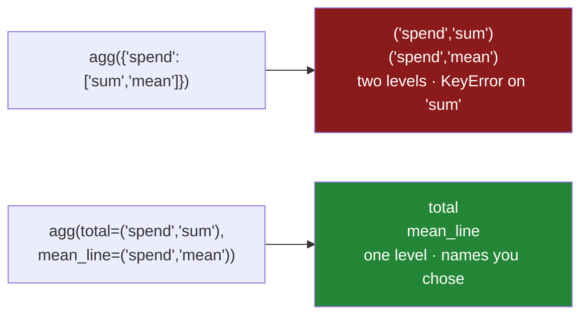

# 2.4 — Named aggregation

## One-line answer

`agg(total=("spend", "sum"), lines=("spend", "size"))` lets you name every output column yourself, so
the result has flat, meaningful names instead of a two-level header — and the name says what the
number *means* rather than how it was computed.

---

## The story

The aisle summary from last week is pinned to the fridge, and somebody who was not there is reading
it.

The columns are headed `spend_sum`, `spend_mean`, `spend_max` and `need_sum`. Every one of those is
accurate. Not one of them says what the number is *for*.

`spend_max` is the dearest single line in that aisle. `need_sum` is how many individual things were
bought. `spend_mean` is the average per **line**, not per item, which matters because six eggs are one
line — a distinction [2.1](2.1-one-number-for-each-group.md) made and the column heading does not.

So the person reading it asks what `need_sum` means, and somebody has to explain, and the explanation
takes longer than the report did.

The fix is not a longer explanation. It is to write `things_bought` in the heading. The number is
identical; the heading now carries the meaning that was in somebody's head, and the sheet stops
needing a person attached to it.

---

## The idea in plain language

**Named aggregation** is the form of `agg` where you supply the output column names as keyword
arguments:

```
frame.groupby(key).agg(
    output_name=("input_column", "reduction"),
    another_name=("input_column", "reduction"),
)
```

Each keyword becomes a column in the result. Each value is a **two-item tuple**: the column to read,
and the reduction to apply to it. Nothing else is different from
[2.3](2.3-agg-several-answers-at-once.md) — the same reductions run in the same compiled paths — and
three things get better:

- **The result has a flat column index.** One level, plain strings, the names you chose. It writes to
  CSV and Parquet cleanly, it charts without unpacking, and `result["total"]` gives you a column
  rather than a frame.
- **The names say what the numbers mean.** `total`, `lines`, `dearest`, `things_bought` — rather than
  `spend_sum`, `spend_size`, `spend_max`, `need_sum`. A report is read by people, and a column heading
  is the cheapest documentation there is.
- **The same input column can appear more than once, harmlessly.** `total=("spend", "sum")` and
  `dearest=("spend", "max")` sit side by side with no two-level header, because the names are yours
  and cannot collide unless you make them.

Two details worth knowing.

**`size` works here as a string**, so `lines=("spend", "size")` gives the row count of the group —
and, unlike the standalone `size()` from
[2.2](2.2-size-counts-rows-count-counts-values.md), it arrives inside the same result, in the same
call, without a second group-by. **That is the practical reason to prefer this form**: the count and
the aggregate it contextualises come out together. (Which column you name for `size` makes no
difference to the answer, because rows are rows; name the one the reader will associate with it.)

**The keyword names must be valid Python identifiers.** `mean spend` is not allowed and
`mean_spend` is. If you need a heading with a space or a symbol in it — for a chart or a spreadsheet
— rename afterwards, at the boundary, where the presentation belongs rather than in the computation.

There is one more form, `pd.NamedAgg(column="spend", aggfunc="sum")`, which is exactly the tuple
written out longhand. It is worth recognising when you meet it and there is no reason to write it: the
tuple is shorter and reads the same.

---

## Why Setu needs it

- **[2.3](2.3-agg-several-answers-at-once.md)** produced a two-level column index and a `KeyError`.
  This is the form that does not.
- **[2.2](2.2-size-counts-rows-count-counts-values.md)** argued that every aggregate should be
  published with its group size. `size` as one keyword among the others is how that becomes one call
  instead of two.
- **[6.1](../06-the-module/6.1-the-grouping-module.md)** puts the day's summary spec into
  `src/setu/grouping.py` as a named constant, and it is written in this form.
- **Day 34** builds the data-quality report, whose columns are read by a person and therefore need
  names a person understands.
- **Day 44** puts a summary behind an API and **Day 234** puts one in a service response, where a
  two-level column index has to be flattened into JSON keys anyway — so it may as well have been flat
  from the start.

---

## The mechanism

The same four-line shop, summarised the way a person would want to read it:

```python
import pandas as pd

shop = pd.DataFrame(
    {
        "item": ["milk", "bread", "eggs", "rice"],
        "aisle": ["dairy", "bakery", "dairy", "dry"],
        "need": [2, 1, 6, 1],
        "price": [1.15, 1.40, 0.32, 2.05],
    }
)
shop["spend"] = shop["need"] * shop["price"]
shop.loc[1, "spend"] = None

summary = shop.groupby("aisle").agg(
    lines=("item", "size"),
    known=("spend", "count"),
    total=("spend", "sum"),
    dearest_unit=("price", "max"),
    things_bought=("need", "sum"),
)
print(summary)
print()
print("columns:", list(summary.columns))
```

**Line by line:**

- `lines=("item", "size")` — the number of rows in the group. `size` ignores the column entirely, so
  naming `item` here is a readability choice: *how many item lines*. Naming `spend` would give the
  same number and read slightly wrong, because `spend` has a blank in it and `size` does not care.
- `known=("spend", "count")` — how many of those lines have a spend. Sitting next to `lines`, the
  difference is legible at a glance: the bakery has one line and zero known spends
  ([2.2](2.2-size-counts-rows-count-counts-values.md)).
- `total=("spend", "sum")` — the aisle's spend. Named `total` rather than `spend_sum`, because
  "total" is what it is.
- `dearest_unit=("price", "max")` reads **`price`**, not `spend`. Dairy's answer is `1.15` — the milk,
  which cost more per unit than the eggs — even though the eggs' *line* was not the smaller spend.
  **The name says which question is being answered**, and this is exactly the confusion a heading of
  `price_max` would leave in place.
- `things_bought=("need", "sum")` — eight for dairy, two milks and six eggs. Under a heading of
  `need_sum` a reader has to guess; under this one they do not.
- `list(summary.columns)` prints five plain strings. No tuples, no levels, nothing to flatten.

```text
        lines  known  total  dearest_unit  things_bought
aisle
bakery      1      0   0.00          1.40              1
dairy       2      2   4.22          1.15              8
dry         1      1   2.05          2.05              1

columns: ['lines', 'known', 'total', 'dearest_unit', 'things_bought']
```

Now the thing this form makes easy — reading and using one column:

```python
print(summary["total"])
print()
print("aisles with a missing spend:", summary.index[summary["known"] < summary["lines"]].tolist())
print()
print(summary.assign(mean_line=(summary["total"] / summary["known"]).round(3)))
```

**Line by line:**

- `summary["total"]` gives a **Series**. Under the two-level header from
  [2.3](2.3-agg-several-answers-at-once.md) the same idea needed `summary[("spend", "sum")]`, and the
  natural spelling raised.
- `summary["known"] < summary["lines"]` is an ordinary column comparison producing a mask
  ([Day 28, 2.1](../../../day-28-selection-and-alignment/parts/02-masks/2.1-a-comparison-makes-a-column.md)),
  and `summary.index[mask]` gives the group labels. **That one line is the per-group completeness
  check**, and it only reads this well because both numbers are flat columns of the same frame.
- `.assign(...)` adds a derived column without mutating `summary`
  ([Day 28, 3.2](../../../day-28-selection-and-alignment/parts/03-writing/3.2-the-new-column-that-was-a-mask.md)).
  Dividing `total` by `known` gives the average per known line, which is the denominator decision from
  [2.2](2.2-size-counts-rows-count-counts-values.md) made explicitly rather than inherited from
  `mean()`.
- The bakery's mean comes out as `NaN`, because it is `0.00 / 0`. Read as "we do not know what the
  bakery cost", which is true.

```text
aisle
bakery    0.00
dairy     4.22
dry       2.05
Name: total, dtype: float64

aisles with a missing spend: ['bakery']

        lines  known  total  dearest_unit  things_bought  mean_line
aisle
bakery      1      0   0.00          1.40              1        NaN
dairy       2      2   4.22          1.15              8       2.11
dry         1      1   2.05          2.05              1       2.05
```



---

## When it breaks

**A keyword that is not a valid identifier:**

```text
$ uv run python -c "
import pandas as pd
shop = pd.DataFrame({'aisle': ['dairy', 'dairy', 'dry'], 'spend': [2.30, 1.92, 2.05]})
print(shop.groupby('aisle').agg(**{'total spend': ('spend', 'sum')}))
"
```

```text
  File "<string>", line 4
SyntaxError: keyword argument repeated: total spend
```

**What it means.** A keyword argument has to be an identifier, so a heading with a space in it cannot
be written this way — and the `**{...}` trick that gets past the parser produces a confusing error
rather than a helpful one. The right answer is to compute with identifier names and rename at the
edge: `summary.rename(columns={"total": "Total spend"})`, done at the moment the frame becomes a
report. **Presentation names belong at the boundary**, not in the computation, because everything
between them has to keep typing them.

**Naming a column that does not exist:**

```text
$ uv run python -c "
import pandas as pd
shop = pd.DataFrame({'aisle': ['dairy', 'dairy', 'dry'], 'spend': [2.30, 1.92, 2.05]})
print(shop.groupby('aisle').agg(total=('spned', 'sum')))
"
```

```text
Traceback (most recent call last):
  File "<string>", line 4, in <module>
KeyError: "Label(s) ['spned'] do not exist"
```

**What it means.** A typo in the *input* column raises immediately and names the column, which is the
behaviour you want and is not universal in pandas —
`fillna({"typo": 0})` silently ignores it
([Day 30, 5.2](../../../day-30-missing-data/parts/05-filling/5.2-a-different-fill-for-each-column.md)).
A typo in the **output** name, by contrast, cannot be caught by anything: `totl=("spend", "sum")` is a
perfectly valid request for a column called `totl`, and it will flow downstream until something looks
for `total` and does not find it.

**Reusing an output name:**

```text
$ uv run python -c "
import pandas as pd
shop = pd.DataFrame({'aisle': ['dairy', 'dairy', 'dry'], 'spend': [2.30, 1.92, 2.05], 'need': [2, 6, 1]})
print(shop.groupby('aisle').agg(total=('spend', 'sum'), total=('need', 'sum')))
"
```

```text
  File "<string>", line 4
SyntaxError: keyword argument repeated: total
```

**What it means.** Python itself refuses, before pandas is involved, because two keyword arguments
cannot share a name. That is a genuinely useful guarantee: **the columns of a named aggregation are
unique by construction**, so a summary cannot silently end up with two columns of the same name — which
a dictionary-based `agg` combined with a later rename absolutely can.

---

## In production

**What a professional writes instead of the teaching version.** The summary is defined once, as data,
with the reason for each column next to it, and applied by a function that guarantees the group size
is always present:

```python
import pandas as pd

# output name -> (input column, reduction) — the report's contract, in one place.
AISLE_SUMMARY: dict[str, tuple[str, str]] = {
    "lines": ("item", "size"),
    "known": ("spend", "count"),
    "total": ("spend", "sum"),
    "mean_line": ("spend", "mean"),
    "dearest_unit": ("price", "max"),
    "things_bought": ("need", "sum"),
}


def summarise(
    frame: pd.DataFrame,
    by: list[str],
    spec: dict[str, tuple[str, str]] = None,
) -> pd.DataFrame:
    """Apply a named-aggregation spec per group. Always includes the group size."""
    plan = AISLE_SUMMARY if spec is None else spec
    needed = sorted({column for column, _ in plan.values()})
    absent = sorted(set(needed) - set(frame.columns))
    if absent:
        raise KeyError(f"cannot summarise: frame has no columns {absent}")
    if not any(how == "size" for _, how in plan.values()):
        raise ValueError("every summary must carry a group size; add one with ('<col>', 'size')")

    return frame.groupby(by, observed=True, dropna=False).agg(**plan)
```

**Line by line:**

- `AISLE_SUMMARY` maps output name to `(input column, reduction)` — exactly the shape `agg(**plan)`
  wants, so the constant *is* the call. Nothing has to be translated between the reviewable form and
  the executable one.
- `spec: dict[...] = None` with the constant chosen inside, rather than `spec = AISLE_SUMMARY` as a
  default. A mutable default is created once and shared by every call, so a caller who mutates it
  changes the default for the whole process
  ([Day 19, 2.2](../../../day-19-typing-dataclasses-and-concurrency/parts/02-dataclasses/2.2-default-factory.md)).
- `needed` collects the input columns from the spec, so the existence check happens **before** the
  group-by and names every missing column at once, rather than failing on the first one pandas
  reaches.
- The `"size"` check enforces [2.2](2.2-size-counts-rows-count-counts-values.md)'s rule structurally:
  a summary without a group size is refused. It is a small, opinionated guard, and it is the kind that
  stops a whole category of unfalsifiable dashboard.
- `observed=True` and `dropna=False` for the reasons in
  [4.5](../04-the-keys/4.5-observed-and-the-aisle-nobody-visited.md) and
  [4.3](../04-the-keys/4.3-dropna-and-the-rows-that-vanished.md): no rows for categories that are not
  there, and no silent deletion of rows whose key is blank.
- `agg(**plan)` unpacks the dictionary into keyword arguments. This is the one place the `**` form is
  the right answer rather than a trick, because the names genuinely come from data.

**What changes at scale.** Named aggregation costs the same as
[2.3](2.3-agg-several-answers-at-once.md)'s form — same reductions, same single pass over the grouped
data — so the choice is about names rather than speed. The scale effect is downstream. A flat column
index is what every consumer wants: Parquet stores it without a round-trip problem, a chart library
takes it as a column name, a SQL loader maps it to a field, and a JSON response uses it as a key.
Every hour saved is an hour not spent flattening a `MultiIndex` in four different places. The other
production benefit is **stability of contract**: because the output names are written down rather than
derived from `f"{column}_{reduction}"`, changing how a number is computed — swapping `mean` for
`median` — does not rename a column and break every consumer.

**The failure mode that only appears with real data.** The spec is edited to add a column, the
downstream consumer is not updated, and nothing fails — the extra column is simply ignored until
somebody notices the report has grown. The opposite is worse: a column is *removed* from the spec and
the consumer's `KeyError` arrives in production rather than in review, because nothing in the codebase
links the two. The defence is a test that asserts the spec's output names against a frozen list, so a
change to the report is a deliberate two-file diff rather than a one-line edit.

**The review comment a senior engineer leaves.** *"`.agg({'spend': ['sum', 'mean']})` gives us a
MultiIndex we then flatten three files later. Use named aggregation, and name the columns for what
they mean — `total` and `mean_line`, not `spend_sum` and `spend_mean`. Also add the group size; the
weekly swing in `mean_line` for small aisles is unreadable without it."*

**The interview question.** *"How do you get a group summary with sensible column names?"* Named
aggregation: `agg(total=("spend", "sum"), lines=("spend", "size"))`, where each keyword is the output
column and each value is a `(column, reduction)` tuple. It gives a flat column index rather than a
two-level one, so the result is directly usable downstream. The follow-up worth being ready for:
*"why does that matter?"* Because a `MultiIndex` on columns has to be flattened before almost anything
consumes it, and because a column heading is documentation — a reader who has to be told what
`need_sum` means is a reader the report has failed.

---

## Check yourself

```bash
uv run python -c "
import pandas as pd
shop = pd.DataFrame({
    'item':  ['milk', 'bread', 'eggs', 'rice'],
    'aisle': ['dairy', 'bakery', 'dairy', 'dry'],
    'need':  [2, 1, 6, 1],
    'price': [1.15, 1.40, 0.32, 2.05],
})
shop['spend'] = shop['need'] * shop['price']
shop.loc[1, 'spend'] = None
summary = shop.groupby('aisle').agg(
    lines=('item', 'size'),
    known=('spend', 'count'),
    total=('spend', 'sum'),
    dearest_unit=('price', 'max'),
    things_bought=('need', 'sum'),
)
print(summary)
print()
print('columns   :', list(summary.columns))
print('one column:', summary['total'].to_dict())
print('incomplete:', summary.index[summary['known'] < summary['lines']].tolist())
"
```

`dearest_unit` for dairy is `1.15` and the dairy aisle's largest *line* was `2.30`. Say why those are
different numbers, and say which column heading would have hidden the difference.

**Answer out loud, without scrolling up:**

> Give the shape of one named-aggregation argument — what the keyword is, and what the two items of
> the tuple are. Then say the two things this form gives you that a dictionary-of-lists `agg` does
> not.

---

**Next:** [3.1 — A number for every row](../03-transform/3.1-a-number-for-every-row.md).
