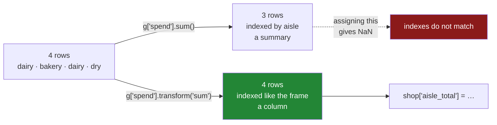

# 3.1 — A number for every row

## One-line answer

`transform` computes the same group summary that `agg` does and then hands it back **once per original
row** rather than once per group, so the result lines up with the frame it came from and can be
assigned straight into it as a new column.

---

## The story

The aisle totals are written down: dairy came to four pounds twenty-two, the bakery to one forty, dry
to two oh five. Three numbers, three aisles, on a separate scrap of paper.

Now somebody asks a different question. *Which line was the biggest part of its aisle?*

That is not a question about aisles. It is a question about **lines**, and to answer it every line
needs its own aisle's total written next to it. The milk line needs 4.22. The eggs line needs 4.22 as
well. The bread line needs 1.40.

So somebody starts copying. Look up the aisle on the line, find that aisle on the scrap of paper,
write the total in the margin. Four lines, three lookups, done in a few seconds.

On four hundred lines it is not a few seconds, and worse, it is where the mistakes come from: one
line's aisle gets misread, the wrong total gets copied, and the resulting share is quietly wrong in a
way that nothing checks.

The copying is mechanical. Every line's total is completely determined by its aisle. There should be
a way to say *put each line's aisle total next to it* in one go — and there is, and it is the whole of
this part.

---

## The idea in plain language

Every group-by so far has been an **aggregation**: many rows in, one row out per group. Three aisles
in, three numbers out. The result is *smaller* than the frame, and it is indexed by the key rather
than by the frame's own index
([2.1](../02-aggregating/2.1-one-number-for-each-group.md)).

**`transform` is the other shape.** It computes exactly the same per-group summary, and then **spreads
each group's answer back across that group's rows**. Four rows in, four values out, in the original
order, with the original index. The milk and eggs rows both receive `4.22`, because both are dairy.

The name is worth unpacking, because it is not obvious. It "transforms" the column: a column of
spends goes in, a column of the-total-of-my-group comes out, same length, same labels. It is the verb
for *turn each value into something computed from the group it belongs to*.

The thing that makes it useful is what the same index buys you. Because the result lines up with the
frame row for row, you can:

- assign it as a new column: `shop["aisle_total"] = g["spend"].transform("sum")`;
- do arithmetic between it and an ordinary column: `shop["spend"] / g["spend"].transform("sum")`;
- compare it with an ordinary column to build a mask: *rows above their own group's average*.

None of those work with an aggregation, because an aggregation is indexed by aisle and the frame is
indexed by row. Assigning one to the other lines up `dairy` against row label `0` and finds nothing —
producing a column of blanks, with no error at all. That failure is in **When it breaks** below and it
is worth meeting once.

Two more things to hold onto:

- **The argument is the same reduction name.** `transform("sum")`, `transform("mean")`,
  `transform("median")`, `transform("max")`. Everything from
  [2.3](../02-aggregating/2.3-agg-several-answers-at-once.md) applies, including the strong preference
  for the string form over a lambda.
- **You have already used this.** Day 30's group-wise fill was
  `frame.groupby("aisle")["price"].transform("median")`, and the reason it worked as an argument to
  `fillna` is exactly the reason given here: it has one value per original row, aligned
  ([Day 30, 5.2](../../../day-30-missing-data/parts/05-filling/5.2-a-different-fill-for-each-column.md)).

---

## Why Setu needs it

- **[3.2](3.2-the-share-of-the-aisle.md)** uses this for the calculation everybody eventually needs:
  each row's share of its own group.
- **[3.3](3.3-transform-and-agg-the-shape-rule.md)** states the rule that separates the two shapes and
  gives you the one question to ask before choosing.
- **[Day 30, 5.2](../../../day-30-missing-data/parts/05-filling/5.2-a-different-fill-for-each-column.md)**
  borrowed this idiom a day early for the group-wise fill. This is where it is explained rather than
  used.
- **Day 76** is feature engineering, where *this customer's spend relative to their own segment's
  average* is one of the most productive features there is, and it is one `transform` per feature.
- **Day 154** builds the capstone's time-series features, where a rolling per-entity statistic joined
  back to every row is the same shape scaled up.

---

## The mechanism

The four-line shop, with no blanks this time so the two shapes are directly comparable:

```python
import pandas as pd

shop = pd.DataFrame(
    {
        "item": ["milk", "bread", "eggs", "rice"],
        "aisle": ["dairy", "bakery", "dairy", "dry"],
        "need": [2, 1, 6, 1],
        "price": [1.15, 1.40, 0.32, 2.05],
    }
)
shop["spend"] = shop["need"] * shop["price"]

g = shop.groupby("aisle")
print(g["spend"].sum())
print()
print(g["spend"].transform("sum"))
```

**Line by line:**

- `g["spend"].sum()` is the aggregation from
  [2.1](../02-aggregating/2.1-one-number-for-each-group.md): **three values, indexed by aisle**. This
  is the scrap of paper.
- `g["spend"].transform("sum")` computes the same three totals and then writes each one into every row
  of its group: **four values, indexed 0 to 3**. This is the margin of the list.
- The numbers are identical — `4.22` appears twice in the second result because two rows are dairy.
  Nothing new is being computed; only the shape has changed.
- Look at what pandas kept. The second result has the frame's own index and the column's name, which
  is the whole point: it can be put back.

```text
aisle
bakery    1.40
dairy     4.22
dry       2.05
Name: spend, dtype: float64

0    4.22
1    1.40
2    4.22
3    2.05
Name: spend, dtype: float64
```

Now put it back, which is what it is for:

```python
print(shop.assign(aisle_total=g["spend"].transform("sum")))
```

**Line by line:**

- `.assign(aisle_total=...)` adds a column and returns a new frame, leaving `shop` alone
  ([Day 28, 3.2](../../../day-28-selection-and-alignment/parts/03-writing/3.2-the-new-column-that-was-a-mask.md)).
- The assignment works with no argument about alignment, because the transform result carries the
  frame's index. **Row 0 gets `4.22` because row 0's label is `0` on both sides.**
- Read the column down: `4.22`, `1.40`, `4.22`, `2.05`. The two dairy rows share a value, which is what
  "the total of my group" means and is exactly what the copying by hand produced.
- Nothing was joined, merged or looked up. The whole operation is one pass, and Day 32's `merge` is
  the tool you would otherwise have reached for.

```text
    item   aisle  need  price  spend  aisle_total
0   milk   dairy     2   1.15   2.30         4.22
1  bread  bakery     1   1.40   1.40         1.40
2   eggs   dairy     6   0.32   1.92         4.22
3   rice     dry     1   2.05   2.05         2.05
```

The shapes, side by side, because the difference is the whole part:

```python
print("frame rows     :", len(shop))
print("agg length     :", len(g["spend"].sum()))
print("transform length:", len(g["spend"].transform("sum")))
print("agg index      :", g["spend"].sum().index.tolist())
print("transform index:", g["spend"].transform("sum").index.tolist())
```

**Line by line:**

- The frame has four rows and there are three aisles, so the two results have different lengths — `3`
  and `4`. **A length that matches the frame is the signature of a transform.**
- The indexes differ in kind, not only in length: one is aisle names, the other is row labels. That is
  what decides whether a result can be assigned back.
- On a frame where every group has exactly one row the two lengths would agree and the indexes would
  still differ, which is a good reason not to test this on a tidy example.

```text
frame rows     : 4
agg length     : 3
transform length: 4
agg index      : ['bakery', 'dairy', 'dry']
transform index: [0, 1, 2, 3]
```



---

## When it breaks

**Assigning an aggregation back to the frame:**

```text
$ uv run python -c "
import pandas as pd
shop = pd.DataFrame({
    'aisle': ['dairy', 'bakery', 'dairy', 'dry'],
    'spend': [2.30, 1.40, 1.92, 2.05],
})
shop['aisle_total'] = shop.groupby('aisle')['spend'].sum()
print(shop)
"
```

```text
    aisle  spend  aisle_total
0   dairy   2.30          NaN
1  bakery   1.40          NaN
2   dairy   1.92          NaN
3     dry   2.05          NaN
```

**What it means.** The aggregation is indexed by `bakery`, `dairy`, `dry`; the frame is indexed by
`0, 1, 2, 3`. Assigning a Series to a column aligns on the index
([Day 28, 4.2](../../../day-28-selection-and-alignment/parts/04-alignment/4.2-alignment-is-automatic.md)),
nothing matches, and every row gets a blank. **No error and no warning** — a whole column of `NaN`
that looks like a data problem rather than a shape problem. The one-character-plus fix is
`.transform("sum")`, and the tell is that *every* row is blank rather than some of them.

**The case where it half-works, which is worse:**

```text
$ uv run python -c "
import pandas as pd
shop = pd.DataFrame(
    {'aisle': ['dairy', 'bakery', 'dairy'], 'spend': [2.30, 1.40, 1.92]},
    index=['dairy', 'bakery', 'other'],
)
shop['aisle_total'] = shop.groupby('aisle')['spend'].sum()
print(shop)
"
```

```text
         aisle  spend  aisle_total
dairy    dairy   2.30         4.22
bakery  bakery   1.40         1.40
other    dairy   1.92          NaN
```

**What it means.** Here the frame's index happens to contain some of the same labels as the group keys,
so alignment matches two rows and not the third. Two thirds of the column is filled with something
that looks right. This is a contrived index and it is not a contrived situation: any frame whose index
was set from a key column ([Day 26, 1.2](../../../day-26-frames-and-copy-on-write/parts/01-the-two-objects/1.2-the-index-is-not-a-row-number.md))
has exactly this property, and the partially-filled column is far harder to spot than an all-blank
one.

**A `transform` whose function returns the wrong shape:**

```text
$ uv run python -c "
import pandas as pd
shop = pd.DataFrame({'aisle': ['dairy', 'bakery', 'dairy'], 'spend': [2.30, 1.40, 1.92]})
g = shop.groupby('aisle')['spend']
print('scalar back  :', g.transform(lambda s: s.sum()).tolist())
print('two values   :', g.transform(lambda s: s.head(2)).tolist())
"
```

```text
scalar back  : [4.22, 1.4, 4.22]
two values   : [2.3, 1.4, 1.92]
```

**What it means.** Neither raises, and the second one is the trap. `transform` **broadcasts** a single
returned value across the group, which is why the first line works and is the normal case. When the
function returns something of the wrong length, pandas does not refuse; it does what it can, and the
second line silently gave back the original values rather than anything the function meant. A
`transform` whose result you have not checked against the input is a `transform` you should not trust
— and this is another reason to pass the string `"sum"` rather than a lambda, because the string
cannot have the wrong shape.

---

## In production

**What a professional writes instead of the teaching version.** The transform is wrapped so that the
new column's name records what it is, and the alignment is asserted rather than assumed:

```python
import pandas as pd


def add_group_stat(
    frame: pd.DataFrame,
    value: str,
    by: list[str],
    how: str,
    name: str | None = None,
) -> pd.DataFrame:
    """Add a column holding each row's own group's `how` of `value`."""
    absent = sorted({value, *by} - set(frame.columns))
    if absent:
        raise KeyError(f"frame has no columns {absent}")

    column = name or f"{value}_{how}_by_{'_'.join(by)}"
    if column in frame.columns:
        raise ValueError(f"{column} already exists — added twice?")

    stat = frame.groupby(by, observed=True, dropna=False)[value].transform(how)
    if len(stat) != len(frame):
        raise RuntimeError(f"transform returned {len(stat)} values for {len(frame)} rows")

    return frame.assign(**{column: stat})
```

**Line by line:**

- `how: str` is typed as a string on purpose. Accepting a callable would be more flexible and much
  slower, and would open the wrong-shape failure above; a caller who genuinely needs a custom function
  can reach for `apply` and pay the cost knowingly
  ([5.2](../05-filter-and-apply/5.2-apply-the-escape-hatch.md)).
- The default `name` is built from the inputs — `spend_sum_by_aisle` — so a frame that accumulates
  several of these has columns whose names say where they came from. Six months later that is the
  difference between a readable feature table and a guessing game.
- The `if column in frame.columns: raise` guard catches the notebook accident of running the cell
  twice, which would otherwise silently overwrite the column with an identical one — harmless here and
  not harmless when the second run happens after the frame has been filtered.
- `observed=True` and `dropna=False` for the reasons in
  [4.5](../04-the-keys/4.5-observed-and-the-aisle-nobody-visited.md) and
  [4.3](../04-the-keys/4.3-dropna-and-the-rows-that-vanished.md). The second matters especially here:
  with the default, rows whose key is blank get a blank statistic, silently.
- The length assertion costs nothing and catches the wrong-shape lambda. It is a `RuntimeError`
  because it means the library did something unexpected, not that the caller passed something invalid.
- `frame.assign(**{column: stat})` rather than `frame[column] = stat`, so the function does not mutate
  its argument. The `**{...}` form is needed because the column name is a variable rather than a
  literal keyword.

**What changes at scale.** `transform` with a string reduction is roughly two passes: one to compute
the per-group statistic, one to scatter it back. That is more work than the aggregation alone, and far
less than the obvious alternative of computing the aggregate and then merging it back onto the frame,
which builds a join. On a large frame the scatter is the part that costs, because it touches every
row. The pattern to avoid is a loop that adds twenty such columns one at a time, since each call
regroups the frame from scratch; computing the group-by once and reusing the `GroupBy` object across
several `transform` calls is a real saving. The correctness point that matters more: **the alignment
`transform` guarantees is what makes this safe**, and hand-rolling it with `map` or `merge` reintroduces
every mismatch the failures above showed.

**The failure mode that only appears with real data.** The key column has blanks in it. With pandas'
default of `dropna=True`, every row whose key is missing receives `NaN` for the transform — not
because the statistic is unknown, but because those rows were never in a group. On a feature table
that is a column with an unexplained hole in it, correlated with whatever causes the key to go
missing, and it will be imputed later by somebody who has no idea where it came from
([Day 30, 5.1](../../../day-30-missing-data/parts/05-filling/5.1-fillna-is-a-claim.md)). Passing
`dropna=False` makes the blank key its own group, which is at least a decision.

**The review comment a senior engineer leaves.** *"`df['aisle_total'] = df.groupby('aisle')['spend'].sum()`
— that aligns the aisle names against the row index and gives you a column of NaN. You want
`.transform('sum')`. Please also assert the length; we shipped this exact bug in the segment feature
last quarter and the model just learned to ignore the column."*

**The interview question.** *"What is the difference between `agg` and `transform` on a group-by?"*
Both compute the same per-group statistic; `agg` returns one row per group, indexed by the key, and
`transform` returns one row per original row, indexed like the frame — so only `transform` can be
assigned back as a column. The follow-up: *"what happens if you assign an `agg` result to a column?"*
It aligns on the index, the group keys do not match the row labels, and you get a column of `NaN`
with no error — or, worse, a partly filled column if the frame's index happens to share some labels
with the keys.

---

## Check yourself

```bash
uv run python -c "
import pandas as pd
shop = pd.DataFrame({
    'item':  ['milk', 'bread', 'eggs', 'rice'],
    'aisle': ['dairy', 'bakery', 'dairy', 'dry'],
    'need':  [2, 1, 6, 1],
    'price': [1.15, 1.40, 0.32, 2.05],
})
shop['spend'] = shop['need'] * shop['price']
g = shop.groupby('aisle')['spend']
print('agg       :', g.sum().to_dict())
print('transform :', g.transform('sum').tolist())
print('lengths   :', len(g.sum()), len(g.transform('sum')), len(shop))
print()
print(shop.assign(
    aisle_total=g.transform('sum'),
    aisle_mean=g.transform('mean').round(3),
    above_mean=shop['spend'] > g.transform('mean'),
))
"
```

The `above_mean` column could not have been built from the aggregation without a join. Say why, in one
sentence, naming the property of the transform result that makes the comparison work.

**Answer out loud, without scrolling up:**

> Say what `transform` gives back that `agg` does not — the shape and the index. Then say what happens
> when you assign an `agg` result to a column of the frame it came from, and what you would see on the
> screen.

---

**Next:** [3.2 — The share of the aisle](3.2-the-share-of-the-aisle.md).
