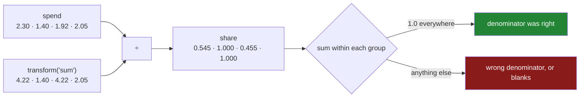

# 3.2 — The share of the aisle

## One-line answer

Dividing a column by its own group's total — `spend / g["spend"].transform("sum")` — gives each row's
share of its group, which is the single most useful thing `transform` does and the calculation that a
group-by alone cannot produce.

---

## The story

The shop is split three ways at the end of the month, and somebody wants to know where the money
actually went.

The aisle totals say dairy four twenty-two, bakery one forty, dry two oh five. Useful, and it does not
answer the question that comes next, which is always: *within dairy, what was the big thing?*

Dairy is two lines. Milk at two thirty and eggs at one ninety-two. Both feel like ordinary amounts.
But two thirty out of four twenty-two is more than half the aisle, and one ninety-two is the rest, and
"the milk is over half the dairy spend" is a sentence somebody can act on in a way that "the milk was
two pounds thirty" is not.

The awkward bit is that the two numbers you need to say that sentence live in different places. The
line total is on the line. The aisle total is on the scrap of paper with the summary on it. Getting
them into the same division means either copying the aisle total onto every line, or copying every
line onto the summary — and the first one is
[3.1](3.1-a-number-for-every-row.md).

The second awkward bit is the sanity check, and it is the reason this calculation is worth its own
part. Every aisle's shares should add up to exactly one. If dairy's two shares come to 0.98 or 1.03,
something is wrong — and that check is free, and almost nobody runs it.

---

## The idea in plain language

A **share** — also called a proportion, or a percentage once you multiply by a hundred — is a part
divided by its whole. Here the part is one row's value and the whole is that row's group's total.

The expression is:

```
frame["spend"] / frame.groupby("aisle")["spend"].transform("sum")
```

Read it left to right: *this row's spend, divided by the total spend of this row's aisle.* The
division works elementwise, row by row, because both sides are columns of the same length with the
same index — which is exactly what [3.1](3.1-a-number-for-every-row.md) established and is the whole
reason the expression is one line.

Two properties follow, and both are checks worth running:

- **The shares within a group sum to one.** That is what "share" means. If they do not, either the
  denominator was not the group's total or something in the column is blank. This is the cheapest
  correctness check in the whole day, and the mechanism below runs it.
- **A group of one row has a share of exactly one.** Bread is the only bakery line, so its share is
  `1.000`. That is arithmetically correct and analytically useless — "this line is a hundred per cent
  of its aisle" says nothing about the line and everything about the group having one row in it.
  Shares from small groups are the thing that makes a "top contributors" report full of nonsense, and
  the defence is to publish the group size next to them
  ([2.2](../02-aggregating/2.2-size-counts-rows-count-counts-values.md)).

The same shape covers a whole family of calculations, and they are worth recognising as one idea
rather than four:

| The question | The expression |
|---|---|
| what share of my group am I? | `x / g.transform("sum")` |
| how far from my group's average am I? | `x - g.transform("mean")` |
| how many of my group's standard deviations from its mean? | `(x - g.transform("mean")) / g.transform("std")` |
| am I above my group's typical value? | `x > g.transform("median")` |

Each one is *a row's value compared against a summary of its own group*, and each one is impossible
without the per-row shape. The third is called **standardising within a group**, and it is how you
compare a customer in an expensive city against one in a cheap one, or a student against their own
cohort, without the group's overall level swamping the comparison.

---

## Why Setu needs it

- **[3.1](3.1-a-number-for-every-row.md)** produced the aligned column. This is the first thing worth
  doing with it.
- **[3.3](3.3-transform-and-agg-the-shape-rule.md)** uses the shares-sum-to-one check as the concrete
  reason the shapes matter: run it on the wrong shape and you get an error instead of an answer.
- **[5.1](../05-filter-and-apply/5.1-filter-keeping-whole-groups.md)** keeps or drops whole groups, and
  "groups with fewer than five rows" is the filter that stops small-group shares polluting a report.
- **Day 39** builds the correlation and distribution plots, where a per-group share is the column that
  makes a chart comparable across groups of very different sizes.
- **Day 76** is feature engineering, and within-group standardisation is one of the highest-value
  transformations there — it is how a model sees "unusually large *for this customer*" rather than
  "large".

---

## The mechanism

The four-line shop, and each line's share of its own aisle:

```python
import pandas as pd

shop = pd.DataFrame(
    {
        "item": ["milk", "bread", "eggs", "rice"],
        "aisle": ["dairy", "bakery", "dairy", "dry"],
        "need": [2, 1, 6, 1],
        "price": [1.15, 1.40, 0.32, 2.05],
    }
)
shop["spend"] = shop["need"] * shop["price"]

aisle_total = shop.groupby("aisle")["spend"].transform("sum")
shop["share"] = (shop["spend"] / aisle_total).round(3)

print(shop)
```

**Line by line:**

- `aisle_total` is stored in a variable rather than repeated inside the division. It is used once here
  and twice in the next block, and naming it makes the division read as English: *spend over aisle
  total*.
- `shop["spend"] / aisle_total` divides elementwise. Both sides have four values and the same index,
  so row 0's spend meets row 0's aisle total
  ([Day 28, 4.2](../../../day-28-selection-and-alignment/parts/04-alignment/4.2-alignment-is-automatic.md)).
- `.round(3)` for readability only. **Round for display, never before a check** — the sum-to-one test
  below is run on the unrounded values, because rounding three numbers and adding them up can land a
  thousandth away from one and start a false alarm.
- `shop["share"] = ...` is a plain single-bracket write on the frame itself, which is the form that
  works under Copy-on-Write
  ([Day 26, 4.3](../../../day-26-frames-and-copy-on-write/parts/04-chained-assignment/4.3-loc-the-single-step.md)).
- Read the `share` column: milk `0.545`, eggs `0.455`. **The milk is more than half the dairy aisle**,
  which is the sentence the story wanted and which neither the line total nor the aisle total says on
  its own.
- Bread and rice both read `1.000`, because each is alone in its aisle. Arithmetically right,
  analytically empty.

```text
    item   aisle  need  price  spend  share
0   milk   dairy     2   1.15   2.30  0.545
1  bread  bakery     1   1.40   1.40  1.000
2   eggs   dairy     6   0.32   1.92  0.455
3   rice     dry     1   2.05   2.05  1.000
```

Now the check, which is the part people skip:

```python
share = shop["spend"] / aisle_total
print(share.groupby(shop["aisle"]).sum().round(6).to_dict())
```

**Line by line:**

- `share` is recomputed **without the rounding**, for the reason above.
- `share.groupby(shop["aisle"])` groups a Series by an **external** column rather than by a column of
  its own frame. That form works because the two share an index, and it is the one to reach for when
  the thing being grouped is not a column of the frame that has the key
  ([4.1](../04-the-keys/4.1-the-key-became-the-index.md)).
- `.sum()` per aisle, then `.round(6)` for printing. Six places is deliberate: enough to hide the
  ordinary floating-point wobble at the sixteenth decimal
  ([Day 20, 2.3](../../../day-20-arrays-and-dtypes/parts/02-dtypes/2.3-floats-nan-and-precision.md)),
  and not enough to hide a real error.
- Every aisle reads `1.0`. **If any of them did not, the denominator was wrong**, and finding that out
  costs one line.

```text
{'bakery': 1.0, 'dairy': 1.0, 'dry': 1.0}
```

The same shape, three more ways:

```python
g = shop.groupby("aisle")["spend"]
print(
    shop.assign(
        gap_from_mean=(shop["spend"] - g.transform("mean")).round(3),
        above_median=shop["spend"] > g.transform("median"),
        pct_of_aisle=(100 * shop["spend"] / g.transform("sum")).round(1),
    )[["item", "aisle", "spend", "gap_from_mean", "above_median", "pct_of_aisle"]]
)
```

**Line by line:**

- `gap_from_mean` subtracts rather than divides — the same aligned column, a different operator. Dairy
  has two rows, so the two gaps are equal and opposite: `+0.19` and `−0.19`.
- `above_median` compares, giving a mask
  ([Day 28, 2.1](../../../day-28-selection-and-alignment/parts/02-masks/2.1-a-comparison-makes-a-column.md)).
  With two rows in the group, the median sits between them and one row is above it — which is a
  reminder that a median of an even-sized group is not one of its values.
- `pct_of_aisle` is the share multiplied by a hundred. **Do the multiplication at the end**, once, at
  the point of display; carrying percentages through a calculation is how a factor of a hundred goes
  missing.
- The trailing `[[...]]` selects the columns worth printing, because a frame with nine columns wraps
  in a terminal and stops being readable.

```text
    item   aisle  spend  gap_from_mean  above_median  pct_of_aisle
0   milk   dairy   2.30           0.19          True          54.5
1  bread  bakery   1.40           0.00         False         100.0
2   eggs   dairy   1.92          -0.19         False          45.5
3   rice     dry   2.05           0.00         False         100.0
```

Look at the `bread` row across. Its gap from its aisle's mean is `0.00`, its answer to "above the
median" is `False`, and its share of the aisle is `100.0`. All three are correct and all three are
saying the same empty thing: **the group has one row in it, so the row is its own summary.** A
one-row group cannot be above or below itself, cannot differ from itself, and is all of itself. That
is why the group size belongs next to any of these columns.



---

## When it breaks

**A blank in the column, and the shares that stop adding up:**

```text
$ uv run python -c "
import pandas as pd
shop = pd.DataFrame({
    'aisle': ['dairy', 'dairy', 'dairy', 'dry'],
    'spend': [2.30, 1.92, None, 2.05],
})
total = shop.groupby('aisle')['spend'].transform('sum')
share = shop['spend'] / total
print(share.round(3).tolist())
print('sums per aisle:', share.groupby(shop['aisle']).sum().round(6).to_dict())
"
```

```text
[0.545, 0.455, nan, 1.0]
sums per aisle: {'dairy': 1.0, 'dry': 1.0}
```

**What it means.** There are three dairy rows and the third has no spend, so its share is blank — and
the two known shares still add to `1.0`, because `sum` skips blanks
([Day 30, 1.1](../../../day-30-missing-data/parts/01-what-missing-means/1.1-the-price-nobody-wrote-down.md)).
**The check passes and the shares are wrong**: they are shares of the *known* dairy spend, not of the
dairy spend, and if the missing line was the expensive one they are badly wrong. No error anywhere.
The fix is to check completeness before computing shares — `count` against `size`
([2.2](../02-aggregating/2.2-size-counts-rows-count-counts-values.md)) — and to say in the column's
name or its documentation which denominator it used.

**A denominator that can be zero:**

```text
$ uv run python -c "
import pandas as pd
returns = pd.DataFrame({
    'aisle': ['dairy', 'dairy', 'dry'],
    'refund': [0.0, 0.0, 2.05],
})
total = returns.groupby('aisle')['refund'].transform('sum')
print((returns['refund'] / total).tolist())
"
```

```text
[nan, nan, 1.0]
```

**What it means.** The dairy aisle had no refunds, so its total is zero, and zero divided by zero is
`NaN` rather than an error — pandas follows NumPy here, and NumPy follows the floating-point standard
([Day 23, 1.3](../../../day-23-ufuncs-and-statistics/parts/01-ufuncs/1.3-divide-by-zero-warns.md)).
A non-zero numerator over a zero denominator would give `inf` instead, which then propagates through
every subsequent mean and chart axis. **Any share whose denominator is a sum that can legitimately be
zero needs an explicit decision**: leave it blank, set it to zero, or refuse — but decide, because the
default is one of two different surprises depending on the numerator.

**Rounding before the check:**

```text
$ uv run python -c "
import pandas as pd
shop = pd.DataFrame({'aisle': ['a'] * 3, 'x': [1.0, 1.0, 1.0]})
share = shop['x'] / shop.groupby('aisle')['x'].transform('sum')
print('unrounded sum:', share.sum())
print('rounded sum  :', share.round(3).sum())
"
```

```text
unrounded sum: 1.0
rounded sum  : 0.9990000000000001
```

**What it means.** Three thirds, each rounded to `0.333`, add to `0.999`. The unrounded version is
exactly `1.0`. Neither raises, and a check written against the rounded column would report a failure
that does not exist — which is how a correct calculation gets "fixed" into an incorrect one. **Round
for display, at the end, and never before a check.** The same applies to any published table whose
percentages are expected to total a hundred: they will not, and the honest fix is a footnote rather
than fiddling the largest row.

---

## In production

**What a professional writes instead of the teaching version.** The share is a function that carries
its own check and refuses the cases that make it meaningless:

```python
import pandas as pd


def share_of_group(
    frame: pd.DataFrame,
    value: str,
    by: list[str],
    min_group: int = 2,
    tolerance: float = 1e-9,
) -> pd.Series:
    """Each row's share of its own group's total. Blank for groups too small to be meaningful."""
    grouped = frame.groupby(by, observed=True, dropna=False)[value]

    incomplete = grouped.transform("size") != grouped.transform("count")
    if incomplete.any():
        raise ValueError(
            f"{value} is incomplete in {int(incomplete.sum())} rows; "
            "a share of a partial total is not a share"
        )

    total = grouped.transform("sum")
    share = (frame[value] / total).where(total != 0)
    share = share.where(grouped.transform("size") >= min_group)

    checked = share.dropna()
    if not checked.empty:
        sums = checked.groupby([frame[column] for column in by], observed=True).sum()
        if ((sums - 1.0).abs() > tolerance).any():
            raise RuntimeError(f"shares do not sum to 1 within every group: {sums.to_dict()}")

    return share
```

**Line by line:**

- The completeness check comes **first** and raises, because of the first failure above: a share
  computed over a partial total looks fine and means something different from what its name says.
  `size` against `count` is the per-group version of Day 30's diagnostic.
- `.where(total != 0)` blanks the rows whose group total is zero, rather than letting them come out as
  `NaN` or `inf` depending on the numerator. `where` keeps values where the condition holds and blanks
  the rest ([Day 28, 3.3](../../../day-28-selection-and-alignment/parts/03-writing/3.3-where-mask-and-the-write-that-was-not.md)),
  so the two zero cases collapse into one deliberate one.
- `min_group: int = 2` blanks the shares of one-row groups, which are always `1.0` and always
  meaningless. Two is the lowest defensible floor; a report ranking "top contributors" usually wants
  a much higher one.
- `tolerance: float = 1e-9` rather than `== 1.0`, because floating-point addition of many numbers does
  not land exactly on one
  ([Day 23, 2.6](../../../day-23-ufuncs-and-statistics/parts/02-statistics/2.6-float-summation-and-the-drift.md)).
  Comparing floats for equality is the bug this parameter exists to avoid.
- The check runs on `checked = share.dropna()`, so the rows deliberately blanked above do not make
  their groups fail. Without that line, every one-row group would report a sum of zero and the check
  would fire on data that is fine.
- `RuntimeError` for the sum check and `ValueError` for the completeness check: the first means the
  computation went wrong, the second means the input was not suitable. That distinction is what lets a
  caller catch one and not the other
  ([Day 18, 2.2](../../../day-18-exceptions/parts/02-the-hierarchy/2.2-which-built-in-to-raise.md)).

**What changes at scale.** Every `transform` is a group-by plus a scatter, and this function calls it
four times — `size`, `count`, `sum`, `size` again. On a large frame that is four groupings of the same
key, and the fix is to build the `GroupBy` object once (as the code does) so pandas can reuse the
grouping internally, and to drop the checks you do not need. The verification pass at the end costs a
second group-by over the result; on a batch job that is worth it, and in a hot serving path it is
not — the usual arrangement is to verify in the pipeline that produces the table and trust it in the
service that reads it. The deeper scale issue is **skew**: if one group holds ninety per cent of the
rows, the group-by is unbalanced and, in a distributed engine, one worker does nearly all the work.
That is not a pandas problem until the data outgrows pandas, and it is the first thing to look at when
Day 35's tools are slower than expected on a keyed operation.

**The failure mode that only appears with real data.** The denominator changes underneath you. Shares
are computed on Monday's snapshot, the table gets a late-arriving row on Tuesday, and the shares are
recomputed — so a row whose share was published as 54.5% is now 41.2%, without the row itself having
changed at all. Anybody comparing the two reports concludes something happened to that line. **A share
is a property of a snapshot, not of a row**, and the practical defence is to publish the denominator
alongside it: `total_at_snapshot` next to `share`, so the change is explainable in one look.

**The review comment a senior engineer leaves.** *"These shares are computed over a column that is 6%
null, so they are shares of the known total and the name does not say so. Either assert completeness
or rename the column. Also, please blank the single-row groups — the 'top contributors' board is
currently three suppliers who each have exactly one transaction."*

**The interview question.** *"How would you compute each row's percentage of its group's total?"*
Divide the column by `groupby(key)[column].transform("sum")`, because the transform returns one value
per row aligned to the frame, so the division is elementwise. The follow-up that shows experience:
*"how do you know it is right?"* The shares within each group must sum to one — check it on the
unrounded values with a tolerance rather than an equality — and watch for two cases that pass the
check while being wrong: a group whose total is zero, and a column with blanks in it, where `sum`
skips the blanks and the surviving shares still add to one.

---

## Check yourself

```bash
uv run python -c "
import pandas as pd
shop = pd.DataFrame({
    'item':  ['milk', 'bread', 'eggs', 'rice'],
    'aisle': ['dairy', 'bakery', 'dairy', 'dry'],
    'need':  [2, 1, 6, 1],
    'price': [1.15, 1.40, 0.32, 2.05],
})
shop['spend'] = shop['need'] * shop['price']
g = shop.groupby('aisle')['spend']
share = shop['spend'] / g.transform('sum')
print(shop.assign(
    aisle_total=g.transform('sum'),
    share=share.round(3),
    gap_from_mean=(shop['spend'] - g.transform('mean')).round(3),
    lines_in_aisle=g.transform('size'),
))
print()
print('sums per aisle:', share.groupby(shop['aisle']).sum().round(6).to_dict())
"
```

Two rows have a share of exactly `1.000`. Say what `lines_in_aisle` reads for those rows, and say what
you would do to those two shares before putting this table in front of anybody.

**Answer out loud, without scrolling up:**

> Give the expression for a row's share of its own group, and say which part of it needs `transform`
> rather than a plain aggregation. Then give the one-line check that tells you the denominator was
> right, and name a case where that check passes and the shares are still wrong.

---

**Next:** [3.3 — `transform` and `agg`: the shape rule](3.3-transform-and-agg-the-shape-rule.md).
