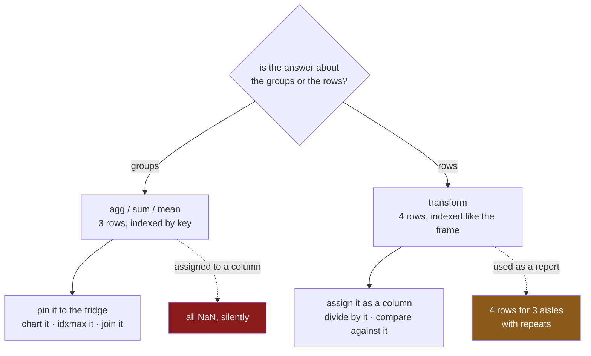

# 3.3 — `transform` and `agg` — the shape rule

## One-line answer

Ask one question before every group-by — *does my answer have one row per group, or one row per
original row?* — because that single choice decides whether you want `agg` or `transform`, and the
wrong one either fails loudly or, worse, fills a column with blanks.

---

## The story

Two people are looking at the same shopping list and they both say they want "the aisle totals".

The first one is writing the monthly summary. What they want is a small table: three aisles, three
numbers, pinned to the fridge. When they say "aisle totals" they mean a *report*, and it is shorter
than the list it came from.

The second one is working out which line was the biggest part of its aisle. What they want is the
same three numbers written in the margin of every line — the milk line needs 4.22 next to it, the eggs
line needs 4.22 too. When they say "aisle totals" they mean a *column*, and it is exactly as long as
the list.

Same words. Same arithmetic. Two completely different pieces of paper, and neither can be substituted
for the other: the summary cannot be divided into the line totals, and the margin cannot be pinned to
the fridge.

Nobody in the flat is confused about this, because both pieces of paper are visible. In code they are
both "the result", and they look similar enough in a printout that people spend an afternoon trying to
make the wrong one work.

---

## The idea in plain language

Every group-by operation produces a result with one of two shapes, and the shape is decided by the
method, not by the reduction:

| | `agg` (and `sum`, `mean`, … called directly) | `transform` |
|---|---|---|
| rows out | one per **group** | one per **original row** |
| index | the group keys | the frame's own index |
| use it as | a report, a lookup table, a chart | a new column, one side of an arithmetic expression |
| assign to a column? | **no** — the labels do not match | **yes** — that is what it is for |
| smaller than the frame? | yes, usually much | never; exactly the same length |

**The rule is one question:** *is my answer about the groups, or about the rows?*

- *"What did each aisle come to?"* — about groups. Three answers. `agg`.
- *"What share of its aisle was each line?"* — about rows. Four answers. `transform`.
- *"Which aisle spent the most?"* — about groups. `agg`, then `idxmax`.
- *"Which lines were above their own aisle's average?"* — about rows. `transform`, then a comparison.

Two things make this harder than it sounds, and both are worth naming.

**The reduction is the same word in both.** `sum` means the same thing in `g["spend"].sum()` and
`g["spend"].transform("sum")`. Nothing about the word tells you which shape you are getting, so the
shape has to be a decision rather than a consequence.

**Choosing wrong does not always fail.** Using `transform` where you wanted `agg` gives a result with
repeated values — you notice, because your three-row summary has four rows in it. Using `agg` where
you wanted `transform` and assigning it to a column gives a column of `NaN`, silently, because the
index labels do not match
([3.1](3.1-a-number-for-every-row.md)). **One of the two mistakes is loud and the other is not**, and
the quiet one is the direction people go more often.

There is a third method, `apply`, which can return either shape depending on what its function gives
back. That flexibility is why people reach for it and why it is the wrong first choice: a function
whose output shape depends on the data is a function whose result you cannot reason about.
[5.2](../05-filter-and-apply/5.2-apply-the-escape-hatch.md) covers when it is genuinely needed, and
[5.3](../05-filter-and-apply/5.3-what-apply-costs-measured.md) measures what it costs.

---

## Why Setu needs it

- **[2.1](../02-aggregating/2.1-one-number-for-each-group.md)** through
  **[2.4](../02-aggregating/2.4-named-aggregation.md)** were all one shape; **[3.1](3.1-a-number-for-every-row.md)**
  and **[3.2](3.2-the-share-of-the-aisle.md)** were all the other. This is where the two are put next
  to each other and the choice is made explicit.
- **[4.1](../04-the-keys/4.1-the-key-became-the-index.md)** is about what happens to the key in the
  first shape, which is the source of most of the confusion about assigning results back.
- **[6.1](../06-the-module/6.1-the-grouping-module.md)** puts one function of each shape in the day's
  module, with the shape stated in the docstring and asserted in the test.
- **Day 32** is `merge`, which is the tool you would use to attach an `agg` result back onto a frame —
  and knowing that `transform` already does it without a join is one of the day's practical payoffs.
- **Day 76** builds features, where nearly every group-based feature is a `transform` and nearly every
  sanity-check table is an `agg`, in the same file, twenty lines apart.

---

## The mechanism

The same call, both ways, printed together:

```python
import pandas as pd

shop = pd.DataFrame(
    {
        "item": ["milk", "bread", "eggs", "rice"],
        "aisle": ["dairy", "bakery", "dairy", "dry"],
        "need": [2, 1, 6, 1],
        "price": [1.15, 1.40, 0.32, 2.05],
    }
)
shop["spend"] = shop["need"] * shop["price"]
g = shop.groupby("aisle")["spend"]

report = g.sum()
column = g.transform("sum")

print("report:", report.shape, report.index.name, "->", report.to_dict())
print("column:", column.shape, column.index.name, "->", column.tolist())
```

**Line by line:**

- `g` is built once and used twice, which is both faster and the point: **the grouping is identical
  and only the final step differs.**
- `report.shape` is `(3,)` and `column.shape` is `(4,)`. On a real frame these differ by orders of
  magnitude, and the length is the quickest way to tell which one you are holding.
- `report.index.name` is `aisle`; `column.index.name` is `None`, because it inherited the frame's
  unnamed row index. **That is the difference that decides whether an assignment works**, and it is
  visible without printing a single value.
- `.to_dict()` on the report and `.tolist()` on the column, because a report is a mapping from key to
  answer and a column is a sequence. The two natural ways of printing them are themselves a hint.

```text
report: (3,) aisle -> {'bakery': 1.4, 'dairy': 4.22, 'dry': 2.05}
column: (4,) None -> [4.22, 1.4, 4.22, 2.05]
```

Each one used for the job it is for:

```python
print("the aisle that spent most :", report.idxmax(), f"({report.max():.2f})")
print()
print(shop.assign(share=(shop["spend"] / column).round(3))[["item", "aisle", "spend", "share"]])
```

**Line by line:**

- `report.idxmax()` returns the **index label** of the largest value — the aisle's name — rather than
  the value itself. That is a question about groups, and it needs the group-shaped result: the
  transform has no aisle labels to return.
- `report.max()` is the value. Printing both together is the honest form of "dairy spent the most",
  because a winner without a margin is not an answer.
- The `assign` uses `column`, the row-shaped result, because a share is a question about rows
  ([3.2](3.2-the-share-of-the-aisle.md)).
- Swap the two variables in this block and both lines fail — `column.idxmax()` returns a row label
  rather than an aisle, and `shop["spend"] / report` produces blanks. Neither swap raises. Try it.

```text
the aisle that spent most : dairy (4.22)

    item   aisle  spend  share
0   milk   dairy   2.30  0.545
1  bread  bakery   1.40  1.000
2   eggs   dairy   1.92  0.455
3   rice     dry   2.05  1.000
```



---

## When it breaks

**The quiet direction — `agg` where `transform` was meant:**

```text
$ uv run python -c "
import pandas as pd
shop = pd.DataFrame({
    'aisle': ['dairy', 'bakery', 'dairy', 'dry'],
    'spend': [2.30, 1.40, 1.92, 2.05],
})
shop['share'] = shop['spend'] / shop.groupby('aisle')['spend'].sum()
print(shop)
print('any share computed?', shop['share'].notna().any())
"
```

```text
    aisle  spend  share
0   dairy   2.30    NaN
1  bakery   1.40    NaN
2   dairy   1.92    NaN
3     dry   2.05    NaN
any share computed? False
```

**What it means.** The division aligned aisle names against row labels, matched nothing, and produced
a column of blanks
([Day 28, 4.2](../../../day-28-selection-and-alignment/parts/04-alignment/4.2-alignment-is-automatic.md)).
**No error.** In a notebook this is caught because the column prints; inside a function that returns
the frame, it is caught three steps later when a model reports that the feature has no signal.

**The loud direction — `transform` where `agg` was meant:**

```text
$ uv run python -c "
import pandas as pd
shop = pd.DataFrame({
    'aisle': ['dairy', 'bakery', 'dairy', 'dry'],
    'spend': [2.30, 1.40, 1.92, 2.05],
})
report = shop.groupby('aisle')['spend'].transform('sum')
print(report)
print('rows:', len(report), 'distinct aisles:', shop['aisle'].nunique())
print('largest aisle:', report.idxmax())
"
```

```text
0    4.22
1    1.40
2    4.22
3    2.05
Name: spend, dtype: float64
rows: 4 distinct aisles: 3
largest aisle: 0
```

**What it means.** Four rows for three aisles, with `4.22` appearing twice, and no aisle names
anywhere. `idxmax` dutifully returns `0` — a row label — and a report headed "largest aisle: 0" is
wrong in a way somebody will notice. **This is the mistake you want to make**, because it announces
itself; the previous one does not.

**A `transform` that cannot broadcast:**

```text
$ uv run python -c "
import pandas as pd
shop = pd.DataFrame({
    'aisle': ['dairy', 'bakery', 'dairy'],
    'spend': [2.30, 1.40, 1.92],
})
print(shop.groupby('aisle')['spend'].transform('nunique'))
print()
print(shop.groupby('aisle')['spend'].transform(lambda s: s.value_counts()))
"
```

```text
0    2
1    1
2    2
Name: spend, dtype: int64

0   NaN
1   NaN
2   NaN
Name: spend, dtype: float64
```

**What it means.** The first works: `nunique` reduces a group to one number and `transform`
broadcasts it. The second does not: `value_counts` returns a Series indexed by *value*, so pandas
tries to align those values against the row labels, matches nothing, and returns blanks — **with no
error**. `transform` requires a function that either reduces to one value or returns something the
same length and index as the group. Anything else fails quietly, which is one more argument for the
string form.

---

## In production

**What a professional writes instead of the teaching version.** The shape is declared in the
function's name and its return type, and it is asserted, so a caller cannot be handed the wrong one:

```python
import pandas as pd


def aisle_report(frame: pd.DataFrame, by: list[str]) -> pd.DataFrame:
    """One row per group. For charts, dashboards and joins — never for assignment."""
    out = frame.groupby(by, observed=True, dropna=False).agg(
        lines=("spend", "size"),
        total=("spend", "sum"),
        mean_line=("spend", "mean"),
    )
    assert len(out) <= len(frame), "a report cannot be longer than the frame"
    return out


def aisle_columns(frame: pd.DataFrame, by: list[str]) -> pd.DataFrame:
    """One row per original row, aligned to `frame`. For assignment and arithmetic."""
    grouped = frame.groupby(by, observed=True, dropna=False)["spend"]
    out = pd.DataFrame(
        {
            "aisle_total": grouped.transform("sum"),
            "aisle_mean": grouped.transform("mean"),
            "lines_in_aisle": grouped.transform("size"),
        },
        index=frame.index,
    )
    if not out.index.equals(frame.index):
        raise RuntimeError("transform result is not aligned to the input frame")
    return out
```

**Line by line:**

- The **names carry the shape**: `_report` for one row per group, `_columns` for one row per row. A
  reader at the call site does not have to remember which method was used inside.
- Both docstrings say what the result is *for* in their first line, and `aisle_report`'s says what it
  is not for. Stating the negative case is worth the words, because "assign this to a column" is
  precisely the thing somebody will try.
- `assert len(out) <= len(frame)` is a cheap sanity check on the report. It cannot catch every mistake
  and it catches the one where a `transform` has been substituted inside.
- `aisle_columns` builds a frame with `index=frame.index` stated explicitly. The transforms already
  carry that index; saying it again means the constructor would raise if any of them did not, rather
  than silently aligning and producing blanks.
- The `index.equals` check is the assertion that matters. It is the only mechanical defence against
  the quiet failure, and it costs one comparison.
- Returning a **frame** of several transforms rather than one Series at a time means the grouping
  happens once for all three columns rather than three times.
- `observed=True` and `dropna=False` on both, so the two functions agree about which rows exist
  ([4.3](../04-the-keys/4.3-dropna-and-the-rows-that-vanished.md),
  [4.5](../04-the-keys/4.5-observed-and-the-aisle-nobody-visited.md)). Two functions over the same
  data that disagree about the groups is its own genre of bug.

**What changes at scale.** The two shapes have genuinely different costs. An `agg` produces a result
the size of the number of groups, which is usually small, and it is the cheaper of the two. A
`transform` produces a result the size of the frame and has to scatter values back across every row,
so it costs the grouping plus a full-length write — and if you build ten features that way, you have
ten full-length columns and ten scatters. The optimisation that actually matters is reusing one
`GroupBy` object across several calls, as `aisle_columns` does, because the grouping itself is the
expensive half. Beyond pandas' comfortable size, both shapes exist in every engine you will meet:
`agg` is `GROUP BY` in SQL and `transform` is a **window function** — `SUM(spend) OVER (PARTITION BY
aisle)` — which is worth knowing because it makes the two shapes visible in a language that gives them
different syntax instead of different method names.

**The failure mode that only appears with real data.** The quiet failure survives because the column
is not all blank. A frame whose index was set from a key column
([Day 26, 1.2](../../../day-26-frames-and-copy-on-write/parts/01-the-two-objects/1.2-the-index-is-not-a-row-number.md))
shares some labels with the group keys, so assigning an `agg` result fills *some* rows and blanks the
rest. The column looks plausible, the blanks look like missing data, and somebody downstream imputes
them ([Day 30, 5.1](../../../day-30-missing-data/parts/05-filling/5.1-fillna-is-a-claim.md)). By then
the original mistake is four files away. The check that catches it on day one is the completeness
profile: a newly computed column that is thirty per cent blank when nothing it was computed from was
blank is a shape bug, not a data problem.

**The review comment a senior engineer leaves.** *"This assigns a `groupby().sum()` straight into a
column. That aligns the keys against the row index — please use `transform('sum')`. And could the two
group-by helpers be named for their shape? We have three functions called `by_aisle` and they return
different things."*

**The interview question.** *"When would you use `transform` instead of `agg`?"* When the answer
belongs to the rows rather than to the groups — anything you intend to assign back as a column, or
use in arithmetic against another column — because `transform` returns one value per original row with
the frame's index, while `agg` returns one per group indexed by the key. The follow-up worth being
ready for: *"what is the SQL equivalent?"* `agg` is `GROUP BY`; `transform` is a window function with
`PARTITION BY`, which is the same computation without collapsing the rows.

---

## Check yourself

```bash
uv run python -c "
import pandas as pd
shop = pd.DataFrame({
    'item':  ['milk', 'bread', 'eggs', 'rice'],
    'aisle': ['dairy', 'bakery', 'dairy', 'dry'],
    'spend': [2.30, 1.40, 1.92, 2.05],
})
g = shop.groupby('aisle')['spend']
report, column = g.sum(), g.transform('sum')
print('report  :', report.shape, report.index.name, report.index.tolist())
print('column  :', column.shape, column.index.name, column.index.tolist())
print('idxmax report:', report.idxmax())
print('idxmax column:', column.idxmax())
print()
shop['wrong'] = shop['spend'] / report
shop['right'] = shop['spend'] / column
print(shop[['aisle', 'spend', 'wrong', 'right']])
"
```

`idxmax` was called on both results and returned two things of different kinds. Say what each one is,
and say which of the two you could put in a sentence beginning "the aisle that spent the most was".

**Answer out loud, without scrolling up:**

> Give the one question that decides between `agg` and `transform`. Then say which of the two mistakes
> raises an error and which does not, and describe exactly what you would see on the screen after
> making the quiet one.

---

**Next:** [4.1 — The key became the index](../04-the-keys/4.1-the-key-became-the-index.md).
