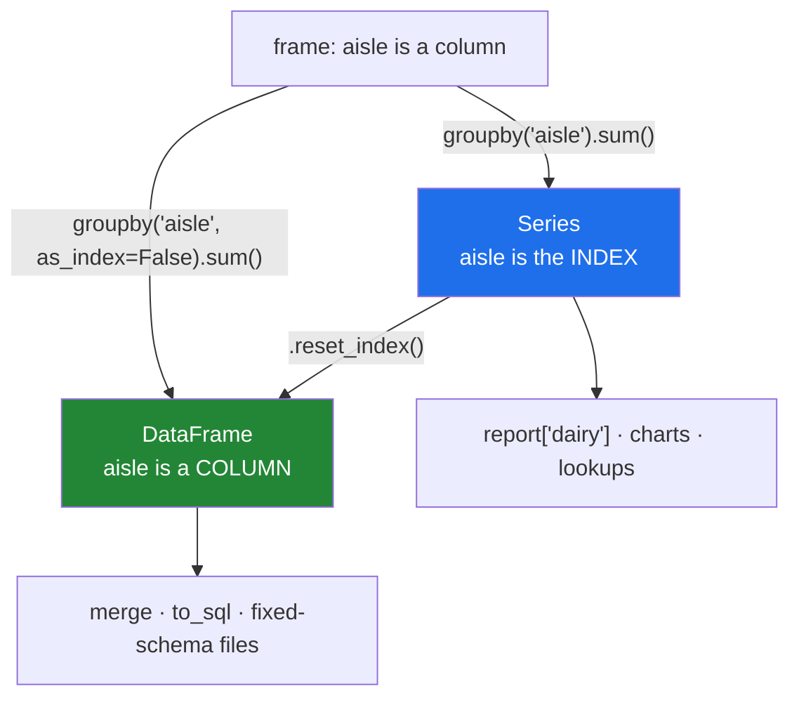

# 4.1 — The key became the index

## One-line answer

After an aggregation the key you grouped by is no longer a column — it has become the result's
**index** — which is why `result["aisle"]` raises, and `as_index=False` or `reset_index()` is how you
get it back as a column.

---

## The story

The aisle totals come back on a scrap of paper and they look like this:

```
dairy   4.22
bakery  1.40
dry     2.05
```

Three rows, and each row has two things on it: a name on the left and a number on the right. Anybody
would call that a table with two columns.

It is not, and the difference matters the moment somebody tries to do anything else with it. The
names on the left are **labels** — they are what each row is *called*, the same way the milk line was
called row 0 on the original list. The number on the right is the only actual column.

Nobody notices until they try to sort the sheet by aisle name and find there is no aisle column to
sort by, or tries to paste it into a spreadsheet next to another sheet and finds the names do not
come along, or asks for "the aisle column" and is told there isn't one.

The names are right there on the page. They are just not in a column, and pandas is precise about the
difference in a way that a piece of paper is not.

---

## The idea in plain language

The **index** is what pandas calls the row labels — the thing down the left-hand side that names each
row ([Day 26, 1.2](../../../day-26-frames-and-copy-on-write/parts/01-the-two-objects/1.2-the-index-is-not-a-row-number.md)).
On the original shopping frame it was `0, 1, 2, 3`; on a frame read from a file it might be a customer
ID or a date.

When you aggregate, **the group key becomes the index of the result.** That is a deliberate choice,
and it is the right one for the shape: the result has one row per group, so the natural name for each
row is the group it describes. It is also what makes a lookup work — `report["dairy"]` on a Series
indexed by aisle gives you the dairy total, immediately, without a search.

The consequence is that the key is no longer a column, so:

- `report["aisle"]` raises `KeyError`, because `aisle` is not a column name — it is the *name of the
  index*.
- `report.columns` does not contain `aisle`.
- Writing the result to a CSV loses the key unless you write the index too — and `to_csv` writes the
  index by default, which is one of the few places pandas' default does the helpful thing
  ([Day 27, 1.7](../../../day-27-reading-and-writing/parts/01-the-csv/1.7-to-csv-and-what-it-throws-away.md)).

There are two ways to get the key back into a column, and they are the same thing said at different
moments:

- **`as_index=False` on the `groupby` call** — *never put the key in the index in the first place.*
  The result is a plain frame with the key as an ordinary column and a fresh `0, 1, 2` row index.
- **`.reset_index()` on the result** — *move the index into a column afterwards.* Same output; the
  decision is made one line later.

Prefer `as_index=False` when you know from the start that the result is going onward — into a merge
([Day 32](../../../day-32-joining-and-reshaping/parts/02-merging/2.1-the-key-and-the-rows-it-pairs.md)),
into a chart, into a file with a fixed schema. Prefer the index form when the result is a lookup
table you are about to index into, or a chart whose axis should be the key, because the index *is* the
axis.

One more form is worth knowing now because it appears in real code and looks strange:
**`frame.groupby(other_series)`**. You can group by a Series that is not a column of the frame, as
long as it shares the frame's index. That is how you group a column by something you computed on the
fly — `shop.groupby(shop["aisle"].fillna("unknown"))` — and it is the only way to group a Series that
has no frame of its own, which [3.2](../03-transform/3.2-the-share-of-the-aisle.md) already used for
its check.

---

## Why Setu needs it

- **[4.4](4.4-two-keys-and-the-multiindex.md)** groups by two keys, and the result's index gains two
  levels — the same idea, doubled, and much more confusing if this part has not landed.
- **[3.3](../03-transform/3.3-transform-and-agg-the-shape-rule.md)** showed a column of blanks from
  assigning an aggregation back to a frame. The reason is exactly this: the result's index is aisle
  names and the frame's is row numbers.
- **[6.1](../06-the-module/6.1-the-grouping-module.md)** has to decide, once, which form the module's
  report function returns — and document it, because callers cannot tell by looking.
- **Day 32** merges a summary back onto a detail table, and a merge joins on **columns** by default, so
  the key has to be one.
- **Day 42** loads results into Postgres, where an index is not a concept: a table has columns, and
  anything that must survive the trip has to be one.

---

## The mechanism

A five-line shop, with a shop name as well as an aisle:

```python
import pandas as pd

shop = pd.DataFrame(
    {
        "item": ["milk", "bread", "eggs", "rice", "tea"],
        "aisle": ["dairy", "bakery", "dairy", "dry", None],
        "shop": ["main", "main", "corner", "main", "corner"],
        "need": [2, 1, 6, 1, 1],
        "price": [1.15, 1.40, 0.32, 2.05, 3.10],
    }
)
shop["spend"] = shop["need"] * shop["price"]

report = shop.groupby("aisle")["spend"].sum()
print(report)
print()
print("index name  :", report.index.name)
print("index values:", report.index.tolist())
print("is it a Series?", isinstance(report, pd.Series))
```

**Line by line:**

- The `tea` row has `None` for its aisle. It is there for
  [4.3](4.3-dropna-and-the-rows-that-vanished.md) and it is worth noticing now: **it is not in the
  report below**, and nothing says so.
- `report.index.name` is `aisle`. The key's name survived — it just moved from being a column heading
  to being the index's name, which is why the printout has `aisle` above the labels.
- `report.index.tolist()` gives the three aisle names. They exist, they are addressable, and they are
  not a column.
- The result is a **Series**, not a frame, because one column was aggregated. A Series has an index
  and values and no column names at all, which makes "the key is not a column" unavoidable rather than
  merely true.

```text
aisle
bakery    1.40
dairy     4.22
dry       2.05
Name: spend, dtype: float64

index name  : aisle
index values: ['bakery', 'dairy', 'dry']
is it a Series? True
```

What the index buys you — instant lookup:

```python
print("dairy total:", report["dairy"])
print("in order   :", report.loc[["dairy", "bakery"]].to_dict())
```

**Line by line:**

- `report["dairy"]` is a label lookup, the `loc`-style access from
  [Day 28, 1.2](../../../day-28-selection-and-alignment/parts/01-label-and-position/1.2-loc-by-label.md).
  On a Series, single brackets with a label do what `loc` does.
- `report.loc[["dairy", "bakery"]]` takes a **list** of labels and returns them in the order asked
  for, which is how you put a report into a fixed order for display without sorting it.
- This is the case where the index form is the right one. If the next thing you do is look things up
  by key, having the key as the index is the whole point.

```text
dairy total: 4.22
in order   : {'dairy': 4.22, 'bakery': 1.4}
```

And the two ways to get a column back:

```python
print(shop.groupby("aisle", as_index=False)["spend"].sum())
print()
print(shop.groupby("aisle")["spend"].sum().reset_index())
```

**Line by line:**

- `as_index=False` produces a **DataFrame** with two columns, `aisle` and `spend`, and a fresh
  `0, 1, 2` index. Note the type change: the same aggregation that gave a Series now gives a frame,
  because a frame is the only thing that can hold two columns.
- `.reset_index()` takes the Series, moves its index into a column named after the index, and gives
  the result a fresh integer index. The output is identical.
- **The two are interchangeable and are not the same decision.** `as_index=False` says "I never wanted
  the index form"; `reset_index()` says "I wanted it, and now I am done with it". Reading code, the
  first tells you the author knew where the result was going.
- `reset_index(drop=True)` exists and **throws the key away**. It is occasionally what you want and it
  is a common typo-by-habit; if a key disappears from a pipeline, this is the line to look for.

```text
    aisle  spend
0  bakery   1.40
1   dairy   4.22
2     dry   2.05

    aisle  spend
0  bakery   1.40
1   dairy   4.22
2     dry   2.05
```

Grouping by something that is not a column:

```python
print(shop.groupby(shop["aisle"].fillna("unknown"))["spend"].sum())
```

**Line by line:**

- The argument is a **Series**, not a string. pandas aligns it against the frame by index and uses its
  values as the key.
- `.fillna("unknown")` turns the blank aisle into a real category before grouping, which is one answer
  to [4.3](4.3-dropna-and-the-rows-that-vanished.md)'s problem — the tea row now appears, under
  `unknown`, and the total is complete.
- The index of the result is still named `aisle`, because the Series carried its name along.
- This form is what you need when the key is computed rather than stored: a month extracted from a
  date, a bucket derived from a number, a cleaned-up version of a messy column.

```text
aisle
bakery     1.40
dairy      4.22
dry        2.05
unknown    3.10
Name: spend, dtype: float64
```



---

## When it breaks

**Asking for the key as a column:**

```text
$ uv run python -c "
import pandas as pd
shop = pd.DataFrame({'aisle': ['dairy', 'bakery', 'dairy'], 'spend': [2.30, 1.40, 1.92]})
report = shop.groupby('aisle')['spend'].sum()
print(report)
print(report['aisle'])
"
```

```text
aisle
bakery    1.40
dairy     4.22
Name: spend, dtype: float64
Traceback (most recent call last):
  File "<string>", line 5, in <module>
KeyError: 'aisle'
```

**What it means.** The word `aisle` is printed at the top of the output, which is what makes the error
confusing — it is the *index's name*, not a column. On a Series, `report["dairy"]` works and
`report["aisle"]` does not, because the brackets look up **labels**, and `aisle` is not one of them.
The fix is `report.index` if you want the labels, or `reset_index()` if you want a column.

**The `drop=True` that ate the key:**

```text
$ uv run python -c "
import pandas as pd
shop = pd.DataFrame({'aisle': ['dairy', 'bakery', 'dairy'], 'spend': [2.30, 1.40, 1.92]})
print(shop.groupby('aisle')['spend'].sum().reset_index(drop=True))
"
```

```text
0    1.40
1    4.22
Name: spend, dtype: float64
```

**What it means.** Two totals and no way of knowing which aisle either belongs to. `drop=True` means
"discard the index rather than making it a column", and it is the right argument after a filter, when
the old row numbers are meaningless. Here it destroys the only thing that made the numbers
interpretable — **and it does not raise**, so the result flows downstream as a pair of anonymous
numbers.

**Grouping by a Series with a different index:**

```text
$ uv run python -c "
import pandas as pd
shop = pd.DataFrame({'spend': [2.30, 1.40, 1.92]}, index=[10, 11, 12])
keys = pd.Series(['dairy', 'bakery', 'dairy'])
print(shop.groupby(keys)['spend'].sum())
"
```

```text
Series([], Name: spend, dtype: float64)
```

**What it means.** The frame's index is `10, 11, 12` and the key Series' is `0, 1, 2`. pandas aligns
them, nothing matches, every row's key is blank, the default `dropna=True` deletes them all, and the
result is empty. **No error.** This is the alignment rule from
[Day 28, 4.2](../../../day-28-selection-and-alignment/parts/04-alignment/4.2-alignment-is-automatic.md)
doing exactly what it always does, in a place where people do not expect it. If you group by an
external Series, it must carry the frame's index — build it *from* the frame, and the problem cannot
arise.

---

## In production

**What a professional writes instead of the teaching version.** The shape of a summary function's
result is part of its contract, so it is stated in the name, the return type and the docstring, and
the key is always a column:

```python
import pandas as pd


def spend_by(frame: pd.DataFrame, by: list[str]) -> pd.DataFrame:
    """Total spend per group, with the keys as ordinary columns.

    Returns a tidy frame: one row per group, keys first, then the measures. Never
    an index-keyed Series — every consumer of this (merge, to_sql, plotting, JSON)
    wants columns.
    """
    absent = sorted(set([*by, "spend"]) - set(frame.columns))
    if absent:
        raise KeyError(f"frame has no columns {absent}")

    out = frame.groupby(by, observed=True, dropna=False, as_index=False).agg(
        lines=("spend", "size"), total=("spend", "sum")
    )
    assert list(out.columns[: len(by)]) == list(by), "keys must come first"
    return out
```

**Line by line:**

- The docstring's second paragraph says **what the function does not return**, which is the part a
  caller cannot see from the signature and the part that causes the `KeyError` above.
- `as_index=False` rather than a trailing `.reset_index()`: the decision is made where the grouping
  happens, and there is no intermediate object in the index form for somebody to accidentally return.
- `-> pd.DataFrame` in the signature. With `as_index=True` and a single aggregated column the return
  type would be `pd.Series`, and a function whose return *type* depends on its arguments is one that
  every caller has to guess about.
- The `assert` on column order encodes the tidy-frame convention: keys on the left, measures on the
  right. It costs nothing and it catches the day somebody reorders the `agg` call.
- `dropna=False` so rows with a blank key are not silently deleted
  ([4.3](4.3-dropna-and-the-rows-that-vanished.md)), and `observed=True` so a categorical key does not
  produce a row per unseen category ([4.5](4.5-observed-and-the-aisle-nobody-visited.md)).

**What changes at scale.** The index form and the column form cost the same to produce; the difference
is what happens next. An index is a lookup structure — pandas can find a label in it quickly, and on a
sorted index it can slice ranges — so a report you will query repeatedly is genuinely better indexed.
A column is what every boundary wants: a merge joins on columns
([Day 32](../../../day-32-joining-and-reshaping/parts/02-merging/2.1-the-key-and-the-rows-it-pairs.md)),
`to_sql` writes columns, Parquet stores columns, JSON has keys and no index, and a chart library takes
a column name. **The rule that survives is: keep the index form inside a function and hand back
columns.** Every crossing of a boundary with an index attached is a place where somebody later writes
`reset_index()` to undo it, or worse, loses the key by writing the file without it.

**The failure mode that only appears with real data.** A summary is written to Parquet with the key in
the index. Parquet does store a pandas index, in metadata, and a different tool reading the same file
— DuckDB, Spark, a Java service — sees a table with one column called `spend` and no aisle anywhere.
The file is not corrupt and the data is not lost; it is simply in a place that only pandas knows to
look. This is why the boundary rule above is worth being firm about, and it is a genuinely common way
for a dataset to become unusable to the team that did not produce it.

**The review comment a senior engineer leaves.** *"`spend_by` returns a Series keyed by aisle, so the
merge on line 60 does not see an `aisle` column and silently produces a cross join. Please pass
`as_index=False` and return a frame — and say so in the docstring, because two callers have already
written `.reset_index()` right after this."*

**The interview question.** *"After `df.groupby('x').sum()`, how do you get `x` back as a column?"*
`as_index=False` on the group-by, or `.reset_index()` on the result — the key became the index, which
is why `result["x"]` raises. The follow-up: *"when would you want the index form?"* When the result is
a lookup table you will index into by key, or a chart whose x-axis is the key; and you would move to
the column form at any boundary — a merge, a database write, a JSON response — because none of those
have a concept of an index.

---

## Check yourself

```bash
uv run python -c "
import pandas as pd
shop = pd.DataFrame({
    'aisle': ['dairy', 'bakery', 'dairy', 'dry'],
    'spend': [2.30, 1.40, 1.92, 2.05],
})
series = shop.groupby('aisle')['spend'].sum()
frame  = shop.groupby('aisle', as_index=False)['spend'].sum()
print('series type  :', type(series).__name__)
print('frame  type  :', type(frame).__name__)
print('series index :', series.index.name, series.index.tolist())
print('frame columns:', list(frame.columns))
print('lookup       :', series['dairy'])
print('frame lookup :', frame.loc[frame['aisle'] == 'dairy', 'spend'].item())
"
```

The last two lines get the same number in two very different ways. Say which one you would rather
write if you had to do it a thousand times, and why.

**Answer out loud, without scrolling up:**

> Say where the group key goes after an aggregation, and say what `result["aisle"]` does as a result.
> Then name the two ways to get it back as a column, and say which one you would use when the result
> is about to be merged.

---

**Next:** [4.2 — `sort` and the order of the groups](4.2-sort-and-the-order-of-the-groups.md).
