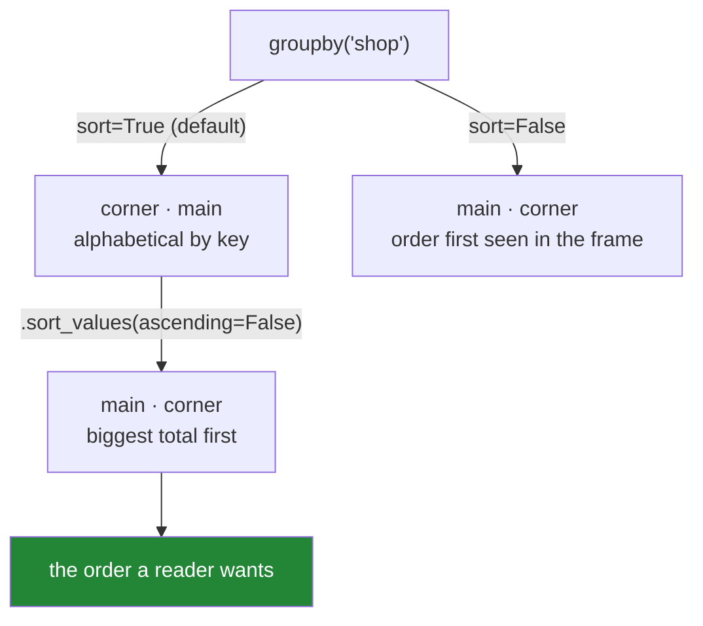

# 4.2 — `sort`, and the order of the groups

## One-line answer

`groupby` sorts the groups by key before returning them, which is why your report comes back in
alphabetical order rather than in the order things happened — and `sort=False` gives you first-seen
order instead, which is faster and is **not** the same as the order of the original rows.

---

## The story

The month's shopping goes into a report: the main shop and the corner shop, side by side, with what
each one came to.

The person writing it thinks of it in a particular order. The main shop is the big weekly one, it is
where most of the money goes, and it comes first in every conversation about the shopping. The corner
shop is the late-night top-up.

The report comes back with the corner shop on top.

Nothing is wrong with the numbers. The computer put the groups in alphabetical order, because
`corner` comes before `main`, and nobody asked it to do anything else. It is a perfectly reasonable
default and it is not the order anybody in the flat thinks in.

The bit that actually causes trouble is smaller and later. Somebody makes a second report — spend by
shop and by week — and pastes the two side by side, assuming the rows line up. In one of them the
shops came out alphabetically and in the other, built a slightly different way, they came out in the
order they first appear in the data. The two lists have the same two names in different orders, and
the numbers get read across the wrong rows.

---

## The idea in plain language

`groupby` has a `sort` argument and it defaults to `True`. That means **the groups in the result are
ordered by key**, ascending — alphabetically for text, numerically for numbers, chronologically for
dates.

It is worth being precise about what is being sorted. Not the rows: the rows inside each group keep
their original relative order. Only the **groups** are ordered, which is to say the index of the
result ([4.1](4.1-the-key-became-the-index.md)).

`sort=False` turns it off, and what you get instead is **first-seen order**: the groups appear in the
order their first row appears in the frame. That is a genuinely different thing from "the order of the
rows", and confusing the two is the mistake this part exists to prevent. If the frame is sorted by
date, first-seen order is the order each group first shows up in time — often exactly what you want
for a timeline, and never the same as sorting by key.

Three reasons to care:

- **Reports are read by people, and order carries meaning.** Alphabetical is a fine default and it is
  rarely the most useful. Sorting by the value — biggest spend first — is what a reader almost always
  wants, and that is `.sort_values(ascending=False)` **after** the aggregation
  ([Day 29, 4.1](../../../day-29-iteration-and-order/parts/04-sorting/4.1-sort-values-the-order-you-asked-for.md)),
  not an argument to `groupby`.
- **`sort=False` is faster.** Sorting the group keys costs something, and on a key with a very large
  number of distinct values — a customer ID, a session ID — it can be a noticeable share of the
  operation. If you are going to sort the result differently anyway, sorting it twice is waste.
- **Two results are only comparable if their order is defined.** The failure in the story is two
  reports whose rows were assumed to correspond. The defence is not to compare by position at all: use
  the index ([4.1](4.1-the-key-became-the-index.md)), which pandas will align for you, and let
  alignment do the matching rather than your eyes
  ([Day 28, 4.2](../../../day-28-selection-and-alignment/parts/04-alignment/4.2-alignment-is-automatic.md)).

One special case matters and comes back in [4.5](4.5-observed-and-the-aisle-nobody-visited.md). If the
key is a **categorical** column with a declared order — Day 34's `category` dtype — then `sort=True`
uses **the category's own order**, not alphabetical. That is how you get a report with `low`, `medium`,
`high` in the sensible order rather than `high`, `low`, `medium`, and it is the cleanest answer to the
story's complaint.

---

## Why Setu needs it

- **[4.1](4.1-the-key-became-the-index.md)** established that the key becomes the index. This part is
  about what order that index comes out in.
- **[4.4](4.4-two-keys-and-the-multiindex.md)** sorts on two levels at once, and the interaction is
  worth having seen on one level first.
- **[4.5](4.5-observed-and-the-aisle-nobody-visited.md)** is where a categorical key changes the answer
  to this question entirely.
- **Day 34** introduces the `category` dtype and its declared order, which is the proper fix for
  "alphabetical is the wrong order for this key".
- **Day 37** is about choosing a chart, where the order of the bars is a real decision — and a bar
  chart in alphabetical order is one of the commonest ways a chart fails to say anything.

---

## The mechanism

The five-line shop, grouped by which shop it came from:

```python
import pandas as pd

shop = pd.DataFrame(
    {
        "item": ["milk", "bread", "eggs", "rice", "tea"],
        "aisle": ["dairy", "bakery", "dairy", "dry", "dry"],
        "shop": ["main", "main", "corner", "main", "corner"],
        "need": [2, 1, 6, 1, 1],
        "price": [1.15, 1.40, 0.32, 2.05, 3.10],
    }
)
shop["spend"] = shop["need"] * shop["price"]

print("sort=True (the default):")
print(shop.groupby("shop")["spend"].sum())
print()
print("sort=False:")
print(shop.groupby("shop", sort=False)["spend"].sum())
```

**Line by line:**

- The first row of the frame is `main`, so `main` is the first shop *seen*. It is not the first shop
  *alphabetically*, which is what makes this example show the difference at all.
- `sort=True` gives `corner` then `main` — alphabetical, and the opposite of how anybody in the flat
  would list them.
- `sort=False` gives `main` then `corner` — first-seen order, because the milk row comes first and it
  is a main-shop row.
- **The numbers are identical in both.** Only the order of the two lines changed, which is exactly why
  this is easy to miss until two results get compared by position.

```text
sort=True (the default):
shop
corner    5.02
main      5.75
Name: spend, dtype: float64

sort=False:
shop
main      5.75
corner    5.02
Name: spend, dtype: float64
```

The order a reader actually wants — biggest first:

```python
print(shop.groupby("shop")["spend"].sum().sort_values(ascending=False))
```

**Line by line:**

- `.sort_values(ascending=False)` runs **on the result**, after the aggregation, because the thing
  being sorted is the total and the total does not exist until the aggregation has happened. There is
  no `groupby` argument that can do this.
- `ascending=False` puts the largest first, which is the convention for any "top spenders" or
  "biggest contributors" table.
- A tie here would be broken by whatever order the values arrived in, which is the determinism problem
  from [Day 29, 4.2](../../../day-29-iteration-and-order/parts/04-sorting/4.2-the-tie-that-broke-the-report.md):
  if two shops spent the same, the report's order is decided by the sort algorithm rather than by
  you. On a report that matters, add the key as a tie-breaker.

```text
shop
main      5.75
corner    5.02
Name: spend, dtype: float64
```

And the thing that makes order stop mattering — letting alignment do the comparing:

```python
totals = shop.groupby("shop")["spend"].sum()
lines = shop.groupby("shop", sort=False)["spend"].size()

print("totals order:", totals.index.tolist())
print("lines  order:", lines.index.tolist())
print()
print(pd.DataFrame({"total": totals, "lines": lines}))
```

**Line by line:**

- The two results are built with **different `sort` settings on purpose**, so their indexes are in
  different orders. This is the story's situation, reproduced.
- Building a frame from a dictionary of Series aligns them **by index label**, not by position
  ([Day 28, 4.2](../../../day-28-selection-and-alignment/parts/04-alignment/4.2-alignment-is-automatic.md)).
  `corner`'s total meets `corner`'s line count regardless of which order either arrived in.
- **This is why the index form from [4.1](4.1-the-key-became-the-index.md) is safe and comparing by
  position is not.** Had these been two lists of numbers, or two frames with `as_index=False` pasted
  side by side, the mismatch would have been silent.
- The result comes out in the first Series' order, which is `totals`' alphabetical one.

```text
totals order: ['corner', 'main']
lines  order: ['main', 'corner']

        total  lines
shop
corner   5.02      2
main     5.75      3
```



---

## When it breaks

**Comparing two results by position:**

```text
$ uv run python -c "
import pandas as pd
shop = pd.DataFrame({
    'shop':  ['main', 'main', 'corner', 'main', 'corner'],
    'spend': [2.30, 1.40, 1.92, 2.05, 3.10],
})
totals = shop.groupby('shop', as_index=False)['spend'].sum()
lines  = shop.groupby('shop', as_index=False, sort=False)['spend'].size()
print(totals)
print(lines)
print()
print('pasted by position:')
print(pd.DataFrame({'shop': totals['shop'], 'total': totals['spend'], 'lines': lines['size']}))
"
```

```text
     shop  spend
0  corner   5.02
1    main   5.75
     shop  size
0    main     3
1  corner     2

pasted by position:
     shop  total  lines
0  corner   5.02      3
1    main   5.75      2
```

**What it means.** Read the last table. The corner shop has two lines and the main shop has three, and
the table says the opposite — because both frames were reset to a `0, 1` index and the columns were
pasted by position. **No error.** The lists have the same names and the same length, which is exactly
what makes it survive a glance. The fix is either to keep the key as the index and let alignment do
the work, or to `merge` on the key explicitly
([Day 32](../../../day-32-joining-and-reshaping/parts/02-merging/2.1-the-key-and-the-rows-it-pairs.md)) —
never to assume two group-bys came out in the same order.

**Assuming `sort=False` means "original row order":**

```text
$ uv run python -c "
import pandas as pd
shop = pd.DataFrame({
    'shop':  ['main', 'corner', 'main', 'corner'],
    'spend': [2.30, 1.92, 1.40, 3.10],
})
print('rows in this order :', shop['shop'].tolist())
print('sort=False groups  :', shop.groupby('shop', sort=False)['spend'].sum().index.tolist())
print('group sizes        :', shop.groupby('shop', sort=False)['spend'].size().to_dict())
"
```

```text
rows in this order : ['main', 'corner', 'main', 'corner']
sort=False groups  : ['main', 'corner']
group sizes        : {'main': 2, 'corner': 2}
```

**What it means.** Four rows alternate between the two shops, and the result has two rows in
first-seen order. `sort=False` does not mean "leave the rows alone" — the rows are gone, the groups
are what is left, and their order is the order each group *first appeared*. That is well defined and
useful, and it is not the same sentence as "the original order", which is what people usually mean
when they reach for the argument.

**A tie in the sorted report:**

```text
$ uv run python -c "
import pandas as pd
a = pd.DataFrame({'shop': ['main', 'corner'], 'spend': [5.0, 5.0]})
b = pd.DataFrame({'shop': ['corner', 'main'], 'spend': [5.0, 5.0]})
print('from a:', a.groupby('shop')['spend'].sum().sort_values(ascending=False).index.tolist())
print('from b:', b.groupby('shop')['spend'].sum().sort_values(ascending=False).index.tolist())
"
```

```text
from a: ['corner', 'main']
from b: ['corner', 'main']
```

**What it means.** Here the two agree, and that agreement is luck rather than a guarantee — the
group-by sorted the keys first, so both went into `sort_values` in the same order, and pandas'
default sort happens to leave equal values where it found them for this input. On a larger frame the
sort algorithm's behaviour on ties is not something to rely on
([Day 29, 4.2](../../../day-29-iteration-and-order/parts/04-sorting/4.2-the-tie-that-broke-the-report.md)).
If a "top N" report can tie, add the key as a second sort level so the answer is decided by you:
`.sort_values(ascending=False).sort_index(kind="stable")` is one way, and sorting a `reset_index()`
frame by `["spend", "shop"]` is clearer.

---

## In production

**What a professional writes instead of the teaching version.** The order a report comes out in is a
decision, stated once, and never left to a default:

```python
import pandas as pd


def spend_report(
    frame: pd.DataFrame,
    by: str,
    top: int | None = None,
) -> pd.DataFrame:
    """Spend per group, largest first, ties broken by key so the order is deterministic."""
    out = (
        frame.groupby(by, observed=True, dropna=False, sort=False)
        .agg(lines=("spend", "size"), total=("spend", "sum"))
        .reset_index()
        .sort_values(["total", by], ascending=[False, True], kind="stable")
        .reset_index(drop=True)
    )
    return out if top is None else out.head(top)
```

**Line by line:**

- `sort=False` on the group-by, because the result is about to be sorted differently anyway. Sorting
  the keys and then throwing that order away is pure waste, and on a high-cardinality key it is
  measurable.
- `.reset_index()` moves the key into a column so it can be used as a **sort key**
  ([4.1](4.1-the-key-became-the-index.md)). Sorting by a mixture of the index and a column is
  possible and reads badly.
- `sort_values(["total", by], ascending=[False, True])` — the total descending, then the key
  ascending. **The second key is the tie-breaker**, and without it two groups with equal totals swap
  places between runs, which is the determinism failure from
  [Day 29, 4.2](../../../day-29-iteration-and-order/parts/04-sorting/4.2-the-tie-that-broke-the-report.md).
- `kind="stable"` so that rows equal on *both* keys keep their relative order. With a unique key that
  cannot happen, and stating it costs nothing and survives somebody later making the key non-unique.
- The final `.reset_index(drop=True)` throws away the row numbers left over from the sort, so the
  output's index is `0, 1, 2 …` in the report's own order. This is the one place `drop=True` is right:
  the discarded labels are positions from before the sort and mean nothing.
- `top: int | None = None` with `.head(top)` at the end, because "the biggest five" is the request
  ninety per cent of the time and doing it inside the function guarantees it is applied *after* the
  sort.

**What changes at scale.** Sorting group keys is `O(k log k)` in the number of distinct keys, which is
free when there are three aisles and real when there are ten million session IDs — that is the case
where `sort=False` genuinely matters, and where pandas' hash-based grouping without a sort is
noticeably quicker. The larger production concern is not speed but **stability**: a report whose row
order changes between runs for no reason produces diffs full of noise, breaks any test that compares
output files, and makes people distrust the pipeline. Every published ordering should be total —
sorted on enough keys that no two rows can tie — and that is a discipline, not a default.

**The failure mode that only appears with real data.** A report is sorted by a total, two groups tie
exactly, and their order flips between two runs of the same code on the same data because the
underlying group-by returned them in a different order after an unrelated upstream change. The
downstream consumer takes "the top group" and gets a different answer on Tuesday. Nothing is broken
and nothing errors; the report simply was not deterministic, and nobody noticed until the tie
happened. Exact ties are much more common than people expect on rounded money and on small counts.

**The review comment a senior engineer leaves.** *"This sorts by total with no tie-breaker, and about
forty of our merchants have identical monthly totals. Add the key as a second sort level so the output
file is byte-identical between runs — the daily diff is currently unreadable."*

**The interview question.** *"What order do `groupby` results come back in?"* Sorted by key ascending
by default, which is alphabetical for text; `sort=False` gives first-seen order instead and is faster,
especially on a high-cardinality key. The follow-up: *"how do you get the biggest group first?"* Sort
the result after aggregating — there is no `groupby` argument for it, because the value being sorted
on does not exist until the aggregation has run — and add the key as a tie-breaker so the order is
deterministic.

---

## Check yourself

```bash
uv run python -c "
import pandas as pd
shop = pd.DataFrame({
    'shop':  ['main', 'main', 'corner', 'main', 'corner'],
    'spend': [2.30, 1.40, 1.92, 2.05, 3.10],
})
print('sorted    :', shop.groupby('shop')['spend'].sum().index.tolist())
print('first-seen:', shop.groupby('shop', sort=False)['spend'].sum().index.tolist())
print('by value  :', shop.groupby('shop')['spend'].sum().sort_values(ascending=False).index.tolist())
print()
totals = shop.groupby('shop')['spend'].sum()
lines  = shop.groupby('shop', sort=False)['spend'].size()
print('totals idx:', totals.index.tolist())
print('lines  idx:', lines.index.tolist())
print(pd.DataFrame({'total': totals, 'lines': lines}))
"
```

The last two Series came out in opposite orders and the table built from them is still correct. Say
what did the matching, and say what would have gone wrong if both had been reset to a `0, 1` index
first.

**Answer out loud, without scrolling up:**

> Say what order `groupby` returns its groups in by default, and what `sort=False` gives you instead —
> being careful about the difference between "first-seen order" and "the original row order". Then say
> where you would sort a report by its totals, and why it cannot be an argument to `groupby`.

---

**Next:** [4.3 — `dropna` and the rows that vanished](4.3-dropna-and-the-rows-that-vanished.md).
