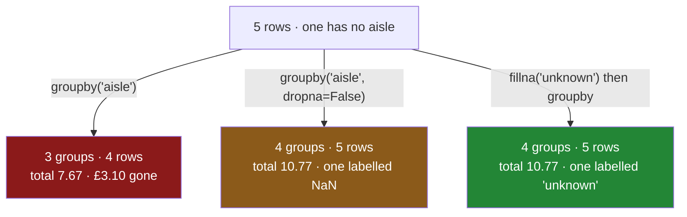

# 4.3 — `dropna`, and the rows that vanished

## One-line answer

`groupby` deletes every row whose **key** is blank, silently, by default — so a total computed from
the groups can be smaller than the total computed from the frame, and nothing in the result says how
many rows are missing or why.

---

## The story

Five things in the shop this week, and the aisle got written down for four of them. The tea went in
during a phone call and nobody typed which aisle it came from.

The aisle totals come back: dairy four twenty-two, bakery one forty, dry two oh five. Add those up and
you get seven pounds sixty-seven.

The shop cost ten pounds seventy-seven.

There is three pounds ten missing, and it is the tea, and there is nothing on the report that hints at
it. Not a footnote, not a blank row, not an "unknown" line. The tea is simply not in the summary,
because it had no aisle to be summarised under, and the report has no way of saying "and one thing I
could not place".

The reason this is worse than an ordinary missing value is that **the row was complete**. The tea has
a name, a quantity, a price and a spend. Everything about it is known except one label — and that one
label is the one that decided whether it appeared at all.

---

## The idea in plain language

`groupby` has a `dropna` argument, and it defaults to `True`. That means: **rows whose key is blank
are removed before the grouping happens.** They are not put in a group of their own, they are not
counted anywhere, and they are not reported.

It is worth being clear that this is about the **key**, not about the values. Day 30 was about blanks
in the column you are measuring, where `sum` skips them and `count` reports them
([Day 30, 1.1](../../../day-30-missing-data/parts/01-what-missing-means/1.1-the-price-nobody-wrote-down.md)).
This is a blank in the column you are grouping *by*, and the consequence is a whole row disappearing
rather than one value being ignored.

`dropna=False` keeps them, as a group whose key is `NaN`. The tea gets its own line and the totals add
up again.

Three things make the default dangerous:

- **The loss is invisible in the output.** An aggregation returns one row per group, so a report with
  three aisles looks exactly the same whether the fourth row existed or not. Compare with
  [Day 30, 4.1](../../../day-30-missing-data/parts/04-dropping/4.1-dropna-and-the-rows-that-left.md),
  where at least the frame got shorter and you could count it.
- **It breaks the arithmetic silently.** The sum of the group totals no longer equals the total of the
  column. That is a one-line check and it is the only reliable detector.
- **A key is much more likely to be blank than people assume.** Keys are usually categories, codes,
  foreign keys or labels — exactly the fields that go missing when an upstream system changes, when a
  record is new, or when a lookup fails. A blank key often *means* something specific ("not yet
  classified", "no match found") and deleting it deletes the finding.

The same thing happens with two keys, and it gets worse:
[4.4](4.4-two-keys-and-the-multiindex.md) groups by shop **and** aisle, and a row is dropped if
**either** key is blank. With five keys and a small blank rate in each, the arithmetic is the same as
Day 30's wide-frame `dropna` — a row survives only if every key is present
([Day 30, 4.1](../../../day-30-missing-data/parts/04-dropping/4.1-dropna-and-the-rows-that-left.md)).

There are three reasonable responses, and picking one is the point:

1. **`dropna=False`** — keep the blanks as their own group. Honest, and the group is labelled `NaN`,
   which prints awkwardly and cannot be looked up by name.
2. **Fill the key first** — `frame["aisle"].fillna("unknown")` before grouping. The group gets a real
   name you can address, chart and sort. This is usually the best answer, and it is a decision
   recorded in the code.
3. **Refuse** — assert the key has no blanks and raise if it does. Right when a blank key means the
   data is broken rather than incomplete.

What is not reasonable is the default, chosen by not thinking about it.

---

## Why Setu needs it

- **[4.1](4.1-the-key-became-the-index.md)** already used `fillna("unknown")` before grouping, as a
  passing trick. This is why it was there.
- **[4.4](4.4-two-keys-and-the-multiindex.md)** multiplies the problem by the number of keys.
- **[6.1](../06-the-module/6.1-the-grouping-module.md)** sets `dropna=False` in the module's grouping
  helper and asserts the totals reconcile, which is this part turned into code.
- **[Day 30, 3.1](../../../day-30-missing-data/parts/03-why-it-is-missing/3.1-three-reasons-a-line-is-blank.md)**
  asked why values are missing. A blank *key* almost always has a reason — a failed lookup, a new
  category, a form field added last month — so the rows that vanish here are rarely a random sample.
- **Day 45** is the Phase 4 gate, where `audit()` must reconcile: the rows going in, the rows in every
  group, and the difference explained.

---

## The mechanism

Five lines, one of them without an aisle:

```python
import pandas as pd

shop = pd.DataFrame(
    {
        "item": ["milk", "bread", "eggs", "rice", "tea"],
        "aisle": ["dairy", "bakery", "dairy", "dry", None],
        "need": [2, 1, 6, 1, 1],
        "price": [1.15, 1.40, 0.32, 2.05, 3.10],
    }
)
shop["spend"] = shop["need"] * shop["price"]

print(shop.groupby("aisle")["spend"].sum())
print()
print("rows in the frame  :", len(shop))
print("rows in the groups :", int(shop.groupby("aisle")["spend"].size().sum()))
print("total of the column:", round(shop["spend"].sum(), 2))
print("total of the groups:", round(shop.groupby("aisle")["spend"].sum().sum(), 2))
```

**Line by line:**

- The `tea` row's aisle is `None`, which becomes a blank in a text column
  ([Day 30, 1.3](../../../day-30-missing-data/parts/01-what-missing-means/1.3-none-is-not-what-gets-stored.md)).
- The printed report has **three rows**, and there is nothing about it that looks incomplete.
- `size().sum()` adds up how many rows the groups account for. Four, out of five. **This is the
  check**: rows in against rows accounted for.
- The two totals are the other half of the same check — the column sums to `10.77` and the groups sum
  to `7.67`. A difference of `3.10`, which is the tea.
- Both checks are one line each and neither is run by anybody who has not been bitten.

```text
aisle
bakery    1.40
dairy     4.22
dry       2.05
Name: spend, dtype: float64

rows in the frame  : 5
rows in the groups : 4
total of the column: 10.77
total of the groups: 7.67
```

**`dropna=False` — keep them:**

```python
print(shop.groupby("aisle", dropna=False)["spend"].sum())
print("total of the groups:", round(shop.groupby("aisle", dropna=False)["spend"].sum().sum(), 2))
```

**Line by line:**

- `dropna=False` puts the blank-keyed rows into a group of their own, labelled `NaN`.
- The totals now reconcile: `10.77` both ways. **That is the property worth insisting on** — a
  grouping that loses money is a grouping that is lying.
- The `NaN` label is genuinely awkward. You cannot look it up with `report["NaN"]`, because the label
  is the float `nan` and `nan != nan`
  ([Day 30, 1.2](../../../day-30-missing-data/parts/01-what-missing-means/1.2-nan-the-number-not-equal-to-itself.md)).
  It sorts to the end, and it prints as `NaN` in a column of otherwise readable names.
- That awkwardness is the argument for the next block.

```text
aisle
bakery    1.40
dairy     4.22
dry       2.05
NaN       3.10
Name: spend, dtype: float64
total of the groups: 10.77
```

**Fill the key first — the version to actually write:**

```python
keyed = shop.assign(aisle=shop["aisle"].fillna("unknown"))
report = keyed.groupby("aisle")["spend"].sum()

print(report)
print()
print("unknown total:", report["unknown"])
print("reconciles   :", round(report.sum(), 2) == round(shop["spend"].sum(), 2))
```

**Line by line:**

- `.assign(aisle=...)` makes a new frame with the key filled, leaving `shop` untouched
  ([Day 28, 3.2](../../../day-28-selection-and-alignment/parts/03-writing/3.2-the-new-column-that-was-a-mask.md)).
  The original blank is preserved in `shop`, which matters if something later needs to know it was
  blank ([Day 30, 3.2](../../../day-30-missing-data/parts/03-why-it-is-missing/3.2-the-blank-that-is-itself-a-signal.md)).
- `"unknown"` is a real label. It can be looked up, sorted, charted and filtered, and a reader of the
  report can see immediately that there is a bucket for things nobody classified.
- The word matters: `"unknown"` says *we do not know*, which is different from `"other"` (*we know,
  and it is none of the above*). Choosing the wrong one of those makes a report say something false.
- `report.sum() == shop["spend"].sum()` is the reconciliation, written as an assertion you can read.
  Comparing rounded values rather than raw floats avoids the equality-on-floats trap
  ([Day 23, 1.6](../../../day-23-ufuncs-and-statistics/parts/01-ufuncs/1.6-isclose-and-allclose.md)).

```text
aisle
bakery     1.40
dairy      4.22
dry        2.05
unknown    3.10
Name: spend, dtype: float64

unknown total: 3.1
reconciles   : True
```



---

## When it breaks

**The report that does not add up, with no sign of it:**

```text
$ uv run python -c "
import pandas as pd
shop = pd.DataFrame({
    'aisle': ['dairy', 'bakery', 'dairy', 'dry', None],
    'spend': [2.30, 1.40, 1.92, 2.05, 3.10],
})
report = shop.groupby('aisle')['spend'].sum()
print(report.to_dict())
print('report total :', round(report.sum(), 2))
print('actual total :', round(shop['spend'].sum(), 2))
print('rows counted :', int(shop.groupby('aisle')['spend'].size().sum()), 'of', len(shop))
"
```

```text
{'bakery': 1.4, 'dairy': 4.22, 'dry': 2.05}
report total : 7.67
actual total : 10.77
rows counted : 4 of 5
```

**What it means.** Three lines of clean output and a twenty-nine per cent shortfall. **Nothing
raised**, nothing warned, and the report is internally consistent — its three numbers really do add to
7.67. On a real table with a hundred groups nobody adds the report up by hand, which is why the
reconciliation has to be a line of code rather than an intention.

**Looking up the `NaN` group:**

```text
$ uv run python -c "
import pandas as pd
shop = pd.DataFrame({
    'aisle': ['dairy', None, 'dry'],
    'spend': [2.30, 3.10, 2.05],
})
report = shop.groupby('aisle', dropna=False)['spend'].sum()
print(report)
print('labels:', report.index.tolist())
print(report['NaN'])
"
```

```text
aisle
dairy    2.30
dry      2.05
NaN      3.10
Name: spend, dtype: float64
labels: ['dairy', 'dry', nan]
Traceback (most recent call last):
  File "<string>", line 9, in <module>
KeyError: 'NaN'
```

**What it means.** The printout says `NaN` and the actual label is the float `nan` — a value, not a
string. `report["NaN"]` looks for a label spelled `N`, `a`, `N` and does not find it. Even
`report[float("nan")]` is unreliable, because `nan` does not equal itself
([Day 30, 1.2](../../../day-30-missing-data/parts/01-what-missing-means/1.2-nan-the-number-not-equal-to-itself.md)),
so the lookup depends on identity rather than equality. **A group you cannot address by name is a
group that is awkward for ever**, which is why filling the key with a real string first is the better
answer.

**Two keys, and a row that fails both times:**

```text
$ uv run python -c "
import pandas as pd
shop = pd.DataFrame({
    'shop':  ['main', 'main', None, 'corner'],
    'aisle': ['dairy', None, 'dry', 'dry'],
    'spend': [2.30, 1.40, 2.05, 3.10],
})
print('rows in       :', len(shop))
print('one key       :', int(shop.groupby('aisle')['spend'].size().sum()))
print('two keys      :', int(shop.groupby(['shop', 'aisle'])['spend'].size().sum()))
print('two, dropna=F :', int(shop.groupby(['shop', 'aisle'], dropna=False)['spend'].size().sum()))
"
```

```text
rows in       : 4
one key       : 3
two keys      : 2
two, dropna=F : 4
```

**What it means.** Four rows in. Grouping by one key loses one; grouping by two loses two, because a
row goes if **either** key is blank. That is the same multiplication as
[Day 30, 4.1](../../../day-30-missing-data/parts/04-dropping/4.1-dropna-and-the-rows-that-left.md)'s
wide-frame `dropna`, and it means a five-key group-by on a table where each key is one per cent blank
quietly loses about five per cent of the rows. **Half the table gone and no error**, and the more
detailed the breakdown, the worse it gets — which is the opposite of what anybody assumes.

---

## In production

**What a professional writes instead of the teaching version.** Grouping is wrapped so that the blank
keys are handled explicitly and the reconciliation is not optional:

```python
import logging

import pandas as pd

log = logging.getLogger(__name__)

UNKNOWN = "unknown"


def group_keys_ready(frame: pd.DataFrame, by: list[str], fill: str = UNKNOWN) -> pd.DataFrame:
    """Make every grouping key non-blank, logging how many rows needed it."""
    out = frame.copy()
    for column in by:
        blanks = int(out[column].isna().sum())
        if blanks:
            log.warning(
                "%s: %d of %d rows have no key; grouping them as %r", column, blanks, len(out), fill
            )
            out[column] = out[column].fillna(fill)
    return out


def reconciled_sum(frame: pd.DataFrame, by: list[str], value: str) -> pd.Series:
    """Total `value` per group, and refuse to return a report that loses money."""
    keyed = group_keys_ready(frame, by)
    report = keyed.groupby(by, observed=True, dropna=False)[value].sum(min_count=1)

    grouped_total = float(report.sum())
    column_total = float(frame[value].sum())
    if abs(grouped_total - column_total) > 1e-6:
        raise ValueError(
            f"grouping lost {column_total - grouped_total:.4f} of {value}: "
            f"{column_total:.4f} in the column, {grouped_total:.4f} across groups"
        )
    return report
```

**Line by line:**

- `UNKNOWN` is a module constant, so the same word is used everywhere and a report from one function
  can be joined to a report from another. Two functions that spell it `unknown` and `UNKNOWN` produce
  two buckets for the same thing.
- `group_keys_ready` **warns** rather than raising, because a blank key is usually a data-quality
  signal rather than a failure — but it warns every time, with counts, so the rate is visible in the
  logs and a change in it is noticeable.
- The loop fills each key column separately and only touches the ones that need it, so a frame with no
  blanks passes through without a copy of every column being rewritten.
- `dropna=False` is *still* passed to `groupby`, even though the keys have just been filled. It is
  belt and braces: if a new key column is added to `by` and the fill is skipped, the grouping keeps
  the rows and the reconciliation catches it, rather than the rows disappearing silently.
- `min_count=1` so an empty group sums to `NaN` rather than to a confident `0.00`
  ([2.2](../02-aggregating/2.2-size-counts-rows-count-counts-values.md)).
- The reconciliation compares floats with a **tolerance**, not with `==`, because summing the same
  numbers in a different order does not give bit-identical results
  ([Day 23, 2.6](../../../day-23-ufuncs-and-statistics/parts/02-statistics/2.6-float-summation-and-the-drift.md)).
- The error message gives both totals and the difference, because "the report is wrong" is not
  actionable and "£3.10 is missing" leads straight to the row.

**What changes at scale.** The cost of `dropna=False` is negligible — pandas has to keep a group for
the blank key rather than filtering it out, which is one extra group. The cost of *not* using it is a
class of bug that grows with the number of keys, and it is worst exactly where the data is most
valuable: fine-grained breakdowns by several dimensions, which are the reports people build dashboards
on. In a warehouse the same problem appears as `GROUP BY` on a nullable column, where SQL keeps NULL
as its own group rather than dropping it — **the SQL default is the opposite of pandas'**, which is a
genuine trap when the same analysis exists in both places and the two disagree by a few per cent that
nobody can account for.

**The failure mode that only appears with real data.** A new category appears upstream and the join
that maps it to a group key fails, so the key arrives blank for the new rows. The report keeps
rendering, the totals shrink slightly, and the shrinkage is attributed to a slow month. Because the
missing rows are all one category, the loss is not a random sample — it is exactly the growing part of
the business being deleted from the summary. This is
[Day 30, 3.1](../../../day-30-missing-data/parts/03-why-it-is-missing/3.1-three-reasons-a-line-is-blank.md)'s
second case, and the reconciliation check is what turns it from a mystery into a one-line alert.

**The review comment a senior engineer leaves.** *"`groupby('merchant_category')` drops rows where the
category is null, and we have about 2% nulls since the new onboarding flow. The dashboard has been
under-reporting all quarter. Fill the key with 'unknown' before grouping and assert the totals
reconcile."*

**The interview question.** *"What happens to rows with a missing group key in pandas?"* They are
dropped, silently, because `dropna` defaults to `True` — so the sum of the group totals can be less
than the total of the column with nothing in the output to indicate it. The follow-up worth being
ready for: *"how do you notice, and what do you do?"* Notice by reconciling — rows in against rows
accounted for, column total against group total. Fix by filling the key with an explicit label like
`unknown` before grouping, which is better than `dropna=False` because a `NaN` group label cannot be
looked up by name. And note that SQL's `GROUP BY` keeps NULLs as a group, so the same analysis in two
places will disagree.

---

## Check yourself

```bash
uv run python -c "
import pandas as pd
shop = pd.DataFrame({
    'item':  ['milk', 'bread', 'eggs', 'rice', 'tea'],
    'aisle': ['dairy', 'bakery', 'dairy', 'dry', None],
    'spend': [2.30, 1.40, 1.92, 2.05, 3.10],
})
default = shop.groupby('aisle')['spend'].sum()
kept    = shop.groupby('aisle', dropna=False)['spend'].sum()
filled  = shop.assign(aisle=shop['aisle'].fillna('unknown')).groupby('aisle')['spend'].sum()
print('default :', default.to_dict(), '->', round(default.sum(), 2))
print('dropna=F:', kept.to_dict(), '->', round(kept.sum(), 2))
print('filled  :', filled.to_dict(), '->', round(filled.sum(), 2))
print('column  :', round(shop['spend'].sum(), 2))
print('rows    :', len(shop), 'counted by default:', int(shop.groupby('aisle')['spend'].size().sum()))
"
```

Two of the three reports reconcile with the column total and one does not. Say which, and say what a
reader of the failing report would have to do to notice.

**Answer out loud, without scrolling up:**

> Say what `groupby` does by default with a row whose **key** is blank, and how that differs from what
> `sum()` does with a blank **value**. Then give the two-line check that catches it, and say why
> filling the key beats passing `dropna=False`.

---

**Next:** [4.4 — Two keys, and the MultiIndex](4.4-two-keys-and-the-multiindex.md).
