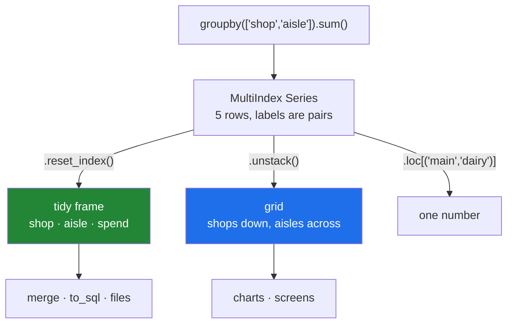

# 4.4 — Two keys, and the MultiIndex

## One-line answer

Grouping by a list of columns makes one group per **combination** of their values, and the result gets
an index with one level per key — which is a `MultiIndex`, and `reset_index()` or `unstack()` are the
two ways to turn it back into something ordinary.

---

## The story

Spend by aisle is useful. Spend by shop is useful. The question somebody actually asks is neither:
*how much did we spend on dairy at the corner shop?*

That is a question about a **pair**. Not "dairy", not "corner", but the crossing of the two, and there
is one number for every crossing that actually happened.

If you write it out on paper you would draw a grid. Aisles across the top, shops down the side, a
number in each cell. Some cells are empty, because nobody has ever bought bread at the corner shop.

Or you would write it as a list, one line per pair:

```
corner  dairy   1.92
corner  dry     3.10
main    bakery  1.40
main    dairy   2.30
main    dry     2.05
```

Both are the same information. The grid is easier to read across; the list is easier to add to and
easier to feed into anything else. Which of the two you get out of pandas is a choice, and the
default is the list — with the two key columns folded into the row labels rather than sitting in
columns of their own.

---

## The idea in plain language

`frame.groupby(["shop", "aisle"])` groups by **both**, and the groups are the *combinations of values
that occur*. Not every possible pair — only the ones present in the data. Two shops and three aisles
could give six groups; here it gives five, because one of the pairs never happened.

The result's index has **two levels**, one per key. That structure is a **`MultiIndex`**: an index
where each row's label is a tuple rather than a single value. The row for the main shop's dairy spend
is labelled `("main", "dairy")`.

Reading the printout takes a moment the first time. pandas does not repeat a level's value when it is
the same as the row above, so the block of `main` rows shows the word once and then blanks. That is a
display convenience, not a gap in the data — every row has both parts of its label.

Three things you can do with it, and they are the three you will actually use:

- **`reset_index()`** turns the levels back into ordinary columns, giving a tidy frame: one row per
  pair, `shop` and `aisle` as columns, the total as a third. This is the form for merging, writing to
  a file, or loading into a database ([4.1](4.1-the-key-became-the-index.md)).
- **`unstack()`** moves the *last* index level up into the columns, turning the list into the grid.
  Aisles become column headings and shops stay as rows. Day 32 covers this properly
  ([Day 32, 5.3](../../../day-32-joining-and-reshaping/parts/05-long-to-wide/5.3-stack-and-unstack.md));
  it is worth knowing now because it is the shape you want for a chart or a screen.
- **`.loc[("main", "dairy")]`** looks one pair up, with a tuple. `.loc["main"]` gives you the whole
  main-shop block, which is the one genuinely nice thing about a `MultiIndex`.

The order of the keys in the list matters for the *layout* and not for the *numbers*.
`groupby(["shop", "aisle"])` and `groupby(["aisle", "shop"])` compute the same four totals; they
differ in which level is outermost, which decides how the printout groups and what `unstack()` does.
Put the one you want to read down the left first.

Two warnings carried forward. A row is dropped if **either** key is blank, which is
[4.3](4.3-dropna-and-the-rows-that-vanished.md) multiplied by the number of keys. And the sorting from
[4.2](4.2-sort-and-the-order-of-the-groups.md) now applies level by level: the outer level is sorted,
then the inner one within it.

---

## Why Setu needs it

- **[4.1](4.1-the-key-became-the-index.md)** is this with one key. Everything there — the key leaving
  the columns, `as_index=False`, `reset_index()` — applies here with more levels.
- **[4.3](4.3-dropna-and-the-rows-that-vanished.md)** measured the loss from one blank key. Two keys
  double the exposure, and this is the shape where breakdowns get fine enough for it to bite.
- **[4.5](4.5-observed-and-the-aisle-nobody-visited.md)** is about the pairs that *did not* happen,
  which is a question you can only ask once you have seen that the pairs which did are the groups.
- **Day 32** is reshaping: `unstack`, `pivot`, `stack` and `melt` are all about moving keys between
  the index and the columns, and this is where the need for them first appears.
- **Day 40** builds the faceted charts, where a two-key grouping is exactly one panel per pair.

---

## The mechanism

Five lines, two keys:

```python
import pandas as pd

shop = pd.DataFrame(
    {
        "item": ["milk", "bread", "eggs", "rice", "tea"],
        "aisle": ["dairy", "bakery", "dairy", "dry", "dry"],
        "shop": ["main", "main", "corner", "main", "corner"],
        "need": [2, 1, 6, 1, 1],
        "price": [1.15, 1.40, 0.32, 2.05, 3.10],
    }
)
shop["spend"] = shop["need"] * shop["price"]

both = shop.groupby(["shop", "aisle"])["spend"].sum()
print(both)
print()
print("index type:", type(both.index).__name__)
print("levels    :", both.index.nlevels, both.index.names)
print("labels    :", both.index.tolist())
```

**Line by line:**

- `groupby(["shop", "aisle"])` takes a **list**. A single string groups by one column; a list groups
  by the combination, and the order of the list is the order of the levels.
- Five rows go in and **five** pairs come out — `corner/dairy`, `corner/dry`, `main/bakery`,
  `main/dairy`, `main/dry` — because each of those combinations occurs exactly once. Two shops times
  three aisles would be six possible pairs; the missing one is `corner/bakery`, which never happened.
- `type(both.index).__name__` is `MultiIndex`. `nlevels` is `2` and `names` carries both key names,
  which is what the two headings above the printed labels are.
- `both.index.tolist()` prints **tuples**, which is the honest view: each label is a pair.
- In the printed block, `main` appears once above three rows. Those three rows all have `main` in
  their label; pandas is only saving ink.

```text
shop    aisle
corner  dairy     1.92
        dry       3.10
main    bakery    1.40
        dairy     2.30
        dry       2.05
Name: spend, dtype: float64

index type: MultiIndex
levels    : 2 ['shop', 'aisle']
labels    : [('corner', 'dairy'), ('corner', 'dry'), ('main', 'bakery'), ('main', 'dairy'), ('main', 'dry')]
```

**Looking things up:**

```python
print("one pair    :", both.loc[("main", "dairy")])
print()
print("one shop:")
print(both.loc["main"])
```

**Line by line:**

- `both.loc[("main", "dairy")]` takes a **tuple** naming both levels and returns one number. The
  parentheses are load-bearing: `both.loc["main", "dairy"]` happens to work here too, and on a frame
  rather than a Series that spelling means *row `main`, column `dairy`* instead, which is a different
  request.
- `both.loc["main"]` names only the outer level and returns **the whole block** as a Series indexed by
  the remaining level. This is the one genuinely convenient thing about a `MultiIndex` and it is why
  the order of the keys matters: you can slice the outer level cheaply and the inner level not at all.
- Neither of these works on a `reset_index()` frame without a mask, which is the trade: columns are
  easier to move around, an index is easier to look up in.

```text
one pair    : 2.3

aisle
bakery    1.40
dairy     2.30
dry       2.05
Name: spend, dtype: float64
```

**Back to a tidy frame:**

```python
print(both.reset_index())
```

**Line by line:**

- `reset_index()` moves **both** levels into columns, so the result has three columns: `shop`, `aisle`
  and `spend`, plus a fresh `0, 1, 2 …` index.
- This is the shape everything downstream wants — a merge joins on columns, `to_sql` writes columns,
  and a JSON response has keys and no index
  ([4.1](4.1-the-key-became-the-index.md)).
- One row per pair, and no repetition-saving: every row spells out both keys, which is what makes it
  safe to reorder, filter or concatenate.

```text
     shop   aisle  spend
0  corner   dairy   1.92
1  corner     dry   3.10
2    main  bakery   1.40
3    main   dairy   2.30
4    main     dry   2.05
```

**And into the grid:**

```python
print(both.unstack())
```

**Line by line:**

- `unstack()` moves the **innermost** index level — `aisle` — up to become the columns. Shops stay as
  rows.
- The result is a frame with a cell for every combination of the row labels and the column labels,
  including the ones that never happened. `corner/bakery` prints as `NaN`, because there is no such
  pair in the data.
- **Those `NaN`s are not missing data; they are absent combinations.** Whether they should be read as
  "zero spend" or "we do not know" is a judgement about the data, and treating them as zero without
  saying so is the mistake in **When it breaks** below.
- `unstack("shop")` would move the other level instead. Day 32 covers the whole family
  ([Day 32, 5.3](../../../day-32-joining-and-reshaping/parts/05-long-to-wide/5.3-stack-and-unstack.md)).

```text
aisle   bakery  dairy   dry
shop
corner     NaN   1.92  3.10
main       1.4   2.30  2.05
```



---

## When it breaks

**Indexing a `MultiIndex` with one label as if it were flat:**

```text
$ uv run python -c "
import pandas as pd
shop = pd.DataFrame({
    'shop':  ['main', 'main', 'corner'],
    'aisle': ['dairy', 'bakery', 'dairy'],
    'spend': [2.30, 1.40, 1.92],
})
both = shop.groupby(['shop', 'aisle'])['spend'].sum()
print(both['main'])
print()
print(both['dairy'])
"
```

```text
aisle
bakery    1.4
dairy     2.3
Name: spend, dtype: float64

Traceback (most recent call last):
  File "<string>", line 9, in <module>
KeyError: 'dairy'
```

**What it means.** `both["main"]` works because `main` is a label on the **outer** level.
`both["dairy"]` fails because `dairy` is on the inner level and single-label lookup only sees the
outer one. **The two lines look symmetrical and are not**, which is the single most annoying property
of a `MultiIndex`. To select on the inner level you need
`both.xs("dairy", level="aisle")`, or `reset_index()` and a mask. This asymmetry is a good reason to
put the level you slice by first, and a better reason to reset the index at any boundary.

**Reading absent combinations as zero:**

```text
$ uv run python -c "
import pandas as pd
shop = pd.DataFrame({
    'shop':  ['main', 'main', 'corner'],
    'aisle': ['dairy', 'bakery', 'dairy'],
    'spend': [2.30, 1.40, 1.92],
})
grid = shop.groupby(['shop', 'aisle'])['spend'].sum().unstack()
print(grid)
print()
print('mean per aisle, blanks skipped:'); print(grid.mean().round(3))
print('mean per aisle, blanks as zero:'); print(grid.fillna(0).mean().round(3))
"
```

```text
aisle   bakery  dairy
shop
corner     NaN   1.92
main       1.4   2.30

mean per aisle, blanks skipped:
aisle
bakery    1.40
dairy     2.11
dtype: float64
mean per aisle, blanks as zero:
aisle
bakery    0.70
dairy     2.11
dtype: float64
```

**What it means.** The bakery's average is `1.40` if the empty cell means "the corner shop does not
sell bread" and `0.70` if it means "the corner shop sold no bread this month". **Both numbers are
defensible and they differ by a factor of two.** No error, no warning, and `unstack()` created the
cell that forced the choice — it did not exist in the grouped result. This is the same claim-making as
[Day 30, 5.1](../../../day-30-missing-data/parts/05-filling/5.1-fillna-is-a-claim.md): filling with
zero asserts something, and it needs a reason.

**Losing rows twice over:**

```text
$ uv run python -c "
import pandas as pd
shop = pd.DataFrame({
    'shop':  ['main', 'main', None, 'corner'],
    'aisle': ['dairy', None, 'dry', 'dry'],
    'spend': [2.30, 1.40, 2.05, 3.10],
})
print('rows in  :', len(shop), 'total', round(shop['spend'].sum(), 2))
both = shop.groupby(['shop', 'aisle'])['spend'].sum()
print('pairs out:', len(both), 'total', round(both.sum(), 2))
kept = shop.groupby(['shop', 'aisle'], dropna=False)['spend'].sum()
print('dropna=F :', len(kept), 'total', round(kept.sum(), 2))
"
```

```text
rows in  : 4 total 8.85
pairs out: 2 total 5.4
dropna=F : 4 total 8.85
```

**What it means.** Half the rows and forty per cent of the money gone, because a row needs **both**
keys to be present. Nothing raised. This is [4.3](4.3-dropna-and-the-rows-that-vanished.md)'s failure
made worse by exactly the thing that makes a two-key breakdown useful: **the more finely you slice,
the more the default costs you.** The reconciliation check — group total against column total — is the
only thing that catches it, and it costs one line.

---

## In production

**What a professional writes instead of the teaching version.** The multi-key group-by is wrapped so
that it always returns a tidy frame, and the choice about absent combinations is made explicitly:

```python
import pandas as pd


def spend_grid(
    frame: pd.DataFrame,
    rows: str,
    columns: str,
    value: str = "spend",
    absent: float | None = None,
) -> pd.DataFrame:
    """A rows-by-columns grid of totals. `absent` says what an unobserved pair means."""
    tidy = frame.groupby([rows, columns], observed=True, dropna=False, as_index=False)[value].sum(
        min_count=1
    )
    grouped_total = float(tidy[value].sum())
    column_total = float(frame[value].sum())
    if abs(grouped_total - column_total) > 1e-6:
        raise ValueError(f"grouping lost {column_total - grouped_total:.4f} of {value}")

    grid = tidy.pivot(index=rows, columns=columns, values=value)
    return grid if absent is None else grid.fillna(absent)
```

**Line by line:**

- `as_index=False` produces the tidy frame directly, so the `MultiIndex` never exists and nobody
  downstream has to know about levels ([4.1](4.1-the-key-became-the-index.md)).
- The reconciliation runs on the **tidy** result, before any reshaping, so a failure points at the
  grouping rather than at the pivot.
- `absent: float | None = None` makes the decision from the second failure above into a **required
  thought**. `None` leaves the cells blank, meaning "we do not know"; passing `0.0` asserts "there was
  none", and the caller has to type it.
- `pivot` rather than `unstack`, because the input is already a tidy frame and `pivot` names its
  arguments — `index`, `columns`, `values` — where `unstack` relies on which level happens to be
  innermost. Day 32 covers both
  ([Day 32, 5.1](../../../day-32-joining-and-reshaping/parts/05-long-to-wide/5.1-pivot-one-row-per-thing.md)).
- `min_count=1` so a group with no known values is `NaN` rather than `0.00`, keeping the two kinds of
  emptiness — *no rows* and *rows with no values* — distinguishable right up until `absent` collapses
  them
  ([2.2](../02-aggregating/2.2-size-counts-rows-count-counts-values.md)).
- The function returns a grid because that is what it is named for. A sibling that returns the tidy
  frame is worth having too, and the two should share the grouping rather than each doing their own.

**What changes at scale.** Grouping by two keys costs about the same as grouping by one — pandas
hashes the combination — but the **number of groups** can multiply. Two keys with a thousand distinct
values each can produce up to a million groups, and a result with a million rows is not a summary.
Worse, `unstack` on such a result tries to build a dense grid of a thousand by a thousand cells,
mostly empty, and that allocation is where a notebook dies. The practical rules: check
`frame[keys].drop_duplicates().shape[0]` before reshaping anything, keep the tidy form for storage
because it stores only the pairs that exist, and reshape to a grid only at the point of display.
Sparse data in a dense grid is the most common way a group-by turns into an out-of-memory error.

**The failure mode that only appears with real data.** A new value appears in one key — a new shop, a
new region — and the grid gains a column. Everything that consumed the grid by position, or that
expected a fixed set of columns, breaks or silently misaligns. The tidy form does not have this
problem: a new pair is a new row, and rows are what tables are made of. **This is the general argument
for keeping data long and reshaping late**, and it is Day 32's theme in advance.

**The review comment a senior engineer leaves.** *"This unstacks a group-by with `customer_id` on one
axis. That is fine on the sample and it will try to allocate a 200 000-column frame in production.
Keep it tidy and pivot in the reporting layer, and please say what the empty cells mean — right now
they are being filled with zero three functions later."*

**The interview question.** *"What do you get from `df.groupby(['a', 'b']).sum()`?"* One row per
observed combination of `a` and `b`, with a two-level `MultiIndex` — not one row per possible
combination, only the pairs that occur. The follow-up: *"how do you turn it into a table with `b`
across the top?"* `unstack()` on the result, or `reset_index()` and then `pivot`; and the cells that
appear for combinations that never occurred are blanks you have to interpret, because filling them
with zero is a claim about the data rather than a formatting choice.

---

## Check yourself

```bash
uv run python -c "
import pandas as pd
shop = pd.DataFrame({
    'item':  ['milk', 'bread', 'eggs', 'rice', 'tea'],
    'aisle': ['dairy', 'bakery', 'dairy', 'dry', 'dry'],
    'shop':  ['main', 'main', 'corner', 'main', 'corner'],
    'spend': [2.30, 1.40, 1.92, 2.05, 3.10],
})
both = shop.groupby(['shop', 'aisle'])['spend'].sum()
print(both)
print()
print('levels :', both.index.nlevels, both.index.names)
print('pairs  :', len(both), 'of a possible', shop['shop'].nunique() * shop['aisle'].nunique())
print()
print(both.unstack())
print()
print(both.reset_index())
"
```

The grid has one blank cell and the tidy frame has one fewer row than the grid has cells. Say what the
blank cell means, and say which of the two shapes you would store on disk.

**Answer out loud, without scrolling up:**

> Say what the groups are when you group by two keys — being precise about "every combination" versus
> "every combination that occurred". Then name the two ways to get out of the `MultiIndex`, and say
> which one you would use before a merge.

---

**Next:** [4.5 — `observed`, and the aisle nobody visited](4.5-observed-and-the-aisle-nobody-visited.md).
