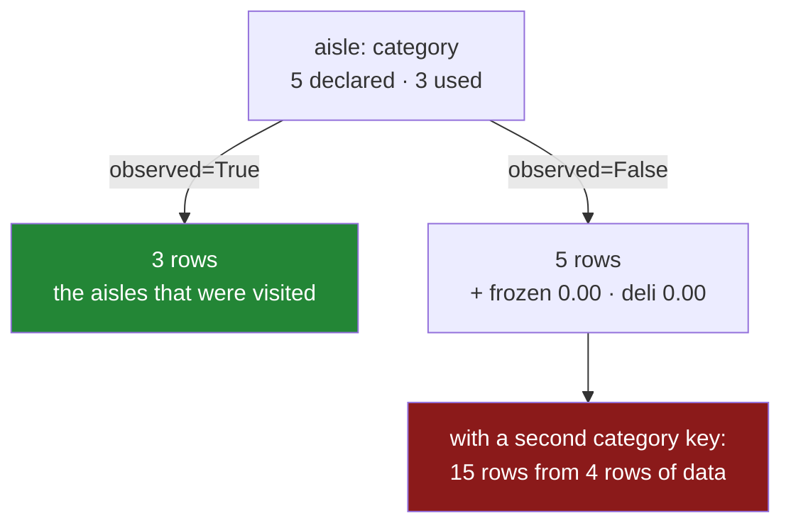

# 4.5 — `observed`, and the aisle nobody visited

## One-line answer

When the key is a **categorical** column, `observed=False` gives you a row for every category the
column *could* hold, including the ones with no rows — and those empty groups sum to a confident
`0.00`, which is indistinguishable from a group that genuinely spent nothing.

---

## The story

The shop's aisles are printed on a sign by the door: dairy, bakery, dry goods, frozen, deli. Five
aisles, always the same five, and the flat's sheet has a column for which one each thing came from.

This week nobody went to the frozen aisle or the deli.

The aisle report comes back with five rows on it. Dairy four twenty-two, bakery one forty, dry two oh
five — and then frozen zero pounds, deli zero pounds.

Somebody reads it and concludes the flat bought frozen food and it cost nothing. Somebody else reads
it and concludes the flat has stopped buying frozen food, which is closer but still wrong: the flat
buys frozen food most weeks and did not this week, and "did not go" and "went and spent nothing" are
different facts.

The two zero rows are not measurements. They are the *sign by the door*, showing through. Nobody
visited those aisles, so there is nothing to report — and the report has reported it anyway, as a
number, in the same column as the real numbers.

---

## The idea in plain language

Day 34 covers the **`category` dtype** properly. The short version needed here: a categorical column
carries two things — the values in the rows, and a **list of allowed categories** declared once and
attached to the column. A column of five thousand aisle names might have exactly five categories, and
that list is part of the column's type rather than something derived from its contents.

That list is why `groupby` needs an `observed` argument:

- **`observed=True`** — group by the values that actually appear. Three aisles this week, three rows
  in the report. This is what grouping by an ordinary text column does, and it is almost always what
  you want.
- **`observed=False`** — emit a group for **every declared category**, whether or not any row has it.
  Five aisles on the sign, five rows in the report, two of them empty.

The empty groups behave exactly as
[2.2](../02-aggregating/2.2-size-counts-rows-count-counts-values.md) would predict, and it is worth
saying out loud because it is the whole danger: `size` and `count` report `0`, `mean` reports `NaN`,
and **`sum` reports `0.00`** — a real number, printed without a warning, sitting in a report next to
genuine totals. That is
[Day 30, 1.1](../../../day-30-missing-data/parts/01-what-missing-means/1.1-the-price-nobody-wrote-down.md)'s
all-blank sum arriving through a new door.

The multiplication is what makes it a production problem rather than a curiosity. With two categorical
keys, `observed=False` produces a row for **every pair of categories** — five aisles times three shops
is fifteen rows from four rows of data. With three keys it is the product of three category lists, and
a report of a few hundred real combinations becomes a frame of hundreds of thousands, almost all of
it zeros. This is where a group-by turns into an out-of-memory error, and the cause is a dtype rather
than the data.

There is one case where `observed=False` is exactly right: when you genuinely want the full grid,
because the absence *is* the finding. A report of "sales per region per month" for a fixed set of
regions should show the region with no sales, because a missing row would be read as a missing
measurement rather than as a zero. In that case fill the empty groups deliberately — and say, in the
column's name or its documentation, that a zero means "none" rather than "not measured".

**Always pass `observed` explicitly.** Not because one value is right, but because the correct value
depends on what the report means, and a default cannot know that.

---

## Why Setu needs it

- **[2.2](../02-aggregating/2.2-size-counts-rows-count-counts-values.md)** established that `sum` of
  nothing is `0.00`. This is where that fact stops being about missing values and starts being about
  missing *rows*.
- **[4.4](4.4-two-keys-and-the-multiindex.md)** showed that two keys give one group per observed pair.
  `observed=False` is the switch that changes "observed pair" to "possible pair", and the difference
  is a multiplication.
- **[6.1](../06-the-module/6.1-the-grouping-module.md)** passes `observed=True` in every grouping in
  the day's module, with a comment saying why.
- **Day 34** is the `category` dtype in full — how it is declared, what it saves in memory, and what
  its declared order does to sorting ([4.2](4.2-sort-and-the-order-of-the-groups.md)).
- **Day 45** is the Phase 4 gate, where the cleaned dataset has categorical columns by design, so
  every group-by written after that day meets this argument.

---

## The mechanism

An aisle column with all five aisles declared, and only three of them used:

```python
import pandas as pd

aisles = pd.CategoricalDtype(["dairy", "bakery", "dry", "frozen", "deli"])

shop = pd.DataFrame(
    {
        "item": ["milk", "bread", "eggs", "rice"],
        "aisle": pd.Series(["dairy", "bakery", "dairy", "dry"], dtype=aisles),
        "spend": [2.30, 1.40, 1.92, 2.05],
    }
)

print(shop.dtypes)
print()
print("declared categories:", list(shop["aisle"].cat.categories))
print("actually present   :", sorted(shop["aisle"].unique().tolist()))
```

**Line by line:**

- `pd.CategoricalDtype([...])` declares the list of allowed values **once**, as a type. This is the
  sign by the door, written into the column.
- `pd.Series([...], dtype=aisles)` builds the column with that type. Four rows, three distinct values,
  five declared categories.
- `shop.dtypes` shows `category` rather than `str`, which is the only visible difference between this
  frame and every other one on the day — and it is enough to change what `groupby` returns.
- `.cat.categories` is the declared list; `.unique()` is what is actually in the rows. **The gap
  between those two is the whole subject.**

```text
item          str
aisle    category
spend     float64
dtype: object

declared categories: ['dairy', 'bakery', 'dry', 'frozen', 'deli']
actually present   : ['bakery', 'dairy', 'dry']
```

**`observed=True` — the aisles that were visited:**

```python
print(shop.groupby("aisle", observed=True)["spend"].sum())
```

**Line by line:**

- Three rows, for the three aisles with data. This is what grouping by a plain text column would have
  given.
- Note the **order**: `dairy`, `bakery`, `dry` — the order they were declared in, not alphabetical.
  That is the categorical order overriding the sort from
  [4.2](4.2-sort-and-the-order-of-the-groups.md), and it is the good half of using a `category` for a
  key: a report of `low`, `medium`, `high` comes out in that order for free.
- Nothing about this result mentions `frozen` or `deli`, which is correct: nothing was bought from
  them.

```text
aisle
dairy     4.22
bakery    1.40
dry       2.05
Name: spend, dtype: float64
```

**`observed=False` — the sign by the door:**

```python
print(shop.groupby("aisle", observed=False)["spend"].sum())
print()
print(shop.groupby("aisle", observed=False)["spend"].size())
print()
print(shop.groupby("aisle", observed=False)["spend"].mean())
```

**Line by line:**

- Five rows now, two of them for aisles that had no rows at all.
- **`sum` reports `0.00` for `frozen` and `deli`.** There is nothing to add up, adding up nothing gives
  zero, and the report now claims two measurements that were never taken.
- `size` reports `0` for both, which is the honest answer and the one that lets you tell the empty
  groups from the real ones — the check argued for in
  [2.2](../02-aggregating/2.2-size-counts-rows-count-counts-values.md).
- `mean` reports `NaN`, because there is nothing to divide by. **Three reductions, three different
  stories about the same two rows**, and only one of them can go in a report without a footnote.

```text
aisle
dairy     4.22
bakery    1.40
dry       2.05
frozen    0.00
deli      0.00
Name: spend, dtype: float64

aisle
dairy     2
bakery    1
dry       1
frozen    0
deli      0
Name: spend, dtype: int64

aisle
dairy     2.11
bakery    1.40
dry       2.05
frozen     NaN
deli       NaN
Name: spend, dtype: float64
```

**And the multiplication, with two categorical keys:**

```python
shop["shop"] = pd.Series(
    ["main", "main", "corner", "main"],
    dtype=pd.CategoricalDtype(["main", "corner", "online"]),
)

print("observed=True :", len(shop.groupby(["aisle", "shop"], observed=True)["spend"].sum()), "rows")
print(
    "observed=False:", len(shop.groupby(["aisle", "shop"], observed=False)["spend"].sum()), "rows"
)
print()
print(shop.groupby(["aisle", "shop"], observed=False)["spend"].sum().head(8))
```

**Line by line:**

- A second categorical column, with three declared shops of which two are used.
- `observed=True` gives **4** rows — the pairs that occurred. `observed=False` gives **15** — five
  aisles times three shops, whether or not anything happened in them.
- Four rows of data producing fifteen rows of report, of which eleven are zeros. **Scale that up**:
  three categorical keys with a hundred categories each is a million rows out of whatever went in.
- Reading the printed block, `dairy/online` sums to `0.00` — a shop nobody has ever used, in an aisle
  that exists, reported as a real total of zero.

```text
observed=True : 4 rows
observed=False: 15 rows

aisle   shop
dairy   main      2.30
        corner    1.92
        online    0.00
bakery  main      1.40
        corner    0.00
        online    0.00
dry     main      2.05
        corner    0.00
Name: spend, dtype: float64
```



---

## When it breaks

**A zero that is not a measurement:**

```text
$ uv run python -c "
import pandas as pd
aisles = pd.CategoricalDtype(['dairy', 'bakery', 'frozen'])
shop = pd.DataFrame({
    'aisle': pd.Series(['dairy', 'bakery', 'dairy'], dtype=aisles),
    'spend': [2.30, 1.40, 1.92],
})
report = shop.groupby('aisle', observed=False)['spend'].sum()
print(report.to_dict())
print('cheapest aisle:', report.idxmin(), report.min())
print('mean per aisle:', round(report.mean(), 3))
"
```

```text
{'dairy': 4.22, 'bakery': 1.4, 'frozen': 0.0}
cheapest aisle: frozen 0.0
mean per aisle: 1.873
```

**What it means.** "The cheapest aisle is frozen" is a sentence somebody will put in a summary, and it
is about an aisle nobody went to. The average per aisle is dragged down by a row that represents no
purchases at all — `1.873` against the honest `2.81`. **No error, no warning**, and both numbers look
like the sort of thing a report contains. Every reduction that treats the empty group as a
participant is wrong here, and `min`, `mean`, `idxmin` and any ranking are all in that category.

**The frame that would not fit:**

```text
$ uv run python -c "
import pandas as pd
region = pd.CategoricalDtype([f'r{i:03d}' for i in range(200)])
product = pd.CategoricalDtype([f'p{i:03d}' for i in range(300)])
sales = pd.DataFrame({
    'region': pd.Series(['r001', 'r002', 'r001'], dtype=region),
    'product': pd.Series(['p001', 'p001', 'p002'], dtype=product),
    'amount': [10.0, 20.0, 30.0],
})
print('rows in        :', len(sales))
print('observed=True  :', len(sales.groupby(['region', 'product'], observed=True)['amount'].sum()))
print('observed=False :', len(sales.groupby(['region', 'product'], observed=False)['amount'].sum()))
"
```

```text
rows in        : 3
observed=True  : 3
observed=False : 60000
```

**What it means.** Three rows of data, sixty thousand rows of result, of which 59 997 are zero. That
is a small example; two hundred regions is realistic and three hundred products is small, and adding
a third key of a hundred customers makes it six million. **The frame is built before anything
complains**, so the failure is a slow function and then a memory error, with a traceback pointing at
the group-by rather than at the dtypes that caused it. Whenever a group-by is unexpectedly slow, the
first thing to check is whether any key is a `category` and what `observed` is set to.

**The default that changed underneath a working script:**

```text
$ uv run python -c "
import pandas as pd
aisles = pd.CategoricalDtype(['dairy', 'bakery', 'frozen'])
plain = pd.DataFrame({'aisle': ['dairy', 'bakery'], 'spend': [2.30, 1.40]})
typed = pd.DataFrame({'aisle': pd.Series(['dairy', 'bakery'], dtype=aisles), 'spend': [2.30, 1.40]})
print('plain text column:', plain.groupby('aisle')['spend'].sum().to_dict())
print('category column  :', typed.groupby('aisle')['spend'].sum().to_dict())
"
```

```text
plain text column: {'bakery': 1.4, 'dairy': 2.3}
category column  : {'dairy': 2.3, 'bakery': 1.4}
```

**What it means.** The same group-by, written the same way, on data that differs only in a dtype —
and the results come out in a different **order**, because a categorical key sorts by its declared
order rather than alphabetically
([4.2](4.2-sort-and-the-order-of-the-groups.md)). Nothing errors. On this version of pandas the row
*set* is the same; on data with an unused category it would not be. **A change to a column's dtype,
made upstream for memory reasons, silently changes the shape and order of every report built on it** —
which is why passing `observed` explicitly is worth doing even when the current default happens to be
what you want.

---

## In production

**What a professional writes instead of the teaching version.** `observed` is never left to the
default, and the decision about empty categories is made where the report is defined:

```python
import pandas as pd


def spend_by_category(
    frame: pd.DataFrame,
    by: list[str],
    value: str = "spend",
    include_unused: bool = False,
) -> pd.DataFrame:
    """Totals per group. `include_unused=True` emits declared categories with no rows."""
    if include_unused:
        sizes = [
            len(frame[column].cat.categories)
            for column in by
            if isinstance(frame[column].dtype, pd.CategoricalDtype)
        ]
        combinations = 1
        for size in sizes:
            combinations *= size
        if combinations > 100_000:
            raise ValueError(
                f"include_unused would emit up to {combinations:,} groups from {len(frame):,} rows"
            )

    out = frame.groupby(by, observed=not include_unused, dropna=False, as_index=False).agg(
        lines=(value, "size"), total=(value, "sum")
    )
    out["measured"] = out["lines"] > 0
    return out
```

**Line by line:**

- `include_unused: bool = False` gives the argument a name that says what it *means* rather than what
  it does. A caller reading `include_unused=True` at the call site understands the report; a caller
  reading `observed=False` has to remember which way round it is.
- The guard computes the product of the category list lengths **before** grouping and refuses above a
  threshold. That check is the difference between a clear error and a memory exhaustion, and it costs
  nothing on the normal path.
- `isinstance(frame[column].dtype, pd.CategoricalDtype)` rather than comparing to the string
  `"category"`, because the dtype is an object carrying the category list and string comparison would
  miss an ordered categorical.
- `f"{combinations:,}"` puts thousands separators in the error message. On a number like `60000000`
  that is the difference between a reader seeing the magnitude and counting digits.
- `observed=not include_unused` is the one line that connects the friendly argument to pandas'
  awkward one, in one place, where it can be read.
- `out["measured"] = out["lines"] > 0` is the important column. **It makes the empty groups
  distinguishable from real zeros**, so a consumer can filter them out, style them differently, or
  refuse to average over them — the fix for the first failure above.
- `dropna=False` for the blank-key reason from
  [4.3](4.3-dropna-and-the-rows-that-vanished.md), and `as_index=False` for the boundary reason from
  [4.1](4.1-the-key-became-the-index.md).

**What changes at scale.** `observed=True` costs what any group-by costs: proportional to the number
of rows and the number of groups that occur. `observed=False` costs proportional to the **product of
the category lists**, which is unrelated to how much data you have — three rows can produce sixty
thousand groups, and the allocation happens before any aggregation. On a warehouse this is the same
distinction as a `GROUP BY` against a `CROSS JOIN` with a `LEFT JOIN`: the second is how you
deliberately produce the full grid, and nobody does it by accident because it has to be written out.
The pandas version is one keyword, defaulting differently in different versions, on a column whose
dtype somebody else may have changed for memory reasons — which is the whole argument for stating it.

**The failure mode that only appears with real data.** A column is converted to `category` in the
loading layer, for a perfectly good reason: it halves the memory of a large table
([Day 34](../../../day-34-categories-and-describe/parts/02-the-category-dtype/2.1-two-arrays-instead-of-one.md)
measures it). The category list is derived from the values present *at conversion time*, so it grows
over the months as new values appear, and it never shrinks — a category that stopped being used two
years ago is still declared. Every report built with `observed=False` then carries a growing tail of
zero rows for things that no longer exist, and the "average per category" falls slowly and
inexplicably year on year. The fix is `observed=True`, and the tell is a report whose row count grows
while the data does not.

**The review comment a senior engineer leaves.** *"`groupby('merchant_category')` on a categorical
column with `observed=False` gives us a row for all 1 400 declared categories, and the monthly
'average per category' is mostly averaging zeros. Pass `observed=True`, and if we do want the full
grid then add a `measured` flag so the dashboard can grey them out."*

**The interview question.** *"What does `observed` do in a group-by?"* It only matters when a grouping
key is a categorical column: `observed=True` produces a group per value that occurs, and
`observed=False` produces one per declared category, including empty ones. The follow-up that shows
you have been bitten: *"why does that matter?"* Because empty groups sum to zero — indistinguishable
from a real zero — so every mean, minimum and ranking over the report is wrong; and because with
several categorical keys the number of groups is the product of the category lists, which is
unrelated to the size of the data and is a common way to run out of memory.

---

## Check yourself

```bash
uv run python -c "
import pandas as pd
aisles = pd.CategoricalDtype(['dairy', 'bakery', 'dry', 'frozen', 'deli'])
shop = pd.DataFrame({
    'aisle': pd.Series(['dairy', 'bakery', 'dairy', 'dry'], dtype=aisles),
    'spend': [2.30, 1.40, 1.92, 2.05],
})
for flag in (True, False):
    g = shop.groupby('aisle', observed=flag)['spend']
    print(f'observed={flag}')
    print('  rows :', len(g.sum()))
    print('  sum  :', g.sum().to_dict())
    print('  size :', g.size().to_dict())
    print('  mean :', g.mean().round(3).to_dict())
"
```

Under `observed=False`, three of the four printed numbers for `frozen` disagree about what happened.
Say what each one claims, and say which single number you would publish next to the total so a reader
could tell the empty aisles from the cheap ones.

**Answer out loud, without scrolling up:**

> Say when `observed` changes anything at all — what has to be true of the key. Then say what an empty
> group's `sum`, `size` and `mean` each report, and give the reason `observed=False` can turn three
> rows of data into sixty thousand rows of result.

---

**Next:** [5.1 — `filter`: keeping whole groups](../05-filter-and-apply/5.1-filter-keeping-whole-groups.md).
