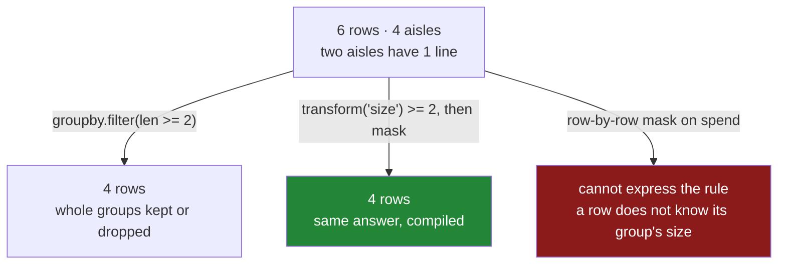

# 5.1 — `filter` — keeping whole groups

## One-line answer

`filter` keeps or discards **entire groups** according to a test applied to each group as a whole, so
it is the tool for *"drop the aisles with fewer than two lines"* — a question no row-by-row mask can
answer, because no single row knows how big its group is.

---

## The story

The month's report has a "biggest lines by aisle" table on it, and half the table is nonsense.

The deli appears because somebody bought one jar of jam. The bakery appears because somebody bought
one loaf. Each of those aisles has exactly one line in it, so its biggest line is also its only line,
its average is that line, and its share of itself is a hundred per cent
([3.2](../03-transform/3.2-the-share-of-the-aisle.md)).

The person reading the report does not want those rows. Not because the jam is wrong — the jam was
really bought and really cost £1.75 — but because an aisle with one line in it cannot tell you
anything about *aisles*, and putting it in the same table as an aisle with forty lines invites a
comparison that is meaningless.

So the rule is: *only show me aisles we bought at least two things from.*

That rule is awkward to apply by hand. You cannot look at the jam line and decide — the jam line looks
exactly like every other line. You have to look at the **deli**, count its lines, decide, and then go
back and cross out every deli line. The decision is about the group and the deletion is about the
rows.

---

## The idea in plain language

Everything so far has produced either one row per group
([2.x](../02-aggregating/2.1-one-number-for-each-group.md)) or one value per row
([3.x](../03-transform/3.1-a-number-for-every-row.md)). **`filter` produces a subset of the original
rows**: the frame you started with, minus the rows belonging to groups that failed a test.

The test is a function that receives one group at a time — as a **whole frame**, not as a row — and
returns `True` to keep it or `False` to drop it:

```
shop.groupby("aisle").filter(lambda block: len(block) >= 2)
```

Read it as *keep the rows of every aisle that has at least two rows.* The function is called once per
group; the result is the rows of the groups where it said `True`, in their original order, with their
original index.

Three things about it:

- **The function must return a single true-or-false value.** Not a mask, not a number. Returning a
  number raises, with a message that says exactly that — the real text is below. This is unlike
  `agg` and `transform`, which take reduction *names*; `filter` always takes a function, because
  there is no standard name for "is this group big enough".
- **The name is confusing on purpose to nobody.** `frame.filter()` — the DataFrame method — selects
  *columns* by name, and is a completely different thing. `GroupBy.filter()` selects rows by group.
  They share a name and nothing else, and the mistake is worth expecting.
- **It is not the only way, and often not the best way.** The same result comes from a `transform`
  and a mask: `shop[shop.groupby("aisle")["spend"].transform("size") >= 2]`. That version is longer to
  read and considerably faster, because `transform("size")` runs in compiled code while `filter` calls
  your Python function once per group. On four aisles the difference is invisible; on four hundred
  thousand customer IDs it is the difference between a second and a minute
  ([5.3](5.3-what-apply-costs-measured.md)).

The rule of thumb worth carrying: **use `filter` when the test is genuinely complicated and the number
of groups is small; use a `transform` and a mask when the test is a simple comparison against a group
statistic.** Most real tests are the second kind.

---

## Why Setu needs it

- **[3.2](../03-transform/3.2-the-share-of-the-aisle.md)** produced shares of `1.000` for one-row
  groups and argued they were meaningless. This is how you remove them.
- **[2.2](../02-aggregating/2.2-size-counts-rows-count-counts-values.md)** argued that an aggregate
  without its group size is unreadable. A minimum group size is the same argument, enforced.
- **[5.2](5.2-apply-the-escape-hatch.md)** is the more general version of "hand me the whole group and
  let me decide", and **[5.3](5.3-what-apply-costs-measured.md)** measures what that flexibility costs.
- **Day 76** builds features per customer, where "customers with at least ten transactions" is the
  standing filter that stops the model learning from noise.
- **Day 118** is evaluation, where a metric computed per segment needs a minimum segment size or the
  leaderboard is topped by segments of one.

---

## The mechanism

Six lines across four aisles, two of which have a single line:

```python
import pandas as pd

shop = pd.DataFrame(
    {
        "item": ["milk", "bread", "eggs", "rice", "tea", "jam"],
        "aisle": ["dairy", "bakery", "dairy", "dry", "dry", "deli"],
        "spend": [2.30, 1.40, 1.92, 2.05, 3.10, 1.75],
    }
)

g = shop.groupby("aisle")
print("sizes:", g.size().to_dict())
print()
print(g.filter(lambda block: len(block) >= 2))
```

**Line by line:**

- Four aisles: `dairy` and `dry` have two lines each, `bakery` and `deli` have one. **That imbalance
  is the example** — a filter on a frame where every group is the same size proves nothing.
- `lambda block: len(block) >= 2` — the parameter is named `block` rather than `row` or `x` on
  purpose. **It is a whole frame**, and naming it after what it is stops the commonest confusion.
- `len(block)` is the number of rows in the group, the same number `size()` reports
  ([2.2](../02-aggregating/2.2-size-counts-rows-count-counts-values.md)).
- The result is **four of the original six rows**, with their original index labels `0, 2, 3, 4` — the
  `bakery` and `deli` rows are gone entirely. Nothing has been aggregated and no new column has
  appeared; this is the original frame with rows removed.
- The gap in the index is the tell that a filter happened, exactly as in
  [Day 30, 4.1](../../../day-30-missing-data/parts/04-dropping/4.1-dropna-and-the-rows-that-left.md).

```text
sizes: {'bakery': 1, 'dairy': 2, 'deli': 1, 'dry': 2}

   item  aisle  spend
0  milk  dairy   2.30
2  eggs  dairy   1.92
3  rice    dry   2.05
4   tea    dry   3.10
```

**A test on the group's numbers rather than its size:**

```python
print(g.filter(lambda block: block["spend"].sum() > 4))
```

**Line by line:**

- `block["spend"].sum()` is an ordinary column operation, because `block` is an ordinary frame.
  Anything you can do to a frame you can do inside a filter.
- The test keeps aisles whose total is over four pounds: `dairy` at `4.22` and `dry` at `5.15`. On
  this data it happens to select the same rows as the size test, which is a coincidence worth
  noticing — **two different rules agreeing on a small example is exactly how a wrong rule survives**.
- Changing `> 4` to `> 5` would keep only `dry`. Try it; the point of a filter is that the whole group
  goes or the whole group stays, and nothing in between.

```text
   item  aisle  spend
0  milk  dairy   2.30
2  eggs  dairy   1.92
3  rice    dry   2.05
4   tea    dry   3.10
```

**The version you should usually write instead:**

```python
sizes = g["spend"].transform("size")
print(shop[sizes >= 2])
```

**Line by line:**

- `transform("size")` gives every row its own group's size, aligned to the frame
  ([3.1](../03-transform/3.1-a-number-for-every-row.md)) — `[2, 1, 2, 2, 2, 1]` for these six rows.
- `sizes >= 2` turns that into a mask, and `shop[mask]` keeps the rows where it is `True`
  ([Day 28, 2.2](../../../day-28-selection-and-alignment/parts/02-masks/2.2-selecting-with-a-mask.md)).
- **Identical output**, and it runs entirely in compiled code — no Python function is called per
  group.
- It is also more flexible: `sizes` is a value you can print, assert on, or combine with another
  condition. The filter's `lambda` produces nothing you can inspect.

```text
   item  aisle  spend
0  milk  dairy   2.30
2  eggs  dairy   1.92
3  rice    dry   2.05
4   tea    dry   3.10
```



---

## When it breaks

**A filter function that returns something other than a boolean:**

```text
$ uv run python -c "
import pandas as pd
shop = pd.DataFrame({'aisle': ['dairy', 'dairy', 'deli'], 'spend': [2.30, 1.92, 1.75]})
print(shop.groupby('aisle').filter(lambda block: block['spend'].sum()))
"
```

```text
Traceback (most recent call last):
  File "<string>", line 4, in <module>
TypeError: filter function returned a float64, but expected a scalar bool
```

**What it means.** The function returned a number where a yes-or-no was needed. This is a good error —
it names the type it got and the type it wanted, and it arrives immediately. The mistake is usually a
missing comparison: `block["spend"].sum()` instead of `block["spend"].sum() > 4`. Note that Python
would happily treat a non-zero float as true in an `if`; pandas refuses to, which is the right call
for something applied hundreds of times where a zero total would silently mean "drop this group".

**Confusing `GroupBy.filter` with `DataFrame.filter`:**

```text
$ uv run python -c "
import pandas as pd
shop = pd.DataFrame({'aisle': ['dairy', 'dairy', 'deli'], 'spend': [2.30, 1.92, 1.75]})
print(shop.filter(items=['spend']))
print()
print(shop.filter(like='ai'))
"
```

```text
   spend
0   2.30
1   1.92
2   1.75

   aisle
0  dairy
1  dairy
2   deli
```

**What it means.** `DataFrame.filter` selects **columns** by name, prefix or pattern, and has nothing
to do with rows or groups. Both methods exist, both are called `filter`, and one of them silently does
something entirely different from what you meant. **No error** — you just get columns instead of a
filtered frame. Whenever `filter` appears in unfamiliar code, check whether a `groupby` is in front of
it.

**A filter that silently keeps everything:**

```text
$ uv run python -c "
import pandas as pd
shop = pd.DataFrame({
    'aisle': ['dairy', 'bakery', 'dairy', 'dry', 'dry', 'deli'],
    'spend': [2.30, 1.40, 1.92, 2.05, 3.10, 1.75],
})
print('rows in :', len(shop))
print('rows out:', len(shop.groupby('aisle').filter(lambda block: len(block) >= 1)))
print('rows out:', len(shop.groupby('aisle').filter(lambda block: len(block) >= 2)))
"
```

```text
rows in : 6
rows out: 6
rows out: 4
```

**What it means.** `len(block) >= 1` is true for every group, because a group with no rows does not
exist — `groupby` only produces groups that have rows in them (unless a categorical key and
`observed=False` are involved, [4.5](../04-the-keys/4.5-observed-and-the-aisle-nobody-visited.md)).
So an off-by-one in the threshold turns the filter into an expensive no-op that raises nothing and
changes nothing. **Print the row count before and after every filter**; it is the only thing that
distinguishes "the rule matched everything" from "the rule did nothing".

---

## In production

**What a professional writes instead of the teaching version.** The minimum group size is a named
constant, the filtering is done with a `transform` for speed, and what was removed is logged rather
than discarded silently:

```python
import logging

import pandas as pd

log = logging.getLogger(__name__)

MIN_GROUP_ROWS = 5


def drop_small_groups(
    frame: pd.DataFrame,
    by: list[str],
    min_rows: int = MIN_GROUP_ROWS,
) -> pd.DataFrame:
    """Keep only the rows of groups with at least `min_rows` rows. Logs what left."""
    sizes = frame.groupby(by, observed=True, dropna=False)[frame.columns[0]].transform("size")
    keep = sizes >= min_rows

    dropped_rows = int((~keep).sum())
    if dropped_rows:
        dropped_groups = frame.loc[~keep, by].drop_duplicates()
        log.info(
            "dropped %d rows in %d groups below %d rows: %s",
            dropped_rows,
            len(dropped_groups),
            min_rows,
            dropped_groups.to_dict("records")[:10],
        )
    return frame[keep]
```

**Line by line:**

- `MIN_GROUP_ROWS = 5` is a module constant, because "how many rows make a group worth reporting" is a
  policy decision, not an implementation detail — the same argument as
  [Day 30, 7.1](../../../day-30-missing-data/parts/07-the-module/7.1-the-missing-module.md)'s
  `MAX_DROP_SHARE`.
- `transform("size")` rather than `filter`, for the speed reason: one compiled pass instead of one
  Python call per group. On a key with many groups this is the whole difference
  ([5.3](5.3-what-apply-costs-measured.md)).
- `frame.columns[0]` is only there to give `transform` a column to work on — `size` ignores which one.
  It reads slightly oddly and it avoids requiring the caller to name a column that has nothing to do
  with the question.
- `dropped_groups` names **which** groups went, not just how many rows. "We dropped 40 000 rows" is
  alarming and unactionable; "we dropped 40 000 rows in 12 000 groups, here are ten of them" leads
  somewhere.
- `[:10]` truncates the list, because a log line carrying twelve thousand group keys is not a log
  line.
- `log.info` on a path that always runs, so the drop is visible in the run record. A filter that
  removes a fifth of the data and says nothing is exactly the invisible stage argued against in
  [Day 30, 4.1](../../../day-30-missing-data/parts/04-dropping/4.1-dropna-and-the-rows-that-left.md).
- `frame[keep]` returns a filtered view-like copy; the caller assigns it, so the removal is visible at
  the call site rather than happening inside.

**What changes at scale.** `filter` calls your function once per group, and each call materialises
that group as a frame — allocating an object, slicing every column, and running Python. With four
groups that is nothing; with four hundred thousand it dominates, and the `transform`-and-mask version
is typically one to two orders of magnitude faster because it never leaves compiled code. The measured
comparison is in [5.3](5.3-what-apply-costs-measured.md). Beyond pandas, this operation is a window
function and a `WHERE`: `COUNT(*) OVER (PARTITION BY aisle) >= 2` — the same two-step shape, which is
another reason to think of it as transform-then-mask rather than as its own primitive.

**The failure mode that only appears with real data.** The minimum group size is chosen to clean up a
report and quietly becomes a selection. Customers with fewer than five transactions are dropped from
the training data because their per-customer features are noisy — and new customers all have fewer
than five transactions, so the model is trained entirely on established customers and deployed on
everybody. It performs worse exactly where the business is growing. This is
[Day 30, 3.1](../../../day-30-missing-data/parts/03-why-it-is-missing/3.1-three-reasons-a-line-is-blank.md)'s
second case wearing a different hat: the rows removed are not a random sample, and the defence is to
look at what the dropped groups have in common before accepting the threshold.

**The review comment a senior engineer leaves.** *"`groupby(...).filter(lambda b: len(b) >= 5)` over
merchant_id — that is a Python call per merchant and we have 800 000 of them. Use
`transform('size') >= 5` and a mask. Also log what gets dropped; this stage removes 18% of rows and
nothing in the run output says so."*

**The interview question.** *"How would you keep only the groups with more than N rows?"*
`groupby(key).filter(lambda block: len(block) > N)` expresses it directly, but in practice
`frame[frame.groupby(key)[col].transform("size") > N]` is the version to write, because it runs in
compiled code rather than calling a Python function per group. The follow-up: *"why can't you do it
with a plain row mask?"* Because no individual row knows how many rows share its key — the group
statistic has to be computed first and broadcast back, which is exactly what `transform` does.

---

## Check yourself

```bash
uv run python -c "
import pandas as pd
shop = pd.DataFrame({
    'item':  ['milk', 'bread', 'eggs', 'rice', 'tea', 'jam'],
    'aisle': ['dairy', 'bakery', 'dairy', 'dry', 'dry', 'deli'],
    'spend': [2.30, 1.40, 1.92, 2.05, 3.10, 1.75],
})
g = shop.groupby('aisle')
print('sizes      :', g.size().to_dict())
print('rows in    :', len(shop))
by_filter = g.filter(lambda block: len(block) >= 2)
by_mask   = shop[g['spend'].transform('size') >= 2]
print('by filter  :', by_filter.index.tolist())
print('by mask    :', by_mask.index.tolist())
print('same?      :', by_filter.equals(by_mask))
print('spend kept :', round(by_filter['spend'].sum(), 2), 'of', round(shop['spend'].sum(), 2))
"
```

The two methods return identical frames. Say which one you would put in a pipeline that runs over
half a million groups, and give the reason in terms of what each one executes.

**Answer out loud, without scrolling up:**

> Say what `filter` receives each time it calls your function, and what it must give back. Then say
> why a plain row-level mask cannot express "keep the groups with at least two rows", and name the
> method that makes it possible.

---

**Next:** [5.2 — `apply`: the escape hatch](5.2-apply-the-escape-hatch.md).
