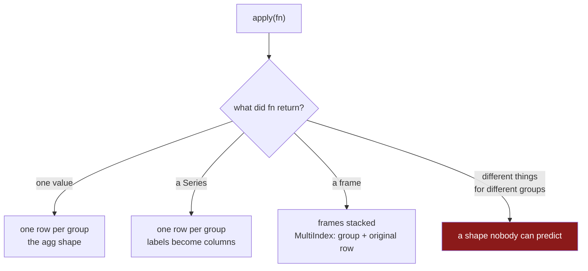

# 5.2 — `apply` — the escape hatch

## One-line answer

`apply` hands you each group as a whole frame and takes whatever you give back, so it can do things
`agg`, `transform` and `filter` cannot — and the price is that its output shape depends on what your
function happens to return, which is why it is the last tool to reach for rather than the first.

---

## The story

Most of the questions about the shopping have a shape the tools already fit. *What did each aisle come
to?* is one number per aisle. *What share of its aisle was each line?* is one number per line. *Which
aisles had at least two lines?* is a yes or no per aisle.

Then somebody asks: *what was the dearest thing we bought in each aisle?*

That is not one number. The answer for dairy is the **milk line** — its name, its price, its quantity,
the whole row. You cannot get it from a total, and you cannot get it from a per-row calculation,
because the answer for dairy is one specific row and the answer for the dry aisle is a different
specific row.

What you want is: hand me each aisle's rows, let me pick one, and stack up what I picked.

That is a genuinely different operation from anything so far. It is also the shape of a hundred other
one-off questions — *the first three lines of each aisle*, *each aisle sorted with a running total*,
*a small summary frame per aisle* — and pandas has one method that covers all of them by simply
letting you write the code.

---

## The idea in plain language

`apply` calls your function once per group, passing the group as a **whole frame**, and then puts the
results together. Everything about it follows from that sentence.

The results are combined according to what your function returns, and there are three cases:

| your function returns | the result is |
|---|---|
| a single value | one row per group — the same shape as `agg` |
| a Series | one row per group, with the Series' labels as columns |
| a frame | the frames stacked, keyed by group — more rows than groups |

That flexibility is the whole point and the whole problem. **The shape of the output depends on the
data**, because your function's return type can depend on what it was given. A function that returns
a frame when a group has rows and `None` when it does not produces a result whose shape nobody can
predict from reading the code.

So the rule is: **reach for `apply` only when nothing else fits.** In order of preference:

1. **`agg`** if the answer is one value per group ([2.3](../02-aggregating/2.3-agg-several-answers-at-once.md)).
2. **`transform`** if the answer is one value per row ([3.1](../03-transform/3.1-a-number-for-every-row.md)).
3. **`filter`** if the answer is which groups to keep ([5.1](5.1-filter-keeping-whole-groups.md)).
4. **`apply`** if the answer is genuinely per-group rows — the dearest line, the first three, a
   re-sorted block.

There is a fifth option that beats `apply` for the story's question specifically, and it is worth
knowing because the story's question is so common: `sort_values` followed by `groupby().head(n)`, or
`nlargest` per group via `idxmax` and a `loc`. Those run in compiled code and `apply` does not.

One thing about the block is worth knowing before you write your first `apply`: **the grouping
columns are not in it.** The block your function receives holds every column except the keys, because
the keys are already the group's identity and putting them back in the returned frame would repeat
them — once in the result's index and once in a column. Older pandas passed them in and asked you to
opt out with `include_groups=False`; pandas 3 excludes them and refuses `include_groups=True`
outright. If you meet that argument in older code, it is this.

---

## Why Setu needs it

- **[3.3](../03-transform/3.3-transform-and-agg-the-shape-rule.md)** established the two shapes.
  `apply` is the method that can produce either, which is why it is introduced after both.
- **[5.3](5.3-what-apply-costs-measured.md)** measures what it costs, and the number is large enough
  to change how you write code.
- **[6.1](../06-the-module/6.1-the-grouping-module.md)** contains exactly one `apply` in the day's
  module, with a comment saying why nothing else would do.
- **Day 33** resamples time series per group, where a per-group operation that is genuinely a whole
  sub-frame calculation is common and `apply` earns its place.
- **Day 154** builds sequence features for the capstone — "the last five events for each user" — which
  is this shape at production scale, and where the cost in
  [5.3](5.3-what-apply-costs-measured.md) decides the design.

---

## The mechanism

Six lines, four aisles, and the dearest line in each:

```python
import pandas as pd

shop = pd.DataFrame(
    {
        "item": ["milk", "bread", "eggs", "rice", "tea", "jam"],
        "aisle": ["dairy", "bakery", "dairy", "dry", "dry", "deli"],
        "spend": [2.30, 1.40, 1.92, 2.05, 3.10, 1.75],
    }
)

g = shop.groupby("aisle")
print(g.apply(lambda block: block.nlargest(1, "spend")))
```

**Line by line:**

- `lambda block: ...` — `block` is a **whole frame**: every row of one aisle, every column except the
  key. Inside it you can do anything you would do to a frame.
- `block.nlargest(1, "spend")` returns the single row with the biggest spend, as a one-row frame
  ([Day 29, 5.3](../../../day-29-iteration-and-order/parts/05-ranking/5.3-nlargest-sorting-you-do-not-pay-for.md)).
  A **frame** comes back, so the results get stacked.
- The `aisle` column is **not** in `block` — the printed result has only `item` and `spend`. The key
  is the group's identity and lives in the result's index, so repeating it as a column would give the
  same information twice.
- The result's index has **two levels**: the aisle, and the original row label. That is a `MultiIndex`
  ([4.4](../04-the-keys/4.4-two-keys-and-the-multiindex.md)), and it is how you can tell which
  original row each answer came from — `dairy` picked row `0`, `dry` picked row `4`.
- Four rows out for four groups, which happens because the function returned exactly one row each.
  Change the `1` to a `2` and the result has seven rows, because two aisles have only one line.

```text
           item  spend
aisle
bakery 1  bread   1.40
dairy  0   milk   2.30
deli   5    jam   1.75
dry    4    tea   3.10
```

**A function that returns one value — the `agg` shape:**

```python
print(g.apply(lambda block: block["spend"].max() - block["spend"].min()))
```

**Line by line:**

- The function returns a **single number**, so `apply` produces one row per group: a Series indexed by
  aisle, exactly like an aggregation.
- The calculation — the spread between the biggest and smallest line — is one that `agg` cannot do
  directly, because it needs two reductions combined. That is a legitimate use, and there is a cheaper
  one: `g.max() - g.min()`, two compiled reductions and a subtraction, which gives the same answer
  without a Python call per group.
- `bakery` and `deli` read `0.00` because they have one line each, so the biggest and smallest are the
  same row. Another instance of a one-row group being its own summary
  ([3.2](../03-transform/3.2-the-share-of-the-aisle.md)).

```text
aisle
bakery    0.00
dairy     0.38
deli      0.00
dry       1.05
dtype: float64
```

**A function that returns a Series — a small summary per group:**

```python
print(
    g.apply(
        lambda block: pd.Series({"n": len(block), "total": block["spend"].sum()}),
        include_groups=False,
    )
)
```

**Line by line:**

- The function builds a `Series` from a dictionary, so its **labels become columns** of the result:
  `n` and `total`.
- This is the shape people reach for when they want several custom numbers per group. It works, and
  `agg` with named aggregation does the same job faster and with clearer names
  ([2.4](../02-aggregating/2.4-named-aggregation.md)) whenever the numbers are ordinary reductions.
- Look at the `n` column: `2.0`, not `2`. **The counts came back as floats**, because the Series
  built from a dictionary of mixed types was upcast to hold both an integer and a float, and pandas
  kept that dtype. Nothing warned. Named aggregation would have kept `n` as an integer.

```text
          n  total
aisle
bakery  1.0   1.40
dairy   2.0   4.22
deli    1.0   1.75
dry     2.0   5.15
```



---

## When it breaks

**Asking for the grouping columns back:**

```text
$ uv run python -c "
import pandas as pd
shop = pd.DataFrame({
    'aisle': ['dairy', 'dairy', 'dry'],
    'item':  ['milk', 'eggs', 'rice'],
    'spend': [2.30, 1.92, 2.05],
})
print(shop.groupby('aisle').apply(lambda b: b.nlargest(1, 'spend'), include_groups=True))
"
```

```text
Traceback (most recent call last):
  File "<string>", line 8, in <module>
ValueError: include_groups=True is no longer allowed.
```

**What it means.** Older pandas put the grouping columns inside each block, which meant the key came
back in the returned frame *and* in the result's index — the word `dairy` twice on the same row, and a
collision on the next `reset_index()`. pandas 3 removes the option rather than fixing it at every call
site. If you are reading code that passes `include_groups=False`, it is defending against the old
default and can simply be deleted; if you find `include_groups=True`, it will now raise and the code
wanted the key as a column, which is `reset_index()` on the result.

**A function whose return shape depends on the data:**

```text
$ uv run python -c "
import pandas as pd
def top_two(block):
    return block.nlargest(2, 'spend')
small = pd.DataFrame({'aisle': ['dairy', 'dairy'], 'spend': [2.30, 1.92]})
mixed = pd.DataFrame({'aisle': ['dairy', 'dairy', 'deli'], 'spend': [2.30, 1.92, 1.75]})
print('two-row group only:', len(small.groupby('aisle').apply(top_two)))
print('with a one-row group:', len(mixed.groupby('aisle').apply(top_two)))
"
```

```text
two-row group only: 2
with a one-row group: 3
```

**What it means.** The same function on data with one extra group gives a result with a different
number of rows per group — two for `dairy`, one for `deli`, because `nlargest(2)` returns what it can.
That is correct and it means **`len(result)` is not `2 * len(groups)`**, so any downstream code that
assumed a fixed number of rows per group is wrong on the day a small group appears. `apply`'s
flexibility is exactly this: the shape is a property of the data, not of the code.

**The count that came back as a float:**

```text
$ uv run python -c "
import pandas as pd
shop = pd.DataFrame({'aisle': ['dairy', 'dairy', 'deli'], 'spend': [2.30, 1.92, 1.75]})
by_apply = shop.groupby('aisle').apply(
    lambda b: pd.Series({'n': len(b), 'total': b['spend'].sum()}), include_groups=False
)
by_agg = shop.groupby('aisle').agg(n=('spend', 'size'), total=('spend', 'sum'))
print(by_apply.dtypes.to_dict())
print(by_agg.dtypes.to_dict())
"
```

```text
{'n': dtype('float64'), 'total': dtype('float64')}
{'n': dtype('int64'), 'total': dtype('float64')}
```

**What it means.** The `apply` version's count is a float and the `agg` version's is an integer. The
cause is the `pd.Series({...})` inside the function: a Series holds one dtype, so an integer and a
float together become two floats
([Day 26, 1.4](../../../day-26-frames-and-copy-on-write/parts/01-the-two-objects/1.4-one-dtype-per-column.md)).
**No warning.** A count that is a float writes to Parquet as a float, compares unequal to an integer
in a test, and prints as `2.0` in a report where somebody expected `2`. Named aggregation avoids the
whole thing.

---

## In production

**What a professional writes instead of the teaching version.** For the story's actual question —
the top row per group — they do not use `apply` at all, and where `apply` is genuinely needed the
function is named, typed and tested rather than being a lambda:

```python
import pandas as pd


def top_rows_per_group(
    frame: pd.DataFrame,
    by: list[str],
    order: str,
    n: int = 1,
) -> pd.DataFrame:
    """The `n` highest-`order` rows of each group, without calling Python per group."""
    ranked = (
        frame.sort_values([*by, order], ascending=[*[True] * len(by), False], kind="stable")
        .groupby(by, observed=True, dropna=False, sort=False)
        .head(n)
    )
    return ranked.reset_index(drop=True)


def per_group_summary(block: pd.DataFrame) -> pd.Series:
    """A summary that genuinely needs the whole block. Named, so it can be tested alone."""
    ordered = block.sort_values("spend", ascending=False)
    return pd.Series(
        {
            "lines": len(ordered),
            "total": float(ordered["spend"].sum()),
            "top_share": float(ordered["spend"].iloc[0] / ordered["spend"].sum()),
        }
    )
```

**Line by line:**

- `top_rows_per_group` uses **`sort_values` then `head(n)`**, which is the compiled answer to the
  question `apply(nlargest)` was solving. `groupby().head(n)` takes the first `n` rows of each group
  in their current order, so sorting first is what makes them the top ones.
- `ascending=[*[True] * len(by), False]` — the keys ascending so groups stay contiguous, the ordering
  column descending so the biggest is first. Writing the list out programmatically means it stays
  correct when `by` gains a column.
- `kind="stable"` so rows tied on the ordering column keep their original relative order, and the
  answer is the same on every run
  ([Day 29, 4.2](../../../day-29-iteration-and-order/parts/04-sorting/4.2-the-tie-that-broke-the-report.md)).
- `sort=False` on the group-by, because the frame is already sorted by key and re-sorting the groups
  would be waste ([4.2](../04-the-keys/4.2-sort-and-the-order-of-the-groups.md)).
- `per_group_summary` is a **named function with a docstring and a return type**, not a lambda. It can
  be called on one frame in a test, which a lambda buried in an `apply` cannot, and its name says what
  it produces.
- `float(...)` around the values, so the returned Series is uniformly float and the surprise from the
  last failure above is a decision rather than an accident. If an integer count matters, return it as
  its own column via `agg` instead.
- `top_share` is the calculation that justifies `apply` here: it needs the group sorted *and* its
  total, and there is no single reduction for it.

**What changes at scale.** `apply` materialises each group as a frame and calls Python once per group,
so its cost is proportional to the **number of groups**, not to the number of rows. That is the
opposite of most pandas operations and it is why it surprises people: an `apply` that is fine on a
million rows in ten groups becomes unusable on a hundred thousand rows in fifty thousand groups.
[5.3](5.3-what-apply-costs-measured.md) measures it. The practical consequences are three. Prefer
`sort_values` + `head` for top-N, `agg` for reductions, `transform` for per-row values. When `apply` is
genuinely needed, reduce the number of groups first — filter, or aggregate to a coarser key. And when
the data outgrows that, this operation is a SQL window function (`ROW_NUMBER() OVER (PARTITION BY …
ORDER BY … )` with a `WHERE`), which is Day 35's argument for DuckDB.

**The failure mode that only appears with real data.** The function raises on one group out of eighty
thousand — an empty block after a filter, a division by a zero total, a column that is all blank for
one customer — and the whole `apply` fails, several minutes in, with a traceback that points inside
your lambda and does not say which group. Debugging it means finding the group, which means running
the loop again with a `print`. **A named function is testable and a lambda is not**, and a guard at
the top of the function — return a row of blanks rather than raising — turns a job failure into a row
you can find in the output.

**The review comment a senior engineer leaves.** *"`groupby('user_id').apply(lambda b: b.nlargest(1,
'ts'))` over 2 million users is a Python call per user. Sort by `[user_id, ts]` and use
`groupby(...).head(1)` — same answer, and it stays in compiled code. Also please name the lambda; we
cannot unit-test it as written."*

**The interview question.** *"When would you use `groupby().apply()`?"* When the per-group answer is
not a single reduction and not a per-row value — the top row of each group, a re-sorted block, a small
frame per group. And immediately: *"why avoid it?"* Because it calls a Python function once per group,
so its cost scales with the number of groups rather than the number of rows, and because its output
shape depends on what the function returns, which makes the result hard to reason about. The follow-up
worth having ready: *"how would you do top-N per group without it?"* Sort by key and value, then
`groupby(key).head(n)`.

---

## Check yourself

```bash
uv run python -c "
import pandas as pd
shop = pd.DataFrame({
    'item':  ['milk', 'bread', 'eggs', 'rice', 'tea', 'jam'],
    'aisle': ['dairy', 'bakery', 'dairy', 'dry', 'dry', 'deli'],
    'spend': [2.30, 1.40, 1.92, 2.05, 3.10, 1.75],
})
g = shop.groupby('aisle')
by_apply = g.apply(lambda b: b.nlargest(1, 'spend'))
by_sort  = (shop.sort_values(['aisle', 'spend'], ascending=[True, False], kind='stable')
                .groupby('aisle', sort=False).head(1))
print('apply:'); print(by_apply)
print()
print('sort + head:'); print(by_sort)
print()
print('same rows?', sorted(by_apply.index.get_level_values(1)) == sorted(by_sort.index))
"
```

The two results contain the same original rows and have different indexes. Say what each index is, and
say which of the two you would rather hand to the next step of a pipeline.

**Answer out loud, without scrolling up:**

> Say what `apply` passes to your function and what decides the shape of its result. Then give the
> order in which you would consider `agg`, `transform`, `filter` and `apply`, and say what has to be
> true of a question before `apply` is the right answer.

---

**Next:** [5.3 — What `apply` costs, measured](5.3-what-apply-costs-measured.md).
