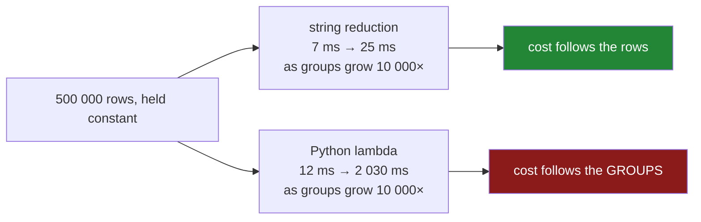

# 5.3 — What `apply` costs, measured

## One-line answer

A Python function inside a group-by is called **once per group**, so its cost grows with the number of
groups rather than the number of rows — which is why the same code is twice as slow on ten groups and
eighty times as slow on a hundred thousand.

---

## The story

The flat's shopping is one sheet with a few hundred lines on it, grouped by aisle. There are about ten
aisles. Anything anybody writes runs instantly, and it does not matter how it is written.

Then somebody gets hold of the supermarket's own data for a research project: half a million lines,
and the interesting key is not the aisle but the product — a hundred thousand different products.

The code is the same code. It worked on the sheet. On the new data it does not finish, and the person
running it assumes the problem is the number of lines, because half a million is a big number and a
few hundred is not.

It is not the lines. Written one way the job takes twenty-five milliseconds on half a million lines.
Written the other way it takes two seconds on the same half a million lines. The difference is not
the data; it is that one version does the work in one pass and the other version starts a hundred
thousand separate little jobs.

And the thing that makes it a trap: on the flat's ten aisles, the two versions differed by a factor
of two. Nobody would ever have noticed.

---

## The idea in plain language

Day 29 measured what a Python loop costs on a frame and found the answer was "thousands of times more
than the vectorised version"
([Day 29, 3.1](../../../day-29-iteration-and-order/parts/03-the-measurement/3.1-what-a-million-rows-is-for.md)).
This is the same argument with a different variable, and the difference matters.

When you pass a **string** to `agg` or `transform` — `"mean"`, `"sum"`, `"size"` — pandas recognises
it and runs a compiled routine over all the grouped data at once. One pass, no Python.

When you pass a **function** — a lambda, a named function, anything callable — pandas has to hand each
group to it separately. Per group, that means: build a Series or a frame for the group's rows, call
into Python, run your code, take the result back. **Once per group.**

So the cost has two parts, and only one of them is about the data:

- the work itself, which is proportional to the number of **rows**;
- the per-group overhead, which is proportional to the number of **groups**.

On ten groups the second part is invisible. On a hundred thousand groups it is everything. That is the
opposite of most pandas performance advice, which is about rows, and it is why an `apply` that is fine
in testing falls over in production: test data usually has fewer distinct keys.

The practical shape of the rule:

| what you write | what runs |
|---|---|
| `g.mean()`, `g.agg("mean")` | one compiled pass |
| `g.agg(lambda s: s.mean())` | one Python call per group |
| `g.transform("mean")` | one compiled pass plus a scatter |
| `g.transform(lambda s: s.mean())` | one Python call per group, plus a scatter |
| `g.apply(fn)` | one Python call per group, plus a frame built per group |
| `g.filter(fn)` | one Python call per group |

`transform` with a lambda is the worst of the set, because it pays the per-group Python cost **and**
the scatter back across every row.

None of this means never use a function. It means: **know which of the two numbers you are scaling
with, and check the number of groups before assuming an `apply` will be fine.** `frame[key].nunique()`
is the number that decides.

---

## Why Setu needs it

- **[5.2](5.2-apply-the-escape-hatch.md)** said "`apply` is the last resort" and gave the reasoning.
  This is the measurement behind it.
- **[2.3](../02-aggregating/2.3-agg-several-answers-at-once.md)** preferred the string form of a
  reduction over a lambda. This is why, with numbers.
- **[5.1](5.1-filter-keeping-whole-groups.md)** preferred `transform` and a mask over `filter`. Same
  reason, same measurement.
- **[6.2](../06-the-module/6.2-the-test-that-can-go-red.md)** notes that no correctness test catches a
  slow-but-right implementation, which is why the reasoning has to live in a comment and a benchmark
  rather than in the suite.
- **Day 35** is where pandas stops and Polars and DuckDB start, and the group-by with many keys is one
  of the two benchmarks that day runs.

---

## The mechanism

Half a million rows, twenty thousand groups, five ways to compute the same means:

```python
import time

import numpy as np
import pandas as pd

rng = np.random.default_rng(31)
n, k = 500_000, 20_000
df = pd.DataFrame({"key": rng.integers(0, k, n), "x": rng.normal(size=n)})
g = df.groupby("key")["x"]


def best(fn, reps):
    times = []
    for _ in range(reps):
        start = time.perf_counter()
        fn()
        times.append(time.perf_counter() - start)
    return min(times) * 1000


for label, fn, reps in [
    ("agg('mean')      ", lambda: g.mean(), 5),
    ("agg(lambda)      ", lambda: g.agg(lambda s: s.mean()), 1),
    ("apply(lambda)    ", lambda: g.apply(lambda s: s.mean()), 1),
    ("transform('mean')", lambda: g.transform("mean"), 3),
    ("transform(lambda)", lambda: g.transform(lambda s: s.mean()), 1),
]:
    print(f"{label} {best(fn, reps):9.1f} ms")
```

**Line by line:**

- `rng.integers(0, k, n)` makes a key column with about twenty thousand distinct values across half a
  million rows — an average of twenty-five rows per group, which is a realistic shape for a customer
  or product key.
- `g` is built **once** and reused for every timing, so the grouping cost is not being measured five
  times. The grouping itself is shared; only the final step differs.
- `best(fn, reps)` takes the **minimum** of several runs rather than the mean. The minimum is the run
  least disturbed by whatever else the machine was doing, which is the convention from
  [Day 29, 3.1](../../../day-29-iteration-and-order/parts/03-the-measurement/3.1-what-a-million-rows-is-for.md).
- The slow ones get `reps=1`, because running a two-second measurement five times is a waste of a
  minute and the variance on a slow operation is proportionally smaller anyway.
- Every one of the five computes the same group means. **The answers are identical; only the time
  differs.**

```text
agg('mean')             2.1 ms
agg(lambda)           442.2 ms
apply(lambda)         464.2 ms
transform('mean')       4.0 ms
transform(lambda)    1372.9 ms
```

Two hundred times, for a lambda that does nothing but call the method whose name you could have
passed as a string. And `transform` with a lambda is **six hundred and fifty times** the string
version, because it pays the per-group call and then the scatter.

Now the number that actually explains it — the same comparison at four different group counts:

```python
rng = np.random.default_rng(31)
n = 500_000

for k in (10, 1_000, 20_000, 100_000):
    df = pd.DataFrame({"key": rng.integers(0, k, n), "x": rng.normal(size=n)})
    g = df.groupby("key")["x"]

    start = time.perf_counter()
    g.mean()
    fast = (time.perf_counter() - start) * 1000

    start = time.perf_counter()
    g.agg(lambda s: s.mean())
    slow = (time.perf_counter() - start) * 1000

    print(
        f"groups {k:>7,}  string {fast:7.1f} ms   lambda {slow:8.1f} ms   ratio {slow / fast:5.0f}x"
    )
```

**Line by line:**

- **The number of rows is held constant at half a million** in all four cases. Only `k` — the number
  of distinct keys — changes. That is the experiment: if the cost were about rows, all four ratios
  would be the same.
- `f"{k:>7,}"` right-aligns the group count with thousands separators, so the four lines line up and
  the growth is readable.
- Read the ratio column down: **2, 3, 31, 81.** The string version barely moves — from 7 ms to 25 ms —
  while the lambda version goes from 12 ms to two seconds.
- The string version's small increase is real work: more groups means more output rows and more
  hashing. The lambda version's increase is a hundred thousand Python calls.

```text
groups      10  string     6.8 ms   lambda     12.5 ms   ratio     2x
groups   1,000  string    10.1 ms   lambda     34.5 ms   ratio     3x
groups  20,000  string    14.1 ms   lambda    430.0 ms   ratio    31x
groups 100,000  string    25.1 ms   lambda   2029.8 ms   ratio    81x
```

**That table is the whole part.** On ten groups the two are within a factor of two and nobody would
choose between them. On a hundred thousand groups the gap is eighty-fold, and the code did not change.



---

## When it breaks

**The benchmark that proves the wrong thing:**

```text
$ uv run python -c "
import time
import numpy as np, pandas as pd
rng = np.random.default_rng(31)
df = pd.DataFrame({'key': rng.integers(0, 10, 500_000), 'x': rng.normal(size=500_000)})
g = df.groupby('key')['x']
t = time.perf_counter(); g.mean(); fast = (time.perf_counter() - t) * 1000
t = time.perf_counter(); g.agg(lambda s: s.mean()); slow = (time.perf_counter() - t) * 1000
print(f'string {fast:6.1f} ms   lambda {slow:6.1f} ms   ratio {slow / fast:4.1f}x')
"
```

```text
string    6.9 ms   lambda   12.4 ms   ratio  1.8x
```

**What it means.** Half a million rows — a big, serious-looking benchmark — and the lambda is less
than twice as slow. Somebody reading this would reasonably conclude that the lambda is fine. It is
fine **for ten groups**, and the code will meet a hundred thousand groups in production, where the
same measurement gives eighty. **A benchmark whose group count does not match production measures
nothing**, and group count is the parameter people never vary because it is not the obvious one.

**A `transform` with a lambda, which is the worst case:**

```text
$ uv run python -c "
import time
import numpy as np, pandas as pd
rng = np.random.default_rng(31)
df = pd.DataFrame({'key': rng.integers(0, 20_000, 500_000), 'x': rng.normal(size=500_000)})
g = df.groupby('key')['x']
t = time.perf_counter(); a = g.transform('mean'); fast = (time.perf_counter() - t) * 1000
t = time.perf_counter(); b = g.transform(lambda s: s.mean()); slow = (time.perf_counter() - t) * 1000
print(f'string {fast:7.1f} ms   lambda {slow:8.1f} ms   ratio {slow / fast:5.0f}x')
print('same answer:', a.equals(b))
"
```

```text
string    17.0 ms   lambda   1376.2 ms   ratio    81x
same answer: False
```

**What it means.** Eighty times as long for the same calculation — `transform` with a function pays
twice, a Python call to compute each group's value and then the scatter back across every row. **This
is the most expensive shape on the day**, and it is what people write when they want
`transform("mean")` and cannot remember that the string form exists.

The `same answer: False` is worth a second look, because it is not what it appears to be. The two
columns differ in the sixteenth decimal place: the compiled path adds a group's values in a different
order from `Series.mean`, and floating-point addition is not associative
([Day 23, 2.6](../../../day-23-ufuncs-and-statistics/parts/02-statistics/2.6-float-summation-and-the-drift.md)).
`equals` demands bit-for-bit sameness and reports `False`; `np.allclose` would report `True`. **Never
compare two float results with `equals`** — the next transcript measures the actual difference.

**The correctness test that stays green:**

```text
$ uv run python -c "
import numpy as np, pandas as pd
rng = np.random.default_rng(31)
df = pd.DataFrame({'key': rng.integers(0, 50, 5_000), 'x': rng.normal(size=5_000)})
g = df.groupby('key')['x']
fast = g.mean()
slow = g.agg(lambda s: s.mean())
print('identical:', fast.equals(slow))
print('max difference:', float((fast - slow).abs().max()))
"
```

```text
identical: False
max difference: 5.551115123125783e-17
```

**What it means.** `equals` says `False` and the largest disagreement is five hundredths of a
millionth of a millionth of a millionth — the two implementations sum each group in a different order
and float addition is not associative. So the honest test is `np.allclose`, not `equals`, and once you
write it that way **the two implementations pass identically**: no assertion on the values can
distinguish a fast implementation from a slow one. A test suite cannot catch a slow-but-correct
implementation, and neither can a code review that only checks the output. This is the same finding as
[Day 29, 6.2](../../../day-29-iteration-and-order/parts/06-the-module/6.2-the-test-that-can-go-red.md):
performance is a property no correctness test defends. The defences are a comment saying why the
string form was chosen, and a benchmark that runs at production group counts.

---

## In production

**What a professional writes instead of the teaching version.** They check the group count before
choosing, and they make the choice visible:

```python
import logging

import pandas as pd

log = logging.getLogger(__name__)

APPLY_GROUP_LIMIT = 5_000


def guarded_apply(frame: pd.DataFrame, by: list[str], fn, limit: int = APPLY_GROUP_LIMIT):
    """Run a per-group Python function, refusing when there are too many groups.

    A Python function is called once per group, so the cost scales with the number of
    groups, not with the number of rows. Above `limit`, rewrite with agg/transform or
    with sort_values + head — see 5.2.
    """
    groups = int(frame[by].drop_duplicates().shape[0])
    if groups > limit:
        raise ValueError(
            f"{groups:,} groups exceeds the apply limit of {limit:,}; "
            f"a Python call per group will dominate — use a string reduction instead"
        )
    log.debug("apply over %d groups", groups)
    return frame.groupby(by, observed=True, dropna=False).apply(fn)
```

**Line by line:**

- The docstring's second paragraph is the **reason**, not the behaviour. Six months later the question
  is "why is there a limit here", and the answer has to be in the file.
- `APPLY_GROUP_LIMIT = 5_000` is a constant, so the threshold is arguable in a review rather than
  buried. Five thousand is where the ratio in the table above starts climbing steeply; the right
  number depends on how much work the function does.
- `frame[by].drop_duplicates().shape[0]` counts distinct **combinations** of the keys, which is the
  right number for a multi-key group-by
  ([4.4](../04-the-keys/4.4-two-keys-and-the-multiindex.md)). `nunique()` on one column would be
  wrong the moment `by` has two entries.
- The check happens **before** the group-by, so the failure is immediate rather than after two
  minutes of work.
- The error message says what to do — *use a string reduction instead* — because an error that only
  reports a problem makes the reader go and find the reasoning again.
- `log.debug` rather than `info` on the success path: it runs on every call, and a line per call at
  `info` is noise.
- The function takes `fn` untyped on purpose; typing it as `Callable[[pd.DataFrame], Any]` would be
  honest and would not constrain anything, because `apply`'s whole problem is that the return type is
  not knowable ([5.2](5.2-apply-the-escape-hatch.md)).

**What changes at scale.** Three things, in the order you meet them. First, the group count grows
faster than people expect: a key that is a customer ID has as many groups as customers, and a
composite key of customer and month has as many as the product of the two. Second, `apply` builds a
frame per group, so with many groups the allocator becomes the bottleneck and memory pressure rises
even though the data has not grown. Third — and this is the one that changes designs — a per-group
Python function cannot be parallelised by pandas and cannot be pushed into a database, so an `apply`
in the middle of a pipeline is a wall the whole pipeline has to run through in one thread. The same
operation as a window function in DuckDB (Day 35) or in the warehouse runs in parallel across cores.
Where an `apply` is genuinely irreducible, the usual production answer is to reduce the number of
groups first — filter, aggregate to a coarser key, or process in batches — rather than to make the
function faster.

**The failure mode that only appears with real data.** The job runs nightly and is fine for a year,
because the key is a customer ID and there are eight thousand customers. The business grows, the
customer count reaches two hundred thousand, and the job's runtime goes from four minutes to nine
hours — not gradually in proportion to the data, but on the curve in the table above. Nothing about
the code changed and nothing about the data is wrong. The monitoring that catches it early is
**runtime against group count**, logged together, so the relationship is visible before it becomes an
incident.

**The review comment a senior engineer leaves.** *"`groupby('session_id').transform(lambda s:
s.mean())` — that is a Python call per session and a scatter, over about 400 000 sessions. Use
`transform('mean')`; it is the same answer in a few milliseconds. Please also add the group count to
the job's log line so we can see this coming next time."*

**The interview question.** *"Why is `groupby().apply()` slow?"* Because the function is called once
per group in Python, with a frame built for each group, so the cost scales with the number of groups
rather than the number of rows — which is why a benchmark on ten groups tells you nothing about a
hundred thousand. The follow-up that shows you have measured it: *"how much slower?"* On half a
million rows, a lambda mean against the string `"mean"` is about twice as slow at ten groups and about
eighty times as slow at a hundred thousand; `transform` with a lambda is worse again, because it pays
the per-group call and the scatter back.

---

## Check yourself

```bash
uv run python -c "
import time
import numpy as np, pandas as pd
rng = np.random.default_rng(31)
n = 500_000
for k in (10, 1_000, 20_000, 100_000):
    df = pd.DataFrame({'key': rng.integers(0, k, n), 'x': rng.normal(size=n)})
    g = df.groupby('key')['x']
    t = time.perf_counter(); g.mean(); fast = (time.perf_counter() - t) * 1000
    t = time.perf_counter(); g.agg(lambda s: s.mean()); slow = (time.perf_counter() - t) * 1000
    print(f'groups {k:>7,}  string {fast:7.1f} ms   lambda {slow:8.1f} ms   ratio {slow / fast:5.0f}x')
"
```

Your numbers will differ from the ones in this part — every timing here came from one laptop under
whatever else it was doing. Say which column should look roughly the same as this page's and which
should not, and say what that tells you about which measurements are worth quoting.

**Answer out loud, without scrolling up:**

> Say which quantity a Python function inside a group-by scales with, and which quantity a string
> reduction scales with. Then say why a benchmark on half a million rows can be completely misleading,
> and name the one number you would check before writing an `apply`.

---

**Next:** [6.1 — `src/setu/grouping.py`, the day's module](../06-the-module/6.1-the-grouping-module.md).
