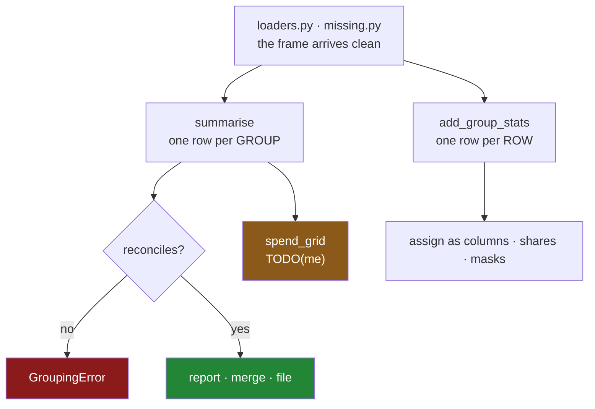

# 6.1 — `src/setu/grouping.py`: the day's module

## One-line answer

The day's module keeps three promises — **no row is dropped without being counted**, **every function
says which shape it returns**, and **no Python runs per group** — and where a promise cannot be kept
by the code it is kept by a check that refuses.

---

## The story

By the end of the day the flat has a set of habits. Say `observed` out loud. Say `dropna` out loud.
Reconcile the totals. Do not put a lambda inside a group-by.

Habits are private, and the next person to open this file has not had the day.

`observed=True` looks like clutter somebody could tidy away. `dropna=False` looks like a workaround for
a bug that has since been fixed. A `transform("size")` and a mask looks longer than the `filter` it
replaced, so somebody shortens it. A summary function that returns the key as a column looks like it
could return a Series instead, which is neater.

Every one of those edits passes review, keeps the tests green, and undoes an afternoon.

So the habits go into one file, with the reasons attached, and where the code cannot enforce a rule a
check refuses instead.

---

## The idea in plain language

`src/setu/grouping.py` holds the day's operations. Each one carries a decision the day argued for:

| the function | the rule it keeps | how it keeps it |
|---|---|---|
| `SPEND_SUMMARY` | the report's columns are reviewable data | a named-aggregation spec, one constant ([2.4](../02-aggregating/2.4-named-aggregation.md)) |
| `summarise` | no row vanishes uncounted | `dropna=False`, and the totals reconcile ([4.3](../04-the-keys/4.3-dropna-and-the-rows-that-vanished.md)) |
| `add_group_stats` | the shape is in the name | returns one row per **row**, index asserted ([3.3](../03-transform/3.3-transform-and-agg-the-shape-rule.md)) |
| `share_of_group` | a share of a partial total is not a share | refuses on incomplete columns ([3.2](../03-transform/3.2-the-share-of-the-aisle.md)) |
| `drop_small_groups` | no Python per group | `transform("size")` and a mask ([5.1](../05-filter-and-apply/5.1-filter-keeping-whole-groups.md)) |
| `top_rows_per_group` | top-N without an `apply` | `sort_values` then `head` ([5.2](../05-filter-and-apply/5.2-apply-the-escape-hatch.md)) |
| `spend_grid` | an absent pair is a decision | **not yet** — it fills with zero; yours to fix ([4.4](../04-the-keys/4.4-two-keys-and-the-multiindex.md)) |

Three of those are worth calling out.

**`summarise` returns a frame with the keys as columns, always.** The index form is convenient inside
a function and wrong at every boundary ([4.1](../04-the-keys/4.1-the-key-became-the-index.md)), and a
function whose return *type* changes with its arguments — a Series for one aggregated column, a frame
for two — is one every caller has to guess about.

**`add_group_stats` is named for its shape, not for what it computes.** Alongside `summarise` there
are two functions over the same data returning different shapes, and the only defence against picking
the wrong one is that the names say which is which
([3.3](../03-transform/3.3-transform-and-agg-the-shape-rule.md)).

**`spend_grid` is deliberately wrong.** As written it calls `.fillna(0)` on the pivoted result, which
turns "these two never occurred together" into "they occurred and came to nothing" — the failure from
[4.4](../04-the-keys/4.4-two-keys-and-the-multiindex.md). It is left that way on purpose, *When it
breaks* measures the damage, and the build brief asks you to fix it.

The module builds on the days before it rather than repeating them. It imports `SelectionError` from
Day 28's `select.py` and `ImputationError` from Day 30's `missing.py` rather than inventing a sixth
exception meaning "this frame is not what I expected", and it assumes the frame arrived through Day
27's loader, so it never re-checks dtypes.

---

## Why Setu needs it

- **[6.2](6.2-the-test-that-can-go-red.md)** tests every promise on this page, and finds that the most
  important one cannot be tested at all.
- **Sections 2 and 3** argued about shape; **section 4** about keys; **section 5** about cost. This is
  where all three stop being advice.
- **Day 26's `frames.py`** owns what a shopping list *is*, **Day 27's `loaders.py`** how it *arrives*,
  **Day 28's `select.py`** how it is *selected from*, **Day 29's `order.py`** how it is *ordered*, and
  **Day 30's `missing.py`** what happens where it is *incomplete*. This owns how it is *summarised*.
- **Day 32** joins the summary back onto the detail, which is why `summarise` returns columns rather
  than an index.
- **Day 45** is the Phase 4 gate, whose `audit()` deliverable is `summarise` plus the reconciliation
  that surrounds it.

---

## The mechanism

The head of the file, and the summary that reconciles:

```python
"""Group the flat's shopping — summarised, shared and filtered — without losing a row."""

from __future__ import annotations

import logging

import pandas as pd

from setu.missing import ImputationError
from setu.select import SelectionError

log = logging.getLogger(__name__)

UNKNOWN = "unknown"
MIN_GROUP_ROWS = 5

SPEND_SUMMARY: dict[str, tuple[str, str]] = {
    "lines": ("item", "size"),
    "known": ("spend", "count"),
    "total": ("spend", "sum"),
    "mean_line": ("spend", "mean"),
    "dearest_unit": ("price", "max"),
}


class GroupingError(ValueError):
    """A grouping did not account for every row, or did not return the shape it promised."""


def summarise(
    frame: pd.DataFrame,
    by: list[str],
    spec: dict[str, tuple[str, str]] | None = None,
) -> pd.DataFrame:
    """One row per group, keys as columns. Refuses to lose a row or a pound."""
    plan = SPEND_SUMMARY if spec is None else spec
    needed = sorted({column for column, _ in plan.values()} | set(by))
    absent = sorted(set(needed) - set(frame.columns))
    if absent:
        raise SelectionError(f"frame has no columns {absent}; has {list(frame.columns)}")
    if not any(how == "size" for _, how in plan.values()):
        raise GroupingError("every summary must carry a group size")

    keyed = frame.copy()
    for column in by:
        blanks = int(keyed[column].isna().sum())
        if blanks:
            log.warning(
                "%s: %d of %d rows have no key; grouping as %r", column, blanks, len(keyed), UNKNOWN
            )
            keyed[column] = keyed[column].fillna(UNKNOWN)

    out = keyed.groupby(by, observed=True, dropna=False, as_index=False).agg(**plan)

    if int(out["lines"].sum()) != len(frame):
        raise GroupingError(
            f"groups account for {int(out['lines'].sum())} rows, frame has {len(frame)}"
        )
    return out
```

**Line by line:**

- `UNKNOWN`, `MIN_GROUP_ROWS` and `SPEND_SUMMARY` are module constants: the three policy decisions on
  this page, readable without opening a function.
- `SPEND_SUMMARY` maps output name to `(column, reduction)` — exactly the shape `agg(**plan)` wants, so
  the reviewable constant **is** the executable call
  ([2.4](../02-aggregating/2.4-named-aggregation.md)).
- Two exceptions are **imported**, not redefined. A third class meaning "this frame is wrong" would
  make `except` clauses miss errors
  ([Day 18, 2.2](../../../day-18-exceptions/parts/02-the-hierarchy/2.2-which-built-in-to-raise.md)).
- `GroupingError` is genuinely different: the frame is fine and the **grouping** did not do what it
  said.
- `spec: ... | None = None` with the constant chosen inside, because a mutable default is shared by
  every call
  ([Day 19, 2.2](../../../day-19-typing-dataclasses-and-concurrency/parts/02-dataclasses/2.2-default-factory.md)).
- The `"size"` check enforces [2.2](../02-aggregating/2.2-size-counts-rows-count-counts-values.md)'s
  rule structurally: a summary with no group size is refused, because it cannot be sanity-checked.
- The key-filling loop **warns with counts** rather than raising, so the blank-key rate is visible in
  the logs and a change in it is noticeable
  ([4.3](../04-the-keys/4.3-dropna-and-the-rows-that-vanished.md)).
- `dropna=False` is still passed even though the keys were just filled — belt and braces, so a new key
  column added to `by` without the fill still keeps its rows.
- `observed=True`, so a categorical key does not produce a row per unseen category
  ([4.5](../04-the-keys/4.5-observed-and-the-aisle-nobody-visited.md)).
- `as_index=False`, so the keys come back as columns and the return type is a frame whatever the spec
  contains ([4.1](../04-the-keys/4.1-the-key-became-the-index.md)).
- The final `out["lines"].sum() != len(frame)` is the **reconciliation**. Every row must be in exactly
  one group, and a mismatch means something was dropped. It costs one addition.

The two shapes, named for their shapes:

```python
def add_group_stats(frame: pd.DataFrame, value: str, by: list[str]) -> pd.DataFrame:
    """One row per ORIGINAL ROW: each row's own group's total, mean and size.

    Aligned to `frame`, so the result can be assigned as columns. Contrast with
    `summarise`, which returns one row per group and cannot be.
    """
    grouped = frame.groupby(by, observed=True, dropna=False)[value]
    stats = pd.DataFrame(
        {
            f"{value}_group_total": grouped.transform("sum"),
            f"{value}_group_mean": grouped.transform("mean"),
            "rows_in_group": grouped.transform("size"),
        },
        index=frame.index,
    )
    if not stats.index.equals(frame.index):
        raise GroupingError("transform result is not aligned to the input frame")
    return stats


def drop_small_groups(
    frame: pd.DataFrame, by: list[str], min_rows: int = MIN_GROUP_ROWS
) -> pd.DataFrame:
    """Keep only the rows of groups with at least `min_rows` rows. No Python per group."""
    sizes = frame.groupby(by, observed=True, dropna=False)[frame.columns[0]].transform("size")
    keep = sizes >= min_rows
    dropped = int((~keep).sum())
    if dropped:
        offenders = frame.loc[~keep, by].drop_duplicates()
        log.info("dropped %d rows in %d groups below %d", dropped, len(offenders), min_rows)
    return frame[keep]
```

**Line by line:**

- The docstring's first line of `add_group_stats` shouts **ONE ROW PER ORIGINAL ROW**, and the second
  paragraph names its opposite. That is the only defence against the silent all-`NaN` column from
  [3.3](../03-transform/3.3-transform-and-agg-the-shape-rule.md).
- The three transforms share one `grouped` object, so the grouping happens once for three columns
  rather than three times.
- The column names carry the value, the reduction and the fact that it is a group statistic —
  `spend_group_total` rather than `total`, so a frame with several of these is readable.
- `index=frame.index` is stated explicitly on the constructor so it would raise if any transform came
  back misaligned, and `stats.index.equals(frame.index)` checks it again. Cheap, and the only
  mechanical guard against the quiet failure.
- `drop_small_groups` uses `transform("size")` and a mask, **not** `filter`, because `filter` calls a
  Python function per group ([5.3](../05-filter-and-apply/5.3-what-apply-costs-measured.md)).
- `frame.columns[0]` gives `transform` a column to work on; `size` ignores which, and requiring the
  caller to name an irrelevant column would be worse.
- The log names how many groups went as well as how many rows, because "18% of rows" and "12 000
  groups" lead to different investigations.

And the deliberately unfinished one:

```python
def spend_grid(frame: pd.DataFrame, rows: str, columns: str, value: str = "spend") -> pd.DataFrame:
    """A rows-by-columns grid of totals.

    TODO(me): this fills unobserved pairs with 0, which asserts that the pair occurred
    and came to nothing. 4.4 showed the bakery average halving because of it. Add an
    `absent: float | None` parameter, default None, and make the caller decide.
    """
    tidy = summarise(frame, [rows, columns])
    return tidy.pivot(index=rows, columns=columns, values="total").fillna(0)
```

**Line by line:**

- `tidy = summarise(...)` reuses the reconciled summary, so the grid inherits the row-count guarantee
  rather than re-implementing it.
- `.pivot(index=..., columns=..., values=...)` names its three arguments, unlike `unstack`, which
  depends on which level happens to be innermost
  ([4.4](../04-the-keys/4.4-two-keys-and-the-multiindex.md)).
- `.fillna(0)` is the bug. Every cell for a pair that never occurred becomes a confident zero, and
  every mean, minimum and ranking over the grid is then wrong
  ([Day 30, 5.1](../../../day-30-missing-data/parts/05-filling/5.1-fillna-is-a-claim.md)).
- The docstring names the failure and the fix, so the task is checkable: the fixed version has an
  `absent` parameter whose default leaves the cells blank.



---

## When it breaks

**The reconciliation firing on a blank key:**

```text
$ uv run python -c "
import pandas as pd
class GroupingError(ValueError): pass
def summarise(frame, by):
    out = frame.groupby(by, observed=True, as_index=False).agg(lines=('spend', 'size'), total=('spend', 'sum'))
    if int(out['lines'].sum()) != len(frame):
        raise GroupingError(f\"groups account for {int(out['lines'].sum())} rows, frame has {len(frame)}\")
    return out
shop = pd.DataFrame({'aisle': ['dairy', 'bakery', None], 'spend': [2.30, 1.40, 3.10]})
summarise(shop, ['aisle'])
"
```

```text
Traceback (most recent call last):
  File "<string>", line 12, in <module>
  File "<string>", line 7, in summarise
GroupingError: groups account for 2 rows, frame has 3
```

**What it means.** Without the check this returns a two-row report and £3.10 goes missing with no sign
of it ([4.3](../04-the-keys/4.3-dropna-and-the-rows-that-vanished.md)). The module's version fills the
key first so this path is not reached; the check stays anyway, because the fill only covers the
columns in `by` and the next person will add a key column somewhere else.

**The unfinished grid, measured:**

```text
$ uv run python -c "
import pandas as pd
tidy = pd.DataFrame({
    'shop':  ['main', 'main', 'corner'],
    'aisle': ['dairy', 'bakery', 'dairy'],
    'total': [2.30, 1.40, 1.92],
})
grid = tidy.pivot(index='shop', columns='aisle', values='total')
print(grid)
print()
print('mean per aisle, blank kept:', grid.mean().round(3).to_dict())
print('mean per aisle, zero fill :', grid.fillna(0).mean().round(3).to_dict())
"
```

```text
aisle   bakery  dairy
shop
corner     NaN   1.92
main       1.4   2.30

mean per aisle, blank kept: {'bakery': 1.4, 'dairy': 2.11}
mean per aisle, zero fill : {'bakery': 0.7, 'dairy': 2.11}
```

**What it means.** The corner shop does not stock bread, and `fillna(0)` records that it stocked bread
and sold none — halving the bakery's average. **No error.** This is the `TODO(me)` in the module, and
the build brief asks you to make the caller state which meaning applies.

**A wrong column name, caught early:**

```text
$ uv run python -c "
import pandas as pd
class SelectionError(ValueError): pass
SPEND_SUMMARY = {'lines': ('item', 'size'), 'total': ('spend', 'sum')}
def summarise(frame, by, plan=None):
    plan = SPEND_SUMMARY if plan is None else plan
    needed = sorted({c for c, _ in plan.values()} | set(by))
    absent = sorted(set(needed) - set(frame.columns))
    if absent:
        raise SelectionError(f'frame has no columns {absent}; has {list(frame.columns)}')
summarise(pd.DataFrame({'aisle': ['dairy'], 'cost': [2.30]}), ['aisle'])
"
```

```text
Traceback (most recent call last):
  File "<string>", line 11, in <module>
  File "<string>", line 9, in summarise
SelectionError: frame has no columns ['item', 'spend']; has ['aisle', 'cost']
```

**What it means.** The check collects **every** missing column and prints both sides of the mismatch.
Without it, `agg` would raise on the first one it reached, naming `item` and saying nothing about
`spend` or about what the frame does contain — so the fix would take two rounds instead of one. On a
renamed upstream column, seeing `has ['aisle', 'cost']` is the whole answer.

---

## In production

**What a professional changes about a module like this.** Three things, none of them about pandas.

**The spec leaves the code.** `SPEND_SUMMARY` starts as a constant and ends up in a report definition
that non-engineers can edit, because the people who decide what a report contains are usually not the
people who edit this file. The function keeps its signature; the plan arrives from outside. The
intermediate step, and a good one, is a test that asserts the spec's output names against a frozen
list, so a change to the report is a deliberate two-file diff
([6.2](6.2-the-test-that-can-go-red.md)).

**The reconciliation becomes a metric, not just an exception.** Raising is right for a batch job and
wrong for a dashboard that has to render something. In a mature pipeline the row-count difference is
emitted alongside the result — `rows_in`, `rows_grouped`, `rows_dropped` — so that a small, expected
loss can be tolerated and watched while a large one alerts. The check does not go away; it gains a
threshold.

**The group count is logged with the runtime.** [5.3](../05-filter-and-apply/5.3-what-apply-costs-measured.md)
showed that runtime scales with the number of groups for anything that calls Python. Logging both
means the relationship is visible before it becomes an incident, which is the only warning you get
that a key's cardinality has grown.

**What changes at scale.** `summarise` is one grouping and one aggregation pass, which is the cheap
shape. `add_group_stats` is a grouping plus three scatters and produces a frame the size of the input,
so it is the one to watch on a wide table — and the reason it computes three columns in one call
rather than being called three times. The operation that would actually hurt is a `spend_grid` on a
high-cardinality key, which builds a dense grid of mostly-empty cells and is where a job runs out of
memory ([4.4](../04-the-keys/4.4-two-keys-and-the-multiindex.md)). Past a few million rows the whole
module is a set of `GROUP BY` and window queries, and Day 35's Polars or DuckDB run them without
building the intermediates. The design does not change; the executor does.

**The failure mode that only appears with real data.** A module like this is written against a frame
where every key is present and every group is large. Then a key column starts arriving blank for one
region, and a hundred thousand new customer IDs appear, and both of the module's guards fire at once —
the warning log fills up and `drop_small_groups` removes most of the new customers. Both behaviours are
correct and together they look like the module is broken. The production shape is that guards report
into one place with counts, so that "18% of rows dropped, 12 000 groups below the minimum, 2% of keys
blank" is one legible line rather than three unrelated symptoms.

**The review comment a senior engineer leaves.** *"`spend_grid` fills unobserved pairs with zero, so
the per-category averages on the dashboard are diluted by pairs that never happened. Add the `absent`
parameter and default it to `None`. Also `add_group_stats` and `summarise` are one letter apart in the
call site on line 84 — worth renaming one of them for the shape it returns."*

**The interview question.** *"How would you structure a module around group-by operations?"* Separate
the two shapes and name the functions for them, because one returns a row per group and one a row per
row and picking wrong fails silently. Make the summary spec data rather than code so the report is
reviewable. Set `observed` and `dropna` explicitly on every group-by. And reconcile — the group sizes
must add up to the frame's row count, because a dropped key is the commonest way a report quietly
under-reports.

---

## Check yourself

```bash
uv run python -c "
import pandas as pd
shop = pd.DataFrame({
    'item':  ['milk', 'bread', 'eggs', 'rice', 'tea'],
    'aisle': ['dairy', 'bakery', 'dairy', 'dry', None],
    'need':  [2, 1, 6, 1, 1],
    'price': [1.15, 1.40, 0.32, 2.05, 3.10],
})
shop['spend'] = shop['need'] * shop['price']
keyed = shop.assign(aisle=shop['aisle'].fillna('unknown'))
out = keyed.groupby('aisle', observed=True, dropna=False, as_index=False).agg(
    lines=('item', 'size'), known=('spend', 'count'), total=('spend', 'sum'),
)
print(out)
print()
print('rows accounted for:', int(out['lines'].sum()), 'of', len(shop))
print('total accounted for:', round(out['total'].sum(), 2), 'of', round(shop['spend'].sum(), 2))
"
```

Then open `src/setu/grouping.py` and read `spend_grid`'s docstring. Say which report on the flat's own
data would be visibly wrong because of it, and which one would be wrong and look fine.

**Answer out loud, without scrolling up:**

> Name the three promises this module makes. Then say why `summarise` and `add_group_stats` are named
> the way they are, and what would go wrong if a caller used one where they meant the other.

---

**Next:** [6.2 — `tests/test_grouping.py`, the test that can go red](6.2-the-test-that-can-go-red.md).
