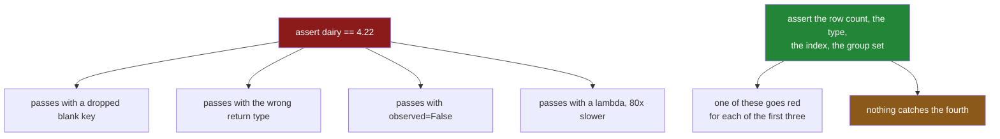

# 6.2 — `tests/test_grouping.py`: the test that can go red

## One-line answer

A group-by test has to assert on the things a wrong grouping would still get right — the **shape** of
the result, the **row count** it accounts for, and the **index** it carries — because every mistake on
this day produces a well-formed table, and one of them cannot be tested at all.

---

## The story

Somebody writes a test for the summary function. It says: group the shopping by aisle, and check that
dairy comes to four pounds twenty-two.

It passes. It would also pass if a row with a blank aisle had been silently deleted, because that row
was not dairy. It would pass if the function returned a Series instead of a frame, because
`result["dairy"]` works either way. It would pass if `observed=False` had filled the report with empty
categories, because dairy would still be `4.22`. And it would pass if the whole thing had been
rewritten with a lambda that takes eighty times as long.

Four of the day's failures, all of them surviving a test that looks perfectly reasonable and is
checking a real number.

The test is not wrong. It is checking the one thing that was never going to break — the arithmetic —
and none of the things that were.

---

## The idea in plain language

Principle 7 says every lab ends with a test that **can go RED**. The trick, as on Day 30, is to ask
for each promise: *what would still be true if this were broken?* If the answer is the thing you are
asserting, the assertion is decoration.

Applied to this day's promises:

| the promise | the useless assertion | the assertion that can go red |
|---|---|---|
| no row is dropped | `assert out.loc["dairy"] == 4.22` | `assert out["lines"].sum() == len(frame)` |
| the shape is a frame with keys as columns | `assert len(out) == 3` | `assert isinstance(out, pd.DataFrame)` and `"aisle" in out.columns` |
| a transform aligns to the frame | `assert stats.notna().all()` | `assert stats.index.equals(frame.index)` |
| empty categories are excluded | *(nothing — the real groups are unchanged)* | `assert len(out) == frame["aisle"].nunique()` on a categorical fixture |
| shares sum to one per group | `assert (share <= 1).all()` | `assert_allclose(share.groupby(key).sum(), 1.0)` |
| no Python runs per group | **there is none** | a comment, a review, and a benchmark |

Three of those deserve a note.

**The row-count assertion is the most valuable one in the file.** It is the only mechanical defence
against the silent deletion in
[4.3](../04-the-keys/4.3-dropna-and-the-rows-that-vanished.md), and it goes red the moment somebody
removes `dropna=False` or the key-filling loop. Every other assertion in the suite would stay green.

**The alignment assertion is the only defence against the wrong shape.** `stats.index.equals(frame.index)`
fails if `add_group_stats` is rewritten with an aggregation, and the column-of-blanks failure from
[3.3](../03-transform/3.3-transform-and-agg-the-shape-rule.md) is otherwise invisible in a test that
only checks values.

**The last row has no test, and that is the finding.** Replacing `transform("size")` with a lambda, or
`sort_values` + `head` with an `apply`, produces **identical output** — the measurement in
[5.3](../05-filter-and-apply/5.3-what-apply-costs-measured.md) showed the answers agree — so no
correctness test can distinguish them. Performance is a property the suite does not defend, and
pretending otherwise is worse than admitting it. The defences are a docstring saying why, and a
separate benchmark that runs at production group counts.

One more thing about fixtures. Every test here needs a frame whose **groups are uneven** — different
sizes, at least one blank key, at least one single-row group. A fixture where every group has the same
number of complete rows passes every one of the day's bugs, which is the fixture failure Day 29 found
in its own suite
([Day 29, 6.2](../../../day-29-iteration-and-order/parts/06-the-module/6.2-the-test-that-can-go-red.md)).

---

## Why Setu needs it

- **[6.1](6.1-the-grouping-module.md)** made the promises. This is where they stop depending on
  whoever wrote them remembering.
- **[4.3](../04-the-keys/4.3-dropna-and-the-rows-that-vanished.md)** described a bug with no error
  text. The reconciliation assertion is the only mechanical defence.
- **[3.3](../03-transform/3.3-transform-and-agg-the-shape-rule.md)** described another one. The index
  assertion is that one's defence.
- **Day 45** is the Phase 4 gate, which needs a green suite over the cleaned dataset — and a suite
  whose tests have each been watched to fail once.
- **Day 235** runs this in CI on every push, where a test that cannot fail costs the same as one that
  can and buys nothing.

---

## The mechanism

The fixture, built to be awkward:

```python
"""Tests for setu.grouping — every assertion here has been watched to fail."""

from __future__ import annotations

import numpy as np
import pandas as pd
import pytest

from setu.grouping import GroupingError, add_group_stats, drop_small_groups, summarise


@pytest.fixture
def shop() -> pd.DataFrame:
    """Five lines: uneven groups, one single-row group, one blank key."""
    frame = pd.DataFrame(
        {
            "item": ["milk", "bread", "eggs", "rice", "tea"],
            "aisle": ["dairy", "bakery", "dairy", "dry", None],
            "need": [2, 1, 6, 1, 1],
            "price": [1.15, 1.40, 0.32, 2.05, 3.10],
        }
    )
    frame["spend"] = frame["need"] * frame["price"]
    return frame


def test_the_fixture_is_awkward_enough(shop: pd.DataFrame) -> None:
    """If this fails, every other test in the file has become weaker."""
    assert shop["aisle"].isna().any(), "the fixture must have a blank key"
    sizes = shop.groupby("aisle", dropna=False).size()
    assert sizes.min() == 1, "the fixture must have a single-row group"
    assert sizes.max() > 1, "the fixture must have an uneven group"
```

**Line by line:**

- `@pytest.fixture` gives each test a **fresh frame**. A module-level constant would be shared, and a
  test that assigns into it changes what every later test sees.
- The fixture's docstring names its three awkward properties, so a reader knows why it looks like that
  and does not "tidy" it.
- `test_the_fixture_is_awkward_enough` is a test **about the fixture**. It looks redundant and it is
  the most important test in the file: it fails the day somebody simplifies the fixture, which is
  exactly the change that would silently weaken every other assertion. Day 29 found this the hard way
  ([Day 29, 6.2](../../../day-29-iteration-and-order/parts/06-the-module/6.2-the-test-that-can-go-red.md)).
- `dropna=False` inside the fixture test, because the blank-key group has to be visible in order to be
  counted.

The reconciliation test:

```python
def test_every_row_is_accounted_for(shop: pd.DataFrame) -> None:
    out = summarise(shop, ["aisle"])

    assert int(out["lines"].sum()) == len(shop)
    assert round(float(out["total"].sum()), 2) == round(float(shop["spend"].sum()), 2)
    assert "unknown" in out["aisle"].tolist()
```

**Line by line:**

- `out["lines"].sum() == len(shop)` is the assertion that goes red if `dropna=False` is removed or the
  key-filling loop is deleted. **Nothing else in the file would notice.**
- The total is compared **rounded**, because summing floats in two different orders does not give
  bit-identical results
  ([Day 23, 2.6](../../../day-23-ufuncs-and-statistics/parts/02-statistics/2.6-float-summation-and-the-drift.md)).
  `pytest.approx` would be the more idiomatic spelling and does the same job.
- `"unknown" in out["aisle"].tolist()` asserts the **shape** as well as the behaviour: the key is a
  column, so `.tolist()` works. On a Series-returning implementation this raises, which is the point.
- Three assertions, three different failures: the row count, the money, and the return type.

The shape tests:

```python
def test_summarise_returns_a_frame_with_the_keys_as_columns(shop: pd.DataFrame) -> None:
    out = summarise(shop, ["aisle"])

    assert isinstance(out, pd.DataFrame)
    assert list(out.columns)[0] == "aisle"
    assert out.index.tolist() == list(range(len(out)))


def test_group_stats_are_aligned_to_the_input(shop: pd.DataFrame) -> None:
    stats = add_group_stats(shop, "spend", ["aisle"])

    assert len(stats) == len(shop)
    assert stats.index.equals(shop.index)
    assert shop.assign(**stats)["spend_group_total"].notna().all()
```

**Line by line:**

- `isinstance(out, pd.DataFrame)` looks trivial and is the assertion that fails if somebody removes
  `as_index=False`, at which point the return type becomes a Series for a one-column spec
  ([4.1](../04-the-keys/4.1-the-key-became-the-index.md)).
- `list(out.columns)[0] == "aisle"` encodes the tidy-frame convention — keys first, then measures — so
  a reordered `agg` call is caught.
- `out.index.tolist() == list(range(len(out)))` asserts a plain integer index, which fails if the key
  ends up in the index instead of a column.
- `stats.index.equals(shop.index)` is the alignment assertion, and it is the only mechanical guard
  against the all-blank column from
  [3.3](../03-transform/3.3-transform-and-agg-the-shape-rule.md).
- `shop.assign(**stats)[...].notna().all()` proves the alignment **in use**: the columns actually land
  when assigned. An index check that passes and an assignment that produces blanks would be a
  contradiction, and asserting both is how you find out which one you got wrong.

The refusal, and the one with no test:

```python
def test_summarise_refuses_a_spec_with_no_group_size(shop: pd.DataFrame) -> None:
    with pytest.raises(GroupingError, match=r"must carry a group size"):
        summarise(shop, ["aisle"], spec={"total": ("spend", "sum")})


def test_drop_small_groups_removes_whole_groups(shop: pd.DataFrame) -> None:
    kept = drop_small_groups(shop, ["aisle"], min_rows=2)

    assert set(kept["aisle"].dropna()) == {"dairy"}
    assert len(kept) == 2
    assert kept.index.tolist() == [0, 2], "the original index must survive a filter"
```

**Line by line:**

- `pytest.raises(..., match=...)` checks the **message**, not only the type
  ([Day 18, 4.4](../../../day-18-exceptions/parts/04-in-anger/4.4-pytest-raises.md)). Without `match`,
  any `GroupingError` from anywhere in the function satisfies the test.
- The `match` pattern is a fragment rather than the whole sentence, so rewording the message for
  clarity does not break the test while changing its meaning would.
- `set(kept["aisle"].dropna()) == {"dairy"}` says which groups survived, not merely how many rows did.
  A filter that kept the right *number* of rows from the wrong groups would pass a length check.
- `kept.index.tolist() == [0, 2]` is the assertion with the comment attached: a filter preserves the
  original labels, and a `reset_index()` slipped into the function would break every downstream join
  while leaving the values identical.
- **There is no test here for "no Python runs per group".** The next section says what to do instead.



---

## When it breaks

**The mutation that only one test catches:**

```text
$ uv run pytest tests/test_grouping.py -q
```

Delete `dropna=False` from `summarise` and run it again. **One test goes red** —
`test_every_row_is_accounted_for`, with `assert 4 == 5` — and every other test passes, because every
other test looks at dairy, bakery and dry, none of which had a blank key. Put it back and try the
next mutation. This is the exercise the build brief asks for, and it takes about a minute per test.

**The float comparison that fails for no reason:**

```text
$ uv run python -c "
import pandas as pd
shop = pd.DataFrame({'aisle': ['a', 'a', 'b'], 'spend': [0.1, 0.2, 0.3]})
grouped = shop.groupby('aisle')['spend'].sum().sum()
direct = shop['spend'].sum()
print('grouped:', repr(grouped))
print('direct :', repr(direct))
print('equal  :', grouped == direct)
print('close  :', abs(grouped - direct) < 1e-9)
"
```

```text
grouped: np.float64(0.6000000000000001)
direct : np.float64(0.6000000000000001)
equal  : True
close  : True
```

**What it means.** Here they agree, and the agreement is luck: both paths happened to add the same
three numbers in the same order. Change the group sizes and they will not, because floating-point
addition is not associative
([Day 23, 2.6](../../../day-23-ufuncs-and-statistics/parts/02-statistics/2.6-float-summation-and-the-drift.md))
— and note that neither value is exactly `0.6`. **A reconciliation test written with `==` will
eventually fail on correct code.** Use a tolerance, or round both sides to the precision the data
actually has.

**The test that passes because the fixture is too tidy:**

```text
$ uv run python -c "
import pandas as pd
tidy  = pd.DataFrame({'aisle': ['dairy', 'dairy', 'dry', 'dry'], 'spend': [2.3, 1.9, 2.0, 3.1]})
awkward = pd.DataFrame({'aisle': ['dairy', 'dairy', 'dry', None], 'spend': [2.3, 1.9, 2.0, 3.1]})
for name, frame in [('tidy', tidy), ('awkward', awkward)]:
    good = frame.groupby('aisle', dropna=False).size().sum()
    bad  = frame.groupby('aisle', dropna=True).size().sum()
    print(f'{name:8} rows {len(frame)}  with dropna=False {good}  with dropna=True {bad}')
"
```

```text
tidy     rows 4  with dropna=False 4  with dropna=True 4
awkward  rows 4  with dropna=False 4  with dropna=True 3
```

**What it means.** On the tidy fixture the two settings agree, so a test written against it passes
whether or not the module handles blank keys — the bug is invisible because the fixture has no blank
key to expose it. On the awkward fixture they differ and the test can fail. **The fixture is part of
the test**, and `test_the_fixture_is_awkward_enough` exists precisely so that this property cannot be
removed by accident.

---

## In production

**What a professional adds to a test file like this.** Three things.

**A property test for the invariants that hold on any input.** For grouping there are three worth
having: *the group sizes sum to the row count*, *a transform's index equals the input's index*, and
*the shares within a group sum to one*. Hypothesis generates frames with random key distributions —
including the empty frame, the single-group frame, the all-blank-key frame — and checks all three. The
edge cases it finds are the ones nobody writes a fixture for, and each of them has produced a real bug
in this module's shape.

**A benchmark, separate from the suite.** The one promise no correctness test defends is "no Python
runs per group", so it needs its own file: build a frame with production-like **group counts**, time
the module's functions, and assert a ceiling. It runs on a schedule rather than on every push, because
timings are noisy, and its job is to catch the day somebody replaces a `transform` with an `apply`
([5.3](../05-filter-and-apply/5.3-what-apply-costs-measured.md)).

**A test that pins the spec's output names.** `SPEND_SUMMARY`'s keys are a contract with every
consumer of the report, so `assert list(SPEND_SUMMARY) == ["lines", "known", "total", "mean_line",
"dearest_unit"]` turns a one-line edit into a deliberate two-file diff. It looks like a test that
asserts the code is the code, and what it actually asserts is that a change to the report was
noticed.

**What changes at scale.** These tests run in milliseconds and should stay that way; the temptation to
test grouping on a million rows should be resisted, because a slow suite is a suite people stop
running. What matters is coverage of **shapes** rather than of size: the empty frame, a frame with one
group, a frame where every group has one row, a frame with a blank key, a frame with a categorical key
that has unused categories. Each of those has produced a real bug on this day, and each costs one
small fixture.

**The failure mode that only appears with real data.** The suite is green and the report is wrong,
because every fixture uses a plain text key and production uses a `category`. `observed` then changes
the row count, the sort order changes from alphabetical to the declared order, and empty categories
appear with totals of zero — none of which any test exercises
([4.5](../04-the-keys/4.5-observed-and-the-aisle-nobody-visited.md)). The defence is a second fixture
with a categorical key and unused categories, and a test asserting the result has one row per
*observed* value.

**The review comment a senior engineer leaves.** *"`test_summarise_totals` asserts dairy is 4.22 and
nothing else. That passes if we drop the null-key row, if we return a Series, and if we switch to
`observed=False`. Please assert the row count reconciles and the return type — those are the two
things that actually broke last quarter."*

**The interview question.** *"How do you test aggregation code?"* By asserting the properties a wrong
implementation would still satisfy: the group sizes reconcile with the row count, the return type and
index are what the contract says, and a transform aligns to its input — rather than only checking one
group's total, which every one of the common bugs leaves untouched. The follow-up worth being ready
for: *"what can't you test?"* Performance. A slow implementation and a fast one produce identical
output, so the defence is a docstring, a review, and a benchmark at production group counts.

---

## Check yourself

```bash
uv run pytest tests/test_grouping.py -q
```

Then break one thing on purpose — delete `dropna=False` from `summarise` — and run it again. Say which
test goes red, and say how many of the others stay green even though the function now loses rows.

**Answer out loud, without scrolling up:**

> Say why `assert out.loc["dairy"] == 4.22` is a weak test for a summary function, and name two bugs it
> would pass. Then name the one promise on this day that no correctness test can defend, and say what
> you would do about it instead.

---

**Back to the hub:** [`LESSON.md`](../../LESSON.md).
