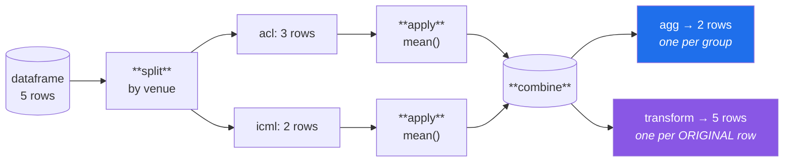

# Day 31 — `groupby`: split, apply, combine

**Phase 4 · Module 4** · ID: **PD-08** (`groupby`, `agg`, `transform`)

> **Yesterday:** missing data, and the rule that you may measure it but not fill it here.
> **Today:** the most powerful verb in pandas, and the one distinction that decides whether you get it
> right — **`agg` collapses, `transform` broadcasts back.** Get that wrong and you either lose your
> rows or leak a group statistic into your features.
> **Tomorrow:** merge, join, and reshaping.

```bash
./m start 31 && ./m scaffold 31
```

**Time:** 110 minutes. **Request budget:** 0 model calls.

---

## §1 The story

Nearly every analytical question has the same shape: *"for each X, what is the Y?"* Mean citations per
venue. Missing rate per column per year. Best paper per field.

Pandas calls the pattern **split–apply–combine**, and it is three steps you could write by hand and
never should:



The two output shapes at the bottom are the whole lesson:

| | Returns | Use it for |
|---|---|---|
| **`agg`** | one row **per group** | summaries, reports, "mean per venue" |
| **`transform`** | one row **per original row** | features, "this paper's citations minus its venue's mean" |
| **`filter`** | a subset of the **original rows** | "keep only venues with ≥ 10 papers" |
| **`apply`** | whatever your function returns | last resort; slow, and the shape is unpredictable |

And a warning that belongs here rather than in Phase 10, because you will be tempted today:

> **A group statistic computed over all your data is a leak.** `df["cites_vs_venue_mean"] =
> df["cites"] - df.groupby("venue")["cites"].transform("mean")` looks like a brilliant feature. The
> mean includes the test rows. Day 81 covers target encoding and its cross-fitted fix properly; today
> you learn to *recognise* the shape.

---

## §2 Setup — run this

```bash
mkdir -p days/day-31/lab
touch days/day-31/lab/grouping.py
```

`src/setu/frames.py` grows today. No new packages.

---

## §3 PD-08 — the mechanics

`days/day-31/lab/grouping.py`:

```python
"""PD-08: split-apply-combine, and the agg/transform distinction."""

from __future__ import annotations

import numpy as np
import pandas as pd


def papers() -> pd.DataFrame:
    return pd.DataFrame(
        {
            "venue": ["acl", "acl", "acl", "icml", "icml", "neurips"],
            "year": [2018, 2019, 2019, 2020, 2020, 2021],
            "citations": [100, 300, 200, 50, 150, np.nan],
            "title": ["a", "b", "c", "d", "e", "f"],
        },
        index=[f"p{i}" for i in range(6)],
    )


def by_hand_first() -> None:
    """Principle 2: build it naked before using the library."""
    df = papers()
    manual: dict[str, float] = {}
    for venue in sorted(df["venue"].unique()):
        rows = df.loc[df["venue"] == venue, "citations"]
        manual[venue] = rows.mean()

    library = df.groupby("venue")["citations"].mean().to_dict()
    print(f"\nby hand : {manual}")
    print(f"groupby : {library}")
    print(f"same    : {manual == library or all(np.isclose(manual[k], library[k]) or (np.isnan(manual[k]) and np.isnan(library[k])) for k in manual)}")
    print("  ^ groupby is that loop, in C, with the edge cases handled.")


def agg_collapses() -> None:
    df = papers()
    print(f"\n{df.groupby('venue')['citations'].mean().to_dict()=}")
    print(f"{len(df.groupby('venue')['citations'].mean())=}   <- 3 rows: one per venue")

    multi = df.groupby("venue")["citations"].agg(["count", "mean", "max"])
    print(f"\n{multi.to_dict('index')=}")
    print("  ^ note count=0 for neurips: count() ignores NaN (Day 30)")

    named = df.groupby("venue").agg(
        n=("title", "size"),
        n_cited=("citations", "count"),
        mean_cites=("citations", "mean"),
        best=("citations", "max"),
    )
    print(f"\n{named.to_dict('index')=}")
    print("  ^ NAMED aggregation. Always use this: the output columns are explicit.")
    print("    'size' counts rows; 'count' counts NON-MISSING. They differ here.")

    print(f"\n{df.groupby(['venue', 'year'])['citations'].mean().to_dict()=}")
    print(f"{type(df.groupby(['venue', 'year']).size().index).__name__=}   <- a MultiIndex")
    print(f"{df.groupby(['venue', 'year'], as_index=False).size().to_dict('records')=}")
    print("  ^ as_index=False keeps it a flat frame. Usually what you want.")


def transform_broadcasts_back() -> None:
    df = papers()
    means = df.groupby("venue")["citations"].transform("mean")
    print(f"\n{len(means)=}   <- 6: one per ORIGINAL row")
    print(f"{means.tolist()=}")
    print(f"{means.index.equals(df.index)=}   <- and the index is preserved, so it aligns")

    df = df.assign(vs_venue=df["citations"] - means)
    print(f"\n{df['vs_venue'].tolist()=}   <- centred within venue")

    df = df.assign(rank_in_venue=df.groupby("venue")["citations"].rank(
        method="first", ascending=False))
    print(f"{df['rank_in_venue'].tolist()=}")

    df = df.assign(venue_size=df.groupby("venue")["title"].transform("size"))
    print(f"{df['venue_size'].tolist()=}")


def filter_selects_whole_groups() -> None:
    df = papers()
    big = df.groupby("venue").filter(lambda g: len(g) >= 2)
    print(f"\n{big['venue'].unique().tolist()=}   <- venues with >= 2 papers")
    print(f"{len(big)=}   <- original ROWS from those groups, not group summaries")


def the_null_group_default() -> None:
    df = pd.DataFrame({"g": ["a", None, "a", "b"], "v": [1, 2, 3, 4]})
    print(f"\n{df['v'].sum()=}   <- total")
    print(f"{df.groupby('g')['v'].sum().sum()=}   <- groupby total: 8, not 10")
    print(f"{df.groupby('g', dropna=False)['v'].sum().sum()=}")
    print("  ^ Day 30's warning, live. ALWAYS check that group totals reconcile.")


def sort_and_observed() -> None:
    df = papers()
    print(f"\n{df.groupby('venue', sort=False).size().index.tolist()=}   <- order of appearance")
    print(f"{df.groupby('venue', sort=True).size().index.tolist()=}    <- sorted (the default)")
    print("  sort=False is faster on many groups, and the default costs a sort you may not need.")

    cat = df.assign(venue=df["venue"].astype("category"))
    small = cat[cat["venue"] == "acl"]
    print(f"\n{len(small.groupby('venue', observed=False).size())=}   <- 3: unused categories included")
    print(f"{len(small.groupby('venue', observed=True).size())=}    <- 1: only what is present")
    print("  ^ with categoricals (Day 34), `observed` decides whether empty groups appear.")


def the_leakage_shape() -> None:
    rng = np.random.default_rng(0)
    df = pd.DataFrame({
        "venue": rng.choice(["a", "b"], 100),
        "cites": rng.integers(0, 100, 100),
        "is_train": [True] * 70 + [False] * 30,
    })

    leaky = df["cites"] - df.groupby("venue")["cites"].transform("mean")

    train = df[df["is_train"]]
    train_means = train.groupby("venue")["cites"].mean()
    correct = df["cites"] - df["venue"].map(train_means)

    print(f"\n{leaky.head(3).round(2).tolist()=}   <- mean over ALL rows: LEAKY")
    print(f"{correct.head(3).round(2).tolist()=}   <- mean over TRAIN only: correct")
    print(f"{np.allclose(leaky, correct)=}   <- and they differ")
    print("\n  Both are one line. Only one of them is honest. Day 81 does this properly")
    print("  with cross-fitting; today, learn to SEE the shape.")


if __name__ == "__main__":
    by_hand_first()
    agg_collapses()
    transform_broadcasts_back()
    filter_selects_whole_groups()
    the_null_group_default()
    sort_and_observed()
    the_leakage_shape()
```

**Line by line:**

- `by_hand_first` — Principle 2. The loop over unique values *is* what `groupby` does; seeing the two
  agree means the library stops being magic.
- `.agg(["count", "mean", "max"])` — a list of function names gives a column per function. Note
  **`count` ignores NaN** while `size` counts rows — the neurips group has one row and zero non-missing
  citations, so they differ, and confusing them misreports your sample size.
- **Named aggregation** — `named=("column", "function")`. Always prefer this: the output column names
  are explicit, so a downstream rename cannot silently break, and you can aggregate the same column
  two ways in one call.
- `groupby(['venue', 'year'])` — multiple keys give a **MultiIndex**. It is powerful and awkward;
  `as_index=False` keeps a flat frame with the keys as columns, which is what you want ninety percent
  of the time.
- `transform("mean")` — **the key line.** Returns one value per **original row**, with the original
  index preserved, so it aligns for assignment (Day 28). `agg` gives three values; `transform` gives
  six.
- `groupby(...).rank(...)` — Day 29's top-n-per-group idiom, now with the groupby half explained.
- `.filter(lambda g: len(g) >= 2)` — keeps or drops **whole groups**, returning original rows. Not to
  be confused with `df.filter()`, which selects columns by name. Unfortunate naming.
- `the_null_group_default` — the totals do not reconcile: 8 versus 10. **Always sum your group
  aggregates and compare to the ungrouped total.** It takes one line and catches a silent data loss.
- `sort=False` — groups appear in order of first appearance and it skips a sort. On thousands of
  groups this is a real saving, and the sorted default is rarely needed.
- `observed=True/False` — with a **categorical** grouping key (Day 34), `observed=False` includes
  categories with no rows, producing groups of size zero. Which you want depends on whether you are
  reporting (show the empty venue) or modelling (do not).
- `the_leakage_shape` — **two one-liners, one honest.** The leaky version's group mean includes test
  rows; the correct version maps a mean computed on train only. Note the correct one uses `.map` with
  a Series (Day 29), which aligns by label. `np.allclose` is `False`: the difference is real, not
  theoretical.

---

## §4 Build brief

Extend `src/setu/frames.py`:

```python
def group_summary(frame, *, by: str | list[str], value: str) -> pd.DataFrame:
    """TODO(me): named aggregation: n, n_present, mean, std, min, median, max.

    - use named aggregation, never a bare list of function names
    - `n` uses 'size' (all rows); `n_present` uses 'count' (non-missing)
    - as_index=False, so the result is a flat frame
    - dropna=False, so null groups are visible rather than silently dropped
    - std uses ddof=1 (consistent with Days 20 and 25)
    - raise DataError if any named column is missing
    """
    raise NotImplementedError


def assert_groups_reconcile(frame, *, by: str, value: str) -> None:
    """TODO(me): raise DataError if the group sums do not equal the ungrouped sum.

    This catches the null-group default and any silent row loss.
    Compare with np.isclose, not ==, and say both numbers in the message.
    """
    raise NotImplementedError


def within_group_stat(frame, *, by: str, value: str, stat: str = "mean") -> pd.Series:
    """TODO(me): a transform - one value per ORIGINAL row, index preserved.

    - validate `stat` against {'mean','median','std','min','max','size'}
    - the returned Series MUST have the same index as `frame`; assert it
    - the docstring must warn that using this for a model feature over the full
      dataset is leakage (Principle 8). Day 81 does the cross-fitted version.
    """
    raise NotImplementedError


def group_stat_from_reference(frame, reference, *, by: str, value: str, stat: str = "mean"):
    """TODO(me): the LEAK-FREE version.

    Compute the statistic on `reference` (the training rows only), then map it onto
    every row of `frame`. Groups present in `frame` but absent from `reference`
    return NaN - do NOT fall back to a global statistic silently.
    Return (mapped_series, n_unseen_groups) so the caller must acknowledge the gap.
    """
    raise NotImplementedError


def keep_large_groups(frame, *, by: str, min_size: int) -> pd.DataFrame:
    """TODO(me): keep only rows belonging to groups with at least min_size rows.

    - preserve the original index
    - use transform('size'), not .filter(lambda) - it is far faster
    - raise DataError if min_size < 1
    """
    raise NotImplementedError
```

- `group_stat_from_reference` returning `(series, n_unseen)` is the day's design point: it makes the
  unseen-group problem **impossible to ignore**, because you have to unpack a second value. On Day 81
  this is exactly the shape target encoding needs.
- `keep_large_groups` using `transform("size")` rather than `.filter(lambda ...)` is the Day-29
  ladder applied: `filter` with a lambda calls Python once per group.

---

## §5 The eval that must be able to fail

Add to `tests/test_frames.py`:

```python
from setu.frames import (
    assert_groups_reconcile,
    group_stat_from_reference,
    group_summary,
    keep_large_groups,
    within_group_stat,
)


@pytest.fixture
def grouped() -> pd.DataFrame:
    return pd.DataFrame(
        {
            "venue": ["a", "a", "a", "b", "b", None],
            "cites": [100.0, 300.0, np.nan, 50.0, 150.0, 10.0],
        },
        index=[f"p{i}" for i in range(6)],
    )


def test_summary_distinguishes_size_from_count(grouped):
    out = group_summary(grouped, by="venue", value="cites").set_index("venue")
    assert out.loc["a", "n"] == 3, "n should count all rows"
    assert out.loc["a", "n_present"] == 2, "n_present should exclude NaN"


def test_summary_keeps_the_null_group(grouped):
    out = group_summary(grouped, by="venue", value="cites")
    assert out["venue"].isna().any(), "the null group was silently dropped"


def test_summary_is_a_flat_frame(grouped):
    out = group_summary(grouped, by="venue", value="cites")
    assert "venue" in out.columns, "as_index=False was not used"


def test_summary_uses_sample_std():
    frame = pd.DataFrame({"g": ["a"] * 8, "v": [2.0, 4, 4, 4, 5, 5, 7, 9]})
    out = group_summary(frame, by="g", value="v")
    assert out["std"].iloc[0] == pytest.approx(2.13809, rel=1e-4), "ddof=0 gives 2.0"


def test_summary_rejects_a_missing_column(grouped):
    with pytest.raises(DataError):
        group_summary(grouped, by="nope", value="cites")


def test_reconcile_passes_when_nothing_is_lost():
    frame = pd.DataFrame({"g": ["a", "b"], "v": [1.0, 2.0]})
    assert_groups_reconcile(frame, by="g", value="v")


def test_reconcile_catches_a_dropped_null_group(grouped):
    with pytest.raises(DataError) as info:
        assert_groups_reconcile(grouped, by="venue", value="cites")
    assert "10" in str(info.value) or "610" in str(info.value)


def test_within_group_stat_returns_one_value_per_row(grouped):
    out = within_group_stat(grouped, by="venue", value="cites")
    assert len(out) == len(grouped)
    assert out.index.equals(grouped.index), "the index was not preserved"


def test_within_group_stat_values_are_right(grouped):
    out = within_group_stat(grouped, by="venue", value="cites")
    assert out.loc["p0"] == pytest.approx(200.0)
    assert out.loc["p3"] == pytest.approx(100.0)


def test_within_group_stat_rejects_an_unknown_stat(grouped):
    with pytest.raises(DataError):
        within_group_stat(grouped, by="venue", value="cites", stat="mode")


def test_reference_version_uses_only_the_reference_rows():
    frame = pd.DataFrame({"g": ["a"] * 4, "v": [0.0, 0.0, 100.0, 100.0]})
    reference = frame.iloc[:2]
    mapped, unseen = group_stat_from_reference(frame, reference, by="g", value="v")
    assert mapped.tolist() == [0.0, 0.0, 0.0, 0.0], (
        "the statistic was computed over the full frame - that is leakage"
    )
    assert unseen == 0


def test_reference_version_reports_unseen_groups():
    frame = pd.DataFrame({"g": ["a", "b"], "v": [1.0, 2.0]})
    reference = frame.iloc[:1]
    mapped, unseen = group_stat_from_reference(frame, reference, by="g", value="v")
    assert unseen == 1
    assert pd.isna(mapped.iloc[1]), "an unseen group silently got a global fallback"


def test_reference_version_preserves_the_index():
    frame = pd.DataFrame({"g": ["a", "a"], "v": [1.0, 2.0]}, index=["x", "y"])
    mapped, _ = group_stat_from_reference(frame, frame, by="g", value="v")
    assert mapped.index.tolist() == ["x", "y"]


def test_keep_large_groups(grouped):
    out = keep_large_groups(grouped, by="venue", min_size=3)
    assert out["venue"].dropna().unique().tolist() == ["a"]
    assert out.index.tolist() == ["p0", "p1", "p2"]


def test_keep_large_groups_rejects_zero(grouped):
    with pytest.raises(DataError):
        keep_large_groups(grouped, by="venue", min_size=0)


def test_keep_large_groups_is_fast():
    """transform('size') is vectorised; .filter(lambda) calls Python per group."""
    import time

    rng = np.random.default_rng(0)
    frame = pd.DataFrame({"g": rng.integers(0, 20_000, 200_000), "v": rng.random(200_000)})
    start = time.perf_counter()
    keep_large_groups(frame, by="g", min_size=5)
    assert time.perf_counter() - start < 2.0, "are you using .filter(lambda)?"
```

**Line by line:**

- `test_summary_distinguishes_size_from_count` — venue `a` has three rows and two non-missing
  citations. An implementation using `count` for both reports `n=2` and understates the sample.
- `test_summary_keeps_the_null_group` — Day 30's default, caught at the library boundary.
- `test_reconcile_catches_a_dropped_null_group` — the fixture's null group holds a value of 10, so the
  group sums total 600 and the ungrouped sum is 610. The message must contain a number, so the failure
  tells you the size of the loss rather than merely that there was one.
- `test_reference_version_uses_only_the_reference_rows` — **the day's real assessment.** The fixture is
  built so the full-frame mean is 50 and the reference-only mean is 0. An implementation that computes
  over `frame` returns `50.0` and fails with a message naming leakage. **This single test is Principle
  8 for the whole phase.**
- `test_reference_version_reports_unseen_groups` — group `b` never appears in the reference, so it must
  come back NaN **and** be counted. Silently substituting a global mean is the tempting shortcut and it
  is a subtle leak of its own.
- `test_keep_large_groups_is_fast` — 20 000 groups over 200 000 rows. `transform("size")` is one pass;
  `.filter(lambda g: len(g) >= 5)` invokes Python 20 000 times. Fifth performance test in the plan,
  same algorithmic justification.

```bash
uv run python -m pytest tests/test_frames.py -v
```

---

## §6 Request budget

| Resource | Spent today |
|---|---|
| LLM calls | **0** |

---

## §7 Traps

- **Confusing `agg` and `transform`.** One collapses, one broadcasts back.
- **`count` versus `size`.** One skips NaN; one does not.
- **Null groups dropped by default.** Reconcile your totals.
- **A bare list of aggregation names.** Use named aggregation; the columns become explicit.
- **MultiIndex you did not want.** `as_index=False`.
- **`groupby.filter` versus `DataFrame.filter`.** Rows-by-group versus columns-by-name.
- **`.filter(lambda ...)` on many groups.** Python per group. Use `transform("size")`.
- **A group statistic over the full dataset as a feature.** Leakage. Compute on train, map onto all.
- **Silently filling unseen groups with a global mean.** A leak wearing a helpful hat.
- **`observed=False` with categoricals.** Empty groups appear and your denominators change.
- **`apply` on a groupby.** Slow and the output shape is unpredictable. Use `agg`/`transform`/`filter`.

---

## §8 Verify before you code

Written **2026-08-21**:

- <https://pandas.pydata.org/docs/user_guide/groupby.html> — split-apply-combine, including the
  `transform` and `filter` sections.
- <https://pandas.pydata.org/docs/reference/api/pandas.core.groupby.DataFrameGroupBy.aggregate.html> —
  named aggregation syntax.
- <https://pandas.pydata.org/docs/reference/api/pandas.DataFrame.groupby.html> — confirm the `dropna`,
  `sort` and `observed` defaults in your pandas version.

---

## §9 Say it in an interview

> "The distinction that matters is `agg` versus `transform`: `agg` gives one row per group, `transform`
> gives one per original row with the index preserved, so it aligns for assignment. Features need
> `transform`; reports need `agg`. Two defaults have cost me real time — `groupby` drops null groups,
> so group totals silently don't reconcile with the ungrouped total, and `count` skips missing values
> while `size` doesn't, so your reported n can be wrong. I have an assertion for the first. And the
> leakage shape is a one-liner people love: centring a value by its group mean is a great feature and
> a leak, because the mean includes the test rows. My helper takes the reference rows explicitly and
> returns the count of unseen groups alongside the values, so you can't ignore the gap."

---

## §10 Done when

Tick [`CHECKLIST.md`](CHECKLIST.md), then `./m check && ./m done 31`.
