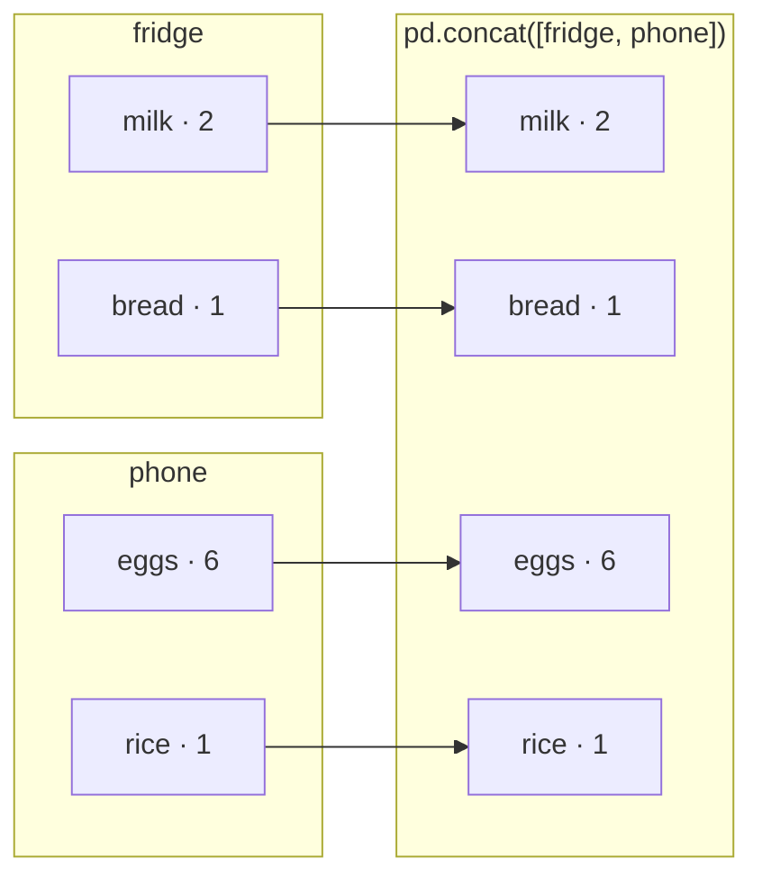

# 1.1 — Two lists, one under the other

## One-line answer

`pd.concat` puts frames end to end along one direction and matches **nothing** in that direction —
it simply writes the second list under the first — which is why it is the right tool for rows that
were never meant to correspond, and the wrong tool the moment you expect something to be paired up.

---

## The story

Two people in the flat wrote the shopping list, and neither knew the other was doing it.

One of them wrote on the pad stuck to the fridge door: milk, two of them, and a loaf of bread. The
other was at work and typed into a note on their phone: eggs, six, and a bag of rice.

On Saturday somebody has to go to the shop with both. Nothing is wrong with either list. There is no
overlap to sort out, no argument about who was right, and no decision to make about milk. There are
two pieces of paper and one trolley, and the job is to copy the second list under the first.

That is all. Four lines on one piece of paper, in the order the two lists were picked up.

---

## The idea in plain language

Two tables, one under the other. That is the whole operation.

A **DataFrame** is a table of columns, each column holding one kind of value, with a label on every
row ([Day 26, 1.3](../../../day-26-frames-and-copy-on-write/parts/01-the-two-objects/1.3-a-table-of-columns.md)).
**Concatenating** two of them means producing a third table whose rows are the first table's rows
followed by the second table's rows.

The word that matters is *followed*. Nothing is compared. Nothing is looked up. Row three of the
second table does not go looking for a partner in the first, because there is no partner to look
for: they are different shopping trips, different days, different people writing. They are simply
more rows.

That makes concatenating the **cheap** operation of the day, and the one with the fewest surprises,
because a thing that compares nothing cannot compare it wrongly. Four rows in, four rows out. If you
know the row counts of the pieces you know the row count of the result before you run it, which is
a promise almost nothing else on this day makes.

Two words for the two directions, because pandas uses both and they are easy to confuse:

- **Down** the frame is adding **rows**: the two shopping lists. This is `axis=0`, and it is the
  default.
- **Across** the frame is adding **columns**: the same rows, with more facts attached to each. This
  is `axis=1`, and it behaves completely differently — it is
  [1.4](1.4-stacking-sideways.md), and it does not deserve to be read as a footnote to this one.

There is a second family of operations on this day that does the opposite of concatenating: it
matches rows up by a shared value, and its row count is *not* predictable. That is **merging**
([2.1](../02-merging/2.1-the-key-and-the-rows-it-pairs.md)). Almost every hour lost to pandas on
this subject comes from reaching for one when the job wanted the other, so the sentence worth
holding on to is: **concatenating stacks, merging matches.**

---

## Why Setu needs it

- **[1.2](1.2-the-index-that-came-along.md)** is the first thing that goes wrong here — the row
  labels come along with the rows, and after a stack they repeat.
- **[1.3](1.3-the-columns-that-did-not-match.md)** is what happens when the two lists were not
  written to the same shape.
- **[3.1](../03-the-row-count/3.1-count-the-rows-before-and-after.md)** makes the row count the
  thing you check on every join. Concatenating is where the habit is cheap to build, because here
  the expected number is arithmetic.
- **Day 33** cleans text columns, and the loop it cleans them in usually ends with one `pd.concat`
  of the pieces.
- **Day 162** builds a retriever that reads several document sets and treats them as one corpus.
  That is this operation, with the row count checked, and nothing else.

---

## The mechanism

Two lists, written by two people, in two places:

```python
import pandas as pd

fridge = pd.DataFrame({"item": pd.Series(["milk", "bread"], dtype="str"), "need": [2, 1]})
phone = pd.DataFrame({"item": pd.Series(["eggs", "rice"], dtype="str"), "need": [6, 1]})

print(fridge)
print()
print(phone)
print()
both = pd.concat([fridge, phone])
print(both)
print()
print("rows in  :", len(fridge), "+", len(phone))
print("rows out :", len(both))
```

**Line by line:**

- `pd.Series([...], dtype="str")` — the item names are declared as text rather than left to
  inference. pandas 3.0 would infer `str` for these anyway, but writing it down is the pin
  (Principle 4), and it is what keeps the two frames' dtypes identical so the stack cannot
  silently promote one ([Day 26, 2.2](../../../day-26-frames-and-copy-on-write/parts/02-the-str-dtype/2.2-str-the-dtype-pandas-3-infers.md)).
- `pd.concat([fridge, phone])` — **the argument is a list**, one list holding both frames, not two
  separate arguments. This is the single most common typing mistake with this function, and
  *When it breaks* has the error it produces.
- The list's **order is the output's order.** `pd.concat([phone, fridge])` gives the same four rows
  with eggs and rice on top. Nothing sorts them, so if the order matters, it is the order you wrote.
- `len(fridge) + len(phone)` printed next to `len(both)` — the row count is arithmetic here, and
  that is the whole point of starting the day with this function. Say the number before you look at
  it.

```text
    item  need
0   milk     2
1  bread     1

   item  need
0  eggs     6
1  rice     1

    item  need
0   milk     2
1  bread     1
0   eggs     6
1   rice     1

rows in  : 2 + 2
rows out : 4
```

Four rows, in the order the lists were handed over. **Look at the left-hand column of the third
table.** It reads `0, 1, 0, 1`. The two rows from the phone note brought their own row labels with
them, and those labels collide with the fridge's. That is the subject of
[1.2](1.2-the-index-that-came-along.md) and it is not cosmetic.

What the operation actually does, drawn:



**Every arrow goes straight across.** No arrow crosses another, no arrow forks, and no row is
consulted about any other row. That picture is what "matches nothing" means, and it is worth
remembering because [2.2](../02-merging/2.2-the-four-hows-on-four-rows.md) draws the same kind of
diagram for merging and it is a tangle.

Concatenating is not restricted to two frames, and the list can carry as many as you have:

```python
import pandas as pd

fridge = pd.DataFrame({"item": pd.Series(["milk", "bread"], dtype="str"), "need": [2, 1]})
phone = pd.DataFrame({"item": pd.Series(["eggs", "rice"], dtype="str"), "need": [6, 1]})
shouted = pd.DataFrame({"item": pd.Series(["oats"], dtype="str"), "need": [1]})

all_three = pd.concat([fridge, phone, shouted], ignore_index=True)
print(all_three)
print("rows:", len(all_three))
```

**Line by line:**

- Three frames in one call, not two calls of two. One `pd.concat` allocates the output once;
  chaining calls allocates it once per call, which is the cost *In production* measures.
- `shouted` has one row, and a one-row frame is not a special case — the arithmetic is still
  `2 + 2 + 1`.
- `ignore_index=True` renumbers the output `0, 1, 2, 3, 4` instead of keeping the pieces' own row
  labels. It is here so the printout is readable; [1.2](1.2-the-index-that-came-along.md) is where
  it gets explained rather than used.

```text
    item  need
0   milk     2
1  bread     1
2   eggs     6
3   rice     1
4   oats     1
rows: 5
```

---

## When it breaks

**The two-argument call**, which nearly everybody writes once:

```text
$ uv run python -c "
import pandas as pd
fridge = pd.DataFrame({'item': pd.Series(['milk', 'bread'], dtype='str'), 'need': [2, 1]})
phone = pd.DataFrame({'item': pd.Series(['eggs', 'rice'], dtype='str'), 'need': [6, 1]})
pd.concat(fridge, phone)
"
```

```text
TypeError: concat() takes 1 positional argument but 2 were given
```

**What it means.** `pd.concat` takes **one** argument that is a collection of frames, not a frame
and then another frame. The message is Python's own, not pandas', which is why it talks about
positional arguments rather than about frames.

**The smallest fix** is two brackets: `pd.concat([fridge, phone])`.

It is worth knowing *why* the signature is that shape rather than being annoyed by it. A function
that takes a list can take a list of any length, including one built in a loop, and that is the
shape the *In production* section below depends on.

**The empty list**, which is what a loop over no files produces:

```text
$ uv run python -c "import pandas as pd; pd.concat([])"
```

```text
ValueError: No objects to concatenate
```

**What it means.** There was nothing in the list. On its own that is obvious; in a real script it
means the loop that filled the list found no files, matched no pattern, or filtered everything out,
and this exception is the first news of it.

**The smallest fix** is not to catch this exception. It is to check the collection before you
concatenate it, so that the message names the actual problem:

```python
import pandas as pd


def stack_all(pieces: list[pd.DataFrame], source: str) -> pd.DataFrame:
    if not pieces:
        raise ValueError(f"no frames to stack: {source} produced nothing")
    return pd.concat(pieces, ignore_index=True)
```

**Line by line:**

- `if not pieces` — an empty list is falsy, so this is the whole check. It runs before pandas gets
  a chance to produce its more general message.
- `source` is passed in only so the exception can name **where the frames were supposed to come
  from** — a directory, a query, a date range. `ValueError: No objects to concatenate` sends a
  reader to the concat call; `no frames to stack: data/receipts/2026-08/*.csv produced nothing`
  sends them to the empty directory, which is where the problem actually is.
- `ignore_index=True` is stated rather than left out, for the reason
  [1.2](1.2-the-index-that-came-along.md) gives.

---

## In production

**What a professional writes instead of the teaching version.** The same thing, but never inside the
loop. Collect the pieces into a list, concatenate once at the end:

```python
import pandas as pd


def read_all(paths: list[str]) -> pd.DataFrame:
    pieces = [pd.read_csv(path) for path in paths]
    if not pieces:
        raise ValueError(f"no files matched: {paths}")
    return pd.concat(pieces, ignore_index=True)
```

**Line by line:**

- The list comprehension builds **every** piece before anything is joined. Each `read_csv` is
  independent, so nothing here depends on anything else having happened first.
- `pd.concat(pieces, ...)` runs **once**, outside the comprehension. It walks the list, adds up the
  lengths, allocates one output block per column, and fills it. One allocation, one pass.
- The check sits between the two, so a run that matched no files fails with a sentence about files
  rather than about concatenation.

The version people write first looks harmless and is not:

```python
import pandas as pd

out = pd.DataFrame()
for path in ["a.csv", "b.csv", "c.csv"]:
    out = pd.concat([out, pd.read_csv(path)], ignore_index=True)
```

**Line by line:**

- `out = pd.concat([out, ...])` — every turn of the loop builds a **new** frame containing
  everything read so far, and then throws the previous one away.
- After `k` files the loop has copied roughly `1 + 2 + 3 + … + k` rows rather than `k`. The work
  grows with the *square* of the number of pieces, which is the same quadratic trap as growing a
  NumPy array in a loop ([Day 22, 4.5](../../../day-22-broadcasting-and-shape/parts/04-joining-and-splitting/4.5-growing-an-array-in-a-loop.md)).
- It is genuinely invisible on three files. It is not invisible on two thousand.

**What changes at scale.** Two thousand hundred-row pieces, stacked both ways on one laptop:

```text
concat in a loop :   1103.5 ms  rows 200,000
concat once      :    120.2 ms  rows 200,000
ratio            :        9x
```

Nine times, at two thousand pieces and two hundred thousand rows — and the ratio itself grows with
the number of pieces, because the loop's cost is quadratic and the single call's is linear. At two
hundred pieces you would barely notice; at twenty thousand the loop is the whole job. **The absolute
milliseconds here are one machine's; the shape of the growth is the finding**
([Day 29, 3.1](../../../day-29-iteration-and-order/parts/03-the-measurement/3.1-what-a-million-rows-is-for.md)).

The second thing that changes at scale is memory. `pd.concat` **copies**: for a moment both the
pieces and the result exist, so a stack of frames totalling 4 GB needs about 8 GB to complete. If
that is the constraint, the answer is not a cleverer concat — it is writing each piece to Parquet
and reading the directory back as one dataset
([Day 27, 3.1](../../../day-27-reading-and-writing/parts/03-parquet/3.1-columns-on-disk-with-types.md)).

**The failure that only appears with real data.** A nightly job read one CSV per shop and stacked
them. It ran for months. Then a shop was added whose file had a header row and no data rows, and
`read_csv` returned a frame with the right columns and no rows — which stacks perfectly and changes
nothing. Nobody noticed for weeks that one shop's sales were always zero, because the pipeline had
been designed to survive a missing file and had therefore been designed to be silent about one.
The fix was a row count per piece, logged, and a floor: **a piece with no rows is an event, not a
non-event.**

**The review comment a senior engineer leaves.** *"`out = pd.concat([out, chunk])` inside the loop —
that is quadratic. Append `chunk` to a list and concatenate once after the loop. While you are
there, log `len(chunk)` per file; a zero-row file currently passes through this function without
leaving a trace."*

**The interview question.** *"What is the difference between `concat` and `merge`?"* The answer that
shows you have used both: `concat` stacks and matches nothing, so its row count is the sum of the
inputs' row counts and you can state it before running. `merge` matches rows on a key, so its row
count can be smaller than either input (rows that found no partner) or larger than both (rows that
found several), and you cannot state it in advance — you have to check it. Then the practical half:
`concat` is what you use for pieces of the same table arriving separately, `merge` for different
facts about the same things. Reaching for `concat(axis=1)` when the job wanted `merge` is the
classic mistake, because it lines rows up by their labels rather than by their content
([1.4](1.4-stacking-sideways.md)).

---

## Check yourself

```bash
uv run python -c "
import pandas as pd
fridge = pd.DataFrame({'item': pd.Series(['milk', 'bread'], dtype='str'), 'need': [2, 1]})
phone = pd.DataFrame({'item': pd.Series(['eggs', 'rice'], dtype='str'), 'need': [6, 1]})
print(pd.concat([fridge, phone]))
print()
print(pd.concat([phone, fridge]))
print()
print('same rows?', len(pd.concat([fridge, phone])) == len(pd.concat([phone, fridge])))
"
```

Two stacks of the same two frames in the two possible orders. Say what is identical between them and
what is not, before you look.

**Answer out loud, without scrolling up:**

> Somebody hands you two frames and asks how many rows the result of concatenating them will have.
> Say how you know without running it. Then say why you could not answer the same question about
> merging them.

---

**Next:** [1.2 — The index that came along](1.2-the-index-that-came-along.md).
