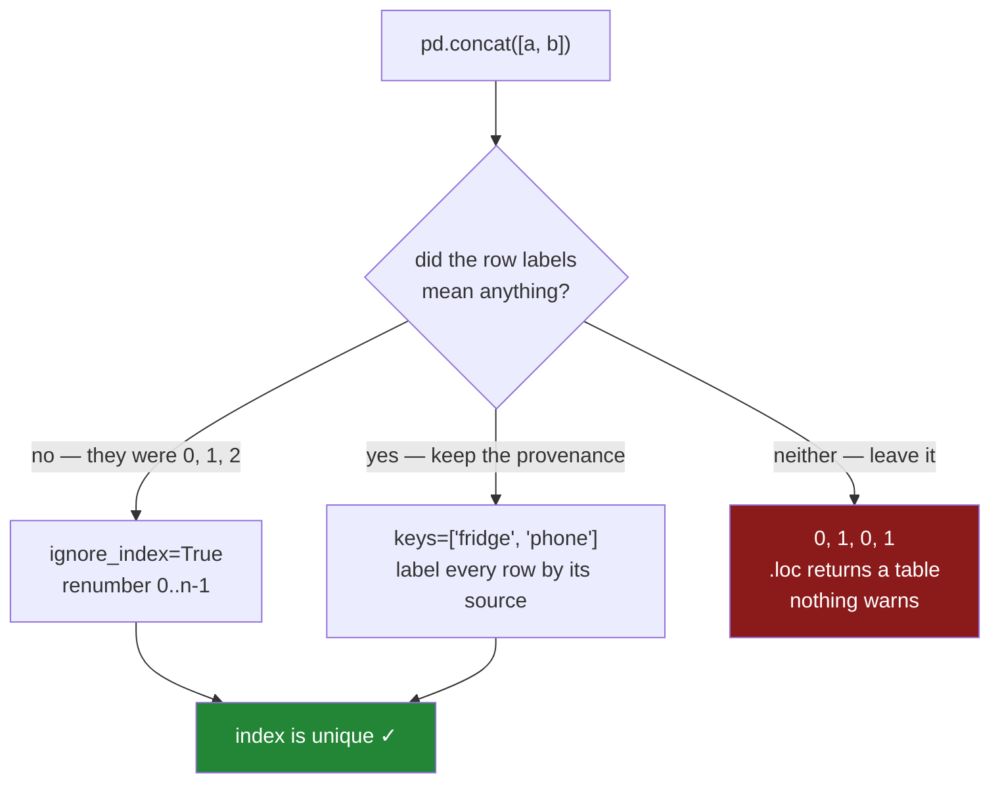

# 1.2 — The index that came along

## One-line answer

Stacking two frames stacks their **row labels** too, so a result built from pieces that each
numbered their own rows from zero has repeated labels — and every later lookup by label then returns
several rows where the code expected one, silently.

---

## The story

The two shopping lists get copied onto one sheet, and both writers had numbered their own lines.

The fridge pad said *1. milk, 2. bread*. The phone note said *1. eggs, 2. rice*. Copied one under
the other, the new sheet reads 1, 2, 1, 2 down the side.

At the shop, one of them phones the other. "Get line one as well, we forgot it." Both of them think
they know what line one is. One of them buys milk. The other buys eggs.

Nobody made a mistake. The numbers were fine on each list, and the copying was faithful. The trouble
is that after the copying the numbers no longer name a line, and nothing on the sheet says so.

---

## The idea in plain language

A frame carries a label for every row, and that set of labels is called the **index**
([Day 26, 1.2](../../../day-26-frames-and-copy-on-write/parts/01-the-two-objects/1.2-the-index-is-not-a-row-number.md)).
When you build a frame without saying what the labels should be, pandas supplies `0, 1, 2, …`. That
default looks like a row number, which is exactly why it causes this problem: it is not a row number,
it is a **name**, and it travels with the row.

Stacking two frames stacks the names as well as the values. Two frames that each named their rows
`0` and `1` produce one frame whose names are `0, 1, 0, 1`. There are now two rows called `0`.

A set of labels with no repeats is called **unique**. Pandas does not require an index to be unique
and does not warn you when it stops being. What it does instead is change its own behaviour, quietly:

- Asking for one label on a unique index gives you **one row**.
- Asking for the same label on a repeated index gives you **every row with that label**, as a table.

So a line of code that used to hand back a single row now hands back two, and the next line — which
multiplies it by something, or writes it somewhere, or compares it to a number — does something
plausible with two values instead of failing on one. This is the second-worst kind of bug, after the
kind that gives a different answer on Tuesday
([Day 29, 4.2](../../../day-29-iteration-and-order/parts/04-sorting/4.2-the-tie-that-broke-the-report.md)):
it produces output, and the output is wrong.

There are exactly two honest answers, and they differ in what they think the labels were *for*:

**The labels meant nothing.** They were `0, 1, 2` because nobody chose anything. Throw them away and
number the result from zero: `ignore_index=True`.

**The labels meant something.** Row `0` of the fridge list really was the fridge list's first line,
and that is worth keeping. Then do not throw the labels away — make them unambiguous by recording
which list each row came from, which is what `keys=` does and what *In production* below builds.

What is not an answer is leaving it. A repeated index is a loaded gun pointed at every `.loc` in the
rest of the program.

---

## Why Setu needs it

- **[1.1](1.1-two-lists-one-under-the-other.md)** produced the `0, 1, 0, 1` index in its very first
  printout. This part is why that mattered.
- **[1.4](1.4-stacking-sideways.md)** stacks frames across instead of down, and there the index is
  not a nuisance — it is the thing the whole operation is decided by.
- **[5.2](../05-long-to-wide/5.2-the-duplicate-that-makes-pivot-raise.md)** is the same complaint
  from `pivot`, which unlike `.loc` refuses to continue.
- **[Day 28, 5.3](../../../day-28-selection-and-alignment/parts/05-reindexing/5.3-duplicate-labels.md)**
  is where duplicate labels were first met, and it is the part to re-read if `.loc` returning a
  table is new to you.
- **Day 174** logs one row per agent run and stacks the day's log files into one frame for the eval
  report. Every file numbers its own rows from zero, so this is that pipeline's first bug.

---

## The mechanism

The same two lists, and what the labels do to a lookup:

```python
import pandas as pd

fridge = pd.DataFrame({"item": pd.Series(["milk", "bread"], dtype="str"), "need": [2, 1]})
phone = pd.DataFrame({"item": pd.Series(["eggs", "rice"], dtype="str"), "need": [6, 1]})
both = pd.concat([fridge, phone])

print("index    :", both.index.tolist())
print("unique?  :", both.index.is_unique)
print()
print("fridge.loc[0] is a", type(fridge.loc[0]).__name__)
print("both.loc[0]   is a", type(both.loc[0]).__name__)
print()
print(both.loc[0])
```

**Line by line:**

- `both.index.tolist()` — the labels as a plain Python list, which is the shortest way to *see* them
  rather than infer them from a printed frame.
- `both.index.is_unique` — the one-line question this whole part is about. It costs a pass over the
  labels and it is the check that belongs after any stack whose index you kept.
- `type(fridge.loc[0]).__name__` against `type(both.loc[0]).__name__` — **the same expression
  returns a different kind of object** depending on the data. That is the danger stated precisely:
  the code did not change, the shape of its result did
  ([Day 28, 1.2](../../../day-28-selection-and-alignment/parts/01-label-and-position/1.2-loc-by-label.md)).

```text
index    : [0, 1, 0, 1]
unique?  : False

fridge.loc[0] is a Series
both.loc[0]   is a DataFrame
```

```text
   item  need
0  milk     2
0  eggs     6
```

Two rows, both called `0`. Now watch what the next line of a real program does with that:

```python
import pandas as pd

fridge = pd.DataFrame({"item": pd.Series(["milk", "bread"], dtype="str"), "need": [2, 1]})
phone = pd.DataFrame({"item": pd.Series(["eggs", "rice"], dtype="str"), "need": [6, 1]})
both = pd.concat([fridge, phone])

print(both.loc[0, "need"] * 2)
```

**Line by line:**

- `both.loc[0, "need"]` — label `0`, column `need`. On a unique index this is **one number**, and
  `* 2` is arithmetic on it.
- On this index it is a Series of two numbers, and `* 2` is arithmetic on both of them
  ([Day 29, 2.1](../../../day-29-iteration-and-order/parts/02-vectorised/2.1-one-operation-every-row.md)).
- **Nothing raises.** The expression is valid for both shapes, which is exactly why this is a bug
  rather than an error.

```text
0     4
0    12
Name: need, dtype: int64
```

The program wanted `4`. It got a two-element Series, and whatever it does next — writes it into a
cell, compares it to a threshold, sends it to a report — is now dealing with a thing it was not
written for.

The fix, when the labels never meant anything:

```python
import pandas as pd

fridge = pd.DataFrame({"item": pd.Series(["milk", "bread"], dtype="str"), "need": [2, 1]})
phone = pd.DataFrame({"item": pd.Series(["eggs", "rice"], dtype="str"), "need": [6, 1]})

clean = pd.concat([fridge, phone], ignore_index=True)
print(clean)
print("unique?", clean.index.is_unique)
print()
print(clean.loc[0])
```

**Line by line:**

- `ignore_index=True` — pandas discards **both** pieces' labels and numbers the output `0` to `n-1`.
  It does not renumber one side to avoid the other; it renumbers everything.
- The rows keep their order. `ignore_index` is about names, never about arrangement.
- `clean.loc[0]` is a Series again, and every `.loc` downstream is back to meaning one row.

```text
    item  need
0   milk     2
1  bread     1
2   eggs     6
3   rice     1
unique? True

item    milk
need       2
Name: 0, dtype: object
```

Where the two paths lead:



**The red box is the default.** Neither of the green paths happens unless you type it.

---

## When it breaks

**The assertion you can put in the way**, and what it says when it fires:

```text
$ uv run python -c "
import pandas as pd
fridge = pd.DataFrame({'item': pd.Series(['milk', 'bread'], dtype='str'), 'need': [2, 1]})
phone = pd.DataFrame({'item': pd.Series(['eggs', 'rice'], dtype='str'), 'need': [6, 1]})
pd.concat([fridge, phone], verify_integrity=True)
"
```

```text
ValueError: Indexes have overlapping values: Index([0, 1], dtype='int64')
```

**What it means.** `verify_integrity=True` asks pandas to refuse the stack if the result's labels
would repeat, and it names the labels that collided. It is off by default, because concatenating
frames with repeated labels is a legitimate thing to want.

**The smallest fix** is to decide which of the two answers you meant — `ignore_index=True` if the
labels were noise, `keys=` if they were not — and say so.

`verify_integrity=True` is worth turning on in one specific situation: when the labels are supposed
to be meaningful and unique already, such as an order number or an item name. Then a collision means
two pieces claim the same thing, and that is a data problem you want to hear about at the stack
rather than three functions later.

**The one that does not raise, and the reason this part exists:**

```text
$ uv run python -c "
import pandas as pd
fridge = pd.DataFrame({'item': pd.Series(['milk', 'bread'], dtype='str'), 'need': [2, 1]})
phone = pd.DataFrame({'item': pd.Series(['eggs', 'rice'], dtype='str'), 'need': [6, 1]})
both = pd.concat([fridge, phone])
print('total need:', both['need'].sum())
print('line one  :', both.loc[0, 'need'].tolist())
"
```

```text
total need: 10
line one  : [2, 6]
```

**What it means.** The sum is completely correct: stacking did not damage the data, and every
column-wide operation on this frame gives the right answer. Only lookups **by label** are broken,
and only those.

That is what makes it survive review. Somebody checks the totals, the totals are right, and the
frame ships with a lookup in it that returns two rows on the days when it happens to be asked for a
repeated label.

---

## In production

**What a professional writes instead of the teaching version.** Not `ignore_index=True`. That
answer is right when the labels were noise, and in a pipeline they usually are not — the piece a row
came from is a fact worth keeping. `keys=` keeps it:

```python
import pandas as pd

fridge = pd.DataFrame({"item": pd.Series(["milk", "bread"], dtype="str"), "need": [2, 1]})
phone = pd.DataFrame({"item": pd.Series(["eggs", "rice"], dtype="str"), "need": [6, 1]})

tracked = pd.concat([fridge, phone], keys=["fridge", "phone"], names=["source", "row"])
print(tracked)
print()
print(tracked.loc["phone"])
print()
print(tracked.reset_index())
```

**Line by line:**

- `keys=["fridge", "phone"]` — one key per frame, **in the same order as the frames**. Pandas puts
  each key in front of that frame's own labels, so the label of the first phone row becomes the pair
  `("phone", 0)`.
- An index of pairs like this is a **MultiIndex**: an index with more than one level, where a row is
  named by a tuple rather than by a single value. It is the same object
  [5.3](../05-long-to-wide/5.3-stack-and-unstack.md) reshapes, and the same one a `groupby` on two
  columns produces on **Day 31**.
- `names=["source", "row"]` — the levels get names, so the printed frame says `source` down the side
  instead of nothing, and `reset_index()` produces a column called `source` instead of `level_0`.
  Leaving this out is the difference between a self-describing frame and one that needs a comment.
- `tracked.loc["phone"]` — selecting by the outer level gives back **that piece**, which is a thing
  you now cannot do with `ignore_index=True`, because the information was thrown away.
- `tracked.reset_index()` turns both levels into ordinary columns and puts a plain `0..n-1` index
  back. This is the form most code wants: unique labels **and** the provenance, as data rather than
  as a label.

```text
             item  need
source row
fridge 0     milk     2
       1    bread     1
phone  0     eggs     6
       1     rice     1

     item  need
row
0    eggs     6
1    rice     1

   source  row   item  need
0  fridge    0   milk     2
1  fridge    1  bread     1
2   phone    0   eggs     6
3   phone    1   rice     1
```

**What changes at scale.** Three things.

`keys=` also accepts a dictionary instead of a list plus keys: `pd.concat({"fridge": fridge,
"phone": phone})` does the same thing, with the mapping written once. On a pipeline that reads a
directory, the dictionary comprehension `{path.stem: pd.read_csv(path) for path in paths}` is the
whole loader, and every row in the result knows which file it came from.

A MultiIndex is not free. It stores each level's distinct values once plus an integer code per row,
so a source level with ten values over ten million rows costs about the same as one small integer
column — cheap. What is not cheap is **sorting**: `.loc` on a MultiIndex level is much faster on a
sorted index, and pandas will tell you so with a `PerformanceWarning` when you slice an unsorted one.
`sort_index()` after the stack is the usual answer
([Day 29, 4.4](../../../day-29-iteration-and-order/parts/04-sorting/4.4-sort-index-and-the-cost-of-order.md)).

And the index survives being written out only if the format keeps it. `to_csv` writes the levels as
leading columns and `read_csv` reads them back as ordinary columns unless you pass `index_col=`;
Parquet round-trips them properly
([Day 27, 3.2](../../../day-27-reading-and-writing/parts/03-parquet/3.2-the-round-trip-that-keeps-dtypes.md)).
Doing the `reset_index()` before writing, so the provenance is a column, is the version that
survives every format.

**The failure that only appears with real data.** A reporting job stacked one frame per region and
looked up a summary row by its label. It was correct for a year, because the label it looked up
happened to exist in only one region's frame. A new region was onboarded whose file used the same
internal codes, and the lookup started returning two rows. The report did not crash: it wrote the
two-row result into a cell, and the cell rendered as a string containing both numbers. The bug was
found by a person reading the report, not by the pipeline, and the change that caused it was adding
a directory.

**The review comment a senior engineer leaves.** *"This `pd.concat` keeps both pieces' default
indexes, so the result has duplicate labels and the `.loc` on line 40 can return two rows. Either
pass `ignore_index=True` or pass `keys=` and `reset_index()` — and assert `index.is_unique`
afterwards so the next person cannot undo it."*

**The interview question.** *"What happens to the index when you concatenate?"* It is kept, from
both pieces, so a frame built from pieces that each used the default `0..n-1` ends up with repeated
labels. The follow-up is the one that matters: *"why is that dangerous rather than untidy?"* Because
`.loc` changes its return shape based on the data rather than on the code — one row for a unique
label, a table for a repeated one — so nothing raises, column-wide operations stay correct, and only
label lookups quietly become something else. The two fixes are `ignore_index=True` when the labels
were meaningless and `keys=` when the piece a row came from is worth keeping, and the check that
either worked is `df.index.is_unique`.

---

## Check yourself

```bash
uv run python -c "
import pandas as pd
fridge = pd.DataFrame({'item': pd.Series(['milk', 'bread'], dtype='str'), 'need': [2, 1]})
phone = pd.DataFrame({'item': pd.Series(['eggs', 'rice'], dtype='str'), 'need': [6, 1]})
kept = pd.concat([fridge, phone])
renumbered = pd.concat([fridge, phone], ignore_index=True)
labelled = pd.concat([fridge, phone], keys=['fridge', 'phone'], names=['source', 'row'])
for name, frame in [('kept', kept), ('renumbered', renumbered), ('labelled', labelled)]:
    picked = frame.loc['fridge'] if name == 'labelled' else frame.loc[0]
    print(f'{name:11} unique={frame.index.is_unique}  loc-result={type(picked).__name__}')
print()
print('same values everywhere?', kept['need'].sum() == renumbered['need'].sum() == labelled['need'].sum())
"
```

Three stacks of the same two frames. Exactly one of them has labels that repeat. Say which, say why
`labelled` gives back a table without that being a problem, and say why the last line prints `True`
for all three anyway.

**Answer out loud, without scrolling up:**

> After `pd.concat([a, b])`, `df.loc[0]` comes back as a table with two rows instead of one row. Say
> what happened, say why nothing raised, and name the two different fixes and when each one is the
> right one.

---

**Next:** [1.3 — The columns that did not match](1.3-the-columns-that-did-not-match.md).
