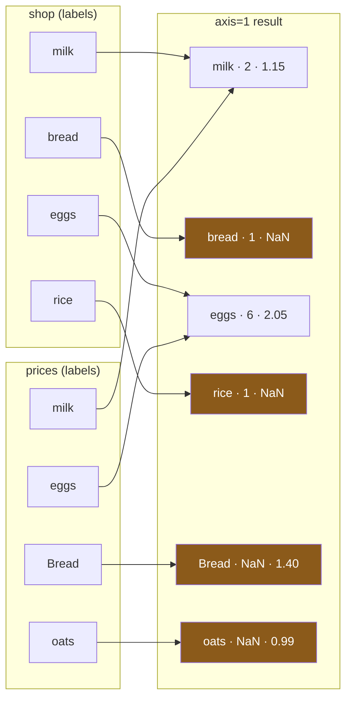

# 1.4 — Stacking sideways

## One-line answer

`pd.concat(..., axis=1)` puts frames next to each other rather than under each other, and it decides
which row goes beside which **entirely by the row labels** — so on frames whose labels do not line
up it does not fail, it produces a wider *and taller* frame full of blanks.

---

## The story

The shop puts a printed price list on the counter, one item per line.

Somebody has the flat's shopping list on a phone, also one item per line. The obvious thing to do is
hold the two sheets side by side and read across: milk, two, one fifteen. Next line. Bread, one,
one forty.

It works for the first line and then it does not, because the two sheets are not the same list. The
shop's sheet has oats on it, which nobody wants. The flat's sheet has rice on it, which the shop's
sheet does not mention. From the second line down, reading across pairs a thing with a price that
belongs to something else.

The really unpleasant version happened a week earlier, and it did not look wrong at all. Somebody
crossed off the two things they had already bought before holding the sheets together. Two lines
against two lines, both sheets the same length, everything neat — and the prices had shifted up by
one.

---

## The idea in plain language

There are two directions to put frames together, and pandas spells them with the same function.

**Down** is more rows. That is [1.1](1.1-two-lists-one-under-the-other.md), it is `axis=0`, it is the
default, and it matches nothing.

**Across** is more columns: the same rows, with more facts attached to each. That is `axis=1`, and
it matches everything — because to put two frames beside each other, pandas has to decide **which
row of the second goes beside which row of the first**, and the only thing it has to decide with is
the row labels.

That decision is called **alignment**: when two labelled pandas objects meet, pandas lines them up by
label before doing anything else
([Day 28, 4.2](../../../day-28-selection-and-alignment/parts/04-alignment/4.2-alignment-is-automatic.md)).
It is the same rule that makes `a + b` add matching labels rather than matching positions. Here it
means: a row labelled `milk` on the left ends up beside the row labelled `milk` on the right, wherever
either of them sat.

Two consequences follow, and the second one surprises people.

**A label on only one side still produces a row.** The result's labels are the **union** of the two
sides', so a frame with four labels beside another with four labels can produce six rows if only two
labels are shared. Stacking sideways can make a frame *taller*. That is the sentence worth
remembering, because "concatenating columns" sounds like an operation that cannot change the row
count, and it changes it routinely.

**When neither side has meaningful labels, alignment still happens — on the accidental ones.** Two
frames that both use the default `0, 1, 2, …` will line up by position, because position is what
those numbers happen to encode. Then somebody filters one side, its labels become `1, 3`, and the
pairing changes without a word. That is the second half of the story above, and it is the reason
`concat(axis=1)` deserves suspicion rather than convenience.

Sideways concatenation is, in fact, exactly one thing: a merge on the index, keeping everything from
both sides. If what you want is to attach a price to an item **by name**, the honest tool is `merge`
([2.1](../02-merging/2.1-the-key-and-the-rows-it-pairs.md)), which makes you name the key out loud
and gives you a word for what to do with the rows that do not match.

---

## Why Setu needs it

- **[1.1](1.1-two-lists-one-under-the-other.md)** is the other axis, and the contrast is the point:
  one matches nothing and one matches everything.
- **[2.3](../02-merging/2.3-when-the-key-has-two-names.md)** merges on the index deliberately, and
  shows that this operation is that one with the choices hidden.
- **[3.1](../03-the-row-count/3.1-count-the-rows-before-and-after.md)** counts rows before and after
  every join, and this is the operation people leave out of that habit because it "only adds
  columns".
- **[Day 28, 4.4](../../../day-28-selection-and-alignment/parts/04-alignment/4.4-the-index-is-the-join-key.md)**
  said the index is the join key. This is what happens when you use it as one without meaning to.
- **Day 51** assembles a feature table by attaching engineered columns to a base frame. Every one of
  those attachments is this operation, and a filtered intermediate frame is how a feature ends up on
  the wrong row.

---

## The mechanism

Two frames labelled by item, sharing two labels out of four:

```python
import pandas as pd

shop = pd.DataFrame(
    {"need": [2, 1, 6, 1]},
    index=pd.Index(["milk", "bread", "eggs", "rice"], dtype="str", name="item"),
)
prices = pd.DataFrame(
    {"price": [1.15, 1.40, 2.05, 0.99]},
    index=pd.Index(["milk", "Bread", "eggs", "oats"], dtype="str", name="item"),
)

side = pd.concat([shop, prices], axis=1)
print(side)
print()
print("rows in  :", len(shop), "and", len(prices))
print("rows out :", len(side))
```

**Line by line:**

- `index=pd.Index([...], name="item")` — the item names are the **labels**, not a column. That is
  what makes them available for alignment; a column called `item` would not be
  ([Day 26, 1.2](../../../day-26-frames-and-copy-on-write/parts/01-the-two-objects/1.2-the-index-is-not-a-row-number.md)).
- The price list spells bread with a capital `B`, because that is what the shop published. It is
  the day's running mismatch and it is deliberate — [3.4](../03-the-row-count/3.4-the-join-that-dropped-forty-per-cent.md)
  is where it does real damage.
- `axis=1` — **across**, not down. Changing this one number changes the meaning of the call
  completely; there is no gentle version of this argument.
- `len(side)` printed against both inputs' lengths, because the interesting number is that it is
  bigger than either.

```text
       need  price
item
milk    2.0   1.15
bread   1.0    NaN
eggs    6.0   2.05
rice    1.0    NaN
Bread   NaN   1.40
oats    NaN   0.99

rows in  : 4 and 4
rows out : 6
```

**Four beside four gave six.** `milk` and `eggs` were on both sheets and produced one row each.
`bread`, `rice`, `Bread` and `oats` were on one sheet only and each produced a row that is half
blank. And `need`, which was a whole-number column, is `2.0` and `1.0` now, for the reason
[1.3](1.3-the-columns-that-did-not-match.md) gave.

The same thing drawn:



**Only two boxes have two arrows into them.** Every orange box is a label that existed on one side
only, and there are four of them out of six rows.

The switch that keeps only the shared labels:

```python
import pandas as pd

shop = pd.DataFrame(
    {"need": [2, 1, 6, 1]},
    index=pd.Index(["milk", "bread", "eggs", "rice"], dtype="str", name="item"),
)
prices = pd.DataFrame(
    {"price": [1.15, 1.40, 2.05, 0.99]},
    index=pd.Index(["milk", "Bread", "eggs", "oats"], dtype="str", name="item"),
)

print(pd.concat([shop, prices], axis=1, join="inner"))
```

**Line by line:**

- `join="inner"` keeps only labels present in **every** piece. It is the same word as in
  [1.3](1.3-the-columns-that-did-not-match.md), applied to the other axis: there it kept shared
  columns, here it keeps shared rows.
- The `need` column comes back as `int64`, because with no blanks introduced there is nothing to
  promote it for.
- Two rows out of four. **`join="inner"` is how a sideways concat silently deletes rows**, and it
  gives no count of what it dropped. That is the whole subject of section 3.

```text
      need  price
item
milk     2   1.15
eggs     6   2.05
```

And the thing worth proving to yourself once, because it retires the operation:

```python
import pandas as pd

shop = pd.DataFrame(
    {"need": [2, 1, 6, 1]},
    index=pd.Index(["milk", "bread", "eggs", "rice"], dtype="str", name="item"),
)
prices = pd.DataFrame(
    {"price": [1.15, 1.40, 2.05, 0.99]},
    index=pd.Index(["milk", "Bread", "eggs", "oats"], dtype="str", name="item"),
)

by_concat = pd.concat([shop, prices], axis=1)
by_merge = shop.merge(prices, left_index=True, right_index=True, how="outer")
print("same rows?", by_concat.sort_index().equals(by_merge.sort_index()))
print("concat order:", by_concat.index.tolist())
print("merge order :", by_merge.index.tolist())
```

**Line by line:**

- `left_index=True, right_index=True` tells `merge` to use the row labels as the key instead of a
  column ([2.3](../02-merging/2.3-when-the-key-has-two-names.md)).
- `how="outer"` means keep every label from both sides, which is what a sideways concat does with no
  argument at all.
- `.sort_index()` on both before comparing, because the two produce the **same rows in a different
  order**: `merge` sorts the key when `how="outer"`, and `concat` keeps the left frame's order and
  appends the labels it had not seen.
- The comparison prints `True`. `pd.concat(axis=1)` is `merge(..., how="outer")` on the index, with
  the key and the `how` left unwritten — which is precisely the argument for using `merge` when the
  pairing matters.

```text
same rows? True
concat order: ['milk', 'bread', 'eggs', 'rice', 'Bread', 'oats']
merge order : ['Bread', 'bread', 'eggs', 'milk', 'oats', 'rice']
```

---

## When it breaks

**The two frames that were both the right length:**

```text
$ uv run python -c "
import pandas as pd
shop = pd.DataFrame({'item': pd.Series(['milk', 'bread', 'eggs', 'rice'], dtype='str'), 'need': [2, 1, 6, 1]})
cheap = shop[shop['need'] <= 1]
notes = pd.DataFrame({'note': pd.Series(['on offer', 'buy two'], dtype='str')})
print(cheap)
print()
print(notes)
print()
print(pd.concat([cheap, notes], axis=1))
"
```

```text
    item  need
1  bread     1
3   rice     1

       note
0  on offer
1   buy two

    item  need      note
1  bread   1.0   buy two
3   rice   1.0       NaN
0    NaN   NaN  on offer
```

**What it means.** Two frames of two rows each produced a frame of **three** rows. `bread` was given
the note "buy two", which was written about milk. `rice` was given nothing. And "on offer" ended up
on a row with no item at all.

**Nothing raised.** Both inputs were the length the programmer expected, and the answer is entirely
plausible until somebody checks a note against an item.

**What actually happened.** `cheap` came out of a filter, so it kept the labels `1` and `3` from the
frame it was filtered from ([Day 28, 2.2](../../../day-28-selection-and-alignment/parts/02-masks/2.2-selecting-with-a-mask.md)).
`notes` was built fresh, so its labels are `0` and `1`. Aligning those two sets of labels pairs `1`
with `1`, leaves `3` alone and leaves `0` alone.

**The smallest fix** is not `reset_index(drop=True)` on both sides, even though that makes this
example produce what was wanted. That fix says "pair these by position and trust me", and it is
correct only while the two frames are guaranteed to be in the same order — which is the assumption
that broke in the first place. The honest fix is to give `notes` the labels it is about, and then let
alignment do its job:

```python
import pandas as pd

shop = pd.DataFrame(
    {"item": pd.Series(["milk", "bread", "eggs", "rice"], dtype="str"), "need": [2, 1, 6, 1]}
).set_index("item")
notes = pd.DataFrame(
    {"note": pd.Series(["on offer", "buy two"], dtype="str")},
    index=pd.Index(["milk", "eggs"], dtype="str", name="item"),
)

print(pd.concat([shop, notes], axis=1))
```

**Line by line:**

- `set_index("item")` makes the item name the label, so the frame's rows are identified by *what they
  are* rather than by where they happened to sit.
- `notes` is built with the same kind of label, so a note about milk is attached to milk by
  construction and cannot drift.
- Now a filter on either side is harmless: filtering removes labels, and alignment simply produces
  blanks for the ones that are gone. **The pairing stopped depending on the order.**

```text
       need      note
item
milk      2  on offer
bread     1       NaN
eggs      6   buy two
rice      1       NaN
```

---

## In production

**What a professional writes instead of the teaching version.** They mostly do not write
`concat(axis=1)` at all. When two frames describe the same things and you want them side by side,
`merge` says out loud what `concat` leaves implicit:

```python
import pandas as pd


def attach(base: pd.DataFrame, extra: pd.DataFrame, name: str) -> pd.DataFrame:
    """Put `extra`'s columns beside `base`'s, keeping exactly `base`'s rows."""
    clashes = set(base.columns) & set(extra.columns)
    if clashes:
        raise ValueError(f"{name} would overwrite {sorted(clashes)}")
    out = base.merge(extra, left_index=True, right_index=True, how="left", validate="1:1")
    if len(out) != len(base):
        raise ValueError(f"{name} changed the row count: {len(base)} -> {len(out)}")
    return out
```

**Line by line:**

- `how="left"` rather than the outer behaviour a sideways concat gives you. The base frame's rows are
  the answer, and a label that only `extra` has is a mistake in `extra`, not a new row.
- `validate="1:1"` refuses an `extra` that has two rows for one label — which a sideways concat would
  accept and turn into extra rows ([3.3](../03-the-row-count/3.3-validate-and-the-merge-error.md)).
- The **row-count check after the merge** is not redundant with `validate=`. `validate=` checks
  uniqueness, and this checks that nothing was added or lost; they catch different faults
  ([3.1](../03-the-row-count/3.1-count-the-rows-before-and-after.md)).
- The **clash check before it** exists because a merge renames a column it finds on both sides rather
  than complaining, and a renamed column is how a caller ends up reading `price_x`
  ([2.4](../02-merging/2.4-the-suffixes-and-the-column-on-both-sides.md)).
- `name` is threaded through only so the two exceptions can say **which** attachment failed. In a
  pipeline that attaches six frames, that word is the difference between a five-minute fix and an
  afternoon.

**What changes at scale.** Sideways concatenation of many frames is one place where the naive loop
is quadratic in the same way [1.1](1.1-two-lists-one-under-the-other.md) showed for rows, and worse:
each round both copies the accumulated frame **and** recomputes the union of the labels. Building a
list and calling `pd.concat(pieces, axis=1)` once does the alignment in a single pass.

The subtler cost is that alignment on an unsorted index is a hash join, so it allocates a table of
the labels. On a frame with tens of millions of unique string labels that table is not small, and it
is built again for every attachment. Setting the index once, sorting it once, and attaching several
frames in a single `pd.concat(..., axis=1)` call is measurably cheaper than six separate joins — and
the frames that are being attached usually come from the same place anyway.

**The failure that only appears with real data.** A scoring pipeline attached a model's predictions
back onto the input frame with `pd.concat([features, preds], axis=1)`. It was correct for a year
because the predictions were produced from `features` in order and both had the same default index.
Then a caching layer was added that dropped rows already scored that day, so `features` arrived with
gaps in its index and `preds` came back numbered from zero. Every prediction was attached to the
wrong customer. Nothing raised, the row count was unchanged, and the numbers were all plausible
values in the right range. It was caught by a customer who noticed a score that did not match their
own history.

**The review comment a senior engineer leaves.** *"`pd.concat([left, right], axis=1)` here is an
outer join on the index with the key and the join type unwritten. If these are supposed to be the
same rows, use `merge(..., left_index=True, right_index=True, how='left', validate='1:1')` and assert
the row count is unchanged. As written, one filtered input silently shifts every value by a row."*

**The interview question.** *"Is `pd.concat(axis=1)` the same as a join?"* Yes — it is an outer join
on the index, with no way to name the key and no way to say what should happen to unmatched rows.
The follow-up that separates people who have used it: *"can it change the number of rows?"* It can,
in both directions relative to the inputs — a label on only one side still produces a row, so four
beside four can be six — and because it is an *outer* join it never drops one, which means a
misaligned pair shows up as a taller frame full of blanks rather than as an error. The reason to
prefer `merge` is not that it is faster; it is that it makes you write down the key and the `how`,
and those are the two things the bug is always in.

---

## Check yourself

```bash
uv run python -c "
import pandas as pd
shop = pd.DataFrame({'item': pd.Series(['milk', 'bread', 'eggs', 'rice'], dtype='str'), 'need': [2, 1, 6, 1]})
notes = pd.DataFrame({'note': pd.Series(['on offer', 'buy two'], dtype='str')})
print('positional labels :', len(pd.concat([shop, notes], axis=1)))
print('after a filter    :', len(pd.concat([shop[shop['need'] <= 1], notes], axis=1)))
print()
by_name = shop.set_index('item')
notes_by_name = notes.set_index(pd.Index(['milk', 'eggs'], dtype='str', name='item'))
print('labelled by item  :', len(pd.concat([by_name, notes_by_name], axis=1)))
print(pd.concat([by_name, notes_by_name], axis=1))
"
```

Three sideways concatenations of nearly the same data, giving three different row counts. Say which
one is right and, more usefully, say which one you would still trust after somebody adds a filter
upstream.

**Answer out loud, without scrolling up:**

> You put two frames side by side with `pd.concat(axis=1)` and the result has more rows than either
> of them. Say what pandas did, say what decides which row ends up beside which, and say what you
> would write instead so that the pairing is stated rather than inherited.

---

**Next:** [2.1 — The key, and the rows it pairs](../02-merging/2.1-the-key-and-the-rows-it-pairs.md).
