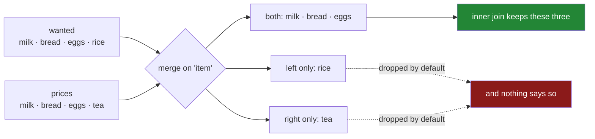

# 2.1 — The key, and the rows it pairs

## One-line answer

`merge` puts two tables side by side by **matching values in a column they share**, so a row of one
table is paired with the row of the other that carries the same key — which is a completely different
operation from stacking, where nothing is matched at all.

---

## The story

There are two pieces of paper on the kitchen table.

The first is the shopping list somebody wrote this morning: milk, bread, eggs, rice, with how many of
each. It says what to buy and nothing about money.

The second is a list somebody keeps of what things cost and which aisle they are in. It has milk,
bread, eggs and tea on it, because tea was bought last month and rice has never been priced.

Somebody wants one piece of paper with everything on it: what to buy, how many, what it costs, where
to find it.

What they do is obvious. Take the first line of the list — milk — and go looking for *milk* on the
price sheet. Found it: £1.15, dairy. Write those next to the milk line. Then bread. Then eggs.

Then rice, and there is no rice on the price sheet, and now there is a decision to make that nobody
was expecting. Do you keep the rice line with two blanks on it, because you still have to buy rice?
Or do you leave it off, because the point of the exercise was to work out the cost and you cannot cost
the rice?

And separately: there is tea on the price sheet and no tea on the list. Nobody is buying tea. Does it
appear on the combined sheet or not?

Two lists, four rows each, three items in common. There are four defensible answers to "what should
the combined sheet look like", and they have between three and five rows.

---

## The idea in plain language

**A merge — also called a join — combines two tables by matching rows on a shared column.** That
column is the **key**. Here the key is `item`: the milk row of the list pairs with the milk row of the
price sheet, because both say `milk`.

It is worth being precise about how this differs from Day 32's first section. `concat` puts one table
after another and matches **nothing** — it lines rows up by position or stacks them by row, and where
column names happen to agree they end up in one column
([1.1](../01-stacking/1.1-two-lists-one-under-the-other.md)). `merge` matches by **value**: it looks
inside the key column and pairs rows that agree.

The result has the columns of both tables. Where a pair was found, the row carries values from both.
Where no pair was found, what happens depends on an argument called `how`, and that is
[2.2](2.2-the-four-hows-on-four-rows.md)'s subject. The default is `how="inner"`: **only the rows
that matched survive.**

Three things to hold onto before the mechanism.

**The key column has to exist in both, with the same name**, or you have to say which name goes with
which ([2.3](2.3-when-the-key-has-two-names.md)). By default `merge` uses every column the two tables
have in common as the key, which is convenient exactly once and a trap thereafter —
**always pass `on=`**, so that a column added upstream cannot silently become part of the key.

**The result's row count is not the input's row count.** It can be smaller, because unmatched rows
were dropped. It can be larger, if a key appears more than once on one side — which is
[3.2](../03-the-row-count/3.2-the-duplicate-that-multiplied-rows.md) and is the single most expensive
mistake on the day. Counting rows before and after is not optional
([3.1](../03-the-row-count/3.1-count-the-rows-before-and-after.md)).

**The index is discarded.** `merge` matches on columns, not on labels, and the result gets a fresh
`0, 1, 2` index. That is different from `join`, which matches on the index by default and is the same
operation with a different default. Day 28's alignment
([Day 28, 4.4](../../../day-28-selection-and-alignment/parts/04-alignment/4.4-the-index-is-the-join-key.md))
was that behaviour arriving without being asked for; `merge` is asking for it, on a column you name.

---

## Why Setu needs it

- **[2.2](2.2-the-four-hows-on-four-rows.md)** is the four answers to the rice-and-tea question, which
  this part deliberately leaves open.
- **[3.1](../03-the-row-count/3.1-count-the-rows-before-and-after.md)** is the check that makes a
  merge safe, and it exists because of the two failure directions named above.
- **[1.1](../01-stacking/1.1-two-lists-one-under-the-other.md)** stacked two tables without matching
  anything. Knowing which of the two operations a situation needs is most of the skill.
- **Day 31's `summarise`** returns the keys as columns rather than as an index
  ([Day 31, 4.1](../../../day-31-groupby/parts/04-the-keys/4.1-the-key-became-the-index.md)),
  precisely so that its output can be merged back onto the detail table here.
- **Day 42** is the same operation in SQL, where it is spelled `JOIN` and the row-count surprises are
  identical. **Day 45** is the Phase 4 gate, whose deliverable is a *joined* dataset.

---

## The mechanism

Two tables with three items in common, one item only on the left, one only on the right:

```python
import pandas as pd

wanted = pd.DataFrame(
    {
        "item": pd.Series(["milk", "bread", "eggs", "rice"], dtype="str"),
        "need": [2, 1, 6, 1],
    }
)

prices = pd.DataFrame(
    {
        "item": pd.Series(["milk", "bread", "eggs", "tea"], dtype="str"),
        "price": [1.15, 1.40, 0.32, 3.10],
        "aisle": pd.Series(["dairy", "bakery", "dairy", "dry"], dtype="str"),
    }
)

print(wanted)
print()
print(prices)
```

**Line by line:**

- Both frames have an `item` column and it is the only column they share. **That shared column is the
  key**, and the fact that they share exactly one is what makes the default behaviour work here and is
  not something to rely on.
- `rice` is on the left and not the right; `tea` is on the right and not the left. **Those two rows
  are the whole example** — a merge on two tables with identical key sets teaches nothing, because
  every `how` gives the same answer.
- `dtype="str"` on the key columns, stated rather than inferred
  ([Day 26, 2.2](../../../day-26-frames-and-copy-on-write/parts/02-the-str-dtype/2.2-str-the-dtype-pandas-3-infers.md)).
  A key whose dtype differs between the two frames is a real source of silent non-matches, and Day 33
  meets it properly with dates.

```text
    item  need
0   milk     2
1  bread     1
2   eggs     6
3   rice     1

    item  price   aisle
0   milk   1.15   dairy
1  bread   1.40  bakery
2   eggs   0.32   dairy
3    tea   3.10     dry
```

The merge itself:

```python
print(wanted.merge(prices, on="item"))
```

**Line by line:**

- `wanted.merge(prices, ...)` — the frame the method is called on is the **left** side and the
  argument is the **right**. That distinction does nothing here and everything in
  [2.2](2.2-the-four-hows-on-four-rows.md), where `how="left"` and `how="right"` differ.
- `on="item"` names the key **explicitly**. Leaving it out would work — pandas would find `item` as
  the only shared column — and would silently start joining on two columns the day somebody adds an
  `updated_at` to both tables.
- No `how` argument, so the default `how="inner"` applies: **only keys present in both survive**.
- The result has three rows. `rice` is gone because the price sheet has never heard of it, and `tea`
  is gone because nobody is buying it. **Four rows in, four rows in, three rows out** — and nothing
  says so.
- The columns are the union: `item` once, then `need` from the left, then `price` and `aisle` from the
  right. The key appears once, not twice, which is the one piece of tidying `merge` does for you.
- The index is `0, 1, 2` — fresh. Neither input's index survived, because the matching was on values.

```text
    item  need  price   aisle
0   milk     2   1.15   dairy
1  bread     1   1.40  bakery
2   eggs     6   0.32   dairy
```

The two rows that vanished, made visible:

```python
combined = wanted.merge(prices, on="item", how="outer", indicator=True)
print(combined[["item", "_merge"]])
```

**Line by line:**

- `how="outer"` keeps everything from both sides — the opposite of the default — so that nothing is
  hidden. [2.2](2.2-the-four-hows-on-four-rows.md) covers what it does to the values.
- `indicator=True` adds a column called `_merge` saying, per row, where it came from: `both`,
  `left_only` or `right_only`.
- **This is the diagnostic to reach for whenever a merge's row count surprises you.** It answers "what
  did not match" directly, instead of by subtraction.
- `rice` is `left_only` and `tea` is `right_only`. Under the default inner join both of those rows are
  simply absent, with no trace anywhere.
- The rows come out sorted by key, because an outer join sorts; an inner join keeps the left frame's
  order. That difference catches people and is [2.2](2.2-the-four-hows-on-four-rows.md)'s business.

```text
    item      _merge
0  bread        both
1   eggs        both
2   milk        both
3   rice   left_only
4    tea  right_only
```



---

## When it breaks

**The key you did not name:**

```text
$ uv run python -c "
import pandas as pd
wanted = pd.DataFrame({'item': ['milk', 'bread'], 'need': [2, 1], 'updated': ['mon', 'mon']})
prices = pd.DataFrame({'item': ['milk', 'bread'], 'price': [1.15, 1.40], 'updated': ['tue', 'tue']})
print('with on=:'); print(wanted.merge(prices, on='item'))
print()
print('without :'); print(wanted.merge(prices))
"
```

```text
with on=:
    item  need updated_x  price updated_y
0   milk     2       mon   1.15       tue
1  bread     1       mon   1.40       tue

without :
Empty DataFrame
Columns: [item, need, updated, price]
Index: []
```

**What it means.** Both frames gained an `updated` column, so without `on=` pandas joined on
**`item` and `updated` together** — and since one says `mon` and the other says `tue`, nothing matched
and the result is empty. **No error and no warning.** This is the argument for always writing `on=`:
the join key should be a decision in your code, not a consequence of which columns two tables happen
to share this week.

**A key whose values do not quite match:**

```text
$ uv run python -c "
import pandas as pd
wanted = pd.DataFrame({'item': ['Milk', 'bread ', 'eggs'], 'need': [2, 1, 6]})
prices = pd.DataFrame({'item': ['milk', 'bread', 'eggs'], 'price': [1.15, 1.40, 0.32]})
out = wanted.merge(prices, on='item')
print(out)
print('rows matched:', len(out), 'of', len(wanted))
"
```

```text
   item  need  price
0  eggs     6   0.32
rows matched: 1 of 3
```

**What it means.** One row out of three, because `Milk` is not `milk` and `'bread '` is not `'bread'`.
**Matching is exact.** A capital letter, a trailing space, a different spelling of the same thing —
each one silently removes a row under an inner join, and the result is a perfectly well-formed table
that is missing two thirds of the shop. Day 33's `.str` accessor is where the cleaning goes, and it
belongs **before** the merge rather than after somebody notices the total is low.

**A key with different dtypes on the two sides:**

```text
$ uv run python -c "
import pandas as pd
left  = pd.DataFrame({'code': [1, 2, 3], 'need': [2, 1, 6]})
right = pd.DataFrame({'code': ['1', '2', '3'], 'price': [1.15, 1.40, 0.32]})
print('left dtype :', left['code'].dtype)
print('right dtype:', right['code'].dtype)
left.merge(right, on='code')
"
```

```text
left dtype : int64
right dtype: str
Traceback (most recent call last):
  File "<string>", line 7, in <module>
ValueError: You are trying to merge on int64 and str columns for key 'code'. If you wish to proceed you should use pd.concat
```

**What it means.** pandas refuses rather than matching nothing, which is a genuinely good error and
worth appreciating: on a key mismatch of this kind the silent version would return an empty frame and
you would spend an afternoon on it. The cause is almost always a CSV read where one side's codes had a
leading zero and the other's did not
([Day 27, 1.4](../../../day-27-reading-and-writing/parts/01-the-csv/1.4-dtype-at-read-time.md)). The
fix is at read time, with `dtype=`, not with an `astype` just before the merge — because the moment
you convert `1` to `"1"` you have decided that `"01"` is a different product.

---

## In production

**What a professional writes instead of the teaching version.** The key is named, the row count is
checked, and the unmatched rows are reported rather than discarded:

```python
import logging

import pandas as pd

log = logging.getLogger(__name__)


def enrich(
    detail: pd.DataFrame,
    lookup: pd.DataFrame,
    on: list[str],
    max_unmatched: float = 0.0,
) -> pd.DataFrame:
    """Attach `lookup`'s columns to `detail`, keeping every detail row. Reports what did not match."""
    for name, frame in (("detail", detail), ("lookup", lookup)):
        absent = sorted(set(on) - set(frame.columns))
        if absent:
            raise KeyError(f"{name} has no key columns {absent}; has {list(frame.columns)}")

    if lookup.duplicated(on).any():
        raise ValueError(f"lookup has duplicate keys on {on}; the merge would multiply rows")

    before = len(detail)
    out = detail.merge(lookup, on=on, how="left", indicator=True, validate="many_to_one")

    unmatched = out["_merge"] == "left_only"
    share = float(unmatched.mean())
    if share > max_unmatched:
        examples = out.loc[unmatched, on].drop_duplicates().head(10).to_dict("records")
        raise ValueError(
            f"{int(unmatched.sum())}/{before} detail rows ({share:.1%}) found no match "
            f"in lookup on {on}; examples: {examples}"
        )
    log.info("enriched %d rows on %s, %d unmatched", before, on, int(unmatched.sum()))
    return out.drop(columns="_merge")
```

**Line by line:**

- Both frames' key columns are checked **before** the merge, so a rename upstream produces a sentence
  naming the frame and what it does have, rather than a `KeyError` from inside pandas.
- `lookup.duplicated(on).any()` is checked explicitly, because a duplicate key on the lookup side is
  what multiplies rows ([3.2](../03-the-row-count/3.2-the-duplicate-that-multiplied-rows.md)). This
  costs one pass and prevents the day's most expensive bug.
- `how="left"` because the function's contract is *keep every detail row*. That is stated in the
  docstring, so a caller does not have to infer it from the argument.
- `validate="many_to_one"` makes pandas check the same property and raise if it does not hold — belt
  and braces, and the error message is good ([3.3](../03-the-row-count/3.3-validate-and-the-merge-error.md)).
- `indicator=True` and the `_merge` column, so unmatched rows are **counted** rather than inferred
  from a row-count difference — which under `how="left"` would be zero anyway.
- `max_unmatched: float = 0.0` is a **share**, defaulting to "none allowed". A lookup that is supposed
  to be complete should fail when it is not; a caller who knows some keys are legitimately absent
  raises the threshold on purpose.
- The error names ten example keys, because "3 000 rows did not match" sends somebody looking and
  "3 000 rows did not match, here are ten of the codes" sends them to the right place.
- `out.drop(columns="_merge")` at the end, so the diagnostic column does not leak into whatever
  consumes this. Leaving it in is a common way for a schema to gain a mysterious extra field.

**What changes at scale.** `merge` on a column is a hash join: pandas builds a hash table from one
side and probes it with the other, so the cost is roughly linear in the total number of rows plus the
output size. That is fine until the output size is the problem — a duplicated key on both sides
multiplies, and a many-to-many join on a key with a few thousand repeats each side produces millions
of rows from thousands ([3.2](../03-the-row-count/3.2-the-duplicate-that-multiplied-rows.md)). The
memory failures on this day are almost always that, not the input size. Two habits follow: check for
duplicate keys on the lookup side before merging, and set `validate=` so pandas checks the
relationship you believe in. Past pandas' comfortable size the operation is identical in SQL, Polars
and DuckDB — and those engines will also happily produce a billion rows from a bad key, so the
discipline transfers rather than the tool solving it.

**The failure mode that only appears with real data.** The lookup table is complete when the code is
written and stops being complete later. A new product is added upstream, no price is entered for it,
and the inner join silently drops every transaction involving it — so the day the new product launches
is the day the revenue report starts under-counting, and the shortfall grows as the product succeeds.
**An inner join is a filter**, and a filter whose criterion is "exists in the lookup" is a criterion
nobody is watching. That is why the production version above uses `how="left"` and reports, rather
than `how="inner"` and hopes.

**The review comment a senior engineer leaves.** *"`df.merge(lookup)` with no `on=` — that joins on
every shared column, and both tables now have `ingested_at`. Please name the key. Also this is an
inner join, so any transaction whose product is missing from the lookup silently disappears; use a
left join and alert on the unmatched count."*

**The interview question.** *"What does `merge` do, and how is it different from `concat`?"* `merge`
combines two tables by matching values in a key column, so a row of one is paired with the row of the
other carrying the same key; `concat` stacks tables without matching anything, lining columns up by
name. The follow-up that matters: *"what happens to rows with no match?"* By default they are dropped,
because the default is an inner join — which makes a merge a filter as well as a join, and is why the
row count before and after is the first thing to check.

---

## Check yourself

```bash
uv run python -c "
import pandas as pd
wanted = pd.DataFrame({
    'item': pd.Series(['milk', 'bread', 'eggs', 'rice'], dtype='str'),
    'need': [2, 1, 6, 1],
})
prices = pd.DataFrame({
    'item': pd.Series(['milk', 'bread', 'eggs', 'tea'], dtype='str'),
    'price': [1.15, 1.40, 0.32, 3.10],
})
inner = wanted.merge(prices, on='item')
outer = wanted.merge(prices, on='item', how='outer', indicator=True)
print(inner)
print()
print('rows: left', len(wanted), '+ right', len(prices), '-> inner', len(inner))
print()
print(outer[['item', '_merge']])
print()
print('what the inner join silently removed:')
print(outer.loc[outer['_merge'] != 'both', ['item', '_merge']].to_dict('records'))
"
```

The inner join produced three rows from two tables of four. Say which two rows it removed and which
side each came from, and say what an inner join has in common with a filter.

**Answer out loud, without scrolling up:**

> Say what `merge` matches on and what `concat` matches on — the difference is one word. Then say what
> happens by default to a row whose key is not on the other side, and give the one argument you should
> always pass even when pandas does not need it.

---

**Next:** [2.2 — The four `how`s, on four rows](2.2-the-four-hows-on-four-rows.md).
