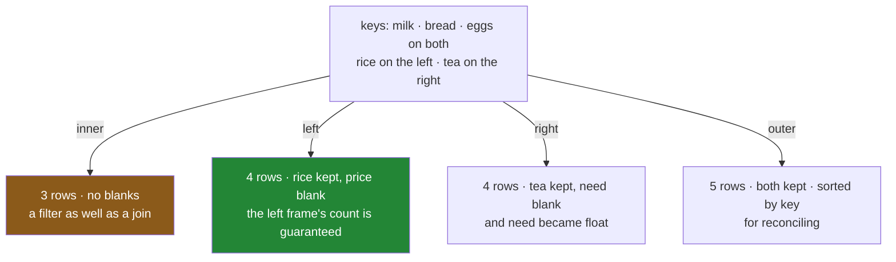

# 2.2 — The four `how`s, on four rows

## One-line answer

`how=` answers one question — *what happens to a row whose key is not on the other side?* — and the
four answers are: drop it (`inner`), keep the left's (`left`), keep the right's (`right`), keep
everything (`outer`), giving three, four, four and five rows from the same two four-row tables.

---

## The story

The two pieces of paper are still on the table. The shopping list has rice on it that the price sheet
has never heard of; the price sheet has tea on it that nobody is buying.

Four different people would combine them four different ways, and each of them would be right about a
different question.

**Somebody working out what the shop will cost** wants only the lines they can price. Rice has no
price, so it cannot be in the total; tea is not being bought, so it is irrelevant. Three lines.

**Somebody taking the list to the shop** wants every line they have to buy, priced where possible.
Rice stays, with an empty price box — they still have to pick up the rice. Tea does not appear,
because nobody wants tea. Four lines.

**Somebody auditing the price sheet** wants every priced item, marked with whether it is on the list.
Tea stays, with an empty quantity. Rice does not appear, because the price sheet is the thing being
checked. Four lines.

**Somebody reconciling the two sheets** wants everything from both, so they can see exactly what is
on one and not the other. Five lines, two of which are half empty — and those two lines are the whole
point of the exercise.

Same two sheets. Four correct answers, and the sheet does not say which question was asked.

---

## The idea in plain language

`how=` decides which rows survive when a key appears on only one side:

| `how` | keeps | in this example |
|---|---|---|
| `"inner"` (default) | only keys in **both** | 3 rows — no rice, no tea |
| `"left"` | every row of the **left** frame | 4 rows — rice with blanks |
| `"right"` | every row of the **right** frame | 4 rows — tea with blanks |
| `"outer"` | every row of **both** | 5 rows — rice and tea, both with blanks |

Every unmatched row gets **blanks in the columns that came from the other side**. That is the second
half of the mechanism and it is easy to lose sight of: a left join does not just keep the rice row, it
keeps it *with an empty price*, and everything Day 30 said about blanks now applies to a column that
had none before the merge
([Day 30, 1.1](../../../day-30-missing-data/parts/01-what-missing-means/1.1-the-price-nobody-wrote-down.md)).

Two consequences follow immediately, and both catch people.

**A blank introduced by a join changes the column's dtype.** An integer column with a blank in it
becomes a float, so `need` comes back as `2.0` rather than `2` after a right or outer join
([Day 30, 1.5](../../../day-30-missing-data/parts/01-what-missing-means/1.5-one-dtype-one-kind-of-blank.md)).
Nothing warns. A count that prints as `2.0` in a report is this.

**An inner join is a filter.** It is the default, so it is what you get when you do not think about
it, and it removes rows for a reason that has nothing to do with the analysis — *this key was not in
the other table* — while looking exactly like a join. That is
[3.4](../03-the-row-count/3.4-the-join-that-dropped-forty-per-cent.md)'s subject and it is the most
consequential default on the day.

Two smaller behaviours worth knowing:

- **`left` and `right` are the same operation with the frames swapped.** `a.merge(b, how="right")` and
  `b.merge(a, how="left")` give the same rows, in a different column order. Almost everyone writes
  `how="left"` and reorders the call instead, because "keep everything from the frame I started with"
  is easier to hold in your head.
- **`outer` sorts the result by key; the others do not.** An inner or left join keeps the left frame's
  row order. An outer join sorts, because it has to interleave rows from both sides and there is no
  other defensible order. If a merge suddenly reorders your rows, this is why.

The rule for choosing: **say which table you are protecting.** A left join says *every row of this
table must survive.* An inner join says *I only want rows I can complete.* Write down which of those
two sentences is true before writing `how=`, and the argument chooses itself.

---

## Why Setu needs it

- **[2.1](2.1-the-key-and-the-rows-it-pairs.md)** left the rice-and-tea question open. This closes it.
- **[3.1](../03-the-row-count/3.1-count-the-rows-before-and-after.md)** turns the row counts in the
  table above into a check you run every time.
- **[3.4](../03-the-row-count/3.4-the-join-that-dropped-forty-per-cent.md)** is what happens when the
  default is used on real data whose keys do not line up.
- **Day 42** is `JOIN` in SQL, where these are `INNER JOIN`, `LEFT JOIN`, `RIGHT JOIN` and `FULL OUTER
  JOIN` — the same four, the same defaults problem, a different spelling.
- **Day 45** is the Phase 4 gate: a *joined* dataset whose row count is explained.

---

## The mechanism

The two tables from [2.1](2.1-the-key-and-the-rows-it-pairs.md), joined four ways:

```python
import pandas as pd

wanted = pd.DataFrame(
    {
        "item": pd.Series(["milk", "bread", "eggs", "rice"], dtype="str"),
        "need": [2, 1, 6, 1],
    }
)

prices = pd.DataFrame(
    {
        "item": pd.Series(["milk", "bread", "eggs", "tea"], dtype="str"),
        "price": [1.15, 1.40, 0.32, 3.10],
        "aisle": pd.Series(["dairy", "bakery", "dairy", "dry"], dtype="str"),
    }
)

for how in ("inner", "left", "right", "outer"):
    print(f"{how:6} {len(wanted.merge(prices, on='item', how=how))} rows")
```

**Line by line:**

- The loop runs the same merge four times, changing one word. **Nothing else differs** — same key,
  same tables, same columns out.
- `f"{how:6}"` pads the name so the counts line up and the four numbers can be read as a column.
- Three, four, four, five. Two four-row tables, and the answer is between three and five rows
  depending on a default you may not have thought about.

```text
inner  3 rows
left   4 rows
right  4 rows
outer  5 rows
```

**`inner` — only what matched:**

```python
print(wanted.merge(prices, on="item", how="inner"))
```

**Line by line:**

- The default. Rice and tea are both gone, and the frame is complete — no blanks anywhere.
- The row order is the **left frame's**: milk, bread, eggs, in the order `wanted` had them.
- `need` is still `int64`, because no blanks were introduced. Compare with the right join below.

```text
    item  need  price   aisle
0   milk     2   1.15   dairy
1  bread     1   1.40  bakery
2   eggs     6   0.32   dairy
```

**`left` — every row of the shopping list:**

```python
print(wanted.merge(prices, on="item", how="left"))
```

**Line by line:**

- The rice row survives, with `NaN` in `price` and `aisle`. **The blank is created by the join** — it
  did not exist in either input.
- `need` is still an integer, because the blanks landed only in the columns from the right side and
  those were already float and text.
- Row order is still the left frame's, rice last because it was last.
- **This is the shape to reach for by default in a pipeline.** It guarantees the row count of the
  thing you started with, which makes the merge checkable
  ([3.1](../03-the-row-count/3.1-count-the-rows-before-and-after.md)).

```text
    item  need  price   aisle
0   milk     2   1.15   dairy
1  bread     1   1.40  bakery
2   eggs     6   0.32   dairy
3   rice     1    NaN     NaN
```

**`right` — every row of the price sheet:**

```python
print(wanted.merge(prices, on="item", how="right"))
print()
print(wanted.merge(prices, on="item", how="right").dtypes)
```

**Line by line:**

- Tea survives with a blank `need`; rice is gone.
- **Look at the `need` column: `2.0`, `1.0`, `6.0`, `NaN`.** It was `int64` going in and it is
  `float64` coming out, because a blank cannot live in an integer column
  ([Day 30, 1.5](../../../day-30-missing-data/parts/01-what-missing-means/1.5-one-dtype-one-kind-of-blank.md)).
  Nothing warned. A quantity printing as `2.0` in a report is exactly this.
- The nullable `Int64` dtype avoids it, at the cost of having to declare it
  ([Day 30, 1.4](../../../day-30-missing-data/parts/01-what-missing-means/1.4-pd-na-and-the-answer-unknown.md)).
- Row order now follows the **right** frame's, which is a second thing that changed with one word.

```text
    item  need  price   aisle
0   milk   2.0   1.15   dairy
1  bread   1.0   1.40  bakery
2   eggs   6.0   0.32   dairy
3    tea   NaN   3.10     dry

item         str
need     float64
price    float64
aisle        str
dtype: object
```

**`outer` — everything from both:**

```python
print(wanted.merge(prices, on="item", how="outer"))
```

**Line by line:**

- Five rows: the three that matched, plus rice with no price and tea with no quantity.
- **The rows come out sorted by key** — bread, eggs, milk, rice, tea — not in either input's order.
  Neither order would be right, so pandas sorts.
- Two rows are half empty, and under an outer join that is not a defect; it is the finding. This shape
  plus `indicator=True` from [2.1](2.1-the-key-and-the-rows-it-pairs.md) is how you reconcile two
  tables that are supposed to agree.

```text
    item  need  price   aisle
0  bread   1.0   1.40  bakery
1   eggs   6.0   0.32   dairy
2   milk   2.0   1.15   dairy
3   rice   1.0    NaN     NaN
4    tea   NaN   3.10     dry
```



---

## When it breaks

**The integer column that became a float:**

```text
$ uv run python -c "
import pandas as pd
wanted = pd.DataFrame({'item': ['milk', 'bread'], 'need': [2, 1]})
prices = pd.DataFrame({'item': ['milk', 'tea'], 'price': [1.15, 3.10]})
out = wanted.merge(prices, on='item', how='outer')
print(out)
print()
print('need dtype in :', wanted['need'].dtype)
print('need dtype out:', out['need'].dtype)
print('total items   :', out['need'].sum())
"
```

```text
    item  need  price
0  bread   1.0    NaN
1   milk   2.0   1.15
2    tea   NaN   3.10

need dtype in : int64
need dtype out: float64
total items   : 3.0
```

**What it means.** The quantity column went in as whole numbers and came out as `2.0` and `1.0`, and
the total of "how many things are we buying" is now `3.0`. **No error and no warning** — the blank
introduced by the join forced the dtype change. It matters in three places: a report that shows
quantities with a decimal point, a test that compares `3` against `3.0` with `is`, and a database
column typed as an integer that now refuses the write. Declaring the column as the nullable `Int64`
before the merge keeps it whole ([Day 30, 1.4](../../../day-30-missing-data/parts/01-what-missing-means/1.4-pd-na-and-the-answer-unknown.md)).

**The row order that changed with the `how`:**

```text
$ uv run python -c "
import pandas as pd
wanted = pd.DataFrame({'item': ['milk', 'bread', 'eggs'], 'need': [2, 1, 6]})
prices = pd.DataFrame({'item': ['milk', 'bread', 'eggs'], 'price': [1.15, 1.40, 0.32]})
print('left :', wanted.merge(prices, on='item', how='left')['item'].tolist())
print('inner:', wanted.merge(prices, on='item', how='inner')['item'].tolist())
print('outer:', wanted.merge(prices, on='item', how='outer')['item'].tolist())
"
```

```text
left : ['milk', 'bread', 'eggs']
inner: ['milk', 'bread', 'eggs']
outer: ['bread', 'eggs', 'milk']
```

**What it means.** The keys match perfectly here — every item is on both sides — so all three joins
return the same three rows. The **order** differs: `outer` sorted them alphabetically and the others
kept the left frame's order. Nothing raised. If something downstream compares rows by position, or
writes a file that is diffed against yesterday's, switching to an outer join to "be safe" silently
rewrites the whole output.

**The left join that still lost rows:**

```text
$ uv run python -c "
import pandas as pd
wanted = pd.DataFrame({'item': ['milk', 'bread'], 'need': [2, 1]})
prices = pd.DataFrame({'item': ['milk', 'milk', 'bread'], 'price': [1.15, 1.20, 1.40]})
out = wanted.merge(prices, on='item', how='left')
print(out)
print('left rows:', len(wanted), '-> out rows:', len(out))
"
```

```text
    item  need  price
0   milk     2   1.15
1   milk     2   1.20
2  bread     1   1.40
```

**What it means.** A left join is usually described as "keeps every row of the left frame", and it
does — but it does **not** guarantee the row *count*, because a key that appears twice on the right
produces two rows. The milk line is now two lines with the same quantity, so any total of `need` is
now wrong by two. **No error.** This is
[3.2](../03-the-row-count/3.2-the-duplicate-that-multiplied-rows.md), and it is the reason "I used a
left join so nothing was lost" is not a safety argument on its own.

---

## In production

**What a professional writes instead of the teaching version.** The `how` is chosen by naming the
guarantee, and the guarantee is then asserted:

```python
import logging

import pandas as pd

log = logging.getLogger(__name__)


def attach(
    left: pd.DataFrame,
    right: pd.DataFrame,
    on: list[str],
    how: str = "left",
    expect: str = "many_to_one",
) -> tuple[pd.DataFrame, dict[str, int]]:
    """Attach `right`'s columns to `left`, returning the frame and the match counts.

    Defaults to a left join, so the row count is guaranteed not to shrink, and to
    `many_to_one`, so it is guaranteed not to grow. Together those two make the row
    count of the result equal to the row count of `left` — the only property that
    makes a merge checkable in one line.
    """
    before = len(left)
    out = left.merge(right, on=on, how=how, validate=expect, indicator=True)

    if how == "left" and len(out) != before:
        raise ValueError(f"left join changed the row count: {before} -> {len(out)}")

    counts = {str(k): int(v) for k, v in out["_merge"].value_counts().items()}
    log.info("merged on %s (%s): %s", on, how, counts)
    return out.drop(columns="_merge"), counts
```

**Line by line:**

- The docstring's second paragraph states **the guarantee**, not the mechanism: the result has as many
  rows as `left`. That sentence is what a caller needs, and it is what the two arguments together buy.
- `how: str = "left"` — the default is the one with a guarantee. An inner join's row count depends on
  the data, so it cannot be asserted, which makes it the wrong default for a function other people
  call.
- `validate=expect` with `"many_to_one"` asks pandas to check that the right side's keys are unique,
  which is what stops the row multiplication in the last failure above
  ([3.3](../03-the-row-count/3.3-validate-and-the-merge-error.md)). Without it, `how="left"` alone
  guarantees nothing about the count.
- The explicit `len(out) != before` check is belt and braces: `validate` covers the duplicate case and
  the assertion covers everything else, including a future change to `how`.
- `indicator=True` and `value_counts()` so the match rate is **available**, not merely implied by a
  row-count difference — which under a left join is zero even when nothing matched.
- The counts are **returned alongside the frame**, not attached to it. pandas has a `frame.attrs`
  dictionary for metadata and it does not survive most operations, so anything a caller must not lose
  belongs in the return value or in a log line.
- `out.drop(columns="_merge")` before returning, so the diagnostic column does not leak into whatever
  consumes the frame — a common way for a schema to gain a mysterious extra field.

**What changes at scale.** The four `how`s cost roughly the same — pandas builds a hash table from one
side and probes it — and the differences that matter are in the output size and the sort. An outer
join has to sort the combined key set, which is genuinely more work, and it produces the largest
result. In a pipeline the practical rule is stronger than the performance one: **use a left join and
assert the row count.** It is the only variant whose output size you know before running it, which
means it is the only one whose cost you can predict and the only one where a data problem shows up as
an assertion rather than as an out-of-memory error. Inner joins belong at the point where you are
deliberately filtering and have said so; outer joins belong in reconciliation scripts, where the
half-empty rows are the output.

**The failure mode that only appears with real data.** A left join is used correctly and the unmatched
rate is never checked. On day one, two per cent of rows find no match and every downstream average
quietly excludes them, because a blank is skipped by `mean`
([Day 30, 1.1](../../../day-30-missing-data/parts/01-what-missing-means/1.1-the-price-nobody-wrote-down.md)).
Six months later a lookup table stops being refreshed, the unmatched rate reaches forty per cent, and
nothing changes about the code, the row count or the errors — the averages just drift. **A left join
converts a missing row into a missing value**, which is more honest and no more visible. The monitor
is the match rate, from `indicator=True`.

**The review comment a senior engineer leaves.** *"This is an inner join on `product_id`, so any
transaction whose product is missing from the dimension table disappears from revenue. Make it a left
join, add `validate='many_to_one'`, and alert when the unmatched share goes above 1% — we lost three
days to exactly this in the March close."*

**The interview question.** *"What is the difference between an inner join and a left join?"* An inner
join keeps only keys present in both tables, so it drops rows and acts as a filter; a left join keeps
every row of the left table, filling the right table's columns with nulls where there was no match.
The follow-up that separates people who have shipped one: *"does a left join guarantee the row
count?"* No — it guarantees no row is lost, but a duplicated key on the right multiplies rows, so the
count is only guaranteed if the right side's keys are unique, which is what `validate="many_to_one"`
checks.

---

## Check yourself

```bash
uv run python -c "
import pandas as pd
wanted = pd.DataFrame({
    'item': pd.Series(['milk', 'bread', 'eggs', 'rice'], dtype='str'),
    'need': [2, 1, 6, 1],
})
prices = pd.DataFrame({
    'item': pd.Series(['milk', 'bread', 'eggs', 'tea'], dtype='str'),
    'price': [1.15, 1.40, 0.32, 3.10],
})
for how in ('inner', 'left', 'right', 'outer'):
    out = wanted.merge(prices, on='item', how=how)
    print(f'{how:6} {len(out)} rows  need dtype {str(out[\"need\"].dtype):8} '
          f'order {out[\"item\"].tolist()}')
"
```

Two of the four changed the dtype of a column that was never touched by the join, and one of the four
changed the row order. Say which, and say what caused each.

**Answer out loud, without scrolling up:**

> Give the one question `how=` answers, in a single sentence. Then say which of the four you would use
> in a pipeline that must not lose rows, and say why that choice alone does not guarantee the row
> count.

---

**Next:** [2.3 — When the key has two names](2.3-when-the-key-has-two-names.md).
